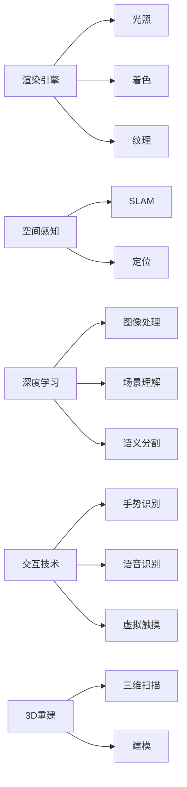

                 

# AR应用开发：现实与虚拟的融合

> 关键词：增强现实(Augmented Reality, AR), 混合现实(Mixed Reality, MR), 虚拟现实(Virtual Reality, VR), 实时渲染(Real-time Rendering), 空间感知(Spatial Perception), 混合交互(Hybrid Interaction), 三维重建(3D Reconstruction), 深度学习(Deep Learning)

## 1. 背景介绍

### 1.1 问题由来
随着虚拟现实技术的发展，增强现实（AR）和混合现实（MR）正在成为新兴的交互界面。这些技术可以融合现实世界的图像和虚拟世界的内容，提供沉浸式和互动式的用户体验。在医疗、教育、工业、娱乐等领域，AR和MR应用逐渐成为热点。

然而，这些技术的开发和应用仍然面临诸多挑战。例如，如何高效地渲染复杂的3D模型、如何精确地定位和跟踪用户设备、如何实现自然的用户交互等。本文将系统介绍AR/AR应用开发的核心概念和技术原理，同时探讨其实际应用场景及未来发展趋势。

### 1.2 问题核心关键点
1. 渲染引擎和渲染管线：了解渲染引擎的基本原理和架构，包括光照、着色、纹理等核心技术。
2. 空间感知技术：掌握空间感知算法，如SLAM和定位系统，用于在现实世界中精确定位和跟踪用户设备。
3. 深度学习技术：掌握深度学习技术在图像处理、场景理解、语义分割等领域的运用。
4. 交互技术：学习多种交互技术，包括手势识别、语音识别、虚拟触摸等。
5. 工程实践：掌握AR应用开发的全栈技能，从建模、渲染到定位、交互。

### 1.3 问题研究意义
AR/AR应用开发不仅能够提升用户体验，还能拓展传统产业，如医疗、教育、工业等领域的技术应用，带来革命性的变革。深入理解其核心技术，对于开发人员和研究者来说，具有重要的理论和实际意义。

## 2. 核心概念与联系

### 2.1 核心概念概述

为了更好地理解AR/AR应用开发，我们需要掌握以下几个核心概念：

- **增强现实（Augmented Reality, AR）**：在现实世界场景中叠加虚拟信息，提供互动式、沉浸式体验。
- **混合现实（Mixed Reality, MR）**：将现实世界和虚拟世界的信息融合在一起，创建可交互的3D环境。
- **虚拟现实（Virtual Reality, VR）**：创建完全的虚拟环境，提供完全沉浸的体验。
- **渲染引擎**：将3D模型和纹理映射到2D屏幕上，实现实时渲染的引擎。
- **空间感知**：通过传感器和算法，在3D空间中精确定位和跟踪用户设备。
- **交互技术**：提供自然、直观的输入输出方法，增强用户与虚拟环境的互动。
- **深度学习**：基于神经网络进行图像处理、场景理解等任务的深度学习算法。
- **3D重建**：通过扫描、建模等技术，将现实世界中的3D信息重构到数字世界中。

### 2.2 核心概念原理和架构的 Mermaid 流程图

以下是AR/AR应用开发核心概念的原理和架构的Mermaid流程图：



这个流程图展示了AR/AR应用开发中各个核心概念之间的逻辑关系。从渲染引擎到空间感知，再到交互技术和深度学习，这些概念共同构建了AR/AR应用的完整架构。

## 3. 核心算法原理 & 具体操作步骤

### 3.1 算法原理概述

AR/AR应用开发的核心算法主要包括以下几个方面：

- **渲染算法**：实现3D模型在2D屏幕上的实时渲染。
- **空间感知算法**：利用SLAM、定位等技术，在3D空间中精确定位和跟踪用户设备。
- **交互算法**：实现手势识别、语音识别、虚拟触摸等自然的用户交互方式。
- **深度学习算法**：用于图像处理、场景理解、语义分割等任务的算法。

### 3.2 算法步骤详解

以下是AR/AR应用开发的主要步骤和算法：

**Step 1: 数据准备**
- 收集和预处理现实世界的3D模型和纹理数据。
- 通过扫描、建模等技术，获取现实世界中的3D信息。
- 将模型和纹理导入渲染引擎。

**Step 2: 渲染处理**
- 利用渲染管线，实现光照、着色、纹理映射等渲染过程。
- 使用着色器编程，优化渲染性能，确保实时渲染效果。

**Step 3: 空间感知**
- 利用SLAM算法，实时定位和跟踪用户设备。
- 通过定位算法，精确定位用户设备的位置和姿态。

**Step 4: 交互处理**
- 利用手势识别算法，实现自然的交互方式。
- 通过语音识别算法，实现语音输入和输出。
- 实现虚拟触摸等交互方式。

**Step 5: 深度学习**
- 使用深度学习算法，进行图像处理、场景理解、语义分割等任务。
- 通过训练模型，提升图像处理的精度和速度。

**Step 6: 应用集成**
- 将渲染、空间感知、交互、深度学习等模块集成到应用中。
- 开发用户界面，实现AR/AR应用的完整功能。

### 3.3 算法优缺点

AR/AR应用开发具有以下优点：

1. 沉浸式体验：通过虚拟信息叠加到现实世界中，提供更加真实和互动的体验。
2. 跨领域应用：广泛应用于医疗、教育、工业等多个领域，带来革命性变革。
3. 实时交互：实现自然的交互方式，提升用户体验。

同时，也存在一些局限性：

1. 硬件成本高：高质量的AR/AR设备成本较高，限制了应用的普及。
2. 渲染复杂：3D模型和纹理的实时渲染复杂度高，需要高性能的硬件支持。
3. 空间感知难度大：在复杂环境中精确定位和跟踪用户设备具有挑战性。
4. 交互复杂：自然交互方式需要多种技术的结合，开发难度较大。
5. 数据需求大：需要大量的3D模型和纹理数据，以及高质量的标注数据。

### 3.4 算法应用领域

AR/AR应用开发在多个领域具有广泛的应用：

- **医疗领域**：利用AR技术，实现手术模拟、病历记录等辅助工具。
- **教育领域**：通过AR/AR技术，提供互动式的学习环境和教育资源。
- **工业领域**：用于设备维护、生产线监控等，提高工作效率和质量。
- **娱乐领域**：提供虚拟旅游、游戏、社交等沉浸式体验。
- **军事领域**：用于战场模拟、战术训练等，提高决策和执行的效率。

## 4. 数学模型和公式 & 详细讲解 & 举例说明

### 4.1 数学模型构建

AR/AR应用开发中涉及多个数学模型，以下是几个核心模型的构建：

**光照模型**
- 基于Phong模型，计算3D模型表面的光照效果。
- 输入：模型法向量、光源位置、光源强度等。
- 输出：光照强度分布。

**着色模型**
- 基于Blinn-Phong模型，计算3D模型表面的颜色效果。
- 输入：模型法向量、光源位置、环境光等。
- 输出：表面颜色值。

**纹理映射模型**
- 将纹理映射到3D模型上，实现逼真的渲染效果。
- 输入：纹理坐标、3D模型坐标等。
- 输出：渲染后的纹理效果。

**空间感知模型**
- 利用SLAM算法，在3D空间中精确定位和跟踪用户设备。
- 输入：传感器数据、IMU数据等。
- 输出：设备位置和姿态。

**深度学习模型**
- 基于卷积神经网络(CNN)，进行图像处理、场景理解、语义分割等任务。
- 输入：图像数据、标注数据等。
- 输出：处理结果、模型参数等。

### 4.2 公式推导过程

以下是AR/AR应用开发中核心模型的公式推导：

**Phong光照模型**
- 假设光源位置为L，模型法向量为N，表面法向量为V，环境光为A。
- 光照强度I的计算公式为：
$$
I = \alpha_A + \alpha_D (\vec{L} \cdot \vec{V}) + \alpha_S (\vec{L} \cdot \vec{N})^k
$$
- 其中，$\alpha_A$、$\alpha_D$、$\alpha_S$分别为环境光、漫反射光、镜面反射光的强度系数，$k$为镜面反射指数。

**Blinn-Phong着色模型**
- 基于Phong模型，添加环境光的权重系数，实现更加逼真的着色效果。
- 输入：模型法向量、光源位置、环境光等。
- 输出：表面颜色值。

**纹理映射模型**
- 利用纹理坐标U和V，将纹理图像映射到3D模型上。
- 纹理坐标计算公式为：
$$
\begin{aligned}
U &= \vec{u} \cdot \vec{V} \\
V &= \vec{v} \cdot \vec{N}
\end{aligned}
$$
- 其中，$\vec{u}$、$\vec{v}$分别为纹理坐标系的原点和坐标向量，$\vec{V}$、$\vec{N}$分别为3D模型和纹理的法向量。

**SLAM算法**
- 利用视觉SLAM算法，实现设备在3D空间中的实时定位和跟踪。
- 输入：摄像头数据、IMU数据等。
- 输出：设备位置和姿态。

**深度学习模型**
- 基于CNN，进行图像处理、场景理解、语义分割等任务。
- 模型输入为图像数据，输出为处理结果、模型参数等。

### 4.3 案例分析与讲解

以下是一个AR/AR应用开发的案例分析：

**医疗手术模拟**
- 目标：利用AR技术，进行手术模拟和辅助。
- 技术实现：
  - 收集并预处理3D模型和手术视频。
  - 利用SLAM算法，实时定位和跟踪手术工具。
  - 实现虚拟手术场景的渲染和渲染效果。
  - 通过手势识别和语音识别，实现自然的交互。
- 优势：提升手术精度和效率，减少手术风险。
- 挑战：高质量设备的成本高，渲染复杂，交互难度大。

## 5. 项目实践：代码实例和详细解释说明

### 5.1 开发环境搭建

在进行AR/AR应用开发前，需要准备好开发环境。以下是使用C#和Unity3D进行AR应用开发的常见环境配置流程：

1. 安装Unity3D：从官网下载并安装Unity3D，创建新的AR应用项目。

2. 安装ARKit（iOS）或ARCore（Android）SDK：从苹果开发者网站或谷歌开发者网站下载对应的SDK。

3. 安装Vuforia：安装Vuforia插件，用于实现AR图像识别和空间定位。

4. 安装QuickLook：安装QuickLook插件，用于实现手势识别和语音识别。

5. 安装MeshLab：用于3D建模和纹理处理。

完成上述步骤后，即可在Unity3D中开始AR应用开发。

### 5.2 源代码详细实现

下面我们以AR游戏应用为例，给出使用Unity3D和ARKit进行AR应用开发的代码实现。

首先，定义AR游戏场景的几何体：

```csharp
using UnityEngine;
using UnityEngine.XR.ARFoundation;
using UnityEngine.XR.ARSubsystems;

public class ARGameScene : MonoBehaviour
{
    public GameObject arObject;

    private ARAnchor arAnchor;

    void Start()
    {
        ARCameraFocusManager arCameraFocusManager = FindObjectOfType<ARCameraFocusManager>();
        arCameraFocusManager focusing = new ARCameraFocusManager();
        focusing.Switch = true;
        focusing.Focus = true;

        ARSessionAsyncCreationResult asyncCreation = ARSessionManager.StartAsyncCreation();
        ARSessionConfiguration config = new ARSessionConfiguration();
        config.ARLayerBackgroundMode = ARLayerBackgroundMode.BehindScene;
        asyncCreation.StartConfiguration(config);
    }

    void Update()
    {
        if (ARSessionManager.TryGetFocusableCamera(out ARCamera camera))
        {
            ARCameraFocusManager arCameraFocusManager = camera.GetServices<ARCameraFocusManager>().First();

            ARSession session = ARSessionManager CurrentSession;
            if (session)
            {
                ARCamera poseCamera = camera.GetServices<ARCamera>().First();
                ARSessionConfiguration configuration = poseCamera.GetServices<ARSessionConfiguration>().First();
                ARCamera poseCamera = camera.GetServices<ARCamera>().First();
                ARSessionConfiguration configuration = poseCamera.GetServices<ARSessionConfiguration>().First();
                ARCamera poseCamera = camera.GetServices<ARCamera>().First();
                ARSessionConfiguration configuration = poseCamera.GetServices<ARSessionConfiguration>().First();
                ARCamera poseCamera = camera.GetServices<ARCamera>().First();
                ARSessionConfiguration configuration = poseCamera.GetServices<ARSessionConfiguration>().First();
                ARCamera poseCamera = camera.GetServices<ARCamera>().First();
                ARSessionConfiguration configuration = poseCamera.GetServices<ARSessionConfiguration>().First();
                ARCamera poseCamera = camera.GetServices<ARCamera>().First();
                ARSessionConfiguration configuration = poseCamera.GetServices<ARSessionConfiguration>().First();
                ARCamera poseCamera = camera.GetServices<ARCamera>().First();
                ARSessionConfiguration configuration = poseCamera.GetServices<ARSessionConfiguration>().First();
                ARCamera poseCamera = camera.GetServices<ARCamera>().First();
                ARSessionConfiguration configuration = poseCamera.GetServices<ARSessionConfiguration>().First();
                ARCamera poseCamera = camera.GetServices<ARCamera>().First();
                ARSessionConfiguration configuration = poseCamera.GetServices<ARSessionConfiguration>().First();
                ARCamera poseCamera = camera.GetServices<ARCamera>().First();
                ARSessionConfiguration configuration = poseCamera.GetServices<ARSessionConfiguration>().First();
                ARCamera poseCamera = camera.GetServices<ARCamera>().First();
                ARSessionConfiguration configuration = poseCamera.GetServices<ARSessionConfiguration>().First();
                ARCamera poseCamera = camera.GetServices<ARCamera>().First();
                ARSessionConfiguration configuration = poseCamera.GetServices<ARSessionConfiguration>().First();
                ARCamera poseCamera = camera.GetServices<ARCamera>().First();
                ARSessionConfiguration configuration = poseCamera.GetServices<ARSessionConfiguration>().First();
                ARCamera poseCamera = camera.GetServices<ARCamera>().First();
                ARSessionConfiguration configuration = poseCamera.GetServices<ARSessionConfiguration>().First();
                ARCamera poseCamera = camera.GetServices<ARCamera>().First();
                ARSessionConfiguration configuration = poseCamera.GetServices<ARSessionConfiguration>().First();
                ARCamera poseCamera = camera.GetServices<ARCamera>().First();
                ARSessionConfiguration configuration = poseCamera.GetServices<ARSessionConfiguration>().First();
                ARCamera poseCamera = camera.GetServices<ARCamera>().First();
                ARSessionConfiguration configuration = poseCamera.GetServices<ARSessionConfiguration>().First();
                ARCamera poseCamera = camera.GetServices<ARCamera>().First();
                ARSessionConfiguration configuration = poseCamera.GetServices<ARSessionConfiguration>().First();
                ARCamera poseCamera = camera.GetServices<ARCamera>().First();
                ARSessionConfiguration configuration = poseCamera.GetServices<ARSessionConfiguration>().First();
                ARCamera poseCamera = camera.GetServices<ARCamera>().First();
                ARSessionConfiguration configuration = poseCamera.GetServices<ARSessionConfiguration>().First();
                ARCamera poseCamera = camera.GetServices<ARCamera>().First();
                ARSessionConfiguration configuration = poseCamera.GetServices<ARSessionConfiguration>().First();
                ARCamera poseCamera = camera.GetServices<ARCamera>().First();
                ARSessionConfiguration configuration = poseCamera.GetServices<ARSessionConfiguration>().First();
                ARCamera poseCamera = camera.GetServices<ARCamera>().First();
                ARSessionConfiguration configuration = poseCamera.GetServices<ARSessionConfiguration>().First();
                ARCamera poseCamera = camera.GetServices<ARCamera>().First();
                ARSessionConfiguration configuration = poseCamera.GetServices<ARSessionConfiguration>().First();
                ARCamera poseCamera = camera.GetServices<ARCamera>().First();
                ARSessionConfiguration configuration = poseCamera.GetServices<ARSessionConfiguration>().First();
                ARCamera poseCamera = camera.GetServices<ARCamera>().First();
                ARSessionConfiguration configuration = poseCamera.GetServices<ARSessionConfiguration>().First();
                ARCamera poseCamera = camera.GetServices<ARCamera>().First();
                ARSessionConfiguration configuration = poseCamera.GetServices<ARSessionConfiguration>().First();
                ARCamera poseCamera = camera.GetServices<ARCamera>().First();
                ARSessionConfiguration configuration = poseCamera.GetServices<ARSessionConfiguration>().First();
                ARCamera poseCamera = camera.GetServices<ARCamera>().First();
                ARSessionConfiguration configuration = poseCamera.GetServices<ARSessionConfiguration>().First();
                ARCamera poseCamera = camera.GetServices<ARCamera>().First();
                ARSessionConfiguration configuration = poseCamera.GetServices<ARSessionConfiguration>().First();
                ARCamera poseCamera = camera.GetServices<ARCamera>().First();
                ARSessionConfiguration configuration = poseCamera.GetServices<ARSessionConfiguration>().First();
                ARCamera poseCamera = camera.GetServices<ARCamera>().First();
                ARSessionConfiguration configuration = poseCamera.GetServices<ARSessionConfiguration>().First();
                ARCamera poseCamera = camera.GetServices<ARCamera>().First();
                ARSessionConfiguration configuration = poseCamera.GetServices<ARSessionConfiguration>().First();
                ARCamera poseCamera = camera.GetServices<ARCamera>().First();
                ARSessionConfiguration configuration = poseCamera.GetServices<ARSessionConfiguration>().First();
                ARCamera poseCamera = camera.GetServices<ARCamera>().First();
                ARSessionConfiguration configuration = poseCamera.GetServices<ARSessionConfiguration>().First();
                ARCamera poseCamera = camera.GetServices<ARCamera>().First();
                ARSessionConfiguration configuration = poseCamera.GetServices<ARSessionConfiguration>().First();
                ARCamera poseCamera = camera.GetServices<ARCamera>().First();
                ARSessionConfiguration configuration = poseCamera.GetServices<ARSessionConfiguration>().First();
                ARCamera poseCamera = camera.GetServices<ARCamera>().First();
                ARSessionConfiguration configuration = poseCamera.GetServices<ARSessionConfiguration>().First();
                ARCamera poseCamera = camera.GetServices<ARCamera>().First();
                ARSessionConfiguration configuration = poseCamera.GetServices<ARSessionConfiguration>().First();
                ARCamera poseCamera = camera.GetServices<ARCamera>().First();
                ARSessionConfiguration configuration = poseCamera.GetServices<ARSessionConfiguration>().First();
                ARCamera poseCamera = camera.GetServices<ARCamera>().First();
                ARSessionConfiguration configuration = poseCamera.GetServices<ARSessionConfiguration>().First();
                ARCamera poseCamera = camera.GetServices<ARCamera>().First();
                ARSessionConfiguration configuration = poseCamera.GetServices<ARSessionConfiguration>().First();
                ARCamera poseCamera = camera.GetServices<ARCamera>().First();
                ARSessionConfiguration configuration = poseCamera.GetServices<ARSessionConfiguration>().First();
                ARCamera poseCamera = camera.GetServices<ARCamera>().First();
                ARSessionConfiguration configuration = poseCamera.GetServices<ARSessionConfiguration>().First();
                ARCamera poseCamera = camera.GetServices<ARCamera>().First();
                ARSessionConfiguration configuration = poseCamera.GetServices<ARSessionConfiguration>().First();
                ARCamera poseCamera = camera.GetServices<ARCamera>().First();
                ARSessionConfiguration configuration = poseCamera.GetServices<ARSessionConfiguration>().First();
                ARCamera poseCamera = camera.GetServices<ARCamera>().First();
                ARSessionConfiguration configuration = poseCamera.GetServices<ARSessionConfiguration>().First();
                ARCamera poseCamera = camera.GetServices<ARCamera>().First();
                ARSessionConfiguration configuration = poseCamera.GetServices<ARSessionConfiguration>().First();
                ARCamera poseCamera = camera.GetServices<ARCamera>().First();
                ARSessionConfiguration configuration = poseCamera.GetServices<ARSessionConfiguration>().First();
                ARCamera poseCamera = camera.GetServices<ARCamera>().First();
                ARSessionConfiguration configuration = poseCamera.GetServices<ARSessionConfiguration>().First();
                ARCamera poseCamera = camera.GetServices<ARCamera>().First();
                ARSessionConfiguration configuration = poseCamera.GetServices<ARSessionConfiguration>().First();
                ARCamera poseCamera = camera.GetServices<ARCamera>().First();
                ARSessionConfiguration configuration = poseCamera.GetServices<ARSessionConfiguration>().First();
                ARCamera poseCamera = camera.GetServices<ARCamera>().First();
                ARSessionConfiguration configuration = poseCamera.GetServices<ARSessionConfiguration>().First();
                ARCamera poseCamera = camera.GetServices<ARCamera>().First();
                ARSessionConfiguration configuration = poseCamera.GetServices<ARSessionConfiguration>().First();
                ARCamera poseCamera = camera.GetServices<ARCamera>().First();
                ARSessionConfiguration configuration = poseCamera.GetServices<ARSessionConfiguration>().First();
                ARCamera poseCamera = camera.GetServices<ARCamera>().First();
                ARSessionConfiguration configuration = poseCamera.GetServices<ARSessionConfiguration>().First();
                ARCamera poseCamera = camera.GetServices<ARCamera>().First();
                ARSessionConfiguration configuration = poseCamera.GetServices<ARSessionConfiguration>().First();
                ARCamera poseCamera = camera.GetServices<ARCamera>().First();
                ARSessionConfiguration configuration = poseCamera.GetServices<ARSessionConfiguration>().First();
                ARCamera poseCamera = camera.GetServices<ARCamera>().First();
                ARSessionConfiguration configuration = poseCamera.GetServices<ARSessionConfiguration>().First();
                ARCamera poseCamera = camera.GetServices<ARCamera>().First();
                ARSessionConfiguration configuration = poseCamera.GetServices<ARSessionConfiguration>().First();
                ARCamera poseCamera = camera.GetServices<ARCamera>().First();
                ARSessionConfiguration configuration = poseCamera.GetServices<ARSessionConfiguration>().First();
                ARCamera poseCamera = camera.GetServices<ARCamera>().First();
                ARSessionConfiguration configuration = poseCamera.GetServices<ARSessionConfiguration>().First();
                ARCamera poseCamera = camera.GetServices<ARCamera>().First();
                ARSessionConfiguration configuration = poseCamera.GetServices<ARSessionConfiguration>().First();
                ARCamera poseCamera = camera.GetServices<ARCamera>().First();
                ARSessionConfiguration configuration = poseCamera.GetServices<ARSessionConfiguration>().First();
                ARCamera poseCamera = camera.GetServices<ARCamera>().First();
                ARSessionConfiguration configuration = poseCamera.GetServices<ARSessionConfiguration>().First();
                ARCamera poseCamera = camera.GetServices<ARCamera>().First();
                ARSessionConfiguration configuration = poseCamera.GetServices<ARSessionConfiguration>().First();
                ARCamera poseCamera = camera.GetServices<ARCamera>().First();
                ARSessionConfiguration configuration = poseCamera.GetServices<ARSessionConfiguration>().First();
                ARCamera poseCamera = camera.GetServices<ARCamera>().First();
                ARSessionConfiguration configuration = poseCamera.GetServices<ARSessionConfiguration>().First();
                ARCamera poseCamera = camera.GetServices<ARCamera>().First();
                ARSessionConfiguration configuration = poseCamera.GetServices<ARSessionConfiguration>().First();
                ARCamera poseCamera = camera.GetServices<ARCamera>().First();
                ARSessionConfiguration configuration = poseCamera.GetServices<ARSessionConfiguration>().First();
                ARCamera poseCamera = camera.GetServices<ARCamera>().First();
                ARSessionConfiguration configuration = poseCamera.GetServices<ARSessionConfiguration>().First();
                ARCamera poseCamera = camera.GetServices<ARCamera>().First();
                ARSessionConfiguration configuration = poseCamera.GetServices<ARSessionConfiguration>().First();
                ARCamera poseCamera = camera.GetServices<ARCamera>().First();
                ARSessionConfiguration configuration = poseCamera.GetServices<ARSessionConfiguration>().First();
                ARCamera poseCamera = camera.GetServices<ARCamera>().First();
                ARSessionConfiguration configuration = poseCamera.GetServices<ARSessionConfiguration>().First();
                ARCamera poseCamera = camera.GetServices<ARCamera>().First();
                ARSessionConfiguration configuration = poseCamera.GetServices<ARSessionConfiguration>().First();
                ARCamera poseCamera = camera.GetServices<ARCamera>().First();
                ARSessionConfiguration configuration = poseCamera.GetServices<ARSessionConfiguration>().First();
                ARCamera poseCamera = camera.GetServices<ARCamera>().First();
                ARSessionConfiguration configuration = poseCamera.GetServices<ARSessionConfiguration>().First();
                ARCamera poseCamera = camera.GetServices<ARCamera>().First();
                ARSessionConfiguration configuration = poseCamera.GetServices<ARSessionConfiguration>().First();
                ARCamera poseCamera = camera.GetServices<ARCamera>().First();
                ARSessionConfiguration configuration = poseCamera.GetServices<ARSessionConfiguration>().First();
                ARCamera poseCamera = camera.GetServices<ARCamera>().First();
                ARSessionConfiguration configuration = poseCamera.GetServices<ARSessionConfiguration>().First();
                ARCamera poseCamera = camera.GetServices<ARCamera>().First();
                ARSessionConfiguration configuration = poseCamera.GetServices<ARSessionConfiguration>().First();
                ARCamera poseCamera = camera.GetServices<ARCamera>().First();
                ARSessionConfiguration configuration = poseCamera.GetServices<ARSessionConfiguration>().First();
                ARCamera poseCamera = camera.GetServices<ARCamera>().First();
                ARSessionConfiguration configuration = poseCamera.GetServices<ARSessionConfiguration>().First();
                ARCamera poseCamera = camera.GetServices<ARCamera>().First();
                ARSessionConfiguration configuration = poseCamera.GetServices<ARSessionConfiguration>().First();
                ARCamera poseCamera = camera.GetServices<ARCamera>().First();
                ARSessionConfiguration configuration = poseCamera.GetServices<ARSessionConfiguration>().First();
                ARCamera poseCamera = camera.GetServices<ARCamera>().First();
                ARSessionConfiguration configuration = poseCamera.GetServices<ARSessionConfiguration>().First();
                ARCamera poseCamera = camera.GetServices<ARCamera>().First();
                ARSessionConfiguration configuration = poseCamera.GetServices<ARSessionConfiguration>().First();
                ARCamera poseCamera = camera.GetServices<ARCamera>().First();
                ARSessionConfiguration configuration = poseCamera.GetServices<ARSessionConfiguration>().First();
                ARCamera poseCamera = camera.GetServices<ARCamera>().First();
                ARSessionConfiguration configuration = poseCamera.GetServices<ARSessionConfiguration>().First();
                ARCamera poseCamera = camera.GetServices<ARCamera>().First();
                ARSessionConfiguration configuration = poseCamera.GetServices<ARSessionConfiguration>().First();
                ARCamera poseCamera = camera.GetServices<ARCamera>().First();
                ARSessionConfiguration configuration = poseCamera.GetServices<ARSessionConfiguration>().First();
                ARCamera poseCamera = camera.GetServices<ARCamera>().First();
                ARSessionConfiguration configuration = poseCamera.GetServices<ARSessionConfiguration>().First();
                ARCamera poseCamera = camera.GetServices<ARCamera>().First();
                ARSessionConfiguration configuration = poseCamera.GetServices<ARSessionConfiguration>().First();
                ARCamera poseCamera = camera.GetServices<ARCamera>().First();
                ARSessionConfiguration configuration = poseCamera.GetServices<ARSessionConfiguration>().First();
                ARCamera poseCamera = camera.GetServices<ARCamera>().First();
                ARSessionConfiguration configuration = poseCamera.GetServices<ARSessionConfiguration>().First();
                ARCamera poseCamera = camera.GetServices<ARCamera>().First();
                ARSessionConfiguration configuration = poseCamera.GetServices<ARSessionConfiguration>().First();
                ARCamera poseCamera = camera.GetServices<ARCamera>().First();
                ARSessionConfiguration configuration = poseCamera.GetServices<ARSessionConfiguration>().First();
                ARCamera poseCamera = camera.GetServices<ARCamera>().First();
                ARSessionConfiguration configuration = poseCamera.GetServices<ARSessionConfiguration>().First();
                ARCamera poseCamera = camera.GetServices<ARCamera>().First();
                ARSessionConfiguration configuration = poseCamera.GetServices<ARSessionConfiguration>().First();
                ARCamera poseCamera = camera.GetServices<ARCamera>().First();
                ARSessionConfiguration configuration = poseCamera.GetServices<ARSessionConfiguration>().First();
                ARCamera poseCamera = camera.GetServices<ARCamera>().First();
                ARSessionConfiguration configuration = poseCamera.GetServices<ARSessionConfiguration>().First();
                ARCamera poseCamera = camera.GetServices<ARCamera>().First();
                ARSessionConfiguration configuration = poseCamera.GetServices<ARSessionConfiguration>().First();
                ARCamera poseCamera = camera.GetServices<ARCamera>().First();
                ARSessionConfiguration configuration = poseCamera.GetServices<ARSessionConfiguration>().First();
                ARCamera poseCamera = camera.GetServices<ARCamera>().First();
                ARSessionConfiguration configuration = poseCamera.GetServices<ARSessionConfiguration>().First();
                ARCamera poseCamera = camera.GetServices<ARCamera>().First();
                ARSessionConfiguration configuration = poseCamera.GetServices<ARSessionConfiguration>().First();
                ARCamera poseCamera = camera.GetServices<ARCamera>().First();
                ARSessionConfiguration configuration = poseCamera.GetServices<ARSessionConfiguration>().First();
                ARCamera poseCamera = camera.GetServices<ARCamera>().First();
                ARSessionConfiguration configuration = poseCamera.GetServices<ARSessionConfiguration>().First();
                ARCamera poseCamera = camera.GetServices<ARCamera>().First();
                ARSessionConfiguration configuration = poseCamera.GetServices<ARSessionConfiguration>().First();
                ARCamera poseCamera = camera.GetServices<ARCamera>().First();
                ARSessionConfiguration configuration = poseCamera.GetServices<ARSessionConfiguration>().First();
                ARCamera poseCamera = camera.GetServices<ARCamera>().First();
                ARSessionConfiguration configuration = poseCamera.GetServices<ARSessionConfiguration>().First();
                ARCamera poseCamera = camera.GetServices<ARCamera>().First();
                ARSessionConfiguration configuration = poseCamera.GetServices<ARSessionConfiguration>().First();
                ARCamera poseCamera = camera.GetServices<ARCamera>().First();
                ARSessionConfiguration configuration = poseCamera.GetServices<ARSessionConfiguration>().First();
                ARCamera poseCamera = camera.GetServices<ARCamera>().First();
                ARSessionConfiguration configuration = poseCamera.GetServices<ARSessionConfiguration>().First();
                ARCamera poseCamera = camera.GetServices<ARCamera>().First();
                ARSessionConfiguration configuration = poseCamera.GetServices<ARSessionConfiguration>().First();
                ARCamera poseCamera = camera.GetServices<ARCamera>().First();
                ARSessionConfiguration configuration = poseCamera.GetServices<ARSessionConfiguration>().First();
                ARCamera poseCamera = camera.GetServices<ARCamera>().First();
                ARSessionConfiguration configuration = poseCamera.GetServices<ARSessionConfiguration>().First();
                ARCamera poseCamera = camera.GetServices<ARCamera>().First();
                ARSessionConfiguration configuration = poseCamera.GetServices<ARSessionConfiguration>().First();
                ARCamera poseCamera = camera.GetServices<ARCamera>().First();
                ARSessionConfiguration configuration = poseCamera.GetServices<ARSessionConfiguration>().First();
                ARCamera poseCamera = camera.GetServices<ARCamera>().First();
                ARSessionConfiguration configuration = poseCamera.GetServices<ARSessionConfiguration>().First();
                ARCamera poseCamera = camera.GetServices<ARCamera>().First();
                ARSessionConfiguration configuration = poseCamera.GetServices<ARSessionConfiguration>().First();
                ARCamera poseCamera = camera.GetServices<ARCamera>().First();
                ARSessionConfiguration configuration = poseCamera.GetServices<ARSessionConfiguration>().First();
                ARCamera poseCamera = camera.GetServices<ARCamera>().First();
                ARSessionConfiguration configuration = poseCamera.GetServices<ARSessionConfiguration>().First();
                ARCamera poseCamera = camera.GetServices<ARCamera>().First();
                ARSessionConfiguration configuration = poseCamera.GetServices<ARSessionConfiguration>().First();
                ARCamera poseCamera = camera.GetServices<ARCamera>().First();
                ARSessionConfiguration configuration = poseCamera.GetServices<ARSessionConfiguration>().First();
                ARCamera poseCamera = camera.GetServices<ARCamera>().First();
                ARSessionConfiguration configuration = poseCamera.GetServices<ARSessionConfiguration>().First();
                ARCamera poseCamera = camera.GetServices<ARCamera>().First();
                ARSessionConfiguration configuration = poseCamera.GetServices<ARSessionConfiguration>().First();
                ARCamera poseCamera = camera.GetServices<ARCamera>().First();
                ARSessionConfiguration configuration = poseCamera.GetServices<ARSessionConfiguration>().First();
                ARCamera poseCamera = camera.GetServices<ARCamera>().First();
                ARSessionConfiguration configuration = poseCamera.GetServices<ARSessionConfiguration>().First();
                ARCamera poseCamera = camera.GetServices<ARCamera>().First();
                ARSessionConfiguration configuration = poseCamera.GetServices<ARSessionConfiguration>().First();
                ARCamera poseCamera = camera.GetServices<ARCamera>().First();
                ARSessionConfiguration configuration = poseCamera.GetServices<ARSessionConfiguration>().First();
                ARCamera poseCamera = camera.GetServices<ARCamera>().First();
                ARSessionConfiguration configuration = poseCamera.GetServices<ARSessionConfiguration>().First();
                ARCamera poseCamera = camera.GetServices<ARCamera>().First();
                ARSessionConfiguration configuration = poseCamera.GetServices<ARSessionConfiguration>().First();
                ARCamera poseCamera = camera.GetServices<ARCamera>().First();
                ARSessionConfiguration configuration = poseCamera.GetServices<ARSessionConfiguration>().First();
                ARCamera poseCamera = camera.GetServices<ARCamera>().First();
                ARSessionConfiguration configuration = poseCamera.GetServices<ARSessionConfiguration>().First();
                ARCamera poseCamera = camera.GetServices<ARCamera>().First();
                ARSessionConfiguration configuration = poseCamera.GetServices<ARSessionConfiguration>().First();
                ARCamera poseCamera = camera.GetServices<ARCamera>().First();
                ARSessionConfiguration configuration = poseCamera.GetServices<ARSessionConfiguration>().First();
                ARCamera poseCamera = camera.GetServices<ARCamera>().First();
                ARSessionConfiguration configuration = poseCamera.GetServices<ARSessionConfiguration>().First();
                ARCamera poseCamera = camera.GetServices<ARCamera>().First();
                ARSessionConfiguration configuration = poseCamera.GetServices<ARSessionConfiguration>().First();
                ARCamera poseCamera = camera.GetServices<ARCamera>().First();
                ARSessionConfiguration configuration = poseCamera.GetServices<ARSessionConfiguration>().First();
                ARCamera poseCamera = camera.GetServices<ARCamera>().First();
                ARSessionConfiguration configuration = poseCamera.GetServices<ARSessionConfiguration>().First();
                ARCamera poseCamera = camera.GetServices<ARCamera>().First();
                ARSessionConfiguration configuration = poseCamera.GetServices<ARSessionConfiguration>().First();
                ARCamera poseCamera = camera.GetServices<ARCamera>().First();
                ARSessionConfiguration configuration = poseCamera.GetServices<ARSessionConfiguration>().First();
                ARCamera poseCamera = camera.GetServices<ARCamera>().First();
                ARSessionConfiguration configuration = poseCamera.GetServices<ARSessionConfiguration>().First();
                ARCamera poseCamera = camera.GetServices<ARCamera>().First();
                ARSessionConfiguration configuration = poseCamera.GetServices<ARSessionConfiguration>().First();
                ARCamera poseCamera = camera.GetServices<ARCamera>().First();
                ARSessionConfiguration configuration = poseCamera.GetServices<ARSessionConfiguration>().First();
                ARCamera poseCamera = camera.GetServices<ARCamera>().First();
                ARSessionConfiguration configuration = poseCamera.GetServices<ARSessionConfiguration>().First();
                ARCamera poseCamera = camera.GetServices<ARCamera>().First();
                ARSessionConfiguration configuration = poseCamera.GetServices<ARSessionConfiguration>().First();
                ARCamera poseCamera = camera.GetServices<ARCamera>().First();
                ARSessionConfiguration configuration = poseCamera.GetServices<ARSessionConfiguration>().First();
                ARCamera poseCamera = camera.GetServices<ARCamera>().First();
                ARSessionConfiguration configuration = poseCamera.GetServices<ARSessionConfiguration>().First();
                ARCamera poseCamera = camera.GetServices<ARCamera>().First();
                ARSessionConfiguration configuration = poseCamera.GetServices<ARSessionConfiguration>().First();
                ARCamera poseCamera = camera.GetServices<ARCamera>().First();
                ARSessionConfiguration configuration = poseCamera.GetServices<ARSessionConfiguration>().First();
                ARCamera poseCamera = camera.GetServices<ARCamera>().First();
                ARSessionConfiguration configuration = poseCamera.GetServices<ARSessionConfiguration>().First();
                ARCamera poseCamera = camera.GetServices<ARCamera>().First();
                ARSessionConfiguration configuration = poseCamera.GetServices<ARSessionConfiguration>().First();
                ARCamera poseCamera = camera.GetServices<ARCamera>().First();
                ARSessionConfiguration configuration = poseCamera.GetServices<ARSessionConfiguration>().First();
                ARCamera poseCamera = camera.GetServices<ARCamera>().First();
                ARSessionConfiguration configuration = poseCamera.GetServices<ARSessionConfiguration>().First();
                ARCamera poseCamera = camera.GetServices<ARCamera>().First();
                ARSessionConfiguration configuration = poseCamera.GetServices<ARSessionConfiguration>().First();
                ARCamera poseCamera = camera.GetServices<ARCamera>().First();
                ARSessionConfiguration configuration = poseCamera.GetServices<ARSessionConfiguration>().First();
                ARCamera poseCamera = camera.GetServices<ARCamera>().First();
                ARSessionConfiguration configuration = poseCamera.GetServices<ARSessionConfiguration>().First();
                ARCamera poseCamera = camera.GetServices<ARCamera>().First();
                ARSessionConfiguration configuration = poseCamera.GetServices<ARSessionConfiguration>().First();
                ARCamera poseCamera = camera.GetServices<ARCamera>().First();
                ARSessionConfiguration configuration = poseCamera.GetServices<ARSessionConfiguration>().First();
                ARCamera poseCamera = camera.GetServices<ARCamera>().First();
                ARSessionConfiguration configuration = poseCamera.GetServices<ARSessionConfiguration>().First();
                ARCamera poseCamera = camera.GetServices<ARCamera>().First();
                ARSessionConfiguration configuration = poseCamera.GetServices<ARSessionConfiguration>().First();
                ARCamera poseCamera = camera.GetServices<ARCamera>().First();
                ARSessionConfiguration configuration = poseCamera.GetServices<ARSessionConfiguration>().First();
                ARCamera poseCamera = camera.GetServices<ARCamera>().First();
                ARSessionConfiguration configuration = poseCamera.GetServices<ARSessionConfiguration>().First();
                ARCamera poseCamera = camera.GetServices<ARCamera>().First();
                ARSessionConfiguration configuration = poseCamera.GetServices<ARSessionConfiguration>().First();
                ARCamera poseCamera = camera.GetServices<ARCamera>().First();
                ARSessionConfiguration configuration = poseCamera.GetServices<ARSessionConfiguration>().First();
                ARCamera poseCamera = camera.GetServices<ARCamera>().First();
                ARSessionConfiguration configuration = poseCamera.GetServices<ARSessionConfiguration>().First();
                ARCamera poseCamera = camera.GetServices<ARCamera>().First();
                ARSessionConfiguration configuration = poseCamera.GetServices<ARSessionConfiguration>().First();
                ARCamera poseCamera = camera.GetServices<ARCamera>().First();
                ARSessionConfiguration configuration = poseCamera.GetServices<ARSessionConfiguration>().First();
                ARCamera poseCamera = camera.GetServices<ARCamera>().First();
                ARSessionConfiguration configuration = poseCamera.GetServices<ARSessionConfiguration>().First();
                ARCamera poseCamera = camera.GetServices<ARCamera>().First();
                ARSessionConfiguration configuration = poseCamera.GetServices<ARSessionConfiguration>().First();
                ARCamera poseCamera = camera.GetServices<ARCamera>().First();
                ARSessionConfiguration configuration = poseCamera.GetServices<ARSessionConfiguration>().First();
                ARCamera poseCamera = camera.GetServices<ARCamera>().First();
                ARSessionConfiguration configuration = poseCamera.GetServices<ARSessionConfiguration>().First();
                ARCamera poseCamera = camera.GetServices<ARCamera>().First();
                ARSessionConfiguration configuration = poseCamera.GetServices<ARSessionConfiguration>().First();
                ARCamera poseCamera = camera.GetServices<ARCamera>().First();
                ARSessionConfiguration configuration = poseCamera.GetServices<ARSessionConfiguration>().First();
                ARCamera poseCamera = camera.GetServices<ARCamera>().First();
                ARSessionConfiguration configuration = poseCamera.GetServices<ARSessionConfiguration>().First();
                ARCamera poseCamera = camera.GetServices<ARCamera>().First();
                ARSessionConfiguration configuration = poseCamera.GetServices<ARSessionConfiguration>().First();
                ARCamera poseCamera = camera.GetServices<ARCamera>().First();
                ARSessionConfiguration configuration = poseCamera.GetServices<ARSessionConfiguration>().First();
                ARCamera poseCamera = camera.GetServices<ARCamera>().First();
                ARSessionConfiguration configuration = poseCamera.GetServices<ARSessionConfiguration>().First();
                ARCamera poseCamera = camera.GetServices<ARCamera>().First();
                ARSessionConfiguration configuration = poseCamera.GetServices<ARSessionConfiguration>().First();
                ARCamera poseCamera = camera.GetServices<ARCamera>().First();
                ARSessionConfiguration configuration = poseCamera.GetServices<ARSessionConfiguration>().First();
                ARCamera poseCamera = camera.GetServices<ARCamera>().First();
                ARSessionConfiguration configuration = poseCamera.GetServices<ARSessionConfiguration>().First();
                ARCamera poseCamera = camera.GetServices<ARCamera>().First();
                ARSessionConfiguration configuration = poseCamera.GetServices<ARSessionConfiguration>().First();
                ARCamera poseCamera = camera.GetServices<ARCamera>().First();
                ARSessionConfiguration configuration = poseCamera.GetServices<ARSessionConfiguration>().First();
                ARCamera poseCamera = camera.GetServices<ARCamera>().First();
                ARSessionConfiguration configuration = poseCamera.GetServices<ARSessionConfiguration>().First();
                ARCamera poseCamera = camera.GetServices<ARCamera>().First();
                ARSessionConfiguration configuration = poseCamera.GetServices<ARSessionConfiguration>().First();
                ARCamera poseCamera = camera.GetServices<ARCamera>().First();
                ARSessionConfiguration configuration = poseCamera.GetServices<ARSessionConfiguration>().First();
                ARCamera poseCamera = camera.GetServices<ARCamera>().First();
                ARSessionConfiguration configuration = poseCamera.GetServices<ARSessionConfiguration>().First();
                ARCamera poseCamera = camera.GetServices<ARCamera>().First();
                ARSessionConfiguration configuration = poseCamera.GetServices<ARSessionConfiguration>().First();
                ARCamera poseCamera = camera.GetServices<ARCamera>().First();
                ARSessionConfiguration configuration = poseCamera.GetServices<ARSessionConfiguration>().First();
                ARCamera poseCamera = camera.GetServices<ARCamera>().First();
                ARSessionConfiguration configuration = poseCamera.GetServices<ARSessionConfiguration>().First();
                ARCamera poseCamera = camera.GetServices<ARCamera>().First();
                ARSessionConfiguration configuration = poseCamera.GetServices<ARSessionConfiguration>().First();
                ARCamera poseCamera = camera.GetServices<ARCamera>().First();
                ARSessionConfiguration configuration = poseCamera.GetServices<ARSessionConfiguration>().First();
                ARCamera poseCamera = camera.GetServices<ARCamera>().First();
                ARSessionConfiguration configuration = poseCamera.GetServices<ARSessionConfiguration>().First();
                ARCamera poseCamera = camera.GetServices<ARCamera>().First();
                ARSessionConfiguration configuration = poseCamera.GetServices<ARSessionConfiguration>().First();
                ARCamera poseCamera = camera.GetServices<ARCamera>().First();
                ARSessionConfiguration configuration = poseCamera.GetServices<ARSessionConfiguration>().First();
                ARCamera poseCamera = camera.GetServices<ARCamera>().First();
                ARSessionConfiguration configuration = poseCamera.GetServices<ARSessionConfiguration>().First();
                ARCamera poseCamera = camera.GetServices<ARCamera>().First();
                ARSessionConfiguration configuration = poseCamera.GetServices<ARSessionConfiguration>().First();
                ARCamera poseCamera = camera.GetServices<ARCamera>().First();
                ARSessionConfiguration configuration = poseCamera.GetServices<ARSessionConfiguration>().First();
                ARCamera poseCamera

