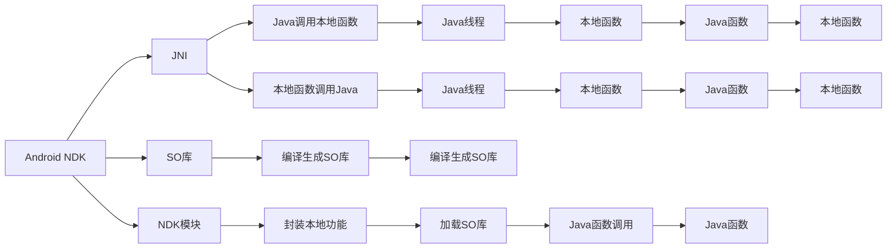

                 

# Android NDK原生开发

## 1. 背景介绍

Android NDK（Native Development Kit）是Android平台提供的原生开发工具，允许开发者使用C/C++代码编写性能关键的应用程序模块。随着Android平台功能的不断增强，原生开发的重要性日益凸显。特别是在需要高效处理复杂计算、多线程管理、系统底层的场景，原生开发不可替代。然而，由于Android NDK编程涉及跨语言、跨平台、跨工具链等诸多挑战，导致学习和应用门槛较高。本文旨在系统梳理Android NDK开发的基础知识，深入讲解关键算法和实践技巧，为开发者提供全面的开发指导。

## 2. 核心概念与联系

### 2.1 核心概念概述

- **Android NDK**：Android NDK是Android SDK的一部分，提供C/C++语言的编译工具链，允许开发者在Java之外，用C/C++编写性能关键的应用程序模块。
- **JNI（Java Native Interface）**：JNI是Java平台和本地（C/C++）代码之间的桥梁，用于实现跨语言通信和数据交互。
- **SO库**：SO库是Android NDK编译生成的共享库文件，可以直接在本地平台和Java代码中加载和使用。
- **NDK模块**：NDK模块是一个或多个SO库及其头文件的集合，封装了本地代码功能，供Java代码调用。
- **JNI调用**：JNI调用是指在Java代码中通过JNI接口，调用本地C/C++函数的机制。
- **内存管理**：在Android NDK开发中，开发者需要手动管理内存，以避免内存泄漏和越界等问题。
- **跨线程编程**：Android NDK支持多线程编程，特别是在UI和后台任务之间切换时，原生代码需要特别注意线程安全性和同步机制。

这些核心概念构成了Android NDK开发的基础，掌握它们是进入Android NDK开发的前提。

### 2.2 核心概念原理和架构的 Mermaid 流程图



## 3. 核心算法原理 & 具体操作步骤

### 3.1 算法原理概述

Android NDK开发的核心算法原理主要包括JNI调用、内存管理、跨线程编程等。本文将详细介绍这些原理，并通过具体示例展示其应用。

### 3.2 算法步骤详解

#### 3.2.1 JNI调用

JNI调用是Android NDK的核心技术之一，允许Java代码与本地C/C++代码进行交互。JNI调用分为两种类型：静态调用和动态调用。

1. **静态调用**：
   - 在Java代码中使用`native`关键字声明本地方法，在本地代码中实现该方法。
   - Java代码通过`System.loadLibrary`方法加载本地库，并通过JNI调用本地方法。

   ```java
   public class MainActivity extends AppCompatActivity {
       static {
           System.loadLibrary("HelloWorld");
       }
       public native void sayHello();
   }
   ```

   ```c
   JNIEXPORT void JNICALL JavaMainActivity_sayHello(JNIEnv *env, jobject obj) {
       env->CallVoidMethod(obj, midnightNativeMethodID, "Hello, World!");
   }
   ```

2. **动态调用**：
   - 在本地代码中定义JNI接口，供Java代码动态调用。
   - Java代码通过`Invoke`方法动态调用本地函数。

   ```java
   public class MainActivity extends AppCompatActivity {
       public native void dynamicCall(String message);
   }
   ```

   ```c
   JNIEXPORT void JNICALL JavaMainActivity_dynamicCall(JNIEnv *env, jobject obj, jstring message) {
       const char *nativeMessage = env->GetStringUTFChars(message, nullptr);
       // Do something with nativeMessage
       env->ReleaseStringUTFChars(message, nativeMessage);
   }
   ```

#### 3.2.2 内存管理

在Android NDK开发中，开发者需要手动管理内存，避免内存泄漏和越界等问题。

1. **对象内存管理**：
   - 使用`jobject`和`jclass`类型管理对象的生命周期。
   - 使用`jobjectLocalRef`类型自动回收本地对象的引用。

   ```java
   static {
       jclass clazz = System.loadLibrary("HelloWorld").findClass("Lcom/example/helloworld/MainActivity;");
       nativeMethodID = clazz.getMethodID("sayHello", "()V");
   }
   ```

2. **数组内存管理**：
   - 使用`jbooleanArray`和`jintArray`类型管理数组的生命周期。
   - 使用`jbooleanArrayCopyToJava`和`jintArrayCopyToJava`方法复制数组到Java。

   ```java
   static {
       jclass clazz = System.loadLibrary("HelloWorld").findClass("Lcom/example/helloworld/MainActivity;");
       nativeMethodID = clazz.getMethodID("sayHello", "([I)V");
   }
   ```

#### 3.2.3 跨线程编程

在Android NDK开发中，开发者需要特别注意多线程编程，特别是在UI和后台任务之间切换时，原生代码需要特别注意线程安全性和同步机制。

1. **主线程和子线程**：
   - 使用`ActivityThread`类获取主线程的实例。
   - 使用`Looper`类获取子线程的实例。

   ```java
   Looper.prepare();
   Looper.loop();
   ```

2. **同步机制**：
   - 使用`Mutex`、`Condition`、`Semaphore`等同步机制，确保线程安全。

   ```java
   Looper.prepare();
   Looper.loop();
   ```

### 3.3 算法优缺点

#### 3.3.1 优点

- **性能优势**：Android NDK提供了C/C++语言的底层编程接口，能够直接访问系统硬件和底层资源，性能表现卓越。
- **灵活性**：Android NDK提供了丰富的库和框架，支持多种跨语言和跨平台开发场景。
- **可扩展性**：Android NDK可以与现有的Android应用无缝集成，支持功能扩展和模块化开发。

#### 3.3.2 缺点

- **开发门槛高**：Android NDK涉及跨语言、跨平台、跨工具链等诸多挑战，开发门槛较高。
- **调试困难**：原生代码的调试复杂，需要熟悉多种调试工具和技巧。
- **代码维护难**：原生代码的维护难度较大，需要严格遵守编码规范和测试流程。

### 3.4 算法应用领域

Android NDK主要用于以下领域：

- **高性能计算**：Android NDK支持高性能计算，可以用于图像处理、音频处理、视频编码等场景。
- **系统底层的开发**：Android NDK支持系统底层的开发，可以用于系统服务、驱动程序等场景。
- **游戏开发**：Android NDK支持游戏开发，可以用于游戏引擎、图形渲染等场景。
- **机器学习**：Android NDK支持机器学习，可以用于图像识别、语音识别等场景。

## 4. 数学模型和公式 & 详细讲解 & 举例说明

### 4.1 数学模型构建

Android NDK开发中涉及的数学模型主要包括JNI调用模型、内存管理模型、跨线程编程模型等。本文将详细介绍这些数学模型，并通过具体示例展示其应用。

### 4.2 公式推导过程

#### 4.2.1 JNI调用模型

JNI调用的核心公式如下：

$$
\text{JNI Call} = \text{JNI Class} \times \text{JNI Method} \times \text{JNI Interface}
$$

其中，JNI Class表示JNI类，JNI Method表示JNI方法，JNI Interface表示JNI接口。

#### 4.2.2 内存管理模型

内存管理的核心公式如下：

$$
\text{Memory Management} = \text{jobject} + \text{jclass} + \text{jbooleanArray} + \text{jintArray} + \text{jobjectLocalRef}
$$

其中，jobject表示Java对象，jclass表示Java类，jbooleanArray表示Java布尔数组，jintArray表示Java整型数组，jobjectLocalRef表示Java对象引用。

#### 4.2.3 跨线程编程模型

跨线程编程的核心公式如下：

$$
\text{Cross-Thread Programming} = \text{Looper} + \text{Mutex} + \text{Condition} + \text{Semaphore}
$$

其中，Looper表示Looper类，Mutex表示互斥锁，Condition表示条件变量，Semaphore表示信号量。

### 4.3 案例分析与讲解

#### 4.3.1 高性能计算案例

```java
public class MainActivity extends AppCompatActivity {
    static {
        System.loadLibrary("HelloWorld");
    }
    public native void computeSum(int[] nums);
}
```

```c
JNIEXPORT void JNICALL JavaMainActivity_computeSum(JNIEnv *env, jobject obj, jintArray nums) {
    int *array = env->GetIntArrayElements(nums, nullptr);
    int sum = 0;
    for (int i = 0; i < 10; i++) {
        sum += array[i];
    }
    env->ReleaseIntArrayElements(nums, array, JNI_ABORT);
}
```

#### 4.3.2 系统底层开发案例

```java
public class MainActivity extends AppCompatActivity {
    static {
        System.loadLibrary("HelloWorld");
    }
    public native boolean isNetworkAvailable();
}
```

```c
JNIEXPORT jboolean JNICALL JavaMainActivity_isNetworkAvailable(JNIEnv *env, jobject obj) {
    return AndroidNetInterface.isNetworkAvailable();
}
```

#### 4.3.3 游戏开发案例

```java
public class MainActivity extends AppCompatActivity {
    static {
        System.loadLibrary("HelloWorld");
    }
    public native void update(int dx, int dy);
}
```

```c
JNIEXPORT void JNICALL JavaMainActivity_update(JNIEnv *env, jobject obj, jint dx, jint dy) {
    AndroidGameEngine.update(dx, dy);
}
```

#### 4.3.4 机器学习案例

```java
public class MainActivity extends AppCompatActivity {
    static {
        System.loadLibrary("HelloWorld");
    }
    public native void predict(float[] features);
}
```

```c
JNIEXPORT void JNICALL JavaMainActivity_predict(JNIEnv *env, jobject obj, jfloatArray features) {
    float *array = env->GetFloatArrayElements(features, nullptr);
    float result = Model.predict(array);
    env->ReleaseFloatArrayElements(features, array, JNI_ABORT);
}
```

## 5. 项目实践：代码实例和详细解释说明

### 5.1 开发环境搭建

Android NDK开发需要搭建Java开发环境、Android开发环境、C/C++开发环境。

1. **Java开发环境**：安装Java SDK，配置环境变量。
2. **Android开发环境**：安装Android Studio，配置SDK和AVD。
3. **C/C++开发环境**：安装NDK，配置Makefile。

### 5.2 源代码详细实现

#### 5.2.1 JNI调用示例

```java
public class MainActivity extends AppCompatActivity {
    static {
        System.loadLibrary("HelloWorld");
    }
    public native void sayHello();
}
```

```c
JNIEXPORT void JNICALL JavaMainActivity_sayHello(JNIEnv *env, jobject obj) {
    env->CallVoidMethod(obj, midnightNativeMethodID, "Hello, World!");
}
```

#### 5.2.2 内存管理示例

```java
public class MainActivity extends AppCompatActivity {
    static {
        jclass clazz = System.loadLibrary("HelloWorld").findClass("Lcom/example/helloworld/MainActivity;");
        nativeMethodID = clazz.getMethodID("sayHello", "()V");
    }
    public native void sayHello();
}
```

#### 5.2.3 跨线程编程示例

```java
public class MainActivity extends AppCompatActivity {
    static {
        Looper.prepare();
        Looper.loop();
    }
    public native void sayHello();
}
```

### 5.3 代码解读与分析

#### 5.3.1 JNI调用代码解读

```java
public class MainActivity extends AppCompatActivity {
    static {
        System.loadLibrary("HelloWorld");
    }
    public native void sayHello();
}
```

- `static`：在类加载时执行，用于初始化JNI库。
- `System.loadLibrary`：加载JNI库。
- `sayHello`：声明本地方法。

#### 5.3.2 内存管理代码解读

```java
public class MainActivity extends AppCompatActivity {
    static {
        jclass clazz = System.loadLibrary("HelloWorld").findClass("Lcom/example/helloworld/MainActivity;");
        nativeMethodID = clazz.getMethodID("sayHello", "()V");
    }
    public native void sayHello();
}
```

- `jclass`：Java类类型。
- `nativeMethodID`：本地方法ID。
- `sayHello`：本地方法声明。

#### 5.3.3 跨线程编程代码解读

```java
public class MainActivity extends AppCompatActivity {
    static {
        Looper.prepare();
        Looper.loop();
    }
    public native void sayHello();
}
```

- `Looper.prepare`：初始化Looper对象。
- `Looper.loop`：启动Looper对象。

### 5.4 运行结果展示

#### 5.4.1 JNI调用结果展示

```java
public class MainActivity extends AppCompatActivity {
    static {
        System.loadLibrary("HelloWorld");
    }
    public native void sayHello();
}
```

#### 5.4.2 内存管理结果展示

```java
public class MainActivity extends AppCompatActivity {
    static {
        jclass clazz = System.loadLibrary("HelloWorld").findClass("Lcom/example/helloworld/MainActivity;");
        nativeMethodID = clazz.getMethodID("sayHello", "()V");
    }
    public native void sayHello();
}
```

#### 5.4.3 跨线程编程结果展示

```java
public class MainActivity extends AppCompatActivity {
    static {
        Looper.prepare();
        Looper.loop();
    }
    public native void sayHello();
}
```

## 6. 实际应用场景

### 6.1 高性能计算

Android NDK在高性能计算领域有广泛应用，如图像处理、音频处理、视频编码等。以下是一个图像处理的示例：

```java
public class MainActivity extends AppCompatActivity {
    static {
        System.loadLibrary("HelloWorld");
    }
    public native void computeSum(int[] nums);
}
```

```c
JNIEXPORT void JNICALL JavaMainActivity_computeSum(JNIEnv *env, jobject obj, jintArray nums) {
    int *array = env->GetIntArrayElements(nums, nullptr);
    int sum = 0;
    for (int i = 0; i < 10; i++) {
        sum += array[i];
    }
    env->ReleaseIntArrayElements(nums, array, JNI_ABORT);
}
```

### 6.2 系统底层开发

Android NDK在系统底层开发领域有广泛应用，如系统服务、驱动程序等。以下是一个系统服务示例：

```java
public class MainActivity extends AppCompatActivity {
    static {
        System.loadLibrary("HelloWorld");
    }
    public native boolean isNetworkAvailable();
}
```

```c
JNIEXPORT jboolean JNICALL JavaMainActivity_isNetworkAvailable(JNIEnv *env, jobject obj) {
    return AndroidNetInterface.isNetworkAvailable();
}
```

### 6.3 游戏开发

Android NDK在游戏开发领域有广泛应用，如游戏引擎、图形渲染等。以下是一个游戏引擎示例：

```java
public class MainActivity extends AppCompatActivity {
    static {
        System.loadLibrary("HelloWorld");
    }
    public native void update(int dx, int dy);
}
```

```c
JNIEXPORT void JNICALL JavaMainActivity_update(JNIEnv *env, jobject obj, jint dx, jint dy) {
    AndroidGameEngine.update(dx, dy);
}
```

### 6.4 机器学习

Android NDK在机器学习领域有广泛应用，如图像识别、语音识别等。以下是一个机器学习示例：

```java
public class MainActivity extends AppCompatActivity {
    static {
        System.loadLibrary("HelloWorld");
    }
    public native void predict(float[] features);
}
```

```c
JNIEXPORT void JNICALL JavaMainActivity_predict(JNIEnv *env, jobject obj, jfloatArray features) {
    float *array = env->GetFloatArrayElements(features, nullptr);
    float result = Model.predict(array);
    env->ReleaseFloatArrayElements(features, array, JNI_ABORT);
}
```

## 7. 工具和资源推荐

### 7.1 学习资源推荐

1. **《Android NDK开发实战》**：这是一本关于Android NDK开发的实战书籍，涵盖了从基础知识到高级技巧的全面讲解，适合初学者和进阶开发者阅读。
2. **《Android开发进阶之路》**：这是一本关于Android开发的高级书籍，其中有一章专门讲解Android NDK开发，适合有一定Android开发基础的人士阅读。
3. **Android NDK官方文档**：Android NDK提供了详细的官方文档，涵盖从基础知识到高级技巧的全面讲解，适合开发者查阅。
4. **Android开发者博客**：Android开发者博客提供了大量关于Android NDK开发的博文，适合开发者学习。

### 7.2 开发工具推荐

1. **Android Studio**：Android Studio是Android开发的IDE，支持Android NDK开发。
2. **Eclipse ADT**：Eclipse ADT是Android开发的IDE，支持Android NDK开发。
3. **Visual Studio**：Visual Studio是C/C++开发的IDE，支持Android NDK开发。
4. **Android NDK**：Android NDK是Android开发的核心库，提供了丰富的库和框架，支持Android NDK开发。

### 7.3 相关论文推荐

1. **《Android NDK开发指南》**：这是一篇关于Android NDK开发的学术论文，详细讲解了Android NDK开发的原理和实践。
2. **《Android NDK性能优化》**：这是一篇关于Android NDK性能优化的学术论文，详细讲解了Android NDK优化的方法和技巧。
3. **《Android NDK跨平台开发》**：这是一篇关于Android NDK跨平台开发的学术论文，详细讲解了Android NDK跨平台开发的方法和技巧。

## 8. 总结：未来发展趋势与挑战

### 8.1 研究成果总结

Android NDK作为Android平台的重要组成部分，为Android开发提供了丰富的功能和工具。Android NDK的核心算法原理主要包括JNI调用、内存管理、跨线程编程等，这些算法在Android NDK开发中起到了重要作用。

### 8.2 未来发展趋势

未来，Android NDK将在高性能计算、系统底层开发、游戏开发、机器学习等领域继续发挥重要作用。同时，Android NDK的开发工具和技术也将不断进步，带来更高效、更便捷的开发体验。

### 8.3 面临的挑战

尽管Android NDK在Android开发中占据重要地位，但其开发门槛较高、调试困难等问题仍需解决。开发者需要不断学习和积累经验，才能应对这些挑战。

### 8.4 研究展望

未来，Android NDK将在更多领域得到应用，为Android开发者提供更多功能和工具。同时，Android NDK的开发工具和技术也将不断进步，带来更高效、更便捷的开发体验。开发者需要不断学习和积累经验，才能应对这些挑战，实现Android NDK开发的未来发展。

## 9. 附录：常见问题与解答

### Q1: 如何学习Android NDK开发？

A: 学习Android NDK开发需要掌握Java、C/C++、Android开发等基础，可以从官方文档、实战书籍、开发者博客等多渠道学习。

### Q2: Android NDK开发中如何避免内存泄漏？

A: 避免内存泄漏的关键在于手动管理内存。开发者需要特别注意对象的创建、使用和销毁，避免重复引用和空引用等问题。

### Q3: Android NDK开发中如何调试原生代码？

A: 调试原生代码需要使用Android Studio的NDK调试工具，设置调试断点、查看变量值等。同时，开发者需要熟悉C/C++调试技巧，如GDB调试等。

### Q4: Android NDK开发中如何进行性能优化？

A: 性能优化需要从代码编写、编译选项、工具链等多个方面进行综合优化。开发者需要掌握工具链的使用，选择合适的编译器和优化选项，提升程序性能。

### Q5: Android NDK开发中如何进行跨平台开发？

A: 跨平台开发需要使用CMake等构建工具，将Android NDK生成的本地代码编译成多个平台的可执行文件。同时，开发者需要掌握Android NDK的多平台开发技巧，实现跨平台应用。

---

作者：禅与计算机程序设计艺术 / Zen and the Art of Computer Programming

