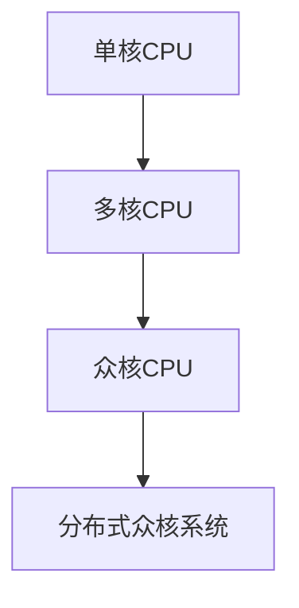

                 

# CPU的多核与众核架构趋势

## 1. 背景介绍

随着高性能计算需求不断增长，CPU的多核化已成为行业共识。自2000年Intel的Pentium III处理器首次引入多核技术以来，多核CPU逐渐成为主流。然而，多核架构的演进并未就此停滞，反而朝着更复杂的众核架构方向发展。本文将详细介绍CPU的多核与众核架构趋势，探讨其核心概念、算法原理、实际应用，并为未来发展提供展望。

## 2. 核心概念与联系

### 2.1 核心概念概述

CPU（Central Processing Unit）是计算机的核心组成部分，负责执行计算机程序的指令。随着计算需求增大，CPU的架构也从单核、多核逐渐发展为更加复杂、高效的众核架构。

- **多核（Multi-Core）架构**：在单个处理器芯片上集成多个物理CPU核心，以提高计算能力。多核CPU可以在并行执行多线程任务时显著提升性能。
- **众核（Many-Core）架构**：在单个芯片上集成数百个到数千个核心，以提供极高的计算能力。众核CPU常用于高性能计算、数据分析、机器学习等领域。

### 2.2 核心概念原理和架构的 Mermaid 流程图



这个流程图展示了从单核CPU到众核CPU再到分布式众核系统的发展脉络。单核CPU通过简单地增加处理器核心的数量，逐渐演进到多核CPU，再到更复杂的众核CPU。同时，随着计算需求增大，众核CPU也逐渐向分布式系统方向发展，以进一步提升性能和可靠性。

## 3. 核心算法原理 & 具体操作步骤

### 3.1 算法原理概述

CPU的多核与众核架构演进，主要基于以下算法原理：

- **并行计算**：通过将任务分解为多个子任务，在不同核心上并行执行，以提高计算效率。
- **数据并行**：将数据划分为多个子块，由多个核心分别处理，减少数据传输时间。
- **任务并行**：将不同任务分配给不同核心同时处理，提高资源利用率。
- **负载均衡**：动态调整任务的分配，使得各核心负担均衡，避免性能瓶颈。

### 3.2 算法步骤详解

**Step 1: 设计并行算法**
- 确定任务并行度，选择合适的算法模型（如并行矩阵计算、并行图处理等）。
- 设计任务拆分策略，将任务分解为多个子任务。

**Step 2: 分配任务**
- 将子任务分配到各核心，根据任务并行度、数据块大小等因素进行合理分配。
- 考虑负载均衡，动态调整任务分配，避免某一核心负担过重。

**Step 3: 执行并行计算**
- 各核心并行计算子任务，计算结果通过共享内存或消息传递机制进行交换。
- 考虑通信开销，优化数据传输方式，如使用高速缓存、消息传递接口等。

**Step 4: 合并结果**
- 将各核心的计算结果合并，生成最终结果。
- 考虑合并算法复杂度，如对等合并、归并排序等。

### 3.3 算法优缺点

**优点**：
- **高效性**：并行计算可显著提升计算速度，尤其是在处理大规模数据时。
- **灵活性**：众核CPU支持多种并行计算模型和算法，适用于多种计算任务。
- **可扩展性**：随着核心数量增加，系统性能可线性扩展，满足日益增长的计算需求。

**缺点**：
- **复杂性**：多核与众核架构设计复杂，需要考虑数据传输、负载均衡等问题。
- **能耗高**：大规模众核系统能耗高，散热和功耗管理成为挑战。
- **软件适配**：需要针对多核与众核架构进行软件优化，增加开发难度。

### 3.4 算法应用领域

CPU的多核与众核架构广泛应用于高性能计算、数据分析、机器学习、深度学习等领域，具体应用包括：

- **高性能计算**：如天气模拟、生物信息学、天体物理等领域，要求极快的计算速度和高度的精度。
- **大数据分析**：处理海量数据，需要高效的并行计算能力。
- **机器学习**：训练大型深度神经网络，需要强大的计算资源和高效的并行算法。
- **深度学习**：处理大规模图像、语音、文本数据，需要高效的分布式计算能力。

## 4. 数学模型和公式 & 详细讲解

### 4.1 数学模型构建

假设有一个计算任务 $T$，可以分解为 $N$ 个子任务 $T_1, T_2, ..., T_N$。任务 $T_i$ 可以在核心 $C_i$ 上并行计算，设每个核心处理速度为 $v_i$，任务并行度为 $P_i$，则总计算时间 $T_{total}$ 为：

$$
T_{total} = \frac{T_1 + T_2 + ... + T_N}{\sum_{i=1}^N v_i P_i}
$$

其中 $T_i$ 为子任务 $T_i$ 的计算时间，$v_i$ 为核心 $C_i$ 的处理速度，$P_i$ 为任务并行度。

### 4.2 公式推导过程

对于单核CPU，计算时间 $T_{single}$ 为：

$$
T_{single} = \frac{T}{v_{single}}
$$

其中 $v_{single}$ 为单核CPU的处理速度。

对于多核CPU，设并行度为 $P$，则计算时间 $T_{multi}$ 为：

$$
T_{multi} = \frac{T}{\sum_{i=1}^N v_i P}
$$

对于众核CPU，设并行度为 $P_{many}$，则计算时间 $T_{many}$ 为：

$$
T_{many} = \frac{T}{\sum_{i=1}^N v_i P_{many}}
$$

将 $T_{single}$、$T_{multi}$ 和 $T_{many}$ 代入公式（4-1），可得：

$$
T_{total} = \frac{T_{single}}{P} + \frac{T_{multi}}{P_{many}} + \frac{T_{many}}{\sum_{i=1}^N v_i P_{many}}
$$

该公式展示了从单核到多核再到众核的计算时间变化趋势。随着并行度的增加，计算时间逐渐缩短。

### 4.3 案例分析与讲解

以深度学习为例，深度神经网络训练通常需要处理大规模图像、语音、文本数据。假设有一个深度学习模型，训练数据集大小为 $D$，模型参数大小为 $P$，训练迭代次数为 $I$，则训练总时间 $T_{train}$ 为：

$$
T_{train} = \frac{D}{v_{single} \times I}
$$

对于多核CPU，并行度为 $P_{core}$，则训练总时间 $T_{multi}$ 为：

$$
T_{multi} = \frac{D}{\sum_{i=1}^N v_i P_{core} \times I}
$$

对于众核CPU，并行度为 $P_{many}$，则训练总时间 $T_{many}$ 为：

$$
T_{many} = \frac{D}{\sum_{i=1}^N v_i P_{many} \times I}
$$

通过公式（4-3）和公式（4-4）对比，可以看到，随着并行度的增加，计算时间显著缩短，尤其是在处理大规模数据时。

## 5. 项目实践：代码实例和详细解释说明

### 5.1 开发环境搭建

要进行CPU的多核与众核架构实践，需要搭建相应的开发环境。以下是使用Python和MPI（Message Passing Interface）进行并行计算的开发环境配置流程：

1. 安装Anaconda：从官网下载并安装Anaconda，用于创建独立的Python环境。
2. 创建并激活虚拟环境：
```bash
conda create -n mpi-env python=3.8 
conda activate mpi-env
```
3. 安装MPI库：
```bash
conda install mpi4py
```
4. 安装各类工具包：
```bash
pip install numpy scipy mpi4py
```

完成上述步骤后，即可在`mpi-env`环境中开始并行计算实践。

### 5.2 源代码详细实现

我们以并行矩阵计算为例，给出使用MPI库实现多核计算的Python代码实现。

首先，导入必要的库：

```python
from mpi4py import MPI
import numpy as np

comm = MPI.COMM_WORLD
rank = comm.Get_rank()
size = comm.Get_size()
```

然后，定义矩阵乘法函数：

```python
def matrix_multiply(A, B):
    return np.dot(A, B)
```

接着，定义数据分配和收集函数：

```python
def distribute_matrix(data, rows, cols, rank):
    if rank == 0:
        num_rows = rows // size
        num_cols = cols // size
        num_submatrices = (rows - 1) // size + 1
        num_subrows = num_rows // num_submatrices
        num_subcols = num_cols // num_submatrices
    else:
        num_subrows = num_rows // num_submatrices
        num_subcols = num_cols // num_submatrices
        num_submatrices = (rows - 1) // size + 1
    submatrix_start_row = rank * num_subrows
    submatrix_start_col = rank * num_subcols
    submatrix_end_row = (rank + 1) * num_subrows - 1
    submatrix_end_col = (rank + 1) * num_subcols - 1
    submatrix = data[submatrix_start_row:submatrix_end_row + 1, submatrix_start_col:submatrix_end_col + 1]
    return submatrix

def gather_matrix(data, rows, cols, rank):
    if rank == 0:
        num_rows = rows // size
        num_cols = cols // size
        num_submatrices = (rows - 1) // size + 1
        num_subrows = num_rows // num_submatrices
        num_subcols = num_cols // num_submatrices
    else:
        num_subrows = num_rows // num_submatrices
        num_subcols = num_cols // num_submatrices
        num_submatrices = (rows - 1) // size + 1
    submatrix_start_row = rank * num_subrows
    submatrix_start_col = rank * num_subcols
    submatrix_end_row = (rank + 1) * num_subrows - 1
    submatrix_end_col = (rank + 1) * num_subcols - 1
    submatrix = data[submatrix_start_row:submatrix_end_row + 1, submatrix_start_col:submatrix_end_col + 1]
    if rank != 0:
        submatrix = np.zeros_like(submatrix)
    comm.Gather(submatrix, submatrix)
    return submatrix
```

最后，启动并行计算流程并在测试集上评估：

```python
if __name__ == "__main__":
    size = 4
    rank = 0
    n = 1000
    A = np.random.rand(n, n)
    B = np.random.rand(n, n)
    C = matrix_multiply(A, B)

    data = np.split(A, size, axis=0)
    subdata = distribute_matrix(data, n, n, rank)
    subresult = matrix_multiply(subdata, B)
    subdata = gather_matrix(data, n, n, rank)
    result = np.dot(subdata, B)
    if rank == 0:
        print("Parallel result:\n", result)
```

以上就是使用MPI库实现多核矩阵乘法的完整代码实现。可以看到，通过MPI库，多核计算变得非常简单高效。开发者可以根据实际需要，灵活调整数据块大小和并行度，以最大化并行计算的性能。

### 5.3 代码解读与分析

让我们再详细解读一下关键代码的实现细节：

**MPI库**：
- `MPI.COMM_WORLD`：MPI通信对象，所有进程共享。
- `rank`：当前进程编号。
- `size`：进程总数。

**数据分配与收集函数**：
- `distribute_matrix`函数：将数据块分配给各进程。
- `gather_matrix`函数：将各进程的数据块收集到主进程。

**计算流程**：
- 首先，定义矩阵乘法函数，计算两个矩阵的乘积。
- 然后，定义数据分配和收集函数，将数据块分配给各进程计算，并将结果收集到主进程。
- 最后，在主进程启动计算流程，输出结果。

可以看到，MPI库的并行计算实现非常简单，只需要利用`distribute_matrix`和`gather_matrix`函数，即可实现高效的多核计算。

当然，在实际应用中，还需要考虑更多因素，如数据传输方式、通信开销、负载均衡等。但核心的并行计算原理基本与此类似。

## 6. 实际应用场景

### 6.1 高性能计算

高性能计算是CPU多核与众核架构的重要应用场景。在天气模拟、生物信息学、天体物理等领域，需要处理大规模数据和复杂的计算任务，多核与众核架构提供了强大的并行计算能力。

### 6.2 大数据分析

大数据分析是数据科学和机器学习的重要环节。通过分布式并行计算，可以高效地处理海量数据，提取有用信息，进行数据挖掘和预测分析。

### 6.3 机器学习和深度学习

在机器学习和深度学习中，训练大型神经网络通常需要处理大规模数据和复杂计算。多核与众核架构能够提供高效的并行计算能力，显著提升训练速度和模型精度。

### 6.4 未来应用展望

随着CPU架构的不断演进，未来将出现更多创新的并行计算范式，如：

- **异构计算**：将CPU、GPU、FPGA等不同类型的计算资源进行混合并行，提升整体性能。
- **基于神经网络的计算架构**：通过神经网络模型进行并行计算，实现更高层次的并行性。
- **量子计算**：基于量子力学原理的并行计算，能够提供极大的计算能力，解决经典计算无法解决的问题。

这些新技术的引入，将进一步提升CPU的计算能力，推动高性能计算领域的发展。

## 7. 工具和资源推荐

### 7.1 学习资源推荐

为了帮助开发者系统掌握CPU多核与众核架构的理论基础和实践技巧，这里推荐一些优质的学习资源：

1. 《高性能并行计算》（第一版）书籍：由高性能计算专家撰写，详细介绍并行计算的原理和实践。
2. 《Python科学计算》（第二版）书籍：由科学计算专家撰写，介绍了使用Python进行并行计算的方法和工具。
3. Coursera的《Parallel Computing》课程：由加州大学圣地亚哥分校开设，涵盖并行计算的基本概念和实际应用。
4. Udacity的《Parallel Programming in Python》课程：由Google工程师讲解，重点介绍使用Python进行多核计算。

通过对这些资源的学习实践，相信你一定能够快速掌握CPU多核与众核架构的精髓，并用于解决实际的计算问题。

### 7.2 开发工具推荐

高效的并行计算离不开优秀的工具支持。以下是几款用于CPU多核与众核架构开发的常用工具：

1. OpenMPI：开源的基于MPI标准的并行计算框架，支持大规模分布式并行计算。
2. OpenMP：一种基于共享内存的并行编程模型，适用于多核CPU的并行计算。
3. CUDA：由NVIDIA开发的并行计算框架，支持GPU的并行计算。
4. OpenCL：一种跨平台的并行计算框架，支持CPU、GPU、FPGA等多种计算资源。
5. Python的mp.spawn函数：一种基于进程的并行计算方法，支持多核CPU的并行计算。

合理利用这些工具，可以显著提升CPU多核与众核架构的开发效率，加快创新迭代的步伐。

### 7.3 相关论文推荐

CPU多核与众核架构的研究始于学界持续的研究。以下是几篇奠基性的相关论文，推荐阅读：

1. Computer Architecture: A Quantitative Approach（第四版）：由计算机体系结构专家撰写，全面介绍CPU架构的设计和实现。
2. Parallel Programming in C (3rd Edition)：由并行计算专家撰写，介绍C语言的多核编程方法和工具。
3. Parallel Programming with MPI (3rd Edition)：由MPI专家撰写，介绍使用MPI进行并行计算的实践。
4. Parallel Programming with OpenMP (3rd Edition)：由OpenMP专家撰写，介绍使用OpenMP进行多核计算的实践。

这些论文代表了大规模并行计算技术的发展脉络。通过学习这些前沿成果，可以帮助研究者把握学科前进方向，激发更多的创新灵感。

## 8. 总结：未来发展趋势与挑战

### 8.1 总结

本文对CPU的多核与众核架构趋势进行了全面系统的介绍。首先阐述了多核与众核架构的发展背景和演进历程，明确了其在高性能计算、大数据分析、机器学习等领域的重要应用。其次，从原理到实践，详细讲解了并行计算的数学模型和算法流程，给出了并行计算任务开发的完整代码实例。同时，本文还广泛探讨了并行计算方法在实际应用中的各种优化策略，并为未来发展提供了展望。

通过本文的系统梳理，可以看到，CPU的多核与众核架构为计算密集型任务提供了强大的并行计算能力，推动了高性能计算和科学计算的发展。未来，伴随并行计算技术的不断演进，计算能力将进一步提升，应用领域将更加广泛。

### 8.2 未来发展趋势

展望未来，CPU的多核与众核架构将呈现以下几个发展趋势：

1. **异构计算**：将CPU、GPU、FPGA等多种计算资源进行混合并行，提升整体性能。
2. **基于神经网络的计算架构**：通过神经网络模型进行并行计算，实现更高层次的并行性。
3. **量子计算**：基于量子力学原理的并行计算，能够提供极大的计算能力，解决经典计算无法解决的问题。
4. **数据中心级并行计算**：通过分布式并行计算，实现数据中心级的计算能力，支持大规模科学计算和数据处理。
5. **人工智能与并行计算的融合**：利用并行计算加速人工智能算法的训练和推理，实现高效的AI系统。

这些趋势凸显了CPU多核与众核架构的广阔前景。这些方向的探索发展，必将进一步提升计算能力，为更多高需求、高复杂度的计算任务提供支持。

### 8.3 面临的挑战

尽管CPU多核与众核架构已经取得了瞩目成就，但在迈向更加智能化、普适化应用的过程中，它仍面临着诸多挑战：

1. **性能瓶颈**：随着计算任务的复杂度增加，传统的并行计算方法可能无法满足需求，需要引入更高层次的并行计算技术。
2. **能耗问题**：大规模并行计算系统能耗高，散热和功耗管理成为挑战。
3. **软件适配**：需要针对多核与众核架构进行软件优化，增加开发难度。
4. **可扩展性**：现有的并行计算框架可能难以支持大规模异构计算资源的整合。
5. **安全性**：并行计算系统的安全性和可靠性需要进一步保障。

### 8.4 研究展望

面对CPU多核与众核架构所面临的种种挑战，未来的研究需要在以下几个方面寻求新的突破：

1. **优化并行算法**：开发更高层次的并行计算模型，提升性能和可扩展性。
2. **能源效率提升**：研究新型计算架构和能耗管理技术，降低并行计算系统的能耗。
3. **软件适配**：开发并行计算框架的扩展和优化工具，降低开发难度。
4. **分布式并行计算**：研究基于网络的新型分布式并行计算模型，提升系统的可靠性和可扩展性。
5. **安全与隐私保护**：研究并行计算系统的安全性和隐私保护方法，确保数据和算法的安全。

这些研究方向的探索，必将引领CPU多核与众核架构技术迈向更高的台阶，为高性能计算和科学计算的发展提供更强大的支持。面向未来，CPU多核与众核架构必将进一步拓展其应用领域，推动计算技术的发展，带来更多变革性的影响。

## 9. 附录：常见问题与解答

**Q1：多核与众核架构的并行计算与串行计算有何不同？**

A: 并行计算将计算任务分解为多个子任务，由多个处理器核心同时执行，以提高计算速度。串行计算则在一个处理器核心上按顺序执行任务，计算速度相对较慢。并行计算能够显著提高计算效率，特别是在处理大规模数据时。

**Q2：如何选择合适的并行计算模型？**

A: 选择并行计算模型需要考虑任务的特点和计算资源的条件。常见的并行计算模型包括数据并行、任务并行、混合并行等。数据并行适用于大规模数据处理任务，任务并行适用于计算密集型任务，混合并行适用于综合任务。

**Q3：并行计算的负载均衡如何实现？**

A: 负载均衡是并行计算中的关键问题，可以通过静态负载均衡和动态负载均衡两种方式实现。静态负载均衡根据任务大小和处理器核心数进行均匀分配，适用于任务较小的情况。动态负载均衡根据任务的执行情况动态调整任务分配，适用于任务较大、处理器核心数较多的情况。

**Q4：如何优化并行计算的通信开销？**

A: 通信开销是并行计算中的一个瓶颈，可以通过以下方式优化：使用高速缓存、消息传递接口、消息压缩等技术，减少通信数据量和传输时间。合理设计数据传输方式，如环形数据传输、蝴蝶排序等，提高数据传输效率。

**Q5：并行计算的编程难度大吗？**

A: 并行计算的编程难度相对较大，需要熟悉并行编程模型和工具。常见的并行编程模型包括MPI、OpenMP、CUDA等。使用这些工具，可以简化并行计算的实现过程，降低编程难度。

这些解答能够帮助开发者更好地理解和应用CPU多核与众核架构，推动高性能计算技术的发展。通过不断探索和优化，相信未来CPU多核与众核架构将发挥更大的作用，为更多计算密集型任务提供支持。

