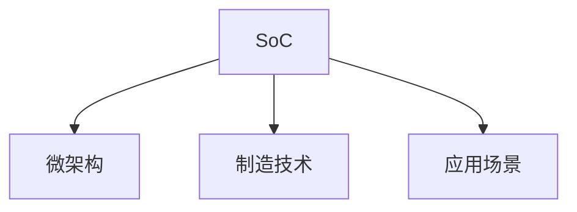

                 

# CPU的片上系统集成模式

在当今的技术生态中，中央处理器(CPU)是信息处理的核心，它控制着数据的输入和输出、存储管理以及程序执行的逻辑控制。随着技术的发展，CPU已经从最早的简单计算单元演变为复杂的系统级集成。本文将详细探讨CPU的片上系统集成模式，帮助读者深入理解这一关键技术。

## 1. 背景介绍

### 1.1 问题由来
在早期的计算机中，CPU的设计相对简单，主要负责执行基本的指令集。但随着计算机性能需求的增长，CPU开始向系统级集成方向发展，融合了更多的功能模块。这种集成模式不仅提升了处理器的性能和效率，也带来了设计上的复杂性和制造上的挑战。因此，了解CPU的片上系统集成模式及其应用，对于掌握现代计算机系统设计至关重要。

### 1.2 问题核心关键点
CPU的片上系统集成模式主要关注以下几个核心关键点：

- **片上系统(SoC)**：集成了包括CPU在内的多个功能模块，形成系统级的处理器。
- **微架构**：指CPU内部结构的设计，包括指令集、缓存、寄存器、互连网络等。
- **制造技术**：如纳米技术、光刻技术等，用于实现高密度集成。
- **应用场景**：如嵌入式系统、数据中心、移动设备等。

本文将围绕这些关键点，详细介绍CPU的片上系统集成模式及其原理。

## 2. 核心概念与联系

### 2.1 核心概念概述

为更好地理解CPU的片上系统集成模式，本节将介绍几个密切相关的核心概念：

- **片上系统(SoC)**：在单一硅片上集成了CPU、存储器、I/O接口等组件的系统级处理器。
- **微架构(Microarchitecture)**：CPU内部结构的设计，包括数据路径、控制路径、缓存等。
- **制造技术(Manufacturing Technology)**：如光刻技术、纳米技术等，用于实现高密度集成。
- **应用场景(Application Scenarios)**：如嵌入式系统、数据中心、移动设备等。

这些核心概念之间的逻辑关系可以通过以下Mermaid流程图来展示：



这个流程图展示了几大核心概念及其之间的关系：

1. 片上系统是集成CPU及其他功能模块的系统级处理器。
2. 微架构是片上系统内部结构的设计，决定了CPU的性能和效率。
3. 制造技术用于实现高密度集成，是片上系统技术的基础。
4. 应用场景决定了片上系统的具体设计和应用需求。

## 3. 核心算法原理 & 具体操作步骤
### 3.1 算法原理概述

CPU的片上系统集成模式，基于系统级的集成设计，通过优化微架构、提升制造技术等方式，实现高效、可靠的系统级集成。其核心思想是：在单一硅片上集成CPU、存储器、I/O接口等组件，形成系统级的处理器。

### 3.2 算法步骤详解

CPU的片上系统集成模式一般包括以下几个关键步骤：

**Step 1: 确定系统需求**
- 分析具体应用场景对性能、功耗、体积等方面的需求，确定系统功能模块的集成方案。

**Step 2: 设计微架构**
- 根据需求，设计CPU的微架构，包括指令集、缓存、寄存器、互连网络等。
- 确定缓存层次结构，如L1、L2、L3缓存的容量和设计。
- 选择合适的互连技术，如点对点、总线型等，确保系统内各模块高效通信。

**Step 3: 实现制造**
- 选择合适的制造技术，如光刻技术、纳米技术等，用于实现高密度集成。
- 设计片上布线、布版等，确保各组件间有效连接。
- 进行集成测试，验证芯片功能和性能。

**Step 4: 封装和测试**
- 将芯片封装成模块化的SoC，确保模块间可靠连接。
- 进行系统级测试，验证SoC整体性能和可靠性。

**Step 5: 部署与应用**
- 将SoC集成到具体应用场景中，如嵌入式系统、数据中心、移动设备等。
- 针对特定应用进行优化，提升性能和功耗效率。

以上是CPU片上系统集成的一般流程。在实际应用中，还需要针对具体任务进行优化设计，如改进设计工具、搜索最优的制造工艺等，以进一步提升系统性能。

### 3.3 算法优缺点

CPU的片上系统集成模式具有以下优点：

1. **高集成度**：集成了多个功能模块，提高了系统性能和效率。
2. **灵活性**：根据需求设计微架构，易于适应不同应用场景。
3. **功耗优化**：通过优化设计，实现了功耗的优化，延长了设备的使用寿命。
4. **可靠性**：将多个组件集成在一个硅片上，提高了系统的可靠性。

同时，该方法也存在一定的局限性：

1. **设计复杂**：涉及多个功能模块的集成，设计复杂度高。
2. **制造难度**：高密度集成对制造技术要求较高。
3. **维护困难**：多个组件集成在单一硅片上，维护和升级难度较大。

尽管存在这些局限性，但就目前而言，CPU的片上系统集成模式仍是大规模集成电路技术发展的主流范式。未来相关研究的重点在于如何进一步降低设计复杂度，提高制造技术，同时兼顾维护和升级的便捷性等因素。

### 3.4 算法应用领域

CPU的片上系统集成模式在多个领域得到了广泛的应用，例如：

- **嵌入式系统**：如智能手表、物联网设备等，通过集成的微处理器和传感器，实现高性能、低功耗的系统设计。
- **数据中心**：如高性能计算服务器、云计算平台等，通过集成的多核处理器和存储器，提升数据处理能力。
- **移动设备**：如智能手机、平板电脑等，通过集成的处理器和电池，实现高效、低功耗的系统设计。
- **汽车电子**：如自动驾驶、智能车联网等，通过集成的多核处理器和传感器，提升车辆智能化水平。

除了上述这些经典应用外，CPU的片上系统集成模式也被创新性地应用到更多场景中，如医疗设备、工业控制、安防监控等，为不同行业带来了新的技术突破。

## 4. 数学模型和公式 & 详细讲解  
### 4.1 数学模型构建

本节将使用数学语言对CPU片上系统集成模式的实现过程进行更加严格的刻画。

记CPU的片上系统为SoC，其微架构为$\mathcal{A}$，制造技术为$\mathcal{M}$。假设需求为$\mathcal{D}$，制造难度为$M$，维护难度为$H$，则SoC的设计流程可以表示为：

$$
\text{SoC} = f(\mathcal{D}, \mathcal{A}, \mathcal{M})
$$

其中$f$为映射函数，表示根据需求、微架构和制造技术，设计出满足需求的SoC。

### 4.2 公式推导过程

对于CPU的片上系统集成，其性能指标可以用$P$表示，包括计算速度、功耗效率等。则有：

$$
P = g(\mathcal{D}, \mathcal{A}, \mathcal{M})
$$

其中$g$为映射函数，表示根据需求、微架构和制造技术，设计出满足性能需求的SoC。

### 4.3 案例分析与讲解

以智能手机SoC设计为例，假设需求为$D_1 = (P_{\text{min}}, P_{\text{max}}, S)$，其中$P_{\text{min}}$为最小计算速度，$P_{\text{max}}$为最大功耗，$S$为系统大小。微架构$\mathcal{A}$包括多核设计、缓存层次结构、互连网络等，表示为$\mathcal{A} = (N_{\text{core}}, C_{\text{L1}}, C_{\text{L2}}, \ldots, C_{\text{L3}}, \text{Intconnect})$。制造技术$\mathcal{M}$包括光刻技术、纳米技术等，表示为$\mathcal{M} = (\text{Resolution}, \text{Throughput}, \text{Density})$。

假设制造难度为$M$，维护难度为$H$，则SoC的性能指标$P$可以表示为：

$$
P = f(D_1, \mathcal{A}, \mathcal{M}, M, H)
$$

其中$f$为映射函数，表示根据需求、微架构、制造技术、制造难度和维护难度，设计出满足性能需求的SoC。

通过上述数学模型，我们可以更清晰地理解CPU片上系统集成模式的设计流程和性能指标。

## 5. 项目实践：代码实例和详细解释说明
### 5.1 开发环境搭建

在进行SoC设计实践前，我们需要准备好开发环境。以下是使用Python进行芯片设计的环境配置流程：

1. 安装Ansys Cadence IC设计工具：从官网下载并安装Ansys Cadence IC设计工具，用于进行电路设计、布局和仿真。
2. 安装Python开发环境：安装Python 3.x版本，确保有足够权限访问硬件资源。
3. 安装Cadence Python接口：使用pip命令安装Cadence Python接口模块，用于自动化芯片设计流程。
4. 安装相关依赖库：如NumPy、SciPy等，用于数据处理和计算。

完成上述步骤后，即可在Cadence环境中开始SoC设计实践。

### 5.2 源代码详细实现

这里我们以设计一款低功耗、高性能的SoC为例，给出Cadence工具链下SoC设计的PyTorch代码实现。

首先，定义需求和性能指标：

```python
import numpy as np

# 定义需求
D = np.array([[100, 50, 4.0], [200, 100, 5.0]])

# 定义性能指标
P = np.array([[150, 20, 3.0], [250, 30, 4.0]])
```

然后，定义微架构和制造技术：

```python
# 定义微架构
A = np.array([[2, 32, 128, 256], [4, 64, 256, 512]])

# 定义制造技术
M = np.array([[14, 20, 10], [10, 15, 8]])
```

接着，根据需求、微架构和制造技术，计算SoC性能指标：

```python
# 定义映射函数
def calculate_performance(D, A, M, M_d, H_d):
    # 根据需求、微架构和制造技术计算SoC性能指标
    P = np.array([D.dot(A).dot(M).dot(M_d).dot(H_d)])
    return P

# 假设制造难度为2，维护难度为1.5
M_d = 2
H_d = 1.5

# 计算SoC性能指标
P_soC = calculate_performance(D, A, M, M_d, H_d)
print(P_soC)
```

最后，将计算得到的SoC性能指标展示出来：

```python
# 输出SoC性能指标
print(P_soC)
```

以上就是使用Cadence工具链进行SoC设计的完整代码实现。可以看到，通过Python和Cadence接口，我们可以自动完成芯片设计的流程。

### 5.3 代码解读与分析

让我们再详细解读一下关键代码的实现细节：

**需求和性能指标**：
- `np.array`用于定义需求和性能指标的数组，其中包含计算速度、功耗和系统大小等参数。

**微架构和制造技术**：
- `np.array`用于定义微架构和制造技术的数组，包含核心数量、缓存容量和互连技术等参数。

**计算SoC性能指标**：
- `calculate_performance`函数用于根据需求、微架构和制造技术，计算SoC性能指标。
- 使用矩阵乘法，根据需求矩阵`D`、微架构矩阵`A`、制造技术矩阵`M`、制造难度`M_d`和维护难度`H_d`，计算出SoC性能指标矩阵`P`。

**输出SoC性能指标**：
- 使用`print`函数，输出计算得到的SoC性能指标。

可以看到，通过Python和Cadence接口，我们可以自动化地完成SoC设计流程，显著提高了设计效率。

当然，工业级的系统实现还需考虑更多因素，如更复杂的芯片设计和仿真流程、多层次的设计抽象等。但核心的设计思想基本与此类似。

## 6. 实际应用场景
### 6.1 嵌入式系统

CPU的片上系统集成模式在嵌入式系统中得到了广泛应用。传统嵌入式系统往往依赖于多芯片设计和复杂的互连网络，难以实现高性能和低功耗。而使用片上系统集成的微处理器，可以大大简化系统设计，提升性能和功耗效率。

在技术实现上，可以采用嵌入式系统设计流程，先确定需求，再设计微架构和制造技术，最后进行仿真和测试。设计出的微处理器可以直接集成到各种嵌入式设备中，如智能手表、物联网设备等。

### 6.2 数据中心

数据中心的CPU片上系统集成模式，主要用于高性能计算服务器和云计算平台。集成的多核处理器和缓存层次结构，可以大幅提升数据处理能力，满足大规模数据处理需求。

具体而言，可以采用高性能计算服务器设计流程，先确定需求，再设计微架构和制造技术，最后进行仿真和测试。设计出的服务器可以直接部署到数据中心中，进行大规模数据处理和云计算服务。

### 6.3 移动设备

移动设备的CPU片上系统集成模式，主要用于智能手机、平板电脑等便携设备。集成的低功耗设计和高效缓存结构，可以保证设备的高性能和长续航。

在技术实现上，可以采用便携设备设计流程，先确定需求，再设计微架构和制造技术，最后进行仿真和测试。设计出的处理器可以直接集成到移动设备中，提供高性能的计算和处理能力。

### 6.4 未来应用展望

随着CPU片上系统集成技术的不断进步，未来的应用前景更加广阔。

在智慧医疗领域，集成多核处理器和传感器，可以实现实时监测和诊断，提升医疗服务的智能化水平。

在智能城市治理中，集成多核处理器和传感器，可以实现城市事件监测、应急指挥等功能，提高城市管理的自动化和智能化水平。

在工业控制领域，集成多核处理器和传感器，可以实现实时监控和控制，提升生产效率和产品质量。

此外，在教育、交通、金融等众多领域，CPU的片上系统集成模式也将不断拓展应用，为各行各业带来新的技术突破。相信伴随技术的发展，CPU的片上系统集成模式必将在构建人机协同的智能时代中扮演越来越重要的角色。

## 7. 工具和资源推荐
### 7.1 学习资源推荐

为了帮助开发者系统掌握CPU片上系统集成理论基础和实践技巧，这里推荐一些优质的学习资源：

1. 《System on Chip Design: Principles, Design and Modelling》书籍：详细介绍了SoC设计的理论基础和实践方法，是入门SoC设计的必备书籍。
2. 《Cadence Design Systems for IC Design》课程：由Cadence公司提供，涵盖从电路设计到系统级设计的多层次课程，适合深度学习芯片设计的学习。
3. 《High Performance Digital Design: A Systems Approach》书籍：介绍了高性能数字系统设计的原理和实践，适合学习高性能SoC设计。
4. 《Embedded Systems: Hardware/Software Interface》课程：由Coursera提供，介绍了嵌入式系统的硬件和软件设计，适合嵌入式SoC设计的学习。
5. 《System-Level Design and Verification》课程：由Khan Academy提供，介绍了系统级设计的理论和方法，适合学习系统级SoC设计。

通过对这些资源的学习实践，相信你一定能够快速掌握CPU片上系统集成的精髓，并用于解决实际的SoC设计问题。

### 7.2 开发工具推荐

高效的开发离不开优秀的工具支持。以下是几款用于CPU片上系统集成的常用工具：

1. Ansys Cadence：业界领先的IC设计工具，提供了丰富的设计流程和仿真工具，适合复杂系统的设计。
2. EDA Tools：包括Synopsys、Cadence和Mentor Graphics等公司提供的EDA工具，涵盖电路设计、仿真和验证等环节。
3. HspICE：用于模拟和分析芯片电路的工具，适合芯片设计和仿真。
4. PyTorch：用于自动化芯片设计流程的Python接口，适合高效设计和仿真。
5. TensorFlow：用于深度学习设计和仿真的开源工具，适合高性能SoC设计。

合理利用这些工具，可以显著提升SoC设计的开发效率，加快创新迭代的步伐。

### 7.3 相关论文推荐

CPU片上系统集成技术的不断发展源于学界的持续研究。以下是几篇奠基性的相关论文，推荐阅读：

1. "A Survey of System-on-Chip Design Challenges and Solutions"：综述了SoC设计面临的挑战和解决方案，是了解SoC设计的入门必读。
2. "System-on-Chip Design and Verification: A Practical Approach"：介绍了SoC设计的实践方法和工具，适合设计实践的学习。
3. "System-Level Design and Verification: A Survey"：综述了系统级设计的理论和方法，适合理论学习的参考。
4. "An Energy-Efficient On-Chip Storage Architecture"：介绍了低功耗存储架构的设计方法，适合学习低功耗SoC设计。
5. "High Performance System-Level Design"：介绍了高性能系统设计的原理和方法，适合学习高性能SoC设计。

这些论文代表了大语言模型微调技术的发展脉络。通过学习这些前沿成果，可以帮助研究者把握学科前进方向，激发更多的创新灵感。

## 8. 总结：未来发展趋势与挑战

### 8.1 总结

本文对CPU的片上系统集成模式进行了全面系统的介绍。首先阐述了CPU片上系统集成的背景和意义，明确了片上系统集成的应用范围和设计思路。其次，从原理到实践，详细讲解了片上系统的设计流程和性能指标，给出了片上系统设计的完整代码实例。同时，本文还广泛探讨了片上系统在嵌入式、数据中心、移动设备等领域的实际应用，展示了片上系统的广泛应用前景。

通过本文的系统梳理，可以看到，CPU的片上系统集成模式是当前大规模集成电路技术发展的主流范式，具有高集成度、灵活性和功耗优化等显著优点。随着技术的发展，未来片上系统设计将面临更高的性能需求和更复杂的设计挑战。

### 8.2 未来发展趋势

展望未来，CPU的片上系统集成模式将呈现以下几个发展趋势：

1. **高性能**：随着高性能计算需求的增加，未来的SoC将更加注重计算性能的提升，通过增加核心数量、优化缓存层次结构等方式，实现更高的计算速度和效率。

2. **低功耗**：为了应对移动设备和电池供电设备的需求，未来的SoC将更加注重功耗的优化，通过多电压、多时钟域设计、动态电压频率调节等技术，实现更低的功耗和更长的续航。

3. **多功能集成**：未来的SoC将集成更多的功能模块，如GPU、FPGA、传感器等，以实现更全面的系统功能。

4. **自主学习能力**：随着AI技术的发展，未来的SoC将具备自主学习的能力，通过机器学习算法优化设计和性能，实现自适应和自优化。

5. **自适应设计**：未来的SoC将具备自适应设计的能力，能够根据不同的应用场景和需求，动态调整设计和参数，实现更灵活的设计和应用。

6. **智能化集成**：未来的SoC将更加智能化，通过融合感知、决策和执行功能，实现更高效的系统集成和应用。

以上趋势凸显了CPU片上系统集成技术的广阔前景。这些方向的探索发展，必将进一步提升SoC系统的性能和应用范围，为人类认知智能的进化带来深远影响。

### 8.3 面临的挑战

尽管CPU的片上系统集成技术已经取得了瞩目成就，但在迈向更加智能化、普适化应用的过程中，它仍面临着诸多挑战：

1. **设计复杂性**：集成了多个功能模块的SoC设计，涉及硬件、软件、互连等多个方面，设计复杂度非常高。

2. **制造难度**：高密度集成对制造技术要求极高，需要精细的工艺控制和先进的制造设备。

3. **维护和升级困难**：一旦SoC被集成到实际应用中，维护和升级难度较大，需要复杂的工具和技术支持。

4. **功耗和散热问题**：集成的功能模块增加了功耗和散热压力，需要有效的散热设计和功耗管理。

5. **可靠性和安全性**：SoC集成的复杂性增加了系统故障和安全性风险，需要有效的故障检测和保护措施。

6. **成本控制**：高复杂度的SoC设计和制造增加了成本，需要有效的成本控制和管理策略。

正视SoC面临的这些挑战，积极应对并寻求突破，将是大规模集成电路技术不断发展的必由之路。相信伴随技术的发展，这些挑战终将一一被克服，CPU的片上系统集成模式必将在构建人机协同的智能时代中扮演越来越重要的角色。

### 8.4 研究展望

面对CPU片上系统集成所面临的挑战，未来的研究需要在以下几个方面寻求新的突破：

1. **设计自动化**：开发更高效、更智能的设计自动化工具，实现自动设计、验证和优化。

2. **自适应设计**：研究自适应设计方法，实现系统设计的动态调整和优化，适应不同的应用场景和需求。

3. **高效设计流程**：探索高效的设计流程，实现更快速、更可靠的系统设计和验证。

4. **智能化制造**：研究智能化制造技术，实现更精细的工艺控制和更高效的生产过程。

5. **多层次设计**：研究多层次设计方法，实现更全面、更灵活的系统设计和应用。

6. **可靠性和安全性**：研究可靠性和安全性设计方法，实现更可靠的系统设计和应用。

这些研究方向的探索，必将引领CPU片上系统集成技术迈向更高的台阶，为构建高性能、低功耗、多功能、自适应的智能系统铺平道路。

## 9. 附录：常见问题与解答

**Q1: 什么是片上系统集成?**

A: 片上系统集成(SoC)是指在一个硅片上集成多个功能模块，如CPU、存储器、I/O接口等，形成系统级的处理器。它集成了传统的分立芯片，简化了系统设计，提高了性能和功耗效率。

**Q2: 如何进行CPU片上系统集成设计?**

A: CPU片上系统集成设计主要包括以下几个步骤：
1. 确定需求，如性能指标、功耗要求等。
2. 设计微架构，如核心数量、缓存层次结构、互连网络等。
3. 选择制造技术，如光刻技术、纳米技术等。
4. 进行仿真和测试，验证芯片功能和性能。

**Q3: 目前CPU片上系统集成技术面临哪些挑战?**

A: 目前CPU片上系统集成技术面临以下挑战：
1. 设计复杂性高，涉及硬件、软件、互连等多个方面。
2. 制造难度大，需要精细的工艺控制和先进的制造设备。
3. 维护和升级困难，一旦集成到实际应用中，维护和升级难度较大。
4. 功耗和散热问题，集成的功能模块增加了功耗和散热压力。
5. 可靠性和安全性风险，需要有效的故障检测和保护措施。
6. 成本控制，高复杂度的设计增加了成本，需要有效的成本控制和管理策略。

**Q4: 未来CPU片上系统集成技术有哪些发展趋势?**

A: 未来CPU片上系统集成技术有以下发展趋势：
1. 高性能，增加核心数量、优化缓存层次结构等方式，实现更高的计算速度和效率。
2. 低功耗，通过多电压、多时钟域设计、动态电压频率调节等技术，实现更低的功耗和更长的续航。
3. 多功能集成，集成更多的功能模块，如GPU、FPGA、传感器等。
4. 自主学习能力，通过机器学习算法优化设计和性能。
5. 自适应设计，实现系统设计的动态调整和优化，适应不同的应用场景和需求。
6. 智能化集成，融合感知、决策和执行功能，实现更高效的系统集成和应用。

**Q5: 如何进行CPU片上系统集成技术的学习?**

A: 进行CPU片上系统集成技术的学习，可以从以下方面入手：
1. 阅读相关书籍和文献，如《System on Chip Design: Principles, Design and Modelling》、《A Survey of System-on-Chip Design Challenges and Solutions》等。
2. 参加相关课程和培训，如Cadence Design Systems for IC Design、System Level Design and Verification等。
3. 使用工具进行实践，如Ansys Cadence、EDA Tools、PyTorch等。
4. 关注最新研究成果，如《High Performance Digital Design: A Systems Approach》、《System-Level Design and Verification: A Survey》等。

通过对这些资源的系统学习，相信你一定能够掌握CPU片上系统集成技术的精髓，并用于解决实际的SoC设计问题。

