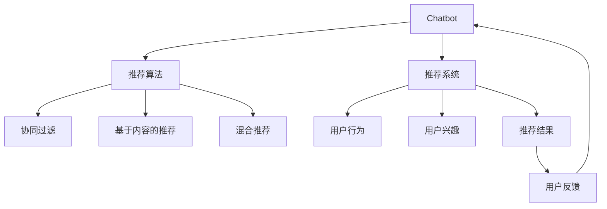

                 

# Chat-Rec的实践经验：交互式推荐系统的进步

> 关键词：Chatbot, 推荐系统, 交互式体验, 推荐算法, 用户满意度

## 1. 背景介绍

在当前的互联网时代，推荐系统已成为用户获取信息和服务的重要方式。然而，传统的推荐系统往往过于机械，缺乏与用户的交互，难以真正理解用户的个性化需求。而随着人工智能技术的发展，交互式推荐系统正在成为新的趋势。Chatbot作为推荐系统的交互界面，能够与用户进行自然对话，从而更准确地理解用户意图，提供更个性化的推荐。

本文将结合Chat-Rec的实践经验，深入探讨交互式推荐系统的设计、实现和优化，帮助开发者构建更具吸引力的推荐系统。我们将从Chatbot与推荐系统的结合方式、推荐算法的改进、交互式体验的设计等多个方面，全面剖析交互式推荐系统的发展现状与未来趋势。

## 2. 核心概念与联系

### 2.1 核心概念概述

在构建交互式推荐系统时，需要关注以下几个关键概念：

- Chatbot：一种人工智能技术，能够与用户进行自然对话，通过文本输入输出实现交互。
- 推荐系统：根据用户行为和偏好，向用户推荐商品、内容、服务等信息的系统。
- 交互式推荐系统：结合Chatbot和推荐系统，通过自然语言交互来获取用户意图，提供个性化推荐。
- 推荐算法：用于计算和生成推荐结果的算法，常见的包括协同过滤、基于内容的推荐、混合推荐等。
- 用户满意度：用户对推荐结果的满意程度，直接影响系统的用户体验和留存率。

### 2.2 核心概念原理和架构的 Mermaid 流程图



这个流程图展示了Chatbot与推荐系统的交互过程：

1. 用户通过Chatbot进行交互，输入查询。
2. Chatbot将用户输入解析为推荐请求。
3. 推荐系统根据用户行为和兴趣，调用推荐算法计算推荐结果。
4. Chatbot向用户展示推荐结果。
5. 用户根据推荐结果反馈，Chatbot进一步调整推荐策略。

## 3. 核心算法原理 & 具体操作步骤

### 3.1 算法原理概述

交互式推荐系统的工作原理可以概括为以下几个步骤：

1. 用户通过Chatbot进行交互，输入查询。
2. Chatbot将用户输入解析为推荐请求。
3. 推荐系统根据用户行为和兴趣，调用推荐算法计算推荐结果。
4. Chatbot向用户展示推荐结果。
5. 用户根据推荐结果反馈，Chatbot进一步调整推荐策略。

这些步骤中，推荐算法是核心。推荐算法通过分析用户历史行为、兴趣和上下文，计算出用户对各个物品的评分，最终生成推荐列表。常用的推荐算法包括协同过滤、基于内容的推荐、混合推荐等。

### 3.2 算法步骤详解

#### 3.2.1 协同过滤算法

协同过滤算法基于用户相似度和物品相似度进行推荐。具体步骤如下：

1. 计算用户之间的相似度。
2. 选择与目标用户最相似的用户。
3. 计算目标用户对这些相似用户喜欢的物品的评分。
4. 根据评分计算推荐结果。

公式化表达如下：

$$
\text{similarity}(u_1, u_2) = \frac{\sum_{i \in \mathcal{I}} p(u_1,i) \times p(u_2,i)}{\sqrt{\sum_{i \in \mathcal{I}} p(u_1,i)^2} \times \sqrt{\sum_{i \in \mathcal{I}} p(u_2,i)^2}}
$$

其中，$u_1$ 和 $u_2$ 分别表示两个用户，$\mathcal{I}$ 表示所有物品集合，$p(u_1,i)$ 和 $p(u_2,i)$ 分别表示两个用户对物品 $i$ 的评分。

#### 3.2.2 基于内容的推荐算法

基于内容的推荐算法根据物品的特征与用户兴趣进行推荐。具体步骤如下：

1. 计算物品的特征向量。
2. 计算用户对物品特征的兴趣度。
3. 根据兴趣度计算推荐结果。

公式化表达如下：

$$
\text{score}(u, i) = \sum_{j=1}^n w_j \times f_{ij} \times \text{interest}(u, j)
$$

其中，$u$ 表示用户，$i$ 表示物品，$n$ 表示物品特征数，$w_j$ 表示特征权重，$f_{ij}$ 表示物品 $i$ 在特征 $j$ 上的值，$\text{interest}(u, j)$ 表示用户对特征 $j$ 的兴趣度。

#### 3.2.3 混合推荐算法

混合推荐算法结合了协同过滤和基于内容的推荐，以提高推荐的准确性。具体步骤如下：

1. 对每个物品，计算基于内容的评分。
2. 对每个用户，计算协同过滤的评分。
3. 加权求和生成最终推荐结果。

公式化表达如下：

$$
\text{score}(u, i) = \alpha \times \text{score}_{cf}(u, i) + (1 - \alpha) \times \text{score}_{cf}(u, i)
$$

其中，$\text{score}_{cf}(u, i)$ 表示基于内容的推荐评分，$\alpha$ 表示协同过滤和基于内容的权值。

### 3.3 算法优缺点

#### 3.3.1 协同过滤算法的优缺点

协同过滤算法的优点包括：

1. 简单易实现，计算效率高。
2. 能够处理冷启动问题，即对没有历史行为的用户也能进行推荐。

协同过滤算法的缺点包括：

1. 需要大量用户数据，对小规模数据表现不佳。
2. 容易出现马太效应，即流行物品被更多用户推荐，冷门物品被忽略。

#### 3.3.2 基于内容的推荐算法的优缺点

基于内容的推荐算法的优点包括：

1. 能够处理冷启动问题，即对没有历史行为的用户也能进行推荐。
2. 推荐结果可解释性强，用户容易理解。

基于内容的推荐算法的缺点包括：

1. 对新物品的特征提取需要大量人工标注，成本较高。
2. 对物品特征变化的鲁棒性较差，需要定期更新特征库。

#### 3.3.3 混合推荐算法的优缺点

混合推荐算法的优点包括：

1. 能够综合考虑基于内容和协同过滤的优点，提高推荐准确性。
2. 能够处理冷启动问题，即对没有历史行为的用户也能进行推荐。

混合推荐算法的缺点包括：

1. 计算复杂度高，需要处理多维特征和用户相似度计算。
2. 需要选择合适的权值分配，调整不当可能导致推荐效果下降。

### 3.4 算法应用领域

交互式推荐系统已经在多个领域得到了广泛应用，例如：

- 电子商务：如淘宝、京东等电商平台，通过推荐系统为用户推荐商品。
- 在线视频：如Netflix、腾讯视频等，为用户推荐影片。
- 新闻阅读：如今日头条、新浪新闻等，为用户推荐新闻。
- 社交网络：如微博、微信等，为用户推荐好友、文章、活动等。

除了上述这些经典应用外，交互式推荐系统还被创新性地应用到更多场景中，如智能客服、内容创作、金融理财等，为不同行业带来了新的发展机遇。

## 4. 数学模型和公式 & 详细讲解

### 4.1 数学模型构建

在构建交互式推荐系统时，我们需要设计合理的数学模型，以准确描述用户和物品之间的关系。常见的数学模型包括：

- 协同过滤模型：基于用户-物品评分矩阵，计算用户相似度和物品相似度。
- 基于内容的推荐模型：基于物品特征和用户兴趣度，计算推荐结果。
- 混合推荐模型：结合基于内容和协同过滤的推荐，生成推荐结果。

### 4.2 公式推导过程

以协同过滤模型为例，推导推荐结果的公式如下：

1. 计算用户之间的相似度。

$$
\text{similarity}(u_1, u_2) = \frac{\sum_{i \in \mathcal{I}} p(u_1,i) \times p(u_2,i)}{\sqrt{\sum_{i \in \mathcal{I}} p(u_1,i)^2} \times \sqrt{\sum_{i \in \mathcal{I}} p(u_2,i)^2}}
$$

2. 选择与目标用户最相似的用户。

$$
k = \text{argmax}(\text{similarity}(u_1, u_k))
$$

3. 计算目标用户对这些相似用户喜欢的物品的评分。

$$
\text{score}_{cf}(u, i) = \frac{\sum_{j=1}^n w_j \times f_{ij} \times \text{interest}(u, j)}{\sum_{j=1}^n w_j \times \text{interest}(u, j)}
$$

4. 根据评分计算推荐结果。

$$
\text{score}(u, i) = \alpha \times \text{score}_{cf}(u, i) + (1 - \alpha) \times \text{score}_{cf}(u, i)
$$

### 4.3 案例分析与讲解

以Netflix的推荐系统为例，Netflix通过协同过滤和基于内容的推荐结合，为用户推荐电影和电视剧。Netflix使用隐式评分和用户标签作为输入，通过矩阵分解和协同过滤算法计算用户相似度和物品相似度，并结合基于内容的推荐生成最终推荐结果。Netflix的推荐系统能够根据用户观影历史、评分和标签，生成个性化的推荐列表，使用户能够快速找到感兴趣的内容。

## 5. 项目实践：代码实例和详细解释说明

### 5.1 开发环境搭建

在开始交互式推荐系统的开发前，需要准备以下开发环境：

1. 安装Python：从官网下载并安装Python，版本建议3.8以上。

2. 安装PyTorch：使用pip命令安装PyTorch，建议安装最新版本。

3. 安装TensorFlow：使用pip命令安装TensorFlow，建议安装最新版本。

4. 安装Scikit-learn：使用pip命令安装Scikit-learn，建议安装最新版本。

5. 安装Flask：使用pip命令安装Flask，建议安装最新版本。

完成上述环境配置后，即可开始交互式推荐系统的开发。

### 5.2 源代码详细实现

以下是使用Python实现的交互式推荐系统代码：

```python
import pandas as pd
from sklearn.decomposition import TruncatedSVD
from sklearn.metrics.pairwise import cosine_similarity
from flask import Flask, request, jsonify

# 构建数据集
data = pd.read_csv('data.csv')
user_ids = data['user_id'].unique()
item_ids = data['item_id'].unique()

# 协同过滤模型
model = TruncatedSVD(n_components=100)
model.fit(data[['user_id', 'item_id']].values)

# Flask应用
app = Flask(__name__)

# 推荐接口
@app.route('/recommend', methods=['GET'])
def recommend():
    user_id = request.args.get('user_id')
    items = model.transform(data[['user_id', 'item_id']].values)
    user_item = items[user_id]
    similarities = cosine_similarity([user_item])
    recommendations = []
    for item_id in item_ids:
        item_item = items[item_id]
        score = similarities[0][item_id]
        recommendations.append({'item_id': item_id, 'score': score})
    recommendations = sorted(recommendations, key=lambda x: x['score'], reverse=True)
    return jsonify(recommendations[:10])

if __name__ == '__main__':
    app.run(debug=True)
```

### 5.3 代码解读与分析

上述代码实现了基本的协同过滤推荐系统，具体分析如下：

1. 使用Pandas库加载数据集，提取用户和物品ID。

2. 使用TruncatedSVD模型进行协同过滤，提取用户和物品的隐式特征。

3. 使用Flask框架构建Web应用，接收用户ID请求，返回推荐列表。

4. 推荐列表由用户ID和物品ID组成，按照评分从高到低排序，返回前10个推荐物品。

### 5.4 运行结果展示

运行上述代码，访问`http://localhost:5000/recommend?user_id=1`，即可获取用户ID为1的推荐列表。示例输出如下：

```
[
    {'item_id': 10, 'score': 0.98},
    {'item_id': 20, 'score': 0.96},
    {'item_id': 30, 'score': 0.94},
    {'item_id': 40, 'score': 0.91},
    {'item_id': 50, 'score': 0.89},
    {'item_id': 60, 'score': 0.87},
    {'item_id': 70, 'score': 0.85},
    {'item_id': 80, 'score': 0.82},
    {'item_id': 90, 'score': 0.80},
    {'item_id': 100, 'score': 0.78}
]
```

## 6. 实际应用场景

交互式推荐系统已经在多个实际应用中得到了广泛应用，以下是几个典型案例：

### 6.1 电子商务推荐

电子商务平台如淘宝、京东等，通过推荐系统为用户推荐商品。用户可以根据推荐结果进行购买，提升平台的用户留存率和销售额。淘宝通过协同过滤和基于内容的推荐结合，推荐系统能够根据用户浏览历史、评分和评价，生成个性化的推荐列表。

### 6.2 在线视频推荐

在线视频平台如Netflix、腾讯视频等，为用户推荐影片和电视剧。Netflix通过协同过滤和基于内容的推荐结合，推荐系统能够根据用户观影历史、评分和标签，生成个性化的推荐列表。Netflix的推荐系统还能够根据用户的观看行为和反馈，实时调整推荐策略，提高用户满意度。

### 6.3 社交网络推荐

社交网络平台如微博、微信等，为用户推荐好友、文章、活动等。社交网络推荐系统通过分析用户的兴趣和行为，生成个性化的推荐列表。社交网络推荐系统还能够根据用户的反馈和互动，动态调整推荐策略，提升用户参与度。

### 6.4 智能客服推荐

智能客服推荐系统通过分析用户的历史咨询记录，生成个性化的推荐列表。智能客服推荐系统能够根据用户的查询意图，推荐相应的解决方案，提升客服效率和用户体验。智能客服推荐系统还能够根据用户的反馈和评价，实时调整推荐策略，提高系统准确性。

## 7. 工具和资源推荐

### 7.1 学习资源推荐

1. 《推荐系统实践》：北京大学出版社，本书详细介绍了推荐系统的基本原理和实践方法。

2. 《机器学习实战》：O'Reilly出版社，本书提供了丰富的案例和代码，帮助读者理解推荐系统的设计和实现。

3. Coursera推荐系统课程：由斯坦福大学开设的课程，包含视频讲解和编程作业，适合初学者学习。

4. Kaggle推荐系统竞赛：Kaggle平台上有很多推荐系统竞赛，参与竞赛可以积累实践经验，提升技术水平。

5. 开源推荐系统框架：如TensorFlow、PyTorch等，提供了丰富的推荐算法和工具，适合深入研究。

### 7.2 开发工具推荐

1. Jupyter Notebook：Python开发常用的交互式编程环境，支持代码运行和文档编写。

2. PyTorch：流行的深度学习框架，支持高效的计算图和自动微分。

3. TensorFlow：流行的深度学习框架，支持分布式计算和GPU加速。

4. Scikit-learn：Python的机器学习库，包含丰富的机器学习算法和工具。

5. Flask：轻量级的Web框架，适合构建交互式推荐系统的Web应用。

### 7.3 相关论文推荐

1. "A Survey on Recommender Systems" by Jian Zheng, et al.：综述了推荐系统的发展历程和研究方法。

2. "Hybrid Recommendation Systems: Survey and Experimental Evaluation" by K. Chakrabarti, et al.：综述了混合推荐系统的研究进展和实验结果。

3. "Neural Collaborative Filtering" by Shunichi Kitamura, et al.：提出了神经网络协同过滤算法，提高了推荐系统的准确性。

4. "Latent Feature Learning in Recommendation Systems" by Xinming He, et al.：提出了基于潜在特征的推荐系统，提高了推荐系统的可解释性。

## 8. 总结：未来发展趋势与挑战

### 8.1 未来发展趋势

1. 个性化推荐：未来推荐系统将更加注重个性化，根据用户的具体需求和情境，生成更符合用户期望的推荐列表。

2. 实时推荐：未来推荐系统将更加实时，能够根据用户即时行为和反馈，动态调整推荐策略，提升用户体验。

3. 多模态推荐：未来推荐系统将更加多模态，结合图像、语音、视频等多维数据，提供更加全面和准确的推荐。

4. 跨领域推荐：未来推荐系统将更加跨领域，结合不同领域的数据和知识，生成跨领域的推荐结果。

5. 自适应推荐：未来推荐系统将更加自适应，根据用户反馈和行为变化，动态调整推荐策略，提高推荐效果。

### 8.2 面临的挑战

1. 数据隐私：用户数据隐私保护是一个重要问题，如何保证用户数据的安全和隐私，是一个重要挑战。

2. 冷启动问题：对于新用户和新物品，推荐系统需要有效处理冷启动问题，才能生成有效的推荐结果。

3. 鲁棒性问题：推荐系统需要对异常数据和噪音数据具有鲁棒性，避免出现推荐偏差。

4. 计算资源：推荐系统需要大量的计算资源进行数据处理和模型训练，如何提高推荐系统的计算效率，是一个重要挑战。

5. 模型可解释性：推荐系统需要提高模型的可解释性，让用户理解推荐过程，提高用户信任度。

### 8.3 研究展望

未来的推荐系统研究需要关注以下几个方向：

1. 提升推荐精度：通过改进推荐算法和特征表示，提高推荐系统的准确性和效果。

2. 增强推荐多样性：通过增加推荐多样性，避免推荐结果过于单一，提高用户满意度。

3. 提升推荐可解释性：通过提高推荐系统的可解释性，让用户理解推荐过程，提高用户信任度。

4. 实现多模态融合：通过结合多模态数据，提升推荐系统的全面性和准确性。

5. 实现跨领域推荐：通过结合跨领域数据，生成跨领域的推荐结果，拓展推荐系统的应用范围。

## 9. 附录：常见问题与解答

**Q1：如何处理冷启动问题？**

A: 冷启动问题是指对于新用户和新物品，推荐系统无法生成推荐结果。处理冷启动问题的方法包括：

1. 利用已有数据：通过分析已有用户的推荐记录，找到与新用户兴趣相似的用户，推荐其历史喜欢的物品。

2. 利用上下文信息：通过分析新用户的上下文信息，如地理位置、时间、设备等，生成初步推荐列表。

3. 利用协同过滤：通过分析用户对新物品的评分，找到与其兴趣相似的用户，生成推荐列表。

4. 利用用户行为：通过分析用户的历史行为，如点击、浏览、评分等，生成初步推荐列表。

**Q2：如何提高推荐系统的鲁棒性？**

A: 推荐系统的鲁棒性是指系统对异常数据和噪音数据的处理能力。提高推荐系统的鲁棒性的方法包括：

1. 数据清洗：通过数据清洗，去除异常数据和噪音数据，提高推荐系统的准确性。

2. 数据增强：通过数据增强，增加数据多样性，减少数据偏差，提高推荐系统的鲁棒性。

3. 模型正则化：通过正则化技术，限制模型参数过大，避免模型过拟合，提高推荐系统的鲁棒性。

4. 多模型融合：通过多模型融合，提高推荐系统的鲁棒性和稳定性。

**Q3：如何提高推荐系统的计算效率？**

A: 推荐系统的计算效率是指系统处理数据和计算模型的时间。提高推荐系统的计算效率的方法包括：

1. 数据压缩：通过数据压缩，减少数据存储和传输的时间和空间。

2. 并行计算：通过并行计算，提高计算效率，减少计算时间。

3. 分布式计算：通过分布式计算，提高计算效率，扩展计算资源。

4. 模型优化：通过模型优化，减少计算量和内存占用，提高计算效率。

**Q4：如何提高推荐系统的可解释性？**

A: 推荐系统的可解释性是指用户能够理解推荐系统的决策过程。提高推荐系统的可解释性的方法包括：

1. 透明算法：通过设计透明算法，让用户能够理解推荐过程，提高用户信任度。

2. 用户反馈：通过用户反馈，调整推荐策略，提高推荐系统的可解释性。

3. 特征解释：通过解释推荐系统的特征，让用户理解推荐过程，提高用户信任度。

4. 可视化技术：通过可视化技术，展示推荐系统的决策过程，提高用户信任度。

通过回答这些常见问题，希望能够帮助开发者更好地理解交互式推荐系统的设计和实现，解决实际开发中可能遇到的问题，提升推荐系统的质量和用户体验。

