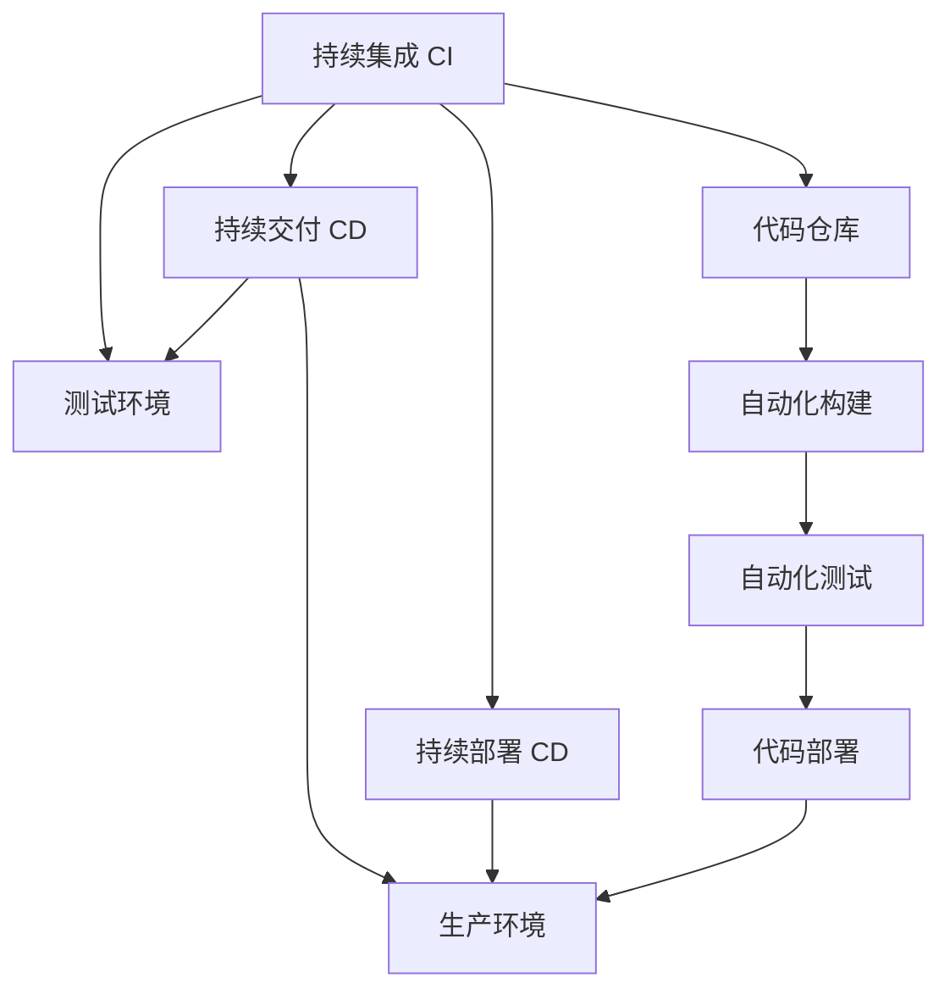

                 

# DevOps实践：持续集成与持续部署的最佳实践

> 关键词：DevOps,持续集成(CI),持续部署(CD),自动化,流水线,DevOps工具链,持续交付

## 1. 背景介绍

### 1.1 问题由来
随着软件开发规模的不断扩大和复杂性的增加，传统的软件开发生命周期(瀑布模型)已无法满足快速响应市场变化和客户需求的需求。开发团队需要更灵活、更高效的软件交付机制，能够快速集成、构建、测试和部署软件。DevOps（开发与运维的集成）应运而生，通过自动化工具和最佳实践，实现软件开发和运维的无缝衔接，提升软件交付的速度和质量。

持续集成与持续部署（CI/CD）作为DevOps的核心实践，通过自动化代码集成、构建、测试和部署，实现了软件的快速交付和可靠运行。本文将系统性地介绍CI/CD的基本概念、核心算法原理、具体操作步骤，并结合实际应用场景，详细讲解如何构建高效稳定的CI/CD流水线。

### 1.2 问题核心关键点
DevOps和CI/CD的核心理念是通过自动化工具和持续协作，提升软件开发的效率和质量。具体来说，CI/CD的实践包括以下几个关键点：

- 自动化：自动化的代码集成、构建、测试和部署，缩短开发周期，提升交付速度。
- 反馈循环：通过持续的代码提交和反馈，快速发现和修复问题，提高代码质量。
- 持续交付：通过自动化流程，确保软件在交付时已经经过充分的测试和验证，降低上线风险。
- 团队协作：打破开发和运维的壁垒，实现跨团队的协作和沟通，提升整体效率。

本文将深入解析这些核心关键点，通过系统化的讲解和实践，帮助读者构建高效、稳定的CI/CD流水线。

## 2. 核心概念与联系

### 2.1 核心概念概述

为更好地理解DevOps和CI/CD的实践，本节将介绍几个密切相关的核心概念：

- **持续集成(Continuous Integration, CI)**：通过自动化的方式，将代码提交到代码仓库后，立即进行构建和测试，以确保代码能够快速、可靠地集成。
- **持续部署(Continuous Deployment, CD)**：在代码通过构建和测试后，自动部署到生产环境，实现软件的快速交付和上线。
- **持续交付(Continuous Delivery, CD)**：在代码通过构建和测试后，自动部署到测试环境，进行彻底的测试和验证，但不立即部署到生产环境。
- **自动化(Automation)**：使用工具和脚本自动化CI/CD流程，减少人工操作，提高效率和一致性。
- **流水线(Pipeline)**：将CI/CD流程拆分为多个可重复执行的阶段，通过流水线串联，实现自动化和无缝衔接。

这些核心概念之间的逻辑关系可以通过以下Mermaid流程图来展示：



这个流程图展示了CI/CD流程的核心组件和连接方式：

1. 代码仓库存储开发者提交的代码。
2. 自动化构建工具（如Jenkins）在代码提交后立即执行构建过程。
3. 自动化测试工具（如Selenium）执行单元测试和集成测试，验证代码的正确性。
4. 如果构建和测试通过，自动化部署工具（如Ansible）将代码部署到测试环境。
5. 在测试环境进行进一步测试和验证，确保软件质量。
6. 如果所有测试通过，部署工具将代码部署到生产环境。

这些组件和流程通过流水线串联，实现持续集成和持续部署，大大提升了软件开发的效率和质量。

## 3. 核心算法原理 & 具体操作步骤

### 3.1 算法原理概述

持续集成与持续部署的原理可以概括为“自动化流水线”。即通过将软件开发流程拆分为多个自动化阶段，每个阶段执行特定的构建、测试或部署任务，实现软件交付的自动化和连续性。

在CI/CD流程中，代码提交、构建、测试、部署等关键环节都通过自动化工具和脚本执行。这些工具通常基于分布式版本控制系统（如Git）和集成开发环境（IDE），能够高效、准确地处理代码变更，并实时生成反馈信息。

### 3.2 算法步骤详解

CI/CD的实施流程包括以下关键步骤：

**Step 1: 配置版本控制系统**
- 选择合适的版本控制系统（如Git），配置代码仓库和权限。
- 安装和配置Git客户端，确保所有开发者能够顺畅地提交代码。

**Step 2: 配置自动化构建工具**
- 选择合适的构建工具（如Jenkins、Travis CI），进行配置和安装。
- 配置构建环境（如Docker容器），确保构建过程的一致性和可重复性。

**Step 3: 配置自动化测试工具**
- 选择合适的测试工具（如Selenium、JUnit），配置测试脚本和环境。
- 设计测试用例，确保测试覆盖代码的关键路径和边界情况。

**Step 4: 配置自动化部署工具**
- 选择合适的部署工具（如Ansible、Jenkins Pipeline），进行配置和安装。
- 配置部署环境（如Kubernetes、Docker Swarm），确保部署过程的一致性和可控性。

**Step 5: 配置CI/CD流水线**
- 将构建、测试、部署等阶段整合成流水线，定义每个阶段的触发条件和执行顺序。
- 使用持续集成平台（如Jenkins、CircleCI）搭建流水线，实现自动化流程。

**Step 6: 监控和反馈**
- 使用监控工具（如Prometheus、Grafana）实时监控流水线的执行状态。
- 设置告警机制，及时发现和处理流水线中的异常。

**Step 7: 持续优化**
- 定期审查流水线流程，优化配置和脚本。
- 收集和分析流水线数据，发现瓶颈和问题，持续改进。

通过以上步骤，可以构建高效、稳定的CI/CD流水线，实现软件开发的自动化和持续交付。

### 3.3 算法优缺点

持续集成与持续部署的主要优点包括：
- 提高开发效率：通过自动化流程，快速集成、构建、测试和部署代码，缩短开发周期。
- 提升软件质量：持续的反馈和测试，及时发现和修复代码问题，提高代码质量。
- 降低上线风险：通过彻底的测试和验证，确保软件在上线时已达到生产标准。
- 增强团队协作：打破开发和运维的壁垒，实现跨团队的协作和沟通，提升整体效率。

同时，CI/CD也存在一些局限性：
- 依赖工具和技术栈：CI/CD流程需要依赖特定的工具和技术栈，可能导致切换成本高。
- 配置复杂：流水线的配置和调试可能需要耗费大量时间和精力，特别是在大型系统或复杂项目中。
- 系统复杂性：大规模项目的CI/CD流程可能非常复杂，维护和优化难度大。
- 安全性问题：自动化流程和部署可能导致安全漏洞，需要严格的安全控制和测试。

尽管存在这些局限性，但CI/CD仍是当前软件开发和运维的最佳实践之一，通过持续改进和优化，可以最大程度地发挥其优势。

### 3.4 算法应用领域

CI/CD的实践广泛应用于软件开发、测试、运维等多个领域，涵盖了从软件开发到软件交付的全生命周期：

- **软件开发**：通过持续集成，快速集成、构建和测试代码变更，提升开发效率。
- **测试**：通过持续测试，实时反馈和修复代码问题，提升软件质量。
- **运维**：通过持续部署，自动部署代码到生产环境，实现软件的快速交付和上线。
- **持续交付**：通过持续交付，自动部署代码到测试环境，进行彻底的测试和验证，但不立即部署到生产环境。
- **DevOps文化**：通过跨团队的协作和沟通，提升整体效率和质量。

这些应用场景展示了CI/CD的广泛适用性和深远影响，是现代软件开发的重要实践。

## 4. 数学模型和公式 & 详细讲解 & 举例说明

### 4.1 数学模型构建

在CI/CD流程中，自动化构建和测试过程可以视为数学模型求解问题。设开发团队的代码库为 $C$，构建过程为 $B$，测试过程为 $T$，部署过程为 $D$。

定义函数 $f(C, B, T, D)$ 为整个过程的执行结果，其中 $C$ 表示代码库的状态，$B$ 表示构建过程的状态，$T$ 表示测试过程的状态，$D$ 表示部署过程的状态。在每个阶段，状态 $C, B, T, D$ 都会发生变化，模型求解的目标是找到最优的 $B, T, D$，使得 $f(C, B, T, D)$ 达到最优。

在实际应用中，$f$ 函数通常表示为一个复杂的组合函数，涉及到代码构建、测试、部署等多个环节的集成。以下是一个简化的数学模型，用于说明CI/CD流程的求解过程：

$$
f(C, B, T, D) = \min_{B, T, D} \left( \sum_{i=1}^n L_i(B, T, D) \right)
$$

其中 $L_i$ 表示第 $i$ 个阶段的状态损失函数，用于衡量该阶段的状态变化。

### 4.2 公式推导过程

在CI/CD流程中，每个阶段的状态变化可以通过以下步骤推导：

- **代码提交**：开发者将代码提交到代码库 $C$。设提交代码的概率为 $p$，则 $C \rightarrow C'$。
- **构建**：构建工具执行构建过程，将代码转换为可执行的构建结果。设构建成功概率为 $q_B$，则 $C' \rightarrow C_B'$。
- **测试**：测试工具执行测试过程，检查代码的正确性。设测试成功概率为 $q_T$，则 $C_B' \rightarrow C_T'$。
- **部署**：部署工具执行部署过程，将代码部署到生产环境。设部署成功概率为 $q_D$，则 $C_T' \rightarrow C_D'$。

通过以上推导，可以构建一个状态转移图，描述CI/CD流程的执行路径：

```
    C
    |
    v
  C'
    |
    v
  C_B'
    |
    v
  C_T'
    |
    v
  C_D'
    |
    v
    D
```

每个状态转移都对应一个状态损失函数 $L$，用于衡量该状态的变化。例如，构建失败的状态损失函数为：

$$
L_B(C_B', C') = \max(0, C' - C_B')
$$

测试失败的状态损失函数为：

$$
L_T(C_T', C_B')
$$

部署失败的状态损失函数为：

$$
L_D(C_D', C_T')
$$

通过求解这些状态损失函数，可以最小化整体状态变化，实现最优的CI/CD流程。

### 4.3 案例分析与讲解

以下是一个具体的CI/CD案例，用于说明如何应用数学模型求解CI/CD流程：

假设某开发团队使用Git作为版本控制系统，Jenkins作为构建工具，Selenium作为测试工具，Ansible作为部署工具。团队开发了一个Web应用，需要在每个版本提交后，自动进行构建、测试和部署，以确保应用的质量和稳定性。

**Step 1: 配置版本控制系统**
- 安装和配置Git客户端，确保所有开发者能够顺畅地提交代码。

**Step 2: 配置自动化构建工具**
- 安装和配置Jenkins，连接代码仓库，定义构建脚本和环境。
- 配置构建脚本，执行构建过程，并将构建结果上传到Jenkins构建仓库。

**Step 3: 配置自动化测试工具**
- 安装和配置Selenium，定义测试脚本和环境。
- 设计测试用例，覆盖应用的关键功能模块。
- 在Jenkins构建仓库中定义测试触发器，自动执行测试过程。

**Step 4: 配置自动化部署工具**
- 安装和配置Ansible，定义部署脚本和环境。
- 配置部署脚本，执行部署过程，并将部署结果上传到Jenkins部署仓库。

**Step 5: 配置CI/CD流水线**
- 在Jenkins中搭建流水线，定义每个阶段的触发条件和执行顺序。
- 配置流水线的持续集成和持续部署触发器，确保每次代码提交都会自动触发构建、测试和部署流程。

**Step 6: 监控和反馈**
- 使用Prometheus和Grafana监控流水线的执行状态。
- 设置告警机制，及时发现和处理流水线中的异常。

通过以上步骤，可以构建一个完整的CI/CD流程，实现代码提交、构建、测试和部署的自动化。

## 5. 项目实践：代码实例和详细解释说明

### 5.1 开发环境搭建

在进行CI/CD实践前，我们需要准备好开发环境。以下是使用Jenkins进行CI/CD开发的环境配置流程：

1. 安装Jenkins：从官网下载并安装Jenkins，在本地搭建Jenkins服务器。
2. 安装Git客户端：确保所有开发者能够顺畅地提交代码。
3. 安装Docker：使用Docker容器搭建构建和测试环境。
4. 配置构建脚本：在Docker容器中编写构建脚本，自动执行构建过程。
5. 配置测试脚本：编写Selenium测试脚本，覆盖应用的关键功能模块。
6. 配置部署脚本：编写Ansible部署脚本，自动执行部署过程。
7. 配置Jenkins流水线：在Jenkins中搭建流水线，定义每个阶段的触发条件和执行顺序。
8. 配置监控工具：安装Prometheus和Grafana，监控流水线的执行状态。

完成上述步骤后，即可在Jenkins环境中开始CI/CD实践。

### 5.2 源代码详细实现

下面我们以Jenkins CI/CD实践为例，给出完整的代码实现。

首先，定义Jenkins的配置文件：

```yaml
# Jenkinsfile示例
pipeline {
    agent any
    stages {
        stage('构建') {
            steps {
                sh 'docker build -t my-app -f Dockerfile .'
            }
        }
        stage('测试') {
            steps {
                sh 'docker run -d my-app:latest /bin/bash -c "selenium_hub"
                sh 'docker exec selenium_hub selenium-webdriver chrome --urls http://localhost:4444/wd/hub --capabilities { "browserName": "chrome" }'
            }
        }
        stage('部署') {
            steps {
                sh 'ansible-playbook -i inventory deploy.yml'
            }
        }
    }
    post {
        always {
            echo 'CI/CD流水线完成'
        }
    }
}
```

然后，定义Jenkins的触发器和流水线配置：

```bash
# Jenkinsfile示例
pipeline {
    agent any
    stages {
        stage('构建') {
            steps {
                sh 'docker build -t my-app -f Dockerfile .'
            }
        }
        stage('测试') {
            steps {
                sh 'docker run -d my-app:latest /bin/bash -c "selenium_hub"
                sh 'docker exec selenium_hub selenium-webdriver chrome --urls http://localhost:4444/wd/hub --capabilities { "browserName": "chrome" }'
            }
        }
        stage('部署') {
            steps {
                sh 'ansible-playbook -i inventory deploy.yml'
            }
        }
    }
    post {
        always {
            echo 'CI/CD流水线完成'
        }
    }
}
```

最后，启动Jenkins流水线：

```bash
# Jenkinsfile示例
pipeline {
    agent any
    stages {
        stage('构建') {
            steps {
                sh 'docker build -t my-app -f Dockerfile .'
            }
        }
        stage('测试') {
            steps {
                sh 'docker run -d my-app:latest /bin/bash -c "selenium_hub"
                sh 'docker exec selenium_hub selenium-webdriver chrome --urls http://localhost:4444/wd/hub --capabilities { "browserName": "chrome" }'
            }
        }
        stage('部署') {
            steps {
                sh 'ansible-playbook -i inventory deploy.yml'
            }
        }
    }
    post {
        always {
            echo 'CI/CD流水线完成'
        }
    }
}
```

以上就是使用Jenkins进行CI/CD实践的完整代码实现。可以看到，通过Jenkinsfile和Pipeline，可以实现流水线的自动化配置和执行，大大提升了CI/CD流程的效率和可维护性。

### 5.3 代码解读与分析

让我们再详细解读一下关键代码的实现细节：

**Jenkinsfile类**：
- `pipeline`方法：定义整个流水线的执行流程，使用`agent any`指定任意节点作为流水线执行代理。
- `stages`方法：将流水线划分为多个阶段，每个阶段执行特定的构建、测试或部署任务。
- `steps`方法：在每个阶段执行具体的构建、测试或部署操作。

**触发器和流水线配置**：
- `trigger`方法：配置流水线的触发条件，确保每次代码提交都会自动触发构建、测试和部署流程。
- `post`方法：配置流水线的完成回调操作，输出流水线执行结果。

**触发器配置**：
- `always`：配置流水线的始终执行触发器，无论流水线是否成功，都会执行`always`中的操作。
- `echo`：输出流水线执行结果，用于监控流水线的执行状态。

通过以上代码实现，可以构建一个完整的Jenkins CI/CD流水线，实现代码提交、构建、测试和部署的自动化。

## 6. 实际应用场景

### 6.1 软件开发团队
对于软件开发团队，CI/CD实践可以显著提升开发效率和代码质量。通过持续集成，团队可以实时获取代码变更和反馈，快速发现和修复问题。持续部署确保软件在上线前已经经过充分的测试和验证，降低上线风险。持续交付则通过自动化的测试和部署流程，提升软件的稳定性和可靠性。

### 6.2 企业运维团队
对于企业运维团队，CI/CD实践可以提升运维效率和系统稳定性。通过持续集成，运维团队可以及时获取新版本代码，快速构建和测试。持续部署确保新版本代码在上线前已经经过彻底的测试和验证，降低上线风险。持续交付则通过自动化的测试和部署流程，提升系统的稳定性和可靠性。

### 6.3 科技初创公司
对于科技初创公司，CI/CD实践可以加速产品迭代和市场响应。通过持续集成，团队可以快速集成和测试代码变更，缩短产品开发周期。持续部署确保产品代码在上线前已经经过充分的测试和验证，降低上线风险。持续交付则通过自动化的测试和部署流程，提升产品的稳定性和可靠性。

### 6.4 未来应用展望
随着DevOps文化的深入推广，CI/CD实践将在更多行业得到应用，为软件研发和运维带来深刻变革。

在智慧医疗领域，CI/CD实践可以加速医疗软件和系统的开发和部署，提升医疗服务的智能化水平。在智能制造领域，CI/CD实践可以加速工业软件和设备的开发和部署，提升制造企业的自动化水平。在智慧农业领域，CI/CD实践可以加速农业软件和系统的开发和部署，提升农业生产的智能化水平。

在未来的物联网领域，CI/CD实践可以加速IoT设备和系统的开发和部署，提升物联网应用的可靠性和稳定性。在未来的智能交通领域，CI/CD实践可以加速交通管理系统的开发和部署，提升交通系统的智能化水平。在未来的智慧城市领域，CI/CD实践可以加速城市管理和服务的开发和部署，提升城市管理的智能化水平。

## 7. 工具和资源推荐

### 7.1 学习资源推荐

为了帮助开发者系统掌握CI/CD的理论基础和实践技巧，这里推荐一些优质的学习资源：

1. **《DevOps实践指南》**：李海翔著，介绍了DevOps的基本概念、最佳实践和工具链。
2. **《CI/CD最佳实践》**：Definitive Guide to Continuous Integration and Continuous Deployment，详细介绍了CI/CD的核心概念和实现方法。
3. **《Jenkins官方文档》**：Jenkins官网提供的大量文档和示例代码，帮助开发者深入理解Jenkins的配置和实现。
4. **《Docker官方文档》**：Docker官网提供的大量文档和示例代码，帮助开发者深入理解Docker的配置和实现。
5. **《Ansible官方文档》**：Ansible官网提供的大量文档和示例代码，帮助开发者深入理解Ansible的配置和实现。

通过对这些资源的学习实践，相信你一定能够快速掌握CI/CD的精髓，并用于解决实际的开发和运维问题。

### 7.2 开发工具推荐

高效的开发离不开优秀的工具支持。以下是几款用于CI/CD开发的常用工具：

1. **Jenkins**：开源的持续集成和持续部署平台，支持丰富的插件和扩展，广泛用于企业级开发和运维。
2. **CircleCI**：云端的持续集成和持续部署平台，支持大规模的分布式构建和测试，适合大型软件开发团队。
3. **GitLab CI**：GitLab集成的持续集成和持续部署平台，支持CI/CD流程的自动化配置和执行。
4. **Travis CI**：开源的持续集成平台，支持基于GitHub的自动化构建和测试，适合开源项目和初创团队。
5. **Jenkins Pipeline**：Jenkins的流水线插件，支持脚本驱动的CI/CD流程配置和执行。

合理利用这些工具，可以显著提升CI/CD流程的开发效率和可维护性。

### 7.3 相关论文推荐

CI/CD实践源于学界的持续研究。以下是几篇奠基性的相关论文，推荐阅读：

1. **《Pivotal Operations: Continuous Deployment in Practice》**：Pivotal公司的实践总结，介绍了CI/CD在企业中的应用和挑战。
2. **《DevOps as a Culture》**：Gary Gallaugher和Mark Graham的论文，讨论了DevOps文化的本质和实现方法。
3. **《Continuous Delivery: Reliable Software Releases through Build, Test, and Deploy Automation》**：Martin Fowler的论文，详细介绍了CI/CD的核心概念和实践。
4. **《The Three Pillars of DevOps》**：Patrick Debois和David Farley的论文，讨论了DevOps的三个核心支柱：文化、实践和工具。

这些论文代表了大规模系统开发和运维的最佳实践，值得深入学习和借鉴。

## 8. 总结：未来发展趋势与挑战

### 8.1 研究成果总结

本文对CI/CD的基本概念、核心算法原理、具体操作步骤进行了系统性的介绍。通过深入解析CI/CD的核心理念和实现方法，帮助读者构建高效、稳定的CI/CD流水线，提升软件开发和运维的效率和质量。

通过本文的系统梳理，可以看到，CI/CD实践已经成为软件开发和运维的重要方法，其广泛适用性和深远影响得到了业界的一致认可。通过持续改进和优化，CI/CD必将在更多行业得到应用，为软件研发和运维带来革命性变革。

### 8.2 未来发展趋势

展望未来，CI/CD实践将呈现以下几个发展趋势：

1. **自动化程度提高**：自动化流水线将更加复杂和精细，涵盖更多的阶段和任务，实现全链路的自动化。
2. **容器化趋势增强**：容器化和微服务架构将成为主流，通过Docker等容器技术，实现软件的快速构建和部署。
3. **持续交付成为标配**：持续交付将逐渐成为开发团队的标配，确保软件在上线前经过充分的测试和验证。
4. **云原生技术崛起**：云原生技术（如Kubernetes、Prometheus、Grafana等）将成为CI/CD的重要基础设施，提升系统的稳定性和可靠性。
5. **DevOps文化普及**：DevOps文化将成为软件开发和运维的重要组成部分，提升团队协作和沟通效率。

这些趋势展示了CI/CD实践的未来方向，预示着CI/CD将带来更多创新和突破。

### 8.3 面临的挑战

尽管CI/CD实践已经取得了显著成效，但在应用过程中，仍面临一些挑战：

1. **依赖工具和技术栈**：CI/CD流程需要依赖特定的工具和技术栈，可能导致切换成本高。
2. **配置复杂**：流水线的配置和调试可能需要耗费大量时间和精力，特别是在大型系统或复杂项目中。
3. **系统复杂性**：大规模项目的CI/CD流程可能非常复杂，维护和优化难度大。
4. **安全性问题**：自动化流程和部署可能导致安全漏洞，需要严格的安全控制和测试。

尽管存在这些挑战，但CI/CD仍是当前软件开发和运维的最佳实践之一，通过持续改进和优化，可以最大程度地发挥其优势。

### 8.4 研究展望

面向未来，CI/CD研究需要在以下几个方向寻求新的突破：

1. **开发与运维的融合**：进一步加强开发与运维的融合，实现跨团队的协作和沟通，提升整体效率和质量。
2. **自动化程度提升**：提升自动化流水线的复杂度和精细度，实现全链路的自动化。
3. **持续交付和快速反馈**：通过持续交付和快速反馈，提升软件的稳定性和可靠性。
4. **云原生技术集成**：将云原生技术（如Kubernetes、Prometheus、Grafana等）集成到CI/CD流程中，提升系统的稳定性和可靠性。
5. **DevOps文化推广**：推广DevOps文化，提升团队协作和沟通效率。

这些研究方向将引领CI/CD技术迈向更高的台阶，为软件开发和运维带来更多创新和突破。

## 9. 附录：常见问题与解答

**Q1：持续集成与持续部署如何提升开发效率？**

A: 持续集成与持续部署通过自动化流程，将软件开发和运维的无缝衔接，实现快速迭代和交付。通过自动化构建、测试和部署，快速获取代码变更和反馈，及时发现和修复问题，提高开发效率。持续交付则通过自动化的测试和部署流程，确保软件在上线前已经经过充分的测试和验证，降低上线风险。

**Q2：持续集成与持续部署如何提高软件质量？**

A: 持续集成与持续部署通过自动化流程，实时获取代码变更和反馈，及时发现和修复问题，提高代码质量。持续交付则通过自动化的测试和部署流程，确保软件在上线前已经经过充分的测试和验证，降低上线风险。持续部署则通过自动化的部署流程，确保软件在上线前已经经过充分的测试和验证，提高软件质量。

**Q3：持续集成与持续部署如何降低上线风险？**

A: 持续集成与持续部署通过自动化的流程，确保代码变更经过充分的测试和验证，降低上线风险。持续交付则通过自动化的测试和部署流程，确保软件在上线前已经经过充分的测试和验证，降低上线风险。持续部署则通过自动化的部署流程，确保软件在上线前已经经过充分的测试和验证，降低上线风险。

**Q4：持续集成与持续部署如何提升团队协作？**

A: 持续集成与持续部署通过自动化流程，打破开发与运维的壁垒，实现跨团队的协作和沟通。持续交付则通过自动化的测试和部署流程，确保软件在上线前已经经过充分的测试和验证，降低上线风险。持续部署则通过自动化的部署流程，确保软件在上线前已经经过充分的测试和验证，提高软件质量。

通过本文的系统梳理，可以看到，持续集成与持续部署实践已经成为软件开发和运维的重要方法，其广泛适用性和深远影响得到了业界的一致认可。通过持续改进和优化，CI/CD必将在更多行业得到应用，为软件开发和运维带来革命性变革。

---

作者：禅与计算机程序设计艺术 / Zen and the Art of Computer Programming

