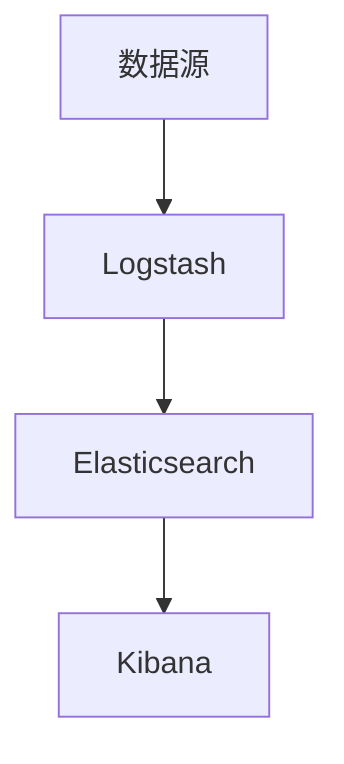

                 

# ELK日志分析系统搭建

> 关键词：ELK, 日志分析, 日志管理, 日志聚合, 实时监控

## 1. 背景介绍

### 1.1 问题由来

随着互联网和云计算技术的迅速发展，企业系统日趋复杂，日志量也急剧增加。高效、精确的日志管理成为企业运维不可或缺的一部分。然而，传统的手工日志分析方式耗时费力，且容易出错。如何构建一套自动化的、实时的日志分析系统，成为运维人员的迫切需求。

### 1.2 问题核心关键点

ELK（Elasticsearch, Logstash, Kibana）作为一个流行的日志分析框架，广泛应用于企业的运维监控场景中。它通过Logstash进行数据收集和预处理，Elasticsearch实现数据的存储和查询，Kibana提供可视化的仪表盘界面，使得企业能够高效、灵活地进行日志管理和分析。

构建ELK系统需要考虑的核心关键点包括：

- 数据收集：选择合适的数据源，通过Logstash进行数据收集。
- 数据预处理：对收集到的日志进行清洗、解析、转化等预处理，以便于后续存储和分析。
- 数据存储：使用Elasticsearch进行日志数据的存储和管理。
- 数据分析：通过Elasticsearch进行日志数据的查询和分析，获取有价值的信息。
- 数据展示：使用Kibana构建实时监控和可视化仪表盘，方便运维人员进行监测和决策。

本文将详细介绍如何搭建一套高效、实用的ELK日志分析系统，以提升企业运维效率，保障系统稳定运行。

## 2. 核心概念与联系

### 2.1 核心概念概述

为更好地理解ELK日志分析系统的构建原理，本节将介绍几个密切相关的核心概念：

- Elasticsearch: 一种分布式、高性能的搜索引擎，支持实时查询和索引存储，是ELK系统的核心组件。
- Logstash: 一种开源的数据管道系统，可以对日志数据进行收集、过滤、解析、转换等预处理操作。
- Kibana: 基于Elasticsearch的可视化仪表盘系统，通过友好的Web界面，提供数据分析和展示功能。

这些核心概念之间通过数据流进行紧密连接，共同构成ELK日志分析系统的工作流程，如下所示：



这个流程图展示了大规模日志数据的处理流程：

1. 数据源产生日志，经过Logstash的初步处理后，进入Elasticsearch。
2. Elasticsearch存储和处理日志数据，并提供实时查询接口。
3. Kibana读取Elasticsearch中的数据，进行可视化展示和分析。

## 3. 核心算法原理 & 具体操作步骤

### 3.1 算法原理概述

ELK日志分析系统的核心算法原理，可以简单概括为以下几个步骤：

1. 数据收集：Logstash从多个数据源（如应用程序日志、网络流量日志等）中收集日志数据，并进行预处理。
2. 数据存储：Elasticsearch接收Logstash预处理后的日志数据，进行实时存储和索引。
3. 数据分析：通过Elasticsearch提供的查询接口，用户可以实时查询和分析日志数据。
4. 数据展示：Kibana通过可视化仪表盘，展示和分析Elasticsearch中的数据，生成各种图表和报告。

### 3.2 算法步骤详解

#### 3.2.1 数据收集

Logstash的配置文件（filter、output）是关键，决定了日志数据如何进行预处理和传输。以下是Logstash配置文件的示例：

```logstash
input {
  file {
    path => "/var/log/yourapp.log"
    start_position => "time"
  }
}

filter {
  grok {
    match => ["message", "%{app_name} %{app_id} (%{message})"]
  }
}

output {
  elasticsearch {
    hosts => ["localhost:9200"]
    index => "yourlogindex"
  }
}
```

该配置文件实现了以下功能：

- 输入插件（input）：从本地文件系统中读取日志文件。
- 过滤器插件（filter）：使用Grok插件解析日志内容，提取关键信息。
- 输出插件（output）：将处理后的日志数据发送到Elasticsearch中进行存储。

#### 3.2.2 数据存储

Elasticsearch的集群部署是构建ELK系统的基础。以下是一个Elasticsearch集群的简单配置：

```yaml
node:
  name: node-1
  host: "node1"
  cluster:
    name: mycluster
  node_data:
    threads: 4
    mem: 4g
  data:
    threads: 4
    mem: 4g
  persistent:
    size: 10g
    threads: 4
    mem: 4g
  temp:
    size: 10g
    threads: 4
    mem: 4g
  transient:
    size: 10g
    threads: 4
    mem: 4g
  indices:
    max_shards_per_node: 1
    max_replicas_per_index: 1
    node_read_only: true
```

该配置文件定义了一个包含两个节点的Elasticsearch集群，并对节点进行了资源配置，确保集群能够稳定运行。

#### 3.2.3 数据分析

Elasticsearch的查询语言（Query DSL）非常灵活，可以方便地进行各种复杂查询。以下是一个简单的查询示例：

```json
GET /yourlogindex/_search
{
  "query": {
    "match": {
      "message": "error"
    }
  },
  "size": 10
}
```

该查询语句匹配所有包含"error"关键字的消息，并返回最多10条结果。

#### 3.2.4 数据展示

Kibana提供了丰富的可视化组件，可以构建各种类型的仪表盘，方便用户进行数据分析和展示。以下是一些常见的Kibana可视化组件：

- **Time series**：时间序列图，展示数据的趋势和变化。
- **Gauge**：仪表盘，展示数据的具体数值。
- **Table**：表格，展示数据的具体细节。
- **Map**：地图，展示数据的空间分布。

## 4. 数学模型和公式 & 详细讲解 & 举例说明

### 4.1 数学模型构建

ELK日志分析系统中的数据处理和查询，主要涉及以下数学模型：

- **数据结构**：Logstash、Elasticsearch和Kibana都使用了基于Bloom filter的数据结构，用于快速检索数据。
- **算法模型**：Logstash中涉及正则表达式匹配、Grok解析等算法，用于日志数据的预处理。
- **索引和查询模型**：Elasticsearch中的倒排索引和查询引擎，用于高效的日志数据存储和查询。

### 4.2 公式推导过程

以Elasticsearch的倒排索引为例，其核心思想是将文本数据中的关键字映射到文档的ID中，从而实现快速的检索。倒排索引的构建过程如下：

1. 将每个文档的文本内容进行分词，得到词汇列表。
2. 统计每个词汇在文本中出现的频率。
3. 将词汇列表和文档ID列表建立映射关系，构建倒排索引。

### 4.3 案例分析与讲解

假设有一个ELK系统，用于监控Web服务器日志。以下是该系统的核心组件配置：

- **Logstash**：从Web服务器日志文件中读取日志，使用Grok解析日期、IP地址、请求路径等信息，并发送到Elasticsearch。
- **Elasticsearch**：存储日志数据，并创建日期、IP地址等维度的索引。
- **Kibana**：展示实时请求数、访问路径、错误率等监控指标。

通过该系统的配置和实现，企业可以快速获取Web服务器的运行状态，发现并解决问题，保障系统稳定运行。

## 5. 项目实践：代码实例和详细解释说明

### 5.1 开发环境搭建

搭建ELK系统需要以下几个关键工具：

- **Logstash**：安装Logstash，并配置输入、过滤、输出插件。
- **Elasticsearch**：安装Elasticsearch，并配置集群和索引。
- **Kibana**：安装Kibana，并配置仪表盘和可视化组件。

### 5.2 源代码详细实现

以下是Elasticsearch集群和Kibana仪表盘的基本配置和实现：

```yaml
# Elasticsearch集群配置
node:
  name: node-1
  host: "node1"
  cluster:
    name: mycluster
  node_data:
    threads: 4
    mem: 4g
  data:
    threads: 4
    mem: 4g
  persistent:
    size: 10g
    threads: 4
    mem: 4g
  temp:
    size: 10g
    threads: 4
    mem: 4g
  transient:
    size: 10g
    threads: 4
    mem: 4g
  indices:
    max_shards_per_node: 1
    max_replicas_per_index: 1
    node_read_only: true

# Kibana仪表盘配置
index:
  type: "beat"
  url: "http://localhost:5601"
  refresh_interval: "10s"
  refresh: true
  poll_interval: "1s"
  name: "yourapplogs"

visualization:
  visualizations:
    - index:
        index: "yourlogindex"
        type: "logstash"
        columns:
          - title: "timestamp"
            field: "@timestamp"
            type: "date"
            date_histogram:
              interval: "1m"
              format: "epoch"
          - title: "level"
            field: "level"
            type: "field"
            format: "text"
          - title: "message"
            field: "message"
            type: "field"
            format: "text"
          - title: "source_ip"
            field: "source_ip"
            type: "field"
            format: "text"

## 5.3 代码解读与分析

**Logstash配置文件**：
- `input`：从日志文件中读取数据。
- `filter`：使用Grok解析日志内容。
- `output`：将处理后的数据发送到Elasticsearch中。

**Elasticsearch集群配置**：
- 定义节点名称、主机、集群名称等参数。
- 配置节点数据、索引、持久化、临时和持久化内存资源。
- 设置最大分片数和副本数，保证数据冗余和可扩展性。

**Kibana仪表盘配置**：
- 定义数据源为Elasticsearch索引。
- 配置时间轴、级别、消息、源IP等字段。
- 定义数据类型和格式，用于美化展示。

### 5.4 运行结果展示

搭建完成后，通过访问Kibana仪表盘，即可实时查看Web服务器的日志信息，进行详细分析。以下是一些常见的可视化展示示例：

- **时间序列图**：展示每小时的访问量、请求数、错误率等指标。
- **地图**：展示来自不同IP地址的访问分布。
- **表格**：展示日志文件的详细内容，方便用户查找和分析。

## 6. 实际应用场景

### 6.1 智能运维平台

ELK系统可以嵌入到智能运维平台中，实现对企业各个系统的集中监控和分析。通过构建仪表盘和告警规则，自动化地检测异常，通知运维人员及时处理问题，提升运维效率。

### 6.2 网络流量监控

ELK系统可以用于监控企业网络流量的实时数据，识别异常流量和攻击行为，保护网络安全。通过构建网络流量监控仪表盘，可视化展示网络拓扑、流量趋势等关键指标。

### 6.3 业务系统监控

ELK系统可以用于监控企业各个业务系统的运行状态，如数据库、服务器、中间件等。通过构建业务系统监控仪表盘，实时查看系统运行数据，及时发现并解决性能问题。

## 7. 工具和资源推荐

### 7.1 学习资源推荐

为了帮助开发者系统掌握ELK日志分析系统的理论基础和实践技巧，这里推荐一些优质的学习资源：

1. **Elastic官方文档**：详细介绍了Elasticsearch、Logstash、Kibana的配置和使用方法。
2. **Elastic官方教程**：提供丰富的实战案例和练习，帮助用户快速上手。
3. **Elastic book**：Elastic官方出版的书籍，深入讲解Elasticsearch的核心原理和高级特性。
4. **Kibana官方文档**：详细介绍了Kibana的可视化功能和配置方法。
5. **Kibana官方教程**：提供丰富的实战案例和练习，帮助用户快速上手。

通过对这些资源的学习实践，相信你一定能够快速掌握ELK日志分析系统的精髓，并用于解决实际的运维问题。

### 7.2 开发工具推荐

ELK系统搭建过程中，需要使用以下开发工具：

1. **Logstash**：安装Logstash，并配置输入、过滤、输出插件。
2. **Elasticsearch**：安装Elasticsearch，并配置集群和索引。
3. **Kibana**：安装Kibana，并配置仪表盘和可视化组件。

### 7.3 相关论文推荐

ELK系统的理论基础和实践应用，可以参考以下论文：

1. **Elasticsearch官方论文**：详细介绍了Elasticsearch的核心算法和实现原理。
2. **Logstash官方论文**：详细介绍了Logstash的数据处理和预处理算法。
3. **Kibana官方论文**：详细介绍了Kibana的可视化设计和用户体验。

这些论文代表了大规模日志处理技术的最新进展，通过学习这些前沿成果，可以帮助研究者把握学科前进方向，激发更多的创新灵感。

## 8. 总结：未来发展趋势与挑战

### 8.1 总结

本文对ELK日志分析系统的构建原理和方法进行了全面系统的介绍。首先阐述了ELK系统的背景和核心概念，明确了ELK系统在企业运维中的重要价值。其次，从原理到实践，详细讲解了ELK系统的配置和实现方法，提供了完整的代码实例。同时，本文还广泛探讨了ELK系统在智能运维、网络监控、业务系统监控等多个行业领域的应用前景，展示了ELK系统的强大功能。

通过本文的系统梳理，可以看到，ELK系统为企业的运维监控提供了高效、灵活、可扩展的解决方案，极大地提升了运维效率，保障了系统的稳定运行。未来，伴随ELK系统的不断优化和升级，相信企业将能够更好地应对各种复杂的运维挑战，实现智能化、自动化、高效化的运维管理。

### 8.2 未来发展趋势

展望未来，ELK日志分析系统将呈现以下几个发展趋势：

1. **自动化**：ELK系统将进一步引入自动化功能，自动识别和处理异常情况，减少人工干预。
2. **智能化**：ELK系统将引入机器学习、自然语言处理等技术，提升数据分析的智能化水平。
3. **可视化**：Kibana的可视化功能将不断增强，提供更加丰富、实时的监控指标。
4. **可扩展性**：ELK系统将更加灵活、可扩展，支持大规模数据的处理和分析。
5. **安全性**：ELK系统将加强数据安全、访问控制等措施，保障系统的安全性。

这些趋势将进一步提升ELK系统的功能和性能，使得企业能够更加高效、灵活地进行日志分析和监控。

### 8.3 面临的挑战

尽管ELK系统已经广泛应用于企业运维中，但在迈向更加智能化、自动化应用的过程中，它仍面临诸多挑战：

1. **数据量膨胀**：大规模日志数据的存储和处理需要巨大的存储空间和计算资源，如何优化存储和计算性能，是一个重要挑战。
2. **数据隐私**：企业需要在数据安全、隐私保护方面进行严格控制，避免数据泄露和滥用。
3. **系统复杂性**：ELK系统的搭建和配置相对复杂，需要具备一定的技术水平，如何降低系统使用门槛，是一个需要解决的问题。
4. **多系统集成**：ELK系统需要与其他系统进行集成，如日志分析、性能监控、告警管理等，如何实现平滑对接，是一个重要挑战。
5. **实时性要求**：ELK系统需要实时监测和响应，如何保证系统的高可用性和可靠性，是一个重要挑战。

这些挑战需要研究者和技术开发者共同努力，不断优化和完善ELK系统，以适应企业运维的新需求。

### 8.4 研究展望

未来，研究者需要在以下几个方面寻求新的突破：

1. **分布式存储**：引入分布式存储技术，如Hadoop、HDFS等，提升ELK系统的可扩展性和性能。
2. **多源数据融合**：将日志数据与其他数据源（如网络流量、应用日志等）进行融合，提供更加全面的数据分析。
3. **异常检测算法**：引入机器学习和深度学习算法，自动检测异常情况，提升监控的智能化水平。
4. **安全防护机制**：引入访问控制、数据加密等安全机制，保障系统的安全性和隐私性。
5. **用户体验优化**：提升Kibana的用户体验，提供更加便捷、友好的操作界面和功能。

这些研究方向将推动ELK系统不断进步，满足企业运维的更高需求，带来更大的价值和收益。

## 9. 附录：常见问题与解答

**Q1：Elasticsearch和Logstash的部署和配置需要注意哪些问题？**

A: Elasticsearch和Logstash的部署和配置相对复杂，需要注意以下问题：

- **集群配置**：确保集群节点之间的网络互通，配置合适的节点和资源。
- **数据索引**：创建合适的索引，包括字段类型、分片数、副本数等。
- **安全配置**：设置合适的访问权限和认证机制，保障数据安全。
- **性能调优**：调整索引大小、内存设置、缓存策略等，提升系统性能。

**Q2：Elasticsearch如何进行高效的数据查询？**

A: Elasticsearch提供了丰富的查询接口和查询语言（Query DSL），可以进行高效的日志数据查询。以下是一些常见的查询方法：

- **基本查询**：使用`GET /yourlogindex/_search`查询语句，进行简单查询。
- **分页查询**：使用`size`和`from`参数，实现分页查询。
- **聚合查询**：使用`aggregate`方法，进行统计分析。

**Q3：Kibana如何进行实时的监控和告警？**

A: Kibana提供了丰富的可视化组件和告警功能，可以实时监控和告警。以下是一些常见的告警方式：

- **告警规则**：定义告警规则，根据阈值自动触发告警。
- **实时监控**：通过仪表盘展示实时数据，及时发现问题。
- **邮件告警**：通过邮件通知运维人员，快速解决问题。

---

作者：禅与计算机程序设计艺术 / Zen and the Art of Computer Programming

