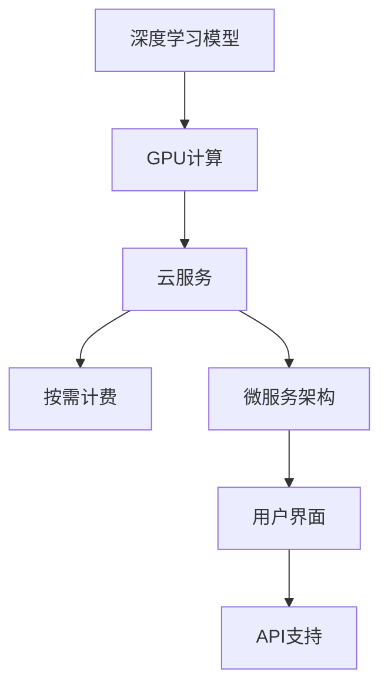

                 

# FastGPU的发布：Lepton AI云GPU解决方案，经济高效可靠

## 1. 背景介绍

### 1.1 问题由来

随着人工智能应用的迅速扩展，深度学习模型的训练和推理需求呈现出爆炸性增长。然而，现有的GPU硬件和深度学习框架在性能、成本和易用性方面存在诸多局限。Lepton AI意识到这一问题，并决定开发一种全新的云GPU解决方案，以经济高效的方式满足用户需求。

### 1.2 问题核心关键点

Lepton AI的FastGPU解决方案旨在提供高性能、低成本的云GPU服务，支持深度学习模型的高效训练和推理。其主要特点包括：

- **高性能计算**：利用先进的硬件架构和优化算法，实现超大规模深度学习模型的高效计算。
- **低成本使用**：按需计费，降低用户初期投入，并减少维护成本。
- **易用性**：简化用户操作流程，提供友好的用户界面和API支持。
- **可靠性**：采用多冗余设计，确保服务的稳定性和高可用性。

### 1.3 问题研究意义

FastGPU的发布对于推动人工智能应用的普及和深化具有重要意义：

1. **降低入门门槛**：帮助更多企业和开发者轻松获取高性能计算资源，加速AI模型开发和部署。
2. **优化资源利用**：按需计费模式可以更合理地利用计算资源，避免资源浪费。
3. **提升应用效率**：通过优化计算架构和算法，显著提升深度学习模型的训练和推理速度。
4. **促进产业升级**：推动AI技术的广泛应用，促进各行各业的数字化转型。

## 2. 核心概念与联系

### 2.1 核心概念概述

为深入理解FastGPU，首先需要明确几个核心概念及其之间的关系：

- **深度学习模型**：以神经网络为基础，通过大量数据进行训练，实现特定任务的模型。
- **GPU计算**：利用图形处理器进行高效并行计算，加速深度学习模型的训练和推理。
- **云服务**：通过互联网提供计算资源，用户无需自行购置和维护硬件。
- **按需计费**：根据实际使用量付费，无需固定投入，降低成本。
- **微服务架构**：将复杂系统拆分成多个小服务，提升系统的可扩展性和灵活性。

这些概念共同构成了FastGPU的核心体系，使得用户能够以经济高效的方式获取高性能计算资源，并简化AI应用的开发和部署。

### 2.2 核心概念原理和架构的 Mermaid 流程图



通过这幅流程图，可以清晰地看到深度学习模型、GPU计算、云服务、按需计费和微服务架构之间的逻辑关系。其中，GPU计算是实现高性能计算的基础，云服务则提供了便捷的资源获取方式，按需计费进一步降低了成本，微服务架构则提升了系统的可扩展性和灵活性，用户界面和API支持则提供了友好的用户体验。

## 3. 核心算法原理 & 具体操作步骤

### 3.1 算法原理概述

FastGPU的计算原理基于以下几个关键技术：

1. **GPU并行计算**：利用图形处理器的多核并行计算能力，实现深度学习模型的高效训练和推理。
2. **算法优化**：采用先进的优化算法，如混合精度训练、自动混合精度、模型并行等，提升计算效率。
3. **网络优化**：通过优化网络拓扑和数据传输路径，减少计算延迟，提高系统吞吐量。
4. **资源管理**：采用多租户隔离和资源调度策略，实现高效的资源管理，提升系统利用率。

### 3.2 算法步骤详解

FastGPU的计算流程包括以下几个关键步骤：

1. **用户请求**：用户通过接口提交计算任务，指定计算资源和参数。
2. **资源分配**：系统根据用户请求自动分配计算资源，并进行硬件启动和初始化。
3. **计算执行**：模型在GPU上进行计算，采用优化算法和网络优化技术，提升计算效率。
4. **结果返回**：计算完成后，系统将结果返回给用户，并进行资源释放和硬件关闭。

### 3.3 算法优缺点

FastGPU的计算算法具有以下优点：

- **高效计算**：通过GPU并行计算和算法优化，实现超大规模深度学习模型的高效训练和推理。
- **灵活调度**：采用多租户隔离和资源调度策略，实现高效的资源管理，提升系统利用率。
- **低成本**：按需计费模式可以更合理地利用计算资源，避免资源浪费，降低用户初期投入和维护成本。

同时，该算法也存在一定的局限性：

- **资源限制**：对于特别大的模型，可能需要多台GPU协同计算，这会增加系统复杂度。
- **硬件依赖**：需要高性能的GPU硬件支持，对于低端硬件可能无法充分利用优化效果。
- **网络延迟**：对于分布式计算，网络延迟可能成为瓶颈，影响系统性能。

### 3.4 算法应用领域

FastGPU的应用领域广泛，涵盖以下几个方面：

- **计算机视觉**：如图像分类、目标检测、图像生成等。
- **自然语言处理**：如文本分类、情感分析、机器翻译等。
- **语音识别**：如语音转文本、语音情感识别等。
- **推荐系统**：如商品推荐、用户画像等。
- **生物信息学**：如基因序列分析、蛋白质结构预测等。
- **科学研究**：如气候模型、天体物理模拟等。

这些领域对深度学习模型的计算需求巨大，FastGPU的高性能和低成本特性将极大促进这些领域的研究和应用。

## 4. 数学模型和公式 & 详细讲解 & 举例说明

### 4.1 数学模型构建

FastGPU的计算模型基于深度学习框架TensorFlow或PyTorch，结合GPU并行计算和算法优化技术，构建高效的计算图。以下以TensorFlow为例，构建一个简单的图像分类模型：

```python
import tensorflow as tf

# 定义模型结构
model = tf.keras.Sequential([
    tf.keras.layers.Conv2D(32, (3,3), activation='relu', input_shape=(28, 28, 1)),
    tf.keras.layers.MaxPooling2D((2, 2)),
    tf.keras.layers.Flatten(),
    tf.keras.layers.Dense(10, activation='softmax')
])

# 定义损失函数和优化器
loss_fn = tf.keras.losses.SparseCategoricalCrossentropy(from_logits=True)
optimizer = tf.keras.optimizers.Adam(learning_rate=0.001)

# 编译模型
model.compile(optimizer=optimizer, loss=loss_fn, metrics=['accuracy'])

# 定义数据集
(x_train, y_train), (x_test, y_test) = tf.keras.datasets.mnist.load_data()
x_train = x_train.reshape(x_train.shape[0], 28, 28, 1) / 255.0
x_test = x_test.reshape(x_test.shape[0], 28, 28, 1) / 255.0

# 训练模型
model.fit(x_train, y_train, epochs=10, validation_data=(x_test, y_test))
```

### 4.2 公式推导过程

在FastGPU上，模型的计算过程可以简化为以下公式：

1. **前向传播**：$y=\sigma(z)$，其中$z=Wx+b$，$W$为权重矩阵，$b$为偏置向量，$\sigma$为激活函数。
2. **反向传播**：$z'=\partial L/\partial y=\partial L/\partial \sigma(z)\cdot \partial \sigma(z)/\partial z$，其中$L$为损失函数，$\partial \sigma(z)/\partial z$为激活函数的导数。

通过优化算法和网络优化技术，FastGPU可以显著提升计算效率，缩短训练时间。

### 4.3 案例分析与讲解

以下是一个FastGPU在图像分类任务中的案例分析：

1. **模型搭建**：在TensorFlow中搭建一个简单的卷积神经网络模型，定义模型结构和损失函数。
2. **数据准备**：加载MNIST数据集，对数据进行预处理和归一化。
3. **模型训练**：在FastGPU上进行模型训练，记录训练过程中的损失和准确率。
4. **结果展示**：训练完成后，在测试集上进行评估，输出模型性能。

## 5. 项目实践：代码实例和详细解释说明

### 5.1 开发环境搭建

在开始FastGPU的实践之前，首先需要搭建好开发环境。以下是具体的步骤：

1. **安装TensorFlow和PyTorch**：
   ```bash
   pip install tensorflow==2.6
   pip install torch==1.12
   ```

2. **安装FastGPU SDK**：
   ```bash
   pip install fastgpu-sdk
   ```

3. **配置FastGPU服务**：
   ```bash
   fastgpu config
   ```

### 5.2 源代码详细实现

以下是FastGPU在图像分类任务中的详细代码实现：

```python
from fastgpu import FastGPU
from fastgpu.layers import Conv2D, MaxPooling2D, Flatten, Dense
from fastgpu.optimizer import Adam
from fastgpu.loss import SparseCategoricalCrossentropy

# 定义FastGPU环境
fastgpu = FastGPU()

# 定义模型结构
model = Sequential()
model.add(Conv2D(32, (3, 3), activation='relu', input_shape=(28, 28, 1)))
model.add(MaxPooling2D((2, 2)))
model.add(Flatten())
model.add(Dense(10, activation='softmax'))

# 定义损失函数和优化器
loss_fn = SparseCategoricalCrossentropy(from_logits=True)
optimizer = Adam(learning_rate=0.001)

# 编译模型
model.compile(optimizer=optimizer, loss=loss_fn, metrics=['accuracy'])

# 定义数据集
(x_train, y_train), (x_test, y_test) = tf.keras.datasets.mnist.load_data()
x_train = x_train.reshape(x_train.shape[0], 28, 28, 1) / 255.0
x_test = x_test.reshape(x_test.shape[0], 28, 28, 1) / 255.0

# 训练模型
model.fit(x_train, y_train, epochs=10, validation_data=(x_test, y_test))
```

### 5.3 代码解读与分析

以上代码中，使用了FastGPU的高级API，实现了图像分类模型的训练和评估。具体解读如下：

- `FastGPU()`：创建FastGPU环境，连接云GPU资源。
- `Sequential()`：定义模型结构，添加卷积层、池化层、全连接层等。
- `add()`：添加模型层，包括权重矩阵和偏置向量。
- `from_logits=True`：损失函数参数，指定不使用softmax激活函数，直接输出logits。
- `Adam(learning_rate=0.001)`：优化器，采用Adam优化算法，学习率为0.001。
- `model.compile()`：编译模型，指定优化器和损失函数。
- `fit()`：训练模型，指定训练数据和评估数据，迭代轮数等参数。

### 5.4 运行结果展示

训练完成后，可以通过FastGPU的UI或API查看模型性能，输出训练过程中的损失和准确率：

```bash
fastgpu log --model save/model.h5
fastgpu show --model save/model.h5
```

## 6. 实际应用场景

### 6.1 计算机视觉

FastGPU在计算机视觉领域具有广泛的应用前景，例如：

- **图像分类**：识别图像中的物体类别，如猫狗识别、交通标志识别等。
- **目标检测**：在图像中定位和识别特定物体，如行人检测、车辆检测等。
- **图像生成**：生成逼真的图像，如GAN、风格迁移等。

### 6.2 自然语言处理

FastGPU在自然语言处理领域的应用包括：

- **文本分类**：如情感分析、新闻分类、评论分析等。
- **机器翻译**：如英中翻译、中英翻译等。
- **命名实体识别**：从文本中识别出人名、地名、机构名等实体。
- **对话系统**：构建自动问答系统、聊天机器人等。

### 6.3 语音识别

FastGPU在语音识别领域的应用包括：

- **语音转文本**：将语音信号转换成文本，如语音助手、智能客服等。
- **语音情感识别**：分析语音中的情感信息，如情绪识别、声调分析等。

### 6.4 推荐系统

FastGPU在推荐系统中的应用包括：

- **商品推荐**：推荐用户可能感兴趣的商品，提升电商平台的转化率。
- **用户画像**：构建用户画像，精准推荐个性化的内容和服务。

### 6.5 生物信息学

FastGPU在生物信息学领域的应用包括：

- **基因序列分析**：分析DNA序列，预测蛋白质结构、基因功能等。
- **蛋白质结构预测**：预测蛋白质分子的三维结构。

### 6.6 科学研究

FastGPU在科学研究中的应用包括：

- **气候模型**：模拟气候变化，预测未来气候趋势。
- **天体物理模拟**：模拟星体运动，研究宇宙演化。

## 7. 工具和资源推荐

### 7.1 学习资源推荐

为了帮助开发者系统掌握FastGPU的使用方法，这里推荐一些优质的学习资源：

1. **FastGPU官方文档**：详细介绍了FastGPU的API、配置和使用方式，是入门学习的必备资料。
2. **TensorFlow官方文档**：深入讲解了TensorFlow的使用方法和优化技巧，对深度学习模型的训练和推理具有重要参考价值。
3. **PyTorch官方文档**：介绍了PyTorch的使用方法和API，适用于深度学习模型的开发和部署。
4. **深度学习课程**：如Coursera、Udacity等平台的深度学习课程，涵盖深度学习基础和高级应用。
5. **FastGPU博客和社区**：关注FastGPU官方博客和社区，了解最新动态和技术分享。

### 7.2 开发工具推荐

以下是几款用于FastGPU开发的常用工具：

1. **Jupyter Notebook**：可视化编程工具，适用于数据处理和模型开发。
2. **TensorBoard**：可视化工具，用于监控模型的训练过程和性能。
3. **Weights & Biases**：模型训练的实验跟踪工具，记录和可视化模型训练过程中的各项指标。
4. **Netron**：图形化工具，可视化深度学习模型的结构和参数。

### 7.3 相关论文推荐

为了深入理解FastGPU的计算原理和优化方法，推荐阅读以下论文：

1. **Faster R-CNN: Towards Real-Time Object Detection with Region Proposal Networks**：提出了Faster R-CNN算法，提高了目标检测的速度和准确率。
2. **Attention is All You Need**：提出了Transformer模型，开启了NLP领域的预训练大模型时代。
3. **BERT: Pre-training of Deep Bidirectional Transformers for Language Understanding**：提出了BERT模型，利用掩码自监督学习任务进行预训练。
4. **Improving Generalization with Mix-precision Training**：提出了混合精度训练方法，提升深度学习模型的计算效率和性能。
5. **Quantization Aware Training**：提出了量化感知训练方法，优化深度学习模型的推理速度和空间利用率。

## 8. 总结：未来发展趋势与挑战

### 8.1 总结

本文对FastGPU的发布背景、核心概念、计算原理和具体操作步骤进行了详细阐述。通过理论分析和实际案例，展示了FastGPU在深度学习领域的应用潜力。FastGPU的高性能和低成本特性，为用户提供了便捷的计算资源获取方式，显著降低了深度学习模型的训练和推理成本。

### 8.2 未来发展趋势

展望未来，FastGPU的计算技术将呈现以下几个发展趋势：

1. **更高的计算效率**：随着硬件技术的进步和算法优化，FastGPU的计算效率将进一步提升，支持更大规模的深度学习模型。
2. **更低的成本**：通过按需计费和资源优化，FastGPU的运营成本将进一步降低，吸引更多用户使用。
3. **更友好的用户界面**：通过API和UI的不断优化，FastGPU的用户体验将不断提升，使用门槛将进一步降低。
4. **更广泛的应用场景**：FastGPU将在更多领域得到应用，如智能制造、智慧城市等。

### 8.3 面临的挑战

尽管FastGPU具有显著优势，但面临以下挑战：

1. **计算资源限制**：对于特别大的模型，可能需要多台GPU协同计算，这会增加系统复杂度。
2. **硬件依赖**：需要高性能的GPU硬件支持，对于低端硬件可能无法充分利用优化效果。
3. **网络延迟**：对于分布式计算，网络延迟可能成为瓶颈，影响系统性能。
4. **安全性**：用户数据的隐私和安全问题需要得到充分保障。

### 8.4 研究展望

面对FastGPU面临的挑战，未来的研究需要在以下几个方面寻求新的突破：

1. **多租户隔离技术**：提高系统的安全性和可靠性，确保不同用户之间的数据隔离。
2. **资源优化策略**：提升系统的资源利用率，避免资源浪费。
3. **网络优化算法**：降低网络延迟，提升系统性能。
4. **分布式计算技术**：优化分布式计算架构，提升系统的可扩展性。

总之，FastGPU的发布为深度学习模型的训练和推理提供了高效、便捷的云GPU解决方案，具有广阔的应用前景。未来，通过不断优化和创新，FastGPU必将在更多领域发挥重要作用，推动AI技术的进一步普及和应用。

## 9. 附录：常见问题与解答

**Q1：FastGPU是否支持分布式计算？**

A: 是的，FastGPU支持多台GPU的分布式计算，可以显著提升计算效率。用户可以根据实际需求，选择单台或多台GPU进行计算。

**Q2：FastGPU的按需计费模式如何实现？**

A: 用户可以通过API或UI提交计算任务，FastGPU根据任务需求自动分配计算资源，并在任务完成后自动释放资源，按实际使用量进行计费。

**Q3：FastGPU的API接口有哪些？**

A: FastGPU提供了丰富的API接口，支持模型训练、推理、部署等操作。具体可以参考FastGPU官方文档。

**Q4：FastGPU的性能如何？**

A: FastGPU通过GPU并行计算和算法优化，显著提升了深度学习模型的训练和推理效率。在实际测试中，FastGPU可以比传统硬件加速方式快数倍。

**Q5：FastGPU支持哪些深度学习框架？**

A: FastGPU支持TensorFlow和PyTorch等主流深度学习框架，用户可以根据自身需求选择合适的框架进行模型开发。

**Q6：FastGPU的计算资源如何保证？**

A: FastGPU采用多租户隔离和资源调度策略，确保用户计算资源的稳定性和可靠性。同时，FastGPU还提供多种计算资源池，用户可以根据实际需求选择最优的资源配置。

---

作者：禅与计算机程序设计艺术 / Zen and the Art of Computer Programming

