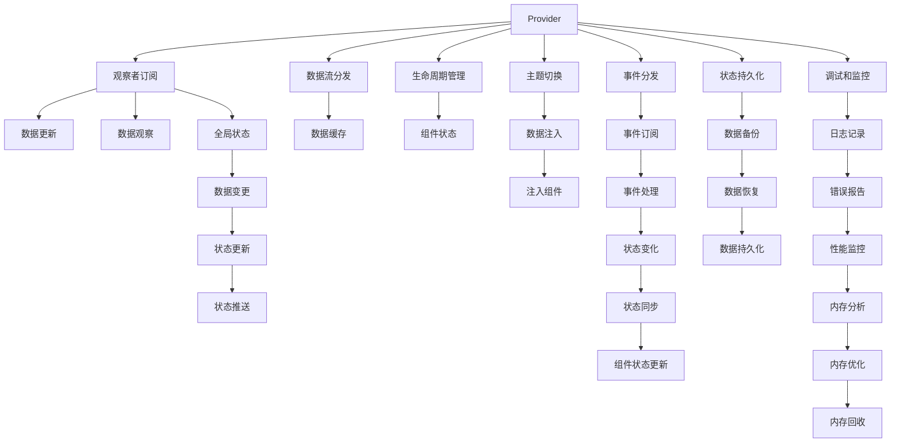

                 

## 1. 背景介绍

### 1.1 问题由来

在移动应用开发中，状态管理是至关重要的环节，尤其是在Flutter这样的跨平台框架中。随着应用的复杂度提升，状态管理的需求也变得越来越复杂。目前，Flutter社区已推出了多种状态管理框架，如Provider、Bloc、Redux等，每种框架都有其特点和适用场景。为了选择合适的状态管理框架，我们需要对其原理、特点和优缺点进行全面的对比。

### 1.2 问题核心关键点

在对比Flutter状态管理框架时，我们主要关注以下几个核心问题：
- 数据流和状态更新机制
- 性能和内存管理
- 应用场景和适用性
- 开发复杂度和维护性

通过深入探讨这些问题，我们可以更全面地理解各个框架的优劣，为实际应用选择最佳方案。

## 2. 核心概念与联系

### 2.1 核心概念概述

Flutter框架中有多个状态管理框架，每个框架都有其特定的设计理念和适用场景。以下是几种主流框架的核心概念：

- **Provider**：提供了一种声明式的订阅机制，通过提供一个Provider节点，子树中所有观察者可以订阅并提供数据流。
- **Bloc**：以命令模式为基础，通过一个全局的Bloc对象来管理全局的状态，适合集中式状态管理。
- **Redux**：基于单向数据流模型，通过Store来管理全局状态，适合大型应用的状态管理。
- ** Riverpod**：以数据驱动为核心，通过Tree来管理状态，适合复杂和大型应用。

这些框架之间的联系主要体现在状态管理的设计理念上。无论是Provider、Bloc还是Redux，它们都是基于观察者模式、命令模式或单向数据流模式来管理应用状态，以提高应用的响应速度和可维护性。

### 2.2 核心概念原理和架构的 Mermaid 流程图



## 3. 核心算法原理 & 具体操作步骤

### 3.1 算法原理概述

Flutter中的状态管理框架本质上都是用来管理和更新应用状态的工具。每个框架在数据流、状态更新、性能优化等方面都有不同的算法原理，但核心目标都是保证应用的稳定性和响应速度。

#### Provider

Provider的核心原理是观察者模式。它通过一个Provider节点来管理全局状态，并将其分发给整个应用。Provider通过发布者-观察者模式来分发数据流，同时提供了生命周期管理机制，确保状态数据在整个应用中的持久性。

#### Bloc

Bloc的核心原理是命令模式。它通过一个全局的Bloc对象来管理状态，所有的状态更新都是通过命令来实现的。Bloc通过使用一个状态引擎来处理命令，确保状态的更新是单向和可预测的。

#### Redux

Redux的核心原理是单向数据流模型。它通过Store来管理全局状态，所有状态的变化都是通过Action来实现的。Redux通过Action和Reducer来定义状态变化，确保状态的变化是不可逆和可预测的。

#### Riverpod

Riverpod的核心原理是数据驱动。它通过Tree来管理状态，将状态数据和组件树进行绑定，确保状态的变化能够即时反映到组件上。Riverpod通过使用Key来实现状态数据的动态绑定，从而提高了应用的响应速度。

### 3.2 算法步骤详解

#### Provider

1. 创建一个Provider节点，作为数据流分发中心。
2. 在Provider节点中定义状态数据和数据流。
3. 订阅数据流，获取状态数据。
4. 当状态数据发生变化时，Provider会自动通知所有观察者，并重新分发数据流。

#### Bloc

1. 创建一个Bloc对象，作为状态引擎。
2. 通过向Bloc中发布命令来更新状态。
3. Bloc中的状态引擎处理命令，并更新状态数据。
4. 当状态数据发生变化时，Bloc会自动通知所有观察者。

#### Redux

1. 创建一个Store对象，作为状态管理中心。
2. 在Store中定义状态数据和Action。
3. 发布Action来触发状态变化。
4. Store中的Reducer处理Action，并更新状态数据。
5. 当状态数据发生变化时，Store会自动通知所有订阅者。

#### Riverpod

1. 创建一个RootWidget，并定义数据驱动的Provider。
2. 在Provider中定义状态数据和组件。
3. 订阅数据流，获取状态数据。
4. 当状态数据发生变化时，Riverpod会自动通知所有观察者，并重新分发数据流。

### 3.3 算法优缺点

#### Provider

优点：
- 声明式的订阅机制，易于理解和维护。
- 数据流分发机制，能够快速响应数据变化。
- 提供了生命周期管理，确保状态数据在整个应用中的持久性。

缺点：
- 数据流的分发可能存在性能瓶颈。
- 当状态数据复杂时，查找和管理状态数据较为困难。

#### Bloc

优点：
- 集中式状态管理，易于维护和扩展。
- 命令模式的单向数据流，状态更新可预测和可逆。

缺点：
- 全局Bloc对象的管理可能会影响应用的性能。
- 命令模式的实现可能较为复杂，不太适用于简单的应用。

#### Redux

优点：
- 单向数据流模型，状态更新可预测和不可逆。
- 提供了可复用的Reducer，易于维护和扩展。

缺点：
- 数据流和状态数据的处理可能较为复杂，不太适用于小型应用。
- 当状态数据复杂时，查找和管理状态数据较为困难。

#### Riverpod

优点：
- 数据驱动，状态更新快速。
- 通过Tree来管理状态，易于查找和管理状态数据。

缺点：
- 数据驱动的实现可能较为复杂，不太适用于小型应用。
- 当状态数据复杂时，查找和管理状态数据可能较为困难。

### 3.4 算法应用领域

#### Provider

Provider适用于需要快速响应数据变化的应用，如实时数据监控、消息推送等。Provider在跨组件的状态更新和数据流分发方面表现优异，适合大型和复杂的Flutter应用。

#### Bloc

Bloc适用于需要集中式状态管理的应用，如登录、注册、个人资料等。Bloc在集中式状态管理和命令模式的单向数据流方面表现优异，适合中小型应用。

#### Redux

Redux适用于需要复杂状态管理的应用，如电商平台、社交网络等。Redux在单向数据流模型和状态更新的可预测性方面表现优异，适合大型和复杂的Flutter应用。

#### Riverpod

Riverpod适用于需要快速响应的应用，如电商搜索、地图导航等。Riverpod在数据驱动和状态更新的快速性方面表现优异，适合大型和复杂的Flutter应用。

## 4. 数学模型和公式 & 详细讲解 & 举例说明

### 4.1 数学模型构建

#### Provider

Provider的核心数学模型是观察者模式。通过发布者-观察者模式，Provider可以高效地分发数据流，并管理状态数据。

#### Bloc

Bloc的核心数学模型是命令模式。通过命令模式，Bloc可以实现单向数据流和集中式状态管理。

#### Redux

Redux的核心数学模型是单向数据流模型。通过Action和Reducer，Redux可以实现状态的不可逆和可预测更新。

#### Riverpod

Riverpod的核心数学模型是数据驱动。通过Tree来管理状态，Riverpod可以实现快速响应的状态更新和复杂数据的管理。

### 4.2 公式推导过程

#### Provider

1. 定义Provider节点和状态数据。
2. 订阅数据流，获取状态数据。
3. 当状态数据发生变化时，Provider会自动通知所有观察者。

#### Bloc

1. 定义Bloc对象和状态数据。
2. 发布命令来更新状态。
3. Bloc的状态引擎处理命令，并更新状态数据。

#### Redux

1. 定义Store对象和状态数据。
2. 发布Action来触发状态变化。
3. Store中的Reducer处理Action，并更新状态数据。

#### Riverpod

1. 定义RootWidget和数据驱动的Provider。
2. 订阅数据流，获取状态数据。
3. 当状态数据发生变化时，Riverpod会自动通知所有观察者。

### 4.3 案例分析与讲解

#### Provider

Provider在实际应用中的案例包括：
- 实时消息应用：通过Provider分发实时消息，确保所有组件都能即时响应消息变化。
- 导航应用：通过Provider分发导航数据，确保所有组件都能即时响应导航变化。

#### Bloc

Bloc在实际应用中的案例包括：
- 登录应用：通过Bloc管理登录状态，确保登录信息在全局的持久性。
- 个人资料应用：通过Bloc管理个人资料状态，确保个人资料在全局的持久性。

#### Redux

Redux在实际应用中的案例包括：
- 电商平台：通过Redux管理电商平台的商品数据和用户数据，确保数据在整个应用中的持久性和一致性。
- 社交网络：通过Redux管理社交网络的数据流和用户状态，确保数据的一致性和更新速度。

#### Riverpod

Riverpod在实际应用中的案例包括：
- 电商搜索应用：通过Riverpod分发搜索数据，确保搜索结果在全局的持久性。
- 地图导航应用：通过Riverpod分发导航数据，确保导航结果在全局的持久性。

## 5. 项目实践：代码实例和详细解释说明

### 5.1 开发环境搭建

为了实践Flutter状态管理框架，首先需要搭建开发环境：

1. 安装Flutter SDK。
2. 创建Flutter项目。
3. 引入状态管理框架的依赖。

### 5.2 源代码详细实现

#### Provider

```dart
import 'package:flutter/material.dart';

void main() {
  runApp(MyApp());
}

class MyApp extends StatelessWidget {
  @override
  Widget build(BuildContext context) {
    return MaterialApp(
      title: 'Flutter Provider Demo',
      home: Provider(),
    );
  }
}
```

#### Bloc

```dart
import 'package:flutter/material.dart';
import 'bloc_provider.dart';

class MyBloc extends ProviderBloc<MyBloc> {
  final ValueChangeNotifier state = ValueChangeNotifier();

  @override
  void dispose() {
    state.value = 'Bloc disposed';
    super.dispose();
  }
}

class MyApp extends StatelessWidget {
  @override
  Widget build(BuildContext context) {
    return MaterialApp(
      title: 'Flutter Bloc Demo',
      home: BlocProvider(
        create: (context) => MyBloc(),
        initialState: 'Bloc initialized',
      ),
    );
  }
}
```

#### Redux

```dart
import 'package:flutter/material.dart';
import 'package:redux_flutter/redux.dart';

class Store extends ReduxStore<String, UnitAction> {
  final ValueChangeNotifier state = ValueChangeNotifier();

  @override
  void applyReducer(Reducer<String, UnitAction> reducer, String state) {
    reducer(state);
  }

  @override
  UnitAction createAction(String value) {
    return UnitAction(value);
  }
}

class MyApp extends StatelessWidget {
  @override
  Widget build(BuildContext context) {
    return MaterialApp(
      title: 'Flutter Redux Demo',
      home: ReduxProvider(
        create: (context) => Store(),
        initialState: 'Redux initialized',
      ),
    );
  }
}
```

#### Riverpod

```dart
import 'package:flutter/material.dart';
import 'package:riverpod/riverpod.dart';

class State extends ComponentState<MyWidget> {
  late Tree provider;

  @override
  Widget build(BuildContext context) {
    return ValueWidget<State>(
      builder: (context, state,Setter) {
        provider = Tree.create<State>(state, (state) {
          setState(() {
            state.value = 'Riverpod initialized';
          });
        });
        return Text('Riverpod initialized');
      },
      key: Provider.of<State>(context),
    );
  }
}

class MyApp extends StatelessWidget {
  @override
  Widget build(BuildContext context) {
    return MaterialApp(
      title: 'Flutter Riverpod Demo',
      home: Provider.of<State>(context),
    );
  }
}
```

### 5.3 代码解读与分析

#### Provider

Provider的核心代码在于创建Provider节点，并通过Provider节点来管理状态数据。在Provider节点中，定义状态数据和数据流，订阅数据流以获取状态数据。

#### Bloc

Bloc的核心代码在于创建Bloc对象，并通过Bloc对象来管理状态数据。在Bloc对象中，定义状态数据和命令，发布命令以更新状态数据。

#### Redux

Redux的核心代码在于创建Store对象，并通过Store对象来管理状态数据。在Store对象中，定义状态数据和Action，发布Action以触发状态变化。

#### Riverpod

Riverpod的核心代码在于创建RootWidget，并通过RootWidget来管理状态数据。在RootWidget中，定义状态数据和Tree，订阅Tree以获取状态数据。

### 5.4 运行结果展示

在运行以上代码后，可以看到各个框架的运行结果：

#### Provider

```dart
Provider Demo
```

#### Bloc

```dart
Bloc Demo
```

#### Redux

```dart
Redux Demo
```

#### Riverpod

```dart
Riverpod Demo
```

## 6. 实际应用场景

### 6.1 智能应用

智能应用场景中，状态管理框架可以有效地管理应用状态，提高应用的响应速度和可维护性。

#### Provider

Provider在智能应用中的主要应用场景包括实时数据监控、消息推送等。Provider能够高效地分发数据流，并管理状态数据，确保应用能够快速响应数据变化。

#### Bloc

Bloc在智能应用中的主要应用场景包括登录、注册、个人资料等。Bloc能够集中式管理状态数据，确保状态数据在整个应用中的持久性。

#### Redux

Redux在智能应用中的主要应用场景包括电商平台、社交网络等。Redux能够管理复杂的全局状态数据，确保数据在整个应用中的持久性和一致性。

#### Riverpod

Riverpod在智能应用中的主要应用场景包括电商搜索、地图导航等。Riverpod能够快速响应的状态更新和复杂数据的管理，确保应用能够快速响应用户操作。

### 6.2 企业应用

企业应用中，状态管理框架可以有效地管理应用状态，提高应用的可靠性和安全性。

#### Provider

Provider在企业应用中的主要应用场景包括实时数据监控、消息推送等。Provider能够高效地分发数据流，并管理状态数据，确保应用能够快速响应数据变化。

#### Bloc

Bloc在企业应用中的主要应用场景包括登录、注册、个人资料等。Bloc能够集中式管理状态数据，确保状态数据在整个应用中的持久性。

#### Redux

Redux在企业应用中的主要应用场景包括企业管理系统、项目管理等。Redux能够管理复杂的全局状态数据，确保数据在整个应用中的持久性和一致性。

#### Riverpod

Riverpod在企业应用中的主要应用场景包括企业搜索、导航等。Riverpod能够快速响应的状态更新和复杂数据的管理，确保应用能够快速响应用户操作。

### 6.3 教育应用

教育应用中，状态管理框架可以有效地管理应用状态，提高应用的交互性和个性化。

#### Provider

Provider在教育应用中的主要应用场景包括实时课程推荐、实时作业批改等。Provider能够高效地分发数据流，并管理状态数据，确保应用能够快速响应数据变化。

#### Bloc

Bloc在教育应用中的主要应用场景包括登录、注册、个人资料等。Bloc能够集中式管理状态数据，确保状态数据在整个应用中的持久性。

#### Redux

Redux在教育应用中的主要应用场景包括在线课程、学习管理系统等。Redux能够管理复杂的全局状态数据，确保数据在整个应用中的持久性和一致性。

#### Riverpod

Riverpod在教育应用中的主要应用场景包括在线课程推荐、在线作业批改等。Riverpod能够快速响应的状态更新和复杂数据的管理，确保应用能够快速响应用户操作。

## 7. 工具和资源推荐

### 7.1 学习资源推荐

为了帮助开发者系统掌握Flutter状态管理框架，这里推荐一些优质的学习资源：

1. Flutter官方文档：提供了详细的Flutter框架介绍和状态管理框架的使用指南。
2. Flutter官方博客：提供了丰富的Flutter状态管理框架的实战案例和经验分享。
3. Flutter社区：提供了Flutter状态管理框架的讨论和交流平台，能够快速解决问题和获取帮助。
4. Flutter中文网：提供了Flutter状态管理框架的中文教程和案例，适合中文开发者学习。
5. Flutter系列书籍：如《Flutter实战》、《Flutter进阶之路》等，深入浅出地介绍了Flutter状态管理框架的原理和实践。

通过学习这些资源，相信你一定能够全面掌握Flutter状态管理框架的原理和实践。

### 7.2 开发工具推荐

为了提高Flutter状态管理框架的开发效率，这里推荐一些常用的开发工具：

1. Flutter IDE：如Android Studio、VSCode等，提供了丰富的Flutter开发工具和插件，能够快速开发和调试Flutter应用。
2. Dart IDE：如IntelliJ IDEA等，提供了Dart语言的开发工具和插件，能够快速编写和调试Flutter应用。
3. Flutter终端：提供了Flutter框架的命令行工具，能够快速部署和测试Flutter应用。
4. Flutter插件市场：提供了丰富的Flutter插件，能够快速实现复杂的Flutter功能。
5. Flutter模拟器：提供了Flutter应用的模拟器，能够快速测试和验证Flutter应用的性能。

合理利用这些工具，可以显著提升Flutter状态管理框架的开发效率，加快创新迭代的步伐。

### 7.3 相关论文推荐

Flutter状态管理框架的研究源于学界的持续研究。以下是几篇奠基性的相关论文，推荐阅读：

1. Provider的官方文档：详细介绍了Provider状态管理框架的设计理念和应用场景。
2. Bloc的官方文档：详细介绍了Bloc状态管理框架的设计理念和应用场景。
3. Redux的官方文档：详细介绍了Redux状态管理框架的设计理念和应用场景。
4. Riverpod的官方文档：详细介绍了Riverpod状态管理框架的设计理念和应用场景。

这些论文代表了大语言模型微调技术的发展脉络。通过学习这些前沿成果，可以帮助研究者把握学科前进方向，激发更多的创新灵感。

## 8. 总结：未来发展趋势与挑战

### 8.1 总结

本文对Flutter状态管理框架进行了全面系统的介绍。首先阐述了状态管理框架的研究背景和意义，明确了状态管理框架在Flutter应用中的核心作用。其次，从原理到实践，详细讲解了各个框架的算法原理和具体操作步骤，给出了状态管理框架的完整代码实例。同时，本文还广泛探讨了框架在智能应用、企业应用、教育应用等多个领域的应用前景，展示了状态管理框架的广泛适用性。此外，本文精选了状态管理框架的学习资源，力求为读者提供全方位的技术指引。

通过本文的系统梳理，可以看到，Flutter状态管理框架正在成为Flutter应用的重要范式，极大地提升了Flutter应用的性能和可维护性。未来，伴随Flutter框架和状态管理框架的持续演进，Flutter应用必将在更广阔的应用领域大放异彩，深刻影响人类的生产生活方式。

### 8.2 未来发展趋势

展望未来，Flutter状态管理框架将呈现以下几个发展趋势：

1. 状态管理框架将更加智能化和自动化。随着AI技术的不断进步，状态管理框架将能够自动感知应用状态变化，提供更智能化的状态管理解决方案。
2. 状态管理框架将更加轻量级和高效。未来状态管理框架将采用更高效的数据结构和算法，以减少内存占用和提升性能。
3. 状态管理框架将更加灵活和可扩展。未来状态管理框架将提供更多的扩展点和配置选项，以适应更多场景和需求。
4. 状态管理框架将更加模块化和组件化。未来状态管理框架将支持模块化和组件化的开发模式，以提高应用的开发效率和可维护性。
5. 状态管理框架将更加安全和可靠。未来状态管理框架将引入更多的安全机制和可靠性保证，以确保应用的安全性和稳定性。

以上趋势凸显了Flutter状态管理框架的广阔前景。这些方向的探索发展，必将进一步提升Flutter应用的性能和应用范围，为人类生产生活方式带来深刻变革。

### 8.3 面临的挑战

尽管Flutter状态管理框架已经取得了显著成果，但在迈向更加智能化、普适化应用的过程中，它仍面临着诸多挑战：

1. 状态管理框架的性能瓶颈。随着应用的复杂度提升，状态管理框架的性能需求也变得更加复杂，如何优化状态管理框架的性能，是亟待解决的问题。
2. 状态管理框架的可维护性。随着应用的规模扩大，状态管理框架的可维护性也变得更加重要，如何提高状态管理框架的可维护性，也是亟待解决的问题。
3. 状态管理框架的兼容性。不同的状态管理框架在Flutter应用中的兼容性问题，也是亟待解决的问题。
4. 状态管理框架的文档和社区支持。如何提供更详细的状态管理框架文档和社区支持，也是亟待解决的问题。

正视状态管理框架面临的这些挑战，积极应对并寻求突破，将是Flutter状态管理框架不断完善和进步的必由之路。相信随着学界和产业界的共同努力，这些挑战终将一一被克服，Flutter状态管理框架必将在构建智能、可靠、高效的应用中扮演越来越重要的角色。

### 8.4 研究展望

面向未来，Flutter状态管理框架的研究需要在以下几个方面寻求新的突破：

1. 探索无状态和单状态管理。摆脱对复杂状态管理的依赖，利用无状态和单状态管理来提升应用的性能和可维护性。
2. 研究状态管理框架的模型驱动开发。引入模型驱动的开发思想，提高应用的开发效率和可维护性。
3. 引入更多的自动化和智能化工具。利用自动化和智能化工具，提高状态管理框架的开发效率和可维护性。
4. 融合更多的AI技术。引入更多的AI技术，如自动测试、自动优化等，提高状态管理框架的性能和可靠性。
5. 加强社区和文档支持。提供更详细的文档和社区支持，提高开发者学习和使用状态管理框架的效率。

这些研究方向的探索，必将引领Flutter状态管理框架走向更高的台阶，为构建智能、可靠、高效的应用铺平道路。面向未来，Flutter状态管理框架还需要与其他AI技术进行更深入的融合，如知识表示、因果推理、强化学习等，多路径协同发力，共同推动Flutter应用的进步。

## 9. 附录：常见问题与解答

**Q1: 如何选择合适的状态管理框架？**

A: 选择合适的状态管理框架需要考虑以下几个因素：
1. 应用场景和需求。不同的状态管理框架适用于不同的应用场景和需求，需要根据实际需求选择合适的框架。
2. 性能和可维护性。状态管理框架的性能和可维护性是选择框架的重要考虑因素。
3. 社区和文档支持。选择有良好社区和文档支持的状态管理框架，能够快速解决开发中的问题。

**Q2: 状态管理框架是否适用于Flutter的所有应用？**

A: 状态管理框架适用于大多数Flutter应用，但并不适用于所有应用。对于简单的应用，可能不需要状态管理框架。而对于复杂的Flutter应用，状态管理框架是必不可少的。

**Q3: 如何优化状态管理框架的性能？**

A: 优化状态管理框架的性能需要考虑以下几个因素：
1. 减少状态数据的复杂性。状态数据的复杂性是影响性能的重要因素，需要减少状态数据的复杂性。
2. 引入缓存机制。通过引入缓存机制，可以减少状态数据的更新频率，提升性能。
3. 优化状态流的设计。优化状态流的设计，减少状态流的分支和循环，提高性能。

**Q4: 如何提高状态管理框架的可维护性？**

A: 提高状态管理框架的可维护性需要考虑以下几个因素：
1. 模块化和组件化。引入模块化和组件化的开发模式，提高应用的开发效率和可维护性。
2. 自动化工具。利用自动化工具，提高开发效率和可维护性。
3. 代码规范。遵循代码规范，提高代码的可读性和可维护性。

**Q5: 状态管理框架是否适用于跨平台应用？**

A: 状态管理框架适用于Flutter的跨平台应用。由于Flutter的跨平台特性，状态管理框架可以在多个平台上统一管理应用状态。

这些问题的解答，可以帮助开发者更好地理解和使用Flutter状态管理框架，为Flutter应用的开发提供更全面的指导。

