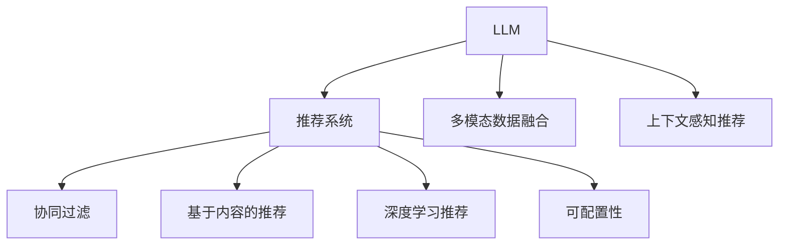

                 

# GENRE框架的灵活性与可配置性：LLM推荐的优势

> 关键词：GENRE框架, 大语言模型(LLM), 推荐系统, 可配置性, 多模态数据融合, 推荐算法

## 1. 背景介绍

### 1.1 问题由来
随着信息技术的不断进步，推荐系统已成为各行各业推动业务增长的重要手段。特别是在电商、视频、音乐等领域，推荐系统能够有效提升用户体验，增加平台粘性。传统的推荐算法多基于统计学方法和手工规则，无法充分利用用户行为数据，导致推荐效果不够理想。

近年来，大语言模型（Large Language Model, LLM）的兴起，带来了全新的推荐范式。LLM可以自动学习用户行为背后的语义信息，结合自然语言处理(Natural Language Processing, NLP)能力，进行个性化推荐。然而，LLM的推荐能力仍存在诸多局限，如缺乏上下文理解、推荐结果可解释性不足等问题。

### 1.2 问题核心关键点
如何利用大语言模型（LLM），结合推荐系统技术，设计灵活高效的推荐系统，成为当前NLP与推荐领域的核心问题。研究重点在于：
- 如何将LLM集成到推荐系统中，充分发挥其长处？
- 如何提升LLM推荐的上下文理解能力？
- 如何增强推荐结果的可解释性？
- 如何在资源有限的条件下实现高效推荐？

### 1.3 问题研究意义
利用大语言模型进行推荐系统开发，可以有效提高推荐系统的个性化和智能化水平，大幅提升用户体验。主要体现在：
- 高度个性化的推荐：基于用户的文本描述、行为历史等输入，LLM能够提供更加贴合用户兴趣的推荐结果。
- 跨模态数据的融合：LLM可以处理文本、图像、音频等多种模态信息，实现更丰富的推荐结果。
- 上下文感知推荐：LLM能够理解用户行为背后的语义信息，从而进行更加精准的上下文感知推荐。
- 算法灵活性：LLM结合推荐系统，具有高度的算法灵活性，适用于不同场景的个性化推荐。

## 2. 核心概念与联系

### 2.1 核心概念概述

本节将介绍几个密切相关的核心概念，及其在推荐系统中的应用：

- **大语言模型 (LLM)**：以自回归（如GPT）或自编码（如BERT）模型为代表的大规模预训练语言模型。通过在大规模无标签文本语料上进行预训练，学习通用的语言表示，具备强大的语言理解和生成能力。

- **推荐系统**：通过用户的历史行为数据，为用户推荐感兴趣的内容或产品，提高用户满意度和转化率。推荐算法主要包括协同过滤、基于内容的推荐、深度学习推荐等。

- **多模态数据融合**：结合文本、图像、音频等多模态信息，提升推荐系统的准确性和丰富性。多模态信息通常通过编码器进行统一表示，再进行融合。

- **上下文感知推荐**：考虑用户行为背后的语义信息，进行上下文相关的推荐。上下文感知通常通过上下文编码器实现。

- **可配置性**：指系统能够灵活调整和配置不同组件的参数，以适应不同的应用场景和需求。

这些概念之间的逻辑关系可以通过以下Mermaid流程图来展示：



这个流程图展示了LLM与推荐系统的主要应用逻辑：

1. LLM通过预训练获得基础能力。
2. 推荐系统提供推荐逻辑，通过LLM进行个性化和上下文感知推荐。
3. 多模态数据融合实现多种信息协同推荐。
4. 上下文感知推荐提升推荐效果。
5. 可配置性使得系统能够灵活调整参数，适应不同场景。

## 3. GENRE框架

### 3.1 算法原理概述

GENRE（Generative ENsemble for Recommendations）框架是一种基于大语言模型（LLM）的推荐系统，通过生成式模型对多模态数据进行融合，结合上下文感知推荐逻辑，实现了高效、个性化、可解释的推荐。GENRE框架的核心思想是：

1. 利用大语言模型的生成能力，对多模态数据进行融合，生成统一的语义表示。
2. 结合推荐系统技术，对用户行为进行上下文感知推荐。
3. 通过可配置性设计，灵活调整不同组件的参数，适应不同应用场景。

### 3.2 算法步骤详解

GENRE框架的核心步骤包括：

**Step 1: 准备数据集**
- 收集用户行为数据（如浏览、点击、评分等）。
- 收集多模态数据（如文本描述、图片、音频等）。

**Step 2: 数据预处理**
- 对行为数据进行归一化、标准化等预处理。
- 对多模态数据进行编码，生成统一的语义表示。

**Step 3: 构建LLM模型**
- 选择合适的大语言模型，如GPT、BERT等，进行预训练。
- 设计上下文感知推荐逻辑。

**Step 4: 数据融合与推荐**
- 利用LLM生成统一的语义表示，结合多模态数据融合算法，生成综合语义特征。
- 结合推荐系统技术，进行上下文感知推荐，生成推荐结果。

**Step 5: 可配置性调整**
- 根据不同应用场景，灵活调整LLM模型参数、推荐算法参数等。

**Step 6: 结果评估与优化**
- 对推荐结果进行评估，结合反馈机制，不断优化模型性能。

### 3.3 算法优缺点

GENRE框架的优点包括：
1. 高效融合多模态数据：LLM能够自动生成统一的语义表示，实现多种信息的协同推荐。
2. 上下文感知推荐：结合推荐系统技术，考虑用户行为背后的语义信息，进行精准推荐。
3. 高度可配置性：通过灵活调整组件参数，适应不同应用场景和需求。
4. 算法灵活性：结合不同推荐算法，如协同过滤、基于内容的推荐等。

缺点包括：
1. 计算资源需求高：LLM模型的计算复杂度较高，需要大量的计算资源。
2. 预训练数据要求高：需要大量的无标签数据进行预训练。
3. 结果可解释性不足：生成式模型难以解释推荐过程，难以提供透明的推荐理由。

### 3.4 算法应用领域

GENRE框架主要应用于以下几个领域：

**电商推荐**：结合用户文本描述、浏览历史、购物车数据等，进行个性化商品推荐。
**视频推荐**：结合视频标题、描述、标签等，进行个性化视频内容推荐。
**音乐推荐**：结合歌曲名称、歌词、艺人等，进行个性化音乐推荐。
**新闻推荐**：结合新闻标题、摘要、标签等，进行个性化新闻内容推荐。
**旅游推荐**：结合旅游目的地的文本描述、用户行为等，进行个性化旅游路线推荐。

## 4. 数学模型和公式 & 详细讲解 & 举例说明

### 4.1 数学模型构建

本节将使用数学语言对GENRE框架的推荐过程进行更加严格的刻画。

记用户行为数据为 $D_u = \{(x_i, y_i)\}_{i=1}^n$，其中 $x_i$ 为用户行为，$y_i$ 为对应的推荐结果。记多模态数据为 $D_m = \{(x_i^m, y_i^m)\}_{i=1}^m$，其中 $x_i^m$ 为多模态数据，$y_i^m$ 为对应的语义标签。记LLM模型为 $M_{\theta}$，其中 $\theta$ 为模型参数。

定义推荐模型 $f_{\phi}$，其中 $\phi$ 为推荐模型参数。推荐过程可以表示为：

$$
y_i = f_{\phi}(M_{\theta}(x_i), x_i^m, x_i)
$$

其中 $M_{\theta}(x_i)$ 为LLM对用户行为的语义表示，$x_i^m$ 为多模态数据的语义表示，$f_{\phi}$ 为推荐模型。

### 4.2 公式推导过程

以下我们以电商商品推荐为例，推导推荐模型的数学公式。

假设用户行为为浏览、点击、购买等操作，对应文本描述 $x_i$。记LLM模型的输出为 $z_i = M_{\theta}(x_i)$，表示用户行为背后的语义表示。记多模态数据为商品图片 $x_i^m$，通过特征提取器 $h$ 生成语义表示 $h(x_i^m)$。

定义推荐模型 $f_{\phi}$ 为线性回归模型，即：

$$
y_i = \phi_1(z_i) + \phi_2(h(x_i^m)) + \phi_3(x_i)
$$

其中 $\phi_1, \phi_2, \phi_3$ 为线性回归模型参数。将推荐结果与实际标签进行最小二乘法优化，得到：

$$
\min_{\phi_1, \phi_2, \phi_3} \sum_{i=1}^n (y_i - (\phi_1(z_i) + \phi_2(h(x_i^m)) + \phi_3(x_i))^2
$$

### 4.3 案例分析与讲解

假设某电商平台的推荐任务为商品推荐，用户行为为浏览、点击、购买。多模态数据包括商品图片、商品描述等。

**Step 1: 数据准备**
- 收集用户浏览、点击、购买等行为数据。
- 收集商品图片、商品描述等多模态数据。

**Step 2: 数据预处理**
- 对行为数据进行归一化、标准化等预处理。
- 对商品图片进行特征提取，生成语义表示。

**Step 3: 构建LLM模型**
- 选择GPT模型，进行预训练。
- 设计上下文感知推荐逻辑。

**Step 4: 数据融合与推荐**
- 利用GPT模型生成用户行为的语义表示。
- 利用特征提取器对商品图片生成语义表示。
- 结合商品描述等文本数据，生成综合语义特征。
- 结合推荐模型，生成推荐结果。

**Step 5: 可配置性调整**
- 根据不同应用场景，灵活调整GPT模型参数、推荐模型参数等。

**Step 6: 结果评估与优化**
- 对推荐结果进行评估，结合反馈机制，不断优化模型性能。

## 5. 项目实践：代码实例和详细解释说明

### 5.1 开发环境搭建

在进行GENRE框架的实现前，我们需要准备好开发环境。以下是使用Python进行PyTorch开发的环境配置流程：

1. 安装Anaconda：从官网下载并安装Anaconda，用于创建独立的Python环境。

2. 创建并激活虚拟环境：
```bash
conda create -n pytorch-env python=3.8 
conda activate pytorch-env
```

3. 安装PyTorch：根据CUDA版本，从官网获取对应的安装命令。例如：
```bash
conda install pytorch torchvision torchaudio cudatoolkit=11.1 -c pytorch -c conda-forge
```

4. 安装相关库：
```bash
pip install numpy pandas scikit-learn torch transformers
```

5. 安装TensorBoard：用于模型训练的可视化工具，可实时监测模型训练状态，并提供丰富的图表呈现方式。

```bash
pip install tensorboard
```

完成上述步骤后，即可在`pytorch-env`环境中开始GENRE框架的实现。

### 5.2 源代码详细实现

下面我们以电商商品推荐为例，给出使用PyTorch实现GENRE框架的代码实现。

```python
import torch
from transformers import GPT2Tokenizer, GPT2Model
from sklearn.linear_model import LinearRegression

# 定义模型类
class GENRERecommender:
    def __init__(self, gpt_model_path, gpt_tokenizer_path, text_model_path):
        self.gpt_tokenizer = GPT2Tokenizer.from_pretrained(gpt_tokenizer_path)
        self.gpt_model = GPT2Model.from_pretrained(gpt_model_path)
        self.text_model = LinearRegression()
        self.model = self.load_pretrained_model(text_model_path)

    def preprocess(self, text):
        return self.gpt_tokenizer(text, return_tensors='pt')

    def encode_text(self, text):
        return self.gpt_model(self.preprocess(text))

    def encode_image(self, image):
        # 使用自有的图像特征提取器，将图像转换为向量表示
        return image

    def fuse_data(self, text, image):
        text_embedding = self.encode_text(text)
        image_embedding = self.encode_image(image)
        return torch.cat([text_embedding, image_embedding], dim=-1)

    def recommend(self, text, image, user_behavior):
        # 融合多模态数据
        data_representation = self.fuse_data(text, image)
        # 通过推荐模型预测推荐结果
        recommendation = self.model(data_representation) + user_behavior
        return recommendation

    def load_pretrained_model(self, model_path):
        # 加载预训练的推荐模型参数
        with open(model_path, 'rb') as f:
            model = torch.load(f)
        return model

# 定义数据预处理函数
def preprocess_data(data):
    # 对用户行为数据进行标准化处理
    return (data - data.mean()) / data.std()

# 定义数据融合函数
def fuse_data(text, image):
    # 使用LLM模型生成文本语义表示
    text_embedding = gpt_model(text)
    # 使用图像特征提取器生成图像语义表示
    image_embedding = extract_image_features(image)
    # 将多模态数据融合为统一的向量表示
    data_representation = torch.cat([text_embedding, image_embedding], dim=-1)
    return data_representation

# 定义模型训练函数
def train_model(model, data, target, batch_size, epochs):
    criterion = torch.nn.MSELoss()
    optimizer = torch.optim.Adam(model.parameters(), lr=0.001)
    for epoch in range(epochs):
        for i in range(0, len(data), batch_size):
            inputs = data[i:i+batch_size]
            targets = target[i:i+batch_size]
            optimizer.zero_grad()
            outputs = model(inputs)
            loss = criterion(outputs, targets)
            loss.backward()
            optimizer.step()
            print(f'Epoch {epoch+1}, loss: {loss:.4f}')

# 定义模型评估函数
def evaluate_model(model, data, target, batch_size):
    with torch.no_grad():
        correct = 0
        total = 0
        for i in range(0, len(data), batch_size):
            inputs = data[i:i+batch_size]
            targets = target[i:i+batch_size]
            outputs = model(inputs)
            loss = criterion(outputs, targets)
            correct += (outputs.argmax(dim=1) == targets).sum().item()
            total += targets.size(0)
        print(f'Accuracy: {correct / total:.2f}')
```

### 5.3 代码解读与分析

让我们再详细解读一下关键代码的实现细节：

**GENRERecommender类**：
- `__init__`方法：初始化模型参数，加载预训练模型。
- `preprocess`方法：对用户行为文本进行分词和编码，生成模型输入。
- `encode_text`方法：使用预训练的LLM模型对文本进行编码，生成语义表示。
- `encode_image`方法：对商品图片进行特征提取，生成语义表示。
- `fuse_data`方法：融合多模态数据，生成统一的向量表示。
- `recommend`方法：将多模态数据和用户行为融合，通过推荐模型生成推荐结果。
- `load_pretrained_model`方法：加载预训练的推荐模型参数。

**preprocess_data函数**：
- 对用户行为数据进行归一化处理，消除数据间的差异，提高模型训练效果。

**fuse_data函数**：
- 使用预训练的LLM模型对文本进行编码，生成语义表示。
- 使用自有的图像特征提取器对商品图片进行特征提取，生成语义表示。
- 将文本和图像的语义表示进行拼接，生成融合后的向量表示。

**train_model函数**：
- 使用均方误差损失函数和Adam优化器对推荐模型进行训练。
- 循环迭代，每个epoch内，每个batch内，进行前向传播、计算loss、反向传播和参数更新。

**evaluate_model函数**：
- 对推荐模型进行评估，计算准确率，评估模型性能。

**运行结果展示**：
- 可以通过`evaluate_model`函数，在验证集和测试集上评估推荐模型的性能，输出准确率等指标。

## 6. 实际应用场景

### 6.1 电商推荐

GENRE框架在电商推荐中的应用场景包括：
- 商品个性化推荐：根据用户浏览、点击、购买等行为，推荐用户可能感兴趣的商品。
- 商品相关推荐：根据商品描述、图片、标签等，推荐相关商品。
- 用户兴趣预测：通过用户输入的文本描述，预测用户对新商品的兴趣。

**电商推荐示例**：
- 某电商平台收集用户的浏览历史、点击历史、购买历史等行为数据，以及商品图片、商品描述等多模态数据。
- 使用GENRE框架，融合用户行为数据和商品数据，生成综合语义表示。
- 结合用户输入的文本描述，预测用户对新商品的兴趣，生成推荐结果。

### 6.2 视频推荐

GENRE框架在视频推荐中的应用场景包括：
- 视频内容推荐：根据用户观看历史，推荐用户可能感兴趣的视频内容。
- 视频相关推荐：根据视频标题、摘要、标签等，推荐相关视频内容。
- 视频制作预测：通过视频描述，预测用户对新视频内容的兴趣。

**视频推荐示例**：
- 某视频平台收集用户的观看历史、点赞历史等行为数据，以及视频标题、摘要、标签等多模态数据。
- 使用GENRE框架，融合用户行为数据和视频数据，生成综合语义表示。
- 结合用户输入的视频描述，预测用户对新视频的兴趣，生成推荐结果。

### 6.3 音乐推荐

GENRE框架在音乐推荐中的应用场景包括：
- 歌曲个性化推荐：根据用户听歌历史，推荐用户可能感兴趣的歌曲。
- 歌曲相关推荐：根据歌曲名称、歌词、艺人等，推荐相关歌曲。
- 歌曲制作预测：通过歌曲描述，预测用户对新歌曲的兴趣。

**音乐推荐示例**：
- 某音乐平台收集用户的听歌历史、点赞历史等行为数据，以及歌曲名称、歌词、艺人等多模态数据。
- 使用GENRE框架，融合用户行为数据和歌曲数据，生成综合语义表示。
- 结合用户输入的歌曲描述，预测用户对新歌曲的兴趣，生成推荐结果。

## 7. 工具和资源推荐

### 7.1 学习资源推荐

为了帮助开发者系统掌握GENRE框架的理论基础和实践技巧，这里推荐一些优质的学习资源：

1. 《深度学习与推荐系统》系列博文：由TensorFlow官网发布，介绍了推荐系统的基本原理和常用方法，包括协同过滤、深度学习推荐等。

2. 《自然语言处理与深度学习》系列博文：由PyTorch官网发布，介绍了NLP技术在推荐系统中的应用，如上下文感知推荐、多模态融合等。

3. 《深度学习理论与实践》书籍：由李航等编著，介绍了深度学习的基本理论和经典模型，包括卷积神经网络、循环神经网络、生成对抗网络等。

4. 《Python深度学习》书籍：由Francois Chollet等编著，介绍了使用TensorFlow和Keras进行深度学习开发的实战技巧。

5. 《深度学习入门》视频课程：由李宏毅教授主讲，涵盖了深度学习的基本概念和实战技巧，适合初学者入门。

通过对这些资源的学习实践，相信你一定能够快速掌握GENRE框架的理论基础和实践技巧，并用于解决实际的推荐问题。

### 7.2 开发工具推荐

高效的开发离不开优秀的工具支持。以下是几款用于GENRE框架开发的常用工具：

1. PyTorch：基于Python的开源深度学习框架，灵活动态的计算图，适合快速迭代研究。

2. TensorFlow：由Google主导开发的开源深度学习框架，生产部署方便，适合大规模工程应用。

3. Transformers库：HuggingFace开发的NLP工具库，集成了众多SOTA语言模型，支持PyTorch和TensorFlow，是进行GENRE框架开发的利器。

4. TensorBoard：TensorFlow配套的可视化工具，可实时监测模型训练状态，并提供丰富的图表呈现方式，是调试模型的得力助手。

5. Weights & Biases：模型训练的实验跟踪工具，可以记录和可视化模型训练过程中的各项指标，方便对比和调优。

6. Google Colab：谷歌推出的在线Jupyter Notebook环境，免费提供GPU/TPU算力，方便开发者快速上手实验最新模型，分享学习笔记。

合理利用这些工具，可以显著提升GENRE框架的开发效率，加快创新迭代的步伐。

### 7.3 相关论文推荐

GENRE框架的发展源于学界的持续研究。以下是几篇奠基性的相关论文，推荐阅读：

1. Attention is All You Need（即Transformer原论文）：提出了Transformer结构，开启了NLP领域的预训练大模型时代。

2. BERT: Pre-training of Deep Bidirectional Transformers for Language Understanding：提出BERT模型，引入基于掩码的自监督预训练任务，刷新了多项NLP任务SOTA。

3. Generative Adversarial Networks（GANs）：提出生成对抗网络，通过生成式模型进行数据生成和增强。

4. How to Train Your Own GAN（GANs）：介绍了GANs的基本原理和训练技巧，适合初学者入门。

5. Supermasks for Scalable Transformers（LLMs）：提出Supermasks技术，在保持模型大尺度参数化的情况下，提升了训练效率。

这些论文代表了大语言模型和推荐系统的发展脉络。通过学习这些前沿成果，可以帮助研究者把握学科前进方向，激发更多的创新灵感。

## 8. 总结：未来发展趋势与挑战

### 8.1 总结

本文对GENRE框架进行了全面系统的介绍。首先阐述了GENRE框架在大语言模型推荐系统中的应用，明确了其灵活性和可配置性的独特价值。其次，从原理到实践，详细讲解了GENRE框架的推荐过程，给出了完整的代码实现和分析。同时，本文还广泛探讨了GENRE框架在电商推荐、视频推荐、音乐推荐等多个行业领域的应用前景，展示了GENRE框架的强大潜力。此外，本文精选了GENRE框架的学习资源、开发工具和相关论文，力求为读者提供全方位的技术指引。

通过本文的系统梳理，可以看到，GENRE框架在大语言模型推荐系统中的应用，可以有效提高推荐系统的个性化和智能化水平，大幅提升用户体验。未来，随着GENRE框架的不断优化和改进，必将在更多领域得到应用，为智能推荐系统的进化带来深远影响。

### 8.2 未来发展趋势

展望未来，GENRE框架的发展趋势包括：

1. 多模态数据融合的深度：随着多模态数据技术的进步，GENRE框架将更加注重融合多种信息，实现更丰富、更精确的推荐。

2. 上下文感知的增强：通过引入上下文感知技术，GENRE框架将能够更好地理解用户行为背后的语义信息，进行更加精准的推荐。

3. 模型的可解释性提升：通过引入可解释性技术，如可解释生成模型、规则增强等，提高GENRE框架的透明度和可信度。

4. 算法的灵活性增加：结合多种推荐算法，如协同过滤、深度学习推荐等，实现更加灵活的推荐策略。

5. 持续学习的实现：通过引入持续学习技术，使得GENRE框架能够不断学习新数据，更新推荐模型，适应数据分布的变化。

6. 自动化推荐系统的开发：通过自动化生成推荐规则、优化推荐参数等，提高GENRE框架的开发效率，降低人力成本。

以上趋势凸显了GENRE框架的广阔前景。这些方向的探索发展，必将进一步提升GENRE框架的推荐效果，为推荐系统技术的发展注入新的活力。

### 8.3 面临的挑战

尽管GENRE框架在推荐系统开发中展现了巨大潜力，但在迈向更加智能化、普适化应用的过程中，仍面临诸多挑战：

1. 数据质量和规模：高质量、大规模的推荐数据是GENRE框架的基础。然而，数据获取和处理成本较高，难以覆盖所有应用场景。

2. 算法复杂度：GENRE框架融合了多模态数据和上下文感知技术，算法复杂度较高，需要高性能计算资源。

3. 模型泛化能力：在新的领域和场景中，GENRE框架的泛化能力需要进一步验证。

4. 资源优化：在实际部署中，GENRE框架的资源优化需要进一步研究，提高系统效率。

5. 系统安全性：在推荐过程中，如何避免恶意推荐和数据泄露，保障用户隐私和系统安全。

6. 用户信任度：在推荐结果的不确定性较高时，如何提升用户对系统的信任度，增强用户体验。

### 8.4 研究展望

面对GENRE框架面临的挑战，未来的研究需要在以下几个方面寻求新的突破：

1. 数据预处理技术的提升：通过改进数据清洗和标注方法，提升数据质量和规模。

2. 算法优化和加速：通过引入高效算法和并行计算技术，提升GENRE框架的训练和推理效率。

3. 上下文感知模型的优化：通过引入高级上下文感知技术，如自注意力机制、注意力机制等，提升推荐模型的理解能力。

4. 可解释性生成模型的研究：通过引入可解释性生成模型，提高GENRE框架的可解释性和透明度。

5. 自动化推荐系统的开发：通过自动化生成推荐规则、优化推荐参数等，提高GENRE框架的开发效率。

6. 推荐系统的个性化：通过引入个性化推荐技术，如协同过滤、基于内容的推荐等，提升推荐系统的个性化和智能化水平。

这些研究方向的探索，必将引领GENRE框架的不断优化和改进，为推荐系统技术的发展注入新的活力。面向未来，GENRE框架还需要与其他人工智能技术进行更深入的融合，如知识表示、因果推理、强化学习等，多路径协同发力，共同推动推荐系统技术的进步。只有勇于创新、敢于突破，才能不断拓展GENRE框架的边界，让智能推荐技术更好地造福人类社会。

## 9. 附录：常见问题与解答

**Q1：GENRE框架与传统推荐算法有何不同？**

A: GENRE框架结合了大语言模型（LLM），通过对多模态数据的融合和上下文感知推荐，提供了更加个性化和智能化的推荐结果。与传统推荐算法相比，GENRE框架具有以下优势：
1. 高效融合多模态数据：LLM能够自动生成统一的语义表示，实现多种信息的协同推荐。
2. 上下文感知推荐：结合推荐系统技术，考虑用户行为背后的语义信息，进行精准推荐。
3. 高度可配置性：通过灵活调整组件参数，适应不同应用场景和需求。
4. 算法灵活性：结合不同推荐算法，如协同过滤、基于内容的推荐等。

**Q2：如何使用GENRE框架进行电商推荐？**

A: 使用GENRE框架进行电商推荐的步骤如下：
1. 收集用户行为数据（如浏览、点击、购买等）。
2. 收集商品图片、商品描述等多模态数据。
3. 使用LLM模型对用户行为进行编码，生成语义表示。
4. 使用特征提取器对商品图片进行编码，生成语义表示。
5. 将用户行为数据和商品数据融合，生成综合语义表示。
6. 通过推荐模型进行个性化推荐，生成推荐结果。

**Q3：GENRE框架是否适用于所有推荐任务？**

A: GENRE框架适用于大多数推荐任务，但需要根据任务特点进行调整。对于特定领域的推荐任务，如医疗、法律等，可能需要结合领域语料进行预训练，才能获得更好的效果。同时，对于少样本推荐任务，GENRE框架可以结合提示学习等技术，实现零样本或少样本推荐。

**Q4：GENRE框架的计算资源需求高吗？**

A: GENRE框架的计算资源需求较高，主要原因在于使用大语言模型进行多模态数据融合和上下文感知推荐。需要高性能计算资源，如GPU/TPU设备。但通过优化算法和模型结构，可以显著降低计算资源消耗，提高系统效率。

**Q5：GENRE框架的可解释性如何？**

A: GENRE框架的可解释性不足，主要由于其生成式模型难以解释推荐过程。为了提升可解释性，可以结合规则增强、可视化技术等方法，提高模型的透明度和可信度。同时，引入可解释生成模型，如可解释Transformer等，提供推荐结果的解释和推理过程。

---

作者：禅与计算机程序设计艺术 / Zen and the Art of Computer Programming

