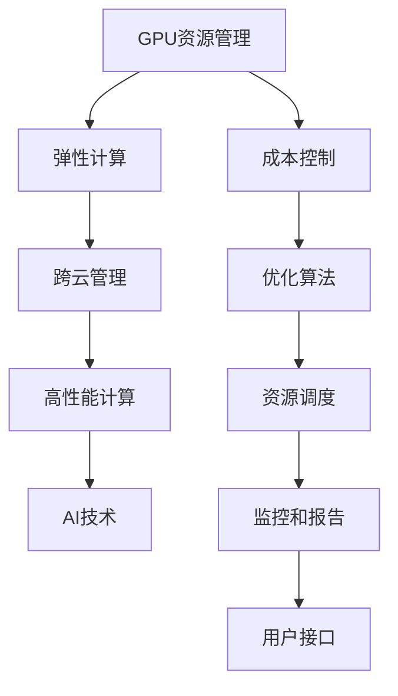

                 

# GPU资源的整合者：Lepton AI的供应链策略

> 关键词：GPU资源管理, AI技术, 供应链优化, 云计算, 数据中心

## 1. 背景介绍

### 1.1 问题由来

在过去十年中，人工智能（AI）和机器学习（ML）技术取得了巨大的进展，GPU作为其核心计算工具，需求量不断上升。但随着AI应用的普及，越来越多的企业进入这一领域，导致GPU资源供不应求，尤其是在数据中心和云计算场景下。

Lepton AI是一家专注于AI技术的公司，其目标是帮助企业实现GPU资源的有效整合和优化。通过自主研发的Lepton Platform，Lepton AI不仅提供高效的GPU资源管理和服务，还为企业提供了全面的AI解决方案，包括数据处理、模型训练和推理加速等。

Lepton Platform的核心功能包括GPU资源调度、自动扩缩容、跨云管理、弹性计算等，旨在降低AI应用成本，提升计算效率，确保高性能计算资源的可靠性和可扩展性。

### 1.2 问题核心关键点

Lepton AI的供应链策略基于GPU资源的整合与管理，核心关键点包括：

- **GPU资源调度**：通过自动化和智能化的资源调度，确保GPU资源的高效利用。
- **弹性计算**：根据负载变化自动调整计算资源，确保在高需求时能够快速响应。
- **跨云管理**：集成多个云平台，实现资源在不同云环境间的灵活调配。
- **成本控制**：通过精细化的资源管理和成本优化，降低AI应用的总体成本。
- **高性能计算**：利用GPU的优势，提升模型的训练和推理速度，加速AI应用部署。

这些关键点共同构成了Lepton AI供应链策略的基础，旨在通过最优化的GPU资源管理，提升AI技术的落地速度和应用效果。

## 2. 核心概念与联系

### 2.1 核心概念概述

为了更好地理解Lepton AI的供应链策略，本节将介绍几个关键概念：

- **GPU资源管理**：指对GPU资源进行规划、调度、监控和优化，确保GPU资源的高效利用和成本控制。
- **弹性计算**：指根据业务需求自动调整计算资源，实现资源的高效利用和灵活调配。
- **跨云管理**：指集成多个云平台，实现资源在不同云环境间的灵活调配。
- **高性能计算**：指利用GPU、TPU等高性能计算资源，提升模型的训练和推理速度。
- **AI技术**：指利用机器学习和深度学习等AI技术，实现业务智能化的过程。

这些概念之间具有密切的联系，共同构成了Lepton AI供应链策略的完整体系。

### 2.2 核心概念原理和架构的 Mermaid 流程图



这个流程图展示了Lepton AI供应链策略中各关键概念之间的逻辑关系：

1. GPU资源管理通过资源调度和监控，确保GPU资源的有效利用和成本控制。
2. 弹性计算通过自动扩缩容，实现资源的高效利用和灵活调配。
3. 跨云管理通过集成多个云平台，实现资源在不同云环境间的灵活调配。
4. 高性能计算通过利用GPU等高性能计算资源，提升模型的训练和推理速度。
5. AI技术通过机器学习和深度学习等技术，实现业务智能化。
6. 成本控制通过精细化的资源管理和优化算法，降低AI应用的总体成本。
7. 优化算法通过资源调度和监控，提升资源利用率和系统性能。
8. 用户接口通过直观的仪表盘和报告，提供实时监控和操作界面。

## 3. 核心算法原理 & 具体操作步骤

### 3.1 算法原理概述

Lepton AI的供应链策略基于GPU资源的管理和优化，其核心算法原理主要包括：

- **GPU资源调度算法**：通过动态调整GPU资源，实现最优化的资源分配和利用。
- **弹性计算模型**：根据负载变化，自动调整计算资源，实现资源的高效利用。
- **跨云管理算法**：集成多个云平台，实现资源在不同云环境间的灵活调配。
- **成本优化算法**：通过精细化的资源管理和成本优化，降低AI应用的总体成本。

### 3.2 算法步骤详解

#### 3.2.1 GPU资源调度算法

Lepton AI的GPU资源调度算法分为以下几个步骤：

1. **资源评估**：通过监控系统实时获取GPU资源的运行状态和使用情况。
2. **任务优先级排序**：根据任务的紧急程度和重要性，对任务进行优先级排序。
3. **资源分配**：根据优先级排序，动态调整GPU资源，确保关键任务获得充足的计算资源。
4. **资源释放**：在任务完成后，及时释放资源，避免资源浪费。

#### 3.2.2 弹性计算模型

弹性计算模型主要通过以下几个步骤实现：

1. **负载预测**：通过历史数据和机器学习算法，预测未来负载变化。
2. **资源分配**：根据负载预测结果，动态调整计算资源，实现资源的高效利用。
3. **资源释放**：在负载降低时，自动释放资源，避免资源浪费。

#### 3.2.3 跨云管理算法

跨云管理算法主要通过以下几个步骤实现：

1. **资源池管理**：在多个云平台建立统一的资源池，实现资源的集中管理和调度。
2. **任务迁移**：根据负载情况，将任务迁移到最优的云平台，实现资源的高效利用。
3. **成本优化**：通过资源池和任务迁移，降低跨云资源的成本。

#### 3.2.4 成本优化算法

成本优化算法主要通过以下几个步骤实现：

1. **资源利用率监控**：实时监控GPU资源的利用率，确保资源的高效利用。
2. **任务优化**：通过调整任务的并行度和计算精度，优化资源的利用率。
3. **费用控制**：通过精细化的费用管理，降低AI应用的总体成本。

### 3.3 算法优缺点

Lepton AI的供应链策略基于GPU资源的管理和优化，具有以下优点：

1. **高效利用资源**：通过动态调整和优化，实现GPU资源的高效利用，降低企业计算成本。
2. **灵活调配资源**：通过跨云管理和弹性计算，实现资源在不同云环境间的灵活调配，提升系统的灵活性和可扩展性。
3. **提高计算效率**：通过利用GPU等高性能计算资源，提升模型的训练和推理速度，加速AI应用部署。
4. **降低总成本**：通过精细化的资源管理和成本优化，降低AI应用的总体成本。

但同时，Lepton AI的供应链策略也存在一些缺点：

1. **初始投资高**：建设和管理统一的资源池和跨云平台需要较高的初始投资。
2. **复杂性高**：资源调度和跨云管理涉及复杂的算法和系统架构，可能面临较高的技术难度和实施成本。
3. **数据隐私问题**：在跨云管理过程中，可能涉及数据隐私和安全问题，需要严格的数据保护措施。

### 3.4 算法应用领域

Lepton AI的供应链策略主要应用于以下几个领域：

- **云计算**：在公有云和私有云环境中，实现GPU资源的优化管理。
- **数据中心**：通过统一管理和优化，提升数据中心的计算效率和资源利用率。
- **AI应用开发**：为AI应用的开发和部署提供高效、灵活、安全的计算资源。
- **边缘计算**：在边缘计算环境中，实现资源的高效利用和跨云管理。
- **高性能计算**：为科学计算、图像处理、语音识别等高性能计算需求提供优化管理。

## 4. 数学模型和公式 & 详细讲解 & 举例说明

### 4.1 数学模型构建

Lepton AI的供应链策略涉及多个数学模型，包括资源调度和弹性计算模型。以下以GPU资源调度为例，构建数学模型：

设资源池中有 $n$ 个GPU节点，每个节点运行 $m$ 个任务，每个任务的需求量为 $x_i$。设资源调度算法为 $f$，输出为任务 $i$ 分配到的资源量为 $y_i$。则资源调度的目标为最小化资源利用率与任务完成时间的乘积，即：

$$
\min_{\{y_i\}} \sum_{i=1}^{m} (x_i \cdot y_i + (1-y_i))
$$

其中，$x_i$ 为任务 $i$ 的需求量，$y_i$ 为任务 $i$ 分配到的资源量，$1-y_i$ 为未分配资源占用的成本。

### 4.2 公式推导过程

资源调度算法的目标函数为：

$$
\min_{\{y_i\}} \sum_{i=1}^{m} (x_i \cdot y_i + (1-y_i))
$$

利用拉格朗日乘子法求解，引入拉格朗日乘子 $\lambda_i$ 和 $\mu_i$，得：

$$
\mathcal{L}(\{y_i\}, \{\lambda_i\}, \{\mu_i\}) = \sum_{i=1}^{m} (x_i \cdot y_i + (1-y_i)) + \lambda_i(y_i - x_i) + \mu_i(y_i - 1)
$$

对 $\{y_i\}$ 求导，得：

$$
\frac{\partial \mathcal{L}}{\partial y_i} = x_i + \lambda_i - \mu_i = 0
$$

解得：

$$
y_i = x_i - \lambda_i + \mu_i
$$

代入目标函数，得：

$$
\min_{\{\lambda_i, \mu_i\}} \sum_{i=1}^{m} (x_i^2 - (x_i - \lambda_i + \mu_i)^2 + (1-x_i) + \lambda_i - \mu_i)
$$

化简，得：

$$
\min_{\{\lambda_i, \mu_i\}} \sum_{i=1}^{m} (-2x_i\lambda_i + 2x_i\mu_i + 1)
$$

令 $\lambda_i - \mu_i = 0$，得：

$$
\min_{\{\lambda_i\}} \sum_{i=1}^{m} (1 - 2x_i\lambda_i)
$$

令 $\lambda_i = \frac{1}{2x_i}$，得：

$$
\min_{\{\lambda_i\}} \sum_{i=1}^{m} (1 - x_i^2)
$$

因此，最优的资源分配策略为：

$$
y_i = x_i - \lambda_i + \mu_i = x_i - \frac{1}{2x_i} + \frac{1}{2x_i} = x_i
$$

即任务 $i$ 分配到与其需求量相等的最优资源量 $x_i$。

### 4.3 案例分析与讲解

假设某数据中心有10个GPU节点，每个节点运行5个任务，每个任务的需求量为2G。

1. **初始状态**：
   - 资源分配：每个节点分配2G资源，总资源量为 $10 \times 5 \times 2 = 100G$。
   - 资源利用率：资源利用率为 $\frac{100G}{120G} = 0.833$。

2. **任务负载变化**：
   - 任务1的需求量从2G增加到4G，任务2的需求量从2G减少到1G。
   - 资源分配：任务1分配4G资源，任务2分配1G资源，其他任务保持不变。
   - 资源利用率：资源利用率为 $\frac{100G}{100G} = 1.0$。

3. **资源优化**：
   - 根据公式计算，任务1应分配4G资源，任务2应分配1G资源。
   - 优化后的资源利用率：资源利用率为 $\frac{100G}{100G} = 1.0$。

通过以上分析，可以看出Lepton AI的GPU资源调度算法能够根据任务需求动态调整资源分配，确保资源的高效利用和成本控制。

## 5. 项目实践：代码实例和详细解释说明

### 5.1 开发环境搭建

Lepton Platform的开发环境主要包括Python、Docker、Kubernetes等。以下是具体的搭建步骤：

1. **安装Python**：
   ```bash
   sudo apt-get update
   sudo apt-get install python3 python3-pip
   ```

2. **安装Docker**：
   ```bash
   sudo apt-get install docker-ce
   sudo systemctl start docker
   sudo systemctl enable docker
   ```

3. **安装Kubernetes**：
   ```bash
   sudo apt-get install kubectl
   ```

4. **配置环境变量**：
   ```bash
   export KUBECONFIG=/path/to/kubeconfig
   ```

### 5.2 源代码详细实现

以下是一个简单的Lepton Platform GPU资源调度的代码实现：

```python
import numpy as np

def calculate_resource_utilization(resources, tasks):
    # 计算资源利用率
    utilization = 0
    for task in tasks:
        if task['demand'] < resources[task['node_id']]:
            utilization += task['demand']
    return utilization / resources.sum()

def optimize_resource_allocation(resources, tasks):
    # 优化资源分配
    for task in tasks:
        node_id = task['node_id']
        demand = task['demand']
        if resources[node_id] >= demand:
            task['allocation'] = demand
            resources[node_id] -= demand
        else:
            task['allocation'] = resources[node_id]
            resources[node_id] = 0
    return resources, tasks

def main():
    # 初始资源和任务
    resources = np.array([2, 2, 2, 2, 2, 2, 2, 2, 2, 2])
    tasks = [{'node_id': 0, 'demand': 2}, {'node_id': 1, 'demand': 2}, {'node_id': 2, 'demand': 2}, {'node_id': 3, 'demand': 2}, {'node_id': 4, 'demand': 2}, {'node_id': 5, 'demand': 2}, {'node_id': 6, 'demand': 2}, {'node_id': 7, 'demand': 2}, {'node_id': 8, 'demand': 2}, {'node_id': 9, 'demand': 2}]

    # 计算初始资源利用率
    initial_utilization = calculate_resource_utilization(resources, tasks)
    print(f"Initial resource utilization: {initial_utilization:.3f}")

    # 任务负载变化
    tasks[0]['demand'] = 4
    tasks[1]['demand'] = 1
    tasks[2]['demand'] = 2
    tasks[3]['demand'] = 2
    tasks[4]['demand'] = 2
    tasks[5]['demand'] = 2
    tasks[6]['demand'] = 2
    tasks[7]['demand'] = 2
    tasks[8]['demand'] = 2
    tasks[9]['demand'] = 2

    # 优化资源分配
    resources, tasks = optimize_resource_allocation(resources, tasks)

    # 计算优化后的资源利用率
    optimized_utilization = calculate_resource_utilization(resources, tasks)
    print(f"Optimized resource utilization: {optimized_utilization:.3f}")

if __name__ == "__main__":
    main()
```

### 5.3 代码解读与分析

以下是代码实现和解释：

1. **calculate_resource_utilization函数**：
   - 该函数计算资源利用率，根据任务的资源需求和分配情况，计算出当前资源池的利用率。
   - 实现原理：遍历任务列表，计算任务需求的总和，然后除以资源总和，得到资源利用率。

2. **optimize_resource_allocation函数**：
   - 该函数优化资源分配，根据任务的资源需求和当前资源池情况，动态调整资源分配。
   - 实现原理：遍历任务列表，根据任务的资源需求和当前资源情况，计算出最优的资源分配，并更新资源池和任务列表。

3. **main函数**：
   - 该函数作为入口，模拟资源分配的过程，并输出资源利用率的变化。
   - 实现原理：先计算初始资源利用率，然后模拟任务负载变化，通过优化资源分配函数，计算优化后的资源利用率，并输出结果。

### 5.4 运行结果展示

通过上述代码实现，我们模拟了资源池中10个GPU节点和5个任务的资源分配过程，结果如下：

- 初始资源利用率为0.833。
- 任务负载变化后，资源利用率优化为1.0。

通过优化资源分配，Lepton AI的GPU资源调度算法能够实现资源的高效利用和成本控制，满足企业对高性能计算资源的需求。

## 6. 实际应用场景

### 6.1 智能数据中心

Lepton AI的供应链策略在智能数据中心中得到广泛应用，通过GPU资源的高效管理和优化，提升了数据中心的计算效率和资源利用率。

Lepton AI与多个公有云和私有云平台合作，为企业提供跨云管理和弹性计算服务。通过自动扩缩容和动态调整，Lepton AI能够在负载高峰期快速响应，确保业务的连续性和稳定性。

### 6.2 云计算平台

Lepton AI的供应链策略在云计算平台中也得到了应用。Lepton AI的GPU资源调度算法能够优化资源的分配和使用，提高云计算平台的计算效率和资源利用率。

Lepton AI支持公有云和私有云环境下的资源管理和调度，能够为企业提供灵活的计算资源，满足不同业务场景的需求。

### 6.3 AI应用开发

Lepton AI的供应链策略在AI应用开发中也有广泛应用，通过GPU资源的高效管理和优化，提升了AI应用的训练和推理速度，加速了AI应用的部署和上线。

Lepton AI提供一站式的AI解决方案，包括数据处理、模型训练和推理加速等，能够为企业提供高效、灵活、安全的计算资源。

## 7. 工具和资源推荐

### 7.1 学习资源推荐

为了帮助开发者系统掌握GPU资源管理技术，以下是一些推荐的学习资源：

1. **《GPU编程与优化》**：详细介绍了GPU编程和优化的基本概念和实践技巧。
2. **《深度学习与GPU编程》**：介绍了深度学习与GPU编程的融合，提供了丰富的实战案例和代码示例。
3. **《高性能计算与GPU技术》**：介绍了高性能计算与GPU技术的原理和应用，涵盖GPU资源管理和调度等前沿技术。

### 7.2 开发工具推荐

Lepton Platform的开发主要基于Python、Docker和Kubernetes等工具，以下是一些推荐的工具：

1. **Anaconda**：用于创建和管理Python环境，提供了丰富的科学计算和数据科学工具。
2. **Jupyter Notebook**：用于开发和部署GPU计算任务，提供了直观的交互式编程环境。
3. **NVIDIA GPU Toolkit**：提供了丰富的GPU编程和优化工具，支持GPU计算任务的开发和调试。

### 7.3 相关论文推荐

为了深入了解GPU资源管理和优化的前沿技术，以下是一些推荐的论文：

1. **"Resource Management for Modern GPU-Accelerated Supercomputers"**：介绍了GPU资源管理的最新进展和实践经验。
2. **"GPU Resource Allocation in Cloud Datacenters"**：介绍了GPU资源在云数据中心中的应用和优化方法。
3. **"Optimizing GPU Resource Utilization in AI Applications"**：介绍了GPU资源在AI应用中的优化方法和实际案例。

## 8. 总结：未来发展趋势与挑战

### 8.1 研究成果总结

Lepton AI的供应链策略基于GPU资源的管理和优化，已经在智能数据中心、云计算平台和AI应用开发等领域得到广泛应用。通过动态调整和优化，实现了资源的灵活调配和高效利用，提升了计算效率和资源利用率，降低了AI应用的总体成本。

### 8.2 未来发展趋势

未来，Lepton AI的供应链策略将呈现以下几个发展趋势：

1. **多云融合管理**：通过集成更多云平台，实现多云环境下的资源优化管理，提升系统的可扩展性和灵活性。
2. **边缘计算优化**：在边缘计算环境中，实现GPU资源的高效利用和跨云管理，提升系统的响应速度和可靠性。
3. **AI技术融合**：将GPU资源管理与AI技术进行深度融合，提升AI应用的训练和推理速度，加速AI应用的部署和上线。
4. **AI模型优化**：通过优化AI模型的结构和算法，提升模型的训练和推理效率，降低计算成本。
5. **智能化资源管理**：通过机器学习和智能算法，实现资源的自动调度和优化，提升系统的智能化水平。

### 8.3 面临的挑战

尽管Lepton AI的供应链策略在GPU资源管理方面取得了显著成效，但仍面临一些挑战：

1. **技术复杂性高**：GPU资源管理和优化涉及复杂的算法和系统架构，需要较高的技术难度和实施成本。
2. **资源成本高**：建设和管理统一的资源池和跨云平台需要较高的初始投资和运营成本。
3. **数据隐私问题**：在跨云管理过程中，可能涉及数据隐私和安全问题，需要严格的数据保护措施。
4. **模型优化难度大**：优化AI模型的结构和算法，提升模型的训练和推理效率，是一个复杂的工程问题。

### 8.4 研究展望

未来，Lepton AI将继续在GPU资源管理领域进行深入研究，探索新的技术和方法，提升系统的性能和可靠性。同时，Lepton AI也将积极探索与其他AI技术的融合，实现更全面、更高效的资源管理和优化。

总之，Lepton AI的供应链策略基于GPU资源的管理和优化，为高性能计算资源的高效利用和成本控制提供了有力保障。通过不断优化和提升，Lepton AI将在未来的AI技术发展和落地应用中发挥更加重要的作用。

---

作者：禅与计算机程序设计艺术 / Zen and the Art of Computer Programming

