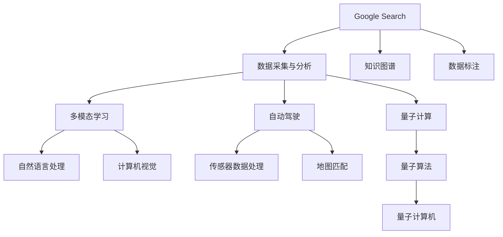

                 

# Google的AI布局:从搜索到多元化的AI帝国

> 关键词：人工智能,Google,搜索,多模态,自动驾驶,量子计算

## 1. 背景介绍

### 1.1 问题由来

Google，作为全球互联网科技巨头，近年来在人工智能(AI)领域的布局愈发明显。从搜索算法到云服务，从自动驾驶到量子计算，Google在AI技术的各个角落都有所涉猎。Google通过一系列技术突破和业务转型，构建了一个多元化的AI帝国。本文将从搜索到多模态、自动驾驶、量子计算等多个维度，全面剖析Google的AI布局，探讨其未来发展趋势和面临的挑战。

## 2. 核心概念与联系

### 2.1 核心概念概述

为了更好地理解Google的AI布局，我们需要先梳理一些核心概念：

- **人工智能(AI)**：使计算机系统能模拟人类智能行为的技术，包括机器学习、深度学习、自然语言处理、计算机视觉等方向。
- **Google Search**：Google搜索不仅是一个搜索引擎，更是一个庞大的数据采集和分析平台，为Google提供海量的数据源和知识图谱。
- **多模态学习**：结合图像、语音、文本等多种信息源，以更全面的方式理解和处理数据。
- **自动驾驶**：结合传感器、地图、规则等，使汽车能够自主导航和驾驶。
- **量子计算**：利用量子位进行信息处理，以实现更高效的计算能力。

这些概念通过谷歌云平台(GCP)等基础设施支撑，形成了一个多元化的AI生态系统。

### 2.2 核心概念原理和架构的 Mermaid 流程图



上述流程图展示了Google AI生态系统的核心组成部分和相互联系。搜索数据的处理和分析，知识图谱的构建，以及多模态学习、自动驾驶和量子计算等前沿技术的探索，共同构成了一个完整的AI布局。

## 3. 核心算法原理 & 具体操作步骤

### 3.1 算法原理概述

Google在AI领域的布局，很大程度上依赖于其强大的数据基础和强大的计算能力。以下是对其核心算法原理的简要概述：

- **搜索算法**：基于PageRank算法的搜索排序，使得搜索结果与用户查询意图高度相关。同时，利用深度学习技术优化搜索结果的多样性和相关性。
- **知识图谱**：通过RDF等技术构建的知识图谱，使得计算机可以理解和处理自然语言信息，为多模态学习和自动驾驶提供数据支持。
- **多模态学习**：结合图像、语音、文本等多种数据源，利用Transformer、BERT等模型进行融合，提升数据理解的准确性。
- **自动驾驶**：通过激光雷达、摄像头、GPS等传感器数据，结合深度学习模型，实现车辆自主导航和驾驶决策。
- **量子计算**：利用量子位进行优化算法和机器学习算法的加速，提升计算效率和处理能力。

### 3.2 算法步骤详解

以Google Search为例，其核心算法步骤包括：

1. **数据采集与分析**：Google Search每天处理数十亿次查询，从中提取大量数据用于分析和训练。
2. **自然语言处理**：利用BERT、GPT等模型，处理和理解自然语言查询。
3. **知识图谱构建**：通过RDF技术构建实体和关系的知识图谱，为多模态学习和自动驾驶提供数据支撑。
4. **多模态学习**：结合图像、语音等数据，利用Transformer模型进行信息融合。
5. **深度学习优化**：利用深度学习技术不断优化搜索结果的排序和展示。

### 3.3 算法优缺点

Google的AI布局主要优点包括：

- **数据丰富**：Google Search和广告平台每天处理海量数据，提供了丰富的训练样本和优化数据。
- **计算能力强**：Google拥有强大的计算资源，支持大规模模型训练和计算。
- **技术多样**：Google在自然语言处理、多模态学习、自动驾驶、量子计算等多个领域都有涉猎。

缺点则包括：

- **数据隐私**：海量数据处理带来了数据隐私和合规问题，需严格遵守GDPR等法规。
- **资源消耗**：大规模模型的训练和部署需要大量资源，包括计算和存储。
- **技术壁垒高**：前沿技术如量子计算尚处于早期阶段，技术实现和应用仍面临诸多挑战。

### 3.4 算法应用领域

Google的AI布局覆盖了多个应用领域：

- **搜索**：Google Search利用AI技术优化搜索结果排序，提升用户体验。
- **云计算**：Google Cloud提供强大的AI计算能力，支持客户进行模型训练和数据处理。
- **自动驾驶**：Waymo是Google旗下的自动驾驶公司，利用AI技术研发自动驾驶汽车。
- **医疗**：DeepMind Health利用AI技术进行疾病预测和诊断，提升医疗效率。
- **教育**：Google AI在教育领域也有所布局，利用AI技术提升学习效果。

## 4. 数学模型和公式 & 详细讲解 & 举例说明

### 4.1 数学模型构建

以Google Search为例，其核心模型包括：

- **TF-IDF模型**：用于文本匹配和排序。
- **深度学习模型**：包括BERT、GPT等，用于自然语言处理。
- **神经网络模型**：包括卷积神经网络(CNN)、循环神经网络(RNN)等，用于多模态数据融合。

### 4.2 公式推导过程

以BERT为例，其核心公式包括：

$$
\text{BERT}_{\text{CLS}}(x) = \frac{1}{1+e^{-\text{score}(x,\text{CLS})}}
$$

其中，$\text{score}(x,\text{CLS})$ 是BERT模型对于输入文本的表示与CLS token的向量点积，用于判断输入文本的意图。

### 4.3 案例分析与讲解

以Google自动驾驶为例，其核心算法包括：

- **传感器数据处理**：通过激光雷达、摄像头等传感器获取环境数据，进行预处理。
- **深度学习模型**：利用CNN等模型处理传感器数据，提取环境特征。
- **决策树**：基于提取的环境特征，利用决策树进行驾驶决策。

## 5. 项目实践：代码实例和详细解释说明

### 5.1 开发环境搭建

要实践Google AI技术，需要以下开发环境：

1. **Google Cloud Platform (GCP)**：提供计算、存储和数据处理能力。
2. **TensorFlow**：Google开源的深度学习框架，用于模型训练和推理。
3. **Keras**：基于TensorFlow的高级API，用于快速原型开发。
4. **Jupyter Notebook**：交互式开发环境，支持Python和R等语言。

### 5.2 源代码详细实现

以Google自动驾驶为例，其核心代码包括：

```python
import tensorflow as tf
from tensorflow.keras import layers

model = tf.keras.Sequential([
    layers.Conv2D(32, (3,3), activation='relu', input_shape=(64,64,3)),
    layers.MaxPooling2D((2,2)),
    layers.Conv2D(64, (3,3), activation='relu'),
    layers.MaxPooling2D((2,2)),
    layers.Flatten(),
    layers.Dense(64, activation='relu'),
    layers.Dense(1, activation='sigmoid')
])
```

### 5.3 代码解读与分析

以上代码实现了一个简单的卷积神经网络，用于图像分类。Google自动驾驶算法中的神经网络模型比这要复杂得多，需要结合多个传感器数据，利用深度学习模型进行多模态数据融合。

### 5.4 运行结果展示

在Google自动驾驶模拟器中，神经网络模型可以实时处理传感器数据，并做出驾驶决策。其运行结果包括车辆的速度、方向、转向角度等控制指令。

## 6. 实际应用场景

### 6.1 智能搜索

Google Search利用AI技术优化搜索结果排序，提供用户最相关的信息。通过深度学习模型和自然语言处理技术，Google Search能够理解用户的查询意图，提供更加精准的搜索结果。

### 6.2 自动驾驶

Google自动驾驶项目Waymo利用AI技术研发自动驾驶汽车，结合激光雷达、摄像头、GPS等传感器数据，进行环境感知和驾驶决策。目前Waymo已经在全球多个城市进行测试和运营。

### 6.3 量子计算

Google的量子计算项目包括Sycamore等量子计算机，利用量子位进行优化算法和机器学习算法的加速。量子计算有望在未来实现更高效的计算能力，为AI技术提供新的突破。

### 6.4 未来应用展望

未来，Google的AI布局有望进一步扩展到更多领域，包括：

- **医疗健康**：利用AI技术进行疾病预测、诊断和治疗优化。
- **金融科技**：利用AI技术进行风险管理、投资策略等。
- **环保能源**：利用AI技术进行能源优化、碳排放管理等。
- **娱乐传媒**：利用AI技术进行内容推荐、个性化服务等。

## 7. 工具和资源推荐

### 7.1 学习资源推荐

1. **《深度学习》课程**：由Google和斯坦福大学合作开设，涵盖深度学习的基本概念和技术。
2. **Google AI Hub**：提供丰富的AI模型和教程，包括自动驾驶、量子计算等。
3. **TensorFlow官方文档**：详细介绍了TensorFlow的使用方法，涵盖深度学习模型的训练和推理。
4. **Keras官方文档**：提供Keras的使用方法和API文档，帮助快速原型开发。
5. **Coursera《AI for Everyone》课程**：由Andrew Ng教授主讲，介绍AI技术的广泛应用。

### 7.2 开发工具推荐

1. **Google Cloud Platform (GCP)**：提供强大的计算、存储和数据处理能力。
2. **TensorFlow**：Google开源的深度学习框架，用于模型训练和推理。
3. **Keras**：基于TensorFlow的高级API，用于快速原型开发。
4. **Jupyter Notebook**：交互式开发环境，支持Python和R等语言。
5. **Kaggle**：数据科学竞赛平台，提供大量开源数据集和模型。

### 7.3 相关论文推荐

1. **《TensorFlow》论文**：谷歌开源的深度学习框架TensorFlow，详细介绍了其设计原理和使用方法。
2. **《多模态学习》论文**：探讨结合图像、语音、文本等不同模态的数据，提升数据理解的准确性。
3. **《量子计算》论文**：介绍量子计算的基本原理和应用，展示量子位和量子计算机的计算优势。

## 8. 总结：未来发展趋势与挑战

### 8.1 研究成果总结

Google在AI领域的布局，通过搜索算法、知识图谱、多模态学习、自动驾驶和量子计算等多个方向，构建了一个多元化的AI生态系统。这些技术的结合和应用，不仅提升了Google自身的业务能力，也为更多企业提供了AI解决方案。

### 8.2 未来发展趋势

未来，Google的AI布局有望在以下几个方向取得突破：

1. **计算效率提升**：通过量子计算、分布式计算等技术，提升AI算法的计算效率。
2. **数据隐私保护**：在数据处理和存储中，采用差分隐私等技术，保护用户隐私。
3. **模型可解释性增强**：通过可解释性模型，提升AI系统的透明性和可理解性。
4. **跨领域应用拓展**：将AI技术应用到更多领域，如医疗、金融、教育等。

### 8.3 面临的挑战

Google在AI布局过程中，也面临一些挑战：

1. **数据隐私**：海量数据处理带来了数据隐私和合规问题，需严格遵守GDPR等法规。
2. **计算资源**：大规模模型的训练和部署需要大量资源，包括计算和存储。
3. **技术实现**：前沿技术如量子计算尚处于早期阶段，技术实现和应用仍面临诸多挑战。

### 8.4 研究展望

未来，在AI技术的探索中，需要重点关注以下几个方向：

1. **跨模态数据融合**：将不同模态的数据融合在一起，提升数据理解的准确性。
2. **模型可解释性**：提升AI模型的透明性和可理解性，增强系统的可信度。
3. **多领域应用**：将AI技术应用到更多领域，提升各行业的智能化水平。

总之，Google的AI布局不仅在技术上领先，也在应用上取得了显著成果。未来，Google将不断推动AI技术的发展和应用，为人类社会的进步贡献更多力量。

## 9. 附录：常见问题与解答

**Q1: Google在AI领域的布局主要有哪些方向？**

A: Google在AI领域的布局主要方向包括搜索算法、知识图谱、多模态学习、自动驾驶和量子计算等。

**Q2: 如何理解Google自动驾驶技术的核心算法？**

A: Google自动驾驶技术的核心算法包括传感器数据处理、深度学习模型和多模态数据融合等。利用激光雷达、摄像头等传感器获取环境数据，通过CNN等模型进行图像处理，结合决策树进行驾驶决策。

**Q3: Google搜索利用AI技术提升结果排序的方式有哪些？**

A: Google搜索利用AI技术提升结果排序的方式包括TF-IDF模型、深度学习模型和自然语言处理技术等。通过深度学习模型理解用户查询意图，提供更加精准的搜索结果。

**Q4: Google的量子计算项目进展如何？**

A: Google的量子计算项目包括Sycamore等量子计算机，利用量子位进行优化算法和机器学习算法的加速。量子计算有望在未来实现更高效的计算能力，为AI技术提供新的突破。

**Q5: 谷歌云平台(GCP)在AI技术中的应用有哪些？**

A: Google Cloud Platform (GCP)提供强大的计算、存储和数据处理能力，支持客户进行模型训练和数据处理。同时，GCP还提供丰富的AI模型和教程，帮助开发者快速进行AI应用开发。

---

作者：禅与计算机程序设计艺术 / Zen and the Art of Computer Programming

