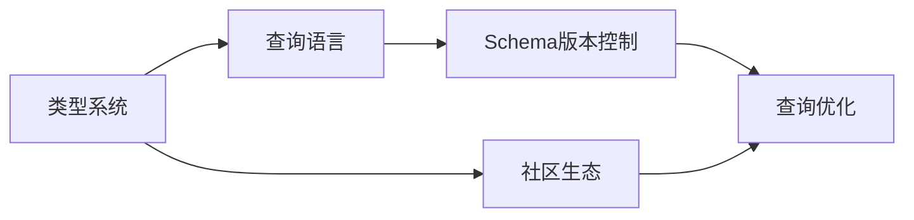
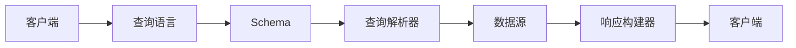

                 

# GraphQL API设计：灵活高效的数据查询语言

> 关键词：GraphQL, API设计, 数据查询, 类型系统, 版本控制, 查询优化, 社区生态

## 1. 背景介绍

随着互联网应用的不断发展，API（应用程序编程接口）成为了连接前后端、构建微服务架构不可或缺的工具。传统的REST API在数据查询方面存在诸多局限性，如响应数据过多、冗余网络传输、API版本升级频繁等问题。因此，GraphQL作为一种新的API设计语言，受到了广泛关注和应用。

### 1.1 问题由来

REST API的核心是以资源为中心，通过固定的URL和HTTP方法来获取资源数据。尽管REST API已经被广泛应用于各类应用，但随着API功能日益复杂，其缺点也逐渐暴露出来：

- **数据冗余**：通常情况下，REST API需要根据不同资源、不同参数组合返回大量重复数据，造成网络带宽的浪费和客户端处理资源的负担。
- **版本管理复杂**：随着应用功能的不断扩展，API的接口设计可能会频繁更新，每次更新都需要维护多个版本，增加了开发和维护成本。
- **缺乏灵活性**：REST API的数据查询方式是固定的，不能灵活地获取不同组合的字段，需要开发者编写多个API接口。
- **响应延迟**：REST API往往需要多次网络请求才能获取所需的数据，导致响应速度慢，用户体验不佳。

针对这些问题，GraphQL提出了一种更为灵活和高效的数据查询语言，能够有效提升API的设计和用户体验。

### 1.2 问题核心关键点
GraphQL的核心在于其灵活的数据查询能力、版本控制机制以及查询优化策略。通过GraphQL，API的客户端和服务器能够进行双向通信，根据实际需求动态地查询数据，减少不必要的数据传输，优化响应时间，同时也降低了版本管理的复杂度。

GraphQL的核心关键点如下：

- **类型系统**：GraphQL定义了完整的数据类型系统，包括标量类型、对象类型、接口类型等，并能够动态生成类型描述。
- **查询语言**：GraphQL提供了一种强类型化的查询语言，能够根据实际需求动态构建查询语句，减少冗余数据传输。
- **版本控制**：GraphQL通过Schema版本控制机制，能够兼容旧版本API，避免频繁的版本升级带来的问题。
- **查询优化**：GraphQL在数据查询时能够进行优化，如合并查询、减少冗余等，提升响应速度。
- **社区生态**：GraphQL有丰富的开源工具和库，构建了庞大的开发者社区，加速了GraphQL技术的应用和推广。

这些关键点共同构成了GraphQL的核心优势，使其在API设计中备受青睐。

## 2. 核心概念与联系

### 2.1 核心概念概述

GraphQL的核心概念包括类型系统、查询语言、Schema版本控制、查询优化以及社区生态。这些概念通过紧密的联系，共同支撑GraphQL的高效性、灵活性和可维护性。

- **类型系统**：GraphQL通过类型系统定义了数据结构，客户端和服务器可以基于类型进行交互。类型系统定义了每个数据类型的字段、子类型、接口等，并提供了强类型化的查询语言。
- **查询语言**：GraphQL提供了一种强大的查询语言，能够根据客户端需求动态构建查询语句，减少不必要的数据传输。
- **Schema版本控制**：GraphQL通过Schema版本控制机制，能够在兼容旧版本API的同时，逐步引入新功能，减少版本管理复杂度。
- **查询优化**：GraphQL在数据查询时能够进行优化，如合并查询、减少冗余等，提升响应速度。
- **社区生态**：GraphQL有丰富的开源工具和库，构建了庞大的开发者社区，加速了GraphQL技术的应用和推广。

这些核心概念通过以下Mermaid流程图来展示它们之间的联系：



该图展示了GraphQL的核心概念之间的相互依赖关系。类型系统定义了数据的结构，查询语言基于类型系统构建查询，Schema版本控制确保API兼容旧版本，查询优化提升响应速度，社区生态提供丰富的工具和库支持。

### 2.2 核心概念原理和架构的 Mermaid 流程图



该图展示了GraphQL的基本架构。客户端通过查询语言向服务器发送查询请求，服务器根据Schema解析查询，并从数据源获取数据，最后构建响应返回给客户端。

## 3. 核心算法原理 & 具体操作步骤

### 3.1 算法原理概述

GraphQL的算法原理主要集中在类型系统、查询语言和Schema版本控制三个方面。

- **类型系统**：GraphQL的类型系统定义了数据结构，包括标量类型、对象类型、接口类型等，能够动态生成类型描述，使客户端和服务器能够基于类型进行交互。
- **查询语言**：GraphQL的查询语言是一种强类型化的查询语言，能够根据客户端需求动态构建查询语句，减少不必要的数据传输。
- **Schema版本控制**：GraphQL通过Schema版本控制机制，能够在兼容旧版本API的同时，逐步引入新功能，减少版本管理复杂度。

### 3.2 算法步骤详解

GraphQL的核心算法步骤主要包括以下几个方面：

**Step 1: 定义类型系统**

在GraphQL中，类型系统是数据查询的基础。GraphQL定义了完整的类型系统，包括标量类型、对象类型、接口类型等。类型系统通过Schema描述，Schema描述了所有可查询的数据类型和它们之间的关系。

**Step 2: 构建查询语句**

客户端根据实际需求构建查询语句。GraphQL的查询语言基于类型系统构建，能够动态生成查询语句，减少不必要的数据传输。查询语句包括字段、变量、片段等，能够灵活地获取所需数据。

**Step 3: 解析查询**

服务器接收到查询语句后，根据Schema解析查询，并根据查询条件获取所需数据。GraphQL的查询解析器能够处理复杂的查询语句，并优化查询性能。

**Step 4: 获取数据**

服务器根据解析后的查询获取数据。GraphQL的数据源可以是数据库、缓存、API等，数据源返回的数据将用于构建响应。

**Step 5: 构建响应**

服务器根据查询语句构建响应，返回客户端所需的数据。GraphQL的响应构建器能够动态生成响应，并返回给客户端。

**Step 6: 版本控制**

GraphQL通过Schema版本控制机制，能够在兼容旧版本API的同时，逐步引入新功能，减少版本管理复杂度。客户端可以根据Schema版本控制机制，动态加载最新版本的Schema。

### 3.3 算法优缺点

GraphQL的优点包括：

- **灵活性高**：GraphQL能够根据实际需求动态构建查询语句，减少不必要的数据传输，提升响应速度。
- **版本控制方便**：GraphQL通过Schema版本控制机制，能够在兼容旧版本API的同时，逐步引入新功能，减少版本管理复杂度。
- **查询优化**：GraphQL在数据查询时能够进行优化，如合并查询、减少冗余等，提升响应速度。

GraphQL的缺点包括：

- **学习曲线较陡**：GraphQL的查询语言和类型系统较为复杂，需要一定的学习成本。
- **性能优化难度大**：GraphQL的查询优化需要考虑数据合并、冗余消除等复杂问题，开发和维护难度较大。
- **后端开发成本高**：GraphQL的Schema设计需要考虑多个客户端的需求，开发和维护成本较高。

### 3.4 算法应用领域

GraphQL的应用领域非常广泛，涵盖了各种API设计场景。以下是几个典型的应用领域：

- **前端API设计**：GraphQL能够提升前端API的响应速度，减少不必要的数据传输，提升用户体验。
- **后端API设计**：GraphQL能够提升后端API的数据查询效率，减少数据冗余，优化响应时间。
- **微服务架构**：GraphQL能够支持微服务架构下的数据查询，提升系统可伸缩性和灵活性。
- **多客户端应用**：GraphQL能够兼容多个客户端的需求，支持多种数据查询方式，提升系统可维护性。

## 4. 数学模型和公式 & 详细讲解

### 4.1 数学模型构建

GraphQL的数学模型主要集中在类型系统和查询语言上。

- **类型系统**：GraphQL的类型系统通过Schema描述，Schema定义了所有可查询的数据类型和它们之间的关系。Schema由类型、字段、输入类型、接口等组成。
- **查询语言**：GraphQL的查询语言是一种强类型化的查询语言，能够根据客户端需求动态构建查询语句，减少不必要的数据传输。查询语言包括字段、变量、片段等。

### 4.2 公式推导过程

以下我们以一个简单的GraphQL类型系统为例，推导Schema的定义及其应用。

假设有一个简单的数据模型，包括用户（User）、文章（Article）和评论（Comment）三种类型。其中，用户包含文章和评论，文章和评论都包含用户ID。Schema可以定义如下：

```graphql
type User {
    id: ID!
    name: String!
    email: String!
    articles: [Article]
    comments: [Comment]
}

type Article {
    id: ID!
    title: String!
    content: String!
    user: User!
    comments: [Comment]
}

type Comment {
    id: ID!
    content: String!
    user: User!
    article: Article
}
```

在这个Schema中，User、Article和Comment是三种不同的数据类型，它们之间通过字段建立关联。例如，User类型包含Article和Comment字段，Article类型包含user和comments字段，Comment类型包含user和article字段。

### 4.3 案例分析与讲解

假设客户端需要查询某个用户的所有文章和评论。客户端可以根据Schema构建查询语句：

```graphql
query {
    user(id: "123") {
        name
        articles {
            title
            content
        }
        comments {
            content
        }
    }
}
```

这个查询语句中，client首先查询id为123的用户，然后获取该用户的name、articles和comments字段。在获取articles和comments字段时，GraphQL会自动合并查询，减少不必要的数据传输，提升响应速度。

## 5. 项目实践：代码实例和详细解释说明

### 5.1 开发环境搭建

在进行GraphQL项目实践前，我们需要准备好开发环境。以下是使用Node.js和Express搭建GraphQL服务器的环境配置流程：

1. 安装Node.js：从官网下载并安装Node.js，用于运行GraphQL服务器。
2. 安装Express：通过npm安装Express框架，用于创建GraphQL服务器。
3. 安装GraphQL相关库：通过npm安装GraphQL和GraphQL Resolver库，用于定义Schema和解析查询。

完成上述步骤后，即可在Node.js环境中开始GraphQL项目实践。

### 5.2 源代码详细实现

这里我们以一个简单的GraphQL服务器为例，展示GraphQL的代码实现。

首先，定义GraphQL类型系统：

```javascript
const { gql } = require('apollo-server-express');

const typeDefs = gql`
    type User {
        id: ID!
        name: String!
        email: String!
        articles: [Article]
        comments: [Comment]
    }

    type Article {
        id: ID!
        title: String!
        content: String!
        user: User!
        comments: [Comment]
    }

    type Comment {
        id: ID!
        content: String!
        user: User!
        article: Article
    }

    type Query {
        user(id: ID!): User
    }
`;
```

然后，定义GraphQL查询解析器：

```javascript
const resolvers = {
    Query: {
        user: async (_, { id }) => {
            // 根据id查询用户数据
            const user = await getUserById(id);
            return user;
        },
    },
};

module.exports = { typeDefs, resolvers };
```

最后，使用Express框架创建GraphQL服务器：

```javascript
const express = require('express');
const { ApolloServer } = require('apollo-server-express');
const typeDefs = require('./typeDefs');
const resolvers = require('./resolvers');

const app = express();
const server = new ApolloServer({ typeDefs, resolvers });

server.applyMiddleware({ app });

app.listen(3000, () => {
    console.log('GraphQL server started on port 3000');
});
```

### 5.3 代码解读与分析

让我们再详细解读一下关键代码的实现细节：

**GraphQL类型系统**：
- 使用GraphQL定义了三种数据类型：User、Article和Comment，并定义了它们之间的关系。

**查询解析器**：
- 查询解析器定义了如何根据id查询用户数据，并返回查询结果。

**GraphQL服务器**：
- 使用Express框架创建GraphQL服务器，将GraphQL查询解析器应用到Express中。

### 5.4 运行结果展示

启动GraphQL服务器，通过Postman或其他工具访问http://localhost:3000/graphql，可以看到GraphQL的查询接口。例如，发送以下查询：

```graphql
{
    user(id: "123") {
        name
        articles {
            title
            content
        }
        comments {
            content
        }
    }
}
```

服务器将返回查询结果，展示id为123的用户的所有文章和评论信息。

## 6. 实际应用场景

### 6.1 前端API设计

GraphQL能够提升前端API的响应速度，减少不必要的数据传输，提升用户体验。例如，在构建前端页面时，需要获取用户的文章和评论信息。传统REST API需要分别发送多个API请求，而GraphQL只需要发送一次请求即可获取所有信息，减少了网络传输，提升了响应速度。

### 6.2 后端API设计

GraphQL能够提升后端API的数据查询效率，减少数据冗余，优化响应时间。例如，在构建后端API时，需要获取用户的文章和评论信息。传统REST API需要分别发送多个API请求，而GraphQL只需要发送一次请求即可获取所有信息，减少了不必要的数据传输，提升了响应速度。

### 6.3 微服务架构

GraphQL能够支持微服务架构下的数据查询，提升系统可伸缩性和灵活性。例如，在微服务架构中，不同服务之间需要通过API进行数据交互。传统REST API需要多个API接口进行数据查询，而GraphQL只需要一个API接口即可查询所有数据，提升了系统可伸缩性和灵活性。

### 6.4 多客户端应用

GraphQL能够兼容多个客户端的需求，支持多种数据查询方式，提升系统可维护性。例如，在多客户端应用中，不同客户端可能需要进行不同的数据查询。传统REST API需要分别设计多个API接口，而GraphQL只需要一个API接口即可查询所有数据，提升了系统可维护性。

## 7. 工具和资源推荐

### 7.1 学习资源推荐

为了帮助开发者系统掌握GraphQL的理论基础和实践技巧，这里推荐一些优质的学习资源：

1. GraphQL官方文档：GraphQL官方提供的文档，包括语法、类型系统、查询语言等基础内容，是学习GraphQL的重要参考。
2. GraphQL教程：由GraphQL之父Andrew Keefer-Nashefsky提供的在线教程，涵盖GraphQL的各个方面，适合初学者入门。
3. GraphQL Fundamentals：由Vitaliy Nemkov提供的GraphQL基础课程，深入浅出地介绍了GraphQL的各个概念，适合进阶学习。
4. GraphQL: The Definitive Guide：一本关于GraphQL的权威书籍，全面介绍了GraphQL的各个方面，适合深入学习。
5. GraphQL with Apollo：由Apollo GraphQL官方提供的文档和教程，涵盖GraphQL在Apollo中的实现，适合了解GraphQL在实际应用中的使用。

通过对这些资源的学习实践，相信你一定能够快速掌握GraphQL的精髓，并用于解决实际的API设计问题。

### 7.2 开发工具推荐

GraphQL有丰富的开源工具和库，构建了庞大的开发者社区，加速了GraphQL技术的应用和推广。以下是几款常用的GraphQL开发工具：

1. GraphQL Playground：GraphQL的客户端工具，提供图形化界面，方便调试和测试GraphQL查询。
2. GraphQL Explorer：GraphQL的客户端工具，提供图形化界面，方便调试和测试GraphQL查询。
3. GraphQL IDE：适用于IDE的工具，提供自动完成、语法高亮等功能，提升开发效率。
4. GraphQL Resolver：GraphQL的查询解析器库，支持自定义查询解析逻辑，灵活性高。
5. GraphQL Tools：GraphQL的工具库，提供Schema验证、查询优化等工具，提升开发效率。

合理利用这些工具，可以显著提升GraphQL项目的开发效率，加快创新迭代的步伐。

### 7.3 相关论文推荐

GraphQL作为一种新兴的API设计语言，已经得到了广泛的研究和应用。以下是几篇奠基性的相关论文，推荐阅读：

1. GraphQL: The Future of Client-Server Communication：由Neal Madden、Alex Cai和Sam Brannen等提出的GraphQL论文，详细介绍了GraphQL的设计理念和实现方式。
2. GraphQL: A GraphQL Programming Language for APIs：由Neal Madden、Alex Cai和Sam Brannen等提出的GraphQL编程语言设计，详细介绍了GraphQL的类型系统、查询语言等基础概念。
3. GraphQL: A Typed Query Language for APIs：由Neal Madden、Alex Cai和Sam Brannen等提出的GraphQL查询语言设计，详细介绍了GraphQL的查询语言和查询优化策略。
4. GraphQL with Apollo：由Apollo GraphQL官方提供的GraphQL实现方式，详细介绍了GraphQL在Apollo中的实现和应用。
5. GraphQL: Beyond the Interface：由Neal Madden、Alex Cai和Sam Brannen等提出的GraphQL扩展设计，详细介绍了GraphQL的扩展机制和应用场景。

这些论文代表了大语言模型微调技术的发展脉络。通过学习这些前沿成果，可以帮助研究者把握学科前进方向，激发更多的创新灵感。

## 8. 总结：未来发展趋势与挑战

### 8.1 总结

本文对GraphQL的原理和应用进行了全面系统的介绍。首先阐述了GraphQL的核心优势和应用场景，明确了GraphQL在API设计中的重要地位。其次，从原理到实践，详细讲解了GraphQL的类型系统、查询语言和Schema版本控制等关键技术。最后，本文还探讨了GraphQL的未来发展趋势和面临的挑战，指出GraphQL在API设计中的重要地位和广阔前景。

通过本文的系统梳理，可以看到，GraphQL作为一种新的API设计语言，能够有效提升API的灵活性和效率，减少不必要的数据传输，优化响应时间。未来，随着GraphQL技术的发展和普及，API设计将变得更加灵活和高效，为后端服务的设计和开发带来更多的可能。

### 8.2 未来发展趋势

展望未来，GraphQL将呈现以下几个发展趋势：

1. **应用场景多样化**：GraphQL将广泛应用于各类API设计场景，如前端API、后端API、微服务架构、多客户端应用等，提升系统的灵活性和可维护性。
2. **社区生态完善**：GraphQL社区将继续壮大，丰富的开源工具和库将加速GraphQL技术的应用和推广。
3. **技术融合加速**：GraphQL将与各类技术进行更深入的融合，如容器化、服务化、分布式等，提升系统的可伸缩性和可用性。
4. **标准化工作推进**：GraphQL将逐步完善其标准和规范，提升其可互操作性和可扩展性。
5. **新特性不断涌现**：GraphQL将不断引入新的特性和扩展，提升其灵活性和应用范围。

这些趋势凸显了GraphQL的广阔前景和重要性。GraphQL作为新的API设计语言，必将在未来API设计中发挥重要作用，推动API设计的发展和进步。

### 8.3 面临的挑战

尽管GraphQL已经取得了瞩目成就，但在迈向更加智能化、普适化应用的过程中，它仍面临着诸多挑战：

1. **学习曲线陡峭**：GraphQL的查询语言和类型系统较为复杂，需要一定的学习成本。
2. **性能优化难度大**：GraphQL的查询优化需要考虑数据合并、冗余消除等复杂问题，开发和维护难度较大。
3. **后端开发成本高**：GraphQL的Schema设计需要考虑多个客户端的需求，开发和维护成本较高。
4. **生态系统不成熟**：尽管GraphQL社区在不断壮大，但其生态系统仍不成熟，缺乏部分工具和库的支持。
5. **版本兼容性问题**：GraphQL通过Schema版本控制机制，能够兼容旧版本API，但旧版本API的兼容性问题仍需解决。

这些挑战凸显了GraphQL在推广和应用中的复杂性。开发者需要不断优化和改进GraphQL的查询语言和类型系统，提升其性能和易用性，才能进一步推动GraphQL技术的应用和普及。

### 8.4 研究展望

面对GraphQL面临的挑战，未来的研究需要在以下几个方面寻求新的突破：

1. **查询优化技术**：开发更加高效、灵活的查询优化算法，提升GraphQL查询的响应速度和性能。
2. **Schema设计工具**：开发更加智能的Schema设计工具，帮助开发者设计更灵活、高效的Schema。
3. **生态系统完善**：丰富GraphQL的开源工具和库，构建更加完善的GraphQL生态系统。
4. **版本控制机制**：改进Schema版本控制机制，提升旧版本API的兼容性和维护性。
5. **新特性探索**：探索新的GraphQL特性和扩展，提升其应用范围和灵活性。

这些研究方向将推动GraphQL技术的发展和普及，提升GraphQL在API设计中的应用效果和用户体验。总之，GraphQL作为一种新的API设计语言，必将引领API设计的新趋势，带来更高效、灵活的API体验。

## 9. 附录：常见问题与解答

**Q1: GraphQL的查询语言和类型系统如何设计？**

A: GraphQL的查询语言和类型系统通过Schema定义，Schema描述了所有可查询的数据类型和它们之间的关系。在Schema中，可以定义标量类型、对象类型、接口类型等，并使用字段、变量、片段等构建查询语句。查询语言基于类型系统，能够根据客户端需求动态构建查询语句，减少不必要的数据传输。

**Q2: GraphQL如何处理查询优化？**

A: GraphQL在数据查询时能够进行优化，如合并查询、减少冗余等，提升响应速度。查询优化需要在查询解析器中进行实现，例如使用缓存机制、合并查询语句等，避免重复计算。

**Q3: GraphQL在实际应用中需要注意哪些问题？**

A: GraphQL在实际应用中需要注意查询优化、Schema设计、版本控制等问题。查询优化需要避免不必要的数据传输，提升响应速度。Schema设计需要考虑多个客户端的需求，提升系统的灵活性和可维护性。版本控制需要确保旧版本API的兼容性和维护性，避免频繁的版本升级带来的问题。

**Q4: GraphQL与REST API有何不同？**

A: GraphQL与REST API的核心差异在于数据查询的方式。REST API通过固定的URL和HTTP方法获取资源数据，而GraphQL通过灵活的查询语言动态构建查询语句，减少不必要的数据传输，提升响应速度。REST API需要分别发送多个API请求，而GraphQL只需要发送一次请求即可获取所有信息。

**Q5: GraphQL有哪些优点和缺点？**

A: GraphQL的优点包括灵活性高、版本控制方便、查询优化能力强等。GraphQL能够根据客户端需求动态构建查询语句，减少不必要的数据传输，提升响应速度。通过Schema版本控制机制，能够在兼容旧版本API的同时，逐步引入新功能，减少版本管理复杂度。

GraphQL的缺点包括学习曲线陡峭、性能优化难度大、后端开发成本高等。GraphQL的查询语言和类型系统较为复杂，需要一定的学习成本。查询优化需要考虑数据合并、冗余消除等复杂问题，开发和维护难度较大。Schema设计需要考虑多个客户端的需求，开发和维护成本较高。

总之，GraphQL作为一种新的API设计语言，具有其独特的优势和应用场景，但也需要面对一定的挑战和改进空间。在实际应用中，开发者需要根据具体需求和场景，选择合适的API设计方式，提升API的灵活性和效率。

---

作者：禅与计算机程序设计艺术 / Zen and the Art of Computer Programming

