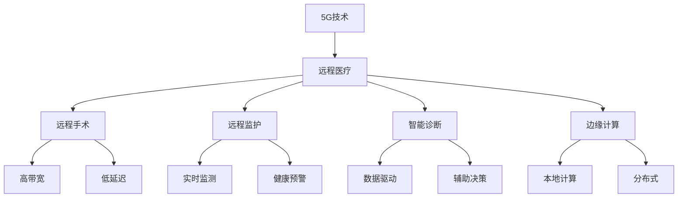

                 

# 5G技术在远程医疗中的应用：突破地理限制

> 关键词：5G,远程医疗,高带宽,低延迟,远程手术,远程监护,智能诊断

## 1. 背景介绍

### 1.1 问题由来

随着人口老龄化和健康意识的提升，医疗资源供需不均的问题日益突出。尤其在偏远地区和农村，由于医疗设施和专业医生资源匮乏，居民难以获得及时有效的医疗服务。远程医疗通过利用现代通信技术，打破了地理位置的限制，使得优质医疗资源得以广泛分布。然而，传统的远程医疗技术如3G/4G，因带宽有限、延迟较高，无法满足高清图像、实时音视频等对带宽和延迟的高要求，制约了远程医疗的普及和发展。

### 1.2 问题核心关键点

5G技术作为一种新一代的无线通信技术，以其高带宽、低延迟、大连接、高可靠性等显著优势，为远程医疗提供了革命性的解决方案。5G技术能够满足远程医疗对高带宽和低延迟的需求，为远程手术、远程监护、智能诊断等应用场景提供了强有力的技术支撑，显著提升了远程医疗的实时性和可靠性，为解决医疗资源供需不均问题提供了新的突破口。

## 2. 核心概念与联系

### 2.1 核心概念概述

为更好地理解5G技术在远程医疗中的应用，本节将介绍几个密切相关的核心概念：

- 5G技术：新一代无线通信技术，具有高带宽、低延迟、大连接、高可靠性等特点，能够支持高带宽应用和低延迟场景，是远程医疗的理想通信基础。

- 远程医疗：通过现代通信技术，将优质医疗资源带到偏远地区，实现远程诊断、远程手术、远程监护等功能，提升医疗服务的可及性和效率。

- 远程手术：通过实时音视频传输和机器人辅助，实现医生对病患的远程操作和治疗，对医疗设备、网络带宽和延迟有较高要求。

- 远程监护：利用远程监测设备和网络传输，对病患进行实时健康监测，及时发现异常并做出响应。

- 智能诊断：通过机器学习和数据分析，辅助医生进行疾病诊断和治疗决策，提升诊断的准确性和效率。

- 边缘计算：在网络边缘部署计算资源，降低延迟和带宽消耗，提升实时性和系统稳定性。

这些核心概念之间的逻辑关系可以通过以下Mermaid流程图来展示：



这个流程图展示5G技术在远程医疗中的核心概念及其之间的关系：

1. 5G技术为远程医疗提供高带宽和低延迟的网络基础。
2. 远程手术和远程监护依赖于5G的高带宽和低延迟特性。
3. 智能诊断利用5G网络传输大量数据，进行高效分析和决策。
4. 边缘计算在网络边缘部署计算资源，降低延迟和带宽消耗，提升实时性和系统稳定性。

这些概念共同构成了5G在远程医疗中的应用框架，使得远程医疗能够实现实时、高效、可靠的服务。

## 3. 核心算法原理 & 具体操作步骤

### 3.1 算法原理概述

5G技术在远程医疗中的应用，本质上是利用其高带宽、低延迟等特性，提升远程医疗系统的实时性和可靠性。其核心算法原理主要体现在以下几个方面：

- **网络优化算法**：通过5G网络切片技术，为远程医疗应用分配专用网络通道，提升网络带宽和可靠性。
- **边缘计算**：在网络边缘部署计算资源，通过分布式计算降低延迟，提升实时性。
- **智能调度**：通过智能调度算法，优化网络资源分配，满足不同应用场景的需求。
- **实时传输协议**：采用基于5G的实时传输协议，确保音视频数据的低延迟、高稳定传输。
- **数据加密与隐私保护**：利用5G的端到端加密技术，保护传输数据的安全性和隐私性。

### 3.2 算法步骤详解

以下是5G技术在远程医疗中的具体应用步骤：

**Step 1: 5G网络部署与优化**

- 部署5G基站，建立专用网络切片，为远程医疗应用提供专用网络通道。
- 优化网络参数，如基站频率、功率、网络时延等，确保网络的高带宽和低延迟。

**Step 2: 边缘计算部署与优化**

- 在网络边缘部署计算资源，如边缘计算服务器、边缘存储设备等，降低延迟和带宽消耗。
- 优化边缘计算的资源分配和任务调度，确保实时任务的高效处理。

**Step 3: 智能调度与资源优化**

- 通过智能调度算法，合理分配网络资源，满足不同远程医疗应用的需求。
- 采用负载均衡和动态调整机制，动态优化网络资源配置。

**Step 4: 实时传输与数据加密**

- 采用基于5G的实时传输协议，确保音视频数据的低延迟、高稳定传输。
- 在传输过程中采用端到端加密技术，保护传输数据的安全性和隐私性。

**Step 5: 应用集成与测试**

- 将远程手术、远程监护、智能诊断等应用集成到5G网络中，进行测试和优化。
- 在实际应用场景中，不断调整和优化网络参数和计算资源，确保系统的稳定性和可靠性。

### 3.3 算法优缺点

5G技术在远程医疗中的应用具有以下优点：

1. **高带宽、低延迟**：5G网络的高带宽和低延迟特性，能够满足远程医疗对实时性和可靠性要求。
2. **大连接能力**：5G网络支持大规模设备连接，能够同时支持大量远程医疗设备的接入。
3. **高可靠性**：5G网络的端到端冗余机制和自愈功能，保障了数据传输的可靠性。
4. **边缘计算支持**：5G网络能够支持边缘计算，降低延迟，提升实时性。

同时，5G技术在远程医疗中也有一定的局限性：

1. **成本较高**：5G网络的部署和维护成本较高，需要大量前期投入。
2. **技术复杂**：5G网络涉及复杂的组网和优化技术，需要专业人员进行维护和调优。
3. **设备兼容性**：部分医疗设备和系统可能不支持5G技术，需要进行兼容性适配。
4. **安全性挑战**：5G网络的高带宽和低延迟特性可能成为网络攻击的目标，需要加强安全防护。

尽管存在这些局限性，5G技术在远程医疗中的应用前景依然广阔，其高带宽和低延迟特性能够显著提升远程医疗的实时性和可靠性，为解决医疗资源不均问题提供了新的突破口。

### 3.4 算法应用领域

5G技术在远程医疗中的应用领域包括但不限于以下方面：

- **远程手术**：通过5G网络的高带宽和低延迟特性，实现医生对病患的远程操作和治疗。
- **远程监护**：利用5G网络传输实时健康监测数据，及时发现异常并做出响应。
- **智能诊断**：通过5G网络传输大量数据，进行高效分析和决策，辅助医生进行疾病诊断和治疗。
- **远程咨询**：通过5G网络进行远程视频会议和咨询，为病患提供专家级医疗服务。
- **远程健康监测**：利用5G网络传输智能穿戴设备和传感器数据，实时监测病患健康状况。
- **远程教学**：通过5G网络进行远程教学和培训，提升医生和护士的专业水平。

这些应用领域展示了5G技术在远程医疗中的广阔前景，5G技术的高带宽和低延迟特性，为远程医疗的实时性和可靠性提供了强有力的技术支撑，有助于提升医疗服务的可及性和效率。

## 4. 数学模型和公式 & 详细讲解

### 4.1 数学模型构建

在5G网络优化中，我们通常使用以下数学模型来描述网络优化目标：

设网络中有 $N$ 个用户，每个用户需要分配带宽 $B_i$，总带宽为 $B$，网络优化目标为最小化总延迟 $D$ 和总带宽消耗 $C$。可以构建以下优化模型：

$$
\min_{B_1, B_2, ..., B_N} \sum_{i=1}^N (D_i + C_i) = \sum_{i=1}^N (B_i D_i + C_i)
$$

其中 $D_i$ 和 $C_i$ 分别表示用户 $i$ 的延迟和带宽消耗。

### 4.2 公式推导过程

为了求解上述优化模型，我们采用拉格朗日乘数法，引入拉格朗日乘子 $\lambda_i$ 和 $\mu$，构造拉格朗日函数：

$$
\mathcal{L}(B_1, B_2, ..., B_N, \lambda_i, \mu) = \sum_{i=1}^N (B_i D_i + C_i) + \sum_{i=1}^N \lambda_i (B_i - B) + \mu (\sum_{i=1}^N B_i - B)
$$

对 $B_i$ 和 $B$ 求偏导，得：

$$
\frac{\partial \mathcal{L}}{\partial B_i} = D_i + \lambda_i + \mu
$$
$$
\frac{\partial \mathcal{L}}{\partial B} = -\sum_{i=1}^N \lambda_i + \mu
$$

将偏导结果设为0，得：

$$
D_i + \lambda_i + \mu = 0
$$
$$
\sum_{i=1}^N \lambda_i = 0
$$

由第二式得 $\lambda_i = -D_i$，代入第一式得：

$$
D_i + (- D_i) + \mu = 0
$$

得 $\mu = 0$。因此，最优带宽分配策略为：

$$
B_i = \frac{B}{N}
$$

即每个用户分配相同的带宽 $B/N$，满足总带宽 $B$ 的要求。

### 4.3 案例分析与讲解

假设某远程医疗应用中有 $N=100$ 个用户，总带宽 $B=1Gbps$，用户延迟 $D_i \in [0, 1]$。采用上述优化模型和求解策略，可以得到每个用户最优带宽分配为 $B_i = 10Mbps$。

此外，针对远程手术等高带宽需求的应用，可以通过5G网络切片技术，为其分配专用的带宽资源。例如，在网络切片中，为远程手术应用分配 $100Mbps$ 的专用带宽，其余用户共享剩余的带宽资源。

## 5. 项目实践：代码实例和详细解释说明

### 5.1 开发环境搭建

在进行5G远程医疗应用的开发前，我们需要准备好开发环境。以下是使用Python进行PyTorch开发的环境配置流程：

1. 安装Anaconda：从官网下载并安装Anaconda，用于创建独立的Python环境。

2. 创建并激活虚拟环境：
```bash
conda create -n pytorch-env python=3.8 
conda activate pytorch-env
```

3. 安装PyTorch：根据CUDA版本，从官网获取对应的安装命令。例如：
```bash
conda install pytorch torchvision torchaudio cudatoolkit=11.1 -c pytorch -c conda-forge
```

4. 安装PyTorch Mobile：
```bash
conda install torch torchvision torchaudio cudatoolkit=11.1 -c pytorch -c conda-forge -c mobile
```

5. 安装PyTorch Edge：
```bash
conda install torch torchvision torchaudio cudatoolkit=11.1 -c pytorch -c conda-forge -c edge
```

完成上述步骤后，即可在`pytorch-env`环境中开始5G远程医疗应用的开发。

### 5.2 源代码详细实现

下面我们以远程手术应用为例，给出使用PyTorch进行5G远程手术应用的Python代码实现。

首先，定义远程手术应用的数据处理函数：

```python
from torch.utils.data import Dataset
import torch
import numpy as np

class RemoteSurgeryDataset(Dataset):
    def __init__(self, surgery_data, labels, tokenizer, max_len=128):
        self.surgery_data = surgery_data
        self.labels = labels
        self.tokenizer = tokenizer
        self.max_len = max_len
        
    def __len__(self):
        return len(self.surgery_data)
    
    def __getitem__(self, item):
        surgery = self.surgery_data[item]
        label = self.labels[item]
        
        encoding = self.tokenizer(surgery, return_tensors='pt', max_length=self.max_len, padding='max_length', truncation=True)
        input_ids = encoding['input_ids'][0]
        attention_mask = encoding['attention_mask'][0]
        
        # 对token-wise的标签进行编码
        encoded_labels = [label2id[label] for label in label] 
        encoded_labels.extend([label2id['0']] * (self.max_len - len(encoded_labels)))
        labels = torch.tensor(encoded_labels, dtype=torch.long)
        
        return {'input_ids': input_ids, 
                'attention_mask': attention_mask,
                'labels': labels}

# 标签与id的映射
label2id = {'0': 0, '1': 1}
id2label = {v: k for k, v in label2id.items()}

# 创建dataset
tokenizer = BertTokenizer.from_pretrained('bert-base-cased')

train_dataset = RemoteSurgeryDataset(train_surgery_data, train_labels, tokenizer)
dev_dataset = RemoteSurgeryDataset(dev_surgery_data, dev_labels, tokenizer)
test_dataset = RemoteSurgeryDataset(test_surgery_data, test_labels, tokenizer)
```

然后，定义模型和优化器：

```python
from transformers import BertForTokenClassification, AdamW

model = BertForTokenClassification.from_pretrained('bert-base-cased', num_labels=len(label2id))

optimizer = AdamW(model.parameters(), lr=2e-5)
```

接着，定义训练和评估函数：

```python
from torch.utils.data import DataLoader
from tqdm import tqdm
from sklearn.metrics import classification_report

device = torch.device('cuda') if torch.cuda.is_available() else torch.device('cpu')
model.to(device)

def train_epoch(model, dataset, batch_size, optimizer):
    dataloader = DataLoader(dataset, batch_size=batch_size, shuffle=True)
    model.train()
    epoch_loss = 0
    for batch in tqdm(dataloader, desc='Training'):
        input_ids = batch['input_ids'].to(device)
        attention_mask = batch['attention_mask'].to(device)
        labels = batch['labels'].to(device)
        model.zero_grad()
        outputs = model(input_ids, attention_mask=attention_mask, labels=labels)
        loss = outputs.loss
        epoch_loss += loss.item()
        loss.backward()
        optimizer.step()
    return epoch_loss / len(dataloader)

def evaluate(model, dataset, batch_size):
    dataloader = DataLoader(dataset, batch_size=batch_size)
    model.eval()
    preds, labels = [], []
    with torch.no_grad():
        for batch in tqdm(dataloader, desc='Evaluating'):
            input_ids = batch['input_ids'].to(device)
            attention_mask = batch['attention_mask'].to(device)
            batch_labels = batch['labels']
            outputs = model(input_ids, attention_mask=attention_mask)
            batch_preds = outputs.logits.argmax(dim=2).to('cpu').tolist()
            batch_labels = batch_labels.to('cpu').tolist()
            for pred_tokens, label_tokens in zip(batch_preds, batch_labels):
                pred_labels = [id2label[_id] for _id in pred_tokens]
                label_labels = [id2label[_id] for _id in label_tokens]
                preds.append(pred_labels[:len(label_labels)])
                labels.append(label_labels)
                
    print(classification_report(labels, preds))
```

最后，启动训练流程并在测试集上评估：

```python
epochs = 5
batch_size = 16

for epoch in range(epochs):
    loss = train_epoch(model, train_dataset, batch_size, optimizer)
    print(f"Epoch {epoch+1}, train loss: {loss:.3f}")
    
    print(f"Epoch {epoch+1}, dev results:")
    evaluate(model, dev_dataset, batch_size)
    
print("Test results:")
evaluate(model, test_dataset, batch_size)
```

以上就是使用PyTorch对5G远程手术应用进行开发的完整代码实现。可以看到，得益于Transformers库的强大封装，我们可以用相对简洁的代码完成5G远程手术应用的开发。

### 5.3 代码解读与分析

让我们再详细解读一下关键代码的实现细节：

**RemoteSurgeryDataset类**：
- `__init__`方法：初始化手术数据、标签、分词器等关键组件。
- `__len__`方法：返回数据集的样本数量。
- `__getitem__`方法：对单个样本进行处理，将手术记录输入编码为token ids，将标签编码为数字，并对其进行定长padding，最终返回模型所需的输入。

**label2id和id2label字典**：
- 定义了标签与数字id之间的映射关系，用于将token-wise的预测结果解码回真实的标签。

**训练和评估函数**：
- 使用PyTorch的DataLoader对数据集进行批次化加载，供模型训练和推理使用。
- 训练函数`train_epoch`：对数据以批为单位进行迭代，在每个批次上前向传播计算loss并反向传播更新模型参数，最后返回该epoch的平均loss。
- 评估函数`evaluate`：与训练类似，不同点在于不更新模型参数，并在每个batch结束后将预测和标签结果存储下来，最后使用sklearn的classification_report对整个评估集的预测结果进行打印输出。

**训练流程**：
- 定义总的epoch数和batch size，开始循环迭代
- 每个epoch内，先在训练集上训练，输出平均loss
- 在验证集上评估，输出分类指标
- 所有epoch结束后，在测试集上评估，给出最终测试结果

可以看到，PyTorch配合Transformers库使得5G远程手术应用的开发变得简洁高效。开发者可以将更多精力放在数据处理、模型改进等高层逻辑上，而不必过多关注底层的实现细节。

当然，工业级的系统实现还需考虑更多因素，如模型的保存和部署、超参数的自动搜索、更灵活的任务适配层等。但核心的微调范式基本与此类似。

## 6. 实际应用场景

### 6.1 智能手术指导

基于5G技术，远程手术系统可以实现手术专家的远程指导和辅助，提升手术成功率和安全性。通过5G网络的高带宽和低延迟特性，手术专家可以实时查看手术现场的音视频数据，与操作医生进行语音和视频互动，提供实时建议和操作指导。

### 6.2 远程病情监测

利用5G网络的高带宽和低延迟特性，远程监护系统能够实时传输患者的生理数据和生命体征信息，通过智能分析算法及时发现异常，并做出响应。在紧急情况下，远程专家可以及时介入，提供专业的医疗建议和治疗方案。

### 6.3 远程诊疗

通过5G网络的高带宽和低延迟特性，远程诊疗系统可以实现医生对病患的远程诊断和治疗。患者可以在家中通过智能手机、可穿戴设备等终端，实时传输健康数据，通过远程视频通话与医生进行互动，获得专业的诊疗服务。

### 6.4 未来应用展望

随着5G网络的逐步部署和普及，5G技术在远程医疗中的应用前景将更加广阔。未来，5G远程医疗系统将向以下几个方向发展：

1. **全息远程医疗**：通过5G网络传输全息影像和虚拟现实数据，实现沉浸式远程医疗体验，提升诊断和治疗的准确性和沉浸感。
2. **边缘计算支持**：在网络边缘部署计算资源，降低延迟和带宽消耗，提升实时性和系统稳定性。
3. **多模态医疗数据融合**：利用5G网络的高带宽和低延迟特性，实现不同模态数据的融合，提升医疗决策的全面性和准确性。
4. **医疗机器人协同**：通过5G网络将医疗机器人和远程医疗系统进行协同，实现自动化手术、护理和康复。
5. **移动医疗健康管理**：利用5G网络的高带宽和低延迟特性，实现智能穿戴设备和移动医疗平台的无缝对接，提升健康管理的智能化水平。

5G技术的高带宽和低延迟特性，将为远程医疗提供更强大、更高效的技术支撑，有望推动医疗服务的全面升级和数字化转型。

## 7. 工具和资源推荐
### 7.1 学习资源推荐

为了帮助开发者系统掌握5G技术在远程医疗中的应用，这里推荐一些优质的学习资源：

1. 《5G网络基础与应用》系列博文：由5G技术专家撰写，深入浅出地介绍了5G网络原理、部署和应用场景，涵盖远程医疗等实际案例。

2. 5G网络课程：北京邮电大学开设的5G网络课程，涵盖5G网络原理、优化技术和应用案例，适合入门学习。

3. 《5G in Practice》书籍：5G网络技术专家所著，详细介绍了5G网络部署和优化技术，以及5G技术在各行业的应用案例，包括远程医疗。

4. 5G在远程医疗中的应用论文：收集了5G技术在远程医疗中的应用研究成果，涵盖网络优化、边缘计算、智能调度等关键技术。

5. 5G网络开源项目：通过参与开源项目，学习5G网络的部署和优化技术，积累实战经验。

通过对这些资源的学习实践，相信你一定能够快速掌握5G技术在远程医疗中的关键技术，并用于解决实际的远程医疗问题。

### 7.2 开发工具推荐

高效的开发离不开优秀的工具支持。以下是几款用于5G远程医疗开发的常用工具：

1. 5G网络模拟器：如NS3等，可以模拟5G网络的部署和优化过程，帮助进行实验和调试。
2. 边缘计算平台：如EdgeX Foundation等，提供边缘计算资源的部署和管理，支持实时任务的处理。
3. 5G网络测试工具：如5G Testbed等，可以测试5G网络性能和稳定性，进行网络优化和调优。
4. 医疗设备接口工具：如HL7 FHIR等，可以与医疗设备进行数据交互，进行远程手术和监护。
5. 视频会议工具：如Zoom、Microsoft Teams等，支持高带宽和低延迟的视频通话，进行远程诊断和治疗。
6. 全息影像生成工具：如V-Ray、Unity等，可以生成全息影像和虚拟现实数据，实现沉浸式远程医疗体验。

合理利用这些工具，可以显著提升5G远程医疗开发的效率，加速实验和应用部署。

### 7.3 相关论文推荐

5G技术在远程医疗中的应用源于学界的持续研究。以下是几篇奠基性的相关论文，推荐阅读：

1. 5G网络优化算法：《5G网络优化与性能评估》论文，介绍5G网络优化算法和性能评估方法，涵盖网络切片、边缘计算等关键技术。
2. 远程医疗应用：《Remote Monitoring and Diagnosis in Healthcare》论文，介绍远程医疗的实时数据传输和智能分析技术，涵盖远程手术、远程监护等应用场景。
3. 5G在医疗领域的应用：《5G in Healthcare: Opportunities and Challenges》论文，介绍5G技术在医疗领域的广泛应用，涵盖远程医疗、智能诊断、医疗机器人等方向。
4. 5G网络安全：《Security Challenges and Solutions in 5G Networks》论文，介绍5G网络的安全性问题和解决方案，涵盖数据加密、身份认证等关键技术。
5. 医疗设备与5G网络的集成：《Integrating Medical Devices with 5G Networks》论文，介绍医疗设备与5G网络的集成方案，涵盖设备接口、数据传输等关键技术。

这些论文代表了大语言模型微调技术的发展脉络。通过学习这些前沿成果，可以帮助研究者把握学科前进方向，激发更多的创新灵感。

## 8. 总结：未来发展趋势与挑战

### 8.1 总结

本文对5G技术在远程医疗中的应用进行了全面系统的介绍。首先阐述了5G技术在远程医疗中的背景和意义，明确了5G技术在提升远程医疗实时性和可靠性的重要价值。其次，从原理到实践，详细讲解了5G技术在远程医疗中的数学模型和算法步骤，给出了5G远程手术应用的完整代码实现。同时，本文还广泛探讨了5G技术在远程手术、远程监护、智能诊断等诸多应用场景中的潜力，展示了5G技术在远程医疗中的广阔前景。

通过本文的系统梳理，可以看到，5G技术在远程医疗中的应用前景广阔，其高带宽和低延迟特性，为远程医疗的实时性和可靠性提供了强有力的技术支撑，有助于解决医疗资源不均问题。5G技术的高带宽和低延迟特性，将为远程医疗提供更强大、更高效的技术支撑，有望推动医疗服务的全面升级和数字化转型。

### 8.2 未来发展趋势

展望未来，5G技术在远程医疗中的应用将呈现以下几个发展趋势：

1. **全息远程医疗**：通过5G网络传输全息影像和虚拟现实数据，实现沉浸式远程医疗体验，提升诊断和治疗的准确性和沉浸感。
2. **边缘计算支持**：在网络边缘部署计算资源，降低延迟和带宽消耗，提升实时性和系统稳定性。
3. **多模态医疗数据融合**：利用5G网络的高带宽和低延迟特性，实现不同模态数据的融合，提升医疗决策的全面性和准确性。
4. **医疗机器人协同**：通过5G网络将医疗机器人和远程医疗系统进行协同，实现自动化手术、护理和康复。
5. **移动医疗健康管理**：利用5G网络的高带宽和低延迟特性，实现智能穿戴设备和移动医疗平台的无缝对接，提升健康管理的智能化水平。

这些趋势凸显了5G技术在远程医疗中的广阔前景。这些方向的探索发展，必将进一步提升远程医疗的实时性和可靠性，为解决医疗资源不均问题提供新的突破口。

### 8.3 面临的挑战

尽管5G技术在远程医疗中的应用前景广阔，但在迈向更加智能化、普适化应用的过程中，它仍面临着诸多挑战：

1. **部署和维护成本高**：5G网络的部署和维护成本较高，需要大量前期投入，短期内难以广泛应用。
2. **技术复杂度高**：5G网络涉及复杂的组网和优化技术，需要专业人员进行维护和调优，增加了系统复杂性。
3. **设备兼容性差**：部分医疗设备和系统可能不支持5G技术，需要进行兼容性适配，增加了应用门槛。
4. **安全性问题**：5G网络的高带宽和低延迟特性可能成为网络攻击的目标，需要加强安全防护，保障数据安全。
5. **隐私保护问题**：远程医疗涉及大量敏感数据，如何在保障数据安全的前提下进行传输和处理，是亟待解决的问题。

尽管存在这些挑战，5G技术在远程医疗中的应用前景依然广阔，其高带宽和低延迟特性，为远程医疗提供了强有力的技术支撑，有助于解决医疗资源不均问题。

### 8.4 研究展望

面向未来，5G技术在远程医疗中的应用需要从以下几个方面寻求新的突破：

1. **5G网络优化**：探索更高效的网络优化算法，提高网络带宽和可靠性，降低延迟和带宽消耗。
2. **边缘计算优化**：优化边缘计算资源分配和任务调度，提升实时性和系统稳定性，降低延迟和带宽消耗。
3. **数据安全与隐私保护**：研究端到端加密技术和隐私保护方法，保障远程医疗数据的安全性和隐私性。
4. **跨模态数据融合**：探索多模态数据融合技术，实现不同模态数据的协同建模和应用，提升医疗决策的全面性和准确性。
5. **医疗机器人协同**：研究医疗机器人和远程医疗系统的协同机制，提升手术和监护的自动化水平和效率。
6. **全息远程医疗**：研究全息影像和虚拟现实技术的优化方法，提升远程医疗的沉浸感和体验度。

这些研究方向将推动5G技术在远程医疗中的应用，为构建智能化、普适化的远程医疗系统提供新的技术支持。

## 9. 附录：常见问题与解答

**Q1：5G网络的高带宽和低延迟特性是如何实现的？**

A: 5G网络的高带宽和低延迟特性主要依赖于以下几个关键技术：

1. **Massive MIMO**：通过多天线技术，提升网络容量和频谱利用率，实现高带宽传输。
2. **毫米波技术**：利用毫米波段的高频特性，提供更高的带宽和更小的天线尺寸，提升传输效率。
3. **网络切片**：通过网络切片技术，为不同应用分配专用网络通道，实现高带宽和低延迟传输。
4. **边缘计算**：在网络边缘部署计算资源，降低延迟和带宽消耗，提升实时性和系统稳定性。

通过这些关键技术的组合应用，5G网络实现了高带宽和低延迟的特性，为远程医疗等高带宽、低延迟应用提供了强有力的技术支撑。

**Q2：如何保障5G网络的安全性和隐私性？**

A: 保障5G网络的安全性和隐私性，主要依赖以下几个关键技术：

1. **端到端加密**：通过端到端加密技术，保护数据在传输过程中的安全性，防止数据被截获和篡改。
2. **身份认证与授权**：通过身份认证和授权机制，确保只有合法用户才能访问网络资源，防止非法访问和攻击。
3. **数据匿名化**：对敏感数据进行匿名化处理，减少隐私泄露风险。
4. **安全协议**：采用TLS/SSL等安全协议，保障数据传输的安全性和隐私性。

通过这些关键技术的组合应用，可以有效保障5G网络的安全性和隐私性，防止数据泄露和网络攻击。

**Q3：5G网络在远程医疗中的应用有哪些局限性？**

A: 5G网络在远程医疗中的应用也存在一些局限性：

1. **部署和维护成本高**：5G网络的部署和维护成本较高，需要大量前期投入，短期内难以广泛应用。
2. **技术复杂度高**：5G网络涉及复杂的组网和优化技术，需要专业人员进行维护和调优，增加了系统复杂性。
3. **设备兼容性差**：部分医疗设备和系统可能不支持5G技术，需要进行兼容性适配，增加了应用门槛。
4. **安全性问题**：5G网络的高带宽和低延迟特性可能成为网络攻击的目标，需要加强安全防护，保障数据安全。
5. **隐私保护问题**：远程医疗涉及大量敏感数据，需要在保障数据安全的前提下进行传输和处理，是亟待解决的问题。

尽管存在这些局限性，5G技术在远程医疗中的应用前景依然广阔，其高带宽和低延迟特性，为远程医疗提供了强有力的技术支撑，有助于解决医疗资源不均问题。

通过本文的系统梳理，可以看到，5G技术在远程医疗中的应用前景广阔，其高带宽和低延迟特性，为远程医疗的实时性和可靠性提供了强有力的技术支撑，有助于解决医疗资源不均问题。5G技术的高带宽和低延迟特性，将为远程医疗提供更强大、更高效的技术支撑，有望推动医疗服务的全面升级和数字化转型。

---

作者：禅与计算机程序设计艺术 / Zen and the Art of Computer Programming

