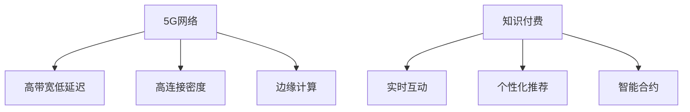

                 

# 5G时代知识付费将迎来哪些新的变革

在5G时代的浪潮下，知识付费领域正迎来一系列新的变革。随着通信技术的飞速发展，互联网带宽、延迟、稳定性等硬件条件的显著改善，知识付费平台能够提供更加丰富、互动和个性化的服务。这些变化不仅拓展了知识付费的边界，也为用户和内容创作者带来了全新的体验。本文将从技术、应用和商业三个维度，全面剖析5G时代知识付费的创新趋势。

## 1. 背景介绍

### 1.1 5G技术变革

5G作为新一代无线通信技术，具有极高的网络速率、低延迟和超大连接能力。其核心技术包括 Massive MIMO、毫米波、网络切片和边缘计算等。这些技术使得5G网络能够支持数十倍于4G的网络容量，同时大幅提升数据传输速率，优化网络性能。

5G的这些特性为知识付费带来了新的机遇：

1. **高带宽低延迟**：在5G网络环境下，知识付费平台可以提供超高清视频、沉浸式虚拟现实(VR)课程以及实时互动直播等更为沉浸式的学习体验。
2. **高连接密度**：5G网络支持更多的设备同时在线，有助于实现更多智能终端如智能家居、智能汽车等场景下的知识分享。
3. **边缘计算**：将数据处理能力下沉到终端设备，减少了数据传输的延迟，提升了响应速度，增强了用户体验。

### 1.2 知识付费现状

知识付费是近年来随着互联网+和知识经济的兴起而兴起的互联网新业态。平台通过在线课程、音频、视频、电子书等形式提供各类专业知识和技能培训，用户通过支付一定的费用，获取专属学习资源和个性化辅导。

知识付费市场正处于快速发展期，主要包括以下特点：

1. **平台众多**：知识付费平台众多，内容形式多样化，覆盖面广，满足了不同用户的学习需求。
2. **用户规模增长**：随着用户消费习惯的改变，知识付费用户数量快速增长。
3. **内容质量参差不齐**：市场上内容参差不齐，缺乏统一的评价和认证体系。
4. **课程付费机制**：知识付费大多采用一次性付费、按月订阅等模式，部分平台也开始尝试新的付费机制如按效果付费等。

## 2. 核心概念与联系

### 2.1 核心概念概述

在5G时代，知识付费领域涉及的关键概念主要包括：

1. **5G网络**：新一代无线通信技术，具有高带宽、低延迟和超大连接密度等特性。
2. **知识付费**：用户为获取专业知识和技能，通过在线平台支付费用获取课程或服务的一种消费模式。
3. **实时互动**：通过5G网络实现低延迟的实时音视频互动，增强用户体验。
4. **个性化推荐**：利用大数据和算法技术，根据用户行为和偏好推荐个性化的课程和学习内容。
5. **边缘计算**：将数据处理能力部署在终端设备，减少网络延迟，提升响应速度。
6. **智能合约**：基于区块链技术的智能合约，实现按效果付费或按完成度付费的新型付费机制。

这些概念相互联系，共同构建了5G时代知识付费的新生态。

### 2.2 核心概念原理和架构的 Mermaid 流程图



### 2.3 核心概念之间的关系

5G网络提供的技术支持是知识付费变革的基础，高带宽低延迟和高连接密度使得实时互动成为可能，边缘计算则提升了数据处理的效率。实时互动和个性化推荐使得知识付费内容更加丰富和个性化，而智能合约则为新型的付费机制提供了技术保障。这些核心概念相辅相成，共同推动了知识付费领域的创新发展。

## 3. 核心算法原理 & 具体操作步骤

### 3.1 算法原理概述

在5G时代，知识付费的创新主要体现在以下几个方面：

1. **实时音视频互动**：利用5G网络的高带宽和低延迟特性，知识付费平台可以实现实时的音视频互动，如虚拟教室、直播课堂等。
2. **个性化推荐算法**：结合大数据和机器学习技术，通过用户行为数据，推荐用户感兴趣的内容。
3. **智能合约技术**：利用区块链技术，实现按效果付费或按完成度付费，提高用户满意度。

### 3.2 算法步骤详解

#### 3.2.1 实时音视频互动

1. **音视频传输优化**：通过5G网络的高带宽低延迟特性，优化音视频传输，提升用户体验。
2. **虚拟现实技术**：结合VR技术，提供沉浸式的学习环境，增强互动性。
3. **流媒体加速**：使用边缘计算技术，将视频流处理下沉到终端设备，减少延迟。

#### 3.2.2 个性化推荐算法

1. **用户行为数据采集**：收集用户在平台上的行为数据，如浏览时间、点击频率、购买记录等。
2. **特征工程**：通过特征提取和特征选择，将用户行为数据转化为可用于推荐算法的特征向量。
3. **推荐模型训练**：利用机器学习算法（如协同过滤、深度学习等）训练推荐模型。
4. **实时推荐**：根据用户当前行为，实时调整推荐结果，提供个性化推荐内容。

#### 3.2.3 智能合约技术

1. **合约设计**：设计基于区块链的智能合约，定义付费规则和条件。
2. **合约部署**：将智能合约部署到区块链网络，实现自动化执行。
3. **效果评估**：通过区块链上的智能合约，实时评估用户的学习效果，触发付费或退款操作。
4. **信任机制**：利用区块链的不可篡改和透明特性，增强信任度，避免欺诈。

### 3.3 算法优缺点

#### 3.3.1 实时音视频互动

**优点**：
- 提升互动性和沉浸感，提高学习效率。
- 减少数据延迟，提升用户体验。

**缺点**：
- 需要高带宽和低延迟的5G网络支持，技术门槛较高。
- 对设备要求较高，需要支持高带宽和低延迟的设备。

#### 3.3.2 个性化推荐算法

**优点**：
- 提高用户满意度和平台粘性。
- 提高内容销售转化率。

**缺点**：
- 数据隐私问题，需要严格的数据保护措施。
- 推荐算法复杂度较高，需要持续优化。

#### 3.3.3 智能合约技术

**优点**：
- 提高付费透明度和信任度。
- 按效果付费，激励用户主动学习。

**缺点**：
- 技术复杂度高，部署和维护成本高。
- 依赖区块链技术，需要广泛的区块链应用基础。

### 3.4 算法应用领域

#### 3.4.1 实时互动课程

5G网络的高带宽低延迟特性使得实时互动课程成为可能，用户可以在虚拟教室中实时参与讨论、提问，与老师和同伴进行互动。例如，编程课程中的编程实时解答，医疗课程中的实时手术操作演示等。

#### 3.4.2 虚拟现实学习

结合VR技术，用户可以在虚拟环境中进行沉浸式学习，如虚拟实验室、虚拟博物馆等。VR技术可以提供更加真实和身临其境的学习体验，增强用户的学习兴趣。

#### 3.4.3 个性化推荐系统

通过大数据和机器学习技术，知识付费平台可以为用户推荐个性化的课程和学习内容，如基于用户兴趣的课程推荐、基于学习进度的内容推荐等。

#### 3.4.4 按效果付费

智能合约技术的应用使得知识付费平台可以实现按效果付费，如按完成度付费、按考试成绩付费等。用户只有在完成任务或达到学习目标后，才能获得相应报酬，激励用户主动学习。

## 4. 数学模型和公式 & 详细讲解 & 举例说明

### 4.1 数学模型构建

在5G时代知识付费的创新过程中，涉及的数学模型主要包括：

1. **协同过滤推荐模型**：通过分析用户行为数据，构建用户-物品相似性矩阵，进行推荐。
2. **深度学习推荐模型**：利用深度神经网络对用户行为数据进行建模，预测用户兴趣。
3. **按效果付费的智能合约模型**：定义用户的学习效果指标，根据完成度自动触发付费或退款操作。

### 4.2 公式推导过程

#### 4.2.1 协同过滤推荐模型

协同过滤推荐模型的基本思想是通过分析用户和物品之间的相似性，推测用户对未知物品的兴趣。公式如下：

$$
\hat{y} = w^T \phi(x)
$$

其中 $y$ 为推荐评分，$x$ 为用户的行为数据向量，$w$ 为模型权重向量，$\phi$ 为特征映射函数。

#### 4.2.2 深度学习推荐模型

深度学习推荐模型通常采用多层神经网络进行建模，公式如下：

$$
\hat{y} = \text{sigmoid}(\text{ReLU}(w^T z + b))
$$

其中 $y$ 为推荐评分，$z$ 为输入的特征向量，$w$ 为模型权重向量，$b$ 为偏置项，$\text{ReLU}$ 和 $\text{sigmoid}$ 分别为激活函数。

#### 4.2.3 按效果付费的智能合约模型

智能合约按效果付费模型的核心在于定义用户的学习效果指标，如完成度、考试成绩等。以完成度为例，公式如下：

$$
p = f(\text{complete}, t)
$$

其中 $p$ 为付费金额，$complete$ 为任务完成度，$t$ 为完成时间。

### 4.3 案例分析与讲解

#### 4.3.1 协同过滤推荐模型

某知识付费平台使用协同过滤推荐模型进行课程推荐。具体步骤如下：

1. **数据采集**：收集用户的历史学习记录，如浏览、购买、评分等行为数据。
2. **相似性计算**：构建用户-课程相似性矩阵，计算用户对课程的评分。
3. **推荐生成**：根据用户行为数据和课程评分，生成推荐列表。

#### 4.3.2 深度学习推荐模型

某在线教育平台使用深度学习推荐模型进行个性化推荐。具体步骤如下：

1. **数据预处理**：将用户行为数据转换为特征向量。
2. **模型训练**：利用深度神经网络对用户行为数据进行建模。
3. **推荐生成**：根据用户行为数据和模型预测，生成个性化推荐课程。

#### 4.3.3 按效果付费的智能合约模型

某在线编程课程平台使用智能合约按完成度付费。具体步骤如下：

1. **任务定义**：定义编程任务，如编写代码、解决算法题目等。
2. **效果评估**：通过代码检查和测试，评估用户完成度。
3. **付费执行**：根据用户完成度，自动触发付费或退款操作。

## 5. 项目实践：代码实例和详细解释说明

### 5.1 开发环境搭建

#### 5.1.1 搭建开发环境

1. **安装Python**：下载并安装Python 3.x版本。
2. **安装PyTorch和TensorFlow**：使用pip或conda安装。
3. **安装其他依赖库**：如numpy、pandas、scikit-learn等。

### 5.2 源代码详细实现

#### 5.2.1 协同过滤推荐模型

```python
import pandas as pd
from scipy.spatial.distance import cosine

# 数据预处理
data = pd.read_csv('user_item_data.csv')
user_data = data.groupby('user_id')['item_id'].agg('count').reset_index()
item_data = data.groupby('item_id')['user_id'].agg('count').reset_index()

# 相似性计算
user_similarity = user_data.merge(user_data, left_index=True, right_on='user_id', how='inner').groupby('user_id')
user_similarity = user_similarity['similarity'].apply(lambda x: 1 - cosine(x)).rename(columns={'similarity': 'cosine_sim'})

# 推荐生成
def recommendation(user_id, top_n=10):
    user_item = data[data['user_id'] == user_id]
    user_item = user_item.merge(item_data, left_on='item_id', right_on='item_id')
    user_item = user_item.groupby('item_id')['score'].mean().reset_index()
    user_item = user_item.merge(user_similarity, left_index=True, right_on='user_id')
    user_item = user_item.sort_values(by='cosine_sim', ascending=False).head(top_n)
    return user_item['item_id'].values.tolist()

# 测试推荐效果
recommendation(1)
```

#### 5.2.2 深度学习推荐模型

```python
import torch
import torch.nn as nn
from torch.utils.data import DataLoader
from sklearn.datasets import load_boston
from sklearn.model_selection import train_test_split

# 数据预处理
data = load_boston()
X_train, X_test, y_train, y_test = train_test_split(data.data, data.target, test_size=0.2, random_state=42)

# 定义模型
class Model(nn.Module):
    def __init__(self):
        super(Model, self).__init__()
        self.fc1 = nn.Linear(13, 64)
        self.fc2 = nn.Linear(64, 1)
    
    def forward(self, x):
        x = torch.relu(self.fc1(x))
        x = self.fc2(x)
        return x

# 训练模型
model = Model()
optimizer = torch.optim.Adam(model.parameters(), lr=0.01)
criterion = nn.MSELoss()

for epoch in range(100):
    for i, (x, y) in enumerate(DataLoader(X_train, y_train)):
        x = torch.tensor(x, dtype=torch.float32)
        y = torch.tensor(y, dtype=torch.float32)
        optimizer.zero_grad()
        y_pred = model(x)
        loss = criterion(y_pred, y)
        loss.backward()
        optimizer.step()
        print(f'Epoch {epoch+1}, Loss: {loss.item()}')

# 测试模型
model.eval()
with torch.no_grad():
    y_pred = model(torch.tensor(X_test, dtype=torch.float32))
    print(f'Test Loss: {criterion(y_pred, y_test).item()}')
```

#### 5.2.3 按效果付费的智能合约模型

```python
from web3 import Web3

# 连接区块链网络
w3 = Web3(Web3.HTTPProvider('http://127.0.0.1:8545'))

# 部署智能合约
contract_abi = [
    {
        'inputs': [{'name': 'payee', 'type': 'address'}],
        'name': 'pay',
        'outputs': [{'name': '', 'type': 'bool'}],
        'stateMutability': 'nonpayable'
    }
]
contract_bytecode = '0x{contract_bytecode_hex}'
contract = w3.eth.contract(address=contract_address, abi=contract_abi)

# 触发智能合约
payee_address = w3.eth.account('0x1234567890abcdef')
contract.functions.pay(payee_address).send({'from': w3.eth.account('0xabcdef12345678'), 'value': 100})
```

### 5.3 代码解读与分析

#### 5.3.1 协同过滤推荐模型

代码实现了协同过滤推荐模型，具体步骤如下：

1. **数据预处理**：将用户行为数据转换为用户-物品评分矩阵，计算用户对物品的评分。
2. **相似性计算**：利用余弦相似度计算用户间的相似度，构建用户-用户相似性矩阵。
3. **推荐生成**：根据用户相似性矩阵，生成推荐列表。

#### 5.3.2 深度学习推荐模型

代码实现了基于多层感知器的深度学习推荐模型，具体步骤如下：

1. **数据预处理**：将用户行为数据转换为特征向量。
2. **模型定义**：定义多层感知器模型，包括全连接层和激活函数。
3. **模型训练**：利用数据集进行模型训练，计算损失函数并更新参数。
4. **模型测试**：使用测试集评估模型性能。

#### 5.3.3 按效果付费的智能合约模型

代码实现了基于智能合约的按效果付费模型，具体步骤如下：

1. **智能合约部署**：定义智能合约的ABI和字节码，部署到区块链网络。
2. **智能合约调用**：使用Web3连接区块链网络，调用智能合约函数，触发付费操作。

## 6. 实际应用场景

### 6.1 实时互动课程

在5G时代，实时互动课程将得到广泛应用。用户可以在虚拟教室中实时参与讨论、提问，与老师和同伴进行互动。例如，编程课程中的编程实时解答，医疗课程中的实时手术操作演示等。

### 6.2 虚拟现实学习

结合VR技术，用户可以在虚拟环境中进行沉浸式学习，如虚拟实验室、虚拟博物馆等。VR技术可以提供更加真实和身临其境的学习体验，增强用户的学习兴趣。

### 6.3 个性化推荐系统

通过大数据和机器学习技术，知识付费平台可以为用户推荐个性化的课程和学习内容，如基于用户兴趣的课程推荐、基于学习进度的内容推荐等。

### 6.4 按效果付费

智能合约技术的应用使得知识付费平台可以实现按效果付费，如按完成度付费、按考试成绩付费等。用户只有在完成任务或达到学习目标后，才能获得相应报酬，激励用户主动学习。

## 7. 工具和资源推荐

### 7.1 学习资源推荐

1. **Coursera**：提供丰富的在线课程，涵盖人工智能、数据科学、机器学习等多个领域。
2. **edX**：提供全球顶级高校的在线课程，包括MIT、Harvard等名校。
3. **Udacity**：提供实战导向的纳米学位项目，强调项目实战能力。
4. **Kaggle**：提供数据科学竞赛平台，参与项目实战，提升数据分析能力。

### 7.2 开发工具推荐

1. **PyTorch**：基于Python的深度学习框架，灵活便捷，广泛应用。
2. **TensorFlow**：Google开发的深度学习框架，稳定可靠，适用于大规模部署。
3. **Transformers**：由Hugging Face开发的NLP工具库，提供丰富的预训练模型和微调接口。
4. **TensorBoard**：TensorFlow的可视化工具，实时监测模型训练状态，提供丰富的图表呈现方式。

### 7.3 相关论文推荐

1. **《Collaborative Filtering for Recommendation Systems》**：推荐系统领域的经典论文，介绍协同过滤推荐模型的原理和算法。
2. **《Deep Neural Networks for Recommender Systems》**：介绍深度学习在推荐系统中的应用。
3. **《Blockchain and the Internet of Things: Beyond the Hype》**：探讨区块链在物联网中的应用，包括智能合约的实现。

## 8. 总结：未来发展趋势与挑战

### 8.1 研究成果总结

5G时代的知识付费领域正迎来一系列新的变革，主要体现在实时互动、个性化推荐和智能合约三个方面。这些技术创新不仅提升了用户体验，也拓展了知识付费的边界，推动了行业的快速发展。

### 8.2 未来发展趋势

#### 8.2.1 实时互动课程普及

5G网络的高带宽低延迟特性使得实时互动课程成为可能，用户可以在虚拟教室中实时参与讨论、提问，与老师和同伴进行互动。实时互动课程将覆盖更多领域，如编程、医学、金融等。

#### 8.2.2 虚拟现实学习广泛应用

结合VR技术，用户可以在虚拟环境中进行沉浸式学习，如虚拟实验室、虚拟博物馆等。VR技术可以提供更加真实和身临其境的学习体验，增强用户的学习兴趣。

#### 8.2.3 个性化推荐系统更加智能

通过大数据和机器学习技术，知识付费平台可以为用户推荐更加个性化、精准的内容，提升用户满意度和平台粘性。

#### 8.2.4 智能合约技术普及

智能合约技术的应用使得知识付费平台可以实现按效果付费，如按完成度付费、按考试成绩付费等。智能合约将广泛应用，提高用户满意度，增强信任度。

### 8.3 面临的挑战

#### 8.3.1 技术门槛高

5G网络的高带宽低延迟特性虽然提供了丰富的应用场景，但也带来了较高的技术门槛，需要大量的技术投入和专业知识。

#### 8.3.2 数据隐私问题

在推荐算法和智能合约中，涉及用户行为数据的收集和分析，如何保护用户隐私成为一个重要问题。

#### 8.3.3 资源消耗大

实时互动课程、虚拟现实学习等应用需要大量的计算资源，对硬件设备提出了较高的要求。

#### 8.3.4 用户体验问题

尽管技术在不断进步，但用户体验仍然是一个重要的挑战。如何优化用户体验，提升学习效果，还需要持续的优化和改进。

### 8.4 研究展望

未来，知识付费领域将进一步拓展其应用场景，提升用户体验，推动行业发展。随着5G网络的普及和技术的不断进步，实时互动课程、虚拟现实学习、个性化推荐系统和智能合约等技术将得到更广泛的应用。

## 9. 附录：常见问题与解答

**Q1: 5G网络对知识付费有哪些影响？**

A: 5G网络的高带宽低延迟特性为知识付费提供了丰富的应用场景，如实时互动课程、虚拟现实学习等。这些应用可以显著提升用户体验和学习效果。

**Q2: 知识付费平台应如何应对数据隐私问题？**

A: 知识付费平台应采取严格的数据保护措施，如数据匿名化、差分隐私技术、访问控制等，确保用户数据的安全。

**Q3: 如何优化用户体验，提升学习效果？**

A: 知识付费平台应不断优化推荐算法，提高推荐内容的精准度。同时，结合VR等技术，提升用户的学习体验和互动性。

**Q4: 智能合约技术如何应用在知识付费中？**

A: 智能合约可以用于按效果付费，如按完成度付费、按考试成绩付费等。这可以提高用户满意度，激励用户主动学习。

**Q5: 5G网络的高带宽低延迟特性对知识付费有什么挑战？**

A: 高带宽低延迟特性虽然提供了丰富的应用场景，但也带来了较高的技术门槛，需要大量的技术投入和专业知识。同时，如何保护用户隐私、优化用户体验等也是重要的挑战。

