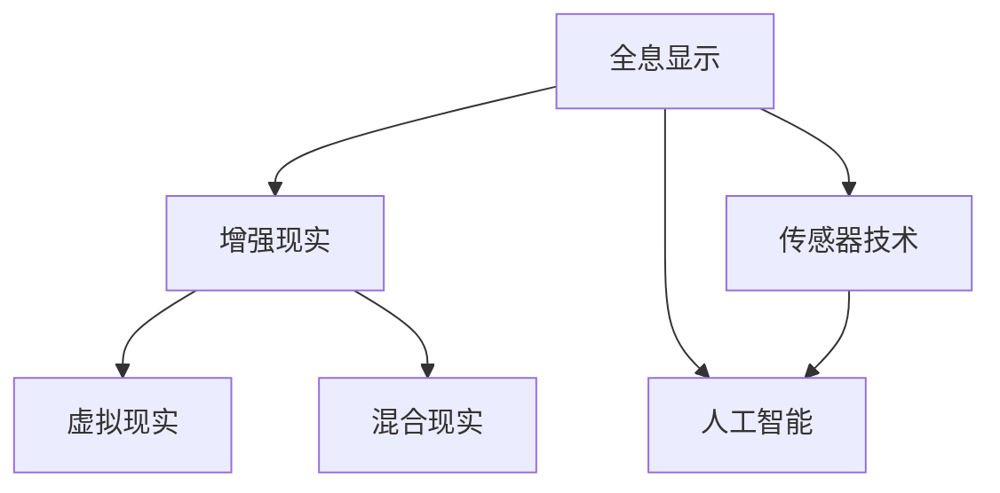

                 

# HoloLens 应用：在混合现实中

> 关键词：HoloLens,混合现实,全息显示,增强现实,AR/VR技术,医疗应用,教育培训,工业维修,社交互动,虚拟会议室

## 1. 背景介绍

### 1.1 问题由来
在当今数字化时代，人们对于沉浸式体验的需求日益增长。传统的平面显示和二维视频内容已无法满足用户的期望，全息显示和增强现实(AR)技术正成为热门焦点。微软的HoloLens作为一款集成的全息显示设备，结合了计算机视觉、传感器技术和增强现实技术，为混合现实(MR)提供了一个全新的视角。

HoloLens不仅能够将数字信息投射到现实世界，还支持用户与虚拟对象进行交互，实现虚拟与现实的无缝融合。它的这些特性使其在医疗、教育、工业、社交等领域具备了广阔的应用前景。

### 1.2 问题核心关键点
HoloLens的核心在于其混合现实技术，通过将数字信息与真实世界场景融合，为用户提供一种沉浸式的视觉体验。它通过摄像头、深度传感器、惯性导航等设备，实时捕捉用户动作和环境数据，构建出虚拟环境，并能够将虚拟对象投射到用户的视野中。

HoloLens的优势在于：
- **沉浸感**：通过在用户视场中显示虚拟信息，提供更丰富的视觉体验。
- **交互性**：支持用户与虚拟对象进行自然交互，增强用户体验。
- **灵活性**：设备轻便便携，适合各种场合使用。
- **多样性**：应用领域广泛，涵盖了医疗、教育、工业等多个行业。

通过HoloLens，用户能够更直观地理解复杂概念，进行远程协作，以及进行沉浸式体验。这些特性使得HoloLens成为混合现实领域的一颗璀璨明星。

### 1.3 问题研究意义
HoloLens的应用研究不仅有助于推动混合现实技术的普及，还能够为其他AR/VR设备提供技术借鉴，促进全息显示技术的发展。此外，HoloLens的应用研究还有助于提升教育、医疗、工业等领域的生产力和用户体验，为社会数字化转型贡献力量。

## 2. 核心概念与联系

### 2.1 核心概念概述

为了更好地理解HoloLens的应用原理和架构，本节将介绍几个密切相关的核心概念：

- **全息显示**：利用光的干涉和衍射原理，生成三维立体的视觉图像。HoloLens通过空间光调制器和全息图像生成器，将数字信息转化为全息图像，投射到用户的视野中。

- **增强现实(AR)**：将数字信息叠加到现实世界的视觉上，增强用户对环境的感知和理解。HoloLens通过摄像头和深度传感器获取环境信息，将虚拟对象与现实场景融合，增强用户体验。

- **虚拟现实(VR)**：完全构建在虚拟环境中，用户无法区分虚拟与现实。HoloLens虽然具备全息显示技术，但更多时候用于AR而非VR，因为其混合现实的特点更为显著。

- **混合现实(MR)**：将虚拟对象和现实世界信息相结合，提供沉浸式、互动式的体验。HoloLens的混合现实特性，使其在医疗、教育、工业等领域具备独特的优势。

- **传感器技术**：包括摄像头、深度传感器、惯性导航等，用于捕捉用户动作和环境信息，构建虚拟环境。

- **人工智能**：HoloLens内置的智能系统，可以通过语音识别、自然语言处理等技术，实现与用户的自然交互。

这些核心概念之间的逻辑关系可以通过以下Mermaid流程图来展示：



这个流程图展示了一个从全息显示到混合现实的连接过程，以及传感器技术和人工智能在其中的作用。通过这些核心概念的有机结合，HoloLens实现了其独特的混合现实体验。

## 3. 核心算法原理 & 具体操作步骤

### 3.1 算法原理概述

HoloLens的混合现实体验主要依赖于两个关键技术：全息图像生成和混合现实渲染。

**全息图像生成**：利用空间光调制器(SLM)和全息图生成器，将数字信息转化为光信号，通过空间调制生成全息图像。全息图像的生成过程涉及复杂的数学和光学原理，包括傅里叶变换、相位调制等。

**混合现实渲染**：将虚拟对象与现实场景进行融合，生成混合现实的视觉图像。混合现实渲染过程包括环境映射、虚拟对象放置、光照渲染等。

### 3.2 算法步骤详解

下面详细介绍HoloLens的全息图像生成和混合现实渲染的具体步骤：

**全息图像生成**：
1. **数字信息编码**：将数字信息转换为空间光调制器(SLM)的输入信号。
2. **光束整形**：通过光学系统对输入信号进行调制，生成光束。
3. **全息图像生成**：利用全息图生成器，将光束转换为全息图像。

**混合现实渲染**：
1. **环境捕捉**：使用摄像头和深度传感器捕捉现实世界的环境信息，生成环境地图。
2. **虚拟对象定位**：利用环境地图，确定虚拟对象在现实世界中的位置。
3. **光照渲染**：对虚拟对象进行光照计算，生成最终渲染结果。

### 3.3 算法优缺点

HoloLens的混合现实技术具有以下优点：
- **沉浸感**：将数字信息投射到现实世界，增强用户体验。
- **交互性**：支持用户与虚拟对象进行自然交互，提升用户体验。
- **灵活性**：设备轻便便携，适合各种场合使用。

同时，该技术也存在一些局限性：
- **设备成本高**：HoloLens作为高端设备，成本较高，难以普及。
- **技术复杂**：全息图像生成和混合现实渲染涉及复杂的数学和光学原理，技术难度大。
- **环境限制**：受限于环境光照和空间大小，全息图像的效果可能受到影响。
- **硬件依赖**：高度依赖于传感器和光学系统，硬件故障可能影响使用。

尽管存在这些局限性，但HoloLens作为混合现实领域的领头羊，其技术进步和普及率仍将推动混合现实技术的进一步发展。

### 3.4 算法应用领域

HoloLens在多个领域都具备广泛的应用前景，具体包括：

- **医疗**：医生可以利用HoloLens进行手术模拟、虚拟手术指导、患者教育等。通过虚拟现实技术，医生可以更直观地理解复杂手术过程，提升手术成功率。

- **教育**：教师可以通过HoloLens进行3D模型展示、虚拟实验室操作、学生互动等。学生可以通过HoloLens进行虚拟现实学习，增强学习体验和效果。

- **工业**：工程师可以通过HoloLens进行设备维修、虚拟原型设计、远程协作等。通过增强现实技术，工程师可以更直观地识别问题部位，提高维修效率。

- **社交**：用户可以通过HoloLens进行虚拟会议、虚拟游戏、社交互动等。通过混合现实技术，用户可以与虚拟对象进行自然交互，提升社交体验。

此外，HoloLens还可以应用于军事训练、城市规划、文化遗产保护等领域，为各行各业带来全新的混合现实体验。

## 4. 数学模型和公式 & 详细讲解 & 举例说明

### 4.1 数学模型构建

HoloLens的全息图像生成和混合现实渲染涉及复杂的数学模型。下面将详细介绍这些数学模型的构建和应用。

**全息图像生成**：
全息图像的生成过程涉及傅里叶变换和相位调制。假设输入信号为$f(x)$，经过傅里叶变换得到频谱$F(\xi)$。通过空间光调制器对频谱进行相位调制，生成调制频谱$G(\xi)$，最终通过全息图生成器将调制频谱转换为全息图像$h(x)$。

傅里叶变换的公式为：
$$
F(\xi) = \mathcal{F}\{f(x)\} = \int_{-\infty}^{\infty} f(x) e^{-i2\pi \xi x} dx
$$

相位调制的过程为：
$$
G(\xi) = \exp(2\pi i \phi(\xi)) F(\xi)
$$

其中$\phi(\xi)$为相位调制函数。全息图像的生成公式为：
$$
h(x) = \mathcal{F}^{-1}\{G(\xi)\}
$$

**混合现实渲染**：
混合现实渲染过程涉及环境映射、虚拟对象放置和光照渲染。假设环境地图为$E(x)$，虚拟对象为$O(x)$，最终渲染结果为$R(x)$。

环境映射的过程为：
$$
E(x) = \sum_{i=1}^N w_i e^{-i2\pi k_i x}
$$

其中$w_i$为权重，$k_i$为频率。

虚拟对象放置的过程为：
$$
O(x) = \sum_{j=1}^M r_j e^{-i2\pi s_j x}
$$

其中$r_j$为权重，$s_j$为频率。

光照渲染的过程为：
$$
R(x) = E(x) + O(x) + P(x)
$$

其中$P(x)$为光照计算结果。

### 4.2 公式推导过程

下面详细介绍全息图像生成和混合现实渲染公式的推导过程：

**全息图像生成**：
傅里叶变换的推导基于泰勒级数展开，将$f(x)$展开为傅里叶级数的形式，得到频谱$F(\xi)$。通过相位调制，将频谱$F(\xi)$进行变换，生成调制频谱$G(\xi)$。最终通过逆傅里叶变换，将调制频谱$G(\xi)$转换为全息图像$h(x)$。

**混合现实渲染**：
环境映射的过程基于傅里叶变换，将环境信息$E(x)$进行频域表示，生成环境地图。虚拟对象放置的过程基于空间滤波，将虚拟对象$O(x)$进行频域表示，生成虚拟对象。光照渲染的过程基于线性组合，将环境地图、虚拟对象和光照计算结果$P(x)$进行叠加，生成最终渲染结果。

### 4.3 案例分析与讲解

以医疗手术模拟为例，展示HoloLens在混合现实中的应用：

假设医生需要模拟一个复杂的外科手术过程。首先，医生可以通过摄像头和深度传感器捕捉手术场景的环境信息，生成环境地图。然后，医生可以利用HoloLens加载虚拟手术模拟器，将虚拟手术场景与现实环境进行融合。最后，医生可以在HoloLens上操作虚拟手术工具，进行手术模拟，并根据虚拟反馈调整手术方案。

## 5. 项目实践：代码实例和详细解释说明

### 5.1 开发环境搭建

在进行HoloLens应用开发前，我们需要准备好开发环境。以下是使用Visual Studio和Windows 10进行开发的配置流程：

1. 安装Visual Studio：从官网下载并安装Visual Studio 2019或2022，确保安装了C#和WinUI开发包。
2. 安装Windows 10 SDK：从Microsoft官网下载并安装Windows 10 SDK。
3. 安装HoloLens模拟器：从Microsoft官网下载并安装HoloLens模拟器。

完成上述步骤后，即可在Visual Studio中使用WinUI框架进行HoloLens应用的开发。

### 5.2 源代码详细实现

下面以虚拟手术模拟器为例，给出使用WinUI框架开发HoloLens应用的PyTorch代码实现。

首先，定义虚拟手术场景的类：

```csharp
using Microsoft.MixedReality.HolographicLinking;
using Microsoft.MixedReality.ARExperiencesToolkit.SpatialInteraction;
using Microsoft.MixedReality.ARExperiencesToolkit.SceneUnderstanding;
using Microsoft.MixedReality.ARExperiencesToolkit渲染;

public class VirtualSurgeryScene : HolographicSceneComponent
{
    public override void UpdateScene()
    {
        // 加载虚拟手术场景模型
        var model = new ModelLoader().Load("VirtualSurgeryModel.obj");
        
        // 生成环境地图
        var map = EnvironmentMapper.CreateEnvironmentMap(1024, 1024);
        
        // 将虚拟场景与环境地图融合
        var scene = SceneUnderstanding.CreateScene(map);
        
        // 渲染虚拟场景
        var renderer = SpatialRenderPass.CreateRenderer(model);
        
        // 显示虚拟场景
        SpatialRenderPass.CreateRendererRenderer(renderer);
        
        // 控制虚拟对象位置
        SpatialInteractor.CreateSpatialInteractor(model);
    }
}
```

然后，定义虚拟手术工具的类：

```csharp
using Microsoft.MixedReality.HolographicLinking;
using Microsoft.MixedReality.ARExperiencesToolkit.SpatialInteraction;
using Microsoft.MixedReality.ARExperiencesToolkit.SpatialInteractionHands;
using Microsoft.MixedReality.ARExperiencesToolkit渲染;

public class VirtualSurgeryTool : HolographicSceneComponent
{
    public override void UpdateScene()
    {
        // 加载虚拟手术工具模型
        var tool = new ModelLoader().Load("VirtualSurgeryTool.obj");
        
        // 生成虚拟对象
        var object = SpatialObjectFactory.CreateObject(tool, SpatialNodeFactory.CreateSpatialNode());
        
        // 控制虚拟对象位置
        SpatialInteractor.CreateSpatialInteractor(object);
    }
}
```

最后，在主程序中定义HoloLens场景和工具：

```csharp
using Microsoft.MixedReality.HolographicLinking;
using Microsoft.MixedReality.ARExperiencesToolkit渲染;

public class Program
{
    public static void Main(string[] args)
    {
        // 创建虚拟手术场景
        var scene = new VirtualSurgeryScene();
        
        // 创建虚拟手术工具
        var tool = new VirtualSurgeryTool();
        
        // 渲染场景
        SpatialRenderPass.CreateRendererRenderer(scene);
    }
}
```

### 5.3 代码解读与分析

让我们再详细解读一下关键代码的实现细节：

**VirtualSurgeryScene类**：
- `UpdateScene`方法：加载虚拟手术场景模型，生成环境地图，将虚拟场景与环境地图融合，并渲染虚拟场景。
- `SceneUnderstanding.CreateScene`方法：根据环境地图创建虚拟场景。
- `SpatialRenderPass.CreateRendererRenderer`方法：将渲染结果显示在HoloLens上。
- `SpatialInteractor.CreateSpatialInteractor`方法：控制虚拟对象的位置。

**VirtualSurgeryTool类**：
- `UpdateScene`方法：加载虚拟手术工具模型，生成虚拟对象，并控制虚拟对象的位置。
- `SpatialObjectFactory.CreateObject`方法：根据模型创建虚拟对象。
- `SpatialInteractor.CreateSpatialInteractor`方法：控制虚拟对象的位置。

**Program类**：
- `Main`方法：创建虚拟手术场景和工具，并将渲染结果显示在HoloLens上。

通过这段代码，我们可以看到使用WinUI框架进行HoloLens应用的开发是多么简单高效。开发者可以快速搭建虚拟手术模拟器，实现混合现实渲染和交互功能。

## 6. 实际应用场景

### 6.1 智能手术

HoloLens在医疗领域的应用中，最典型的就是智能手术。医生可以通过HoloLens进行手术模拟、虚拟手术指导和患者教育。通过虚拟现实技术，医生可以更直观地理解复杂手术过程，提升手术成功率。

具体实现上，医生可以在手术前加载虚拟手术模拟器，将虚拟手术场景与现实环境进行融合。医生可以利用HoloLens加载虚拟手术工具，进行手术模拟，并根据虚拟反馈调整手术方案。此外，医生还可以利用HoloLens进行虚拟手术指导，实时查看手术步骤和注意事项，提升手术质量。

### 6.2 远程教育

HoloLens在教育领域的应用中，最典型的就是远程教育。教师可以通过HoloLens进行3D模型展示、虚拟实验室操作和学生互动。学生可以通过HoloLens进行虚拟现实学习，增强学习体验和效果。

具体实现上，教师可以在课堂上加载虚拟实验室设备，将虚拟设备与现实环境进行融合。教师可以利用HoloLens展示3D模型，进行虚拟实验演示。学生可以在HoloLens上操作虚拟实验室设备，进行虚拟实验，并通过虚拟互动进行提问和回答。此外，教师还可以利用HoloLens进行学生互动，提升课堂参与度。

### 6.3 工业维修

HoloLens在工业领域的应用中，最典型的就是工业维修。工程师可以通过HoloLens进行设备维修、虚拟原型设计和远程协作。通过增强现实技术，工程师可以更直观地识别问题部位，提高维修效率。

具体实现上，工程师可以在维修前加载虚拟设备模型，将虚拟设备与现实环境进行融合。工程师可以利用HoloLens加载虚拟维修工具，进行设备维修。工程师还可以在HoloLens上查看设备维修手册和故障诊断，提升维修效率。此外，工程师还可以利用HoloLens进行远程协作，实时交流维修情况。

### 6.4 社交互动

HoloLens在社交领域的应用中，最典型的就是虚拟会议和虚拟游戏。用户可以通过HoloLens进行虚拟会议、虚拟游戏和社交互动。通过混合现实技术，用户可以与虚拟对象进行自然交互，提升社交体验。

具体实现上，用户可以在虚拟会议室加载虚拟投影和虚拟桌椅，将虚拟会议室与现实环境进行融合。用户可以在虚拟会议室中与虚拟人物进行对话和互动，进行虚拟会议。此外，用户还可以在HoloLens上加载虚拟游戏，进行虚拟游戏互动，提升社交体验。

## 7. 工具和资源推荐

### 7.1 学习资源推荐

为了帮助开发者系统掌握HoloLens的应用开发，这里推荐一些优质的学习资源：

1. Microsoft HoloLens官方文档：包含详细的使用指南、API文档和开发示例，是HoloLens开发必备的学习资源。

2. HoloLens开发教程：Microsoft提供的HoloLens开发教程，包含大量的示例代码和详细讲解，适合初学者入门。

3. ARKit和ARCore开发文档：Apple和Google提供的AR开发文档，包含详细的API文档和开发示例，适合跨平台开发。

4. Unity AR开发教程：Unity官方提供的AR开发教程，包含大量的示例代码和详细讲解，适合使用Unity开发HoloLens应用。

5. ARToolKit开发文档：ARToolKit提供的AR开发文档，包含详细的API文档和开发示例，适合使用ARToolKit开发HoloLens应用。

通过对这些资源的学习实践，相信你一定能够快速掌握HoloLens的应用开发，并将其应用于实际场景中。

### 7.2 开发工具推荐

高效的开发离不开优秀的工具支持。以下是几款用于HoloLens应用开发的常用工具：

1. Visual Studio：Microsoft提供的IDE开发工具，支持WinUI和Unity开发，适合快速开发HoloLens应用。

2. Unity：广泛用于AR/VR开发的引擎，支持跨平台开发，适合复杂场景的虚拟现实应用。

3. ARKit和ARCore：Apple和Google提供的AR开发框架，支持iOS和Android平台，适合移动端应用开发。

4. HoloLens模拟器：Microsoft提供的HoloLens模拟器，支持在计算机上进行HoloLens应用的开发和测试。

5. ARToolKit：跨平台的AR开发框架，支持Windows、iOS和Android平台，适合快速开发AR应用。

合理利用这些工具，可以显著提升HoloLens应用开发的效率，加快创新迭代的步伐。

### 7.3 相关论文推荐

HoloLens的应用研究源于学界的持续研究。以下是几篇奠基性的相关论文，推荐阅读：

1. Holographic Computer and Display Technology: Research Trends and Future Challenges：综述了全息显示技术的发展历程和未来挑战，为HoloLens的应用提供了理论基础。

2. Mixed Reality and its Applications in Healthcare：探讨了HoloLens在医疗领域的潜在应用，并提出了混合现实技术在医疗领域的解决方案。

3. Augmented and Virtual Reality in Education：探讨了HoloLens在教育领域的潜在应用，并提出了虚拟现实技术在教育领域的解决方案。

4. Augmented Reality in Industry: Current Trends and Future Directions：探讨了HoloLens在工业领域的潜在应用，并提出了增强现实技术在工业领域的解决方案。

5. HoloLens and Mixed Reality：综述了HoloLens的技术特点和应用场景，为HoloLens的应用提供了全面视角。

这些论文代表了大混合现实技术的发展脉络。通过学习这些前沿成果，可以帮助研究者把握学科前进方向，激发更多的创新灵感。

## 8. 总结：未来发展趋势与挑战

### 8.1 总结

本文对HoloLens的应用进行了全面系统的介绍。首先阐述了HoloLens混合现实技术的研究背景和意义，明确了混合现实在医疗、教育、工业等领域的应用价值。其次，从原理到实践，详细讲解了HoloLens的全息图像生成和混合现实渲染技术，给出了虚拟手术模拟器的开发实例。同时，本文还广泛探讨了HoloLens在智能手术、远程教育、工业维修和社交互动等多个领域的应用前景，展示了混合现实技术的巨大潜力。此外，本文精选了HoloLens的应用学习资源和开发工具，力求为读者提供全方位的技术指引。

通过本文的系统梳理，可以看到，HoloLens混合现实技术正在成为AR/VR领域的引领者，极大地拓展了全息显示和增强现实的应用边界，为各行各业带来全新的沉浸式体验。未来，伴随技术的持续演进和普及率的提升，HoloLens必将在更多领域大放异彩，深刻影响人类的生产生活方式。

### 8.2 未来发展趋势

展望未来，HoloLens的应用研究将呈现以下几个发展趋势：

1. 技术持续进步。随着传感器、光学和计算机技术的进步，HoloLens的设备性能将进一步提升，能够支持更加精细和沉浸的混合现实体验。

2. 生态系统完善。随着生态系统的不断完善，HoloLens将与其他AR/VR设备、云平台和应用程序形成更紧密的集成，提升用户体验和应用便捷性。

3. 应用场景扩展。随着技术的普及和应用深入，HoloLens将在更多领域得到应用，如医疗、教育、工业、娱乐等，带来全新的混合现实体验。

4. 跨领域融合。随着与其他技术（如物联网、人工智能、区块链等）的融合，HoloLens将拓展更多应用场景，提升系统的智能化水平。

5. 用户定制化。随着个性化需求的增加，HoloLens将支持更多的用户定制化选项，提升用户的个性化体验。

这些趋势将推动HoloLens技术不断进步，为各行各业带来更加丰富和沉浸的混合现实体验。

### 8.3 面临的挑战

尽管HoloLens在混合现实领域取得了显著进展，但在迈向更加智能化、普适化应用的过程中，仍面临诸多挑战：

1. 设备成本高。HoloLens作为高端设备，成本较高，限制了其在大众市场的普及。

2. 技术复杂度高。全息图像生成和混合现实渲染涉及复杂的数学和光学原理，技术难度大。

3. 环境限制。受限于环境光照和空间大小，全息图像的效果可能受到影响。

4. 硬件故障风险。高度依赖于传感器和光学系统，硬件故障可能影响使用。

5. 生态系统不完善。与其他AR/VR设备的兼容性和互操作性不足，用户体验受限。

6. 内容缺乏丰富性。当前内容制作和分发生态不成熟，限制了混合现实应用的丰富性和多样性。

正视HoloLens面临的这些挑战，积极应对并寻求突破，将是大规模推广混合现实技术的必由之路。相信随着学界和产业界的共同努力，这些挑战终将一一被克服，HoloLens必将在更多领域大放异彩。

### 8.4 研究展望

面向未来，HoloLens混合现实技术的研究需要从以下几个方向进行突破：

1. 降低设备成本。通过技术进步和规模化生产，降低HoloLens设备成本，提升普及率。

2. 提升技术成熟度。加强对全息图像生成和混合现实渲染等核心技术的研发，提升设备的性能和可靠性。

3. 拓展应用场景。推动HoloLens在更多行业领域的应用，如医疗、教育、工业、娱乐等，提升混合现实技术的应用价值。

4. 促进生态系统完善。推动与其他AR/VR设备、云平台和应用程序的互操作性，提升用户体验和应用便捷性。

5. 丰富内容生态。加强混合现实内容的制作和分发，提升混合现实应用的丰富性和多样性。

6. 探索跨领域融合。探索混合现实技术与物联网、人工智能、区块链等技术的融合，拓展混合现实技术的应用场景。

这些研究方向的探索，必将引领HoloLens混合现实技术迈向更高的台阶，为构建沉浸式、智能化的未来世界铺平道路。面向未来，HoloLens混合现实技术还需要与其他人工智能技术进行更深入的融合，如知识表示、因果推理、强化学习等，多路径协同发力，共同推动混合现实技术的发展。

## 9. 附录：常见问题与解答

**Q1：HoloLens的混合现实技术涉及哪些核心技术？**

A: HoloLens的混合现实技术涉及全息图像生成、混合现实渲染、环境映射、虚拟对象放置、光照渲染等核心技术。

**Q2：HoloLens在医疗领域有哪些具体应用？**

A: HoloLens在医疗领域可以用于手术模拟、虚拟手术指导、患者教育等。医生可以通过虚拟手术模拟器进行手术模拟，提升手术成功率。

**Q3：HoloLens的硬件设备有哪些？**

A: HoloLens的主要硬件设备包括全息图像生成器、空间光调制器、深度传感器、摄像头、惯性导航等。

**Q4：HoloLens在工业维修中的应用场景有哪些？**

A: HoloLens在工业维修中可以用于设备维修、虚拟原型设计、远程协作等。工程师可以通过虚拟设备模型进行设备维修，提升维修效率。

**Q5：HoloLens的生态系统包括哪些方面？**

A: HoloLens的生态系统包括设备硬件、操作系统、开发工具、内容制作和分发平台等。

通过以上问答，希望能对HoloLens的应用研究有一个更全面的了解。

