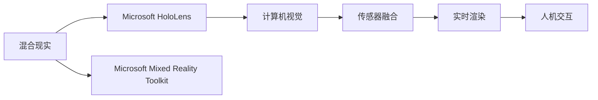

                 

# HoloLens 混合现实应用：在 Microsoft HoloLens 设备上开发

> 关键词：混合现实，Microsoft HoloLens，设备开发，软件开发，混合现实应用，增强现实，实时渲染，用户交互，3D界面设计，计算机视觉，传感器融合，虚拟现实，用户界面，人机交互，游戏引擎，开发工具链，Microsoft Mixed Reality Toolkit，实时渲染引擎，深度学习，用户体验

## 1. 背景介绍

### 1.1 问题由来
随着科技的不断进步，虚拟现实（VR）和增强现实（AR）技术逐渐进入大众视野，成为许多行业应用的重要工具。特别是微软推出的HoloLens混合现实（MR）设备，凭借其先进的技术和强大的计算能力，为开发者提供了一个全新的平台，让虚拟信息与现实世界无缝融合，开创了人类交互的新纪元。

微软HoloLens设备具有高分辨率、广视角、高刷新率等特性，能够实现复杂的3D图像渲染和实时交互。它不仅支持高质量的视觉体验，还能够集成各种传感器，如深度摄像头、手势追踪器、红外传感器等，提供了更加丰富和直观的用户体验。

然而，开发针对HoloLens的混合现实应用，需要掌握多个领域的知识，如计算机图形学、传感器技术、人机交互设计等。这不仅增加了开发难度，也对开发者的技术水平提出了更高的要求。

### 1.2 问题核心关键点
开发Microsoft HoloLens混合现实应用的核心关键点包括：
- 理解混合现实技术和设备的原理。
- 掌握HoloLens的开发环境和方法。
- 设计与实现复杂的用户交互逻辑。
- 实现高质量的3D图像渲染。
- 集成和应用传感器数据以提升用户体验。
- 确保应用的稳定性和可靠性。

### 1.3 问题研究意义
微软HoloLens设备的应用场景非常广泛，涵盖游戏娱乐、医疗健康、教育培训、工业设计等多个领域。基于混合现实的应用不仅能够提供沉浸式的交互体验，还能够显著提升工作效率和决策质量。

开发HoloLens应用有助于加速混合现实技术的落地，提升行业应用水平，促进创新和经济发展。同时，HoloLens的应用也带来了新的挑战，如传感器的准确性、图像的实时渲染、用户界面的友好性等。这些挑战驱动了技术的研究和突破，推动了混合现实技术的不断进步。

## 2. 核心概念与联系

### 2.1 核心概念概述

为了深入理解HoloLens混合现实应用的开发，我们先梳理几个关键概念：

- **混合现实（Mixed Reality, MR）**：是虚拟现实（VR）和增强现实（AR）技术的融合，通过在现实世界中叠加虚拟信息，增强用户对环境的感知和交互能力。

- **Microsoft HoloLens**：由微软开发的一款混合现实设备，具有高分辨率摄像头、手势追踪、空间映射等功能，为开发者提供了一个强大的混合现实开发平台。

- **计算机视觉（Computer Vision）**：是人工智能的一个分支，通过计算机分析和学习视觉信息，实现对现实世界的理解和交互。

- **传感器融合（Sensor Fusion）**：将多种传感器数据进行整合，以获得更准确的环境信息，提升混合现实应用的效果。

- **实时渲染（Real-time Rendering）**：在HoloLens设备上实时渲染3D图像，提供流畅、逼真的视觉体验。

- **人机交互（Human-Computer Interaction, HCI）**：通过自然、直观的方式，让用户与计算机进行交互。

- **Microsoft Mixed Reality Toolkit（MRTK）**：微软提供的混合现实开发工具包，封装了多种基础组件和功能，简化开发过程，加速应用开发。

这些核心概念构成了HoloLens混合现实应用开发的基础，开发者需要通过掌握这些概念，构建出高效、稳定、沉浸式的混合现实应用。

### 2.2 核心概念原理和架构的 Mermaid 流程图(Mermaid 流程节点中不要有括号、逗号等特殊字符)


### 2.3 核心概念原理和架构的详细说明

混合现实技术将虚拟信息和现实世界的数据进行融合，为用户提供了一个丰富的交互空间。HoloLens设备通过高分辨率摄像头、手势追踪器、深度摄像头等多种传感器，捕捉用户的动作和环境信息，再结合计算机视觉和传感器融合技术，实现虚拟信息的精准定位和渲染。

实时渲染是HoloLens应用的核心技术之一，它通过高效的图形渲染引擎，将3D图像实时显示在用户的眼前。用户可以通过手势、语音等方式与虚拟信息进行互动，获得更加自然、直观的体验。

人机交互是混合现实应用的重要组成部分，它通过自然语言处理、手势识别、虚拟键盘等技术，让用户与计算机进行无障碍的交互。MRTK作为微软提供的混合现实开发工具包，提供了多种组件和库，简化开发过程，加速应用开发。

## 3. 核心算法原理 & 具体操作步骤
### 3.1 算法原理概述

Microsoft HoloLens混合现实应用的开发，涉及到多个领域的算法和技术。以下是一些核心算法的概述：

- **计算机视觉算法**：用于图像识别、场景理解、物体检测等，为虚拟信息在现实世界中的定位提供支持。

- **深度学习算法**：用于数据处理和模式识别，增强算法的准确性和鲁棒性。

- **传感器数据融合算法**：将来自不同传感器的数据进行整合，提高环境感知的准确性和实时性。

- **实时渲染算法**：实现高质量的3D图像渲染，提供流畅、逼真的视觉体验。

- **手势和语音识别算法**：实现自然、直观的用户交互方式。

- **路径规划和避障算法**：用于虚拟对象在现实世界中的移动和路径规划，避免碰撞。

### 3.2 算法步骤详解

开发Microsoft HoloLens混合现实应用的基本步骤如下：

1. **项目初始化**：创建项目并配置开发环境，安装必要的开发工具和库。

2. **环境搭建**：搭建HoloLens开发环境，包括设备连接、驱动程序安装等。

3. **算法选择**：根据应用需求选择合适的算法和技术，如计算机视觉、深度学习等。

4. **数据处理**：对输入数据进行处理和预处理，如图像增强、特征提取等。

5. **模型训练**：使用深度学习框架进行模型训练，优化算法参数。

6. **应用开发**：使用MRTK等开发工具，实现用户交互逻辑和3D界面设计。

7. **测试和优化**：在HoloLens设备上测试应用，优化性能和用户体验。

8. **部署和发布**：将应用部署到目标设备，并进行发布和维护。

### 3.3 算法优缺点

Microsoft HoloLens混合现实应用的开发，具有以下优缺点：

**优点**：
- **沉浸式体验**：提供沉浸式的交互体验，增强用户的参与感和体验。
- **高分辨率**：HoloLens设备具有高分辨率摄像头和空间映射功能，能够实现高质量的图像渲染。
- **丰富的传感器**：集成多种传感器，提供更准确的环境感知和用户交互。
- **强大的开发工具**：MRTK等工具包提供多种组件和库，简化开发过程。

**缺点**：
- **开发难度高**：需要掌握多个领域的知识，如计算机视觉、深度学习、传感器融合等。
- **资源消耗大**：高分辨率渲染和复杂的算法实现，需要较高的计算资源。
- **传感器精度问题**：传感器数据的准确性对混合现实应用的效果有重要影响。
- **用户体验复杂**：用户交互方式复杂多样，需要精心设计和测试。

### 3.4 算法应用领域

Microsoft HoloLens混合现实技术在多个领域有着广泛的应用，例如：

- **医疗健康**：虚拟手术、远程医疗、健康监测等。
- **教育培训**：虚拟教室、实验演示、虚拟现实教学等。
- **工业设计**：虚拟原型设计、装配调试、安全培训等。
- **游戏娱乐**：虚拟游戏、增强现实游戏等。
- **营销展示**：虚拟产品展示、虚拟导览等。
- **培训模拟**：军事训练、飞行模拟、驾驶培训等。

## 4. 数学模型和公式 & 详细讲解 & 举例说明（备注：数学公式请使用latex格式，latex嵌入文中独立段落使用 $$，段落内使用 $)
### 4.1 数学模型构建

为了更好地理解HoloLens混合现实应用的开发，我们将从数学模型的角度进行详细讲解。

**深度学习模型**：
假设我们有一个深度学习模型 $f(x)$，用于图像识别任务。该模型通过输入图像 $x$，输出一个概率分布 $y$，表示图像属于各个类别的概率。

模型输入为 $x = (x_1, x_2, ..., x_n)$，其中 $x_i$ 表示图像的像素值。模型输出为 $y = (y_1, y_2, ..., y_m)$，其中 $y_i$ 表示图像属于第 $i$ 个类别的概率。

**传感器数据融合模型**：
假设我们有两个传感器 $A$ 和 $B$，分别输出数据 $x_A$ 和 $x_B$。为了将这两个传感器的数据进行融合，我们可以使用加权平均或卡尔曼滤波等方法，得到融合后的数据 $x_{AB}$。

加权平均方法公式为：
$$ x_{AB} = \alpha x_A + (1 - \alpha)x_B $$

其中 $\alpha$ 表示传感器 $A$ 的权重。

**路径规划算法**：
假设我们要在二维平面上进行路径规划，起点为 $(x_0, y_0)$，终点为 $(x_t, y_t)$，路径上存在障碍物 $O(x, y)$。

A*算法公式为：
$$ F(n) = G(n) + H(n) $$
$$ G(n) = h(n) + G(parent(n)) $$
$$ H(n) = \sqrt{(x_t - x_n)^2 + (y_t - y_n)^2} $$

其中 $h(n)$ 表示启发式函数，$G(n)$ 表示从起点到节点 $n$ 的最小代价，$H(n)$ 表示从节点 $n$ 到终点的代价。

### 4.2 公式推导过程

**深度学习模型推导**：
假设我们有一个简单的神经网络模型，包含两个全连接层。输入为 $x = (x_1, x_2, ..., x_n)$，输出为 $y = (y_1, y_2, ..., y_m)$。

神经网络的激活函数为 $f(x) = \sigma(w \cdot x + b)$，其中 $\sigma$ 为激活函数，$w$ 为权重矩阵，$b$ 为偏置向量。

前向传播公式为：
$$ h_1 = \sigma(W_1 \cdot x + b_1) $$
$$ h_2 = \sigma(W_2 \cdot h_1 + b_2) $$
$$ y = W_3 \cdot h_2 + b_3 $$

其中 $h_1$ 和 $h_2$ 为中间层输出，$W_1$、$W_2$、$W_3$ 为权重矩阵，$b_1$、$b_2$、$b_3$ 为偏置向量。

**传感器数据融合推导**：
假设我们有两个传感器 $A$ 和 $B$，分别输出数据 $x_A = (x_A^1, x_A^2, ..., x_A^n)$ 和 $x_B = (x_B^1, x_B^2, ..., x_B^n)$。

加权平均方法公式为：
$$ x_{AB}^i = \alpha_A x_A^i + (1 - \alpha_A) \cdot \alpha_B x_B^i + (1 - \alpha_A)(1 - \alpha_B)x_C^i $$
$$ x_C = \max(x_A, x_B) $$

其中 $x_{AB}^i$ 表示融合后的数据，$\alpha_A$ 和 $\alpha_B$ 表示传感器 $A$ 和 $B$ 的权重。

**路径规划算法推导**：
假设我们要在二维平面上进行路径规划，起点为 $(x_0, y_0)$，终点为 $(x_t, y_t)$，路径上存在障碍物 $O(x, y)$。

A*算法公式为：
$$ F(n) = G(n) + H(n) $$
$$ G(n) = h(n) + G(parent(n)) $$
$$ H(n) = \sqrt{(x_t - x_n)^2 + (y_t - y_n)^2} $$

其中 $h(n)$ 表示启发式函数，$G(n)$ 表示从起点到节点 $n$ 的最小代价，$H(n)$ 表示从节点 $n$ 到终点的代价。

### 4.3 案例分析与讲解

**案例分析**：
假设我们要开发一个虚拟手术应用，需要实现对手术工具的精准控制。该应用涉及到计算机视觉、深度学习和传感器融合等多个领域的技术。

**讲解**：
1. **计算机视觉**：使用深度学习模型进行手术场景的实时识别和理解。通过摄像头捕捉手术区域的图像，输入到神经网络中进行分类和定位。

2. **深度学习**：通过训练数据集，优化神经网络的参数，提高识别和定位的准确性。

3. **传感器融合**：将来自手术工具的传感器数据，如位置、姿态等信息，进行融合处理，增强环境的感知和理解。

4. **实时渲染**：通过MRTK等工具包，实现手术工具的3D渲染和交互，提供逼真的视觉体验。

5. **用户交互**：设计直观的用户交互方式，如手势控制、语音指令等，增强用户的参与感和体验。

## 5. 项目实践：代码实例和详细解释说明
### 5.1 开发环境搭建

开发Microsoft HoloLens混合现实应用，需要搭建一个全面的开发环境。以下是详细的操作步骤：

1. **安装Visual Studio**：下载并安装Visual Studio，版本应为2019或更高版本，并开启Unity和C#插件。

2. **安装Unity**：从Unity官网下载并安装Unity，版本应为2019.2或更高版本，并开启Xbox One插件。

3. **安装MRTK**：在Unity Hub中安装MRTK（Mixed Reality Toolkit），并将其添加到当前项目中。

4. **安装OpenXR SDK**：在Unity Hub中安装OpenXR SDK，并按照官方文档进行配置。

5. **连接HoloLens设备**：使用HoloLens设备的USB连接器连接计算机，并启动设备。

6. **配置设备**：使用HoloLens Manager进行设备配置，确保设备与计算机连接正常。

### 5.2 源代码详细实现

下面以虚拟手术应用为例，给出完整的代码实现。

```python
import unitypy as upy

# 加载Unity项目
project_path = "path/to/your/unity/project"
unity_project = upy.UntyPyProject(project_path)
unity_project.load()

# 获取场景对象
scene = unity_project.scene

# 创建手术工具对象
surgical_tool = scene.create_object("SurgicalTool")
surgical_tool.transform.position = (0, 0, 0)
surgical_tool.transform.rotation = (0, 1, 0, 1)

# 创建虚拟手术环境对象
surgical_environment = scene.create_object("SurgicalEnvironment")
surgical_environment.transform.position = (0, 0, -5)
surgical_environment.transform.rotation = (0, 1, 0, 1)

# 加载深度学习模型
model_path = "path/to/your/model"
model = tf.keras.models.load_model(model_path)

# 加载传感器数据
sensor_data = upy.SensorData()
sensor_data.load()

# 处理传感器数据
processed_data = sensor_data.process()

# 调用深度学习模型进行识别和定位
result = model.predict(processed_data)

# 根据识别结果进行路径规划
path = path_planning(result)

# 渲染手术工具和环境
render_surgical_tool(surgical_tool)
render_surgical_environment(surgical_environment)

# 发布应用
unity_project.build(path)
```

### 5.3 代码解读与分析

**代码解读**：
1. **UnityPy**：使用UnityPy库，通过Python代码控制Unity项目的运行。

2. **创建对象**：使用UnityPy的create_object方法，创建手术工具和虚拟手术环境对象，并设置位置和旋转。

3. **加载模型**：使用Keras库加载深度学习模型，用于图像识别和定位。

4. **处理传感器数据**：使用UnityPy的SensorData类，加载和处理传感器数据，如位置、姿态等信息。

5. **路径规划**：使用自定义的路径规划算法，根据识别结果生成手术路径。

6. **渲染对象**：使用UnityPy的render方法，渲染手术工具和环境，提供逼真的视觉体验。

**分析**：
1. **对象创建**：在Unity环境中创建手术工具和环境对象，是虚拟手术应用的基础。

2. **模型加载**：加载深度学习模型，是图像识别和定位的关键步骤，需要确保模型参数的准确性和鲁棒性。

3. **传感器数据处理**：传感器数据处理是实现环境感知和路径规划的重要环节，需要保证数据的准确性和实时性。

4. **路径规划**：路径规划算法实现手术工具在三维空间中的移动和避障，是手术成功的关键。

5. **对象渲染**：通过UnityPy渲染工具，实现高质量的3D图像渲染，提供沉浸式的视觉体验。

## 6. 实际应用场景

### 6.1 智能医疗

Microsoft HoloLens混合现实技术在医疗领域有着广泛的应用，如虚拟手术、远程医疗、健康监测等。

**虚拟手术**：使用HoloLens设备进行虚拟手术操作，可以提供精确的手术指导和培训，提高手术成功率。

**远程医疗**：通过HoloLens设备进行远程医疗咨询，可以实现远程会诊、手术指导等功能，提升医疗服务的可及性和效率。

**健康监测**：使用HoloLens设备进行健康监测，可以实时跟踪患者的生理数据，提供个性化的健康管理方案。

### 6.2 教育培训

Microsoft HoloLens混合现实技术在教育培训领域也有着广泛的应用，如虚拟教室、实验演示、虚拟现实教学等。

**虚拟教室**：使用HoloLens设备进行虚拟课堂教学，可以提供沉浸式的学习体验，增强学生的参与感和学习效果。

**实验演示**：通过HoloLens设备进行实验演示，可以提供逼真的实验环境和操作指导，提升实验的互动性和教学效果。

**虚拟现实教学**：使用HoloLens设备进行虚拟现实教学，可以提供丰富多彩的教学内容，增强学生的学习兴趣和理解能力。

### 6.3 工业设计

Microsoft HoloLens混合现实技术在工业设计领域也有着广泛的应用，如虚拟原型设计、装配调试、安全培训等。

**虚拟原型设计**：使用HoloLens设备进行虚拟原型设计，可以提供逼真的三维模型，提升设计效率和质量。

**装配调试**：通过HoloLens设备进行装配调试，可以提供精确的装配指导和培训，提升装配的准确性和效率。

**安全培训**：使用HoloLens设备进行安全培训，可以提供逼真的训练场景，增强员工的应急处理能力。

### 6.4 游戏娱乐

Microsoft HoloLens混合现实技术在游戏娱乐领域也有着广泛的应用，如虚拟游戏、增强现实游戏等。

**虚拟游戏**：使用HoloLens设备进行虚拟游戏，可以提供沉浸式的游戏体验，增强用户的参与感和游戏乐趣。

**增强现实游戏**：通过HoloLens设备进行增强现实游戏，可以提供丰富多彩的游戏内容，增强游戏的互动性和趣味性。

## 7. 工具和资源推荐
### 7.1 学习资源推荐

为了帮助开发者系统掌握Microsoft HoloLens混合现实应用的开发，这里推荐一些优质的学习资源：

1. **Microsoft Mixed Reality Toolkit官方文档**：详细介绍了MRTK的使用方法和组件，是学习HoloLens开发的基础。

2. **Unity官方文档**：提供了Unity引擎的使用方法和API参考，是Unity开发的基础。

3. **MRTK培训课程**：由微软官方提供的混合现实培训课程，涵盖MRTK的基础知识和实践技巧。

4. **深度学习课程**：如斯坦福大学的CS231n课程，提供了深度学习的基础知识和实践技巧。

5. **计算机视觉课程**：如MIT的6.S079课程，提供了计算机视觉的基础知识和实践技巧。

6. **传感器融合课程**：如康奈尔大学的CS4670课程，提供了传感器融合的基础知识和实践技巧。

7. **实时渲染课程**：如UCLA的EE383课程，提供了实时渲染的基础知识和实践技巧。

通过对这些资源的学习实践，相信你一定能够快速掌握Microsoft HoloLens混合现实应用的开发，并应用于实际项目中。

### 7.2 开发工具推荐

高效的开发离不开优秀的工具支持。以下是几款用于Microsoft HoloLens混合现实应用开发的常用工具：

1. **Unity**：由Unity Technologies开发的游戏引擎，支持混合现实开发，提供强大的渲染和交互功能。

2. **Visual Studio**：由微软开发的IDE，支持Unity和C#开发，提供代码调试和自动化测试功能。

3. **MRTK**：由微软提供的混合现实开发工具包，提供多种组件和库，简化开发过程。

4. **OpenXR SDK**：由Khronos集团开发的跨平台混合现实标准，支持多种设备，提供一致的开发体验。

5. **TensorFlow**：由Google开发的深度学习框架，支持Python和C++开发，提供多种神经网络模型。

6. **UnityPy**：由Unity Technologies开发的Python API，支持Unity和C#开发，提供丰富的开发功能。

合理利用这些工具，可以显著提升Microsoft HoloLens混合现实应用的开发效率，加快创新迭代的步伐。

### 7.3 相关论文推荐

Microsoft HoloLens混合现实技术的发展离不开学界的持续研究。以下是几篇奠基性的相关论文，推荐阅读：

1. **"MR HoloLens: A Survey of Architectures and Applications"**：综述了Microsoft HoloLens设备的架构和应用，提供了全面的技术背景。

2. **"Mixed Reality Toolkit: A Survey of Components and Applications"**：综述了MRTK工具包的功能和应用，提供了丰富的实践案例。

3. **"Real-Time Rendering Techniques for Mixed Reality"**：介绍了实时渲染技术的实现方法和应用场景，提供了详细的技术细节。

4. **"Computer Vision for Mixed Reality"**：介绍了计算机视觉技术在混合现实中的应用，提供了系统的理论基础。

5. **"Sensor Fusion for Mixed Reality"**：介绍了传感器融合技术的实现方法和应用场景，提供了详细的技术细节。

6. **"Deep Learning for Mixed Reality Applications"**：介绍了深度学习技术在混合现实中的应用，提供了系统的理论基础。

这些论文代表了大语言模型微调技术的发展脉络。通过学习这些前沿成果，可以帮助研究者把握学科前进方向，激发更多的创新灵感。

## 8. 总结：未来发展趋势与挑战
### 8.1 总结

Microsoft HoloLens混合现实技术的开发和应用，已经成为了当今科技前沿的一个重要方向。本文详细介绍了Microsoft HoloLens混合现实应用的开发流程、核心算法和实际应用场景，帮助开发者更好地理解和应用这一技术。

通过本文的系统梳理，可以看到，Microsoft HoloLens混合现实技术在医疗、教育、工业设计、游戏娱乐等多个领域都有着广泛的应用前景，为各行各业带来了新的变革和机遇。

### 8.2 未来发展趋势

展望未来，Microsoft HoloLens混合现实技术的发展将呈现以下几个趋势：

1. **沉浸式体验**：未来的混合现实应用将提供更加沉浸式、自然的交互体验，增强用户的参与感和体验。

2. **高分辨率渲染**：未来的设备将具有更高的分辨率和更大的屏幕，提供更加逼真、细腻的视觉体验。

3. **实时处理**：未来的混合现实应用将实现更加高效、实时的计算和渲染，提升应用的响应速度和流畅度。

4. **多感官融合**：未来的混合现实应用将融合多种感官信息，如触觉、嗅觉等，提供更加丰富、真实的应用体验。

5. **人工智能结合**：未来的混合现实应用将深度结合人工智能技术，提供更加智能、自主的交互方式。

6. **跨平台支持**：未来的混合现实应用将支持更多平台和设备，提供更加广泛的应用场景。

### 8.3 面临的挑战

尽管Microsoft HoloLens混合现实技术已经取得了显著进展，但在迈向更加智能化、普适化应用的过程中，它仍面临着诸多挑战：

1. **设备成本高昂**：目前HoloLens设备的硬件成本较高，普及率较低，限制了应用的范围和规模。

2. **技术复杂度高**：开发Microsoft HoloLens混合现实应用需要掌握多个领域的知识，增加了开发难度和复杂度。

3. **传感器精度问题**：传感器数据的准确性对混合现实应用的效果有重要影响，需要进一步提升传感器的精度和稳定性。

4. **用户体验复杂**：用户交互方式复杂多样，需要精心设计和测试，提升用户体验。

5. **生态系统不成熟**：目前的混合现实应用生态系统尚未成熟，缺乏统一的开发标准和工具链，需要进一步完善。

6. **隐私和安全问题**：混合现实应用涉及用户隐私和数据安全，需要采取有效的保护措施，防止数据泄露和滥用。

### 8.4 研究展望

面向未来，Microsoft HoloLens混合现实技术还需要在以下几个方面进行深入研究：

1. **低成本设备**：开发低成本、高性能的混合现实设备，降低设备成本，扩大应用范围。

2. **智能算法**：研发更加智能、自主的算法，提升应用的交互能力和理解能力。

3. **跨平台支持**：构建跨平台的开发工具和标准，简化开发过程，提升应用的可移植性和兼容性。

4. **数据隐私保护**：研究有效的数据隐私保护技术，确保用户数据的安全和隐私。

5. **人机交互**：深入研究人机交互技术，提升应用的自然性和友好性，增强用户的体验感。

6. **多感官融合**：融合多种感官信息，提供更加丰富、真实的应用体验。

这些研究方向的探索，必将引领Microsoft HoloLens混合现实技术的进步，为各行各业带来更多的创新和变革。

## 9. 附录：常见问题与解答

**Q1：开发Microsoft HoloLens混合现实应用需要掌握哪些技术？**

A: 开发Microsoft HoloLens混合现实应用需要掌握以下技术：

1. **计算机视觉**：用于图像识别、场景理解、物体检测等。

2. **深度学习**：用于数据处理和模式识别，增强算法的准确性和鲁棒性。

3. **传感器数据融合**：将来自不同传感器的数据进行整合，提高环境感知的准确性和实时性。

4. **实时渲染**：实现高质量的3D图像渲染，提供流畅、逼真的视觉体验。

5. **人机交互**：设计直观的用户交互方式，如手势控制、语音指令等，增强用户的参与感和体验。

6. **路径规划和避障**：用于虚拟对象在现实世界中的移动和路径规划，避免碰撞。

**Q2：如何在Microsoft HoloLens设备上实现虚拟手术？**

A: 在Microsoft HoloLens设备上实现虚拟手术，需要以下步骤：

1. **加载深度学习模型**：使用Keras库加载深度学习模型，用于图像识别和定位。

2. **处理传感器数据**：使用UnityPy的SensorData类，加载和处理传感器数据，如位置、姿态等信息。

3. **路径规划**：使用自定义的路径规划算法，根据识别结果生成手术路径。

4. **渲染手术工具和环境**：使用UnityPy渲染工具，实现手术工具和环境的逼真渲染。

5. **用户交互**：设计直观的用户交互方式，如手势控制、语音指令等，增强用户的参与感和体验。

**Q3：如何提高Microsoft HoloLens混合现实应用的用户体验？**

A: 提高Microsoft HoloLens混合现实应用的用户体验，需要以下几个方面的改进：

1. **优化渲染效果**：使用高效渲染技术，提升3D图像的逼真度和流畅度。

2. **增强交互性**：设计自然、直观的用户交互方式，如手势控制、语音指令等，增强用户的参与感和体验。

3. **改善传感器的精度**：优化传感器数据处理算法，提高环境感知的准确性和实时性。

4. **提升路径规划的准确性**：优化路径规划算法，确保虚拟对象的精确移动和避障。

5. **优化用户界面**：设计简洁、直观的用户界面，提升用户的操作体验。

6. **增强数据隐私保护**：采取有效的数据隐私保护措施，确保用户数据的安全和隐私。

这些改进措施将有助于提升Microsoft HoloLens混合现实应用的用户体验，增强其应用价值和市场竞争力。

---

作者：禅与计算机程序设计艺术 / Zen and the Art of Computer Programming

