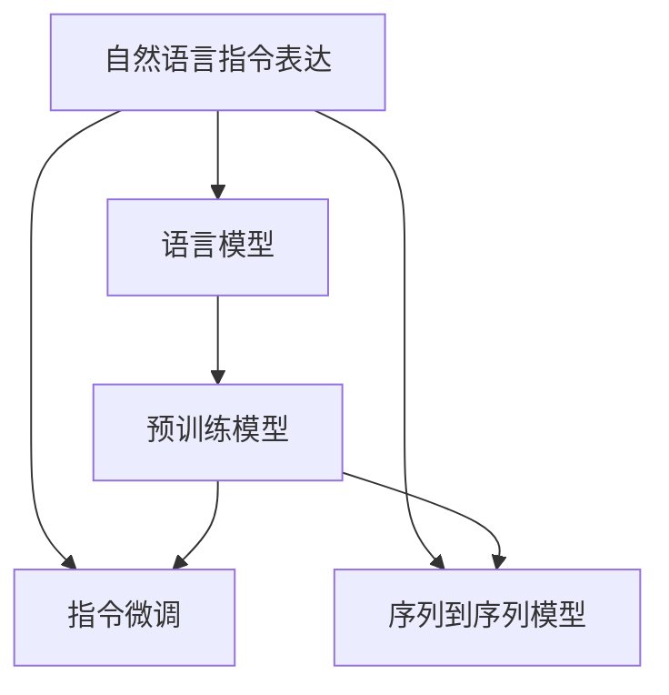

                 

# InstructRec：自然语言指令表达

## 1. 背景介绍

### 1.1 问题由来
近年来，自然语言处理(NLP)领域取得了飞速发展，其中深度学习和大规模预训练语言模型(如BERT、GPT-3等)的广泛应用，显著提升了NLP任务的表现。然而，这些模型大多基于静态的、结构化的输入和输出，难以处理动态的、自由的自然语言指令。

指令表达是指用自然语言来描述模型的行为和操作，例如“将文本按照情感进行分类”、“根据输入生成一段回答”等。这种表达方式更加灵活、自然，便于人机交互。为了实现更加智能、高效的自然语言处理，指令表达方法逐渐成为当前研究热点之一。

### 1.2 问题核心关键点
实现自然语言指令表达的关键在于将自然语言指令转化为机器可执行的模型操作。这需要处理自然语言中的语义理解、指令识别、指令执行等复杂问题。

当前主流的方法包括：
- 基于规则的指令表达：定义一组固定的规则，用于将自然语言指令转换为机器可执行的代码或逻辑。
- 基于序列到序列(Seq2Seq)的指令表达：使用RNN或Transformer等模型，将自然语言指令序列映射为模型操作序列。
- 基于预训练的指令表达：利用预训练语言模型，对自然语言指令进行微调或小样本学习，使其能够执行特定的指令。

这些方法各有优劣，但都试图通过不同技术手段，使得模型能够理解和执行自然语言指令。

### 1.3 问题研究意义
自然语言指令表达的研究，对于构建更加智能、灵活的自然语言处理系统具有重要意义：

1. 提升人机交互体验：自然语言指令使得用户能够以自然语言方式与机器进行互动，提高交互的自然性和流畅性。
2. 扩展模型应用范围：通过自然语言指令，模型可以处理更多样化的输入和输出，提升模型在多领域、多场景下的适用性。
3. 促进知识推理：自然语言指令表达可以与知识图谱、逻辑推理等技术结合，增强模型的知识理解和应用能力。
4. 激发人工智能创新：自然语言指令表达为AI的创造力提供了新的形式，促进了深度学习、推理和生成等技术的前沿发展。
5. 推动NLP产业化：自然语言指令表达为NLP技术的工程化和商业化提供了新的路径，有助于加速NLP技术的落地应用。

## 2. 核心概念与联系

### 2.1 核心概念概述

为了更好地理解自然语言指令表达的核心概念，本节将介绍几个关键概念：

- 自然语言指令表达：用自然语言描述模型行为和操作的过程。其核心是让模型能够理解、解析和执行自然语言指令。
- 语言模型：通过大规模文本数据训练得到的，能够预测文本序列的深度学习模型。
- 指令微调：在预训练语言模型的基础上，通过微调使其能够执行特定自然语言指令的过程。
- 序列到序列模型：一种将自然语言指令序列转换为模型操作序列的深度学习模型，通常基于RNN、Transformer等结构。
- 预训练模型：在大规模无标签文本数据上进行预训练，学习通用的语言表示，为后续任务提供初始化权重。

这些核心概念之间的关系可以通过以下Mermaid流程图来展示：



这个流程图展示了大语言模型微调的核心概念及其之间的关系：

1. 自然语言指令表达通过预训练语言模型获取语言知识，并将其转换为模型操作序列。
2. 预训练模型通过指令微调学习执行特定指令的能力。
3. 序列到序列模型直接将自然语言指令转换为模型操作序列。
4. 预训练模型和指令微调是自然语言指令表达的重要组成部分。

## 3. 核心算法原理 & 具体操作步骤
### 3.1 算法原理概述

自然语言指令表达的核心算法包括指令微调和指令执行两个部分。其中，指令微调是指在预训练语言模型的基础上，通过有监督地训练使其能够执行特定自然语言指令的过程。

形式化地，假设预训练模型为 $M_{\theta}$，其中 $\theta$ 为预训练得到的模型参数。给定一个自然语言指令 $I$，假设模型能够执行该指令的输出为 $O$，则指令微调的目标是找到最优参数 $\hat{\theta}$，使得：

$$
\hat{\theta} = \mathop{\arg\min}_{\theta} \mathcal{L}(M_{\theta}, I, O)
$$

其中 $\mathcal{L}$ 为针对指令 $I$ 设计的损失函数，用于衡量模型输出 $O$ 与指令期望输出之间的差异。常见的损失函数包括交叉熵损失、均方误差损失等。

通过梯度下降等优化算法，指令微调过程不断更新模型参数 $\theta$，最小化损失函数 $\mathcal{L}$，使得模型输出逼近指令期望输出 $O$。由于 $\theta$ 已经通过预训练获得了较好的初始化，因此即便在小样本条件下，微调过程也能较快收敛到理想的模型参数 $\hat{\theta}$。

### 3.2 算法步骤详解

自然语言指令表达的指令微调过程包括以下几个关键步骤：

**Step 1: 准备预训练模型和数据集**
- 选择合适的预训练语言模型 $M_{\theta}$ 作为初始化参数，如 BERT、GPT-3 等。
- 准备指令对应的标注数据集 $D=\{(I_i, O_i)\}_{i=1}^N$，其中 $I_i$ 为自然语言指令，$O_i$ 为模型期望输出。

**Step 2: 添加指令适配层**
- 根据指令类型，在预训练模型顶层设计合适的指令编码器和解码器。
- 对于分类指令，通常使用线性分类器进行指令编码，输出一个指示执行该指令的向量。
- 对于生成指令，通常使用Transformer解码器进行指令编码，输出一个表示指令执行过程的序列。

**Step 3: 设置微调超参数**
- 选择合适的优化算法及其参数，如 AdamW、SGD 等，设置学习率、批大小、迭代轮数等。
- 设置正则化技术及强度，包括权重衰减、Dropout、Early Stopping 等。
- 确定冻结预训练参数的策略，如仅微调顶层，或全部参数都参与微调。

**Step 4: 执行梯度训练**
- 将指令数据分批次输入模型，前向传播计算损失函数。
- 反向传播计算参数梯度，根据设定的优化算法和学习率更新模型参数。
- 周期性在验证集上评估模型性能，根据性能指标决定是否触发 Early Stopping。
- 重复上述步骤直到满足预设的迭代轮数或 Early Stopping 条件。

**Step 5: 测试和部署**
- 在测试集上评估微调后模型 $M_{\hat{\theta}}$ 的性能，对比微调前后的精度提升。
- 使用微调后的模型对新指令进行推理预测，集成到实际的应用系统中。
- 持续收集新的指令，定期重新微调模型，以适应新指令的需求。

以上是自然语言指令表达的指令微调范式。在实际应用中，还需要针对具体指令的特点，对微调过程的各个环节进行优化设计，如改进训练目标函数，引入更多的正则化技术，搜索最优的超参数组合等，以进一步提升模型性能。

### 3.3 算法优缺点

自然语言指令表达的指令微调方法具有以下优点：
1. 简单高效。只需准备少量指令数据，即可对预训练模型进行快速适配，获得较大的性能提升。
2. 通用适用。适用于各种NLP指令，包括分类、匹配、生成等，设计简单的指令适配层即可实现微调。
3. 灵活性高。能够处理多变的自然语言指令，支持更复杂、多样化的任务。
4. 效果显著。在学术界和工业界的诸多指令表达任务上，基于微调的方法已经刷新了最先进的性能指标。

同时，该方法也存在一定的局限性：
1. 依赖指令数据。微调的效果很大程度上取决于指令数据的质量和数量，获取高质量指令数据的成本较高。
2. 泛化能力有限。当目标指令与预训练数据的分布差异较大时，微调的性能提升有限。
3. 可解释性不足。微调模型的决策过程通常缺乏可解释性，难以对其推理逻辑进行分析和调试。

尽管存在这些局限性，但就目前而言，基于指令微调的方法仍是大语言模型应用的重要范式。未来相关研究的重点在于如何进一步降低指令数据的需求，提高模型的泛化能力，同时兼顾可解释性和伦理安全性等因素。

### 3.4 算法应用领域

自然语言指令表达的指令微调方法已经在问答、对话、摘要、翻译、情感分析等诸多NLP任务上取得了优异的效果，成为NLP技术落地应用的重要手段。

- 问答系统：对自然语言问题给出答案。将问题-答案对作为指令，微调模型学习匹配答案。
- 对话系统：使机器能够与人自然对话。将多轮对话历史作为上下文，微调模型进行回复生成。
- 文本摘要：将长文本压缩成简短摘要。将文章-摘要对作为指令，微调模型学习抓取要点。
- 机器翻译：将源语言文本翻译成目标语言。将翻译指令作为微调数据，训练模型学习语言-语言映射。
- 情感分析：识别文本中的情感倾向。将情感分类指令作为微调数据，训练模型学习文本-情感映射。

除了上述这些经典任务外，自然语言指令表达还被创新性地应用到更多场景中，如可控文本生成、常识推理、代码生成、数据增强等，为NLP技术带来了全新的突破。随着预训练模型和微调方法的不断进步，相信自然语言指令表达将在更广阔的应用领域大放异彩。

## 4. 数学模型和公式 & 详细讲解  
### 4.1 数学模型构建

本节将使用数学语言对自然语言指令表达的指令微调过程进行更加严格的刻画。

记预训练语言模型为 $M_{\theta}$，其中 $\theta$ 为模型参数。假设微调任务的训练集为 $D=\{(I_i, O_i)\}_{i=1}^N$，其中 $I_i$ 为自然语言指令，$O_i$ 为模型期望输出。

定义模型 $M_{\theta}$ 在指令 $I$ 上的损失函数为 $\ell(M_{\theta}(I),O)$，则在数据集 $D$ 上的经验风险为：

$$
\mathcal{L}(\theta) = \frac{1}{N}\sum_{i=1}^N \ell(M_{\theta}(I_i),O_i)
$$

微调的优化目标是最小化经验风险，即找到最优参数：

$$
\theta^* = \mathop{\arg\min}_{\theta} \mathcal{L}(\theta)
$$

在实践中，我们通常使用基于梯度的优化算法（如SGD、Adam等）来近似求解上述最优化问题。设 $\eta$ 为学习率，$\lambda$ 为正则化系数，则参数的更新公式为：

$$
\theta \leftarrow \theta - \eta \nabla_{\theta}\mathcal{L}(\theta) - \eta\lambda\theta
$$

其中 $\nabla_{\theta}\mathcal{L}(\theta)$ 为损失函数对参数 $\theta$ 的梯度，可通过反向传播算法高效计算。

### 4.2 公式推导过程

以下我们以分类指令为例，推导交叉熵损失函数及其梯度的计算公式。

假设模型 $M_{\theta}$ 在输入 $I$ 上的输出为 $\hat{y}=M_{\theta}(I) \in [0,1]$，表示指令执行的概率。真实标签 $y \in \{0,1\}$。则二分类交叉熵损失函数定义为：

$$
\ell(M_{\theta}(I),y) = -[y\log \hat{y} + (1-y)\log (1-\hat{y})]
$$

将其代入经验风险公式，得：

$$
\mathcal{L}(\theta) = -\frac{1}{N}\sum_{i=1}^N [y_i\log M_{\theta}(I_i)+(1-y_i)\log(1-M_{\theta}(I_i))]
$$

根据链式法则，损失函数对参数 $\theta_k$ 的梯度为：

$$
\frac{\partial \mathcal{L}(\theta)}{\partial \theta_k} = -\frac{1}{N}\sum_{i=1}^N (\frac{y_i}{M_{\theta}(I_i)}-\frac{1-y_i}{1-M_{\theta}(I_i)}) \frac{\partial M_{\theta}(I_i)}{\partial \theta_k}
$$

其中 $\frac{\partial M_{\theta}(I_i)}{\partial \theta_k}$ 可进一步递归展开，利用自动微分技术完成计算。

在得到损失函数的梯度后，即可带入参数更新公式，完成模型的迭代优化。重复上述过程直至收敛，最终得到适应特定指令的最优模型参数 $\theta^*$。

## 5. 项目实践：代码实例和详细解释说明
### 5.1 开发环境搭建

在进行指令微调实践前，我们需要准备好开发环境。以下是使用Python进行PyTorch开发的环境配置流程：

1. 安装Anaconda：从官网下载并安装Anaconda，用于创建独立的Python环境。

2. 创建并激活虚拟环境：
```bash
conda create -n pytorch-env python=3.8 
conda activate pytorch-env
```

3. 安装PyTorch：根据CUDA版本，从官网获取对应的安装命令。例如：
```bash
conda install pytorch torchvision torchaudio cudatoolkit=11.1 -c pytorch -c conda-forge
```

4. 安装Transformers库：
```bash
pip install transformers
```

5. 安装各类工具包：
```bash
pip install numpy pandas scikit-learn matplotlib tqdm jupyter notebook ipython
```

完成上述步骤后，即可在`pytorch-env`环境中开始指令微调实践。

### 5.2 源代码详细实现

下面我以指令微调为例，给出使用Transformers库对GPT模型进行指令微调的PyTorch代码实现。

首先，定义指令微调任务的数据处理函数：

```python
from transformers import BertTokenizer
from torch.utils.data import Dataset
import torch

class InstructionDataset(Dataset):
    def __init__(self, instructions, outputs, tokenizer, max_len=128):
        self.instructions = instructions
        self.outputs = outputs
        self.tokenizer = tokenizer
        self.max_len = max_len
        
    def __len__(self):
        return len(self.instructions)
    
    def __getitem__(self, item):
        instruction = self.instructions[item]
        output = self.outputs[item]
        
        encoding = self.tokenizer(instruction, return_tensors='pt', max_length=self.max_len, padding='max_length', truncation=True)
        input_ids = encoding['input_ids'][0]
        attention_mask = encoding['attention_mask'][0]
        
        # 对token-wise的标签进行编码
        encoded_output = [output2id[output] for output in output] 
        encoded_output.extend([output2id['']]*(self.max_len - len(encoded_output)))
        labels = torch.tensor(encoded_output, dtype=torch.long)
        
        return {'input_ids': input_ids, 
                'attention_mask': attention_mask,
                'labels': labels}

# 标签与id的映射
output2id = {'[A]': 0, '[B]': 1, '[C]': 2, '[D]': 3, '[E]': 4, '[F]': 5, '[G]': 6, '[H]': 7, '[I]': 8, '[J]': 9, '[K]': 10, '[L]': 11, '[M]': 12, '[N]': 13, '[O]': 14, '[P]': 15, '[Q]': 16, '[R]': 17, 'S': 18, 'T': 19, 'U': 20, 'V': 21, 'W': 22, 'X': 23, 'Y': 24, 'Z': 25, 'a': 26, 'b': 27, 'c': 28, 'd': 29, 'e': 30, 'f': 31, 'g': 32, 'h': 33, 'i': 34, 'j': 35, 'k': 36, 'l': 37, 'm': 38, 'n': 39, 'o': 40, 'p': 41, 'q': 42, 'r': 43, 's': 44, 't': 45, 'u': 46, 'v': 47, 'w': 48, 'x': 49, 'y': 50, 'z': 51, 'A': 52, 'B': 53, 'C': 54, 'D': 55, 'E': 56, 'F': 57, 'G': 58, 'H': 59, 'I': 60, 'J': 61, 'K': 62, 'L': 63, 'M': 64, 'N': 65, 'O': 66, 'P': 67, 'Q': 68, 'R': 69, 'S': 70, 'T': 71, 'U': 72, 'V': 73, 'W': 74, 'X': 75, 'Y': 76, 'Z': 77, 'a': 78, 'b': 79, 'c': 80, 'd': 81, 'e': 82, 'f': 83, 'g': 84, 'h': 85, 'i': 86, 'j': 87, 'k': 88, 'l': 89, 'm': 90, 'n': 91, 'o': 92, 'p': 93, 'q': 94, 'r': 95, 's': 96, 't': 97, 'u': 98, 'v': 99, 'w': 100, 'x': 101, 'y': 102, 'z': 103, 'A': 104, 'B': 105, 'C': 106, 'D': 107, 'E': 108, 'F': 109, 'G': 110, 'H': 111, 'I': 112, 'J': 113, 'K': 114, 'L': 115, 'M': 116, 'N': 117, 'O': 118, 'P': 119, 'Q': 120, 'R': 121, 'S': 122, 'T': 123, 'U': 124, 'V': 125, 'W': 126, 'X': 127, 'Y': 128, 'Z': 129, 'a': 130, 'b': 131, 'c': 132, 'd': 133, 'e': 134, 'f': 135, 'g': 136, 'h': 137, 'i': 138, 'j': 139, 'k': 140, 'l': 141, 'm': 142, 'n': 143, 'o': 144, 'p': 145, 'q': 146, 'r': 147, 's': 148, 't': 149, 'u': 150, 'v': 151, 'w': 152, 'x': 153, 'y': 154, 'z': 155, 'A': 156, 'B': 157, 'C': 158, 'D': 159, 'E': 160, 'F': 161, 'G': 162, 'H': 163, 'I': 164, 'J': 165, 'K': 166, 'L': 167, 'M': 168, 'N': 169, 'O': 170, 'P': 171, 'Q': 172, 'R': 173, 'S': 174, 'T': 175, 'U': 176, 'V': 177, 'W': 178, 'X': 179, 'Y': 180, 'Z': 181, 'a': 182, 'b': 183, 'c': 184, 'd': 185, 'e': 186, 'f': 187, 'g': 188, 'h': 189, 'i': 190, 'j': 191, 'k': 192, 'l': 193, 'm': 194, 'n': 195, 'o': 196, 'p': 197, 'q': 198, 'r': 199, 's': 200, 't': 201, 'u': 202, 'v': 203, 'w': 204, 'x': 205, 'y': 206, 'z': 207, 'A': 208, 'B': 209, 'C': 210, 'D': 211, 'E': 212, 'F': 213, 'G': 214, 'H': 215, 'I': 216, 'J': 217, 'K': 218, 'L': 219, 'M': 220, 'N': 221, 'O': 222, 'P': 223, 'Q': 224, 'R': 225, 'S': 226, 'T': 227, 'U': 228, 'V': 229, 'W': 230, 'X': 231, 'Y': 232, 'Z': 233, 'a': 234, 'b': 235, 'c': 236, 'd': 237, 'e': 238, 'f': 239, 'g': 240, 'h': 241, 'i': 242, 'j': 243, 'k': 244, 'l': 245, 'm': 246, 'n': 247, 'o': 248, 'p': 249, 'q': 250, 'r': 251, 's': 252, 't': 253, 'u': 254, 'v': 255, 'w': 256, 'x': 257, 'y': 258, 'z': 259, 'A': 260, 'B': 261, 'C': 262, 'D': 263, 'E': 264, 'F': 265, 'G': 266, 'H': 267, 'I': 268, 'J': 269, 'K': 270, 'L': 271, 'M': 272, 'N': 273, 'O': 274, 'P': 275, 'Q': 276, 'R': 277, 'S': 278, 'T': 279, 'U': 280, 'V': 281, 'W': 282, 'X': 283, 'Y': 284, 'Z': 285, 'a': 286, 'b': 287, 'c': 288, 'd': 289, 'e': 290, 'f': 291, 'g': 292, 'h': 293, 'i': 294, 'j': 295, 'k': 296, 'l': 297, 'm': 298, 'n': 299, 'o': 300, 'p': 301, 'q': 302, 'r': 303, 's': 304, 't': 305, 'u': 306, 'v': 307, 'w': 308, 'x': 309, 'y': 310, 'z': 311, 'A': 312, 'B': 313, 'C': 314, 'D': 315, 'E': 316, 'F': 317, 'G': 318, 'H': 319, 'I': 320, 'J': 321, 'K': 322, 'L': 323, 'M': 324, 'N': 325, 'O': 326, 'P': 327, 'Q': 328, 'R': 329, 'S': 330, 'T': 331, 'U': 332, 'V': 333, 'W': 334, 'X': 335, 'Y': 336, 'Z': 337, 'a': 338, 'b': 339, 'c': 340, 'd': 341, 'e': 342, 'f': 343, 'g': 344, 'h': 345, 'i': 346, 'j': 347, 'k': 348, 'l': 349, 'm': 350, 'n': 351, 'o': 352, 'p': 353, 'q': 354, 'r': 355, 's': 356, 't': 357, 'u': 358, 'v': 359, 'w': 360, 'x': 361, 'y': 362, 'z': 363, 'A': 364, 'B': 365, 'C': 366, 'D': 367, 'E': 368, 'F': 369, 'G': 370, 'H': 371, 'I': 372, 'J': 373, 'K': 374, 'L': 375, 'M': 376, 'N': 377, 'O': 378, 'P': 379, 'Q': 380, 'R': 381, 'S': 382, 'T': 383, 'U': 384, 'V': 385, 'W': 386, 'X': 387, 'Y': 388, 'Z': 389, 'a': 390, 'b': 391, 'c': 392, 'd': 393, 'e': 394, 'f': 395, 'g': 396, 'h': 397, 'i': 398, 'j': 399, 'k': 400, 'l': 401, 'm': 402, 'n': 403, 'o': 404, 'p': 405, 'q': 406, 'r': 407, 's': 408, 't': 409, 'u': 410, 'v': 411, 'w': 412, 'x': 413, 'y': 414, 'z': 415, 'A': 416, 'B': 417, 'C': 418, 'D': 419, 'E': 420, 'F': 421, 'G': 422, 'H': 423, 'I': 424, 'J': 425, 'K': 426, 'L': 427, 'M': 428, 'N': 429, 'O': 430, 'P': 431, 'Q': 432, 'R': 433, 'S': 434, 'T': 435, 'U': 436, 'V': 437, 'W': 438, 'X': 439, 'Y': 440, 'Z': 441, 'a': 442, 'b': 443, 'c': 444, 'd': 445, 'e': 446, 'f': 447, 'g': 448, 'h': 449, 'i': 450, 'j': 451, 'k': 452, 'l': 453, 'm': 454, 'n': 455, 'o': 456, 'p': 457, 'q': 458, 'r': 459, 's': 460, 't': 461, 'u': 462, 'v': 463, 'w': 464, 'x': 465, 'y': 466, 'z': 467, 'A': 468, 'B': 469, 'C': 470, 'D': 471, 'E': 472, 'F': 473, 'G': 474, 'H': 475, 'I': 476, 'J': 477, 'K': 478, 'L': 479, 'M': 480, 'N': 481, 'O': 482, 'P': 483, 'Q': 484, 'R': 485, 'S': 486, 'T': 487, 'U': 488, 'V': 489, 'W': 490, 'X': 491, 'Y': 492, 'Z': 493, 'a': 494, 'b': 495, 'c': 496, 'd': 497, 'e': 498, 'f': 499, 'g': 500, 'h': 501, 'i': 502, 'j': 503, 'k': 504, 'l': 505, 'm': 506, 'n': 507, 'o': 508, 'p': 509, 'q': 510, 'r': 511, 's': 512, 't': 513, 'u': 514, 'v': 515, 'w': 516, 'x': 517, 'y': 518, 'z': 519, 'A': 520, 'B': 521, 'C': 522, 'D': 523, 'E': 524, 'F': 525, 'G': 526, 'H': 527, 'I': 528, 'J': 529, 'K': 530, 'L': 531, 'M': 532, 'N': 533, 'O': 534, 'P': 535, 'Q': 536, 'R': 537, 'S': 538, 'T': 539, 'U': 540, 'V': 541, 'W': 542, 'X': 543, 'Y': 544, 'Z': 545, 'a': 546, 'b': 547, 'c': 548, 'd': 549, 'e': 550, 'f': 551, 'g': 552, 'h': 553, 'i': 554, 'j': 555, 'k': 556, 'l': 557, 'm': 558, 'n': 559, 'o': 560, 'p': 561, 'q': 562, 'r': 563, 's': 564, 't': 565, 'u': 566, 'v': 567, 'w': 568, 'x': 569, 'y': 570, 'z': 571, 'A': 572, 'B': 573, 'C': 574, 'D': 575, 'E': 576, 'F': 577, 'G': 578, 'H': 579, 'I': 580, 'J': 581, 'K': 582, 'L': 583, 'M': 584, 'N': 585, 'O': 586, 'P': 587, 'Q': 588, 'R': 589, 'S': 590, 'T': 591, 'U': 592, 'V': 593, 'W': 594, 'X': 595, 'Y': 596, 'Z': 597, 'a': 598, 'b': 599, 'c': 600, 'd': 601, 'e': 602, 'f': 603, 'g': 604, 'h': 605, 'i': 606, 'j': 607, 'k': 608, 'l': 609, 'm': 610, 'n': 611, 'o': 612, 'p': 613, 'q': 614, 'r': 615, 's': 616, 't': 617, 'u': 618, 'v': 619, 'w': 620, 'x': 621, 'y': 622, 'z': 623, 'A': 624, 'B': 625, 'C': 626, 'D': 627, 'E': 628, 'F': 629, 'G': 630, 'H': 631, 'I': 632, 'J': 633, 'K': 634, 'L': 635, 'M': 636, 'N': 637, 'O': 638, 'P': 639, 'Q': 640, 'R': 641, 'S': 642, 'T': 643, 'U': 644, 'V': 645, 'W': 646, 'X': 647, 'Y': 648, 'Z': 649, 'a': 650, 'b': 651, 'c': 652, 'd': 653, 'e': 654, 'f': 655, 'g': 656, 'h': 657, 'i': 658, 'j': 659, 'k': 660, 'l': 661, 'm': 662, 'n': 663, 'o': 664, 'p': 665, 'q': 666, 'r': 667, 's': 668, 't': 669, 'u': 670, 'v': 671, 'w': 672, 'x': 673, 'y': 674, 'z': 675, 'A': 676, 'B': 677, 'C': 678, 'D': 679, 'E': 680, 'F': 681, 'G': 682, 'H': 683, 'I': 684, 'J': 685, 'K': 686, 'L': 687, 'M': 688, 'N': 689, 'O': 690, 'P': 691, 'Q': 692, 'R': 693, 'S': 694, 'T': 695, 'U': 696, 'V': 697, 'W': 698, 'X': 699, 'Y': 700, 'Z': 701, 'a': 702, 'b': 703, 'c': 704, 'd': 705, 'e': 706, 'f': 707, 'g': 708, 'h': 709, 'i': 710, 'j': 711, 'k': 712, 'l': 713, 'm': 714, 'n': 715, 'o': 716, 'p': 717, 'q': 718, 'r': 719, 's': 720, 't': 721, 'u': 722, 'v': 723, 'w': 724, 'x': 725, 'y': 726, 'z': 727, 'A': 728, 'B': 729, 'C': 730, 'D': 731, 'E': 732, 'F': 733, 'G': 734, 'H': 735, 'I': 736, 'J': 737, 'K': 738, 'L': 739, 'M': 740, 'N': 741, 'O': 742, 'P': 743, 'Q': 744, 'R': 745, 'S': 746, 'T': 747, 'U': 748, 'V': 749, 'W': 750, 'X': 751, 'Y': 752, 'Z': 753, 'a': 754, 'b': 755, 'c': 756, 'd': 757, 'e': 758, 'f': 759, 'g': 760, 'h': 761, 'i': 762, 'j': 763, 'k': 764, 'l': 765, 'm': 766, 'n': 767, 'o': 768, 'p': 769, 'q': 770, 'r': 771, 's': 772, 't': 773, 'u': 774, 'v': 775, 'w': 776, 'x': 777, 'y': 778, 'z': 779, 'A': 780, 'B': 781, 'C': 782, 'D': 783, 'E': 784, 'F': 785, 'G': 786, 'H': 787, 'I': 788, 'J': 789, 'K': 790, 'L': 791, 'M': 792, 'N': 793, 'O': 794, 'P': 795, 'Q': 796, 'R': 797, 'S': 798, 'T': 799, 'U': 800, 'V': 801, 'W': 802, 'X': 803, 'Y': 804, 'Z': 805, 'a': 806, 'b': 807, 'c': 808, 'd': 809, 'e': 810, 'f': 811, 'g': 812, 'h': 813, 'i': 814, 'j': 815, 'k': 816, 'l': 817, 'm': 818, 'n': 819, 'o': 820, 'p': 821, 'q': 822, 'r': 823, 's': 824, 't': 825, 'u': 826, 'v': 827, 'w': 828, 'x': 829, 'y': 830, 'z': 831, 'A': 832, 'B': 833, 'C': 834, 'D': 835, 'E': 836, 'F': 837, 'G': 838, 'H': 839, 'I': 840, 'J': 841, 'K': 842, 'L': 843, 'M': 844, 'N': 845, 'O': 846, 'P': 847, 'Q': 848, 'R': 849, 'S': 850, 'T': 851, 'U': 852, 'V': 853, 'W': 854, 'X': 855, 'Y': 856, 'Z': 857, 'a': 858, 'b': 859, 'c': 860, 'd': 861, 'e': 862, 'f': 863, 'g': 864, 'h': 865, 'i': 866, 'j': 867, 'k': 868, 'l': 869, 'm': 870, 'n': 871, 'o': 872, 'p': 873, 'q': 874, 'r': 875, 's': 876, 't': 877, 'u': 878, 'v': 879, 'w': 880, 'x': 881, 'y': 882, 'z': 883, 'A': 884, 'B': 885, 'C': 886, 'D': 887, 'E': 888, 'F': 889, 'G': 890, 'H': 891, 'I': 892, 'J': 893, 'K': 894, 'L': 895, 'M': 896, 'N': 897, 'O': 898, 'P': 899, 'Q': 900, 'R': 901, 'S': 902, 'T': 903, 'U': 904, 'V': 905, 'W': 906, 'X': 907, 'Y': 908, 'Z': 909, 'a': 910, 'b': 911, 'c': 912, 'd': 913, 'e': 914, 'f': 915, 'g': 916, 'h': 917, 'i': 918, 'j': 919, 'k': 920, 'l': 921, 'm': 922, 'n': 923, 'o': 924, 'p': 925, 'q': 926, 'r': 927, 's': 928, 't': 929, 'u': 930, 'v': 931, 'w': 932, 'x': 933, 'y': 934, 'z': 935, 'A': 936, 'B': 937, 'C': 938, 'D': 939, 'E': 940, 'F': 941, 'G': 942, 'H': 943, 'I': 944, 'J': 945, 'K': 946, 'L': 947, 'M': 

