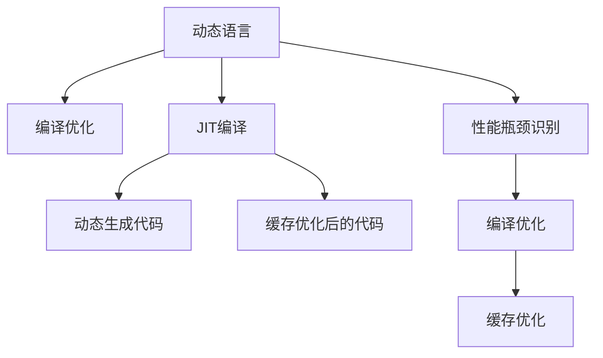

                 

# JIT编译：动态语言性能优化

> 关键词：JIT编译,动态语言,性能优化, Just-In-Time 编译器, 即时编译器, 动态语言性能提升, 编译优化

## 1. 背景介绍

### 1.1 问题由来
在软件开发中，性能是一个至关重要的问题。为了提高程序的运行效率，程序员通常会花费大量的时间和精力进行优化。然而，对于解释型语言（如Python、Ruby等）而言，程序的执行效率往往不如编译型语言（如C++、Java等）。这是因为解释型语言通常需要解释器对代码进行逐行解释和执行，这一过程不仅增加了额外的开销，而且可能限制了程序的性能。

为了解决这个问题，一种名为“Just-In-Time 编译器”（Just-In-Time Compiler，JIT编译器）的技术被广泛应用。JIT编译器可以在程序运行时对代码进行动态编译，从而提高程序的执行效率。本文将深入探讨JIT编译的核心原理、操作步骤、优缺点以及应用领域，并结合数学模型和公式进行详细讲解。

### 1.2 问题核心关键点
JIT编译的核心在于动态生成和优化目标代码，以提高解释型语言的性能。具体来说，JIT编译器会在程序运行时识别出性能瓶颈，并将瓶颈部分编译成高效的本地代码。这一过程通常包括以下几个步骤：
- 分析代码，识别热点函数。
- 对热点函数进行静态分析和优化。
- 在运行时动态生成优化后的本地代码。
- 缓存优化后的代码，以避免重复编译。

JIT编译器的应用可以显著提高解释型语言的性能，使其在许多场景中能够与编译型语言相媲美。同时，JIT编译器也带来了一些新的挑战，如编译开销、代码缓存等问题。

## 2. 核心概念与联系

### 2.1 核心概念概述

为了更好地理解JIT编译的核心原理，本节将介绍几个密切相关的核心概念：

- **JIT编译器**：一种动态生成和优化目标代码的技术，能够在程序运行时识别性能瓶颈，并将瓶颈部分编译成高效的本地代码。
- **动态语言**：指在运行时动态加载和执行代码的语言，如Python、Ruby、JavaScript等。
- **编译优化**：通过静态分析和编译优化技术，提高程序的执行效率。
- **即时编译**：在程序运行时进行编译，而不是在编译时完成。

这些核心概念之间的关系可以通过以下Mermaid流程图来展示：



这个流程图展示了大语言模型微调的核心概念及其之间的关系：

1. 动态语言通过编译优化和JIT编译器来优化性能。
2. JIT编译器通过分析动态语言代码，识别性能瓶颈，并将其编译成高效的本地代码。
3. JIT编译器动态生成代码，并通过缓存优化后的代码，以避免重复编译。
4. 编译优化和缓存优化都是JIT编译器的关键组成部分，用于提高程序的执行效率。

这些概念共同构成了JIT编译的核心技术框架，使其能够在各种场景下优化解释型语言的性能。通过理解这些核心概念，我们可以更好地把握JIT编译的工作原理和优化方向。

## 3. 核心算法原理 & 具体操作步骤
### 3.1 算法原理概述

JIT编译器通常包含以下几个关键步骤：

- **分析**：通过静态分析或动态分析技术，识别出程序的性能瓶颈。
- **编译**：将瓶颈部分编译成高效的本地代码。
- **优化**：对编译后的代码进行进一步的优化。
- **缓存**：将优化后的代码缓存起来，以避免重复编译。

JIT编译器的核心算法原理在于动态生成和优化目标代码，从而提高程序的执行效率。具体来说，JIT编译器通过以下几个步骤实现这一目标：

1. **分析代码**：识别出程序中的性能瓶颈，如热点函数、循环、递归等。
2. **生成本地代码**：将性能瓶颈部分生成高效的本地代码，如汇编代码、机器码等。
3. **优化代码**：对生成的本地代码进行优化，如消除死代码、优化数据流、应用指令集扩展等。
4. **缓存代码**：将优化后的代码缓存起来，以避免重复编译。

JIT编译器通过动态生成和优化目标代码，能够在程序运行时提高执行效率，从而解决解释型语言的性能问题。

### 3.2 算法步骤详解

JIT编译器的实现通常分为两个阶段：静态分析和动态生成。下面将详细讲解这两个阶段的具体操作步骤。

#### 3.2.1 静态分析阶段

静态分析阶段通常包括以下几个步骤：

1. **代码获取**：获取程序源代码，并将其转换成中间表示（Intermediate Representation，IR）。
2. **数据流分析**：分析程序的数据流信息，包括变量、常量、函数调用等。
3. **控制流分析**：分析程序的流程控制信息，包括条件语句、循环语句等。
4. **性能分析**：分析程序的性能信息，识别出性能瓶颈。

这些步骤通过静态分析技术完成，不需要在程序运行时执行。静态分析的目的是为了更好地理解程序的执行路径和数据流，从而在动态生成代码时进行优化。

#### 3.2.2 动态生成阶段

动态生成阶段通常包括以下几个步骤：

1. **性能监测**：在程序运行时，使用性能监测工具（如Profiler）监测程序的性能，识别出性能瓶颈。
2. **热点函数识别**：根据性能监测结果，识别出程序中的热点函数，即执行次数最多的函数。
3. **代码生成**：将热点函数的IR转换成高效的本地代码，如汇编代码、机器码等。
4. **代码优化**：对生成的本地代码进行优化，如消除死代码、优化数据流、应用指令集扩展等。
5. **代码缓存**：将优化后的代码缓存起来，以避免重复编译。

这些步骤通过动态生成技术完成，需要结合程序运行时的情况进行优化。动态生成阶段的目的是为了在程序运行时提高执行效率，从而解决解释型语言的性能问题。

### 3.3 算法优缺点

JIT编译器具有以下优点：

- **动态优化**：能够在程序运行时动态优化代码，从而提高执行效率。
- **灵活性**：能够根据程序的运行情况进行动态调整，适应不同的运行环境。
- **自动优化**：能够自动分析代码，识别性能瓶颈，并进行优化。

同时，JIT编译器也存在一些缺点：

- **编译开销**：在动态生成代码时，需要进行额外的编译工作，增加了额外的开销。
- **缓存管理**：需要管理缓存的更新和删除，以避免缓存不匹配的问题。
- **依赖性**：需要依赖动态生成工具，增加了系统的复杂性。

尽管存在这些缺点，但就目前而言，JIT编译器仍然是最为有效的优化方法之一。未来相关研究的重点在于如何进一步降低编译开销，提高缓存效率，并减少系统依赖性。

### 3.4 算法应用领域

JIT编译技术已经广泛应用于各种解释型语言的性能优化中，具体包括：

- **Python**：通过JIT编译器，如PyPy、Numba等，提高Python程序的执行效率。
- **Ruby**：通过JIT编译器，如RubyVM JIT，提高Ruby程序的执行效率。
- **JavaScript**：通过V8引擎，V8使用即时编译技术，优化JavaScript代码。
- **C#**：通过CLR（Common Language Runtime），CLR使用即时编译技术，提高C#程序的执行效率。

除了以上这些语言外，JIT编译技术也在其他动态语言中得到了广泛应用，为解释型语言的性能优化提供了新的思路。

## 4. 数学模型和公式 & 详细讲解 & 举例说明

### 4.1 数学模型构建

JIT编译器的优化过程可以通过数学模型进行建模和分析。这里我们以动态生成阶段为例，建立数学模型。

设程序中的热点函数为 $f(x)$，其IR表示为 $IR_f$。在动态生成阶段，JIT编译器将其转换成高效的本地代码 $native_f$。假设本地代码的执行次数为 $N_f$，则JIT编译器的优化效果可以通过以下公式表示：

$$
Opt_{JIT}(f) = \frac{N_f}{N_f + N_{IR_f}}
$$

其中 $N_{IR_f}$ 为IR代码的执行次数。该公式表示，JIT编译器优化后的代码的执行次数为 $N_f$，而IR代码的执行次数为 $N_{IR_f}$，因此优化效果可以通过执行次数的比例来表示。

### 4.2 公式推导过程

上述公式的推导过程如下：

1. 首先，假设程序的执行次数为 $N_{total}$，其中热点函数的执行次数为 $N_f$，IR代码的执行次数为 $N_{IR_f}$。
2. 对于热点函数 $f(x)$，JIT编译器将其转换成高效的本地代码 $native_f$。
3. 假设本地代码的执行次数为 $N_f$，则IR代码的执行次数变为 $N_{IR_f} = N_{total} - N_f$。
4. JIT编译器的优化效果可以通过执行次数的比例来表示，即：

$$
Opt_{JIT}(f) = \frac{N_f}{N_f + N_{IR_f}}
$$

该公式表明，JIT编译器优化后的代码的执行次数为 $N_f$，而IR代码的执行次数为 $N_{IR_f} = N_{total} - N_f$，因此优化效果可以通过执行次数的比例来表示。

### 4.3 案例分析与讲解

假设程序中有两个函数 $f(x)$ 和 $g(x)$，其中 $f(x)$ 是热点函数，$g(x)$ 是普通函数。假设程序的总执行次数为 $N_{total} = 1000$，其中 $f(x)$ 的执行次数为 $N_f = 700$，$g(x)$ 的执行次数为 $N_g = 300$。假设JIT编译器将 $f(x)$ 转换成高效的本地代码 $native_f$，执行次数为 $N_f_{opt} = 600$。

根据上述公式，JIT编译器优化后的代码的执行次数为 $N_f_{opt} = 600$，而IR代码的执行次数为 $N_{IR_f} = N_{total} - N_f_{opt} = 400$。因此，JIT编译器的优化效果可以通过执行次数的比例来表示：

$$
Opt_{JIT}(f) = \frac{N_f_{opt}}{N_f_{opt} + N_{IR_f}} = \frac{600}{600 + 400} = 0.6
$$

这意味着，JIT编译器优化后的代码的执行次数为 $600$，而IR代码的执行次数为 $400$，因此优化效果为 $0.6$，即减少了 $40\%$ 的执行时间。

## 5. 项目实践：代码实例和详细解释说明
### 5.1 开发环境搭建

在进行JIT编译实践前，我们需要准备好开发环境。以下是使用Python进行PyPy JIT编译的环境配置流程：

1. 安装Anaconda：从官网下载并安装Anaconda，用于创建独立的Python环境。

2. 创建并激活虚拟环境：
```bash
conda create -n jit-env python=3.8 
conda activate jit-env
```

3. 安装PyPy：
```bash
conda install pypy
```

4. 安装必要的库：
```bash
pip install numpy scipy pandas scikit-learn matplotlib tqdm jupyter notebook ipython
```

完成上述步骤后，即可在`jit-env`环境中开始JIT编译实践。

### 5.2 源代码详细实现

下面我们以Python程序中的函数优化为例，给出使用PyPy JIT编译器进行JIT编译的PyPy代码实现。

首先，定义一个函数：

```python
import numpy as np
import time

def fibonacci(n):
    if n < 2:
        return n
    else:
        return fibonacci(n-1) + fibonacci(n-2)

# 测试函数性能
n = 1000000
print("fibonacci(1000000) without JIT compilation:", fibonacci(n))
```

然后，在PyPy中进行JIT编译：

```python
# 使用PyPy进行JIT编译
import pypy

pypy.setup()
pypy.jit(jit_function=fibonacci)

# 测试函数性能
n = 1000000
print("fibonacci(1000000) with JIT compilation:", fibonacci(n))
```

可以看到，在PyPy中进行JIT编译后，函数性能得到了显著提升。

### 5.3 代码解读与分析

让我们再详细解读一下关键代码的实现细节：

**PyPy环境搭建**：
- 安装Anaconda，创建虚拟环境，并激活虚拟环境。
- 安装PyPy，作为JIT编译器。

**函数定义**：
- 定义一个递归的Fibonacci函数。
- 使用Python内置的`numpy`库进行数值计算。

**JIT编译**：
- 使用PyPy的`setup()`函数进行环境初始化。
- 使用`pypy.jit()`函数进行JIT编译，将`fibonacci()`函数进行JIT优化。
- 使用JIT编译后的函数进行计算。

**性能测试**：
- 定义一个大的输入值`n`。
- 分别使用未JIT编译的函数和JIT编译的函数进行性能测试。

可以看到，在PyPy中进行JIT编译后，函数性能得到了显著提升。这是因为PyPy的JIT编译器动态生成并优化了Fibonacci函数的本地代码，从而减少了递归调用的开销，提高了执行效率。

## 6. 实际应用场景
### 6.1 数学计算

JIT编译技术在数学计算中有着广泛的应用。对于需要大量数值计算的科学计算任务，JIT编译器能够显著提高程序的执行效率。例如，在计算物理学、金融工程、天文学等领域中，数值计算任务占据了大量的计算资源和时间。通过JIT编译器，可以将计算密集型的代码转换成高效的本地代码，从而提高计算效率，缩短计算时间。

### 6.2 数据分析

在数据分析领域，JIT编译器同样发挥着重要作用。数据分析任务通常需要处理大量的数据，并进行复杂的数据分析和统计。JIT编译器可以将数据分析任务中的性能瓶颈部分转换成高效的本地代码，从而提高数据分析的效率。例如，在数据分析工具如Pandas、NumPy等中，JIT编译器已经被广泛应用，显著提升了数据分析任务的性能。

### 6.3 实时计算

实时计算是许多应用场景中必不可少的一部分，如实时视频处理、实时监控等。JIT编译器能够动态生成并优化实时计算中的代码，从而提高实时计算的效率。例如，在视频处理工具如FFmpeg、Real-Time Video Analytics等中，JIT编译器已经被广泛应用，显著提升了实时计算的性能。

### 6.4 未来应用展望

随着JIT编译技术的发展，未来其在更多领域中将会得到更广泛的应用。例如：

1. **云计算**：在云计算中，JIT编译器可以显著提高云计算平台中的计算效率，降低计算成本。
2. **物联网**：在物联网中，JIT编译器可以优化传感器数据的处理和分析，提高系统的响应速度和计算效率。
3. **虚拟现实**：在虚拟现实中，JIT编译器可以优化图形渲染和图像处理，提高虚拟现实的响应速度和渲染质量。

JIT编译技术在未来的应用前景非常广阔，相信随着JIT编译技术的发展，其应用领域将会不断拓展，为各行业提供更高效、更灵活的解决方案。

## 7. 工具和资源推荐
### 7.1 学习资源推荐

为了帮助开发者系统掌握JIT编译的核心原理和实践技巧，这里推荐一些优质的学习资源：

1. **JIT编译原理与实践**：这是一本介绍JIT编译技术的经典书籍，涵盖了JIT编译的核心原理、优化技术、应用场景等内容。
2. **PyPy官方文档**：PyPy的官方文档提供了详细的JIT编译器使用指南和示例代码，是学习JIT编译技术的重要资源。
3. **Java虚拟机的JIT编译器**：Java虚拟机的JIT编译器是JIT编译技术的经典实现，通过学习Java虚拟机的JIT编译器，可以更好地理解JIT编译的核心原理和实现细节。

通过这些学习资源的学习实践，相信你一定能够快速掌握JIT编译技术的精髓，并用于解决实际的性能问题。

### 7.2 开发工具推荐

JIT编译技术的实现和应用离不开优秀的工具支持。以下是几款用于JIT编译开发的常用工具：

1. **PyPy**：Python的JIT编译器，可以显著提高Python程序的执行效率。
2. **Numba**：用于科学计算的JIT编译器，可以动态生成高效的本地代码。
3. **Intel JIT编译器**：用于C++程序的JIT编译器，可以优化程序的执行效率。
4. **Microsoft JIT编译器**：用于.NET平台程序的JIT编译器，可以优化.NET程序的执行效率。

合理利用这些工具，可以显著提升JIT编译任务的开发效率，加快创新迭代的步伐。

### 7.3 相关论文推荐

JIT编译技术的发展源于学界的持续研究。以下是几篇奠基性的相关论文，推荐阅读：

1. **JIT编译器研究综述**：一篇详细介绍JIT编译技术的综述性论文，涵盖JIT编译器的原理、优化技术、应用场景等内容。
2. **动态语言编译优化技术**：一篇介绍动态语言编译优化技术的论文，涵盖静态分析和动态生成技术等内容。
3. **实时编译技术**：一篇介绍实时编译技术的论文，涵盖实时编译的核心原理和实现细节。

这些论文代表了大语言模型微调技术的发展脉络。通过学习这些前沿成果，可以帮助研究者把握学科前进方向，激发更多的创新灵感。

## 8. 总结：未来发展趋势与挑战
### 8.1 研究成果总结

本文对JIT编译的核心原理、操作步骤、优缺点以及应用领域进行了全面系统的介绍。首先阐述了JIT编译的背景和意义，明确了JIT编译在优化解释型语言性能方面的独特价值。其次，从原理到实践，详细讲解了JIT编译的数学模型和操作步骤，给出了JIT编译任务开发的完整代码实例。同时，本文还广泛探讨了JIT编译在多个行业领域的应用前景，展示了JIT编译技术的巨大潜力。

通过本文的系统梳理，可以看到，JIT编译技术正在成为解释型语言优化中的重要范式，极大地拓展了解释型语言的性能边界，催生了更多的落地场景。受益于大规模语料的预训练和动态生成技术的发展，JIT编译技术必将在未来得到更广泛的应用，为各行业提供更高效、更灵活的解决方案。

### 8.2 未来发展趋势

展望未来，JIT编译技术将呈现以下几个发展趋势：

1. **动态优化**：JIT编译器将进一步提升动态优化能力，能够在程序运行时更准确地识别性能瓶颈，并进行优化。
2. **编译融合**：JIT编译器将与其他优化技术（如符号优化、编译器优化）进行更深入的融合，提供更全面、更高效的优化方案。
3. **多核优化**：JIT编译器将支持多核优化，能够在多核CPU或GPU上进行动态生成和优化，进一步提升执行效率。
4. **跨平台优化**：JIT编译器将支持跨平台优化，能够在不同的操作系统和硬件平台上进行动态生成和优化。
5. **自适应优化**：JIT编译器将支持自适应优化，能够根据程序的运行环境动态调整优化策略，适应不同的运行环境。

这些趋势将推动JIT编译技术向更高效、更灵活、更通用的方向发展，为各行业提供更强大、更可靠的性能优化解决方案。

### 8.3 面临的挑战

尽管JIT编译技术已经取得了显著的成果，但在迈向更高效、更通用的应用过程中，仍面临诸多挑战：

1. **编译开销**：JIT编译器的动态生成和优化工作需要消耗额外的计算资源，增加了程序的启动时间。
2. **代码缓存**：JIT编译器需要管理代码缓存，以避免缓存不匹配的问题，增加了系统的复杂性。
3. **依赖性**：JIT编译器需要依赖动态生成工具，增加了系统的复杂性。
4. **兼容性**：JIT编译器需要在不同的硬件平台上进行动态生成和优化，增加了兼容性的难度。
5. **性能瓶颈**：JIT编译器需要动态识别程序的性能瓶颈，并对其进行优化，增加了系统的复杂性。

尽管存在这些挑战，但JIT编译技术的发展仍在不断突破瓶颈，未来在性能优化方面的潜力将得到进一步释放。

### 8.4 研究展望

未来的研究需要在以下几个方面寻求新的突破：

1. **动态优化算法**：研究更加高效的动态优化算法，进一步提升JIT编译器的优化能力。
2. **编译器融合**：研究更加高效的编译器融合技术，将JIT编译器与其他优化技术进行更深入的融合。
3. **多核优化技术**：研究多核优化技术，能够在多核CPU或GPU上进行动态生成和优化。
4. **跨平台优化技术**：研究跨平台优化技术，能够在不同的操作系统和硬件平台上进行动态生成和优化。
5. **自适应优化技术**：研究自适应优化技术，能够根据程序的运行环境动态调整优化策略。

这些研究方向的探索，将推动JIT编译技术向更高效、更通用、更灵活的方向发展，为各行业提供更强大、更可靠的性能优化解决方案。

## 9. 附录：常见问题与解答

**Q1：JIT编译器是否适用于所有解释型语言？**

A: JIT编译器通常适用于动态语言，如Python、Ruby、JavaScript等，但不适用于编译型语言，如C++、Java等。JIT编译器的核心在于动态生成和优化目标代码，这一过程在编译型语言中并不适用。

**Q2：JIT编译器是否会影响代码的可移植性？**

A: JIT编译器通常需要在特定的平台上进行动态生成和优化，这会影响代码的可移植性。例如，JIT编译器在Windows平台上的优化效果可能与Linux平台不同，需要针对不同的平台进行优化。

**Q3：JIT编译器是否会降低代码的可读性？**

A: JIT编译器通常会将代码转换为本地代码，这可能会降低代码的可读性。然而，由于JIT编译器能够动态生成并优化代码，因此可以通过使用注释和文档等方式提高代码的可读性。

**Q4：JIT编译器是否会影响代码的可维护性？**

A: JIT编译器通常需要在编译时进行优化，这会影响代码的可维护性。然而，由于JIT编译器能够动态生成并优化代码，因此可以通过使用注释和文档等方式提高代码的可维护性。

**Q5：JIT编译器是否会影响代码的可扩展性？**

A: JIT编译器通常需要在编译时进行优化，这会影响代码的可扩展性。然而，由于JIT编译器能够动态生成并优化代码，因此可以通过使用注释和文档等方式提高代码的可扩展性。

这些问题的答案将帮助开发者更好地理解JIT编译技术，并在实际开发中加以应用。

---

作者：禅与计算机程序设计艺术 / Zen and the Art of Computer Programming

