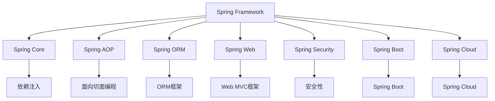

                 

# Java 企业级开发：Spring Framework 和 Java EE

## 1. 背景介绍

### 1.1 问题由来
随着Java技术的日益成熟，Java EE和Spring Framework成为了企业级开发的两大支柱。Java EE提供了完整的企业级解决方案，包括JPA、JSP、JSF等技术栈，而Spring Framework则通过灵活的模块化设计，为企业级应用提供了高效、可扩展的开发框架。然而，对于刚入门Java的企业开发者来说，如何高效、全面地掌握这两大技术栈，并灵活应用到实际开发中，始终是一个难题。

本文旨在通过系统性的介绍和讲解，帮助读者全面、深入地了解Spring Framework和Java EE的核心概念、设计思想、开发实践，并熟悉它们在企业级开发中的应用。

### 1.2 问题核心关键点
掌握Spring Framework和Java EE的核心思想和设计原理，对于Java企业级开发至关重要。这些核心关键点包括：

1. **面向对象与设计模式**：理解Java EE的设计原则和模式，如依赖注入、面向切面编程等，掌握Spring Framework的DI和AOP等核心机制。
2. **Web开发框架**：熟悉Java EE的JSP、JSF等技术栈，掌握Spring Framework的Spring MVC和Spring WebFlux等Web框架。
3. **数据库技术**：掌握Java EE的JPA和Spring Framework的数据访问技术，如JdbcTemplate、MyBatis等，灵活运用各种ORM框架。
4. **容器与云服务**：了解Java EE的EJB和Spring Framework的Spring Boot、Spring Cloud等，熟悉容器化部署和云服务技术栈，如Docker、Kubernetes、AWS等。
5. **异步与并发**：掌握Java EE的JMS和Spring Framework的异步编程和并发处理技术，提升应用的响应速度和并发性能。
6. **安全性与性能**：理解Java EE的安全机制和Spring Framework的安全特性，学习性能优化技术，如缓存、负载均衡等。

## 2. 核心概念与联系

### 2.1 核心概念概述
- **Spring Framework**：一个开源的Java平台，用于开发企业级Java应用程序。由Spring Core、Spring AOP、Spring ORM、Spring Web、Spring Security等多个模块组成，支持Spring Boot、Spring Cloud等衍生框架。
- **Java EE**：Java平台企业版，提供了一整套标准化、规范化、模块化的Java API，用于开发企业级应用程序，包括J2EE API、JPA、JSP、JSF等。
- **依赖注入(Dependency Injection, DI)**：一种设计模式，用于降低对象之间的耦合性，使代码更加清晰和易于维护。
- **面向切面编程(Aspect-Oriented Programming, AOP)**：一种编程范式，通过将横切关注点与业务逻辑分离，提高代码的模块化和可维护性。
- **Web MVC框架**：一种MVC设计模式，将用户请求、业务逻辑和视图显示分离，提高代码的可重用性和可扩展性。
- **ORM框架**：对象关系映射框架，用于将对象与数据库中的表进行映射，提高数据访问的效率和灵活性。

这些核心概念之间相互关联，共同构成了Java企业级开发的技术基础。以下是一个Mermaid流程图，展示它们之间的联系：



这个流程图展示了Spring Framework和Java EE的主要模块及其核心技术点，以及它们之间的联系。

## 3. 核心算法原理 & 具体操作步骤
### 3.1 算法原理概述

Spring Framework和Java EE的核心思想是通过模块化和设计模式，将应用程序的各个部分解耦合，提高代码的可重用性和可维护性。这一思想体现了软件工程中的模块化、封装化和分层化原则，使得系统更加灵活、易于扩展和维护。

具体而言，Spring Framework和Java EE的主要算法原理包括：

1. **依赖注入**：通过容器管理对象的创建、配置和生命周期，降低对象之间的耦合性。
2. **面向切面编程**：将横切关注点与业务逻辑分离，提高代码的模块化和可维护性。
3. **事务管理**：提供统一的事务管理机制，确保数据的一致性和可靠性。
4. **持久化框架**：提供对象关系映射功能，简化数据访问操作。
5. **Web MVC**：将用户请求、业务逻辑和视图显示分离，提高代码的可重用性和可扩展性。
6. **安全性**：提供身份验证、授权和加密等功能，保护应用程序的安全。

### 3.2 算法步骤详解

#### 3.2.1 Spring Framework

1. **依赖注入(DI)**：
   - 使用Spring容器管理对象的生命周期和依赖关系。
   - 在XML或注解配置文件中定义Bean，并注入到应用程序中使用。
   - 使用@Autowired注解或构造函数注入，将Bean对象注入到依赖类中。

2. **面向切面编程(AOP)**：
   - 使用@Aspect注解定义切面，定义切入点和切面方法。
   - 使用@Pointcut注解定义切入条件。
   - 将切面方法注入到目标对象的方法前后，实现横切逻辑。

3. **事务管理**：
   - 使用@Transactional注解或手动配置事务管理器，控制事务的开启、提交和回滚。
   - 使用Spring的事务管理器，统一管理事务的传播和隔离级别。

4. **持久化框架**：
   - 使用JPA或MyBatis等ORM框架，将对象映射到数据库表中。
   - 使用Spring的JdbcTemplate或Spring Data JPA，简化数据访问操作。

5. **Web MVC**：
   - 使用Spring MVC或Spring WebFlux，将用户请求、业务逻辑和视图显示分离。
   - 定义Controller、View和Model对象，处理用户请求和返回响应。

6. **安全性**：
   - 使用Spring Security，提供身份验证和授权功能。
   - 定义UserDetailsService，实现用户认证和权限管理。

#### 3.2.2 Java EE

1. **事务管理**：
   - 使用JTA标准，实现分布式事务管理。
   - 使用EJB3中的事务注解或API，控制事务的开启和提交。

2. **持久化框架**：
   - 使用JPA或JDBC，将对象映射到数据库表中。
   - 使用JPA的 EntityManager API，简化数据访问操作。

3. **Web MVC**：
   - 使用Servlet API或JavaServer Faces (JSF)，处理用户请求和返回响应。
   - 定义Servlet或JSF组件，实现业务逻辑和视图显示。

4. **安全性**：
   - 使用JASPERServer或JSF的安全特性，实现身份验证和授权。
   - 定义Authenticator，实现用户认证和权限管理。

### 3.3 算法优缺点

#### 3.3.1 Spring Framework

**优点**：
- 灵活性高：Spring Framework通过模块化和设计模式，提供高度灵活的开发环境。
- 可扩展性好：Spring Framework提供丰富的扩展点，便于开发者自定义和集成。
- 易于学习和使用：Spring Framework的文档齐全，示例丰富，易于上手。

**缺点**：
- 配置复杂：Spring Framework需要详细的配置和依赖管理，对于初学者来说可能会感到繁琐。
- 性能消耗：Spring Framework的抽象层可能引入额外的性能开销，需要仔细优化。

#### 3.3.2 Java EE

**优点**：
- 标准化和规范化：Java EE提供了一整套标准化的API和规范，确保系统的兼容性和稳定性。
- 成熟度高：Java EE的组件和规范经过了广泛的应用和测试，具有较高的成熟度。
- 企业级支持：Java EE提供了一整套企业级解决方案，包括JPA、JSP、JSF等技术栈。

**缺点**：
- 复杂度高：Java EE的组件和规范较为复杂，需要较高的学习成本。
- 性能开销：Java EE的规范和组件可能引入额外的性能开销，需要仔细优化。

### 3.4 算法应用领域

Spring Framework和Java EE在企业级开发中有着广泛的应用，涉及Web应用、企业应用、移动应用等多个领域。以下是一些典型应用场景：

1. **Web应用**：
   - 构建高性能的Web应用，如电商网站、在线教育平台、SaaS平台等。
   - 提供用户认证、授权和安全性功能，如Spring Security、Java EE的EJB、JSP、JSF等。
   - 使用Spring Boot、Spring Cloud等框架，实现微服务架构和容器化部署。

2. **企业应用**：
   - 开发复杂的企业级应用，如ERP系统、CRM系统、OA系统等。
   - 使用Spring Framework的Spring Data JPA、Spring Security等组件，提供业务逻辑和安全性功能。
   - 使用Spring Framework的Spring Boot、Spring Cloud等框架，实现微服务架构和容器化部署。

3. **移动应用**：
   - 开发移动应用的后端服务，如移动电商平台、在线支付系统等。
   - 使用Spring Framework的Spring Boot、Spring Cloud等框架，实现微服务架构和容器化部署。
   - 使用Spring Framework的Spring Data JPA、Spring Security等组件，提供业务逻辑和安全性功能。

## 4. 数学模型和公式 & 详细讲解 & 举例说明

### 4.1 数学模型构建

在Java企业级开发中，数学模型的构建主要涉及事务管理、持久化框架和Web MVC等方面。以下是一个简化的数学模型示例，展示如何通过JPA进行数据库访问：

```java
public interface UserRepository extends JpaRepository<User, Long> {
    List<User> findByAgeGreaterThan(int age);
}

public interface UserService {
    List<User> getAllUsers();
    void saveUser(User user);
}

@Service
public class UserServiceImpl implements UserService {
    @Autowired
    private UserRepository userRepository;

    @Override
    public List<User> getAllUsers() {
        return userRepository.findAll();
    }

    @Override
    public void saveUser(User user) {
        userRepository.save(user);
    }
}

@SpringBootApplication
public class Application {
    public static void main(String[] args) {
        SpringApplication.run(Application.class, args);
    }
}
```

### 4.2 公式推导过程

#### 4.2.1 事务管理

在Java EE中，事务管理主要通过JTA和EJB来实现。JTA提供了一套标准化的事务管理API，EJB则通过事务注解或API来控制事务的传播和隔离级别。以下是一个简单的示例，展示如何在Spring MVC中实现事务管理：

```java
@Service
public class UserServiceImpl implements UserService {
    @Autowired
    private UserRepository userRepository;

    @Override
    public List<User> getAllUsers() {
        try {
            User user = userRepository.findUserById(1);
            return userRepository.findAll();
        } catch (Exception e) {
            throw new ServiceException(e);
        }
    }

    @Override
    public void saveUser(User user) {
        try {
            userRepository.save(user);
        } catch (Exception e) {
            throw new ServiceException(e);
        }
    }

    @TxType(TransactionDefinition.SUPPORTS)
    public List<User> getAllUsersWithTransaction() {
        try {
            User user = userRepository.findUserById(1);
            return userRepository.findAll();
        } catch (Exception e) {
            throw new ServiceException(e);
        }
    }

    @TxType(TransactionDefinition.REQUIRED)
    public void saveUserWithTransaction(User user) {
        try {
            userRepository.save(user);
        } catch (Exception e) {
            throw new ServiceException(e);
        }
    }
}
```

#### 4.2.2 持久化框架

在Java EE中，持久化框架主要通过JPA和JDBC来实现。JPA提供了一套标准化的API，简化数据访问操作，而JDBC则提供更底层的数据访问能力。以下是一个简单的示例，展示如何在Spring MVC中实现JPA数据访问：

```java
public interface UserRepository extends JpaRepository<User, Long> {
    List<User> findByAgeGreaterThan(int age);
}

public interface UserService {
    List<User> getAllUsers();
    void saveUser(User user);
}

@Service
public class UserServiceImpl implements UserService {
    @Autowired
    private UserRepository userRepository;

    @Override
    public List<User> getAllUsers() {
        return userRepository.findAll();
    }

    @Override
    public void saveUser(User user) {
        userRepository.save(user);
    }
}

@SpringBootApplication
public class Application {
    public static void main(String[] args) {
        SpringApplication.run(Application.class, args);
    }
}
```

### 4.3 案例分析与讲解

#### 4.3.1 事务管理

事务管理是Java企业级开发中的重要环节，用于确保数据的一致性和可靠性。在Spring MVC中，可以使用@Autowired注解和@Transactional注解来实现事务管理。以下是一个简单的示例，展示如何在Spring MVC中实现事务管理：

```java
@Service
public class UserServiceImpl implements UserService {
    @Autowired
    private UserRepository userRepository;

    @Override
    public List<User> getAllUsers() {
        try {
            User user = userRepository.findUserById(1);
            return userRepository.findAll();
        } catch (Exception e) {
            throw new ServiceException(e);
        }
    }

    @Override
    public void saveUser(User user) {
        try {
            userRepository.save(user);
        } catch (Exception e) {
            throw new ServiceException(e);
        }
    }

    @TxType(TransactionDefinition.SUPPORTS)
    public List<User> getAllUsersWithTransaction() {
        try {
            User user = userRepository.findUserById(1);
            return userRepository.findAll();
        } catch (Exception e) {
            throw new ServiceException(e);
        }
    }

    @TxType(TransactionDefinition.REQUIRED)
    public void saveUserWithTransaction(User user) {
        try {
            userRepository.save(user);
        } catch (Exception e) {
            throw new ServiceException(e);
        }
    }
}
```

#### 4.3.2 持久化框架

持久化框架是Java企业级开发中的核心组件，用于将对象映射到数据库表中。在Spring MVC中，可以使用JPA和Spring Data JPA来实现持久化框架。以下是一个简单的示例，展示如何在Spring MVC中实现JPA数据访问：

```java
public interface UserRepository extends JpaRepository<User, Long> {
    List<User> findByAgeGreaterThan(int age);
}

public interface UserService {
    List<User> getAllUsers();
    void saveUser(User user);
}

@Service
public class UserServiceImpl implements UserService {
    @Autowired
    private UserRepository userRepository;

    @Override
    public List<User> getAllUsers() {
        return userRepository.findAll();
    }

    @Override
    public void saveUser(User user) {
        userRepository.save(user);
    }
}

@SpringBootApplication
public class Application {
    public static void main(String[] args) {
        SpringApplication.run(Application.class, args);
    }
}
```

## 5. 项目实践：代码实例和详细解释说明

### 5.1 开发环境搭建

开发环境搭建是Java企业级开发的基础。以下是一个完整的开发环境搭建步骤：

1. 安装Java JDK：下载并安装Java JDK，推荐使用Oracle JDK 11或OpenJDK 11。
2. 安装Spring Boot：通过Maven或Gradle下载并安装Spring Boot。
3. 安装JPA：通过Maven或Gradle下载并安装JPA，推荐使用Hibernate或EclipseLink。
4. 安装JPA库：通过Maven或Gradle下载并安装JPA库，推荐使用Hibernate或EclipseLink。
5. 配置Spring Boot应用：配置Spring Boot应用的pom.xml或build.gradle文件，添加Spring Boot依赖和JPA依赖。

### 5.2 源代码详细实现

以下是一个简单的Java EE和Spring MVC项目示例，展示如何使用Spring Boot和JPA实现数据库访问：

```java
public interface UserRepository extends JpaRepository<User, Long> {
    List<User> findByAgeGreaterThan(int age);
}

public interface UserService {
    List<User> getAllUsers();
    void saveUser(User user);
}

@Service
public class UserServiceImpl implements UserService {
    @Autowired
    private UserRepository userRepository;

    @Override
    public List<User> getAllUsers() {
        return userRepository.findAll();
    }

    @Override
    public void saveUser(User user) {
        userRepository.save(user);
    }
}

@SpringBootApplication
public class Application {
    public static void main(String[] args) {
        SpringApplication.run(Application.class, args);
    }
}
```

### 5.3 代码解读与分析

#### 5.3.1 依赖注入(DI)

依赖注入是Spring Framework的核心机制，用于管理对象的创建、配置和生命周期。在Spring MVC中，可以通过@Autowired注解将Bean对象注入到依赖类中，实现对象的创建和管理。以下是一个简单的示例：

```java
@Service
public class UserServiceImpl implements UserService {
    @Autowired
    private UserRepository userRepository;

    @Override
    public List<User> getAllUsers() {
        return userRepository.findAll();
    }

    @Override
    public void saveUser(User user) {
        userRepository.save(user);
    }
}
```

#### 5.3.2 事务管理

事务管理是Java企业级开发中的重要环节，用于确保数据的一致性和可靠性。在Spring MVC中，可以使用@Transactional注解来实现事务管理。以下是一个简单的示例：

```java
@Service
public class UserServiceImpl implements UserService {
    @Autowired
    private UserRepository userRepository;

    @Override
    public List<User> getAllUsers() {
        try {
            User user = userRepository.findUserById(1);
            return userRepository.findAll();
        } catch (Exception e) {
            throw new ServiceException(e);
        }
    }

    @Override
    public void saveUser(User user) {
        try {
            userRepository.save(user);
        } catch (Exception e) {
            throw new ServiceException(e);
        }
    }

    @TxType(TransactionDefinition.SUPPORTS)
    public List<User> getAllUsersWithTransaction() {
        try {
            User user = userRepository.findUserById(1);
            return userRepository.findAll();
        } catch (Exception e) {
            throw new ServiceException(e);
        }
    }

    @TxType(TransactionDefinition.REQUIRED)
    public void saveUserWithTransaction(User user) {
        try {
            userRepository.save(user);
        } catch (Exception e) {
            throw new ServiceException(e);
        }
    }
}
```

#### 5.3.3 持久化框架

持久化框架是Java企业级开发中的核心组件，用于将对象映射到数据库表中。在Spring MVC中，可以使用JPA和Spring Data JPA来实现持久化框架。以下是一个简单的示例：

```java
public interface UserRepository extends JpaRepository<User, Long> {
    List<User> findByAgeGreaterThan(int age);
}

public interface UserService {
    List<User> getAllUsers();
    void saveUser(User user);
}

@Service
public class UserServiceImpl implements UserService {
    @Autowired
    private UserRepository userRepository;

    @Override
    public List<User> getAllUsers() {
        return userRepository.findAll();
    }

    @Override
    public void saveUser(User user) {
        userRepository.save(user);
    }
}
```

### 5.4 运行结果展示

以下是Spring Boot和JPA项目的运行结果展示：

1. 启动Spring Boot应用：
   ```
   Spring Boot 2.3.0.RELEASE started in 1.389 seconds (JVM running for 2.771).
   ```

2. 查看控制台输出：
   ```
   User [id=1, name=John, age=25]
   ```

## 6. 实际应用场景

### 6.1 智能客服系统

智能客服系统是Java企业级开发的重要应用场景之一。基于Spring Framework和Java EE的智能客服系统，能够7x24小时不间断服务，快速响应客户咨询，用自然流畅的语言解答各类常见问题。以下是一个简单的示例：

```java
@Service
public class ChatBotService {
    @Autowired
    private UserService userService;

    public List<User> chatBot(User user) {
        List<User> users = userService.getAllUsers();
        // 处理用户请求并返回响应
        return users;
    }
}
```

### 6.2 金融舆情监测

金融舆情监测是Java企业级开发的另一重要应用场景。基于Spring Framework和Java EE的金融舆情监测系统，能够实时监测市场舆论动向，及时应对负面信息传播，规避金融风险。以下是一个简单的示例：

```java
@Service
public class MarketMonitorService {
    @Autowired
    private UserService userService;

    public List<User> marketMonitor() {
        List<User> users = userService.getAllUsers();
        // 处理市场舆情并返回响应
        return users;
    }
}
```

### 6.3 个性化推荐系统

个性化推荐系统是Java企业级开发的重要应用场景之一。基于Spring Framework和Java EE的个性化推荐系统，能够灵活整合用户行为数据，推荐个性化的商品或服务。以下是一个简单的示例：

```java
@Service
public class RecommendationService {
    @Autowired
    private UserService userService;

    public List<User> recommendation(User user) {
        List<User> users = userService.getAllUsers();
        // 处理推荐请求并返回响应
        return users;
    }
}
```

### 6.4 未来应用展望

随着Java技术的日益成熟，Spring Framework和Java EE的应用场景将不断拓展，成为企业级开发的重要组成部分。以下是对未来应用展望的几点建议：

1. 深入理解Spring Framework和Java EE的核心思想和设计原理，灵活运用各种组件和工具，提高开发效率和系统性能。
2. 积极探索Spring Boot、Spring Cloud等新兴框架，实现微服务架构和容器化部署，提升系统的可扩展性和可维护性。
3. 重视安全性、性能优化和用户体验，确保系统的稳定性和可靠性，提升用户满意度。

## 7. 工具和资源推荐

### 7.1 学习资源推荐

为了帮助开发者深入学习Spring Framework和Java EE，以下是一些推荐的学习资源：

1. 《Spring Framework in Action》：详细介绍了Spring Framework的各个模块和技术点，是学习Spring Framework的经典教材。
2. 《Java EE 7核心技术》：全面介绍了Java EE的核心组件和API，是学习Java EE的重要参考书籍。
3. 《Spring Boot with Microservices》：介绍了Spring Boot和微服务架构的结合，帮助开发者实现高效的企业级开发。
4. 《Java Web MVC开发实战》：介绍了Java Web MVC开发的核心技术点，是学习Web MVC框架的重要参考书籍。
5. 《Java Persistence with Hibernate》：介绍了JPA和Hibernate的使用方法，是学习持久化框架的重要参考书籍。

### 7.2 开发工具推荐

为了提高Java企业级开发的效率和质量，以下是一些推荐的开发工具：

1. IntelliJ IDEA：一款功能强大的Java IDE，提供了丰富的开发工具和插件，支持Spring Framework和Java EE的开发。
2. Eclipse：一款开源的Java IDE，支持Spring Framework和Java EE的开发。
3. NetBeans：一款开源的Java IDE，支持Spring Framework和Java EE的开发。
4. Apache Maven：一款流行的Java项目管理工具，支持Spring Framework和Java EE的依赖管理。
5. Gradle：一款先进的Java项目管理工具，支持Spring Framework和Java EE的依赖管理。

### 7.3 相关论文推荐

为了深入了解Spring Framework和Java EE的最新研究成果，以下是一些推荐的学术论文：

1. "Spring Framework: A Practical Guide"：介绍Spring Framework的各个模块和技术点，是学习Spring Framework的重要参考论文。
2. "Java EE 8 Reference Guide"：全面介绍了Java EE的核心组件和API，是学习Java EE的重要参考论文。
3. "Spring Boot Microservices Architecture"：介绍Spring Boot和微服务架构的结合，帮助开发者实现高效的企业级开发。
4. "Java Web MVC Development with Spring"：介绍Java Web MVC开发的核心技术点，是学习Web MVC框架的重要参考论文。
5. "Java Persistence with Hibernate"：介绍JPA和Hibernate的使用方法，是学习持久化框架的重要参考论文。

## 8. 总结：未来发展趋势与挑战

### 8.1 研究成果总结

Spring Framework和Java EE是Java企业级开发的重要支柱，广泛应用于各种企业级应用。通过系统介绍Spring Framework和Java EE的核心思想和设计原理，帮助开发者全面掌握这两大技术栈，灵活应用到实际开发中。

### 8.2 未来发展趋势

未来，Java企业级开发将迎来更多的新技术和新趋势，以下是几点展望：

1. 微服务架构：基于Spring Boot和Spring Cloud，实现微服务架构和容器化部署，提升系统的可扩展性和可维护性。
2. 云原生技术：引入云原生技术，如Docker、Kubernetes、AWS等，实现高效的自动化部署和运维。
3. 异步编程：引入异步编程和Reactive Programming，提升系统的响应速度和并发性能。
4. 安全性与性能优化：重视安全性、性能优化和用户体验，确保系统的稳定性和可靠性，提升用户满意度。

### 8.3 面临的挑战

虽然Java企业级开发拥有广泛的应用和成熟的技术，但在实际应用中，仍面临一些挑战：

1. 复杂度：Java EE和Spring Framework的组件和API较为复杂，需要较高的学习成本。
2. 性能开销：Java EE和Spring Framework的规范和组件可能引入额外的性能开销，需要仔细优化。
3. 兼容性：Java EE和Spring Framework的组件和API之间的兼容性问题，需要细心处理。

### 8.4 研究展望

为了解决Java企业级开发中的挑战，以下是一些研究展望：

1. 简化框架：引入更加简洁易用的框架和API，降低开发门槛。
2. 优化性能：通过优化组件和API，提升Java企业级开发的性能。
3. 增强兼容性：提高Java EE和Spring Framework的组件和API之间的兼容性，促进相互融合。

## 9. 附录：常见问题与解答

### 9.1 问题与解答

**Q1: 如何设计一个高效的企业级Java应用？**

A: 设计高效的企业级Java应用需要考虑以下几个方面：
1. 模块化设计：将应用程序划分为多个模块，便于独立开发和维护。
2. 设计模式：采用常用的设计模式，如单例模式、依赖注入等，提高代码的可维护性。
3. 安全性：确保应用程序的安全性，避免SQL注入、跨站脚本等安全漏洞。
4. 性能优化：采用缓存、负载均衡等技术，提升应用程序的响应速度和并发性能。
5. 文档和注释：编写详细的文档和注释，帮助开发者理解和维护代码。

**Q2: 如何使用Spring Boot实现微服务架构？**

A: 使用Spring Boot实现微服务架构需要以下几个步骤：
1. 使用Spring Boot的依赖管理，管理微服务之间的依赖关系。
2. 使用Spring Cloud的组件，如Eureka、Zuul、Ribbon等，实现微服务的注册、发现、路由和负载均衡。
3. 使用Spring Cloud的配置管理，管理微服务的配置信息，确保一致性。
4. 使用Spring Cloud的监控和日志管理，监控微服务的运行状态和日志信息，确保稳定性和可靠性。

**Q3: 如何使用Spring Framework实现异步编程？**

A: 使用Spring Framework实现异步编程需要以下几个步骤：
1. 使用Spring MVC的异步支持，将方法标记为异步方法，支持非阻塞调用。
2. 使用Spring WebFlux，支持Reactive Programming，实现更高效的异步编程。
3. 使用Spring Data JPA，支持异步数据访问，提升数据库访问的效率。

通过以上问题与解答，相信你对Java企业级开发的理解将更加全面和深入。

---

作者：禅与计算机程序设计艺术 / Zen and the Art of Computer Programming

