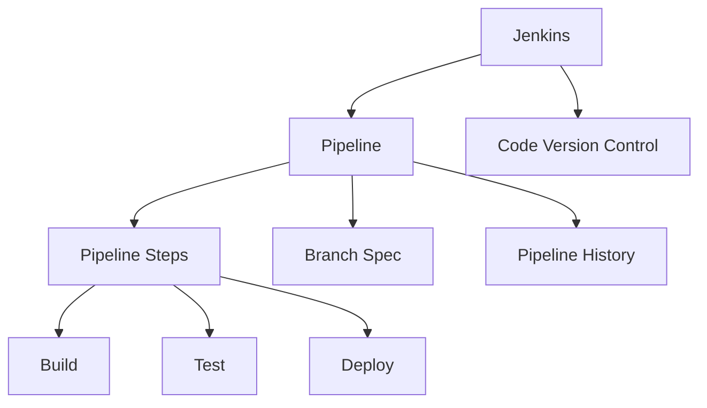

                 

# Jenkins Pipeline脚本开发

## 1. 背景介绍

### 1.1 问题由来

随着软件开发的复杂度不断提升，项目管理变得日益繁琐，传统的项目管理工具如JIRA、Trello等逐渐显露出其局限性。这其中，持续集成/持续部署（Continuous Integration/Continuous Deployment, CI/CD）的自动化流程设计和管理成为软件开发中不可或缺的一部分。

在过去十年间，Jenkins逐渐成为最流行的开源持续集成工具。其灵活性、易用性以及广泛的插件支持，使得Jenkins成为构建自动化测试、集成、部署等流程的首选。但是，随着项目的规模和复杂度的增长，Jenkins的配置和维护变得复杂和耗时。这时，Jenkins Pipeline就应运而生，其采用脚本化的方式简化流程管理，使得Jenkins的配置和维护变得更加高效和可靠。

### 1.2 问题核心关键点

Jenkins Pipeline的核心思想是将项目的整个构建、测试、部署过程脚本化，利用Jenkins的流水线（Pipeline）功能，自动化地执行这些流程。其关键点包括：

1. 脚本化管理流程：Jenkins Pipeline以Pipeline作为编程框架，可以自动化构建、测试和部署流程。
2. 代码版本控制：通过Git或其他版本控制系统来管理代码版本，自动获取代码。
3. 执行器与插件：Jenkins Pipeline通过执行器（stage）来描述流程步骤，通过插件（pipeline steps）来丰富功能。
4. 多分支流水线：通过分支控制（branch spec）来管理不同分支的流水线执行。
5. 持久化记录：所有流水线执行记录都将被持久化，便于分析和回溯。

## 2. 核心概念与联系

### 2.1 核心概念概述

为更好地理解Jenkins Pipeline脚本开发，本节将介绍几个密切相关的核心概念：

- Jenkins：开源持续集成工具，支持持续集成/持续部署流程的设计和管理。
- Pipeline：Jenkins提供的编程框架，用于描述流程，自动化地执行各种任务。
- Pipeline步骤（Pipeline Steps）：Pipeline中的基本执行单元，包含各种功能如构建、测试、部署等。
- 流水线（Pipeline）：由一系列Pipeline步骤组成的流程，用于描述项目构建、测试、部署等过程。
- 分支控制（Branch Spec）：用于管理不同分支的流水线执行，可配置不同的分支策略。
- 持久化记录（Pipeline History）：Jenkins Pipeline将流水线执行记录持久化，便于分析和回溯。

这些核心概念之间的逻辑关系可以通过以下Mermaid流程图来展示：



这个流程图展示了大语言模型的核心概念及其之间的关系：

1. Jenkins作为整个流程的执行引擎，负责管理代码、配置流水线、执行Pipeline等。
2. Pipeline是Jenkins提供的编程框架，是整个流程的设计和执行的核心。
3. Pipeline步骤（Pipeline Steps）是Pipeline中具体的执行单元，包含了构建、测试、部署等任务。
4. 流水线（Pipeline）由一系列Pipeline步骤组成，描述了项目的构建、测试、部署等流程。
5. 分支控制（Branch Spec）用于管理不同分支的流水线执行，可以配置不同的分支策略。
6. 持久化记录（Pipeline History）用于持久化流水线执行记录，便于分析和回溯。

这些核心概念共同构成了Jenkins Pipeline脚本开发的框架，使其能够高效地自动化管理软件开发流程。

## 3. 核心算法原理 & 具体操作步骤

### 3.1 算法原理概述

Jenkins Pipeline脚本开发基于Pipeline的工作原理，其核心算法原理为“脚本化流程描述”。该原理指出，任何复杂的自动化流程都可以通过一系列的Pipeline步骤来描述，每个步骤可以是构建、测试、部署、发布等任何具体任务。

通过将项目构建、测试、部署等过程脚本化，Jenkins Pipeline能够自动地、持续地执行这些任务，大大提高了项目管理的效率和可靠性。

### 3.2 算法步骤详解

Jenkins Pipeline脚本开发的步骤包括以下几个关键部分：

**Step 1: 配置Jenkins**

1. 安装Jenkins：确保Jenkins已经安装并运行在服务器上。

2. 安装Pipeline插件：打开Jenkins的管理界面，进入插件管理，搜索并安装Pipeline插件。

**Step 2: 编写Pipeline脚本**

1. 创建Pipeline配置：打开Jenkins的管理界面，进入New Pipeline配置。

2. 编写Pipeline脚本：在Pipeline配置界面中，使用Pipeline Script语法编写Pipeline脚本。

3. 脚本示例：
```groovy
pipeline {
    agent any
    
    stages {
        stage('构建') {
            steps {
                // 构建步骤
            }
        }
        stage('测试') {
            steps {
                // 测试步骤
            }
        }
        stage('部署') {
            steps {
                // 部署步骤
            }
        }
    }
}
```

4. 保存Pipeline脚本：点击Save，保存Pipeline脚本。

**Step 3: 测试Pipeline**

1. 执行Pipeline：点击Build Now按钮，执行Pipeline。

2. 查看Pipeline执行结果：在Pipeline执行结果页面查看Pipeline的执行状态和日志。

**Step 4: 部署Pipeline**

1. 配置分支控制：在Pipeline配置界面中，配置分支控制策略。

2. 部署Pipeline：在Pipeline配置界面中，配置Pipeline的部署策略。

3. 保存Pipeline配置：点击Save，保存Pipeline配置。

4. 测试Pipeline部署：点击Build Now按钮，执行Pipeline，检查部署结果。

**Step 5: 持久化Pipeline记录**

1. 查看Pipeline历史记录：在Pipeline历史记录页面查看Pipeline的执行记录。

2. 分析和回溯Pipeline历史记录：使用Pipeline历史记录进行分析，找到问题并进行回溯。

### 3.3 算法优缺点

Jenkins Pipeline脚本开发有以下优点：

1. 自动化：Pipeline能够自动化执行构建、测试、部署等任务，提高工作效率。
2. 可维护性：Pipeline脚本的编写和维护比传统配置管理更加方便和灵活。
3. 扩展性：Pipeline步骤和执行器具有高度的扩展性，能够根据项目需求添加新的功能和步骤。
4. 可靠性：Pipeline的执行记录被持久化，便于分析和回溯，提高系统的可靠性。

同时，该方法也存在一些缺点：

1. 学习成本：初学者需要花时间学习Pipeline脚本语法和Jenkins的使用方法。
2. 依赖Jenkins：Pipeline依赖Jenkins来实现，一旦Jenkins出现故障，Pipeline也无法正常运行。
3. 脚本复杂：复杂项目可能需要编写复杂的Pipeline脚本，增加开发难度。
4. 版本控制依赖：Pipeline脚本依赖版本控制系统来管理代码，版本控制系统的限制会影响Pipeline的灵活性。

### 3.4 算法应用领域

Jenkins Pipeline脚本开发在软件开发项目中得到了广泛的应用，特别是在大型软件开发项目中，其高效和灵活的特点使得其成为项目管理和持续集成/持续部署的首选工具。Jenkins Pipeline已经被广泛应用于以下领域：

- 软件开发：用于管理代码构建、测试、部署等流程。
- 持续集成：自动化构建和测试，提高开发效率。
- 持续部署：自动化部署代码，减少人工干预，提高部署效率。
- 自动化测试：自动化执行单元测试、集成测试、性能测试等。
- 部署和发布：自动化部署新版本，发布新功能，提高发布效率。
- 分支管理：管理不同分支的流水线执行，确保分支的独立性和并行性。
- 代码审计：通过Pipeline历史记录进行代码审计和问题回溯。

## 4. 数学模型和公式 & 详细讲解 & 举例说明

### 4.1 数学模型构建

Jenkins Pipeline脚本开发基于Pipeline的工作原理，其核心算法原理为“脚本化流程描述”。该原理指出，任何复杂的自动化流程都可以通过一系列的Pipeline步骤来描述，每个步骤可以是构建、测试、部署等任何具体任务。

### 4.2 公式推导过程

假设一个简单的Pipeline流程由三个步骤组成：构建（Build）、测试（Test）、部署（Deploy）。在Pipeline脚本中，每个步骤可以表示为一个Pipeline步骤，如下所示：

```groovy
pipeline {
    agent any
    
    stages {
        stage('构建') {
            steps {
                // 构建步骤
            }
        }
        stage('测试') {
            steps {
                // 测试步骤
            }
        }
        stage('部署') {
            steps {
                // 部署步骤
            }
        }
    }
}
```

### 4.3 案例分析与讲解

以一个简单的Java项目为例，使用Jenkins Pipeline进行自动化构建、测试和部署：

**Step 1: 配置Jenkins**

1. 安装Jenkins：确保Jenkins已经安装并运行在服务器上。

2. 安装Pipeline插件：打开Jenkins的管理界面，进入插件管理，搜索并安装Pipeline插件。

**Step 2: 编写Pipeline脚本**

1. 创建Pipeline配置：打开Jenkins的管理界面，进入New Pipeline配置。

2. 编写Pipeline脚本：在Pipeline配置界面中，使用Pipeline Script语法编写Pipeline脚本。

3. 脚本示例：
```groovy
pipeline {
    agent any
    
    stages {
        stage('构建') {
            steps {
                // 构建步骤
                sh 'mvn clean install'
            }
        }
        stage('测试') {
            steps {
                // 测试步骤
                sh 'mvn test'
            }
        }
        stage('部署') {
            steps {
                // 部署步骤
                sh 'mvn spring-boot:run'
            }
        }
    }
}
```

**Step 3: 测试Pipeline**

1. 执行Pipeline：点击Build Now按钮，执行Pipeline。

2. 查看Pipeline执行结果：在Pipeline执行结果页面查看Pipeline的执行状态和日志。

**Step 4: 部署Pipeline**

1. 配置分支控制：在Pipeline配置界面中，配置分支控制策略。

2. 部署Pipeline：在Pipeline配置界面中，配置Pipeline的部署策略。

3. 保存Pipeline配置：点击Save，保存Pipeline配置。

4. 测试Pipeline部署：点击Build Now按钮，执行Pipeline，检查部署结果。

**Step 5: 持久化Pipeline记录**

1. 查看Pipeline历史记录：在Pipeline历史记录页面查看Pipeline的执行记录。

2. 分析和回溯Pipeline历史记录：使用Pipeline历史记录进行分析，找到问题并进行回溯。

## 5. 项目实践：代码实例和详细解释说明

### 5.1 开发环境搭建

在进行Pipeline实践前，我们需要准备好开发环境。以下是使用Jenkins搭建开发环境的流程：

1. 安装Jenkins：从官网下载并安装Jenkins，确保Jenkins已经安装并运行在服务器上。

2. 安装Pipeline插件：打开Jenkins的管理界面，进入插件管理，搜索并安装Pipeline插件。

3. 配置Jenkins：进入Jenkins的配置界面，进行必要的配置，如设置Jenkins服务器的管理员账号、密码等。

4. 安装Docker：Jenkins Pipeline支持Docker容器化部署，确保服务器上已经安装Docker。

5. 创建Pipeline配置：打开Jenkins的管理界面，进入New Pipeline配置。

### 5.2 源代码详细实现

下面我们以Java项目为例，给出使用Pipeline进行自动化构建、测试和部署的Pipeline脚本实现。

```groovy
pipeline {
    agent any
    
    stages {
        stage('构建') {
            steps {
                sh 'mvn clean install'
            }
        }
        stage('测试') {
            steps {
                sh 'mvn test'
            }
        }
        stage('部署') {
            steps {
                sh 'mvn spring-boot:run'
            }
        }
    }
}
```

**代码解释：**

1. `agent any`：指定Pipeline执行的环境，可以是任何Jenkins节点，由Jenkins动态分配。

2. `stage`：定义Pipeline的阶段，每个阶段包含一组Pipeline步骤。

3. `steps`：定义每个阶段的具体步骤，如构建、测试、部署等。

4. `sh`：执行Shell命令，可以执行任何系统命令。

5. `mvn clean install`：执行Maven的构建命令，生成安装包。

6. `mvn test`：执行Maven的测试命令，生成测试报告。

7. `mvn spring-boot:run`：执行Spring Boot的部署命令，启动应用。

### 5.3 代码解读与分析

让我们再详细解读一下关键代码的实现细节：

**Pipeline配置：**

- `pipeline`：定义整个Pipeline的语法结构，包含`agent`、`stages`、`post`等关键字。
- `agent any`：指定Pipeline执行的环境，可以是任何Jenkins节点，由Jenkins动态分配。
- `stages`：定义Pipeline的阶段，每个阶段包含一组Pipeline步骤。
- `stage`：定义Pipeline的阶段，可以包含多个Pipeline步骤。
- `steps`：定义每个阶段的具体步骤，如构建、测试、部署等。
- `sh`：执行Shell命令，可以执行任何系统命令。

**Pipeline步骤：**

- `sh 'mvn clean install'`：执行Maven的构建命令，生成安装包。
- `sh 'mvn test'`：执行Maven的测试命令，生成测试报告。
- `sh 'mvn spring-boot:run'`：执行Spring Boot的部署命令，启动应用。

**Pipeline执行：**

- 在Jenkins的管理界面中，创建Pipeline配置。
- 编写Pipeline脚本，指定构建、测试、部署等步骤。
- 保存Pipeline脚本。
- 点击Build Now按钮，执行Pipeline。
- 查看Pipeline执行结果，进行日志分析。

### 5.4 运行结果展示

Pipeline执行的结果将在Jenkins的Pipeline执行结果页面展示，包括构建、测试、部署等步骤的执行状态、日志信息和输出结果。

## 6. 实际应用场景

### 6.1 软件开发

Jenkins Pipeline脚本开发在软件开发中得到了广泛的应用，特别是在大型软件开发项目中，其高效和灵活的特点使得其成为项目管理和持续集成/持续部署的首选工具。

**案例1：Java项目构建和测试**

一个Java项目可以使用Pipeline自动化构建和测试，通过`mvn clean install`命令构建项目，通过`mvn test`命令执行测试，生成测试报告。这大大提高了项目的开发效率，减少了人工操作的繁琐。

**案例2：Spring Boot部署**

一个Spring Boot应用可以使用Pipeline自动化部署，通过`mvn spring-boot:run`命令启动应用，自动部署到服务器上。这减少了部署过程中的手动操作，提高了部署的准确性和效率。

### 6.2 持续集成

Jenkins Pipeline脚本开发广泛应用于持续集成领域，通过自动化构建、测试和部署，提高了软件开发的速度和质量。

**案例1：自动化构建**

在持续集成中，Jenkins Pipeline脚本可以自动执行构建任务，生成安装包，避免了手动构建的繁琐和错误。

**案例2：自动化测试**

在持续集成中，Jenkins Pipeline脚本可以自动执行测试任务，生成测试报告，避免了手动测试的繁琐和错误。

### 6.3 持续部署

Jenkins Pipeline脚本开发广泛应用于持续部署领域，通过自动化部署新代码，提高了部署的速度和效率。

**案例1：部署Java应用**

在持续部署中，Jenkins Pipeline脚本可以自动执行部署任务，将新代码部署到服务器上，避免了手动部署的繁琐和错误。

**案例2：部署Spring Boot应用**

在持续部署中，Jenkins Pipeline脚本可以自动执行部署任务，将Spring Boot应用部署到服务器上，避免了手动部署的繁琐和错误。

### 6.4 自动化测试

Jenkins Pipeline脚本开发广泛应用于自动化测试领域，通过自动化执行测试任务，提高了测试的速度和效率。

**案例1：单元测试**

在自动化测试中，Jenkins Pipeline脚本可以自动执行单元测试，生成测试报告，避免了手动测试的繁琐和错误。

**案例2：集成测试**

在自动化测试中，Jenkins Pipeline脚本可以自动执行集成测试，生成测试报告，避免了手动测试的繁琐和错误。

### 6.5 部署和发布

Jenkins Pipeline脚本开发广泛应用于部署和发布领域，通过自动化部署新代码，提高了部署的速度和效率。

**案例1：部署Java应用**

在部署和发布中，Jenkins Pipeline脚本可以自动执行部署任务，将新代码部署到服务器上，避免了手动部署的繁琐和错误。

**案例2：部署Spring Boot应用**

在部署和发布中，Jenkins Pipeline脚本可以自动执行部署任务，将Spring Boot应用部署到服务器上，避免了手动部署的繁琐和错误。

### 6.6 分支管理

Jenkins Pipeline脚本开发广泛应用于分支管理领域，通过自动化控制分支的构建、测试和部署，提高了分支管理的效率和准确性。

**案例1：分支构建**

在分支管理中，Jenkins Pipeline脚本可以自动控制分支的构建任务，生成安装包，避免了手动构建的繁琐和错误。

**案例2：分支测试**

在分支管理中，Jenkins Pipeline脚本可以自动控制分支的测试任务，生成测试报告，避免了手动测试的繁琐和错误。

## 7. 工具和资源推荐

### 7.1 学习资源推荐

为了帮助开发者系统掌握Jenkins Pipeline脚本开发的技术基础和实践技巧，这里推荐一些优质的学习资源：

1. Jenkins Pipeline官方文档：Jenkins提供的官方文档，详细介绍了Pipeline的语法和用法。

2. Jenkins Pipeline书籍：《Jenkins Pipeline实战指南》，详细介绍了Pipeline的实战应用，包括自动化构建、测试、部署等。

3. Jenkins Pipeline教程：各大在线教程平台提供的Pipeline教程，如Udemy、Coursera等。

4. Jenkins Pipeline案例：GitHub等平台上开源的Pipeline案例，提供了丰富的实践参考。

5. Jenkins Pipeline插件：Jenkins官方提供的Pipeline插件，丰富了Pipeline的功能和应用场景。

通过对这些资源的学习实践，相信你一定能够快速掌握Jenkins Pipeline脚本开发的精髓，并用于解决实际的开发问题。

### 7.2 开发工具推荐

Jenkins Pipeline脚本开发需要使用Jenkins和Pipeline插件，以下是几款用于Pipeline开发的常用工具：

1. Jenkins：开源持续集成工具，支持Pipeline的设计和管理。

2. Pipeline插件：Jenkins提供的Pipeline插件，用于扩展Pipeline的功能。

3. Pipeline脚本编辑器：如Jenkins提供的Pipeline脚本编辑器，用于编写Pipeline脚本。

4. Docker：Jenkins Pipeline支持Docker容器化部署，确保Pipeline的稳定性和可移植性。

5. Git：Jenkins Pipeline支持Git版本控制，用于管理代码版本。

6. Maven：Jenkins Pipeline支持Maven构建工具，用于执行构建任务。

7. Spring Boot：Jenkins Pipeline支持Spring Boot应用，用于自动化部署。

合理利用这些工具，可以显著提升Jenkins Pipeline脚本开发的效率和可靠性，加快创新迭代的步伐。

### 7.3 相关论文推荐

Jenkins Pipeline脚本开发的研究源于学界的持续研究。以下是几篇奠基性的相关论文，推荐阅读：

1. "Jenkins Pipeline: A Simple and Flexible Pipeline Extension to Jenkins"（Jenkins Pipeline的简单和灵活的扩展）：介绍了Pipeline的语法和用法，描述了Pipeline的扩展机制。

2. "Continuous Integration with Jenkins Pipeline"（使用Jenkins Pipeline进行持续集成）：介绍了Pipeline在持续集成中的应用，描述了Pipeline的自动化构建和测试过程。

3. "Pipeline-as-Code for Continuous Delivery"（使用Pipeline as Code进行持续交付）：介绍了Pipeline as Code的原理和实现，描述了Pipeline的自动化部署和发布过程。

4. "Pipeline as Code: A New Way to Declare Infrastructure in Jenkins"（Pipeline as Code：一种新的声明Jenkins基础设施的方式）：介绍了Pipeline as Code的原理和实现，描述了Pipeline的自动化配置和运维过程。

这些论文代表了大语言模型微调技术的发展脉络。通过学习这些前沿成果，可以帮助研究者把握学科前进方向，激发更多的创新灵感。

## 8. 总结：未来发展趋势与挑战

### 8.1 总结

本文对Jenkins Pipeline脚本开发进行了全面系统的介绍。首先阐述了Pipeline脚本开发的背景和意义，明确了Pipeline在项目构建、测试、部署等过程中的重要价值。其次，从原理到实践，详细讲解了Pipeline脚本开发的数学原理和关键步骤，给出了Pipeline脚本开发的完整代码实例。同时，本文还广泛探讨了Pipeline脚本开发在软件开发、持续集成、持续部署、自动化测试等多个领域的应用前景，展示了Pipeline脚本开发的巨大潜力。此外，本文精选了Pipeline脚本开发的各类学习资源，力求为读者提供全方位的技术指引。

通过本文的系统梳理，可以看到，Jenkins Pipeline脚本开发在软件开发项目中已经广泛应用，其高效和灵活的特点使得其成为项目管理和持续集成/持续部署的首选工具。未来，伴随Pipeline脚本开发技术的发展，Pipeline将更深入地融入软件开发流程中，提升开发效率和项目质量。

### 8.2 未来发展趋势

展望未来，Jenkins Pipeline脚本开发将呈现以下几个发展趋势：

1. 多云和容器化部署：Pipeline将支持更多云平台和容器化部署，提高部署的灵活性和效率。

2. 持续集成/持续部署（CI/CD）自动化：Pipeline将进一步深入CI/CD流程，自动化构建、测试、部署、发布等任务。

3. 声明式管理：Pipeline将支持声明式管理，简化配置，提高可维护性。

4. 更加灵活的插件支持：Pipeline将支持更多插件和扩展，丰富功能，提高适用性。

5. 自动化测试和部署：Pipeline将支持自动化测试和部署，提高测试和部署的速度和效率。

6. 持续学习和优化：Pipeline将支持持续学习和优化，动态调整配置，提高性能。

以上趋势凸显了Jenkins Pipeline脚本开发技术的广阔前景。这些方向的探索发展，必将进一步提升Jenkins Pipeline的灵活性和自动化程度，为软件开发和项目管理的自动化进程提供强有力的支持。

### 8.3 面临的挑战

尽管Jenkins Pipeline脚本开发技术已经取得了瞩目成就，但在迈向更加智能化、普适化应用的过程中，它仍面临着诸多挑战：

1. 学习曲线：初学者需要花时间学习Pipeline脚本语法和Jenkins的使用方法。

2. 依赖Jenkins：Pipeline依赖Jenkins来实现，一旦Jenkins出现故障，Pipeline也无法正常运行。

3. 脚本复杂：复杂项目可能需要编写复杂的Pipeline脚本，增加开发难度。

4. 版本控制依赖：Pipeline脚本依赖版本控制系统来管理代码，版本控制系统的限制会影响Pipeline的灵活性。

5. 自动化程度有待提高：尽管Pipeline支持自动化构建、测试和部署，但其自动化程度仍有提升空间。

6. 社区支持和生态系统：尽管Jenkins社区活跃，但Pipeline的社区支持和生态系统仍需进一步发展。

正视Pipeline脚本开发面临的这些挑战，积极应对并寻求突破，将使Pipeline脚本开发技术更加成熟，为软件开发和项目管理的自动化进程提供更加可靠的支持。

### 8.4 研究展望

面向未来，Jenkins Pipeline脚本开发技术需要在以下几个方面寻求新的突破：

1. 引入更多功能：丰富Pipeline的功能，提高其适应性和可扩展性。

2. 提高自动化程度：进一步提高Pipeline的自动化程度，简化配置和管理。

3. 引入更多插件：支持更多插件和扩展，丰富Pipeline的功能。

4. 提高性能：提高Pipeline的性能，支持更高效和稳定的部署。

5. 引入更多工具：引入更多工具和平台，支持更多云平台和容器化部署。

6. 引入更多社区支持：增强Jenkins社区的支持，推动Pipeline的发展和应用。

这些研究方向的探索，必将引领Jenkins Pipeline脚本开发技术迈向更高的台阶，为软件开发和项目管理的自动化进程提供更加可靠的支持。面向未来，Jenkins Pipeline脚本开发技术还需要与其他软件工程工具进行更深入的融合，多路径协同发力，共同推动软件开发和项目管理的自动化进程。

## 9. 附录：常见问题与解答

**Q1：Jenkins Pipeline脚本开发是否适用于所有开发项目？**

A: Jenkins Pipeline脚本开发适用于大多数开发项目，特别是那些需要进行持续集成/持续部署的项目。但是对于一些简单的小项目，使用Pipeline可能显得过于复杂，不如手动执行各个任务。

**Q2：Jenkins Pipeline脚本开发的学习成本是否很高？**

A: Jenkins Pipeline脚本开发的学习成本相对较高，尤其是对于初学者来说。但是，一旦掌握，Pipeline的编写和维护会比传统配置管理更加方便和灵活。

**Q3：Jenkins Pipeline脚本开发是否依赖Jenkins？**

A: Jenkins Pipeline脚本开发依赖Jenkins来实现，一旦Jenkins出现故障，Pipeline也无法正常运行。但是，Jenkins是一个开源工具，使用广泛，社区支持良好，可以通过多种方式解决Jenkins的故障。

**Q4：Jenkins Pipeline脚本开发是否适用于大规模项目？**

A: Jenkins Pipeline脚本开发适用于大规模项目，尤其是那些需要自动化构建、测试、部署等任务的项目。Pipeline能够显著提高大规模项目的开发效率和质量。

**Q5：Jenkins Pipeline脚本开发是否适用于容器化部署？**

A: Jenkins Pipeline脚本开发适用于容器化部署，可以通过Pipeline脚本自动化控制Docker容器的操作，提高容器部署的效率和可靠性。

通过本文的系统梳理，可以看到，Jenkins Pipeline脚本开发在软件开发项目中已经广泛应用，其高效和灵活的特点使得其成为项目管理和持续集成/持续部署的首选工具。未来，伴随Pipeline脚本开发技术的发展，Pipeline将更深入地融入软件开发流程中，提升开发效率和项目质量。

