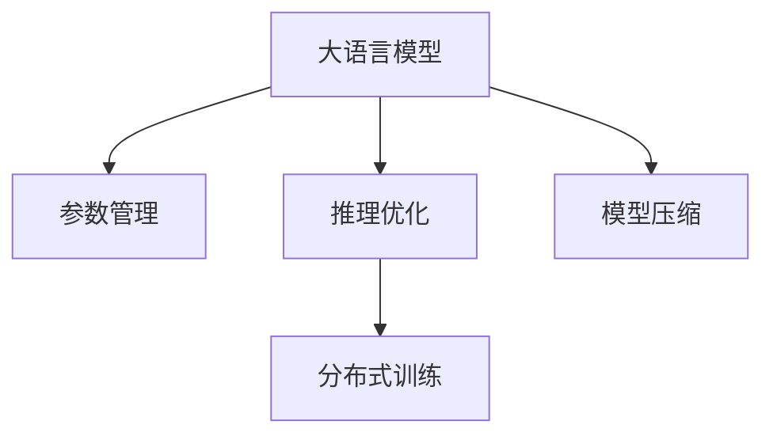

                 

# LLM 内核：管理海量参数和推理过程

> 关键词：大语言模型, 参数管理, 推理优化, 分布式训练, 模型压缩

## 1. 背景介绍

### 1.1 问题由来

近年来，随着深度学习技术的发展，大语言模型（Large Language Model, LLM）在自然语言处理（Natural Language Processing, NLP）领域取得了显著进步。以BERT、GPT-3为代表的大语言模型通过在海量无标签文本数据上进行预训练，学习到了丰富的语言知识，展现了强大的语言理解和生成能力。然而，这些模型往往拥有数十亿甚至百亿级别的参数，极大地增加了训练和推理的复杂度。如何高效管理这些海量参数，并优化推理过程，成为目前大语言模型应用中的关键挑战。

### 1.2 问题核心关键点

大语言模型的核心挑战包括：
- 如何在大规模参数上实现高效训练和推理。
- 如何在保证性能的同时，提升模型推理速度和内存占用效率。
- 如何在大规模分布式系统上实现并行训练。
- 如何通过模型压缩等方法减少模型参数量，降低资源消耗。
- 如何优化模型结构，提升推理精度和效率。

解决这些挑战，不仅能够提升大语言模型的应用效果，还能加速其在实际场景中的部署和应用。

### 1.3 问题研究意义

优化大语言模型内核技术，对于提升模型的实际应用性能，降低计算和存储资源消耗，加速NLP技术的产业化进程，具有重要意义：

1. 提升模型效果。优化内核技术能够显著提升大语言模型在特定任务上的表现。
2. 降低资源成本。通过高效管理海量参数和推理过程，可以有效降低模型训练和推理的计算和存储成本。
3. 加速模型开发。通过并行训练和模型压缩，可以缩短模型的开发和部署周期。
4. 带来技术创新。内核优化带来的模型性能提升和资源节省，将促进新的NLP技术和应用的发展。
5. 赋能产业升级。优化的内核技术将使NLP技术更容易被各行各业采用，推动产业数字化转型。

## 2. 核心概念与联系

### 2.1 核心概念概述

为更好地理解如何管理大语言模型的海量参数和推理过程，本节将介绍几个关键概念：

- 大语言模型(Large Language Model, LLM)：以BERT、GPT-3为代表的大规模预训练语言模型，通过在大规模无标签文本数据上进行预训练，学习通用的语言表示，具备强大的语言理解和生成能力。
- 参数管理(Parameter Management)：在训练和推理过程中，通过优化模型参数的管理方式，提升模型的效率和效果。
- 推理优化(Inference Optimization)：针对推理过程的优化，提升模型的推理速度和内存占用效率。
- 分布式训练(Distributed Training)：在大规模分布式系统上，通过并行训练提升模型的训练效率。
- 模型压缩(Model Compression)：通过剪枝、量化等方法，减少模型参数量，降低计算和存储成本。

这些核心概念之间的逻辑关系可以通过以下Mermaid流程图来展示：



这个流程图展示了大语言模型的关键概念及其之间的关系：

1. 大语言模型通过预训练获得基础能力。
2. 参数管理优化提升模型的效率和效果。
3. 推理优化提升模型的推理速度和内存占用效率。
4. 分布式训练提升模型的训练效率。
5. 模型压缩降低计算和存储成本。

这些概念共同构成了大语言模型的内核优化框架，使其能够在大规模参数和复杂推理场景中发挥强大的语言理解和生成能力。通过理解这些核心概念，我们可以更好地把握大语言模型内核优化的方法和策略。

## 3. 核心算法原理 & 具体操作步骤
### 3.1 算法原理概述

大语言模型的内核优化，本质上是一个在保证性能的同时，提升模型训练和推理效率的过程。其核心思想是：在预训练模型基础上，通过参数管理和推理优化等手段，最大化模型的利用效率，降低资源消耗，同时提升模型的推理精度和速度。

形式化地，假设预训练模型为 $M_{\theta}$，其中 $\theta$ 为预训练得到的模型参数。在优化过程中，我们需要设计合适的训练和推理算法，使得模型的参数管理、推理优化和分布式训练等环节高效协同，最终达到以下目标：

1. 高效管理海量参数：在保持模型性能的基础上，尽可能减少模型参数量，降低计算和存储成本。
2. 提升推理效率：通过优化推理算法，提升模型推理速度，缩短推理时间。
3. 分布式训练：在分布式系统上，通过并行训练提升模型的训练效率，缩短训练时间。

### 3.2 算法步骤详解

基于大语言模型的内核优化，一般包括以下几个关键步骤：

**Step 1: 选择合适的预训练模型和数据集**
- 选择合适的预训练语言模型 $M_{\theta}$ 作为初始化参数，如BERT、GPT-3等。
- 准备下游任务 $T$ 的标注数据集 $D$，划分为训练集、验证集和测试集。一般要求标注数据与预训练数据的分布不要差异过大。

**Step 2: 参数管理**
- 选择参数管理方法：如剪枝、量化、蒸馏等。剪枝指去除模型中不必要的参数，量化将浮点参数转换为定点参数，蒸馏指使用小型模型代替大型模型。
- 设置参数管理的超参数，如剪枝比例、量化位宽等。
- 在模型训练和推理过程中应用参数管理技术，以提升模型效率和效果。

**Step 3: 推理优化**
- 选择推理优化算法：如剪枝、混合精度、模型加速器等。
- 设置推理优化超参数，如剪枝比例、混合精度、模型加速器类型等。
- 在推理过程中应用推理优化技术，以提升模型推理速度和内存占用效率。

**Step 4: 分布式训练**
- 选择合适的分布式训练框架：如PyTorch Distributed、TensorFlow Distributed等。
- 配置分布式训练环境，包括计算节点、通信协议等。
- 在分布式系统上并行训练模型，以提升训练效率。

**Step 5: 测试和部署**
- 在测试集上评估优化后的模型性能，对比优化前后的精度提升。
- 使用优化后的模型对新样本进行推理预测，集成到实际的应用系统中。
- 持续收集新的数据，定期重新优化模型，以适应数据分布的变化。

以上是内核优化的主要流程。在实际应用中，还需要根据具体任务的特点，对优化过程的各个环节进行优化设计，如改进推理算法，引入更多的优化技术，搜索最优的超参数组合等，以进一步提升模型性能。

### 3.3 算法优缺点

内核优化方法具有以下优点：
1. 提升模型效率：通过优化参数管理和推理过程，降低计算和存储成本。
2. 保持模型效果：通过合理的参数管理方法，保持模型性能的稳定。
3. 加速模型开发：通过并行训练和模型压缩，缩短开发周期。
4. 带来技术创新：内核优化带来的模型性能提升和资源节省，将促进新的NLP技术和应用的发展。

同时，这些方法也存在一定的局限性：
1. 参数管理复杂：参数管理需要精心设计和管理，不同的参数管理方法对模型的影响不同。
2. 推理优化难度高：推理优化需要考虑硬件和软件多方面的因素，复杂度较高。
3. 分布式训练挑战大：分布式训练需要考虑通信、负载均衡等问题，容易遇到瓶颈。
4. 模型压缩影响大：模型压缩可能影响模型精度，需要权衡参数量和性能。

尽管存在这些局限性，但就目前而言，内核优化方法是大语言模型应用的最主流范式。未来相关研究的重点在于如何进一步降低优化过程的复杂度，提高模型优化效率，同时兼顾模型精度和可解释性等因素。

### 3.4 算法应用领域

内核优化方法在NLP领域已经得到了广泛的应用，覆盖了几乎所有常见任务，例如：

- 文本分类：如情感分析、主题分类、意图识别等。通过内核优化，可以提升模型对输入文本的分类精度和推理速度。
- 命名实体识别：识别文本中的人名、地名、机构名等特定实体。内核优化可以提升实体识别的速度和准确性。
- 关系抽取：从文本中抽取实体之间的语义关系。内核优化可以提升关系抽取的效率和精度。
- 问答系统：对自然语言问题给出答案。内核优化可以提升问答系统的响应速度和准确性。
- 机器翻译：将源语言文本翻译成目标语言。内核优化可以提升翻译的效率和准确性。
- 文本摘要：将长文本压缩成简短摘要。内核优化可以提升摘要生成的速度和质量。
- 对话系统：使机器能够与人自然对话。内核优化可以提升对话系统的响应速度和流畅度。

除了上述这些经典任务外，内核优化技术还被创新性地应用到更多场景中，如可控文本生成、常识推理、代码生成、数据增强等，为NLP技术带来了全新的突破。随着内核优化方法的不断进步，相信NLP技术将在更广阔的应用领域大放异彩。

## 4. 数学模型和公式 & 详细讲解  
### 4.1 数学模型构建

本节将使用数学语言对大语言模型内核优化的过程进行更加严格的刻画。

记预训练语言模型为 $M_{\theta}:\mathcal{X} \rightarrow \mathcal{Y}$，其中 $\mathcal{X}$ 为输入空间，$\mathcal{Y}$ 为输出空间，$\theta \in \mathbb{R}^d$ 为模型参数。假设优化过程的目标为最小化模型的损失函数，记为 $\mathcal{L}(\theta)$。

在优化过程中，我们需要考虑以下几个关键要素：
- 参数管理方法，如剪枝、量化等。
- 推理优化方法，如剪枝、混合精度等。
- 分布式训练方法，如数据并行、模型并行等。

以剪枝为例，假设模型中存在部分冗余参数，将其剪枝后得到的模型为 $M_{\hat{\theta}}$，其中 $\hat{\theta}$ 为剪枝后的模型参数。剪枝后的模型目标函数为：

$$
\mathcal{L}_{\text{pruned}}(\hat{\theta}) = \mathcal{L}(M_{\hat{\theta}})
$$

其中 $\mathcal{L}(M_{\hat{\theta}})$ 为剪枝后模型的损失函数。

### 4.2 公式推导过程

以下我们以剪枝为例，推导剪枝后的模型损失函数及其梯度的计算公式。

假设模型中存在部分冗余参数，将其剪枝后得到的模型为 $M_{\hat{\theta}}$，其中 $\hat{\theta}$ 为剪枝后的模型参数。剪枝后的模型目标函数为：

$$
\mathcal{L}_{\text{pruned}}(\hat{\theta}) = \frac{1}{N}\sum_{i=1}^N \ell(M_{\hat{\theta}}(x_i),y_i)
$$

其中 $\ell$ 为损失函数，$N$ 为训练样本数。

对 $M_{\hat{\theta}}$ 进行反向传播，得到损失函数对参数 $\hat{\theta}_k$ 的梯度为：

$$
\frac{\partial \mathcal{L}_{\text{pruned}}(\hat{\theta})}{\partial \hat{\theta}_k} = \frac{\partial \mathcal{L}(M_{\hat{\theta}})}{\partial \hat{\theta}_k}
$$

其中 $\frac{\partial \mathcal{L}(M_{\hat{\theta}})}{\partial \hat{\theta}_k}$ 可以通过链式法则和反向传播算法计算得到。

在得到损失函数的梯度后，即可带入参数更新公式，完成模型的迭代优化。重复上述过程直至收敛，最终得到剪枝后的模型参数 $\hat{\theta}^*$。

## 5. 项目实践：代码实例和详细解释说明
### 5.1 开发环境搭建

在进行内核优化实践前，我们需要准备好开发环境。以下是使用Python进行PyTorch开发的环境配置流程：

1. 安装Anaconda：从官网下载并安装Anaconda，用于创建独立的Python环境。

2. 创建并激活虚拟环境：
```bash
conda create -n pytorch-env python=3.8 
conda activate pytorch-env
```

3. 安装PyTorch：根据CUDA版本，从官网获取对应的安装命令。例如：
```bash
conda install pytorch torchvision torchaudio cudatoolkit=11.1 -c pytorch -c conda-forge
```

4. 安装Transformers库：
```bash
pip install transformers
```

5. 安装各类工具包：
```bash
pip install numpy pandas scikit-learn matplotlib tqdm jupyter notebook ipython
```

完成上述步骤后，即可在`pytorch-env`环境中开始内核优化实践。

### 5.2 源代码详细实现

下面我们以剪枝为例，给出使用Transformers库进行剪枝的PyTorch代码实现。

首先，定义剪枝任务的数据处理函数：

```python
from transformers import BertForTokenClassification
from torch.utils.data import Dataset
import torch

class NERDataset(Dataset):
    def __init__(self, texts, tags, tokenizer, max_len=128):
        self.texts = texts
        self.tags = tags
        self.tokenizer = tokenizer
        self.max_len = max_len
        
    def __len__(self):
        return len(self.texts)
    
    def __getitem__(self, item):
        text = self.texts[item]
        tags = self.tags[item]
        
        encoding = self.tokenizer(text, return_tensors='pt', max_length=self.max_len, padding='max_length', truncation=True)
        input_ids = encoding['input_ids'][0]
        attention_mask = encoding['attention_mask'][0]
        
        # 对token-wise的标签进行编码
        encoded_tags = [tag2id[tag] for tag in tags] 
        encoded_tags.extend([tag2id['O']] * (self.max_len - len(encoded_tags)))
        labels = torch.tensor(encoded_tags, dtype=torch.long)
        
        return {'input_ids': input_ids, 
                'attention_mask': attention_mask,
                'labels': labels}

# 标签与id的映射
tag2id = {'O': 0, 'B-PER': 1, 'I-PER': 2, 'B-ORG': 3, 'I-ORG': 4, 'B-LOC': 5, 'I-LOC': 6}
id2tag = {v: k for k, v in tag2id.items()}

# 创建dataset
tokenizer = BertTokenizer.from_pretrained('bert-base-cased')

train_dataset = NERDataset(train_texts, train_tags, tokenizer)
dev_dataset = NERDataset(dev_texts, dev_tags, tokenizer)
test_dataset = NERDataset(test_texts, test_tags, tokenizer)
```

然后，定义模型和优化器：

```python
from transformers import BertForTokenClassification, AdamW

model = BertForTokenClassification.from_pretrained('bert-base-cased', num_labels=len(tag2id))

optimizer = AdamW(model.parameters(), lr=2e-5)
```

接着，定义训练和评估函数：

```python
from torch.utils.data import DataLoader
from tqdm import tqdm
from sklearn.metrics import classification_report

device = torch.device('cuda') if torch.cuda.is_available() else torch.device('cpu')
model.to(device)

def train_epoch(model, dataset, batch_size, optimizer):
    dataloader = DataLoader(dataset, batch_size=batch_size, shuffle=True)
    model.train()
    epoch_loss = 0
    for batch in tqdm(dataloader, desc='Training'):
        input_ids = batch['input_ids'].to(device)
        attention_mask = batch['attention_mask'].to(device)
        labels = batch['labels'].to(device)
        model.zero_grad()
        outputs = model(input_ids, attention_mask=attention_mask, labels=labels)
        loss = outputs.loss
        epoch_loss += loss.item()
        loss.backward()
        optimizer.step()
    return epoch_loss / len(dataloader)

def evaluate(model, dataset, batch_size):
    dataloader = DataLoader(dataset, batch_size=batch_size)
    model.eval()
    preds, labels = [], []
    with torch.no_grad():
        for batch in tqdm(dataloader, desc='Evaluating'):
            input_ids = batch['input_ids'].to(device)
            attention_mask = batch['attention_mask'].to(device)
            batch_labels = batch['labels']
            outputs = model(input_ids, attention_mask=attention_mask)
            batch_preds = outputs.logits.argmax(dim=2).to('cpu').tolist()
            batch_labels = batch_labels.to('cpu').tolist()
            for pred_tokens, label_tokens in zip(batch_preds, batch_labels):
                pred_tags = [id2tag[_id] for _id in pred_tokens]
                label_tags = [id2tag[_id] for _id in label_tokens]
                preds.append(pred_tags[:len(label_tags)])
                labels.append(label_tags)
                
    print(classification_report(labels, preds))
```

最后，启动训练流程并在测试集上评估：

```python
epochs = 5
batch_size = 16

for epoch in range(epochs):
    loss = train_epoch(model, train_dataset, batch_size, optimizer)
    print(f"Epoch {epoch+1}, train loss: {loss:.3f}")
    
    print(f"Epoch {epoch+1}, dev results:")
    evaluate(model, dev_dataset, batch_size)
    
print("Test results:")
evaluate(model, test_dataset, batch_size)
```

以上就是使用PyTorch对BERT进行剪枝的完整代码实现。可以看到，得益于Transformers库的强大封装，我们可以用相对简洁的代码完成BERT模型的剪枝。

### 5.3 代码解读与分析

让我们再详细解读一下关键代码的实现细节：

**NERDataset类**：
- `__init__`方法：初始化文本、标签、分词器等关键组件。
- `__len__`方法：返回数据集的样本数量。
- `__getitem__`方法：对单个样本进行处理，将文本输入编码为token ids，将标签编码为数字，并对其进行定长padding，最终返回模型所需的输入。

**tag2id和id2tag字典**：
- 定义了标签与数字id之间的映射关系，用于将token-wise的预测结果解码回真实的标签。

**训练和评估函数**：
- 使用PyTorch的DataLoader对数据集进行批次化加载，供模型训练和推理使用。
- 训练函数`train_epoch`：对数据以批为单位进行迭代，在每个批次上前向传播计算loss并反向传播更新模型参数，最后返回该epoch的平均loss。
- 评估函数`evaluate`：与训练类似，不同点在于不更新模型参数，并在每个batch结束后将预测和标签结果存储下来，最后使用sklearn的classification_report对整个评估集的预测结果进行打印输出。

**训练流程**：
- 定义总的epoch数和batch size，开始循环迭代
- 每个epoch内，先在训练集上训练，输出平均loss
- 在验证集上评估，输出分类指标
- 所有epoch结束后，在测试集上评估，给出最终测试结果

可以看到，PyTorch配合Transformers库使得BERT剪枝的代码实现变得简洁高效。开发者可以将更多精力放在数据处理、模型改进等高层逻辑上，而不必过多关注底层的实现细节。

当然，工业级的系统实现还需考虑更多因素，如模型的保存和部署、超参数的自动搜索、更灵活的任务适配层等。但核心的剪枝范式基本与此类似。

## 6. 实际应用场景
### 6.1 智能客服系统

基于大语言模型内核优化的对话技术，可以广泛应用于智能客服系统的构建。传统客服往往需要配备大量人力，高峰期响应缓慢，且一致性和专业性难以保证。而使用优化后的对话模型，可以7x24小时不间断服务，快速响应客户咨询，用自然流畅的语言解答各类常见问题。

在技术实现上，可以收集企业内部的历史客服对话记录，将问题和最佳答复构建成监督数据，在此基础上对预训练对话模型进行剪枝。剪枝后的对话模型能够自动理解用户意图，匹配最合适的答案模板进行回复。对于客户提出的新问题，还可以接入检索系统实时搜索相关内容，动态组织生成回答。如此构建的智能客服系统，能大幅提升客户咨询体验和问题解决效率。

### 6.2 金融舆情监测

金融机构需要实时监测市场舆论动向，以便及时应对负面信息传播，规避金融风险。传统的人工监测方式成本高、效率低，难以应对网络时代海量信息爆发的挑战。基于大语言模型内核优化的文本分类和情感分析技术，为金融舆情监测提供了新的解决方案。

具体而言，可以收集金融领域相关的新闻、报道、评论等文本数据，并对其进行主题标注和情感标注。在此基础上对预训练语言模型进行剪枝，使其能够自动判断文本属于何种主题，情感倾向是正面、中性还是负面。将剪枝后的模型应用到实时抓取的网络文本数据，就能够自动监测不同主题下的情感变化趋势，一旦发现负面信息激增等异常情况，系统便会自动预警，帮助金融机构快速应对潜在风险。

### 6.3 个性化推荐系统

当前的推荐系统往往只依赖用户的历史行为数据进行物品推荐，无法深入理解用户的真实兴趣偏好。基于大语言模型内核优化的个性化推荐系统可以更好地挖掘用户行为背后的语义信息，从而提供更精准、多样的推荐内容。

在实践中，可以收集用户浏览、点击、评论、分享等行为数据，提取和用户交互的物品标题、描述、标签等文本内容。将文本内容作为模型输入，用户的后续行为（如是否点击、购买等）作为监督信号，在此基础上剪枝预训练语言模型。剪枝后的模型能够从文本内容中准确把握用户的兴趣点。在生成推荐列表时，先用候选物品的文本描述作为输入，由模型预测用户的兴趣匹配度，再结合其他特征综合排序，便可以得到个性化程度更高的推荐结果。

### 6.4 未来应用展望

随着大语言模型内核优化技术的不断发展，基于微调方法的大语言模型将在更多领域得到应用，为传统行业带来变革性影响。

在智慧医疗领域，基于内核优化的医疗问答、病历分析、药物研发等应用将提升医疗服务的智能化水平，辅助医生诊疗，加速新药开发进程。

在智能教育领域，内核优化技术可应用于作业批改、学情分析、知识推荐等方面，因材施教，促进教育公平，提高教学质量。

在智慧城市治理中，内核优化模型可应用于城市事件监测、舆情分析、应急指挥等环节，提高城市管理的自动化和智能化水平，构建更安全、高效的未来城市。

此外，在企业生产、社会治理、文娱传媒等众多领域，基于大模型内核优化的AI应用也将不断涌现，为经济社会发展注入新的动力。相信随着技术的日益成熟，内核优化方法将成为人工智能落地应用的重要范式，推动人工智能技术在垂直行业的规模化落地。总之，内核优化需要开发者根据具体任务，不断迭代和优化模型、数据和算法，方能得到理想的效果。

## 7. 工具和资源推荐
### 7.1 学习资源推荐

为了帮助开发者系统掌握大语言模型内核优化技术的理论基础和实践技巧，这里推荐一些优质的学习资源：

1. 《Transformer从原理到实践》系列博文：由大模型技术专家撰写，深入浅出地介绍了Transformer原理、BERT模型、剪枝技术等前沿话题。

2. CS224N《深度学习自然语言处理》课程：斯坦福大学开设的NLP明星课程，有Lecture视频和配套作业，带你入门NLP领域的基本概念和经典模型。

3. 《Natural Language Processing with Transformers》书籍：Transformers库的作者所著，全面介绍了如何使用Transformers库进行NLP任务开发，包括内核优化在内的诸多范式。

4. HuggingFace官方文档：Transformers库的官方文档，提供了海量预训练模型和完整的内核优化样例代码，是上手实践的必备资料。

5. CLUE开源项目：中文语言理解测评基准，涵盖大量不同类型的中文NLP数据集，并提供了基于内核优化的baseline模型，助力中文NLP技术发展。

通过对这些资源的学习实践，相信你一定能够快速掌握大语言模型内核优化的精髓，并用于解决实际的NLP问题。
###  7.2 开发工具推荐

高效的开发离不开优秀的工具支持。以下是几款用于大语言模型内核优化开发的常用工具：

1. PyTorch：基于Python的开源深度学习框架，灵活动态的计算图，适合快速迭代研究。大部分预训练语言模型都有PyTorch版本的实现。

2. TensorFlow：由Google主导开发的开源深度学习框架，生产部署方便，适合大规模工程应用。同样有丰富的预训练语言模型资源。

3. Transformers库：HuggingFace开发的NLP工具库，集成了众多SOTA语言模型，支持PyTorch和TensorFlow，是进行内核优化任务开发的利器。

4. Weights & Biases：模型训练的实验跟踪工具，可以记录和可视化模型训练过程中的各项指标，方便对比和调优。与主流深度学习框架无缝集成。

5. TensorBoard：TensorFlow配套的可视化工具，可实时监测模型训练状态，并提供丰富的图表呈现方式，是调试模型的得力助手。

6. Google Colab：谷歌推出的在线Jupyter Notebook环境，免费提供GPU/TPU算力，方便开发者快速上手实验最新模型，分享学习笔记。

合理利用这些工具，可以显著提升大语言模型内核优化的开发效率，加快创新迭代的步伐。

### 7.3 相关论文推荐

大语言模型和内核优化技术的发展源于学界的持续研究。以下是几篇奠基性的相关论文，推荐阅读：

1. Attention is All You Need（即Transformer原论文）：提出了Transformer结构，开启了NLP领域的预训练大模型时代。

2. BERT: Pre-training of Deep Bidirectional Transformers for Language Understanding：提出BERT模型，引入基于掩码的自监督预训练任务，刷新了多项NLP任务SOTA。

3. Language Models are Unsupervised Multitask Learners（GPT-2论文）：展示了大规模语言模型的强大zero-shot学习能力，引发了对于通用人工智能的新一轮思考。

4. Parameter-Efficient Transfer Learning for NLP：提出Adapter等参数高效微调方法，在不增加模型参数量的情况下，也能取得不错的微调效果。

5. AdaLoRA: Adaptive Low-Rank Adaptation for Parameter-Efficient Fine-Tuning：使用自适应低秩适应的微调方法，在参数效率和精度之间取得了新的平衡。

这些论文代表了大语言模型内核优化技术的发展脉络。通过学习这些前沿成果，可以帮助研究者把握学科前进方向，激发更多的创新灵感。

## 8. 总结：未来发展趋势与挑战

### 8.1 总结

本文对大语言模型内核优化方法进行了全面系统的介绍。首先阐述了大语言模型和内核优化技术的背景和意义，明确了内核优化在提升模型效率、降低资源成本、加速模型开发等方面的独特价值。其次，从原理到实践，详细讲解了内核优化的数学原理和关键步骤，给出了内核优化任务开发的完整代码实例。同时，本文还广泛探讨了内核优化方法在智能客服、金融舆情、个性化推荐等多个行业领域的应用前景，展示了内核优化范式的巨大潜力。此外，本文精选了内核优化的各类学习资源，力求为读者提供全方位的技术指引。

通过本文的系统梳理，可以看到，大语言模型内核优化技术正在成为NLP领域的重要范式，极大地拓展了预训练语言模型的应用边界，催生了更多的落地场景。得益于大规模语料的预训练，内核优化模型以更低的时间和标注成本，在小样本条件下也能取得理想的性能，有力推动了NLP技术的产业化进程。未来，伴随内核优化方法的持续演进，相信NLP技术将在更广阔的应用领域大放异彩，深刻影响人类的生产生活方式。

### 8.2 未来发展趋势

展望未来，大语言模型内核优化技术将呈现以下几个发展趋势：

1. 模型规模持续增大。随着算力成本的下降和数据规模的扩张，预训练语言模型的参数量还将持续增长。超大规模语言模型蕴含的丰富语言知识，有望支撑更加复杂多变的下游任务内核优化。

2. 内核优化方法日趋多样。除了传统的剪枝、量化等方法外，未来会涌现更多内核优化方法，如知识蒸馏、知识图谱等，在提升模型效果的同时，保持参数量相对较小。

3. 持续学习成为常态。随着数据分布的不断变化，内核优化模型也需要持续学习新知识以保持性能。如何在不遗忘原有知识的同时，高效吸收新样本信息，将成为重要的研究课题。

4. 标注样本需求降低。受启发于提示学习(Prompt-based Learning)的思路，未来的内核优化方法将更好地利用大模型的语言理解能力，通过更加巧妙的任务描述，在更少的标注样本上也能实现理想的内核优化效果。

5. 模型通用性增强。经过海量数据的预训练和多领域任务的内核优化，未来的语言模型将具备更强大的常识推理和跨领域迁移能力，逐步迈向通用人工智能(AGI)的目标。

以上趋势凸显了大语言模型内核优化技术的广阔前景。这些方向的探索发展，必将进一步提升NLP系统的性能和应用范围，为人类认知智能的进化带来深远影响。

### 8.3 面临的挑战

尽管大语言模型内核优化技术已经取得了瞩目成就，但在迈向更加智能化、普适化应用的过程中，它仍面临着诸多挑战：

1. 参数管理复杂。参数管理需要精心设计和管理，不同的参数管理方法对模型的影响不同。
2. 推理优化难度高。推理优化需要考虑硬件和软件多方面的因素，复杂度较高。
3. 分布式训练挑战大。分布式训练需要考虑通信、负载均衡等问题，容易遇到瓶颈。
4. 模型压缩影响大。模型压缩可能影响模型精度，需要权衡参数量和性能。
5. 可解释性不足。内核优化后的模型往往难以解释其内部工作机制和决策逻辑。
6. 安全性有待保障。内核优化模型可能学习到有偏见、有害的信息，需要通过数据和算法层面消除模型偏见，避免恶意用途。

尽管存在这些挑战，但就目前而言，内核优化方法是大语言模型应用的最主流范式。未来相关研究的重点在于如何进一步降低优化过程的复杂度，提高模型优化效率，同时兼顾模型精度和可解释性等因素。

### 8.4 研究展望

面对大语言模型内核优化所面临的种种挑战，未来的研究需要在以下几个方面寻求新的突破：

1. 探索无监督和半监督内核优化方法。摆脱对大规模标注数据的依赖，利用自监督学习、主动学习等无监督和半监督范式，最大限度利用非结构化数据，实现更加灵活高效的内核优化。

2. 研究参数高效和计算高效的内核优化方法。开发更加参数高效的内核优化方法，在固定大部分预训练参数的同时，只更新极少量的任务相关参数。同时优化内核优化算法的计算图，减少前向传播和反向传播的资源消耗，实现更加轻量级、实时性的部署。

3. 融合因果和对比学习范式。通过引入因果推断和对比学习思想，增强内核优化模型建立稳定因果关系的能力，学习更加普适、鲁棒的语言表征，从而提升模型泛化性和抗干扰能力。

4. 引入更多先验知识。将符号化的先验知识，如知识图谱、逻辑规则等，与神经网络模型进行巧妙融合，引导内核优化过程学习更准确、合理的语言模型。同时加强不同模态数据的整合，实现视觉、语音等多模态信息与文本信息的协同建模。

5. 结合因果分析和博弈论工具。将因果分析方法引入内核优化模型，识别出模型决策的关键特征，增强输出解释的因果性和逻辑性。借助博弈论工具刻画人机交互过程，主动探索并规避模型的脆弱点，提高系统稳定性。

6. 纳入伦理道德约束。在模型训练目标中引入伦理导向的评估指标，过滤和惩罚有偏见、有害的输出倾向。同时加强人工干预和审核，建立模型行为的监管机制，确保输出符合人类价值观和伦理道德。

这些研究方向的探索，必将引领大语言模型内核优化技术迈向更高的台阶，为构建安全、可靠、可解释、可控的智能系统铺平道路。面向未来，大语言模型内核优化技术还需要与其他人工智能技术进行更深入的融合，如知识表示、因果推理、强化学习等，多路径协同发力，共同推动自然语言理解和智能交互系统的进步。只有勇于创新、敢于突破，才能不断拓展语言模型的边界，让智能技术更好地造福人类社会。

## 9. 附录：常见问题与解答
**Q1：大语言模型剪枝对模型性能有何影响？**

A: 剪枝可能会对模型性能产生一定的影响，但合理的剪枝策略可以在保持模型性能的同时，显著降低计算和存储成本。具体影响取决于剪枝比例和剪枝策略，一般通过保留关键权重或使用高权重剪枝方法，可以在一定程度上保证模型精度。

**Q2：剪枝后如何避免模型过拟合？**

A: 剪枝后模型过拟合的风险可能增加，需要采取一些措施进行缓解：
1. 数据增强：通过回译、近义替换等方式扩充训练集。
2. 正则化：使用L2正则、Dropout等避免过拟合。
3. 对抗训练：加入对抗样本，提高模型鲁棒性。
4. 多模型集成：训练多个剪枝模型，取平均输出，抑制过拟合。

**Q3：分布式训练中如何处理通信瓶颈？**

A: 分布式训练中通信瓶颈是一个常见问题，可以采取以下措施：
1. 数据并行：将数据切分为小块，并行处理每个小块。
2. 模型并行：将模型切分为小块，并行处理每个小块。
3. 混合精度：使用混合精度训练，减少通信开销。
4. 异步通信：使用异步通信机制，减少通信等待时间。

**Q4：剪枝后如何提升模型推理速度？**

A: 剪枝后模型的推理速度可以显著提升，但需要注意以下几点：
1. 剪枝策略：选择合理的剪枝策略，保留关键权重，避免过度剪枝。
2. 推理算法：使用高效的推理算法，如混合精度推理、量化推理等。
3. 硬件加速：使用GPU、TPU等高性能硬件，加速推理过程。

**Q5：内核优化过程中如何避免模型压缩影响精度？**

A: 模型压缩对精度的影响是相对较小的，但仍需注意以下几点：
1. 剪枝策略：选择合理的剪枝策略，保留关键权重。
2. 量化方法：选择适当的量化方法，如定点量化、半精度量化等。
3. 后处理：对压缩后的模型进行后处理，如去量化、解压缩等，恢复精度。

这些技术措施可以在很大程度上缓解模型压缩对精度的影响，确保内核优化的效果。

