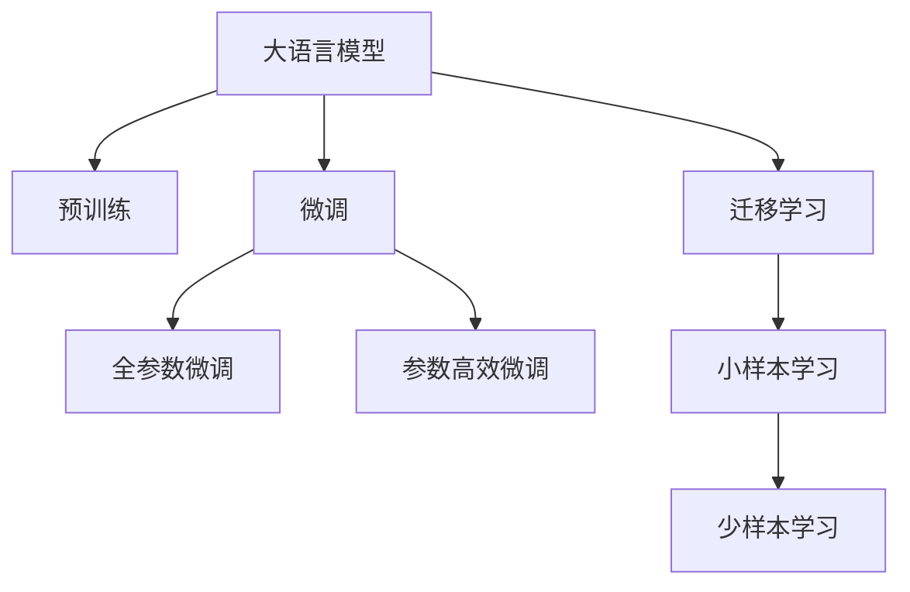

                 

# LLM 创业浪潮：初创企业的新机遇

> 关键词：大语言模型(LLM),初创企业,创新机会,创业指导,商业案例,市场潜力,技术趋势,未来展望

## 1. 背景介绍

### 1.1 问题由来

在人工智能的浪潮中，大语言模型(LLM)正逐渐成为科技界和企业界的焦点。LLM通过大量的无标签文本数据进行预训练，具备强大的自然语言处理能力，广泛应用于聊天机器人、文本摘要、翻译、知识图谱等多个领域。然而，如此庞大的模型对初创企业而言，开发和部署的门槛非常高。因此，如何让初创企业快速拥抱LLM技术，成为当前热门的话题。

### 1.2 问题核心关键点

本文聚焦于如何指导初创企业基于LLM开展创新业务。将从LLM核心概念、算法原理、应用场景、学习资源等方面展开详细探讨。旨在通过理解LLM的运作机制，把握未来商业机会，并提出具体、可行的创业策略。

### 1.3 问题研究意义

LLM技术为初创企业提供了前所未有的发展机遇，特别是在创业项目的构思和实施过程中。深度学习模型不仅能够大幅提升产品竞争力，还能拓展业务模式，降低开发成本。本研究旨在帮助初创企业领会LLM技术的精髓，规避潜在风险，把握市场潜力，实现快速成长。

## 2. 核心概念与联系

### 2.1 核心概念概述

为更好地理解初创企业在LLM技术应用中的机会与挑战，本节将介绍几个密切相关的核心概念：

- 大语言模型(LLM)：以Transformer为基础结构，如GPT-3、BERT等，通过预训练大量文本数据，具备强大的自然语言理解和生成能力。
- 预训练(Pre-training)：在无标签文本数据上自监督学习，学习通用的语言表示，从而提升模型泛化能力。
- 微调(Fine-tuning)：在预训练模型基础上，通过下游任务数据进行有监督学习，优化模型在特定任务上的性能。
- 迁移学习(Transfer Learning)：将预训练模型应用于新任务，减少标注数据的需要，提升模型效果。
- 小样本学习(Few-shot Learning)：在少数据条件下训练模型，通过提示模板等技术提高模型性能。
- 少样本学习(Few-shot Learning)：在少量标注数据下训练模型，利用微调方法提升模型性能。

这些核心概念之间的联系可以通过以下Mermaid流程图来展示：



这个流程图展示了大语言模型的核心概念及其之间的关系：

1. 大语言模型通过预训练获得基础能力。
2. 微调是对预训练模型进行任务特定的优化，可以分为全参数微调和参数高效微调（PEFT）。
3. 迁移学习是连接预训练模型与下游任务的桥梁，可以通过微调或提示学习来实现。
4. 小样本学习与少样本学习是基于微调方法的进一步提升，通过使用少量数据训练出高性能模型。

这些概念共同构成了LLM的运作框架，使其能够适应多样化的应用场景，提供强劲的商业推动力。

## 3. 核心算法原理 & 具体操作步骤

### 3.1 算法原理概述

基于LLM的创业指导主要分为两个步骤：预训练模型准备和任务适配微调。预训练模型通过大量文本数据学习语言规律，具备泛化能力；微调则是在特定任务数据上进行调整，提升模型在该任务上的性能。

具体来说，可以采用以下步骤：

1. **收集数据**：准备目标任务的标注数据集，划分为训练集、验证集和测试集。
2. **选择模型**：从预训练模型库中选择合适的模型，如GPT-3、BERT等。
3. **微调步骤**：
   - **任务适配层设计**：根据任务类型，设计合适的输出层和损失函数，如分类任务使用交叉熵损失。
   - **模型适配**：通过微调优化模型参数，最小化经验风险，使得模型在特定任务上性能提升。
   - **评估与部署**：在验证集上评估模型性能，调整超参数，最终在测试集上部署。

### 3.2 算法步骤详解

以下是详细的LLM微调操作步骤：

**Step 1: 收集数据集**

首先，收集目标任务的标注数据集，按比例划分为训练集、验证集和测试集。通常训练集用于模型微调，验证集用于调参和防止过拟合，测试集用于最终评估模型性能。

**Step 2: 选择预训练模型**

选择适合目标任务的预训练模型。常用的预训练模型包括BERT、GPT-3等，这些模型在大量的无标签文本数据上进行预训练，具备强大的自然语言处理能力。

**Step 3: 任务适配层设计**

根据任务类型设计合适的输出层和损失函数。例如，对于分类任务，可以使用交叉熵损失函数，将输出层设计为线性分类器。对于生成任务，可以使用负对数似然损失函数，将输出层设计为解码器。

**Step 4: 微调模型**

1. **数据加载**：将训练集、验证集和测试集加载到模型中，按批处理。
2. **模型初始化**：将预训练模型参数加载到微调模型中，将学习率设置为适当的值。
3. **模型训练**：使用优化器（如AdamW）更新模型参数，最小化损失函数。
4. **验证集评估**：在验证集上评估模型性能，调整超参数以防止过拟合。
5. **测试集评估**：在测试集上评估模型最终性能，决定是否部署。

**Step 5: 模型部署**

将微调后的模型部署到实际应用中。可以使用在线服务、API接口等方式提供模型服务。

### 3.3 算法优缺点

基于LLM的微调方法具有以下优点：

- **高效泛化**：预训练模型具备强大的泛化能力，可以适应多样化的任务。
- **适应性强**：微调方法可以针对特定任务进行调整，提升模型性能。
- **快速迭代**：在少量标注数据下，通过微调方法可以快速获得高性能模型。

同时，这些方法也存在以下缺点：

- **依赖标注数据**：微调模型需要大量标注数据，获取标注数据的成本较高。
- **模型复杂**：大规模模型的训练和推理计算资源消耗大，部署成本高。
- **过拟合风险**：微调模型容易过拟合，需要选择合适的学习率进行调参。

尽管存在这些缺点，但LLM的预训练-微调方法仍是最为有效的技术范式之一，在众多领域中得到广泛应用。未来研究将关注如何进一步降低微调对标注数据的依赖，提高模型的泛化能力。

### 3.4 算法应用领域

基于LLM的微调方法广泛应用于多个领域，包括但不限于：

- **智能客服**：利用LLM进行情感分析、意图识别、对话生成等，提高客户体验。
- **金融**：用于信用评分、舆情分析、智能投顾等，提升金融服务效率。
- **医疗**：进行医学文献抽取、疾病预测、智能问答等，改善医疗服务。
- **教育**：用于智能辅导、自动评分、学习分析等，个性化教学。
- **媒体内容生成**：用于文章生成、视频字幕生成等，丰富内容创作。

这些领域展示了LLM微调技术的广泛应用，展示了初创企业基于LLM展开业务的巨大潜力。

## 4. 数学模型和公式 & 详细讲解 & 举例说明

### 4.1 数学模型构建

我们以文本分类任务为例，构建基于LLM的微调模型。

**Step 1: 定义模型结构**

假设有 $n$ 个训练样本 $(x_i, y_i)$，其中 $x_i$ 为文本，$y_i$ 为标签。定义模型 $M_{\theta}$ 为 $d$ 维参数的线性分类器，形式如下：

$$
M_{\theta}(x_i) = \theta^T \cdot \phi(x_i)
$$

其中 $\phi(x_i)$ 为将文本 $x_i$ 映射到 $d$ 维特征空间的函数，$\theta$ 为模型参数。

**Step 2: 定义损失函数**

交叉熵损失函数用于衡量模型预测与真实标签的差异。损失函数为：

$$
L(M_{\theta}, (x_i, y_i)) = -y_i \log M_{\theta}(x_i) - (1-y_i) \log (1-M_{\theta}(x_i))
$$

**Step 3: 定义优化目标**

最小化经验风险：

$$
\min_{\theta} \frac{1}{N} \sum_{i=1}^N L(M_{\theta}, (x_i, y_i))
$$

### 4.2 公式推导过程

我们以二分类任务为例，推导模型的损失函数及其梯度。

假设模型在输入 $x_i$ 上的输出为 $M_{\theta}(x_i)$，真实标签为 $y_i \in \{0,1\}$。则二分类交叉熵损失函数为：

$$
L(M_{\theta}(x_i),y_i) = -[y_i \log M_{\theta}(x_i) + (1-y_i) \log (1-M_{\theta}(x_i))]
$$

将其代入经验风险公式：

$$
\mathcal{L}(\theta) = -\frac{1}{N} \sum_{i=1}^N [y_i \log M_{\theta}(x_i) + (1-y_i) \log (1-M_{\theta}(x_i))]
$$

**Step 4: 计算梯度**

根据链式法则，损失函数对参数 $\theta_k$ 的梯度为：

$$
\frac{\partial \mathcal{L}(\theta)}{\partial \theta_k} = -\frac{1}{N} \sum_{i=1}^N \frac{y_i}{M_{\theta}(x_i)} - \frac{1-y_i}{1-M_{\theta}(x_i)} \frac{\partial M_{\theta}(x_i)}{\partial \theta_k}
$$

其中 $\frac{\partial M_{\theta}(x_i)}{\partial \theta_k}$ 可进一步递归展开，利用自动微分技术完成计算。

### 4.3 案例分析与讲解

以BERT模型为例，我们分析其微调过程。

**Step 1: 数据准备**

准备任务相关的训练集、验证集和测试集。例如，对于情感分析任务，收集已标注的评论数据，按情感标签进行划分。

**Step 2: 模型初始化**

从预训练模型库中加载BERT模型，将其作为初始化参数。设置学习率为 $2e-5$，批大小为 $16$，迭代次数为 $5$ 轮。

**Step 3: 微调步骤**

1. 加载训练集数据，按批处理。
2. 前向传播，计算损失函数。
3. 反向传播，计算梯度。
4. 更新模型参数，学习率逐步降低。
5. 在验证集上评估模型性能，调整超参数。
6. 最终在测试集上测试模型性能。

## 5. 项目实践：代码实例和详细解释说明

### 5.1 开发环境搭建

以下是在Python中使用PyTorch实现BERT微调的具体步骤：

1. 安装PyTorch：
```
pip install torch torchtext
```

2. 安装BERT预训练模型：
```
pip install transformers
```

3. 准备数据集：
```
python download_and_process_data.py
```

4. 配置模型：
```
python prepare_dataset.py
```

### 5.2 源代码详细实现

以下是使用PyTorch实现BERT微调的完整代码示例：

```python
import torch
from torchtext.data import Field, BucketIterator
from transformers import BertForSequenceClassification, BertTokenizer
from torch.utils.data import DataLoader

# 定义数据集处理函数
tokenizer = BertTokenizer.from_pretrained('bert-base-uncased')
TEXT = Field(tokenize_from_tokens=tokenizer.tokenize, lower=True)
LABEL = Field(sequential=False)

train_data, test_data = datasets.load_data('path/to/data', text_field=TEXT, label_field=LABEL)

# 构建迭代器
train_iterator, test_iterator = BucketIterator.splits(
    (train_data, test_data), 
    device, 
    batch_size=16, 
    sort_within_batch=True
)

# 定义模型结构
model = BertForSequenceClassification.from_pretrained('bert-base-uncased', num_labels=2)

# 定义优化器
optimizer = torch.optim.Adam(model.parameters(), lr=2e-5)

# 定义评估指标
def evaluate(model, iterator, loss_fn):
    model.eval()
    total_loss = 0
    total_acc = 0
    with torch.no_grad():
        for batch in iterator:
            input_ids = batch.input_ids.to(device)
            attention_mask = batch.attention_mask.to(device)
            labels = batch.labels.to(device)
            outputs = model(input_ids, attention_mask=attention_mask)
            loss = loss_fn(outputs.logits, labels)
            total_loss += loss.item()
            total_acc += (outputs.logits.argmax(dim=1) == labels).float().sum().item()
    return total_loss / len(iterator), total_acc / len(iterator)

# 定义训练函数
def train(model, iterator, optimizer, loss_fn, device):
    model.train()
    for epoch in range(epochs):
        total_loss = 0
        total_acc = 0
        for batch in iterator:
            input_ids = batch.input_ids.to(device)
            attention_mask = batch.attention_mask.to(device)
            labels = batch.labels.to(device)
            model.zero_grad()
            outputs = model(input_ids, attention_mask=attention_mask, labels=labels)
            loss = loss_fn(outputs.logits, labels)
            total_loss += loss.item()
            total_acc += (outputs.logits.argmax(dim=1) == labels).float().sum().item()
            loss.backward()
            optimizer.step()
        print(f"Epoch {epoch+1}, loss: {total_loss / len(iterator):.3f}, acc: {total_acc / len(iterator):.3f}")

# 训练模型
train(model, train_iterator, optimizer, loss_fn, device)
```

### 5.3 代码解读与分析

**数据处理函数**：

- 使用 `BertTokenizer` 对文本数据进行分词。
- 构建 `Field` 对象，用于数据预处理。
- 使用 `datasets.load_data` 加载数据集。

**模型结构**：

- 从预训练模型库加载 `BertForSequenceClassification` 模型，指定分类数为 $2$（二分类）。

**优化器**：

- 使用 `Adam` 优化器，学习率为 $2e-5$。

**评估函数**：

- 计算损失和准确率。
- 使用 `no_grad` 模式评估模型。

**训练函数**：

- 在每个epoch中，对每个批次的输入进行前向传播和后向传播，计算损失和准确率。
- 更新模型参数。

## 6. 实际应用场景

### 6.1 智能客服系统

智能客服系统通过利用LLM的微调技术，能够实时理解客户咨询内容，并提供准确的回复。例如，可以使用微调后的模型进行情感分析，根据客户的情绪状态自动调整应答策略。

**Step 1: 数据收集**

收集客户咨询记录和客户情绪标注数据。

**Step 2: 模型选择**

选择适合智能客服的预训练模型，如GPT-3或BERT。

**Step 3: 微调步骤**

1. 在客户咨询数据上微调模型，学习情绪识别能力。
2. 在微调后的模型上运行客户咨询数据，分析情感状态。
3. 根据情感状态，自动调整客服应答策略。

### 6.2 金融舆情监测

金融舆情监测通过LLM的微调技术，可以实时监测金融市场舆情，分析客户情感倾向，帮助机构做出及时的决策。

**Step 1: 数据收集**

收集金融市场新闻、评论等文本数据，并对其进行情感标注。

**Step 2: 模型选择**

选择适合金融舆情监测的预训练模型，如BERT。

**Step 3: 微调步骤**

1. 在金融舆情数据上微调模型，学习情感识别能力。
2. 实时监测金融市场舆情，分析客户情感倾向。
3. 根据情感倾向，给出投资建议。

### 6.3 个性化推荐系统

个性化推荐系统通过利用LLM的微调技术，能够更好地理解用户兴趣，并提供个性化的推荐结果。

**Step 1: 数据收集**

收集用户浏览、点击、评论等行为数据，提取物品标题、描述、标签等文本内容。

**Step 2: 模型选择**

选择适合个性化推荐的预训练模型，如BERT。

**Step 3: 微调步骤**

1. 在用户行为数据上微调模型，学习用户兴趣表示。
2. 根据用户兴趣表示，生成个性化推荐结果。

## 7. 工具和资源推荐

### 7.1 学习资源推荐

为了帮助开发者系统掌握LLM技术，以下推荐一些优质的学习资源：

1. 《自然语言处理综述》系列论文：介绍了自然语言处理的基本概念和技术进展，适合初学者和进阶者。
2. Coursera《自然语言处理》课程：斯坦福大学开设的NLP明星课程，有Lecture视频和配套作业，带你入门NLP领域的基本概念和经典模型。
3. 《自然语言处理实践》书籍：由HuggingFace作者撰写，全面介绍了如何使用Transformers库进行NLP任务开发，包括微调在内的诸多范式。
4. HuggingFace官方文档：提供丰富的预训练模型和微调样例代码，是上手实践的必备资料。
5. Kaggle金融舆情监测竞赛：涉及金融领域的数据处理、模型训练和评估，适合深入学习和实践。

### 7.2 开发工具推荐

以下是几款用于LLM微调开发的常用工具：

1. PyTorch：基于Python的开源深度学习框架，灵活动态的计算图，适合快速迭代研究。
2. TensorFlow：由Google主导开发的开源深度学习框架，生产部署方便，适合大规模工程应用。
3. Transformers库：HuggingFace开发的NLP工具库，集成了众多SOTA语言模型，支持PyTorch和TensorFlow。
4. Weights & Biases：模型训练的实验跟踪工具，可以记录和可视化模型训练过程中的各项指标，方便对比和调优。
5. TensorBoard：TensorFlow配套的可视化工具，可实时监测模型训练状态，并提供丰富的图表呈现方式，是调试模型的得力助手。

### 7.3 相关论文推荐

LLM技术的发展源于学界的持续研究。以下是几篇奠基性的相关论文，推荐阅读：

1. Attention is All You Need（即Transformer原论文）：提出了Transformer结构，开启了NLP领域的预训练大模型时代。
2. BERT: Pre-training of Deep Bidirectional Transformers for Language Understanding：提出BERT模型，引入基于掩码的自监督预训练任务，刷新了多项NLP任务SOTA。
3. Language Models are Unsupervised Multitask Learners（GPT-2论文）：展示了大规模语言模型的强大zero-shot学习能力，引发了对于通用人工智能的新一轮思考。
4. Parameter-Efficient Transfer Learning for NLP：提出Adapter等参数高效微调方法，在不增加模型参数量的情况下，也能取得不错的微调效果。
5. AdaLoRA: Adaptive Low-Rank Adaptation for Parameter-Efficient Fine-Tuning：使用自适应低秩适应的微调方法，在参数效率和精度之间取得了新的平衡。

## 8. 总结：未来发展趋势与挑战

### 8.1 总结

本文对基于LLM的创业指导进行了全面系统的介绍。首先阐述了LLM核心概念和应用范式，明确了微调在拓展预训练模型应用、提升下游任务性能方面的独特价值。其次，从原理到实践，详细讲解了LLM微调模型的构建和训练过程，给出了微调任务开发的完整代码实例。同时，本文还广泛探讨了LLM技术在智能客服、金融舆情、个性化推荐等多个行业领域的应用前景，展示了微调范式的巨大潜力。

通过本文的系统梳理，可以看到，基于LLM的微调技术为初创企业提供了前所未有的发展机遇，极大提升了产品竞争力，降低了开发成本，拓展了业务模式。未来，伴随LLM技术的持续演进，基于微调范式的创业项目必将迎来更加广阔的市场空间。

### 8.2 未来发展趋势

展望未来，LLM微调技术将呈现以下几个发展趋势：

1. 模型规模持续增大。随着算力成本的下降和数据规模的扩张，预训练语言模型的参数量还将持续增长。超大规模语言模型蕴含的丰富语言知识，有望支撑更加复杂多变的下游任务微调。
2. 微调方法日趋多样。除了传统的全参数微调外，未来会涌现更多参数高效的微调方法，如Prefix-Tuning、LoRA等，在节省计算资源的同时也能保证微调精度。
3. 持续学习成为常态。随着数据分布的不断变化，微调模型也需要持续学习新知识以保持性能。如何在不遗忘原有知识的同时，高效吸收新样本信息，将成为重要的研究课题。
4. 标注样本需求降低。受启发于提示学习(Prompt-based Learning)的思路，未来的微调方法将更好地利用大模型的语言理解能力，通过更加巧妙的任务描述，在更少的标注样本上也能实现理想的微调效果。
5. 多模态微调崛起。当前的微调主要聚焦于纯文本数据，未来会进一步拓展到图像、视频、语音等多模态数据微调。多模态信息的融合，将显著提升语言模型对现实世界的理解和建模能力。

以上趋势凸显了LLM微调技术的广阔前景。这些方向的探索发展，必将进一步提升NLP系统的性能和应用范围，为人类认知智能的进化带来深远影响。

### 8.3 面临的挑战

尽管LLM微调技术已经取得了瞩目成就，但在迈向更加智能化、普适化应用的过程中，仍面临诸多挑战：

1. 标注成本瓶颈。尽管微调大大降低了标注数据的需求，但对于长尾应用场景，难以获得充足的高质量标注数据，成为制约微调性能的瓶颈。
2. 模型鲁棒性不足。当前微调模型面对域外数据时，泛化性能往往大打折扣。对于测试样本的微小扰动，微调模型的预测也容易发生波动。
3. 推理效率有待提高。大规模语言模型虽然精度高，但在实际部署时往往面临推理速度慢、内存占用大等效率问题。
4. 可解释性亟需加强。当前微调模型更像是"黑盒"系统，难以解释其内部工作机制和决策逻辑。对于医疗、金融等高风险应用，算法的可解释性和可审计性尤为重要。
5. 安全性有待保障。预训练语言模型难免会学习到有偏见、有害的信息，通过微调传递到下游任务，产生误导性、歧视性的输出，给实际应用带来安全隐患。

### 8.4 研究展望

面对LLM微调面临的种种挑战，未来的研究需要在以下几个方面寻求新的突破：

1. 探索无监督和半监督微调方法。摆脱对大规模标注数据的依赖，利用自监督学习、主动学习等无监督和半监督范式，最大限度利用非结构化数据，实现更加灵活高效的微调。
2. 研究参数高效和计算高效的微调范式。开发更加参数高效的微调方法，在固定大部分预训练参数的同时，只更新极少量的任务相关参数。同时优化微调模型的计算图，减少前向传播和反向传播的资源消耗，实现更加轻量级、实时性的部署。
3. 融合因果和对比学习范式。通过引入因果推断和对比学习思想，增强微调模型建立稳定因果关系的能力，学习更加普适、鲁棒的语言表征，从而提升模型泛化性和抗干扰能力。
4. 引入更多先验知识。将符号化的先验知识，如知识图谱、逻辑规则等，与神经网络模型进行巧妙融合，引导微调过程学习更准确、合理的语言模型。同时加强不同模态数据的整合，实现视觉、语音等多模态信息与文本信息的协同建模。
5. 结合因果分析和博弈论工具。将因果分析方法引入微调模型，识别出模型决策的关键特征，增强输出解释的因果性和逻辑性。借助博弈论工具刻画人机交互过程，主动探索并规避模型的脆弱点，提高系统稳定性。
6. 纳入伦理道德约束。在模型训练目标中引入伦理导向的评估指标，过滤和惩罚有偏见、有害的输出倾向。同时加强人工干预和审核，建立模型行为的监管机制，确保输出符合人类价值观和伦理道德。

这些研究方向的探索，必将引领LLM微调技术迈向更高的台阶，为构建安全、可靠、可解释、可控的智能系统铺平道路。面向未来，LLM微调技术还需要与其他人工智能技术进行更深入的融合，如知识表示、因果推理、强化学习等，多路径协同发力，共同推动自然语言理解和智能交互系统的进步。只有勇于创新、敢于突破，才能不断拓展语言模型的边界，让智能技术更好地造福人类社会。

## 9. 附录：常见问题与解答

**Q1: 基于LLM的创业指导具体步骤是什么？**

A: 基于LLM的创业指导具体步骤包括：

1. 数据准备：收集目标任务的标注数据集，按比例划分为训练集、验证集和测试集。
2. 模型选择：选择适合目标任务的预训练模型，如BERT、GPT-3等。
3. 任务适配层设计：根据任务类型设计合适的输出层和损失函数。
4. 微调模型：在目标任务数据上微调模型，提升模型性能。
5. 模型评估与部署：在验证集上评估模型性能，调整超参数，最终在测试集上部署模型。

**Q2: 基于LLM的微调方法有哪些优缺点？**

A: 基于LLM的微调方法具有以下优点：

- 高效泛化：预训练模型具备强大的泛化能力，可以适应多样化的任务。
- 适应性强：微调方法可以针对特定任务进行调整，提升模型性能。
- 快速迭代：在少量标注数据下，通过微调方法可以快速获得高性能模型。

同时，这些方法也存在以下缺点：

- 依赖标注数据：微调模型需要大量标注数据，获取标注数据的成本较高。
- 模型复杂：大规模模型的训练和推理计算资源消耗大，部署成本高。
- 过拟合风险：微调模型容易过拟合，需要选择合适的学习率进行调参。

**Q3: 如何降低基于LLM的微调对标注数据的依赖？**

A: 降低基于LLM的微调对标注数据的依赖，可以从以下几方面入手：

1. 无监督和半监督学习：利用自监督学习、主动学习等无监督和半监督范式，最大限度利用非结构化数据，实现更加灵活高效的微调。
2. 参数高效微调：只调整少量参数(如Adapter、Prefix等)，减小过拟合风险。
3. 数据增强：通过回译、近义替换等方式扩充训练集。
4. 对抗训练：引入对抗样本，提高模型鲁棒性。

**Q4: 基于LLM的微调方法在实际应用中需要注意哪些问题？**

A: 基于LLM的微调方法在实际应用中需要注意以下问题：

1. 标注数据质量：确保标注数据的质量和数量，避免模型过拟合。
2. 计算资源消耗：考虑模型的计算资源消耗，合理配置硬件资源。
3. 模型鲁棒性：增强模型的鲁棒性，防止模型对输入的微小扰动敏感。
4. 推理效率：优化推理过程，提高模型响应速度。
5. 可解释性：提高模型的可解释性，方便用户理解和使用。

**Q5: 未来基于LLM的微调技术有哪些发展趋势？**

A: 未来基于LLM的微调技术有以下发展趋势：

1. 模型规模持续增大：预训练模型参数量还将持续增长，支撑更复杂多变的下游任务微调。
2. 微调方法日趋多样：出现更多参数高效、计算高效的微调方法，如Prefix-Tuning、LoRA等。
3. 持续学习成为常态：微调模型需要持续学习新知识以保持性能。
4. 标注样本需求降低：利用提示学习等技术，减少对标注样本的依赖。
5. 多模态微调崛起：拓展到图像、视频、语音等多模态数据微调，提升模型的理解能力。

**Q6: 如何增强基于LLM的微调模型的可解释性？**

A: 增强基于LLM的微调模型的可解释性，可以从以下几方面入手：

1. 引入因果分析方法，识别模型决策的关键特征，增强输出解释的因果性和逻辑性。
2. 利用博弈论工具，刻画人机交互过程，主动探索并规避模型的脆弱点。
3. 纳入伦理道德约束，确保模型的输出符合人类价值观和伦理道德。

---

作者：禅与计算机程序设计艺术 / Zen and the Art of Computer Programming

