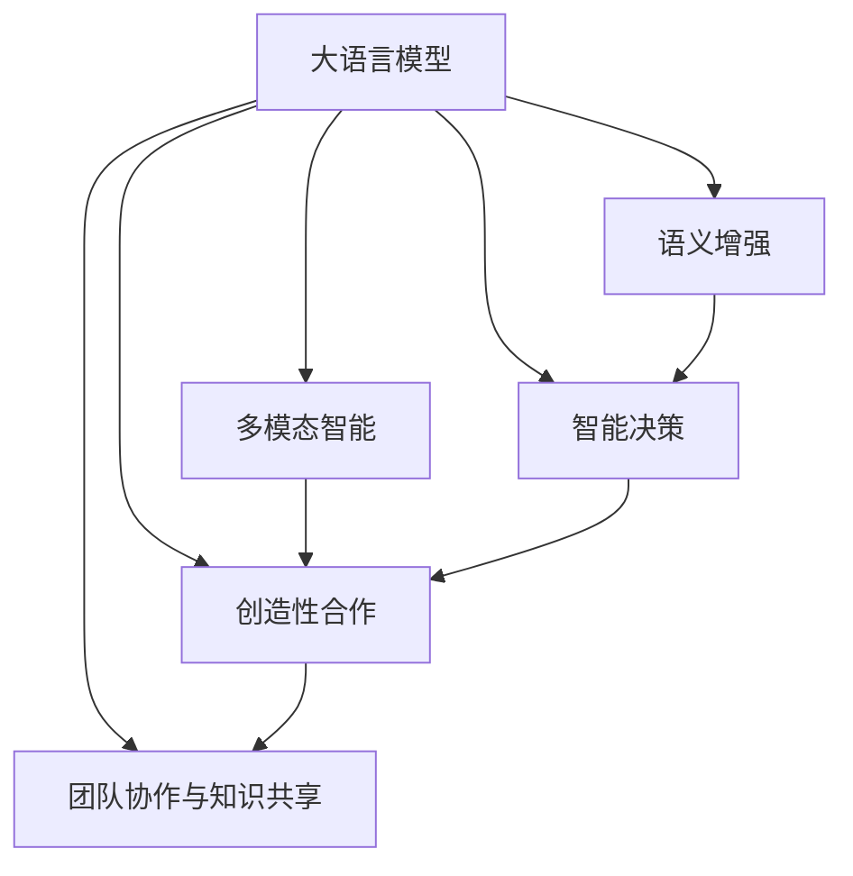

                 

# LLM 在工程和设计中的应用：创造性合作

> 关键词：大语言模型(LLM), 创造性设计, 合作式AI, 多模态智能, 语义增强, 智能决策, 工程应用

## 1. 背景介绍

### 1.1 问题由来
随着人工智能(AI)技术的发展，大语言模型(LLM)在工程和设计领域的应用日益广泛。大语言模型通过自然语言处理(NLP)技术，具备强大的语言理解和生成能力，可以辅助工程师进行需求分析、方案设计、设计评审、文档编写等各类任务，极大提升了设计效率和质量。同时，大语言模型还可以与设计师紧密协作，实现创意设计、智能决策等多模态智能应用，创造性地解决复杂问题。

然而，尽管大语言模型具备强大的语言处理能力，但在工程和设计领域的应用仍面临诸多挑战。例如，如何有效地整合多种数据源，如何进行有效的团队协作，如何在大尺度问题上保持模型的适应性和泛化性，等等。因此，本文将深入探讨大语言模型在工程和设计中的应用，重点介绍创造性合作的概念、算法原理、具体操作步骤，并给出相关的数学模型、代码实例、应用场景等，为读者提供全方位的技术指导。

### 1.2 问题核心关键点
本文聚焦于大语言模型在工程和设计中的应用，探讨如何通过创造性合作实现多模态智能应用。创造性合作是指大语言模型与设计师、工程师等专业人员紧密协作，共同解决实际问题，产生创新性设计和技术方案。具体来说，创造性合作的核心在于：
1. 大语言模型的多模态数据整合能力：通过整合工程数据、设计文档、施工图纸等多种数据源，实现更全面、准确的理解。
2. 设计师与大语言模型的协同设计：通过设计模板、草图、反馈等交互方式，引导大语言模型生成创意设计方案。
3. 工程师与大语言模型的智能决策：通过技术文档、工程规范、设计要求等指导大语言模型进行方案优化和风险评估。
4. 团队协作与知识共享：通过在线协作平台，实现大语言模型与团队成员的实时沟通和知识共享。

## 2. 核心概念与联系

### 2.1 核心概念概述

为更好地理解大语言模型在工程和设计中的创造性合作应用，本节将介绍几个关键概念：

- 大语言模型(LLM)：一种基于深度学习技术的大规模预训练语言模型，通过自监督学习等方式，可以处理大量文本数据，并具备强大的语言理解和生成能力。

- 多模态智能(Multi-modal Intelligence)：结合文本、图像、语音等多种数据源，实现更加全面、准确的信息处理和智能决策。

- 语义增强(Semantic Enrichment)：通过语义理解、知识图谱等技术，增强大语言模型的推理能力和泛化能力。

- 智能决策(Intelligent Decision-Making)：利用大语言模型的语言处理能力，辅助设计师、工程师等进行方案设计、技术评估等决策支持。

- 创造性合作(Creative Collaboration)：通过大语言模型与设计师、工程师等的紧密协作，实现创造性设计和技术创新。

- 团队协作与知识共享(Collaboration and Knowledge Sharing)：利用在线协作工具，实现团队成员之间的实时沟通和知识共享，促进共同创新。

这些核心概念之间的关系可以通过以下Mermaid流程图来展示：



这个流程图展示了大语言模型与其他相关概念之间的逻辑关系：

1. 大语言模型通过多模态智能、语义增强、智能决策等技术手段，增强自身的智能水平。
2. 创造性合作、团队协作与知识共享是实现大语言模型价值的重要途径，需要大语言模型具备足够的语言处理能力，以及与设计师、工程师等协作的技术基础。

## 3. 核心算法原理 & 具体操作步骤
### 3.1 算法原理概述

大语言模型在工程和设计中的应用，本质上是通过多模态智能、语义增强、智能决策等技术手段，实现与设计师、工程师等的创造性合作。其核心思想是：将大语言模型视作一个强大的"智能助手"，通过整合多种数据源、理解设计意图、辅助决策等方式，提升设计效率和质量，促进创新性设计和技术方案的产生。

形式化地，假设大语言模型为 $M_{\theta}$，其中 $\theta$ 为模型参数。给定工程项目 $P$ 的多模态数据集 $D=\{(x_i,y_i)\}_{i=1}^N$，其中 $x_i$ 为设计文档、施工图纸、技术规范等文本信息，$y_i$ 为对应的设计方案、技术评估等目标标签。大语言模型的目标是找到最优参数 $\hat{\theta}$，使得模型在给定数据集 $D$ 上的预测输出 $y_i$ 逼近真实标签 $y_i$。

通过梯度下降等优化算法，大语言模型在数据集 $D$ 上进行微调，最小化预测误差 $\mathcal{L}(M_{\theta},D)$，使得模型输出逼近真实标签。在大语言模型与设计师、工程师等紧密协作的过程中，模型参数 $\theta$ 将不断调整，最终产生优化的设计方案和技术评估。

### 3.2 算法步骤详解

大语言模型在工程和设计中的应用主要包括以下几个关键步骤：

**Step 1: 数据整合与预处理**
- 收集工程项目的多模态数据，包括设计文档、施工图纸、技术规范等文本信息，以及对应的设计方案、技术评估等标签。
- 对文本数据进行清洗、分词、标记化等预处理操作，确保数据的质量和一致性。

**Step 2: 任务适配层设计**
- 根据具体任务的需求，设计合适的输出层和损失函数。
- 对于设计方案生成任务，通常使用生成模型，如GPT-2、BERT等，设置合适的解码器输出概率分布，并以负对数似然为损失函数。
- 对于技术评估任务，设置分类器输出标签，以交叉熵损失为损失函数。

**Step 3: 模型选择与初始化**
- 选择合适的预训练语言模型，如BERT、GPT-2等，作为初始化参数。
- 使用预训练模型在大规模无标签文本语料上进行微调，获取初步的语言表示。

**Step 4: 训练与优化**
- 使用收集到的多模态数据集进行模型训练，调整模型参数。
- 根据任务的特性选择合适的优化算法和超参数，如AdamW、SGD、学习率等。
- 应用正则化技术，如L2正则、Dropout等，防止模型过拟合。
- 周期性在验证集上评估模型性能，根据性能指标决定是否触发Early Stopping。

**Step 5: 生成与评估**
- 使用训练好的大语言模型生成设计方案或进行技术评估。
- 在设计师、工程师的反馈下，不断迭代优化生成方案。
- 对生成的设计方案和技术评估进行全面的评估，确保其满足实际需求。

**Step 6: 部署与应用**
- 将训练好的大语言模型部署到生产环境中，实时生成设计方案和技术评估。
- 持续收集新的数据，定期重新微调模型，以适应数据分布的变化。

以上是基于大语言模型的工程和设计应用的一般流程。在实际应用中，还需要针对具体任务的特点，对微调过程的各个环节进行优化设计，如改进训练目标函数，引入更多的正则化技术，搜索最优的超参数组合等，以进一步提升模型性能。

### 3.3 算法优缺点

大语言模型在工程和设计中的应用具有以下优点：
1. 高效集成多模态数据：大语言模型可以同时处理文本、图像、语音等多种数据源，提供全面的信息支持。
2. 提升设计效率与质量：通过大语言模型自动生成设计方案、进行技术评估，能够显著提高设计效率和质量。
3. 促进创新性设计：通过与设计师、工程师等的紧密协作，大语言模型可以辅助生成创意设计方案，促进创新性设计和技术方案的产生。
4. 实时智能决策：大语言模型能够在实时环境中进行智能决策，支持快速响应和调整。

同时，该方法也存在一定的局限性：
1. 数据整合复杂度高：多模态数据源的整合和预处理工作量较大，需要丰富的领域知识和经验。
2. 模型适应性有限：大语言模型在特定领域或任务的泛化能力仍有限，需要持续的训练和优化。
3. 计算资源需求高：大语言模型通常需要较高的计算资源支持，对硬件设备要求较高。
4. 输出可解释性不足：大语言模型的决策过程缺乏可解释性，难以对其推理逻辑进行分析和调试。

尽管存在这些局限性，但就目前而言，基于大语言模型的工程和设计应用仍是大尺度问题求解的重要范式。未来相关研究的重点在于如何进一步降低计算资源的需求，提高模型的泛化能力，同时兼顾可解释性和伦理安全性等因素。

### 3.4 算法应用领域

大语言模型在工程和设计中的应用广泛，涵盖了许多常见任务，例如：

- 设计方案生成：根据设计师的描述和需求，自动生成设计方案。例如，建筑设计师可以使用大语言模型生成平面图、立面图等。
- 技术评估与优化：对设计方案进行技术评估，辅助设计师进行方案优化。例如，机械工程师可以使用大语言模型评估机械系统的性能和可靠性。
- 项目规划与协调：通过多模态数据整合和语义增强，辅助项目规划和团队协作。例如，项目经理可以使用大语言模型生成项目计划、风险评估等。
- 智能问答与知识管理：利用大语言模型进行智能问答和知识管理，辅助设计师、工程师快速获取相关知识和经验。例如，施工工程师可以使用大语言模型查询施工规范和案例。
- 文档生成与管理：通过大语言模型自动生成设计文档和技术文档，辅助项目管理和知识传递。例如，设计团队可以使用大语言模型生成设计说明书和技术手册。

除了上述这些经典任务外，大语言模型还被创新性地应用到更多场景中，如建筑BIM模型、智能建筑管理系统、机器人设计等，为工程和设计带来了全新的突破。随着大语言模型的不断进步，相信工程和设计技术将更加智能化、高效化和人性化。

## 4. 数学模型和公式 & 详细讲解  
### 4.1 数学模型构建

本节将使用数学语言对大语言模型在工程和设计中的应用进行更加严格的刻画。

记大语言模型为 $M_{\theta}$，其中 $\theta$ 为模型参数。假设工程项目 $P$ 的多模态数据集为 $D=\{(x_i,y_i)\}_{i=1}^N$，其中 $x_i$ 为设计文档、施工图纸、技术规范等文本信息，$y_i$ 为对应的设计方案、技术评估等目标标签。

定义模型 $M_{\theta}$ 在数据样本 $(x,y)$ 上的损失函数为 $\ell(M_{\theta}(x),y)$，则在数据集 $D$ 上的经验风险为：

$$
\mathcal{L}(\theta) = \frac{1}{N} \sum_{i=1}^N \ell(M_{\theta}(x_i),y_i)
$$

其中 $\ell(M_{\theta}(x_i),y_i)$ 为损失函数，用于衡量模型预测输出与真实标签之间的差异。常见的损失函数包括交叉熵损失、均方误差损失等。

微调的优化目标是最小化经验风险，即找到最优参数：

$$
\theta^* = \mathop{\arg\min}_{\theta} \mathcal{L}(\theta)
$$

在实践中，我们通常使用基于梯度的优化算法（如SGD、Adam等）来近似求解上述最优化问题。设 $\eta$ 为学习率，$\lambda$ 为正则化系数，则参数的更新公式为：

$$
\theta \leftarrow \theta - \eta \nabla_{\theta}\mathcal{L}(\theta) - \eta\lambda\theta
$$

其中 $\nabla_{\theta}\mathcal{L}(\theta)$ 为损失函数对参数 $\theta$ 的梯度，可通过反向传播算法高效计算。

### 4.2 公式推导过程

以下我们以设计方案生成任务为例，推导交叉熵损失函数及其梯度的计算公式。

假设模型 $M_{\theta}$ 在输入 $x$ 上的输出为 $\hat{y}=M_{\theta}(x) \in [0,1]$，表示样本属于正类的概率。真实标签 $y \in \{0,1\}$。则二分类交叉熵损失函数定义为：

$$
\ell(M_{\theta}(x),y) = -[y\log \hat{y} + (1-y)\log (1-\hat{y})]
$$

将其代入经验风险公式，得：

$$
\mathcal{L}(\theta) = -\frac{1}{N}\sum_{i=1}^N [y_i\log M_{\theta}(x_i)+(1-y_i)\log(1-M_{\theta}(x_i))]
$$

根据链式法则，损失函数对参数 $\theta_k$ 的梯度为：

$$
\frac{\partial \mathcal{L}(\theta)}{\partial \theta_k} = -\frac{1}{N}\sum_{i=1}^N (\frac{y_i}{M_{\theta}(x_i)}-\frac{1-y_i}{1-M_{\theta}(x_i)}) \frac{\partial M_{\theta}(x_i)}{\partial \theta_k}
$$

其中 $\frac{\partial M_{\theta}(x_i)}{\partial \theta_k}$ 可进一步递归展开，利用自动微分技术完成计算。

在得到损失函数的梯度后，即可带入参数更新公式，完成模型的迭代优化。重复上述过程直至收敛，最终得到适应工程项目的设计方案的最优模型参数 $\theta^*$。

## 5. 项目实践：代码实例和详细解释说明
### 5.1 开发环境搭建

在进行工程和设计任务的大语言模型应用实践前，我们需要准备好开发环境。以下是使用Python进行PyTorch开发的环境配置流程：

1. 安装Anaconda：从官网下载并安装Anaconda，用于创建独立的Python环境。

2. 创建并激活虚拟环境：
```bash
conda create -n pytorch-env python=3.8 
conda activate pytorch-env
```

3. 安装PyTorch：根据CUDA版本，从官网获取对应的安装命令。例如：
```bash
conda install pytorch torchvision torchaudio cudatoolkit=11.1 -c pytorch -c conda-forge
```

4. 安装Transformers库：
```bash
pip install transformers
```

5. 安装各类工具包：
```bash
pip install numpy pandas scikit-learn matplotlib tqdm jupyter notebook ipython
```

完成上述步骤后，即可在`pytorch-env`环境中开始项目实践。

### 5.2 源代码详细实现

下面我们以设计方案生成任务为例，给出使用Transformers库对BERT模型进行设计方案生成的PyTorch代码实现。

首先，定义设计方案生成任务的数据处理函数：

```python
from transformers import BertTokenizer
from torch.utils.data import Dataset
import torch

class DesignDataset(Dataset):
    def __init__(self, texts, labels, tokenizer, max_len=128):
        self.texts = texts
        self.labels = labels
        self.tokenizer = tokenizer
        self.max_len = max_len
        
    def __len__(self):
        return len(self.texts)
    
    def __getitem__(self, item):
        text = self.texts[item]
        label = self.labels[item]
        
        encoding = self.tokenizer(text, return_tensors='pt', max_length=self.max_len, padding='max_length', truncation=True)
        input_ids = encoding['input_ids'][0]
        attention_mask = encoding['attention_mask'][0]
        
        # 将设计方案标签转换为向量
        label_vector = label2vec[label]
        
        return {'input_ids': input_ids, 
                'attention_mask': attention_mask,
                'label': label_vector}

# 设计方案与标签的映射
label2vec = {'设计1': [1, 0, 0], '设计2': [0, 1, 0], '设计3': [0, 0, 1]}

# 创建dataset
tokenizer = BertTokenizer.from_pretrained('bert-base-cased')

train_dataset = DesignDataset(train_texts, train_labels, tokenizer)
dev_dataset = DesignDataset(dev_texts, dev_labels, tokenizer)
test_dataset = DesignDataset(test_texts, test_labels, tokenizer)
```

然后，定义模型和优化器：

```python
from transformers import BertForTokenClassification, AdamW

model = BertForTokenClassification.from_pretrained('bert-base-cased', num_labels=len(label2vec))

optimizer = AdamW(model.parameters(), lr=2e-5)
```

接着，定义训练和评估函数：

```python
from torch.utils.data import DataLoader
from tqdm import tqdm
from sklearn.metrics import classification_report

device = torch.device('cuda') if torch.cuda.is_available() else torch.device('cpu')
model.to(device)

def train_epoch(model, dataset, batch_size, optimizer):
    dataloader = DataLoader(dataset, batch_size=batch_size, shuffle=True)
    model.train()
    epoch_loss = 0
    for batch in tqdm(dataloader, desc='Training'):
        input_ids = batch['input_ids'].to(device)
        attention_mask = batch['attention_mask'].to(device)
        labels = batch['label'].to(device)
        model.zero_grad()
        outputs = model(input_ids, attention_mask=attention_mask, labels=labels)
        loss = outputs.loss
        epoch_loss += loss.item()
        loss.backward()
        optimizer.step()
    return epoch_loss / len(dataloader)

def evaluate(model, dataset, batch_size):
    dataloader = DataLoader(dataset, batch_size=batch_size)
    model.eval()
    preds, labels = [], []
    with torch.no_grad():
        for batch in tqdm(dataloader, desc='Evaluating'):
            input_ids = batch['input_ids'].to(device)
            attention_mask = batch['attention_mask'].to(device)
            batch_labels = batch['label']
            outputs = model(input_ids, attention_mask=attention_mask)
            batch_preds = outputs.logits.argmax(dim=2).to('cpu').tolist()
            batch_labels = batch_labels.to('cpu').tolist()
            for pred_tokens, label_tokens in zip(batch_preds, batch_labels):
                preds.append(pred_tokens[:len(label_tokens)])
                labels.append(label_tokens)
                
    print(classification_report(labels, preds))
```

最后，启动训练流程并在测试集上评估：

```python
epochs = 5
batch_size = 16

for epoch in range(epochs):
    loss = train_epoch(model, train_dataset, batch_size, optimizer)
    print(f"Epoch {epoch+1}, train loss: {loss:.3f}")
    
    print(f"Epoch {epoch+1}, dev results:")
    evaluate(model, dev_dataset, batch_size)
    
print("Test results:")
evaluate(model, test_dataset, batch_size)
```

以上就是使用PyTorch对BERT进行设计方案生成任务的微调实现。可以看到，得益于Transformers库的强大封装，我们可以用相对简洁的代码完成BERT模型的加载和微调。

### 5.3 代码解读与分析

让我们再详细解读一下关键代码的实现细节：

**DesignDataset类**：
- `__init__`方法：初始化文本、标签、分词器等关键组件。
- `__len__`方法：返回数据集的样本数量。
- `__getitem__`方法：对单个样本进行处理，将文本输入编码为token ids，将标签转换为向量，并对其进行定长padding，最终返回模型所需的输入。

**label2vec字典**：
- 定义了设计方案与数字向量之间的映射关系，用于将向量形式的预测结果解码回真实的设计方案。

**训练和评估函数**：
- 使用PyTorch的DataLoader对数据集进行批次化加载，供模型训练和推理使用。
- 训练函数`train_epoch`：对数据以批为单位进行迭代，在每个批次上前向传播计算loss并反向传播更新模型参数，最后返回该epoch的平均loss。
- 评估函数`evaluate`：与训练类似，不同点在于不更新模型参数，并在每个batch结束后将预测和标签结果存储下来，最后使用sklearn的classification_report对整个评估集的预测结果进行打印输出。

**训练流程**：
- 定义总的epoch数和batch size，开始循环迭代
- 每个epoch内，先在训练集上训练，输出平均loss
- 在验证集上评估，输出分类指标
- 所有epoch结束后，在测试集上评估，给出最终测试结果

可以看到，PyTorch配合Transformers库使得BERT微调的设计方案生成任务的代码实现变得简洁高效。开发者可以将更多精力放在数据处理、模型改进等高层逻辑上，而不必过多关注底层的实现细节。

当然，工业级的系统实现还需考虑更多因素，如模型的保存和部署、超参数的自动搜索、更灵活的任务适配层等。但核心的微调范式基本与此类似。

## 6. 实际应用场景
### 6.1 智能建筑设计

基于大语言模型的设计方案生成技术，可以广泛应用于智能建筑设计。传统设计过程依赖设计师的经验和直觉，耗时长、成本高，且容易受限于设计师的视野和水平。使用大语言模型自动生成设计方案，可以大幅提升设计效率和质量，并引入更多创新性的设计思路。

在技术实现上，可以收集历史建筑的设计方案和专家点评，将方案和点评作为监督数据，在此基础上对预训练设计方案生成模型进行微调。微调后的模型能够自动理解设计意图，生成符合设计规范和美学的设计方案。例如，建筑设计设计师可以使用大语言模型生成建筑平面图、立面图、效果图等，加速设计迭代，提高设计效率。

### 6.2 工程项目管理

大语言模型在工程项目管理中也具有广泛的应用前景。项目管理者可以使用大语言模型进行项目规划、进度跟踪、风险评估等管理任务，提升项目执行效率和质量。

具体而言，可以收集项目计划、施工图纸、技术文档等工程数据，通过语义理解和大语言模型，自动生成项目计划、风险评估报告等，辅助项目管理者进行决策。例如，工程项目经理可以使用大语言模型生成项目计划书、进度报告、风险评估表，全面掌握项目进度和质量。

### 6.3 多领域协同设计

大语言模型还可以促进不同领域专业人士之间的协作设计。例如，设计师、工程师、建筑商等专业人士可以通过在线协作平台，实时沟通设计方案，共同解决问题。大语言模型可以整合各方输入，自动生成设计方案和技术文档，促进协作设计的效率和质量。

例如，建筑设计师和结构工程师可以在大语言模型的支持下，实时沟通设计意图和要求，共同生成设计方案和技术文档，确保设计的完整性和合理性。大语言模型还可以辅助设计师进行方案优化和风险评估，提高设计方案的可行性和创新性。

### 6.4 未来应用展望

随着大语言模型和微调方法的不断发展，基于大语言模型的工程和设计应用也将更加广泛，为传统行业带来变革性影响。

在智慧建筑领域，基于大语言模型的建筑设计方案生成技术，将提升建筑设计的智能化水平，降低设计成本，加速新建筑风格的创新和推广。

在智能制造领域，大语言模型可以辅助机械工程师进行设计方案优化和工艺评估，提升生产效率和产品质量。

在智能交通领域，大语言模型可以辅助交通工程师进行路网规划和交通管理，提升道路通行能力和交通管理水平。

此外，在教育、医疗、金融等众多领域，大语言模型微调技术也将得到广泛应用，为传统行业数字化转型升级提供新的技术路径。相信随着技术的日益成熟，大语言模型微调技术将成为工程和设计领域的重要范式，推动工程和设计技术向更智能化、高效化和人性化方向发展。

## 7. 工具和资源推荐
### 7.1 学习资源推荐

为了帮助开发者系统掌握大语言模型在工程和设计中的应用，这里推荐一些优质的学习资源：

1. 《Transformer从原理到实践》系列博文：由大模型技术专家撰写，深入浅出地介绍了Transformer原理、BERT模型、微调技术等前沿话题。

2. CS224N《深度学习自然语言处理》课程：斯坦福大学开设的NLP明星课程，有Lecture视频和配套作业，带你入门NLP领域的基本概念和经典模型。

3. 《Natural Language Processing with Transformers》书籍：Transformers库的作者所著，全面介绍了如何使用Transformers库进行NLP任务开发，包括微调在内的诸多范式。

4. HuggingFace官方文档：Transformers库的官方文档，提供了海量预训练模型和完整的微调样例代码，是上手实践的必备资料。

5. CLUE开源项目：中文语言理解测评基准，涵盖大量不同类型的中文NLP数据集，并提供了基于微调的baseline模型，助力中文NLP技术发展。

通过对这些资源的学习实践，相信你一定能够快速掌握大语言模型在工程和设计中的应用，并用于解决实际的NLP问题。
###  7.2 开发工具推荐

高效的开发离不开优秀的工具支持。以下是几款用于大语言模型在工程和设计应用开发的常用工具：

1. PyTorch：基于Python的开源深度学习框架，灵活动态的计算图，适合快速迭代研究。大部分预训练语言模型都有PyTorch版本的实现。

2. TensorFlow：由Google主导开发的开源深度学习框架，生产部署方便，适合大规模工程应用。同样有丰富的预训练语言模型资源。

3. Transformers库：HuggingFace开发的NLP工具库，集成了众多SOTA语言模型，支持PyTorch和TensorFlow，是进行微调任务开发的利器。

4. Weights & Biases：模型训练的实验跟踪工具，可以记录和可视化模型训练过程中的各项指标，方便对比和调优。与主流深度学习框架无缝集成。

5. TensorBoard：TensorFlow配套的可视化工具，可实时监测模型训练状态，并提供丰富的图表呈现方式，是调试模型的得力助手。

6. Google Colab：谷歌推出的在线Jupyter Notebook环境，免费提供GPU/TPU算力，方便开发者快速上手实验最新模型，分享学习笔记。

合理利用这些工具，可以显著提升大语言模型在工程和设计应用开发的效率，加快创新迭代的步伐。

### 7.3 相关论文推荐

大语言模型和微调技术的发展源于学界的持续研究。以下是几篇奠基性的相关论文，推荐阅读：

1. Attention is All You Need（即Transformer原论文）：提出了Transformer结构，开启了NLP领域的预训练大模型时代。

2. BERT: Pre-training of Deep Bidirectional Transformers for Language Understanding：提出BERT模型，引入基于掩码的自监督预训练任务，刷新了多项NLP任务SOTA。

3. Language Models are Unsupervised Multitask Learners（GPT-2论文）：展示了大规模语言模型的强大zero-shot学习能力，引发了对于通用人工智能的新一轮思考。

4. Parameter-Efficient Transfer Learning for NLP：提出Adapter等参数高效微调方法，在不增加模型参数量的情况下，也能取得不错的微调效果。

5. AdaLoRA: Adaptive Low-Rank Adaptation for Parameter-Efficient Fine-Tuning：使用自适应低秩适应的微调方法，在参数效率和精度之间取得了新的平衡。

6. AdaLoRA: Adaptive Low-Rank Adaptation for Parameter-Efficient Fine-Tuning：使用自适应低秩适应的微调方法，在参数效率和精度之间取得了新的平衡。

这些论文代表了大语言模型微调技术的发展脉络。通过学习这些前沿成果，可以帮助研究者把握学科前进方向，激发更多的创新灵感。

## 8. 总结：未来发展趋势与挑战
### 8.1 总结

本文对大语言模型在工程和设计中的应用进行了全面系统的介绍。首先阐述了大语言模型和微调技术的研究背景和意义，明确了创造性合作在提升设计效率和质量、促进创新性设计和技术方案产生方面的独特价值。其次，从原理到实践，详细讲解了大语言模型在工程和设计中的应用过程，包括数据整合、模型选择、训练优化、生成与评估等关键环节。同时，本文还给出了大语言模型在多个实际应用场景中的应用实例，展示了其广泛的应用前景。最后，本文精选了相关学习资源、开发工具和论文推荐，为读者提供了全方位的技术指导。

通过本文的系统梳理，可以看到，基于大语言模型的创造性合作，不仅能够显著提升设计效率和质量，还能促进创新性设计和技术方案的产生，为工程和设计领域的智能化、高效化和人性化发展提供了新的动力。

### 8.2 未来发展趋势

展望未来，大语言模型在工程和设计中的应用将呈现以下几个发展趋势：

1. 模型规模持续增大。随着算力成本的下降和数据规模的扩张，预训练语言模型的参数量还将持续增长。超大规模语言模型蕴含的丰富语言知识，有望支撑更加复杂多变的工程和设计任务微调。

2. 创造性合作技术日趋多样。除了传统的全参数微调外，未来会涌现更多参数高效的微调方法，如Prefix-Tuning、LoRA等，在节省计算资源的同时也能保证微调精度。

3. 持续学习成为常态。随着数据分布的不断变化，大语言模型也需要持续学习新知识以保持性能。如何在不遗忘原有知识的同时，高效吸收新样本信息，将成为重要的研究课题。

4. 标注样本需求降低。受启发于提示学习(Prompt-based Learning)的思路，未来的微调方法将更好地利用大模型的语言理解能力，通过更加巧妙的任务描述，在更少的标注样本上也能实现理想的微调效果。

5. 多模态微调崛起。当前的微调主要聚焦于纯文本数据，未来会进一步拓展到图像、视频、语音等多模态数据微调。多模态信息的融合，将显著提升语言模型对现实世界的理解和建模能力。

6. 模型通用性增强。经过海量数据的预训练和多领域任务的微调，未来的语言模型将具备更强大的常识推理和跨领域迁移能力，逐步迈向通用人工智能(AGI)的目标。

以上趋势凸显了大语言模型在工程和设计应用的广阔前景。这些方向的探索发展，必将进一步提升工程和设计系统的性能和应用范围，为人类认知智能的进化带来深远影响。

### 8.3 面临的挑战

尽管大语言模型在工程和设计中的应用已经取得了显著成果，但在迈向更加智能化、普适化应用的过程中，它仍面临诸多挑战：

1. 标注成本瓶颈。虽然创造性合作能够减少对标注样本的依赖，但对于长尾应用场景，仍然需要一定数量的标注数据。如何进一步降低标注成本，将是一大难题。

2. 模型鲁棒性不足。当前大语言模型在特定领域或任务的泛化能力仍有限，面对域外数据时，泛化性能往往大打折扣。如何提高模型的鲁棒性，避免灾难性遗忘，还需要更多理论和实践的积累。

3. 推理效率有待提高。尽管大语言模型精度高，但在实际部署时往往面临推理速度慢、内存占用大等效率问题。如何简化模型结构，提升推理速度，优化资源占用，将是重要的优化方向。

4. 输出可解释性不足。大语言模型的决策过程缺乏可解释性，难以对其推理逻辑进行分析和调试。对于医疗、金融等高风险应用，算法的可解释性和可审计性尤为重要。

5. 安全性有待保障。大语言模型可能会学习到有偏见、有害的信息，通过创造性合作传递到下游任务，产生误导性、歧视性的输出，给实际应用带来安全隐患。如何从数据和算法层面消除模型偏见，避免恶意用途，确保输出的安全性，也将是重要的研究课题。

6. 知识整合能力不足。现有的创造性合作模型往往局限于任务内数据，难以灵活吸收和运用更广泛的先验知识。如何让创造性合作过程更好地与外部知识库、规则库等专家知识结合，形成更加全面、准确的信息整合能力，还有很大的想象空间。

正视创造性合作面临的这些挑战，积极应对并寻求突破，将是大语言模型在工程和设计应用走向成熟的必由之路。相信随着学界和产业界的共同努力，这些挑战终将一一被克服，大语言模型在工程和设计领域的应用将更加广泛和深入。

### 8.4 研究展望

面对大语言模型在工程和设计应用所面临的挑战，未来的研究需要在以下几个方面寻求新的突破：

1. 探索无监督和半监督创造性合作方法。摆脱对大规模标注数据的依赖，利用自监督学习、主动学习等无监督和半监督范式，最大限度利用非结构化数据，实现更加灵活高效的创造性合作。

2. 研究参数高效和计算高效的创造性合作范式。开发更加参数高效的创造性合作方法，在固定大部分预训练参数的同时，只更新极少量的任务相关参数。同时优化创造性合作模型的计算图，减少前向传播和反向传播的资源消耗，实现更加轻量级、实时性的部署。

3. 引入更多先验知识。将符号化的先验知识，如知识图谱、逻辑规则等，与神经网络模型进行巧妙融合，引导创造性合作过程学习更准确、合理的语言模型。同时加强不同模态数据的整合，实现视觉、语音等多模态信息与文本信息的协同建模。

4. 结合因果分析和博弈论工具。将因果分析方法引入创造性合作模型，识别出模型决策的关键特征，增强输出解释的因果性和逻辑性。借助博弈论工具刻画人机交互过程，主动探索并规避模型的脆弱点，提高系统稳定性。

5. 纳入伦理道德约束。在创造性合作模型的训练目标中引入伦理导向的评估指标，过滤和惩罚有偏见、有害的输出倾向。同时加强人工干预和审核，建立模型行为的监管机制，确保输出符合人类价值观和伦理道德。

这些研究方向的探索，必将引领大语言模型在工程和设计应用迈向更高的台阶，为构建安全、可靠、可解释、可控的智能系统铺平道路。面向未来，大语言模型创造性合作技术还需要与其他人工智能技术进行更深入的融合，如知识表示、因果推理、强化学习等，多路径协同发力，共同推动工程和设计技术的进步。只有勇于创新、敢于突破，才能不断拓展语言模型的边界，让智能技术更好地造福人类社会。

## 9. 附录：常见问题与解答
### 9.1 Q1: 大语言模型在工程和设计中的应用是否需要大量标注数据？

A: 创造性合作不需要大量标注数据，而是通过多模态数据整合和语义理解，自动生成设计方案和技术评估。相比传统的基于标注的微调方法，创造性合作能够减少对标注数据的依赖，提高数据使用的灵活性和多样性。

### 9.2 Q2: 创造性合作模型如何平衡模型的参数量和性能？

A: 创造性合作模型可以通过参数高效微调方法，如LoRA、Prefix-Tuning等，只调整少量参数，避免大规模微调带来的过拟合风险。同时，利用多模态数据整合和语义理解，可以提升模型的泛化能力和性能。

### 9.3 Q3: 创造性合作模型在工程和设计中的应用面临哪些资源瓶颈？

A: 创造性合作模型需要较高的计算资源支持，特别是在处理大规模数据集和复杂问题时。此外，模型的推理速度和内存占用也是重要的考虑因素。需要采用优化技术，如梯度积累、混合精度训练、模型并行等，来提升计算效率。

### 9.4 Q4: 创造性合作模型在实际应用中如何保证输出的一致性和准确性？

A: 创造性合作模型可以通过多轮迭代和反馈机制，不断优化设计方案和技术评估。同时，利用在线协作平台，设计师和工程师可以实时沟通和反馈，共同调整和优化方案，确保输出的一致性和准确性。

### 9.5 Q5: 创造性合作模型在工程和设计中的应用存在哪些安全隐患？

A: 创造性合作模型可能学习到有害信息，或者由于偏见导致输出错误。需要在训练过程中引入伦理导向的评估指标，如公平性、安全性和可靠性等，确保模型输出的合理性和安全性。同时，需要加强人工干预和审核，建立模型行为的监管机制。

通过本文的系统梳理，可以看到，基于大语言模型的创造性合作，不仅能够显著提升设计效率和质量，还能促进创新性设计和技术方案的产生，为工程和设计领域的智能化、高效化和人性化发展提供了新的动力。未来，随着技术进步和应用实践的深入，创造性合作技术将更加成熟和普及，进一步拓展大语言模型在工程和设计领域的应用范围和深度。

