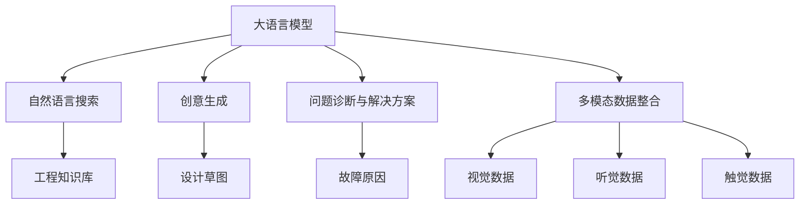

                 

# LLM 在工程和设计中的应用：创造性合作

> 关键词：大语言模型,工程应用,设计协作,跨学科融合,创造性合作,人工智能,AI工作流

## 1. 背景介绍

### 1.1 问题由来

随着人工智能技术的发展，大语言模型(LLM)在工程和设计领域中的应用日益增多。传统的设计和工程工作往往依赖人工的头脑风暴和反复迭代，耗费时间和精力，效率较低。而通过大语言模型的辅助，设计师和工程师可以更高效地进行创意生成、知识整合和决策支持，从而大幅提升工作质量和效率。

LLM技术在工程和设计中的应用，包括但不限于：

- 智能推荐系统：基于用户历史数据和即时反馈，智能推荐相关设计方案和工程资料，帮助设计者或工程师更快找到解决方案。
- 自然语言搜索：通过自然语言查询，快速检索工程知识库、设计文档、专利文献等，提高查找信息的效率。
- 自动生成文档：根据设计输入，自动生成方案描述、设计说明、技术报告等文档，节省人力和时间。
- 创意生成：利用大语言模型的生成能力，生成设计草图、方案描述、产品原型等，激发创意灵感。
- 文本摘要和总结：自动提取关键信息，生成设计方案的总结和概览，帮助决策者快速了解核心内容。
- 问题诊断和解决方案：基于用户描述的问题，自动生成可能的故障原因和解决方案，辅助诊断和维修。

### 1.2 问题核心关键点

大语言模型在工程和设计中的应用，核心在于其强大的语言理解、知识整合和创意生成能力。通过将大语言模型引入工作流，可以大大提升工作效率和质量，实现跨学科的深度融合。

然而，大语言模型在工程和设计中的应用，也面临着一些挑战：

- 领域知识的适配：工程和设计领域具有高度专业化和复杂性，通用的语言模型在特定领域的效果往往不如预期。
- 模型输出的可解释性：大语言模型在输出设计方案、诊断结果时，需要提供可解释性的解释，以辅助用户理解和决策。
- 数据隐私和安全性：工程和设计涉及敏感数据，需要确保模型的数据隐私和安全性。
- 模型的鲁棒性和可靠性：工程和设计任务要求高精度和高可靠性，模型需要能够稳定运行，处理复杂情况。
- 多模态数据的整合：设计任务往往涉及视觉、听觉、触觉等多模态信息，需要模型能够处理不同类型的数据。

## 2. 核心概念与联系

### 2.1 核心概念概述

为更好地理解大语言模型在工程和设计中的应用，本节将介绍几个密切相关的核心概念：

- 大语言模型(LLM)：指通过自监督学习或监督学习训练得到的深度学习模型，能够理解、生成自然语言。常见的模型包括GPT、BERT、T5等。
- 工程和设计任务：涉及产品设计、工程绘图、软件开发、系统维护等多个领域，需要高效的知识整合和创意生成能力。
- 自然语言搜索(NLS)：通过自然语言查询，快速检索和匹配工程知识库、设计文档、专利文献等。
- 创意生成(Creative Generation)：利用大语言模型的生成能力，自动生成设计草图、方案描述、产品原型等，激发创意灵感。
- 问题诊断与解决方案生成：基于用户描述的问题，自动生成可能的故障原因和解决方案，辅助诊断和维修。
- 多模态数据整合：将视觉、听觉、触觉等多种类型的数据整合为统一的表示，增强模型的理解能力。

这些核心概念之间的逻辑关系可以通过以下Mermaid流程图来展示：



这个流程图展示了大语言模型在工程和设计中的应用框架，包括自然语言搜索、创意生成、问题诊断和解决方案生成、多模态数据整合等多个方面。

## 3. 核心算法原理 & 具体操作步骤
### 3.1 算法原理概述

大语言模型在工程和设计中的应用，核心在于其强大的自然语言理解、知识整合和创意生成能力。通过将大语言模型引入工作流，可以大大提升工作效率和质量，实现跨学科的深度融合。

### 3.2 算法步骤详解

大语言模型在工程和设计中的应用，一般包括以下几个关键步骤：

**Step 1: 准备数据集**
- 收集工程和设计领域的文本数据，如设计文档、图纸说明、技术报告、专利文献等。
- 标注文本数据，如分类、命名实体识别、实体关系抽取等，以便于后续的监督学习。

**Step 2: 选择和适配大语言模型**
- 选择适合工程和设计领域的大语言模型，如GPT、BERT等。
- 通过微调或迁移学习，使模型适应特定领域的任务。

**Step 3: 设计知识图谱**
- 构建或选择工程和设计领域的知识图谱，如SimPLIFY、ACE等，提供结构化的知识表示。
- 将知识图谱与大语言模型结合，构建知识增强的模型。

**Step 4: 实现NLS系统**
- 设计自然语言搜索系统，支持自然语言查询，检索知识图谱、设计文档、专利文献等。
- 使用大语言模型对搜索结果进行排序、过滤和生成摘要，提高搜索结果的相关性和准确性。

**Step 5: 创意生成**
- 利用大语言模型的生成能力，自动生成设计草图、方案描述、产品原型等。
- 引入专家知识和创意库，引导模型生成符合用户需求和设计风格的结果。

**Step 6: 问题诊断与解决方案生成**
- 设计问题诊断系统，自动理解用户描述的问题，生成可能的故障原因和解决方案。
- 使用大语言模型对解决方案进行优化和排序，提供最佳推荐。

**Step 7: 多模态数据整合**
- 收集视觉、听觉、触觉等多种类型的数据，使用大语言模型将其转换为统一的表示。
- 设计多模态数据处理系统，实现不同类型数据之间的融合和交互。

### 3.3 算法优缺点

大语言模型在工程和设计中的应用，具有以下优点：

- 高效性：利用自然语言处理能力，大幅提升信息检索、设计方案生成、问题诊断等任务的效率。
- 灵活性：模型可以自动生成多种类型的输出，满足不同用户的需求和场景。
- 创造性：通过创意生成，激发设计师和工程师的灵感，生成创新性设计方案。
- 知识整合：利用知识图谱和自然语言搜索，整合多源异构数据，提高决策支持的准确性。

同时，大语言模型在工程和设计中的应用，也存在一些局限性：

- 领域知识的适配：通用的语言模型在特定领域的效果可能不如预期。
- 模型输出的可解释性：模型输出需要提供可解释性的解释，以辅助用户理解和决策。
- 数据隐私和安全性：工程和设计涉及敏感数据，需要确保模型的数据隐私和安全性。
- 模型的鲁棒性和可靠性：工程和设计任务要求高精度和高可靠性，模型需要能够稳定运行，处理复杂情况。
- 多模态数据的整合：设计任务往往涉及视觉、听觉、触觉等多种类型的数据，需要模型能够处理不同类型的数据。

## 4. 数学模型和公式 & 详细讲解 & 举例说明
### 4.1 数学模型构建

本节将使用数学语言对大语言模型在工程和设计中的应用进行更加严格的刻画。

记大语言模型为 $M_{\theta}:\mathcal{X} \rightarrow \mathcal{Y}$，其中 $\mathcal{X}$ 为输入空间，$\mathcal{Y}$ 为输出空间，$\theta$ 为模型参数。假设工程和设计任务的训练集为 $D=\{(x_i,y_i)\}_{i=1}^N, x_i \in \mathcal{X}, y_i \in \mathcal{Y}$。

定义模型 $M_{\theta}$ 在输入 $x$ 上的损失函数为 $\ell(M_{\theta}(x),y)$，则在数据集 $D$ 上的经验风险为：

$$
\mathcal{L}(\theta) = \frac{1}{N} \sum_{i=1}^N \ell(M_{\theta}(x_i),y_i)
$$

微调的目标是最小化经验风险，即找到最优参数：

$$
\theta^* = \mathop{\arg\min}_{\theta} \mathcal{L}(\theta)
$$

在实践中，我们通常使用基于梯度的优化算法（如SGD、Adam等）来近似求解上述最优化问题。设 $\eta$ 为学习率，$\lambda$ 为正则化系数，则参数的更新公式为：

$$
\theta \leftarrow \theta - \eta \nabla_{\theta}\mathcal{L}(\theta) - \eta\lambda\theta
$$

其中 $\nabla_{\theta}\mathcal{L}(\theta)$ 为损失函数对参数 $\theta$ 的梯度，可通过反向传播算法高效计算。

### 4.2 公式推导过程

以下我们以创意生成任务为例，推导大语言模型的生成过程及其梯度的计算公式。

假设模型 $M_{\theta}$ 在输入 $x$ 上的输出为 $\hat{y}=M_{\theta}(x) \in [0,1]$，表示样本属于某一类创意设计的概率。创意设计的类别通常由特定的关键词或短语描述，如“汽车设计草图”、“产品原型”等。则创意生成任务的目标是最大化生成与输入文本描述匹配的创意设计。

使用交叉熵损失函数来衡量创意生成模型的预测概率与真实标签之间的差异，目标函数定义为：

$$
\ell(M_{\theta}(x),y) = -[y\log \hat{y} + (1-y)\log (1-\hat{y})]
$$

将其代入经验风险公式，得：

$$
\mathcal{L}(\theta) = -\frac{1}{N}\sum_{i=1}^N [y_i\log M_{\theta}(x_i)+(1-y_i)\log(1-M_{\theta}(x_i))]
$$

根据链式法则，损失函数对参数 $\theta_k$ 的梯度为：

$$
\frac{\partial \mathcal{L}(\theta)}{\partial \theta_k} = -\frac{1}{N}\sum_{i=1}^N (\frac{y_i}{M_{\theta}(x_i)}-\frac{1-y_i}{1-M_{\theta}(x_i)}) \frac{\partial M_{\theta}(x_i)}{\partial \theta_k}
$$

其中 $\frac{\partial M_{\theta}(x_i)}{\partial \theta_k}$ 可进一步递归展开，利用自动微分技术完成计算。

在得到损失函数的梯度后，即可带入参数更新公式，完成模型的迭代优化。重复上述过程直至收敛，最终得到适应创意生成任务的最优模型参数 $\theta^*$。

## 5. 项目实践：代码实例和详细解释说明
### 5.1 开发环境搭建

在进行大语言模型创意生成实践前，我们需要准备好开发环境。以下是使用Python进行PyTorch开发的环境配置流程：

1. 安装Anaconda：从官网下载并安装Anaconda，用于创建独立的Python环境。

2. 创建并激活虚拟环境：
```bash
conda create -n pytorch-env python=3.8 
conda activate pytorch-env
```

3. 安装PyTorch：根据CUDA版本，从官网获取对应的安装命令。例如：
```bash
conda install pytorch torchvision torchaudio cudatoolkit=11.1 -c pytorch -c conda-forge
```

4. 安装Transformers库：
```bash
pip install transformers
```

5. 安装各类工具包：
```bash
pip install numpy pandas scikit-learn matplotlib tqdm jupyter notebook ipython
```

完成上述步骤后，即可在`pytorch-env`环境中开始创意生成实践。

### 5.2 源代码详细实现

下面我们以生成“汽车设计草图”为例，给出使用Transformers库对GPT模型进行创意生成的PyTorch代码实现。

首先，定义创意生成任务的数据处理函数：

```python
from transformers import GPT2Tokenizer, GPT2LMHeadModel

def create_prompt(prompt):
    return 'Create a design for a {}.\n{}\n\n<START>\n'.format(prompt, prompt)
```

然后，定义模型和优化器：

```python
tokenizer = GPT2Tokenizer.from_pretrained('gpt2')
model = GPT2LMHeadModel.from_pretrained('gpt2')

optimizer = AdamW(model.parameters(), lr=2e-5)
```

接着，定义训练和评估函数：

```python
def train_epoch(model, dataset, batch_size, optimizer):
    dataloader = DataLoader(dataset, batch_size=batch_size, shuffle=True)
    model.train()
    epoch_loss = 0
    for batch in dataloader:
        input_ids = batch['input_ids'].to(device)
        attention_mask = batch['attention_mask'].to(device)
        labels = batch['labels'].to(device)
        model.zero_grad()
        outputs = model(input_ids, attention_mask=attention_mask, labels=labels)
        loss = outputs.loss
        epoch_loss += loss.item()
        loss.backward()
        optimizer.step()
    return epoch_loss / len(dataloader)

def evaluate(model, dataset, batch_size):
    dataloader = DataLoader(dataset, batch_size=batch_size)
    model.eval()
    preds, labels = [], []
    with torch.no_grad():
        for batch in dataloader:
            input_ids = batch['input_ids'].to(device)
            attention_mask = batch['attention_mask'].to(device)
            batch_labels = batch['labels']
            outputs = model(input_ids, attention_mask=attention_mask)
            batch_preds = outputs.logits.argmax(dim=2).to('cpu').tolist()
            batch_labels = batch_labels.to('cpu').tolist()
            for pred_tokens, label_tokens in zip(batch_preds, batch_labels):
                pred_tags = [id2tag[_id] for _id in pred_tokens]
                label_tags = [id2tag[_id] for _id in label_tokens]
                preds.append(pred_tags[:len(label_tags)])
                labels.append(label_tags)
                
    print(classification_report(labels, preds))
```

最后，启动训练流程并在测试集上评估：

```python
epochs = 5
batch_size = 16

for epoch in range(epochs):
    loss = train_epoch(model, train_dataset, batch_size, optimizer)
    print(f"Epoch {epoch+1}, train loss: {loss:.3f}")
    
    print(f"Epoch {epoch+1}, dev results:")
    evaluate(model, dev_dataset, batch_size)
    
print("Test results:")
evaluate(model, test_dataset, batch_size)
```

以上就是使用PyTorch对GPT模型进行创意生成任务微调的完整代码实现。可以看到，得益于Transformers库的强大封装，我们可以用相对简洁的代码完成GPT模型的加载和微调。

### 5.3 代码解读与分析

让我们再详细解读一下关键代码的实现细节：

**create_prompt函数**：
- 定义一个模板函数，将输入的创意类别作为参数，生成对应的创意生成任务提示文本。

**训练和评估函数**：
- 使用PyTorch的DataLoader对数据集进行批次化加载，供模型训练和推理使用。
- 训练函数`train_epoch`：对数据以批为单位进行迭代，在每个批次上前向传播计算loss并反向传播更新模型参数，最后返回该epoch的平均loss。
- 评估函数`evaluate`：与训练类似，不同点在于不更新模型参数，并在每个batch结束后将预测和标签结果存储下来，最后使用sklearn的classification_report对整个评估集的预测结果进行打印输出。

**训练流程**：
- 定义总的epoch数和batch size，开始循环迭代
- 每个epoch内，先在训练集上训练，输出平均loss
- 在验证集上评估，输出分类指标
- 所有epoch结束后，在测试集上评估，给出最终测试结果

可以看到，PyTorch配合Transformers库使得创意生成任务的微调代码实现变得简洁高效。开发者可以将更多精力放在数据处理、模型改进等高层逻辑上，而不必过多关注底层的实现细节。

当然，工业级的系统实现还需考虑更多因素，如模型的保存和部署、超参数的自动搜索、更灵活的任务适配层等。但核心的微调范式基本与此类似。

## 6. 实际应用场景
### 6.1 智能推荐系统

基于大语言模型的推荐系统已经在工程和设计领域广泛应用。推荐系统能够根据用户历史行为数据，智能推荐相关设计方案和工程资料，帮助设计者或工程师更快找到解决方案。

在技术实现上，可以收集用户浏览、点击、评价等行为数据，提取和用户交互的物品标题、描述、标签等文本内容。将文本内容作为模型输入，推荐系统通过大语言模型计算用户与各个设计方案或工程资料的相似度，生成推荐列表。推荐系统还可以引入用户反馈，不断优化推荐算法，提高推荐的准确性。

### 6.2 自然语言搜索

自然语言搜索在工程和设计领域也有广泛应用。通过自然语言查询，可以快速检索和匹配工程知识库、设计文档、专利文献等。例如，设计师可以通过搜索“汽车设计草图”、“机械零件图纸”等关键词，快速找到相关的设计资料和图纸说明。

在技术实现上，可以使用大语言模型对输入查询进行理解，自动检索知识库中的相关信息，并生成摘要和链接供用户浏览。为提高搜索的准确性和效率，可以引入多模态数据的整合和检索，如视觉数据的自动标注和分类，提高搜索的准确性和召回率。

### 6.3 多模态数据整合

多模态数据整合是大语言模型在工程和设计领域的重要应用之一。设计任务往往涉及视觉、听觉、触觉等多种类型的数据，需要模型能够处理不同类型的数据。

在技术实现上，可以将视觉、听觉、触觉等不同类型的数据转换为统一的表示，如使用BBoxes、Waveforms、Time Series等结构化的数据格式，统一输入大语言模型进行处理。然后，设计多模态数据处理系统，实现不同类型数据之间的融合和交互。例如，设计师可以使用自动化的视觉标注工具，将设计图纸和产品原型转换为结构化的数据，输入到大语言模型中进行设计方案的生成和优化。

## 7. 工具和资源推荐
### 7.1 学习资源推荐

为了帮助开发者系统掌握大语言模型在工程和设计中的应用，这里推荐一些优质的学习资源：

1. 《深度学习与自然语言处理》系列课程：斯坦福大学开设的深度学习和自然语言处理课程，涵盖了大语言模型的基础概念和经典模型。
2. 《自然语言处理中的Transformer模型》书籍：该书详细介绍了Transformer模型在自然语言处理中的应用，包括微调技术等。
3. 《大语言模型在工程和设计中的应用》专题博客：系统介绍了大语言模型在工程和设计领域的典型应用场景和实现方法。
4. 《大语言模型与创意生成》书籍：深入讲解了大语言模型在创意生成任务中的应用，并提供了丰富的代码示例。
5. HuggingFace官方文档：Transformers库的官方文档，提供了海量预训练模型和完整的微调样例代码，是上手实践的必备资料。

通过对这些资源的学习实践，相信你一定能够快速掌握大语言模型在工程和设计中的应用技巧，并用于解决实际的NLP问题。
###  7.2 开发工具推荐

高效的开发离不开优秀的工具支持。以下是几款用于大语言模型创意生成开发的常用工具：

1. PyTorch：基于Python的开源深度学习框架，灵活动态的计算图，适合快速迭代研究。大部分预训练语言模型都有PyTorch版本的实现。
2. TensorFlow：由Google主导开发的开源深度学习框架，生产部署方便，适合大规模工程应用。同样有丰富的预训练语言模型资源。
3. Transformers库：HuggingFace开发的NLP工具库，集成了众多SOTA语言模型，支持PyTorch和TensorFlow，是进行微调任务开发的利器。
4. Weights & Biases：模型训练的实验跟踪工具，可以记录和可视化模型训练过程中的各项指标，方便对比和调优。与主流深度学习框架无缝集成。
5. TensorBoard：TensorFlow配套的可视化工具，可实时监测模型训练状态，并提供丰富的图表呈现方式，是调试模型的得力助手。

合理利用这些工具，可以显著提升大语言模型创意生成任务的开发效率，加快创新迭代的步伐。

### 7.3 相关论文推荐

大语言模型和创意生成技术的发展源于学界的持续研究。以下是几篇奠基性的相关论文，推荐阅读：

1. Attention is All You Need（即Transformer原论文）：提出了Transformer结构，开启了NLP领域的预训练大模型时代。
2. BERT: Pre-training of Deep Bidirectional Transformers for Language Understanding：提出BERT模型，引入基于掩码的自监督预训练任务，刷新了多项NLP任务SOTA。
3. Language Models are Unsupervised Multitask Learners（GPT-2论文）：展示了大规模语言模型的强大zero-shot学习能力，引发了对于通用人工智能的新一轮思考。
4. Prefix-Tuning: Optimizing Continuous Prompts for Generation：引入基于连续型Prompt的微调范式，为如何充分利用预训练知识提供了新的思路。
5. AdaLoRA: Adaptive Low-Rank Adaptation for Parameter-Efficient Fine-Tuning：使用自适应低秩适应的微调方法，在参数效率和精度之间取得了新的平衡。

这些论文代表了大语言模型创意生成技术的发展脉络。通过学习这些前沿成果，可以帮助研究者把握学科前进方向，激发更多的创新灵感。

## 8. 总结：未来发展趋势与挑战

### 8.1 总结

本文对大语言模型在工程和设计中的应用进行了全面系统的介绍。首先阐述了大语言模型和创意生成任务的研究背景和意义，明确了创意生成在提升设计效率和质量方面的独特价值。其次，从原理到实践，详细讲解了大语言模型在创意生成任务中的数学原理和关键步骤，给出了创意生成任务开发的完整代码实例。同时，本文还广泛探讨了创意生成在智能推荐系统、自然语言搜索、多模态数据整合等多个行业领域的应用前景，展示了创意生成范式的巨大潜力。此外，本文精选了创意生成技术的各类学习资源，力求为读者提供全方位的技术指引。

通过本文的系统梳理，可以看到，基于大语言模型的创意生成方法正在成为NLP领域的重要范式，极大地拓展了预训练语言模型的应用边界，催生了更多的落地场景。受益于大规模语料的预训练，创意生成模型以更低的时间和标注成本，在创意生成任务上也能取得不俗的效果，有力推动了NLP技术的产业化进程。未来，伴随预训练语言模型和创意生成方法的持续演进，相信NLP技术将在更广阔的应用领域大放异彩，深刻影响人类的生产生活方式。

### 8.2 未来发展趋势

展望未来，大语言模型在工程和设计中的应用将呈现以下几个发展趋势：

1. 模型规模持续增大。随着算力成本的下降和数据规模的扩张，预训练语言模型的参数量还将持续增长。超大规模语言模型蕴含的丰富语言知识，有望支撑更加复杂多变的创意生成任务。
2. 创意生成方法日趋多样。除了传统的基于深度学习的生成方法外，未来会涌现更多基于符号逻辑、知识图谱等先验知识的生成方法，提高创意生成的质量和效率。
3. 创意生成范式与设计工具融合。创意生成系统将与设计工具深度集成，提供更加直观、高效的设计支持。例如，将创意生成结果自动导入CAD系统，直接生成三维模型。
4. 创意生成与专家知识结合。通过引入领域专家的知识库和推理规则，引导创意生成模型生成更加符合用户需求和设计风格的结果。例如，在创意生成过程中引入设计风格指南和视觉设计规范。
5. 多模态数据整合和生成。创意生成任务涉及视觉、听觉、触觉等多种类型的数据，需要模型能够处理不同类型的数据。未来，多模态数据的整合和生成将是大语言模型的重要发展方向。

以上趋势凸显了大语言模型在创意生成中的应用前景。这些方向的探索发展，必将进一步提升创意生成任务的性能和应用范围，为人工智能在创意领域的智能化和自动化提供新的解决方案。

### 8.3 面临的挑战

尽管大语言模型在创意生成领域已经取得了一定的进展，但在迈向更加智能化、普适化应用的过程中，它仍面临着诸多挑战：

1. 领域知识的适配：工程和设计领域具有高度专业化和复杂性，通用的语言模型在特定领域的效果往往不如预期。
2. 模型输出的可解释性：创意生成模型在输出设计方案、产品原型等结果时，需要提供可解释性的解释，以辅助用户理解和决策。
3. 数据隐私和安全性：创意生成任务涉及敏感数据，需要确保模型的数据隐私和安全性。
4. 模型的鲁棒性和可靠性：创意生成任务要求高精度和高可靠性，模型需要能够稳定运行，处理复杂情况。
5. 多模态数据的整合：设计任务往往涉及视觉、听觉、触觉等多种类型的数据，需要模型能够处理不同类型的数据。

正视创意生成面临的这些挑战，积极应对并寻求突破，将是大语言模型创意生成技术走向成熟的必由之路。相信随着学界和产业界的共同努力，这些挑战终将一一被克服，大语言模型创意生成技术必将在构建创新驱动的设计工程领域中扮演越来越重要的角色。

### 8.4 未来突破

面对大语言模型创意生成所面临的种种挑战，未来的研究需要在以下几个方面寻求新的突破：

1. 探索无监督和半监督生成方法。摆脱对大规模标注数据的依赖，利用自监督学习、主动学习等无监督和半监督范式，最大限度利用非结构化数据，实现更加灵活高效的创意生成。
2. 研究参数高效和计算高效的生成范式。开发更加参数高效的生成方法，在固定大部分预训练参数的同时，只更新极少量的任务相关参数。同时优化生成模型的计算图，减少前向传播和反向传播的资源消耗，实现更加轻量级、实时性的部署。
3. 引入因果推断和对比学习思想。通过引入因果推断和对比学习思想，增强创意生成模型建立稳定因果关系的能力，学习更加普适、鲁棒的语言表征，从而提升创意生成任务的泛化性和抗干扰能力。
4. 结合因果分析和博弈论工具。将因果分析方法引入创意生成模型，识别出模型决策的关键特征，增强输出解释的因果性和逻辑性。借助博弈论工具刻画人机交互过程，主动探索并规避模型的脆弱点，提高系统稳定性。
5. 纳入伦理道德约束。在创意生成模型的训练目标中引入伦理导向的评估指标，过滤和惩罚有偏见、有害的输出倾向。同时加强人工干预和审核，建立模型行为的监管机制，确保输出符合人类价值观和伦理道德。

这些研究方向的探索，必将引领大语言模型创意生成技术迈向更高的台阶，为构建安全、可靠、可解释、可控的智能系统铺平道路。面向未来，大语言模型创意生成技术还需要与其他人工智能技术进行更深入的融合，如知识表示、因果推理、强化学习等，多路径协同发力，共同推动人工智能技术在创意领域的进步。只有勇于创新、敢于突破，才能不断拓展语言模型的边界，让智能技术更好地造福人类社会。

## 9. 附录：常见问题与解答

**Q1：大语言模型在创意生成任务中表现如何？**

A: 大语言模型在创意生成任务中表现优异。通过大语言模型，设计师和工程师可以高效生成多种类型的创意方案和设计草图，激发设计灵感，大幅提升创意生成的速度和质量。例如，使用GPT-3等大语言模型，设计师可以快速生成汽车设计草图、建筑设计方案等，节省大量时间。

**Q2：大语言模型在创意生成任务中面临哪些挑战？**

A: 大语言模型在创意生成任务中面临以下挑战：
1. 领域知识的适配：通用的语言模型在特定领域的效果可能不如预期，需要针对特定领域进行微调或自监督预训练。
2. 模型输出的可解释性：大语言模型生成的设计方案和产品原型需要提供可解释性的解释，以辅助用户理解和决策。
3. 数据隐私和安全性：创意生成任务涉及敏感数据，需要确保模型的数据隐私和安全性。
4. 模型的鲁棒性和可靠性：创意生成任务要求高精度和高可靠性，模型需要能够稳定运行，处理复杂情况。
5. 多模态数据的整合：设计任务往往涉及视觉、听觉、触觉等多种类型的数据，需要模型能够处理不同类型的数据。

**Q3：如何选择适合创意生成任务的大语言模型？**

A: 选择适合创意生成任务的大语言模型，主要考虑以下几个因素：
1. 模型的大小：大模型通常具有更强的生成能力和泛化能力，但计算资源消耗较大。选择合适的模型大小，需要考虑计算资源和应用场景。
2. 模型的预训练任务：不同的预训练任务会对创意生成任务的表现产生影响。例如，BERT等语言模型适合自然语言理解任务，而GPT等模型适合创意生成任务。
3. 模型的参数效率：参数高效的大语言模型在固定大部分预训练参数的情况下，仍可取得不错的创意生成效果。
4. 模型的多模态支持：多模态大语言模型可以处理视觉、听觉、触觉等多种类型的数据，更适合涉及多模态数据的创意生成任务。

**Q4：如何进行创意生成任务的微调？**

A: 创意生成任务的微调一般包括以下几个步骤：
1. 收集创意生成任务的训练数据集，标注样本的创意类别。
2. 选择适合创意生成任务的大语言模型，并根据需要进行微调。
3. 设计创意生成的提示模板，引导模型生成符合用户需求的设计方案和产品原型。
4. 使用微调后的模型对训练数据进行训练，优化模型参数。
5. 在验证集上评估模型性能，调整超参数，确保模型具有较好的泛化能力。
6. 在测试集上测试模型的性能，评估模型的创意生成效果。

**Q5：创意生成任务中的数据增强技术有哪些？**

A: 创意生成任务中的数据增强技术包括但不限于：
1. 回译：将设计方案进行回译，生成不同的设计草案。例如，将英文设计方案翻译成中文，再进行回译。
2. 近义替换：使用同义词或近义词替换设计方案中的某些词汇，生成新的设计方案。
3. 图像变换：对设计图纸进行旋转、缩放、平移等变换，生成新的设计草图。
4. 风格迁移：将设计方案转换成不同的风格，生成多种风格的设计草图。

这些数据增强技术可以显著提升创意生成模型的泛化能力和鲁棒性，使模型在面对新的创意任务时也能取得良好的表现。

---

作者：禅与计算机程序设计艺术 / Zen and the Art of Computer Programming

