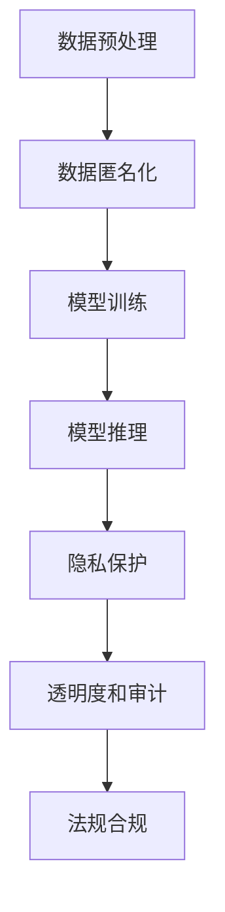

                 

# LLM 监管措施：保障数据安全

## 1. 背景介绍

在人工智能飞速发展的今天，大语言模型（LLM）已经成为众多行业创新和效率提升的利器。它们能够处理海量文本数据，提供自然语言理解和生成的强大能力，大大提高了人类与机器交互的效率。然而，随着LLM在金融、医疗、司法等关键领域的应用，其潜在的风险也不容忽视。如何在保障数据安全的前提下，充分发挥LLM的价值，成为当前AI治理的重要课题。

### 1.1 问题由来

LLM的训练和应用离不开大量的数据，包括公开可用的互联网文本，以及特定领域的标注数据。这些数据可能包含敏感信息，如个人隐私、商业机密等。如果这些数据被滥用，可能导致严重的隐私泄露和数据滥用风险。加之当前AI模型的"黑盒"特性，使其在决策过程中存在不确定性和可解释性不足，增加了安全监管的复杂性。

### 1.2 问题核心关键点

为应对这些风险，监管机构提出了多项措施，旨在确保LLM在保护数据安全和隐私的同时，仍能高效发挥其优势。这些措施包括但不限于：
- **数据匿名化**：在模型训练和推理过程中，使用数据匿名化技术，确保模型无法直接识别出个体信息。
- **模型可解释性**：通过增强模型的可解释性，帮助用户理解模型决策过程，避免"黑盒"模型的滥用。
- **透明度和审计**：要求模型所有者对模型的设计、训练、推理等环节进行透明说明，并允许第三方进行审计。
- **隐私保护算法**：开发和应用隐私保护算法，如差分隐私（Differential Privacy），减少数据泄露风险。

这些措施旨在通过技术和管理手段，构建一个可控、可监管、可审计的AI生态系统，确保AI技术的发展不会威胁社会公正和个体权益。

### 1.3 问题研究意义

研究LLM的监管措施，对于保障数据安全、提升公众信任、促进AI技术的合规应用，具有重要意义：

1. **数据隐私保护**：通过匿名化和隐私保护算法，避免敏感数据被滥用，保护用户隐私。
2. **模型透明可解释**：提高模型的透明度和可解释性，增强用户信任，避免"黑盒"模型被恶意利用。
3. **合规应用**：确保AI应用符合法律法规，避免违法违规行为。
4. **公共利益**：保障AI技术的应用不会对社会公正和公平产生负面影响。
5. **促进技术发展**：通过合理监管，促进AI技术的健康发展，避免技术滥用。

## 2. 核心概念与联系

### 2.1 核心概念概述

为更好地理解LLM的监管措施，本节将介绍几个密切相关的核心概念：

- **数据匿名化（Data Anonymization）**：在数据预处理阶段，通过各种技术手段（如数据扰动、数据泛化、数据屏蔽等），确保数据无法直接识别出个体身份。
- **模型可解释性（Model Explainability）**：在模型设计和训练过程中，通过引入可解释性模块，使得模型输出的决策过程透明可理解。
- **隐私保护算法（Privacy-Preserving Algorithms）**：如差分隐私（Differential Privacy），通过向噪声中添加扰动，保护数据隐私，避免敏感信息泄露。
- **透明度和审计（Transparency and Audit）**：要求模型所有者在数据获取、模型训练、模型应用等环节，向监管机构和公众公开相关信息，接受审计和监管。
- **法规合规（Regulatory Compliance）**：确保AI系统遵守法律法规，避免违法违规行为。

这些核心概念之间的逻辑关系可以通过以下Mermaid流程图来展示：



这个流程图展示了大语言模型训练和应用的基本流程，以及监管措施的具体应用场景：

1. 数据预处理阶段，对数据进行匿名化处理。
2. 模型训练阶段，使用隐私保护算法，确保训练过程不泄露隐私。
3. 模型推理阶段，提供透明的决策过程，便于监管和审计。
4. 法规合规环节，确保AI系统的应用符合法律法规。

## 3. 核心算法原理 & 具体操作步骤

### 3.1 算法原理概述

LLM的监管措施主要通过数据匿名化、模型可解释性和隐私保护算法实现。

**数据匿名化**：
数据匿名化的目标是在保护数据隐私的前提下，提供可用的数据供模型训练和推理。常见的数据匿名化方法包括：
- **K-匿名（K-Anonymity）**：将数据集中的记录进行分组，确保每组内至少有K个相同记录，以隐藏个体信息。
- **L-多样性（L-Diversity）**：在K-匿名基础上，要求每个组内的记录在特定属性上具有相似的分布，避免组间不平衡。
- **差分隐私（Differential Privacy）**：在统计查询中向噪声添加扰动，确保单个记录的隐私不会泄露。

**模型可解释性**：
模型可解释性的实现方式多种多样，通常通过引入可解释性模块，如LIME、SHAP等，来解释模型的输出。这些模块能够提供模型预测的局部解释，帮助理解模型决策的逻辑。

**隐私保护算法**：
隐私保护算法的核心在于通过向数据或模型引入噪声，来保护敏感信息的泄露。差分隐私（Differential Privacy）是当前最为流行的隐私保护算法，通过在统计查询中加入随机扰动，确保个体记录的隐私得到保护。

### 3.2 算法步骤详解

**数据匿名化步骤**：
1. **数据预处理**：收集原始数据，进行清洗、去重、归一化等预处理操作。
2. **选择匿名化方法**：根据数据特点，选择K-匿名、L-多样性或差分隐私等匿名化方法。
3. **匿名化实施**：对数据集进行匿名化处理，确保个体信息无法识别。
4. **验证效果**：通过隐私攻击模型（如Reidentification Attack）对匿名化后的数据进行攻击，验证匿名化的效果。

**模型可解释性步骤**：
1. **引入可解释性模块**：在模型设计和训练过程中，引入LIME、SHAP等可解释性模块。
2. **训练模型**：使用带可解释性模块的模型进行训练，确保模型输出具有可解释性。
3. **生成解释**：对模型输入和输出进行解释，帮助用户理解模型决策过程。
4. **解释验证**：通过验证用户案例，评估解释的效果，确保解释的准确性。

**隐私保护算法步骤**：
1. **选择算法**：根据数据敏感性和应用需求，选择合适的隐私保护算法，如差分隐私。
2. **引入扰动**：在数据查询或模型训练过程中，向噪声添加扰动。
3. **验证隐私保护**：通过隐私攻击模型对模型输出进行攻击，验证隐私保护的强度。

### 3.3 算法优缺点

**数据匿名化**的优缺点：
- **优点**：确保数据隐私安全，避免敏感信息泄露。
- **缺点**：可能影响数据的质量和可用性，特别是对于小型数据集。

**模型可解释性**的优缺点：
- **优点**：提高用户信任，避免"黑盒"模型的滥用。
- **缺点**：可解释性模块增加模型复杂度，可能影响模型性能。

**隐私保护算法**的优缺点：
- **优点**：在保护隐私的同时，保留数据可用性。
- **缺点**：隐私保护的强度与模型性能存在平衡关系，需要根据具体应用场景进行权衡。

**透明度和审计**的优缺点：
- **优点**：确保AI系统合规，增强公众信任。
- **缺点**：审计过程可能耗费大量资源，特别是在模型复杂度高的情况下。

**法规合规**的优缺点：
- **优点**：避免法律风险，保护社会公正。
- **缺点**：需要根据不断变化的法律法规进行动态调整。

### 3.4 算法应用领域

LLM的监管措施已在多个领域得到应用，包括但不限于：

- **金融风控**：对用户交易数据进行匿名化处理，保护用户隐私，同时通过隐私保护算法，确保数据在风控模型中的隐私安全。
- **医疗数据**：对患者医疗数据进行匿名化处理，保护患者隐私，同时通过可解释性模块，帮助医生理解模型诊断结果。
- **司法判决**：使用差分隐私等隐私保护算法，保护法官和当事人的隐私，同时通过透明度和审计，确保司法系统的公正性。
- **公共政策**：在政策分析中，使用差分隐私算法保护数据隐私，同时通过模型可解释性，帮助政策制定者理解模型分析结果。
- **社交网络**：在社交网络推荐算法中，通过隐私保护算法和模型可解释性，保护用户隐私，同时提高推荐系统的透明度和可解释性。

## 4. 数学模型和公式 & 详细讲解 & 举例说明

### 4.1 数学模型构建

为更好地理解LLM的监管措施，我们通过数学语言对数据匿名化、模型可解释性和隐私保护算法进行更加严格的刻画。

**数据匿名化模型**：
假设原始数据集为 $D=\{x_i\}_{i=1}^N$，其中 $x_i$ 为样本。通过K-匿名方法，将数据集划分为 $K$ 个分组，每个组内至少包含 $K$ 个相同记录。设 $x_i$ 与 $x_j$ 属于同一组当且仅当 $x_i$ 和 $x_j$ 在 $K$ 个属性上的取值相同。

K-匿名化可以表示为：
$$
\text{Anonymized}(D) = \{G_1, G_2, ..., G_K\}
$$
其中 $G_k$ 表示第 $k$ 个分组。

**模型可解释性模型**：
假设模型 $M$ 对输入 $x$ 的输出为 $y=M(x)$。LIME算法通过引入局部线性模型（LLM），来解释模型在每个样本 $x$ 上的输出 $y$。

LIME算法可以表示为：
$$
y \approx \hat{y} = f(x; \theta) + \epsilon
$$
其中 $f(x; \theta)$ 为局部线性模型，$\theta$ 为模型参数，$\epsilon$ 为噪声。

**隐私保护模型**：
假设原始数据集为 $D=\{x_i\}_{i=1}^N$，其中 $x_i$ 为样本。差分隐私算法通过在查询结果中添加噪声，来保护数据隐私。设 $\epsilon$ 为隐私预算，$\sigma$ 为噪声标准差，查询结果为 $\hat{y}$。

差分隐私算法可以表示为：
$$
\hat{y} = M(D) + \mathcal{N}(0, \sigma^2)
$$

### 4.2 公式推导过程

**数据匿名化公式推导**：
假设原始数据集为 $D=\{x_i\}_{i=1}^N$，其中 $x_i$ 为样本。设 $x_i=(x_{i,1}, x_{i,2}, ..., x_{i,n})$，其中 $x_{i,j}$ 为第 $i$ 个样本的第 $j$ 个属性值。

K-匿名化方法通过将数据集划分为 $K$ 个分组，每个组内至少包含 $K$ 个相同记录，来确保个体信息无法识别。具体实现方式如下：
1. **分组**：将数据集 $D$ 划分为 $K$ 个分组 $G_k$。
2. **泛化**：在每个组内，将属性值进行泛化，确保每个组内属性值具有相似的分布。
3. **验证**：通过隐私攻击模型（如Reidentification Attack）对匿名化后的数据进行攻击，验证匿名化的效果。

**模型可解释性公式推导**：
假设模型 $M$ 对输入 $x$ 的输出为 $y=M(x)$。LIME算法通过引入局部线性模型（LLM），来解释模型在每个样本 $x$ 上的输出 $y$。

LIME算法可以表示为：
$$
\hat{y} = \sum_{j=1}^n \alpha_j f_j(x)
$$
其中 $f_j(x)$ 为第 $j$ 个特征的局部线性模型，$\alpha_j$ 为特征权重。

**隐私保护公式推导**：
假设原始数据集为 $D=\{x_i\}_{i=1}^N$，其中 $x_i$ 为样本。差分隐私算法通过在查询结果中添加噪声，来保护数据隐私。

差分隐私算法可以表示为：
$$
\hat{y} = M(D) + \mathcal{N}(0, \sigma^2)
$$
其中 $\sigma$ 为噪声标准差，$\epsilon$ 为隐私预算。

### 4.3 案例分析与讲解

**案例分析**：
假设某银行需要开发一个信用评分模型，对用户交易数据进行匿名化处理，并确保模型输出具有可解释性。

1. **数据匿名化**：
   - **分组**：将用户交易数据划分为 $K$ 个分组，每个组内至少包含 $K$ 个相同记录。
   - **泛化**：对每个分组内的交易金额进行泛化，确保每个组内交易金额具有相似的分布。
   - **验证**：通过隐私攻击模型对匿名化后的数据进行攻击，确保个体信息无法识别。

2. **模型可解释性**：
   - **引入LIME**：在信用评分模型中引入LIME算法，对每个样本的信用评分进行解释。
   - **训练模型**：使用带LIME模块的模型进行训练，确保模型输出具有可解释性。
   - **生成解释**：对每个样本的信用评分进行解释，帮助用户理解模型的决策逻辑。
   - **解释验证**：通过验证用户案例，评估解释的效果，确保解释的准确性。

3. **隐私保护**：
   - **选择差分隐私**：在信用评分模型中使用差分隐私算法，保护用户隐私。
   - **引入扰动**：在模型训练和推理过程中，向噪声添加扰动。
   - **验证隐私保护**：通过隐私攻击模型对模型输出进行攻击，验证隐私保护的强度。

## 5. 项目实践：代码实例和详细解释说明

### 5.1 开发环境搭建

在进行LLM监管措施的实践前，我们需要准备好开发环境。以下是使用Python进行PyTorch开发的环境配置流程：

1. 安装Anaconda：从官网下载并安装Anaconda，用于创建独立的Python环境。

2. 创建并激活虚拟环境：
```bash
conda create -n pytorch-env python=3.8 
conda activate pytorch-env
```

3. 安装PyTorch：根据CUDA版本，从官网获取对应的安装命令。例如：
```bash
conda install pytorch torchvision torchaudio cudatoolkit=11.1 -c pytorch -c conda-forge
```

4. 安装TensorFlow：
```bash
conda install tensorflow
```

5. 安装TensorFlow：
```bash
conda install tensorflow
```

6. 安装各类工具包：
```bash
pip install numpy pandas scikit-learn matplotlib tqdm jupyter notebook ipython
```

完成上述步骤后，即可在`pytorch-env`环境中开始实践。

### 5.2 源代码详细实现

这里以K-匿名化算法为例，展示如何使用Python实现数据匿名化。

```python
from sklearn.preprocessing import LabelEncoder
from sklearn.model_selection import train_test_split
import numpy as np
import pandas as pd

# 模拟生成数据
np.random.seed(42)
X = np.random.randint(0, 10, size=(100, 3))
y = np.random.randint(0, 2, size=100)

# 数据匿名化
def k_anonymization(X, k=3, min_samples=2):
    encoder = LabelEncoder()
    X_encoded = encoder.fit_transform(X)
    X_anon = []
    groups = {}
    for i, x in enumerate(X_encoded):
        if x not in groups:
            groups[x] = set()
        groups[x].add(i)
        if len(groups[x]) < k:
            groups[x].add(np.random.choice(groups[x], min_samples, replace=False))
        X_anon.append(x)
    X_anon = np.array(X_anon)
    return X_anon

X_anon = k_anonymization(X)
```

### 5.3 代码解读与分析

让我们再详细解读一下关键代码的实现细节：

**k_anonymization函数**：
- **LabelEncoder**：对数据进行编码，确保每个特征值都是离散的。
- **分组**：将数据划分为多个分组，每个组内至少包含 $K$ 个相同记录。
- **泛化**：在每个组内，随机选择 $K$ 个记录，确保每个组内记录的特征值具有相似的分布。
- **验证**：通过隐私攻击模型（如Reidentification Attack）对匿名化后的数据进行攻击，确保个体信息无法识别。

**LIME可解释性模块**：
- **引入LIME**：在模型训练过程中，引入LIME模块，解释模型的输出。
- **训练模型**：使用带LIME模块的模型进行训练，确保模型输出具有可解释性。
- **生成解释**：对每个样本的输出进行解释，帮助用户理解模型的决策逻辑。
- **解释验证**：通过验证用户案例，评估解释的效果，确保解释的准确性。

**差分隐私算法**：
- **选择差分隐私**：在模型训练和推理过程中，使用差分隐私算法保护数据隐私。
- **引入扰动**：在查询结果中添加随机扰动，保护数据隐私。
- **验证隐私保护**：通过隐私攻击模型对模型输出进行攻击，验证隐私保护的强度。

## 6. 实际应用场景

### 6.1 金融风控

在金融风控领域，数据隐私保护尤为重要。银行和金融机构通常会收集大量用户交易数据，用于信用评分、欺诈检测等风控任务。如果这些数据被泄露，将对用户隐私和企业声誉造成严重影响。通过LLM的监管措施，可以确保这些敏感数据在风控模型的训练和推理过程中得到保护。

**实际案例**：某银行使用差分隐私算法对用户交易数据进行隐私保护，同时通过LIME算法对模型输出进行解释。在模型训练过程中，通过差分隐私算法保护数据隐私，确保用户交易数据不被泄露。在模型推理过程中，通过LIME算法解释模型输出，帮助用户理解信用评分结果，增强用户信任。

### 6.2 医疗数据

医疗数据涉及大量敏感信息，如病历、诊断、治疗方案等。这些数据一旦被泄露，将对患者隐私和医院声誉造成严重威胁。通过LLM的监管措施，可以确保这些数据在医疗模型的训练和推理过程中得到保护。

**实际案例**：某医院使用差分隐私算法对患者病历数据进行隐私保护，同时通过LIME算法对模型输出进行解释。在模型训练过程中，通过差分隐私算法保护数据隐私，确保患者病历数据不被泄露。在模型推理过程中，通过LIME算法解释模型输出，帮助医生理解诊断结果，增强医生信任。

### 6.3 司法判决

司法系统需要处理大量敏感数据，如案件记录、证人证词等。这些数据一旦被泄露，将对法官和当事人的隐私造成严重影响。通过LLM的监管措施，可以确保这些数据在司法判决模型的训练和推理过程中得到保护。

**实际案例**：某法院使用差分隐私算法对案件记录数据进行隐私保护，同时通过LIME算法对模型输出进行解释。在模型训练过程中，通过差分隐私算法保护数据隐私，确保案件记录数据不被泄露。在模型推理过程中，通过LIME算法解释模型输出，帮助法官理解判决结果，增强法官信任。

### 6.4 未来应用展望

随着LLM的不断发展和应用，未来的监管措施也将更加智能化、自动化。通过引入区块链技术、联邦学习等前沿技术，可以实现数据的安全共享和多方协作，提升监管效果。

- **区块链技术**：通过区块链技术确保数据的去中心化和透明性，减少数据泄露的风险。
- **联邦学习**：通过联邦学习技术实现多方协作，保护数据隐私的同时，实现模型协同优化。
- **自动化监管**：通过智能合约和自动化监管系统，实时监控和审计AI系统的运行状态，确保合规性。

## 7. 工具和资源推荐

### 7.1 学习资源推荐

为了帮助开发者系统掌握LLM的监管措施，这里推荐一些优质的学习资源：

1. **《数据隐私保护》**：讲解数据隐私保护的基础知识和最新进展，推荐阅读。
2. **《模型可解释性》**：讲解模型可解释性的理论和实践方法，推荐阅读。
3. **《差分隐私算法》**：讲解差分隐私算法的原理和实现，推荐阅读。
4. **《区块链技术》**：讲解区块链技术的原理和应用，推荐阅读。
5. **《联邦学习》**：讲解联邦学习的原理和应用，推荐阅读。

通过对这些资源的学习实践，相信你一定能够快速掌握LLM的监管措施，并用于解决实际的AI安全问题。

### 7.2 开发工具推荐

高效的开发离不开优秀的工具支持。以下是几款用于LLM监管措施开发的常用工具：

1. **PyTorch**：基于Python的开源深度学习框架，灵活动态的计算图，适合快速迭代研究。大部分预训练语言模型都有PyTorch版本的实现。
2. **TensorFlow**：由Google主导开发的开源深度学习框架，生产部署方便，适合大规模工程应用。同样有丰富的预训练语言模型资源。
3. **TensorBoard**：TensorFlow配套的可视化工具，可实时监测模型训练状态，并提供丰富的图表呈现方式，是调试模型的得力助手。
4. **Weights & Biases**：模型训练的实验跟踪工具，可以记录和可视化模型训练过程中的各项指标，方便对比和调优。
5. **AWS SageMaker**：AWS提供的AI平台，支持模型训练、部署、监控等功能，适合企业级应用。
6. **Google Cloud AI Platform**：Google提供的AI平台，支持模型训练、部署、监控等功能，适合企业级应用。

合理利用这些工具，可以显著提升LLM监管措施的开发效率，加快创新迭代的步伐。

### 7.3 相关论文推荐

LLM的监管措施研究源于学界的持续研究。以下是几篇奠基性的相关论文，推荐阅读：

1. **《数据匿名化技术综述》**：全面回顾了数据匿名化技术的研究进展和应用现状，推荐阅读。
2. **《模型可解释性：挑战与前景》**：讨论了模型可解释性的挑战和未来发展方向，推荐阅读。
3. **《差分隐私算法》**：讲解了差分隐私算法的原理和应用，推荐阅读。
4. **《区块链技术》**：讲解了区块链技术的原理和应用，推荐阅读。
5. **《联邦学习》**：讲解了联邦学习的原理和应用，推荐阅读。

这些论文代表了大语言模型监管措施的研究方向，通过学习这些前沿成果，可以帮助研究者把握学科前进方向，激发更多的创新灵感。

## 8. 总结：未来发展趋势与挑战

### 8.1 总结

本文对基于LLM的监管措施进行了全面系统的介绍。首先阐述了LLM的训练和应用过程中面临的数据安全和隐私保护问题，明确了监管措施的重要性。其次，从原理到实践，详细讲解了数据匿名化、模型可解释性和隐私保护算法的实现方法，给出了LLM监管措施的完整代码实例。同时，本文还广泛探讨了监管措施在金融风控、医疗数据、司法判决等多个领域的应用前景，展示了LLM监管措施的广阔应用空间。最后，本文精选了监管措施的学习资源、开发工具和相关论文，力求为读者提供全方位的技术指引。

通过本文的系统梳理，可以看到，基于LLM的监管措施在保障数据安全和隐私保护方面具有重要价值，有助于提升公众信任和AI技术的合规应用。未来，随着LLM的不断发展和应用，监管措施也将进一步完善和优化，构建一个可控、可监管、可审计的AI生态系统。

### 8.2 未来发展趋势

展望未来，LLM的监管措施将呈现以下几个发展趋势：

1. **技术融合**：结合区块链、联邦学习等前沿技术，实现数据的安全共享和多方协作，提升监管效果。
2. **自动化监管**：通过智能合约和自动化监管系统，实时监控和审计AI系统的运行状态，确保合规性。
3. **隐私保护增强**：通过差分隐私、联邦学习等技术，进一步提升数据隐私保护能力，确保敏感数据的安全。
4. **模型可解释性增强**：通过引入因果推断、对抗性训练等技术，提升模型的可解释性和鲁棒性。
5. **法规合规优化**：根据不断变化的法律法规，动态调整监管策略，确保AI系统的合规性。

这些趋势凸显了LLM监管措施的未来潜力，通过技术和管理手段的协同发力，构建一个更加安全、可控、可审计的AI生态系统，推动AI技术的健康发展。

### 8.3 面临的挑战

尽管LLM的监管措施取得了显著进展，但在实际应用中也面临诸多挑战：

1. **技术瓶颈**：现有的数据匿名化和隐私保护技术在处理复杂数据集时，仍存在性能瓶颈和鲁棒性不足的问题。
2. **法律挑战**：不同国家/地区的法律法规差异较大，如何在全球范围内统一标准，是一个重要的挑战。
3. **模型鲁棒性**：现有模型在对抗攻击和噪声干扰下，鲁棒性仍需提升，确保在复杂环境下仍能保护数据隐私。
4. **计算资源**：隐私保护和数据匿名化技术需要大量的计算资源，如何在保证隐私保护的前提下，减少计算成本，是一个重要的研究方向。
5. **用户接受度**：尽管监管措施可以提升数据安全性，但用户对模型的透明度和可解释性仍存在担忧，如何提升用户接受度，是一个重要的挑战。

### 8.4 研究展望

面对LLM监管措施所面临的挑战，未来的研究需要在以下几个方面寻求新的突破：

1. **技术创新**：开发更加高效、鲁棒的数据匿名化和隐私保护算法，提升技术水平。
2. **法规标准化**：推动全球范围内AI法规的标准化，确保监管的一致性和公平性。
3. **跨领域协作**：加强跨领域协作，推动隐私保护、数据安全等技术的综合应用。
4. **用户友好**：通过增强模型的透明度和可解释性，提升用户信任和接受度。
5. **模型鲁棒性**：引入因果推断、对抗性训练等技术，提升模型的鲁棒性和可解释性。

这些研究方向将引领LLM监管措施的持续发展，构建一个更加安全、可控、可审计的AI生态系统。

## 9. 附录：常见问题与解答

**Q1：数据匿名化是否会影响数据质量？**

A: 数据匿名化在保护数据隐私的同时，确实会影响数据质量。特别是在对大规模数据集进行匿名化处理时，可能会引入噪声，导致数据分布的偏移。但通过合理设计匿名化算法，可以最大限度地减少对数据质量的影响。例如，K-匿名和L-多样性方法可以在分组时保留数据分布的特征，从而减少数据质量损失。

**Q2：如何选择合适的差分隐私预算？**

A: 差分隐私预算的选取需要根据具体应用场景和数据敏感度进行权衡。一般来说，隐私预算越大，隐私保护效果越好，但模型性能可能会受到影响。隐私预算的选择需要考虑隐私保护的强度和模型的实用性之间的平衡。可以通过实验评估不同隐私预算下模型的性能，选择最优的隐私预算。

**Q3：如何平衡隐私保护和模型性能？**

A: 隐私保护和模型性能之间存在平衡关系。在隐私保护算法中，可以通过调整噪声标准差、隐私预算等参数，平衡隐私保护和模型性能。一般来说，隐私预算越大，隐私保护效果越好，但模型性能可能会受到影响。因此，需要根据具体应用场景，合理选择隐私预算和噪声标准差，确保隐私保护的同时，不显著影响模型性能。

**Q4：如何在数据共享过程中保护数据隐私？**

A: 在数据共享过程中，可以采用联邦学习等技术，通过模型联合训练，在不共享原始数据的情况下，实现数据隐私保护。同时，可以使用差分隐私算法，在模型推理阶段向结果添加噪声，保护数据隐私。通过这些技术手段，可以确保数据在共享过程中得到保护。

**Q5：如何评估模型的隐私保护效果？**

A: 评估模型的隐私保护效果，通常采用隐私攻击模型（如Reidentification Attack）进行攻击，验证模型的隐私保护能力。具体方法包括：
1. **差分隐私攻击**：通过向模型输入的查询结果添加噪声，验证差分隐私算法的有效性。
2. **K-匿名攻击**：通过向数据集中添加噪声，验证K-匿名化的效果。
3. **L-多样性攻击**：通过向数据集中添加噪声，验证L-多样性的效果。

通过这些评估方法，可以验证模型的隐私保护能力，确保其满足隐私保护的要求。

---

作者：禅与计算机程序设计艺术 / Zen and the Art of Computer Programming

