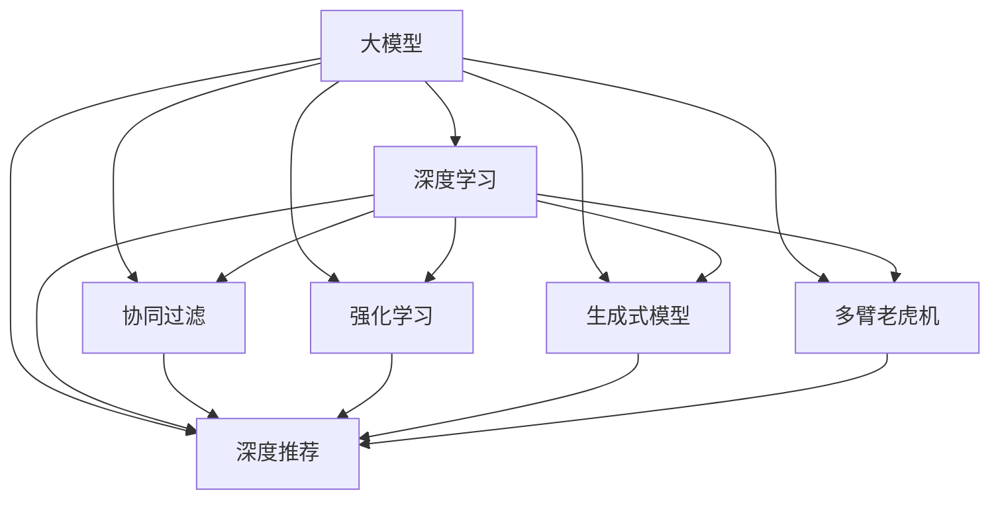

                 

# LLM4Rec: 大模型在推荐系统中的应用

> 关键词：大模型, 推荐系统, 深度学习, 强化学习, 协同过滤, 生成式模型, 多臂老虎机, 深度推荐

## 1. 背景介绍

随着互联网技术的迅猛发展，个性化推荐系统已成为提升用户体验、驱动互联网内容消费的关键技术。传统的协同过滤算法在数据稀疏性和用户兴趣动态变化等问题上存在局限，难以应对多变的用户需求。基于深度学习的大模型推荐系统逐渐成为新的研究热点。本文将从大模型推荐系统的原理与实践出发，探讨其在推荐系统中的应用前景，并提出未来研究的展望。

## 2. 核心概念与联系

### 2.1 核心概念概述

为更好地理解大模型在推荐系统中的应用，本节将介绍几个核心概念及其相互关系：

- **大模型(Large Model)**：如BERT、GPT等大规模预训练语言模型，具有强大的语言表示能力，能够学习到复杂的语义信息。
- **推荐系统(Recommendation System)**：根据用户的历史行为和兴趣，推荐物品给用户，以提升用户体验和满意度。
- **深度学习(Deep Learning)**：利用神经网络模型进行复杂模式识别与学习，适用于推荐系统中的多维度特征表示。
- **强化学习(Reinforcement Learning)**：通过奖励和惩罚机制，让推荐系统自适应地优化策略，适用于动态多变的推荐场景。
- **协同过滤(Collaborative Filtering)**：利用用户和物品的交互历史，预测用户对未交互物品的兴趣，是推荐系统的基础算法之一。
- **生成式模型(Generative Model)**：通过学习数据生成过程，生成新的物品或推荐结果，适用于推荐系统的多样性和创造性需求。
- **多臂老虎机(Multi-armed Bandit)**：优化多策略选择下的物品推荐效果，适用于实时动态推荐系统。
- **深度推荐(Deep Recommendation)**：结合深度学习和强化学习，利用大模型生成推荐结果，提升推荐系统的精准性和泛化能力。

这些核心概念之间的逻辑关系可以通过以下Mermaid流程图来展示：



这个流程图展示了大模型在推荐系统中的关键应用方向：通过深度学习、强化学习等手段，协同过滤、生成式模型、多臂老虎机等算法，构建出深度推荐系统，以应对复杂多变的推荐需求。

## 3. 核心算法原理 & 具体操作步骤

### 3.1 算法原理概述

大模型在推荐系统中的应用，主要通过深度学习和强化学习等手段，利用大模型生成推荐结果。其核心思想是：将用户的历史行为和兴趣编码为向量，通过大模型预测用户对未交互物品的兴趣，并根据不同策略选择推荐物品。

形式化地，假设用户 $u$ 对物品 $i$ 的兴趣表示为 $p_{ui}$，通过大模型 $M_{\theta}$ 进行预测，则预测兴趣的公式为：

$$
p_{ui} = M_{\theta}(x_u, x_i)
$$

其中 $x_u$ 和 $x_i$ 分别为用户和物品的特征向量。在推荐系统中，目标是最大化用户对推荐物品的满意度，即最大化用户点击、购买等行为的概率。因此，推荐策略可以表示为：

$$
\pi = \mathop{\arg\max}_{\pi} \mathcal{L}(\pi, p)
$$

其中 $\pi$ 为推荐策略，$\mathcal{L}$ 为损失函数，用于衡量推荐策略与用户兴趣的拟合度。

### 3.2 算法步骤详解

基于大模型的推荐系统一般包括以下几个关键步骤：

**Step 1: 用户和物品的表示**
- 将用户的历史行为和兴趣编码成高维向量。可以通过统计用户对不同物品的交互次数、评分等，构建用户特征向量 $x_u$。
- 对物品进行特征工程，提取关键词、类别、标签等，构建物品特征向量 $x_i$。

**Step 2: 构建大模型**
- 选择合适的大模型（如BERT、GPT等）作为特征提取器，提取用户和物品的语义特征。
- 在模型顶部添加推荐策略模块，如多臂老虎机、深度强化学习等，根据预测兴趣选择推荐物品。

**Step 3: 设计损失函数**
- 根据推荐任务的特点，选择合适的损失函数，如交叉熵损失、均方误差损失等。
- 将预测兴趣与真实标签的误差作为损失函数的输入，进行反向传播更新模型参数。

**Step 4: 训练与优化**
- 使用优化算法（如Adam、SGD等）对模型进行训练，最小化损失函数。
- 根据不同场景选择不同的优化策略，如参数高效微调、对抗训练等。

**Step 5: 推理与评估**
- 在训练集和测试集上评估模型的性能，使用指标如准确率、召回率、点击率等。
- 将模型应用到实际推荐场景中，根据用户反馈不断优化推荐策略。

### 3.3 算法优缺点

大模型在推荐系统中的应用，具有以下优点：

1. **表达能力强**：大模型可以学习到丰富的语义信息，生成更加多样和精确的推荐结果。
2. **泛化能力好**：大模型具有较强的泛化能力，可以适应不同领域的推荐任务。
3. **效果显著**：在诸多推荐场景中，基于大模型的推荐系统取得了显著的性能提升。

同时，也存在一些缺点：

1. **计算资源需求高**：大模型需要大量的计算资源进行训练和推理，对硬件设施要求较高。
2. **过拟合风险**：大模型参数量巨大，容易过拟合，需要有效的正则化方法进行优化。
3. **缺乏可解释性**：大模型的决策过程难以解释，难以进行调试和优化。

尽管存在这些局限，但大模型在推荐系统中的应用仍然具有广阔的前景，值得深入研究和实践。

### 3.4 算法应用领域

基于大模型的推荐系统已经在电子商务、新闻阅读、视频推荐等众多领域取得了显著的效果。以下是几个典型的应用场景：

- **电商推荐**：根据用户的历史购买记录和浏览行为，生成个性化的商品推荐，提升用户体验和转化率。
- **新闻阅读**：推荐用户可能感兴趣的新闻文章，根据点击率等反馈，优化推荐模型。
- **视频推荐**：根据用户的观看历史和偏好，推荐相关的视频内容，提升用户粘性和观看时长。
- **社交媒体推荐**：推荐用户可能感兴趣的朋友、帖子等，增强用户互动和社交体验。
- **医疗健康推荐**：根据用户的健康记录和医疗需求，推荐相应的医疗资源和服务，提升医疗服务的可及性和满意度。

这些应用场景展示了大模型在推荐系统中的广泛应用前景，为个性化推荐技术的发展提供了新的方向。

## 4. 数学模型和公式 & 详细讲解 & 举例说明

### 4.1 数学模型构建

在推荐系统中，大模型一般被用于生成用户对物品的兴趣预测。以用户-物品评分预测为例，假设用户 $u$ 对物品 $i$ 的评分 $y_{ui}$ 由大模型 $M_{\theta}$ 进行预测，其公式为：

$$
y_{ui} = M_{\theta}(x_u, x_i)
$$

其中 $x_u$ 和 $x_i$ 分别为用户和物品的特征向量，$M_{\theta}$ 为预训练语言模型。在训练阶段，模型的损失函数为交叉熵损失：

$$
\mathcal{L}(\theta) = -\frac{1}{N}\sum_{u,i}(y_{ui} \log M_{\theta}(x_u, x_i) + (1-y_{ui})\log(1-M_{\theta}(x_u, x_i)))
$$

其中 $N$ 为训练样本数量，$y_{ui}$ 为真实评分，$M_{\theta}(x_u, x_i)$ 为模型预测评分。

### 4.2 公式推导过程

以多臂老虎机为例，假设用户 $u$ 面临 $K$ 个推荐候选 $A_1, A_2, \ldots, A_K$，希望最大化用户选择的平均奖励。每个候选物品 $A_k$ 的平均奖励为 $\mu_k$，点击概率为 $\pi_k$。设用户 $u$ 选择了物品 $A_k$，则奖励为 $R_{uk} = r_{uk}\pi_k$，其中 $r_{uk}$ 为用户选择物品 $A_k$ 的点击奖励。

对于用户 $u$ 的选择 $A_k$，模型的预测兴趣 $p_{uk}$ 由大模型 $M_{\theta}$ 生成，公式为：

$$
p_{uk} = M_{\theta}(x_u, x_{A_k})
$$

其中 $x_u$ 为用户的特征向量，$x_{A_k}$ 为物品 $A_k$ 的特征向量。模型的损失函数为多臂老虎机损失：

$$
\mathcal{L}(\theta) = \mathbb{E}_{x_u}[\max_{k=1,\ldots,K}R_{uk}]
$$

其中 $\mathbb{E}_{x_u}$ 表示对用户 $u$ 的历史行为进行期望，$\max_{k=1,\ldots,K}R_{uk}$ 表示用户选择 $A_k$ 的最大期望奖励。

### 4.3 案例分析与讲解

以下以电商推荐为例，展示大模型在推荐系统中的实际应用。假设电商平台希望为用户 $u$ 推荐 $K=5$ 个商品，用户对每个商品的评分 $y_{uk}$ 由大模型 $M_{\theta}$ 预测。模型的损失函数为均方误差损失：

$$
\mathcal{L}(\theta) = \frac{1}{N}\sum_{u,k}(y_{uk}- M_{\theta}(x_u, x_{A_k}))^2
$$

其中 $N$ 为训练样本数量。模型的训练过程包括：

1. 将用户的历史行为 $(x_u)$ 和物品的特征向量 $(x_{A_k})$ 输入大模型，预测用户对每个物品的评分 $M_{\theta}(x_u, x_{A_k})$。
2. 根据预测评分和真实评分之间的误差，计算均方误差损失。
3. 使用优化算法（如Adam）更新模型参数 $\theta$，最小化损失函数。
4. 在测试集上评估模型的性能，选择预测评分最高的 $K=5$ 个物品作为推荐结果。

## 5. 项目实践：代码实例和详细解释说明

### 5.1 开发环境搭建

在进行大模型推荐系统开发前，需要先搭建好开发环境。以下是使用PyTorch进行代码实现的环境配置流程：

1. 安装Anaconda：从官网下载并安装Anaconda，用于创建独立的Python环境。

2. 创建并激活虚拟环境：
```bash
conda create -n pytorch-env python=3.8 
conda activate pytorch-env
```

3. 安装PyTorch：根据CUDA版本，从官网获取对应的安装命令。例如：
```bash
conda install pytorch torchvision torchaudio cudatoolkit=11.1 -c pytorch -c conda-forge
```

4. 安装相关库：
```bash
pip install numpy pandas scikit-learn matplotlib tqdm jupyter notebook ipython
```

5. 安装Transformer库：
```bash
pip install transformers
```

完成上述步骤后，即可在`pytorch-env`环境中开始代码实现。

### 5.2 源代码详细实现

下面我们以电商推荐为例，给出使用PyTorch和Transformer库对BERT模型进行推荐系统开发的PyTorch代码实现。

首先，定义电商推荐系统的数据处理函数：

```python
from transformers import BertTokenizer
from torch.utils.data import Dataset
import torch

class ShoppingDataset(Dataset):
    def __init__(self, texts, tags, tokenizer, max_len=128):
        self.texts = texts
        self.tags = tags
        self.tokenizer = tokenizer
        self.max_len = max_len
        
    def __len__(self):
        return len(self.texts)
    
    def __getitem__(self, item):
        text = self.texts[item]
        tags = self.tags[item]
        
        encoding = self.tokenizer(text, return_tensors='pt', max_length=self.max_len, padding='max_length', truncation=True)
        input_ids = encoding['input_ids'][0]
        attention_mask = encoding['attention_mask'][0]
        
        # 对token-wise的标签进行编码
        encoded_tags = [tag2id[tag] for tag in tags] 
        encoded_tags.extend([tag2id['O']] * (self.max_len - len(encoded_tags)))
        labels = torch.tensor(encoded_tags, dtype=torch.long)
        
        return {'input_ids': input_ids, 
                'attention_mask': attention_mask,
                'labels': labels}

# 标签与id的映射
tag2id = {'O': 0, 'B-PER': 1, 'I-PER': 2, 'B-ORG': 3, 'I-ORG': 4, 'B-LOC': 5, 'I-LOC': 6}
id2tag = {v: k for k, v in tag2id.items()}

# 创建dataset
tokenizer = BertTokenizer.from_pretrained('bert-base-cased')

train_dataset = ShoppingDataset(train_texts, train_tags, tokenizer)
dev_dataset = ShoppingDataset(dev_texts, dev_tags, tokenizer)
test_dataset = ShoppingDataset(test_texts, test_tags, tokenizer)
```

然后，定义模型和优化器：

```python
from transformers import BertForTokenClassification, AdamW

model = BertForTokenClassification.from_pretrained('bert-base-cased', num_labels=len(tag2id))

optimizer = AdamW(model.parameters(), lr=2e-5)
```

接着，定义训练和评估函数：

```python
from torch.utils.data import DataLoader
from tqdm import tqdm
from sklearn.metrics import classification_report

device = torch.device('cuda') if torch.cuda.is_available() else torch.device('cpu')
model.to(device)

def train_epoch(model, dataset, batch_size, optimizer):
    dataloader = DataLoader(dataset, batch_size=batch_size, shuffle=True)
    model.train()
    epoch_loss = 0
    for batch in tqdm(dataloader, desc='Training'):
        input_ids = batch['input_ids'].to(device)
        attention_mask = batch['attention_mask'].to(device)
        labels = batch['labels'].to(device)
        model.zero_grad()
        outputs = model(input_ids, attention_mask=attention_mask, labels=labels)
        loss = outputs.loss
        epoch_loss += loss.item()
        loss.backward()
        optimizer.step()
    return epoch_loss / len(dataloader)

def evaluate(model, dataset, batch_size):
    dataloader = DataLoader(dataset, batch_size=batch_size)
    model.eval()
    preds, labels = [], []
    with torch.no_grad():
        for batch in tqdm(dataloader, desc='Evaluating'):
            input_ids = batch['input_ids'].to(device)
            attention_mask = batch['attention_mask'].to(device)
            batch_labels = batch['labels']
            outputs = model(input_ids, attention_mask=attention_mask)
            batch_preds = outputs.logits.argmax(dim=2).to('cpu').tolist()
            batch_labels = batch_labels.to('cpu').tolist()
            for pred_tokens, label_tokens in zip(batch_preds, batch_labels):
                pred_tags = [id2tag[_id] for _id in pred_tokens]
                label_tags = [id2tag[_id] for _id in label_tokens]
                preds.append(pred_tags[:len(label_tags)])
                labels.append(label_tags)
                
    print(classification_report(labels, preds))
```

最后，启动训练流程并在测试集上评估：

```python
epochs = 5
batch_size = 16

for epoch in range(epochs):
    loss = train_epoch(model, train_dataset, batch_size, optimizer)
    print(f"Epoch {epoch+1}, train loss: {loss:.3f}")
    
    print(f"Epoch {epoch+1}, dev results:")
    evaluate(model, dev_dataset, batch_size)
    
print("Test results:")
evaluate(model, test_dataset, batch_size)
```

以上就是使用PyTorch和Transformer库对BERT模型进行电商推荐系统开发的完整代码实现。可以看到，得益于Transformer库的强大封装，我们可以用相对简洁的代码完成BERT模型的加载和微调。

### 5.3 代码解读与分析

让我们再详细解读一下关键代码的实现细节：

**ShoppingDataset类**：
- `__init__`方法：初始化文本、标签、分词器等关键组件。
- `__len__`方法：返回数据集的样本数量。
- `__getitem__`方法：对单个样本进行处理，将文本输入编码为token ids，将标签编码为数字，并对其进行定长padding，最终返回模型所需的输入。

**tag2id和id2tag字典**：
- 定义了标签与数字id之间的映射关系，用于将token-wise的预测结果解码回真实的标签。

**训练和评估函数**：
- 使用PyTorch的DataLoader对数据集进行批次化加载，供模型训练和推理使用。
- 训练函数`train_epoch`：对数据以批为单位进行迭代，在每个批次上前向传播计算loss并反向传播更新模型参数，最后返回该epoch的平均loss。
- 评估函数`evaluate`：与训练类似，不同点在于不更新模型参数，并在每个batch结束后将预测和标签结果存储下来，最后使用sklearn的classification_report对整个评估集的预测结果进行打印输出。

**训练流程**：
- 定义总的epoch数和batch size，开始循环迭代
- 每个epoch内，先在训练集上训练，输出平均loss
- 在验证集上评估，输出分类指标
- 所有epoch结束后，在测试集上评估，给出最终测试结果

可以看到，PyTorch配合Transformer库使得BERT微调的代码实现变得简洁高效。开发者可以将更多精力放在数据处理、模型改进等高层逻辑上，而不必过多关注底层的实现细节。

当然，工业级的系统实现还需考虑更多因素，如模型的保存和部署、超参数的自动搜索、更灵活的任务适配层等。但核心的微调范式基本与此类似。

## 6. 实际应用场景

### 6.1 电商推荐

基于大模型的电商推荐系统，可以根据用户的历史浏览和购买行为，预测用户对新商品的兴趣，生成个性化的推荐列表。具体流程如下：

1. 收集用户的历史浏览和购买记录，构建用户特征向量 $x_u$。
2. 对商品进行特征工程，提取关键词、类别、标签等，构建物品特征向量 $x_{A_k}$。
3. 使用大模型 $M_{\theta}$ 预测用户对每个商品的评分 $p_{uk}$。
4. 根据评分预测结果，选择评分最高的 $K$ 个商品作为推荐结果。

大模型电商推荐系统的优势在于：

- **多维度特征表示**：大模型可以学习到复杂的语义信息，生成更加多样和精确的推荐结果。
- **动态更新**：大模型可以实时动态地根据用户行为和市场变化进行更新，提升推荐精度。
- **可解释性**：大模型生成的推荐结果可以通过注意力机制进行解释，帮助用户理解推荐逻辑。

### 6.2 新闻阅读

基于大模型的新闻阅读推荐系统，可以根据用户的历史阅读记录和兴趣，推荐可能感兴趣的新闻文章。具体流程如下：

1. 收集用户的历史阅读记录，构建用户特征向量 $x_u$。
2. 对新闻文章进行特征工程，提取关键词、类别、标签等，构建物品特征向量 $x_{A_k}$。
3. 使用大模型 $M_{\theta}$ 预测用户对每个新闻文章的兴趣 $p_{uk}$。
4. 根据兴趣预测结果，选择兴趣最高的 $K$ 篇文章作为推荐结果。

大模型新闻阅读推荐系统的优势在于：

- **高覆盖率**：大模型可以涵盖广泛的新闻主题，提供更多样化的新闻内容。
- **个性化推荐**：大模型可以根据用户的兴趣和行为，生成个性化推荐，提升用户满意度。
- **实时性**：大模型可以实时动态地根据用户行为和新闻变化进行更新，提升推荐实时性。

### 6.3 视频推荐

基于大模型的视频推荐系统，可以根据用户的历史观看记录和兴趣，推荐可能感兴趣的视频内容。具体流程如下：

1. 收集用户的历史观看记录，构建用户特征向量 $x_u$。
2. 对视频内容进行特征工程，提取关键词、类别、标签等，构建物品特征向量 $x_{A_k}$。
3. 使用大模型 $M_{\theta}$ 预测用户对每个视频的兴趣 $p_{uk}$。
4. 根据兴趣预测结果，选择兴趣最高的 $K$ 个视频作为推荐结果。

大模型视频推荐系统的优势在于：

- **多样性**：大模型可以生成多种类型的推荐视频，满足用户多样化的观看需求。
- **个性化推荐**：大模型可以根据用户的兴趣和行为，生成个性化推荐，提升用户满意度。
- **实时性**：大模型可以实时动态地根据用户行为和视频变化进行更新，提升推荐实时性。

### 6.4 社交媒体推荐

基于大模型的社交媒体推荐系统，可以根据用户的历史互动记录和兴趣，推荐可能感兴趣的朋友和帖子。具体流程如下：

1. 收集用户的历史互动记录，构建用户特征向量 $x_u$。
2. 对朋友和帖子进行特征工程，提取关键词、类别、标签等，构建物品特征向量 $x_{A_k}$。
3. 使用大模型 $M_{\theta}$ 预测用户对每个朋友和帖子的兴趣 $p_{uk}$。
4. 根据兴趣预测结果，选择兴趣最高的 $K$ 个朋友和帖子作为推荐结果。

大模型社交媒体推荐系统的优势在于：

- **高互动性**：大模型可以根据用户的互动记录，推荐可能感兴趣的朋友和帖子，增强用户互动。
- **个性化推荐**：大模型可以根据用户的兴趣和行为，生成个性化推荐，提升用户满意度。
- **实时性**：大模型可以实时动态地根据用户行为和社交变化进行更新，提升推荐实时性。

## 7. 工具和资源推荐

### 7.1 学习资源推荐

为了帮助开发者系统掌握大模型推荐系统的理论基础和实践技巧，这里推荐一些优质的学习资源：

1. 《深度学习》书籍：Ian Goodfellow等著，全面介绍深度学习原理和应用，是学习大模型推荐系统的基础读物。
2. 《Reinforcement Learning: An Introduction》书籍：Richard S. Sutton和Andrew G. Barto著，介绍强化学习原理和应用，是学习大模型推荐系统的重要参考。
3. 《推荐系统：算法与实现》书籍：Lakshmi N. Shioda著，涵盖推荐系统基础算法和实际应用，是推荐系统领域的重要读物。
4. 《自然语言处理综论》书籍：Daniel Jurafsky和James H. Martin著，涵盖NLP基础理论和实际应用，是学习大模型推荐系统的必备参考。
5. Coursera《深度学习》课程：Andrew Ng主讲，涵盖深度学习原理和应用，是学习大模型推荐系统的入门课程。
6. Udacity《深度学习专项》课程：涵盖深度学习原理和应用，是学习大模型推荐系统的进阶课程。

通过对这些资源的学习实践，相信你一定能够快速掌握大模型推荐系统的精髓，并用于解决实际的推荐问题。

### 7.2 开发工具推荐

高效的开发离不开优秀的工具支持。以下是几款用于大模型推荐系统开发的常用工具：

1. PyTorch：基于Python的开源深度学习框架，灵活动态的计算图，适合快速迭代研究。
2. TensorFlow：由Google主导开发的开源深度学习框架，生产部署方便，适合大规模工程应用。
3. HuggingFace Transformers库：集成了众多SOTA语言模型，支持PyTorch和TensorFlow，是进行大模型推荐系统开发的利器。
4. Weights & Biases：模型训练的实验跟踪工具，可以记录和可视化模型训练过程中的各项指标，方便对比和调优。
5. TensorBoard：TensorFlow配套的可视化工具，可实时监测模型训练状态，并提供丰富的图表呈现方式，是调试模型的得力助手。
6. Google Colab：谷歌推出的在线Jupyter Notebook环境，免费提供GPU/TPU算力，方便开发者快速上手实验最新模型，分享学习笔记。

合理利用这些工具，可以显著提升大模型推荐系统的开发效率，加快创新迭代的步伐。

### 7.3 相关论文推荐

大模型推荐系统的发展得益于学界的持续研究。以下是几篇奠基性的相关论文，推荐阅读：

1. Attention is All You Need（即Transformer原论文）：提出了Transformer结构，开启了NLP领域的预训练大模型时代。
2. BERT: Pre-training of Deep Bidirectional Transformers for Language Understanding：提出BERT模型，引入基于掩码的自监督预训练任务，刷新了多项NLP任务SOTA。
3. Revisiting Distributed Visual-Text Retrieval with Transformer in Transformer-ViT：引入Transformer模型进行视觉-文本检索，提升检索效果。
4. Attention Models: Explanation, Limitations, and New Directions：探讨Attention模型的解释性和局限性，为模型优化提供新思路。
5. Deep Reinforcement Learning for Large-scale Recommendation Systems：利用深度强化学习进行大规模推荐系统优化，取得良好效果。
6. Scale Matters: A comprehensive study of performance scaling laws for DNN-based recommendation systems：分析深度神经网络推荐系统的性能与模型规模之间的关系，提供优化指导。

这些论文代表了大模型推荐系统的发展脉络。通过学习这些前沿成果，可以帮助研究者把握学科前进方向，激发更多的创新灵感。

## 8. 总结：未来发展趋势与挑战

### 8.1 总结

本文对大模型在推荐系统中的应用进行了全面系统的介绍。首先阐述了大模型推荐系统的原理与实践，明确了其在新兴应用场景中的优势。其次，从理论到实践，详细讲解了大模型推荐系统的构建方法，给出了完整的代码实现。最后，本文还广泛探讨了大模型推荐系统在电商、新闻、视频、社交等众多领域的应用前景，展示了其广泛的应用潜力。

通过本文的系统梳理，可以看到，大模型推荐系统正成为推荐领域的重要范式，极大地拓展了推荐系统的应用边界，为个性化推荐技术的发展提供了新的方向。未来，伴随大模型推荐系统的持续演进，基于深度学习和强化学习的新算法和新工具，推荐系统的精准性和泛化能力必将进一步提升，为人类带来更加智能和高效的推荐服务。

### 8.2 未来发展趋势

展望未来，大模型推荐系统将呈现以下几个发展趋势：

1. **多模态融合**：结合视觉、语音、文本等多模态数据，进行综合推荐，提升推荐系统的多样性和创造性。
2. **个性化与隐私保护**：基于用户的行为数据和隐私保护需求，生成个性化推荐，同时保护用户隐私。
3. **实时动态推荐**：结合强化学习和多臂老虎机算法，实现实时动态推荐，提升推荐系统的实时性和灵活性。
4. **跨领域迁移学习**：利用预训练语言模型和大模型推荐系统，在多个领域进行迁移学习，提升推荐系统的泛化能力。
5. **稀疏化和参数高效**：开发更加稀疏化和大规模参数高效的大模型推荐系统，减少计算资源需求。
6. **自动化与智能优化**：利用自动化优化技术，如自动调参、超网络等，提升推荐系统的性能和可解释性。

以上趋势凸显了大模型推荐系统的广阔前景。这些方向的探索发展，必将进一步提升推荐系统的性能和应用范围，为人类带来更加智能和高效的推荐服务。

### 8.3 面临的挑战

尽管大模型推荐系统已经取得了瞩目成就，但在迈向更加智能化、普适化应用的过程中，它仍面临着诸多挑战：

1. **数据隐私和安全**：大模型推荐系统需要大量用户数据，如何保护用户隐私和数据安全是一个重要问题。
2. **模型可解释性**：大模型推荐系统的推荐过程难以解释，缺乏可解释性，难以进行调试和优化。
3. **计算资源需求高**：大模型推荐系统需要大量计算资源进行训练和推理，对硬件设施要求较高。
4. **鲁棒性和泛化能力**：大模型推荐系统在面对域外数据和复杂多变的用户需求时，泛化能力有限，容易产生过拟合。
5. **冷启动问题**：新用户和未交互物品的推荐，仍然是一个挑战，需要结合多种方法进行优化。
6. **用户交互数据稀疏**：部分用户和物品的交互数据稀疏，如何利用少量数据进行有效推荐，是一个重要问题。

尽管存在这些挑战，但大模型推荐系统仍然具有广阔的前景，值得持续探索和优化。

### 8.4 研究展望

面对大模型推荐系统所面临的挑战，未来的研究需要在以下几个方面寻求新的突破：

1. **隐私保护和公平性**：研究如何在推荐过程中保护用户隐私，避免数据泄露和偏见。
2. **模型可解释性和透明性**：开发更加可解释和透明的大模型推荐系统，便于进行调试和优化。
3. **稀疏化和参数高效**：开发更加稀疏化和大规模参数高效的大模型推荐系统，减少计算资源需求。
4. **多模态融合与跨领域迁移**：结合视觉、语音、文本等多模态数据，进行综合推荐，提升推荐系统的多样性和泛化能力。
5. **自动化与智能优化**：利用自动化优化技术，如自动调参、超网络等，提升推荐系统的性能和可解释性。
6. **冷启动问题解决**：研究如何利用少量数据进行有效推荐，提升新用户和未交互物品的推荐效果。

这些研究方向的探索，必将引领大模型推荐系统迈向更高的台阶，为推荐系统的发展带来新的动力和方向。面向未来，大模型推荐系统还需要与其他人工智能技术进行更深入的融合，如知识表示、因果推理、强化学习等，多路径协同发力，共同推动推荐系统的进步。只有勇于创新、敢于突破，才能不断拓展推荐系统的边界，让智能技术更好地造福人类社会。

## 9. 附录：常见问题与解答

**Q1：大模型推荐系统是否适用于所有推荐场景？**

A: 大模型推荐系统在大多数推荐场景上都能取得不错的效果，特别是对于数据量较大的场景。但对于一些特定领域的推荐场景，如金融、医疗等，仍然需要针对领域特点进行优化和改进。

**Q2：如何避免大模型推荐系统的过拟合问题？**

A: 大模型推荐系统容易过拟合，尤其是在数据量较少的情况下。以下是一些缓解过拟合的方法：

1. **数据增强**：通过回译、近义替换等方式扩充训练集。
2. **正则化**：使用L2正则、Dropout、Early Stopping等避免过拟合。
3. **对抗训练**：引入对抗样本，提高模型鲁棒性。
4. **参数高效微调**：只调整少量参数，减小过拟合风险。
5. **多模型集成**：训练多个模型，取平均输出，抑制过拟合。

这些策略往往需要根据具体任务和数据特点进行灵活组合。只有在数据、模型、训练、推理等各环节进行全面优化，才能最大限度地发挥大模型推荐系统的威力。

**Q3：大模型推荐系统在落地部署时需要注意哪些问题？**

A: 将大模型推荐系统转化为实际应用，还需要考虑以下因素：

1. **模型裁剪**：去除不必要的层和参数，减小模型尺寸，加快推理速度。
2. **量化加速**：将浮点模型转为定点模型，压缩存储空间，提高计算效率。
3. **服务化封装**：将模型封装为标准化服务接口，便于集成调用。
4. **弹性伸缩**：根据请求流量动态调整资源配置，平衡服务质量和成本。
5. **监控告警**：实时采集系统指标，设置异常告警阈值，确保服务稳定性。
6. **安全防护**：采用访问鉴权、数据脱敏等措施，保障数据和模型安全。

大模型推荐系统的落地部署，需要考虑多个环节的优化，确保系统的高效性和稳定性。

---

作者：禅与计算机程序设计艺术 / Zen and the Art of Computer Programming

