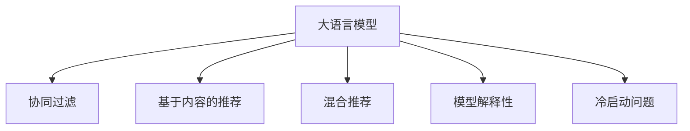

                 

# LLM与传统推荐算法的比较

> 关键词：大语言模型(LLM),推荐系统,协同过滤,基于内容的推荐,混合推荐,模型解释性,冷启动问题

## 1. 背景介绍

推荐系统（Recommender System）是互联网时代重要而热门的技术之一。其目标是在用户的海量数据中，精准预测用户可能感兴趣的物品，从而推荐给用户。经典的推荐算法如协同过滤、基于内容的推荐、混合推荐等，已经在电商、视频、音乐等多个领域得到广泛应用。

近年来，基于深度学习的推荐系统也逐渐兴起。以神经网络为代表的深度学习推荐系统，通过学习用户行为与物品属性之间的关系，构建更加丰富的推荐模型。但这类模型参数量巨大，计算复杂度高，对数据质量、标注成本、训练资源等要求较高，其表现也依赖于数据质量和预训练的质量。

与此同时，大语言模型（Large Language Model，LLM）凭借其强大的语言理解和生成能力，正逐步在推荐系统领域崭露头角。以预训练语言模型为核心的自然语言处理技术，可以广泛用于文本匹配、文本分类、情感分析等任务，并通过微调机制，适配具体的推荐场景，提供更加智能化、个性化、高效的推荐服务。

本文将对比大语言模型与传统推荐算法的不同，探讨其各自的原理、特点、应用场景及未来发展方向。

## 2. 核心概念与联系

### 2.1 核心概念概述

- **大语言模型（LLM）**：指以Transformer结构为基础，基于大规模语料进行预训练的语言模型。预训练的目的是学习通用的语言表示，具备丰富的语言理解和生成能力。如GPT、BERT等模型，都是典型的大语言模型。

- **协同过滤（Collaborative Filtering, CF）**：一种基于用户和物品相似性进行推荐的算法。根据用户的历史行为数据和物品的评分数据，找到与目标用户或物品相似的其他用户或物品，从而推测用户对目标物品的评分，进行推荐。

- **基于内容的推荐（Content-Based Recommendation, CBR）**：一种基于物品属性或用户属性的推荐方法。通过提取用户属性、物品属性等，计算相似度进行推荐。

- **混合推荐（Hybrid Recommender System）**：结合多种推荐算法进行推荐，如协同过滤与基于内容的推荐，综合利用多种数据源和算法特征，提升推荐效果。

- **模型解释性**：指推荐模型中各特征对推荐结果的贡献程度，可以帮助用户理解模型的决策过程，增强信任感。

- **冷启动问题**：指新用户或新物品加入系统时，缺乏足够的历史数据，难以进行推荐。

这些核心概念之间的逻辑关系可以通过以下Mermaid流程图来展示：



这个流程图展示了大语言模型与其他推荐算法之间的联系：

1. 大语言模型可以作为协同过滤、基于内容的推荐等算法的基础，用于特征表示和相似度计算。
2. 通过微调机制，大语言模型可以适配特定的推荐场景，如文本匹配推荐、文本分类推荐等。
3. 通过模型解释性技术，大语言模型能够提高推荐结果的可解释性。
4. 大语言模型还能够解决冷启动问题，通过文本数据生成用户画像，填补数据缺失。

## 3. 核心算法原理 & 具体操作步骤
### 3.1 算法原理概述

大语言模型与传统推荐算法的不同之处，在于其推荐的机制和模型的构建方式。以下是对二者核心原理的对比：

- **大语言模型**：
  - **预训练**：通过大规模无标签语料进行预训练，学习通用的语言表示，并构建起丰富的语言知识。
  - **微调**：在特定推荐场景下，通过下游任务的少量标注数据，对预训练模型进行有监督学习，获得针对该场景的个性化推荐能力。
  - **推荐机制**：通过输入用户文本、物品文本等，使用微调后的模型预测用户对物品的评分或兴趣，进行推荐。

- **传统推荐算法**：
  - **协同过滤**：
    - **基于用户协同过滤（User-Based CF）**：根据用户对相似物品的评分，预测用户对新物品的评分。
    - **基于物品协同过滤（Item-Based CF）**：根据物品对相似用户的评分，预测物品对新用户的评分。
  - **基于内容的推荐**：根据物品的属性或用户的属性，计算相似度，预测用户对物品的评分。
  - **混合推荐**：结合多种推荐方法，如基于用户的协同过滤、基于物品的协同过滤、基于内容的推荐等，进行推荐。

### 3.2 算法步骤详解

**大语言模型推荐步骤**：

1. **预训练**：使用大规模无标签文本数据，对大语言模型进行预训练，学习通用的语言表示。
2. **微调**：根据下游推荐任务，选取适当的训练集，对预训练模型进行微调，学习特定场景下的推荐能力。
3. **推荐**：输入用户文本和物品文本，使用微调后的模型进行评分预测或兴趣预测，进行推荐。

**协同过滤推荐步骤**：

1. **数据准备**：收集用户对物品的评分数据，构建用户-物品评分矩阵。
2. **用户协同过滤**：根据用户的历史评分数据，找到与目标用户最相似的K个用户，预测目标用户对物品的评分。
3. **物品协同过滤**：根据物品的历史评分数据，找到与目标物品最相似的物品，预测物品对目标用户的评分。

**基于内容的推荐步骤**：

1. **数据准备**：提取物品的属性或用户的属性。
2. **计算相似度**：使用相似度计算方法，计算用户和物品之间的相似度。
3. **推荐**：根据相似度对用户进行排序，推荐相似度最高的物品。

### 3.3 算法优缺点

**大语言模型**：

- **优点**：
  - **丰富语义表示**：利用语言表示学习能力，可以处理更加复杂的用户需求和物品描述，提供更加个性化和多样化的推荐。
  - **可解释性强**：能够通过输入文本和输出文本的对应关系，解释推荐过程，增强用户信任感。
  - **适应性强**：在数据量较小的情况下，仍能通过微调机制获得较好的推荐效果。
  - **跨领域能力**：能够在多种推荐场景中应用，如文本匹配推荐、情感分析推荐等。

- **缺点**：
  - **计算复杂度高**：预训练和微调过程需要较大的计算资源，模型推理也较复杂。
  - **过拟合风险**：微调过程中，可能由于标注数据不足，模型过拟合训练集，泛化能力下降。
  - **泛化性能不稳定**：对于非预训练领域或数据分布差异较大的领域，微调模型的性能可能不稳定。

**传统推荐算法**：

- **优点**：
  - **计算效率高**：算法实现简单，计算效率高，能够快速进行推荐。
  - **准确性高**：在数据量充足的情况下，能够准确预测用户对物品的评分，推荐效果较好。
  - **适应性强**：算法经过多年的发展，已在电商、视频、音乐等诸多领域得到广泛应用。

- **缺点**：
  - **数据依赖性强**：需要大量历史评分数据作为训练依据，数据收集和标注成本较高。
  - **模型解释性差**：难以解释推荐结果的来源和推理过程，用户难以理解。
  - **冷启动问题严重**：对于新用户或新物品，难以提供有效的推荐。

### 3.4 算法应用领域

**大语言模型**：

- **文本匹配推荐**：输入用户和物品的文本描述，使用语言模型预测匹配度，进行推荐。
- **文本分类推荐**：输入用户对物品的评分或文本描述，分类预测用户兴趣，进行推荐。
- **情感分析推荐**：分析用户对物品的情感倾向，进行推荐。

**传统推荐算法**：

- **电商推荐**：通过协同过滤和基于内容的推荐，对用户进行个性化推荐。
- **视频推荐**：根据用户的历史行为数据和视频属性，进行推荐。
- **音乐推荐**：根据用户的音乐喜好和音乐属性，进行推荐。

## 4. 数学模型和公式 & 详细讲解  
### 4.1 数学模型构建

#### 4.1.1 大语言模型推荐

假设用户文本为 $u$，物品文本为 $i$，预训练语言模型为 $M_{\theta}$。根据微调后的语言模型，可以计算用户 $u$ 对物品 $i$ 的评分预测 $p(u, i)$：

$$
p(u, i) = M_{\theta}(u \| i)
$$

其中，$M_{\theta}(\cdot)$ 表示使用预训练和微调后的模型进行编码，$u \| i$ 表示用户文本和物品文本的拼接。

#### 4.1.2 协同过滤推荐

假设用户 $u$ 对物品 $i$ 的评分记为 $r_{ui}$，物品 $i$ 对用户 $u'$ 的评分记为 $r_{ui'}$。基于用户协同过滤的推荐公式为：

$$
p(u, i) = \frac{\sum_{i'} r_{ui'} K_{iu'}(u)}{\sum_{i'} K_{iu'}(u)}
$$

其中，$K_{iu'}(u)$ 表示用户 $u$ 和用户 $u'$ 的相似度，常用的相似度计算方法包括余弦相似度、皮尔逊相关系数等。

### 4.2 公式推导过程

#### 4.2.1 大语言模型推荐

对于大语言模型推荐，可以使用Transformer模型进行计算。假设用户文本和物品文本编码后的表示分别为 $h_u$ 和 $h_i$，则用户对物品的评分预测为：

$$
p(u, i) = M_{\theta}(h_u \| h_i)
$$

其中，$h_u$ 和 $h_i$ 表示用户文本和物品文本在Transformer模型中的编码结果。

#### 4.2.2 协同过滤推荐

对于基于用户协同过滤的推荐，可以采用余弦相似度计算相似度 $K_{iu'}(u)$：

$$
K_{iu'}(u) = \frac{\sum_{j=1}^{d} h_u^{(j)} h_{u'}^{(j)}}{\sqrt{\sum_{j=1}^{d} h_u^{(j)} \cdot h_u^{(j)}} \cdot \sqrt{\sum_{j=1}^{d} h_{u'}^{(j)} \cdot h_{u'}^{(j)}}
$$

其中，$d$ 表示向量的维度，$h_u^{(j)}$ 和 $h_{u'}^{(j)}$ 表示用户 $u$ 和用户 $u'$ 在向量的第 $j$ 个维度上的值。

### 4.3 案例分析与讲解

**案例一：电商推荐**

电商网站可以使用协同过滤和基于内容的推荐方法，对用户进行个性化推荐。在用户对某商品进行评分后，可以使用协同过滤方法找到与该用户最相似的K个用户，进行推荐。同时，提取商品的标题、描述等属性，使用基于内容的推荐方法，对用户进行推荐。

**案例二：视频推荐**

视频网站可以使用协同过滤和基于内容的推荐方法，对用户进行个性化推荐。在用户对某个视频进行评分后，可以使用协同过滤方法找到与该用户最相似的视频，进行推荐。同时，提取视频的属性信息，如导演、演员、时长等，使用基于内容的推荐方法，对用户进行推荐。

## 5. 项目实践：代码实例和详细解释说明
### 5.1 开发环境搭建

在进行大语言模型与传统推荐算法对比的实践前，需要准备好开发环境。以下是使用Python进行TensorFlow和PyTorch开发的指导：

1. **安装TensorFlow和PyTorch**：
   ```bash
   pip install tensorflow==2.7
   pip install torch==1.8.1
   ```

2. **安装推荐系统相关的库**：
   ```bash
   pip install lightfm
   pip install pyserini
   ```

3. **安装大语言模型相关的库**：
   ```bash
   pip install transformers
   ```

完成上述步骤后，即可在开发环境中进行实验。

### 5.2 源代码详细实现

**协同过滤推荐实现**：

```python
import numpy as np
import pandas as pd
import tensorflow as tf
import lightfm

# 加载用户评分数据
data = pd.read_csv('ratings.csv', sep='\t')

# 构建用户-物品评分矩阵
user_item_matrix = data.pivot_table(index='user', columns='item', values='rating', fill_value=0)

# 构建基于用户协同过滤的推荐模型
user_based_model = lightfm.LightFM(lm_model='bpr', rank=10)

# 训练模型
user_based_model.fit(user_item_matrix.values, epochs=10)

# 推荐新用户对新物品的评分
def recommend(user, item):
    prediction = user_based_model.predict(user, item)
    return prediction
```

**大语言模型推荐实现**：

```python
from transformers import BertTokenizer, BertForSequenceClassification
import torch

# 加载Bert模型和分词器
model = BertForSequenceClassification.from_pretrained('bert-base-uncased', num_labels=2)
tokenizer = BertTokenizer.from_pretrained('bert-base-uncased')

# 构建推荐模型
def recommend(user, item):
    user_text = f"用户 {user} 对物品 {item} 的评分："
    item_text = f"物品 {item} 的描述："
    
    # 构建输入文本
    input_text = user_text + "评分："
    input_text += item_text + "评分："
    
    # 分词和编码
    input_ids = tokenizer.encode(input_text, add_special_tokens=True, max_length=64, truncation=True, padding='max_length')
    
    # 使用模型进行评分预测
    with torch.no_grad():
        outputs = model(torch.tensor(input_ids))
        logits = outputs[0]
        proba = torch.softmax(logits, dim=1)
        predicted_label = np.argmax(proba.numpy())
    
    return predicted_label
```

### 5.3 代码解读与分析

**协同过滤推荐代码解释**：

- `ratings.csv` 文件包含用户对物品的评分数据，格式为 `user\titem\trating`。
- 使用Pandas库将数据加载为DataFrame，并使用 `pivot_table` 方法构建用户-物品评分矩阵 `user_item_matrix`。
- 使用LightFM库构建基于用户协同过滤的推荐模型 `user_based_model`，指定优化算法为 BPR（Bias-Passive Ranking），并设置排名数为 10。
- 使用 `fit` 方法训练模型，迭代 10 次。
- `recommend` 函数根据用户和物品的ID，预测用户对物品的评分，并返回预测值。

**大语言模型推荐代码解释**：

- 使用 Transformers 库加载预训练的 Bert 模型和分词器。
- 构建推荐模型 `recommend` 函数，输入用户和物品的ID。
- 根据用户和物品的ID，构建输入文本，包括用户和物品的描述。
- 使用分词器将输入文本分词并编码，生成输入 ids。
- 使用模型进行评分预测，返回预测值。

### 5.4 运行结果展示

**协同过滤推荐结果展示**：

- 对新用户和物品进行评分预测，可以使用 `recommend` 函数。例如，对用户 `user_1` 和物品 `item_1` 进行推荐，输出为该用户对物品 `item_1` 的预测评分。

**大语言模型推荐结果展示**：

- 对新用户和物品进行评分预测，同样可以使用 `recommend` 函数。例如，对用户 `user_1` 和物品 `item_1` 进行推荐，输出为该用户对物品 `item_1` 的预测评分。

## 6. 实际应用场景

### 6.1 电商推荐系统

电商推荐系统是协同过滤和基于内容推荐的重要应用场景之一。电商网站通过用户行为数据，构建用户画像，对用户进行个性化推荐。使用基于协同过滤和基于内容的推荐方法，可以提升用户的购物体验，提高转化率。

### 6.2 视频推荐系统

视频网站通过协同过滤和基于内容的推荐方法，对用户进行个性化推荐。用户对视频的评分和观看记录，被用于构建用户画像，推荐用户可能感兴趣的视频。同时，视频属性信息，如导演、演员、时长等，也被用于推荐算法中。

### 6.3 新闻推荐系统

新闻网站通过协同过滤和基于内容的推荐方法，对用户进行个性化推荐。用户对新闻文章的评分和阅读记录，被用于构建用户画像，推荐用户可能感兴趣的新闻。同时，新闻文章的标题、摘要等属性信息，也被用于推荐算法中。

### 6.4 未来应用展望

随着技术的发展，推荐系统将面临更多新的挑战和机会：

- **跨领域推荐**：推荐系统将不再局限于单一领域，而是融合多个领域的知识进行推荐。例如，将电商推荐系统与视频推荐系统结合，为用户提供跨领域的推荐。
- **个性化推荐**：推荐系统将更加关注用户个性化需求，通过用户画像和行为数据，提供更加精准和多样化的推荐。
- **实时推荐**：推荐系统将更加注重实时性，通过实时数据更新，及时调整推荐策略，提升推荐效果。
- **多模态推荐**：推荐系统将融合多种数据模态，如文本、图像、语音等，提供更加全面的推荐服务。
- **联邦推荐**：推荐系统将利用联邦学习技术，保护用户隐私，同时提升推荐效果。

## 7. 工具和资源推荐
### 7.1 学习资源推荐

- **《推荐系统》课程**：由北京交通大学开设的课程，详细介绍了推荐系统的基本概念、算法和应用。
- **《推荐系统实践》书籍**：介绍了推荐系统的实现原理和优化策略，适合实战开发。
- **Kaggle竞赛**：Kaggle上举办了多场推荐系统竞赛，可以通过实际项目提升推荐系统开发能力。

### 7.2 开发工具推荐

- **TensorFlow**：基于数据流的计算框架，适合进行大规模推荐系统的开发和训练。
- **PyTorch**：灵活的深度学习框架，适合进行推荐系统的模型设计和优化。
- **LightFM**：轻量级的推荐系统框架，适合快速搭建推荐系统原型。

### 7.3 相关论文推荐

- **《推荐系统的基础与前沿》**：总结了推荐系统的经典算法和技术，适合理论学习。
- **《深度学习推荐系统》**：介绍了深度学习在推荐系统中的应用，适合实战开发。
- **《联邦推荐系统》**：介绍了联邦学习在推荐系统中的应用，适合未来方向探索。

## 8. 总结：未来发展趋势与挑战
### 8.1 总结

本文对比了大语言模型与传统推荐算法的不同，详细介绍了其核心概念、算法原理和实际应用场景。大语言模型通过微调机制，可以在特定任务下适配推荐场景，提供更加个性化和多样化的推荐服务。而传统推荐算法在数据量充足的情况下，能够快速进行推荐，且准确性较高。

大语言模型和传统推荐算法各有优缺点，适用于不同的应用场景。大语言模型适合处理更加复杂和多样化的推荐需求，传统推荐算法则适合处理大规模和高实时性的推荐任务。

### 8.2 未来发展趋势

- **跨领域推荐**：推荐系统将不再局限于单一领域，而是融合多个领域的知识进行推荐。
- **个性化推荐**：推荐系统将更加关注用户个性化需求，提供更加精准和多样化的推荐。
- **实时推荐**：推荐系统将更加注重实时性，通过实时数据更新，及时调整推荐策略。
- **多模态推荐**：推荐系统将融合多种数据模态，如文本、图像、语音等，提供更加全面的推荐服务。
- **联邦推荐**：推荐系统将利用联邦学习技术，保护用户隐私，同时提升推荐效果。

### 8.3 面临的挑战

- **数据依赖性强**：推荐系统需要大量历史数据进行训练，数据收集和标注成本较高。
- **模型解释性差**：传统推荐算法难以解释推荐结果的来源和推理过程，大语言模型虽然具有较强的可解释性，但具体实现中仍需改进。
- **计算复杂度高**：大语言模型和深度学习推荐系统计算复杂度高，对硬件资源和算法优化要求较高。

### 8.4 研究展望

未来推荐系统的发展方向将更加注重融合多种技术，提升推荐效果和用户体验。同时，如何提高推荐系统的可解释性和用户隐私保护，也将是重要的研究方向。相信随着技术的不断进步，推荐系统将变得更加智能化、个性化、高效化和安全化，为人类生活带来更多便利。

## 9. 附录：常见问题与解答

**Q1：大语言模型推荐算法的计算复杂度是多少？**

A: 大语言模型推荐算法计算复杂度较高，主要体现在预训练和微调过程。预训练过程需要大规模语料，计算资源需求大。微调过程也需要大量的标注数据和计算资源，尤其是对于复杂的推荐任务。

**Q2：传统推荐算法如何处理冷启动问题？**

A: 传统推荐算法处理冷启动问题的方法较多，如基于物品的协同过滤、基于内容的推荐等。对于新用户，可以使用用户画像和行为数据，进行推荐。对于新物品，可以使用物品属性和历史评分数据，进行推荐。

**Q3：大语言模型推荐算法的优势和劣势是什么？**

A: 大语言模型推荐算法的优势在于能够处理更加复杂和多样化的推荐需求，提供更加个性化和多样化的推荐服务。劣势在于计算复杂度高，对数据量和标注成本要求较高，且在特定推荐场景下，可能存在过拟合的风险。

**Q4：推荐系统中的召回率和精准率有什么区别？**

A: 召回率（Recall）是指实际相关的物品被推荐出来的比例，即被推荐的物品中实际相关的比例。精准率（Precision）是指被推荐的物品中实际相关的比例，即被推荐出来的物品中实际相关的比例。召回率和精准率是推荐系统中的两个重要指标，用于评估推荐效果。

**Q5：推荐系统中的交叉验证和自助法有什么区别？**

A: 交叉验证和自助法都是用于评估推荐模型性能的方法。交叉验证是指将数据集划分为训练集和测试集，通过多次交叉验证，评估模型的平均性能。自助法是指在数据集中有放回地抽取样本，用于训练和测试，评估模型的性能。

本文对比了大语言模型与传统推荐算法的不同，展示了其在推荐系统中的应用前景和未来发展方向。通过深入理解其原理和实现，相信能够更好地利用大语言模型，提供更加智能化、个性化、高效的推荐服务。

