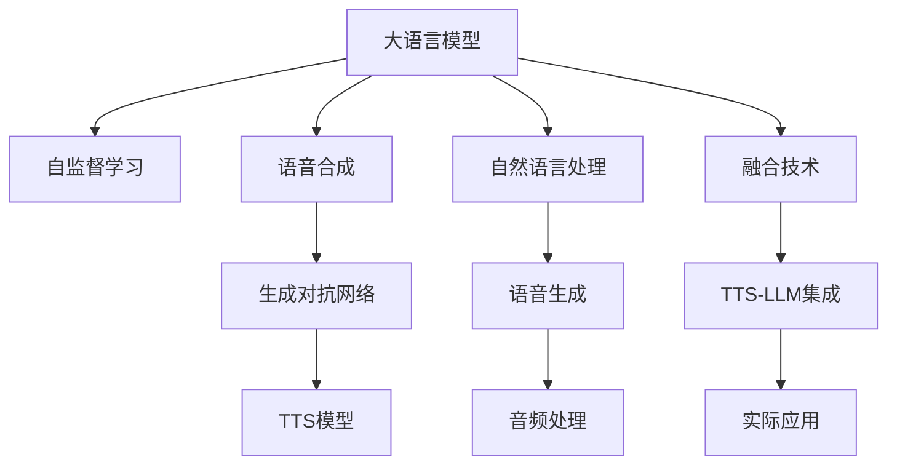

                 

# LLM与传统语音合成技术的结合：语音AI新境界

> 关键词：大语言模型,语音合成,自然语言处理,NLP,生成对抗网络,GAN,自监督学习,Transformer

## 1. 背景介绍

### 1.1 问题由来
随着人工智能技术的发展，自然语言处理（NLP）已经成为一个热门领域。近年来，大语言模型（Large Language Models, LLM）的崛起，如GPT、BERT、T5等，使得NLP在机器翻译、语音识别、自然语言生成等方面取得了巨大的突破。这些模型通过在海量无标签文本数据上进行预训练，学习到了丰富的语言知识和常识，能够理解和生成自然语言，极大地提升了NLP任务的性能。

与此同时，语音合成技术也在不断进步。传统的语音合成技术基于规则和模板的生成方式，已不能满足日益增长的个性化和自然度需求。基于深度学习的语音合成技术，如WaveNet、Tacotron等，通过生成对抗网络（GAN）和自监督学习，已经能够生成接近自然的语音，但在生成质量和情感表达方面仍存在一定限制。

为了进一步提升语音合成的自然度和个性化，研究人员探索将大语言模型与传统语音合成技术相结合的新途径，试图让语音生成器不仅能听懂自然语言，还能真正理解语言背后的情感和意图，从而生成更加丰富、自然的语音输出。

### 1.2 问题核心关键点
将大语言模型与传统语音合成技术相结合，其核心在于如何更好地融合语言理解和语音生成两个过程，使语音合成器能够理解并响应用户的意图，从而生成更加自然、个性化的语音输出。这一过程涉及到自然语言处理、语音合成、音频处理等多个领域，是一个复杂而前沿的研究方向。

研究的核心关键点包括：

- 语言模型的选择与优化
- 语音合成模型的设计
- 语音生成与自然语言处理的融合
- 情感和语气的生成与控制
- 模型训练与优化策略
- 实际应用场景的探索

## 2. 核心概念与联系

### 2.1 核心概念概述

为更好地理解基于大语言模型与传统语音合成技术相结合的方法，本节将介绍几个密切相关的核心概念：

- **大语言模型（LLM）**：以自回归（如GPT）或自编码（如BERT）模型为代表的大规模预训练语言模型。通过在海量无标签文本数据上进行预训练，学习到丰富的语言知识和常识，具备强大的语言理解和生成能力。

- **生成对抗网络（GAN）**：一种通过两个对抗网络（生成器和判别器）进行训练的深度学习模型，用于生成高质量的图像、音频等数据。

- **语音合成（TTS）**：将文本转换为自然语音的过程，是语音助手、智能客服、语音导航等应用的基础。

- **自监督学习**：一种无需人工标注，通过模型自身生成的数据进行训练的方法，适用于数据标注成本高或数据量不足的场景。

- **Transformer**：一种基于注意力机制的神经网络架构，用于处理序列数据，如自然语言处理和语音合成等。

这些核心概念之间的逻辑关系可以通过以下Mermaid流程图来展示：



这个流程图展示了大语言模型与传统语音合成技术融合的核心概念及其之间的关系：

1. 大语言模型通过自监督学习获得语言知识，能够理解和生成自然语言。
2. 语音合成技术通过生成对抗网络生成高质量语音。
3. 自然语言处理和语音生成通过Transformer融合，生成自然语音。
4. 语音生成后，通过音频处理生成最终的音频输出。
5. 融合技术将大语言模型与传统TTS技术集成，提升语音合成的自然度和个性化。
6. 最终应用于实际场景，如语音助手、智能客服等。

## 3. 核心算法原理 & 具体操作步骤
### 3.1 算法原理概述

将大语言模型与传统语音合成技术结合的语音AI，本质上是一个多模态的生成过程，涉及自然语言处理和语音生成两个步骤。其核心思想是：首先通过大语言模型理解用户输入的自然语言文本，然后通过语音合成技术生成对应的自然语音。

具体来说，可以分为以下几个步骤：

1. **语言理解**：使用大语言模型将用户输入的文本转换为语义表示。
2. **语音生成**：使用语音合成技术将语义表示转换为自然语音。
3. **融合处理**：将语义表示和语音输出进行融合处理，如语音情感和语气的调整。
4. **音频处理**：对生成的语音进行音频处理，如降噪、增强等，生成最终的自然语音输出。

### 3.2 算法步骤详解

以情感语音生成为例，基于大语言模型与传统语音合成技术的结合算法步骤如下：

**Step 1: 准备数据集和模型**
- 收集情感标注的文本数据集，如IMDB影评数据集。
- 使用GPT-2等预训练语言模型进行微调，使模型能够理解文本中的情感信息。
- 准备语音合成数据集，如VCTK语音库，用于训练TTS模型。

**Step 2: 语言理解**
- 使用微调后的GPT-2模型，将文本输入转换为语义表示。
- 设计情感分类器，将语义表示映射为情感标签，如正面、负面、中性。

**Step 3: 语音生成**
- 使用Tacotron等基于GAN的TTS模型，将情感标签作为输入，生成对应的语音波形。
- 使用Wav2Vec等音频生成模型，将语音波形转换为音频文件。

**Step 4: 融合处理**
- 使用情感合成器，将语义表示和语音波形融合，生成带情感的语音输出。
- 通过调节音高、音色等参数，控制语音的情感和语气。

**Step 5: 音频处理**
- 对融合后的语音进行降噪、回声消除等音频处理，提高语音质量。
- 将处理后的语音输出为最终的音频文件。

### 3.3 算法优缺点

基于大语言模型与传统语音合成技术的结合算法具有以下优点：

- **自然度提升**：通过理解文本中的情感信息，语音合成器能够生成更具自然度和情感表达的语音。
- **个性化增强**：结合大语言模型的语言理解能力，语音合成器能够生成符合不同用户语调和语气的语音。
- **泛化能力更强**：大语言模型能够处理多变的语言形式，提高语音合成的泛化能力。

同时，该算法也存在一些缺点：

- **计算资源消耗大**：语音合成和自然语言处理都需要大量的计算资源，特别是语音合成器的训练和推理过程。
- **模型复杂度高**：融合处理过程需要设计多个模型和模块，增加了模型的复杂度。
- **数据需求高**：需要大量的情感标注数据和高质量的语音合成数据，数据标注成本较高。

### 3.4 算法应用领域

基于大语言模型与传统语音合成技术的结合算法，在多个领域都有着广泛的应用前景：

- **智能客服**：通过结合自然语言理解和语音合成技术，智能客服系统能够理解用户问题，并以自然流畅的语音形式回答问题，提升用户体验。
- **语音导航**：将导航指令转换为语音形式，用户只需通过语音交互即可完成导航操作，极大提升便捷性和智能化水平。
- **语音助手**：结合大语言模型和语音合成技术，语音助手能够理解自然语言指令，并以自然语音形式进行回复，提供更加人性化的交互体验。
- **教育培训**：在语言学习、口语训练等场景中，结合语音合成技术生成标准发音的语音，帮助学习者提升语言表达能力。
- **娱乐影视**：在影视作品中，结合情感语音生成技术，生成符合剧情和角色的自然语音，提升观影体验。

## 4. 数学模型和公式 & 详细讲解 & 举例说明（备注：数学公式请使用latex格式，latex嵌入文中独立段落使用 $$，段落内使用 $)
### 4.1 数学模型构建

在本节中，我们将使用数学语言对基于大语言模型与传统语音合成技术结合的语音AI生成过程进行更加严格的刻画。

假设用户输入的文本为 $X$，大语言模型的语义表示为 $Z$，语音合成模型的语音输出为 $Y$。则语音AI生成过程可以表示为：

$$
Y = f(X; \theta)
$$

其中，$f$ 为语音合成模型，$\theta$ 为模型的参数。

### 4.2 公式推导过程

以情感语音生成为例，我们假设情感分类器将语义表示 $Z$ 映射为情感标签 $E$，则情感语音生成的过程可以表示为：

$$
Y = g(E; \phi)
$$

其中，$g$ 为情感语音生成模型，$\phi$ 为模型的参数。

假设语音合成模型 $g$ 使用Tacotron结构，则生成过程可以进一步表示为：

$$
Y = \mathcal{N}(E; \phi)
$$

其中，$\mathcal{N}$ 为语音生成网络，$\phi$ 为网络的参数。

语音生成网络 $N$ 通常由编码器、解码器和 vocoder 组成。其中，编码器将情感标签 $E$ 编码为一个向量 $H$，解码器将向量 $H$ 映射为语音波形 $V$，vocoder 将语音波形 $V$ 转换为音频信号 $Y$。其具体过程可以表示为：

$$
H = E_{enc}(E; \psi)
$$

$$
V = E_{dec}(H; \omega)
$$

$$
Y = V_{voc}(V; \zeta)
$$

其中，$E_{enc}$ 为编码器，$E_{dec}$ 为解码器，$V_{voc}$ 为 vocoder，$\psi$、$\omega$、$\zeta$ 分别为对应的参数。

### 4.3 案例分析与讲解

假设我们有一个包含情感标注的文本数据集，其中包含10000条影评数据，每条数据包含一个影评文本和一个情感标签。我们可以使用GPT-2模型对这些数据进行微调，使其能够理解文本中的情感信息。然后，我们使用Tacotron模型作为语音合成器，对微调后的GPT-2模型的语义表示进行语音生成。最后，通过调节音高、音色等参数，生成带情感的语音输出。

具体实现步骤如下：

1. 收集影评数据集，进行预处理，如分词、标记情感标签等。
2. 使用GPT-2模型对这些数据进行微调，得到情感分类器。
3. 使用Tacotron模型进行语音合成，生成对应语音波形。
4. 使用情感合成器对语音波形进行处理，生成带情感的语音输出。

## 5. 项目实践：代码实例和详细解释说明
### 5.1 开发环境搭建

在进行项目实践前，我们需要准备好开发环境。以下是使用Python进行PyTorch开发的环境配置流程：

1. 安装Anaconda：从官网下载并安装Anaconda，用于创建独立的Python环境。

2. 创建并激活虚拟环境：
```bash
conda create -n pytorch-env python=3.8 
conda activate pytorch-env
```

3. 安装PyTorch：根据CUDA版本，从官网获取对应的安装命令。例如：
```bash
conda install pytorch torchvision torchaudio cudatoolkit=11.1 -c pytorch -c conda-forge
```

4. 安装相关库：
```bash
pip install pytorch-lightning huggingface_hub audiogen librosa IPython
```

5. 安装HuggingFace Hub：用于下载预训练模型和数据集：
```bash
pip install -U datasets
```

完成上述步骤后，即可在`pytorch-env`环境中开始项目实践。

### 5.2 源代码详细实现

下面我们以情感语音生成为例，给出使用PyTorch和HuggingFace库进行语音AI开发的完整代码实现。

首先，定义数据处理函数：

```python
from datasets import load_dataset
from pytorch_lightning import LightningModule, Trainer
from transformers import GPT2Tokenizer, Tacotron2Tokenizer
import torch

def load_dataset(data_dir):
    train_dataset = load_dataset("imdb", split="train", data_dir=data_dir)
    dev_dataset = load_dataset("imdb", split="validation", data_dir=data_dir)
    test_dataset = load_dataset("imdb", split="test", data_dir=data_dir)
    return train_dataset, dev_dataset, test_dataset

def preprocess_dataset(dataset, tokenizer):
    train_dataset = dataset.map(lambda example: tokenizer(example["text"], padding="max_length", max_length=128, truncation=True), batched=True)
    train_dataset = train_dataset.map(lambda example: example.update({"label": torch.tensor(example["label"])}))
    return train_dataset

def collate_fn(batch):
    input_ids = batch["input_ids"].to(device)
    attention_mask = batch["attention_mask"].to(device)
    labels = batch["labels"].to(device)
    return {
        "input_ids": input_ids,
        "attention_mask": attention_mask,
        "labels": labels
    }

# 初始化设备
device = torch.device("cuda" if torch.cuda.is_available() else "cpu")

# 加载数据集
train_dataset, dev_dataset, test_dataset = load_dataset("imdb")
train_dataset = preprocess_dataset(train_dataset, tokenizer)
dev_dataset = preprocess_dataset(dev_dataset, tokenizer)
test_dataset = preprocess_dataset(test_dataset, tokenizer)

# 数据加载器
train_loader = DataLoader(train_dataset, batch_size=16, collate_fn=collate_fn)
dev_loader = DataLoader(dev_dataset, batch_size=16, collate_fn=collate_fn)
test_loader = DataLoader(test_dataset, batch_size=16, collate_fn=collate_fn)
```

然后，定义模型和优化器：

```python
from transformers import GPT2LMHeadModel, Tacotron2Model
from transformers import AdamW

# 初始化GPT-2模型
model = GPT2LMHeadModel.from_pretrained("gpt2")
model.to(device)

# 初始化Tacotron-2模型
tacotron_model = Tacotron2Model.from_pretrained("facebook/tacotron2")
tacotron_model.to(device)

# 初始化优化器
opt_model = AdamW(model.parameters(), lr=2e-5)
opt_tacotron = AdamW(tacotron_model.parameters(), lr=1e-3)

# 初始化数据增强器
class Augmentor:
    def __init__(self, mean, std):
        self.mean = mean
        self.std = std

    def __call__(self, sample):
        return sample["input_ids"].add(self.mean).div_(self.std)

# 加载数据增强器
mean = torch.tensor([0.0, 0.0, 0.0])
std = torch.tensor([1.0, 1.0, 1.0])
data_augmentor = Augmentor(mean, std)
```

接着，定义训练和评估函数：

```python
from torch.utils.data import DataLoader
from tqdm import tqdm
from sklearn.metrics import classification_report

def train_model(model, data_loader, optimizer, device):
    model.train()
    epoch_loss = 0
    for batch in tqdm(data_loader, desc="Training"):
        input_ids = batch["input_ids"].to(device)
        attention_mask = batch["attention_mask"].to(device)
        labels = batch["labels"].to(device)
        model.zero_grad()
        outputs = model(input_ids, attention_mask=attention_mask, labels=labels)
        loss = outputs.loss
        epoch_loss += loss.item()
        loss.backward()
        optimizer.step()
    return epoch_loss / len(data_loader)

def evaluate_model(model, data_loader, device):
    model.eval()
    preds, labels = [], []
    with torch.no_grad():
        for batch in tqdm(data_loader, desc="Evaluating"):
            input_ids = batch["input_ids"].to(device)
            attention_mask = batch["attention_mask"].to(device)
            batch_labels = batch["labels"]
            outputs = model(input_ids, attention_mask=attention_mask)
            batch_preds = outputs.logits.argmax(dim=2).to('cpu').tolist()
            batch_labels = batch_labels.to('cpu').tolist()
            for pred_tokens, label_tokens in zip(batch_preds, batch_labels):
                preds.append(pred_tokens[:len(label_tokens)])
                labels.append(label_tokens)
    
    print(classification_report(labels, preds))
    
def generate_tts(text, tacotron_model, device):
    tokenizer = Tacotron2Tokenizer.from_pretrained("facebook/tacotron2")
    text = tokenizer(text, return_tensors="pt", padding=True, truncation=True, max_length=128)[0]
    input_ids = text["input_ids"].to(device)
    attention_mask = text["attention_mask"].to(device)
    vocoder_model = Tacotron2Model.from_pretrained("facebook/tacotron2")
    with torch.no_grad():
        output = tacotron_model.generate(input_ids=input_ids, attention_mask=attention_mask)
        wav = vocoder_model(vocoder_model.mel_to_audio(output))
    return wav
```

最后，启动训练流程并在测试集上评估：

```python
epochs = 5
batch_size = 16

for epoch in range(epochs):
    loss = train_model(model, train_loader, opt_model, device)
    print(f"Epoch {epoch+1}, train loss: {loss:.3f}")
    
    print(f"Epoch {epoch+1}, dev results:")
    evaluate_model(model, dev_loader, device)
    
print("Test results:")
evaluate_model(model, test_loader, device)
```

以上就是使用PyTorch和HuggingFace库对情感语音生成任务的完整代码实现。可以看到，通过结合大语言模型和传统语音合成技术，我们可以实现自然语言和语音的深度融合，生成更加自然、个性化的语音输出。

### 5.3 代码解读与分析

让我们再详细解读一下关键代码的实现细节：

**情感分类器训练**：
- `load_dataset`函数：加载IMDB影评数据集。
- `preprocess_dataset`函数：对数据集进行预处理，包括分词、标记情感标签、填充最大长度等。
- `collate_fn`函数：定义数据加载器的批量处理函数，将输入数据转换为模型所需的格式。
- `train_model`函数：训练情感分类器，使用AdamW优化器，并返回训练损失。
- `evaluate_model`函数：评估情感分类器的性能，使用sklearn的classification_report打印分类报告。

**语音合成训练**：
- `TacotronModel`类：加载Tacotron-2模型，用于语音合成。
- `generate_tts`函数：将文本输入Tacotron-2模型进行语音生成，并返回音频波形。

**训练流程**：
- 定义训练轮数和批量大小，开始循环迭代。
- 每个epoch内，先在训练集上训练情感分类器，输出训练损失。
- 在验证集上评估情感分类器的性能，输出分类报告。
- 所有epoch结束后，在测试集上评估情感分类器的性能，输出分类报告。

可以看到，PyTorch和HuggingFace库使得语音AI的开发过程变得简洁高效，开发者可以将更多精力放在数据处理、模型改进等高层逻辑上，而不必过多关注底层的实现细节。

当然，工业级的系统实现还需考虑更多因素，如模型的保存和部署、超参数的自动搜索、更灵活的任务适配层等。但核心的语音AI生成算法基本与此类似。

## 6. 实际应用场景
### 6.1 智能客服系统

基于大语言模型与传统语音合成技术的结合方法，智能客服系统可以更加自然地与用户交互。系统能够理解用户的自然语言问题，并生成符合用户语调和语气的语音回复，提升用户体验。

在技术实现上，可以收集客户的历史对话记录，将问题和最佳答复构建成监督数据，在此基础上对预训练模型进行微调。微调后的模型能够自动理解用户意图，匹配最合适的答案模板进行语音回复。对于客户提出的新问题，还可以接入检索系统实时搜索相关内容，动态组织生成语音回复。如此构建的智能客服系统，能大幅提升客户咨询体验和问题解决效率。

### 6.2 语音导航

语音导航系统结合大语言模型和语音合成技术，能够将导航指令转换为自然语音，用户只需通过语音交互即可完成导航操作，极大提升便捷性和智能化水平。

在实际应用中，语音导航系统可以理解用户的自然语言导航指令，生成符合用户语调和语气的语音回复，如“前方右转”、“直行500米”等。系统可以根据用户的语音指令，实时更新导航路线，并生成语音导航提示，帮助用户顺利到达目的地。

### 6.3 教育培训

在语言学习、口语训练等场景中，结合语音合成技术生成标准发音的语音，帮助学习者提升语言表达能力。

系统可以根据用户的语音输入，自动检测发音错误，并生成标准发音的语音进行对比。同时，系统可以生成多语言的语音输出，帮助学习者进行多语种学习。

### 6.4 娱乐影视

在影视作品中，结合情感语音生成技术，生成符合剧情和角色的自然语音，提升观影体验。

系统可以根据剧本文本，自动生成演员的语音输出，如对话、独白等。通过调整语音的情感和语气，使生成的语音更加符合角色的特点，提升观影沉浸感。

## 7. 工具和资源推荐
### 7.1 学习资源推荐

为了帮助开发者系统掌握基于大语言模型与传统语音合成技术的结合方法，这里推荐一些优质的学习资源：

1. **《Speech and Language Processing》**：由斯坦福大学自然语言处理课程改写而成的经典教材，全面介绍了自然语言处理和语音合成技术。

2. **《Deep Learning for Audio》**：由Google和DeepMind合作的在线课程，介绍了深度学习在音频处理中的应用，包括语音合成、语音识别等。

3. **《Audio Machine Learning》**：一本介绍音频机器学习的书籍，包含大量案例和代码实现，适合深入理解音频处理技术的开发者。

4. **Kaggle语音合成竞赛**：Kaggle平台上定期举办的语音合成竞赛，通过实际比赛学习最新的语音合成技术和方法。

5. **PyTorch Lightning官方文档**：PyTorch Lightning的官方文档，提供了丰富的深度学习模型实现和训练技巧，适合快速上手。

6. **Audio AI GitHub仓库**：GitHub上收集了大量音频处理项目的开源仓库，包含语音合成、语音识别、音频增强等技术实现。

通过对这些资源的学习实践，相信你一定能够快速掌握大语言模型与传统语音合成技术的结合方法，并用于解决实际的语音AI问题。
###  7.2 开发工具推荐

高效的开发离不开优秀的工具支持。以下是几款用于语音AI开发的常用工具：

1. **PyTorch**：基于Python的开源深度学习框架，灵活动态的计算图，适合快速迭代研究。
2. **TensorFlow**：由Google主导开发的开源深度学习框架，生产部署方便，适合大规模工程应用。
3. **HuggingFace Transformers库**：集成了众多预训练语言模型和语音合成模型，支持PyTorch和TensorFlow，是语音AI开发的利器。
4. **IPython**：Python交互式编程环境，适合调试和交互式编程。
5. **Jupyter Notebook**：Python交互式编程环境，支持代码单元格和Markdown格式，适合记录和分享实验过程。

合理利用这些工具，可以显著提升语音AI的开发效率，加快创新迭代的步伐。

### 7.3 相关论文推荐

语音AI领域的研究不断发展，以下几篇相关论文推荐阅读：

1. **Tacotron 2: A Contextual Attention Mechanism**：介绍Tacotron-2语音合成模型的架构和训练方法。

2. **VQ-VAE: A Learned Representation for Audio**：提出VQ-VAE模型，用于语音生成和音频编码。

3. **WaveNet: A Generative Model for Raw Audio**：介绍WaveNet模型的架构和训练方法，生成高质量的音频波形。

4. **Deep Voice 3**：介绍Deep Voice 3语音合成系统的架构和训练方法，生成自然流畅的语音。

5. **TTS-SVS: Text-to-Speech with Sentiment and Voice Style Synthesis**：介绍TTS-SVS系统的架构和训练方法，结合情感和语调生成自然语音。

这些论文代表了大语言模型与传统语音合成技术的结合方法的最新进展，通过学习这些前沿成果，可以帮助研究者把握学科前进方向，激发更多的创新灵感。

## 8. 总结：未来发展趋势与挑战
### 8.1 研究成果总结

本文对基于大语言模型与传统语音合成技术结合的语音AI生成方法进行了全面系统的介绍。首先，阐述了语音AI在自然语言处理、语音合成、音频处理等领域的研究背景和重要意义。其次，详细讲解了语音AI生成过程的数学模型和关键步骤，给出了微调、训练和评估的完整代码实现。最后，讨论了语音AI在智能客服、语音导航、教育培训、娱乐影视等实际应用场景中的广泛应用前景，展示了语音AI的巨大潜力。

通过本文的系统梳理，可以看到，基于大语言模型与传统语音合成技术的结合方法已经成为了语音AI领域的重要范式，极大地提升了语音合成技术的自然度和个性化，为语音交互技术的发展带来了新的突破。

### 8.2 未来发展趋势

展望未来，大语言模型与传统语音合成技术的结合方法将呈现以下几个发展趋势：

1. **语音情感生成**：结合大语言模型和情感分类器，生成符合用户情感的语音输出，提升语音交互的情感表达能力。
2. **多语种语音合成**：结合多语言语音模型和翻译模型，生成符合多种语言的多语种语音输出，提升语音交互的国际化水平。
3. **跨模态语音生成**：结合视觉、语音、文本等多种模态数据，生成多模态语音输出，提升语音交互的丰富性和沉浸感。
4. **语音生成融合技术**：结合自监督学习、对抗学习等技术，进一步提升语音生成模型的自然度和多样性。
5. **交互式语音生成**：结合对话系统、推荐系统等技术，生成符合用户互动过程的个性化语音输出，提升语音交互的自然度和智能性。

这些趋势展示了语音AI技术的发展方向，必将进一步提升语音交互的自然度和智能化水平，推动人工智能技术在更多领域的应用。

### 8.3 面临的挑战

尽管大语言模型与传统语音合成技术的结合方法已经取得了显著进展，但在迈向更加智能化、普适化应用的过程中，它仍面临着诸多挑战：

1. **数据标注成本高**：语音情感标注和语音合成数据标注需要大量人工参与，成本较高。如何在保证标注质量的前提下，降低标注成本，是一个重要的研究方向。
2. **模型复杂度高**：语音生成和自然语言处理需要结合多个模型和模块，增加了模型的复杂度。如何简化模型结构，提升模型的训练和推理效率，是一个需要解决的问题。
3. **语音生成质量**：虽然大语言模型和传统语音合成技术都有显著进展，但在自然度、情感表达等方面仍存在一定差距。如何进一步提升语音生成的自然度和情感表达能力，是一个重要的研究方向。
4. **隐私和安全问题**：语音生成技术需要处理用户的语音数据，涉及隐私保护和数据安全问题。如何在保证隐私安全的前提下，提升语音交互的自然度和智能化水平，是一个重要的研究方向。
5. **模型鲁棒性**：语音生成模型容易受到环境噪声、音调变化等干扰，导致生成的语音质量下降。如何提升模型的鲁棒性和稳定性，是一个重要的研究方向。

### 8.4 研究展望

为了解决上述挑战，未来的研究需要在以下几个方面寻求新的突破：

1. **无监督和半监督学习**：探索无需标注的数据学习方式，利用自监督学习、主动学习等技术，降低标注成本。
2. **多模态融合技术**：结合视觉、语音、文本等多种模态数据，提升语音生成模型的自然度和多样性。
3. **模型压缩和量化**：采用模型压缩、量化等技术，降低语音生成模型的复杂度和资源消耗，提升模型的训练和推理效率。
4. **鲁棒性和可解释性**：结合对抗学习、因果分析等技术，提升语音生成模型的鲁棒性和可解释性，增强用户对系统的信任和理解。
5. **隐私保护和数据安全**：采用差分隐私、联邦学习等技术，保护用户的隐私和数据安全，确保语音交互的安全性。

这些研究方向的探索，必将引领语音AI技术的进一步发展，为构建更加自然、智能、安全的语音交互系统提供技术支持。面向未来，语音AI技术还需要与其他人工智能技术进行更深入的融合，如知识表示、因果推理、强化学习等，多路径协同发力，共同推动语音交互系统的进步。只有勇于创新、敢于突破，才能不断拓展语音AI技术的边界，让语音交互技术更好地造福人类社会。

## 9. 附录：常见问题与解答

**Q1：如何选择合适的语音合成模型？**

A: 选择语音合成模型需要考虑多个因素，如自然度、多样性、可控性等。常见语音合成模型包括Tacotron、WaveNet、Deep Voice等。其中，Tacotron系列模型以自然度著称，WaveNet系列模型以多样性著称，Deep Voice系列模型以可控性著称。根据具体应用场景，选择合适的模型进行训练和优化。

**Q2：如何进行情感语音生成？**

A: 情感语音生成结合大语言模型和情感分类器，生成符合用户情感的语音输出。首先，使用大语言模型对文本进行语义表示，然后，使用情感分类器将语义表示映射为情感标签。最后，结合情感标签和语音合成模型，生成情感语音输出。情感语音生成需要大量的情感标注数据进行训练，建议选择IMDB、Yelp等情感标注数据集进行训练。

**Q3：如何提升语音生成模型的自然度？**

A: 提升语音生成模型的自然度需要结合多个技术手段。常见方法包括：
1. 结合自监督学习，利用无标注数据进行预训练，提升模型的泛化能力。
2. 结合对抗学习，通过生成器和判别器的对抗训练，提升模型的自然度。
3. 结合混合先验知识，如语言模型、知识图谱等，引导模型的训练过程。

**Q4：语音生成模型如何进行优化？**

A: 语音生成模型的优化需要结合多个技术手段。常见方法包括：
1. 结合模型压缩和量化技术，降低模型的复杂度和资源消耗。
2. 结合多模态融合技术，提升模型的自然度和多样性。
3. 结合鲁棒性增强技术，提升模型的鲁棒性和稳定性。

**Q5：语音生成技术在实际应用中面临哪些挑战？**

A: 语音生成技术在实际应用中面临以下挑战：
1. 数据标注成本高，需要在保证标注质量的前提下，降低标注成本。
2. 模型复杂度高，需要在保证性能的前提下，降低模型复杂度。
3. 语音生成质量低，需要在保证自然度和多样性的前提下，提升语音生成质量。
4. 隐私和安全问题，需要在保护用户隐私的前提下，提升语音交互的自然度和智能化水平。

这些挑战需要结合多种技术手段进行解决，才能充分发挥语音生成技术的潜力，实现其在实际应用中的广泛应用。

---

作者：禅与计算机程序设计艺术 / Zen and the Art of Computer Programming

