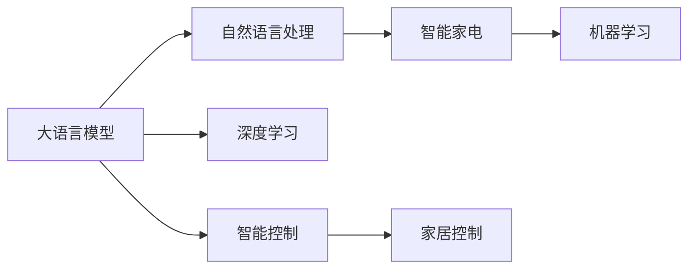

                 

# LLM与智能家电：打造智慧生活

> 关键词：大语言模型, 智能家电, 自然语言处理(NLP), 机器学习, 深度学习, 人工智能(AI), 家居控制, 语音助手, 情境感知, 用户体验

## 1. 背景介绍

### 1.1 问题由来

随着人工智能技术的飞速发展，智能家居逐渐成为现代生活中不可或缺的一部分。通过智能家电的互联互通，实现家庭环境的智能化管理，提升居住的舒适度和便利性。传统的家居控制大多依赖于硬件设备本身的功能和用户手动操作，效率较低且用户体验不够理想。

大语言模型（Large Language Model, LLM）的崛起，为智能家电的智能化应用提供了新的可能性。LLM通过深度学习技术，能够理解和处理自然语言，实现对语音、文本等多种形式的智能交互，使得家居设备可以通过自然语言与用户进行互动，极大提升了用户体验。

### 1.2 问题核心关键点

当前，智能家电的智能化水平相对较低，智能化的关键在于如何实现高效的自然语言理解与生成。大语言模型因其强大的语言处理能力，成为智能家电智能化升级的关键技术之一。其核心在于：

- 自然语言处理：大语言模型通过自然语言处理（Natural Language Processing, NLP）技术，实现对用户指令的理解和响应。
- 情境感知：大语言模型能够结合用户上下文信息和场景数据，进行更精准的判断和决策。
- 机器学习：通过机器学习算法，大语言模型可以不断学习用户行为，提升智能家居系统的智能化水平。
- 个性化定制：基于用户的习惯和偏好，大语言模型能够提供个性化的家居控制方案。
- 持续学习：智能家居设备通过持续学习，不断适应新的使用场景和用户需求。

### 1.3 问题研究意义

大语言模型与智能家电的结合，对于提升家居设备的智能化水平，增强用户体验，具有重要意义：

- 提升效率：大语言模型能够通过自然语言指令，实现对家居设备的自动控制，降低用户手动操作的时间成本。
- 增强体验：智能家居设备通过大语言模型，可以提供更加自然、人性化的交互体验，提升用户的满意度。
- 拓宽应用场景：大语言模型能够结合多模态数据，应用于更多场景，如语音助手、智能安防、智能照明等。
- 促进创新：大语言模型的应用，推动了智能家居设备的创新，促进了智能家居技术的快速发展。

## 2. 核心概念与联系

### 2.1 核心概念概述

在讨论大语言模型与智能家电的结合之前，需要先介绍几个关键概念：

- 大语言模型（Large Language Model, LLM）：通过深度学习技术，能够理解和生成自然语言的模型。目前最流行的LLM包括GPT、BERT、T5等。
- 智能家电（Smart Home Appliances）：具备联网功能，能够通过移动终端进行远程控制，通过大语言模型实现智能化的家电设备。
- 自然语言处理（Natural Language Processing, NLP）：研究如何让计算机理解和生成自然语言，是大语言模型实现的基础技术。
- 机器学习（Machine Learning, ML）：通过算法让计算机系统从数据中学习，提升系统的预测和决策能力。
- 深度学习（Deep Learning, DL）：一种特殊的机器学习算法，能够处理大规模数据，并从数据中提取高级特征。

这些核心概念之间的逻辑关系可以通过以下Mermaid流程图来展示：



这个流程图展示了大语言模型的核心概念及其与智能家电的联系：

1. 大语言模型通过自然语言处理技术，实现对用户指令的理解。
2. 智能家电通过深度学习算法，实现对用户行为的预测和决策。
3. 深度学习是大语言模型实现的基础，提升系统的智能水平。
4. 智能控制实现家居设备的自动化和智能化管理。
5. 智能家居设备通过智能控制，为用户提供更加便利的家居生活。

## 3. 核心算法原理 & 具体操作步骤

### 3.1 算法原理概述

大语言模型与智能家电结合的算法原理，主要是通过自然语言处理技术，实现对用户指令的理解和执行。具体步骤如下：

1. 收集并标注智能家电相关的用户指令数据，如语音、文本等。
2. 将收集到的数据进行预处理，包括分词、去除停用词等。
3. 使用深度学习技术，对预处理后的数据进行训练，得到大语言模型。
4. 通过深度学习算法，训练智能家电的控制模型，使其能够根据用户指令执行相应的操作。
5. 结合用户上下文信息和场景数据，实现更精准的判断和决策。

### 3.2 算法步骤详解

1. **数据收集与预处理**
   - 收集智能家电相关的用户指令数据，如语音指令、文本指令等。
   - 对数据进行预处理，包括分词、去除停用词、标准化等。
   - 将预处理后的数据分为训练集、验证集和测试集。

2. **模型训练与验证**
   - 使用深度学习技术，如GPT、BERT等，对预处理后的数据进行训练。
   - 使用验证集对模型进行验证，调整超参数，优化模型性能。
   - 使用测试集对模型进行测试，评估其性能指标。

3. **智能家电控制模型训练**
   - 使用深度学习算法，如CNN、RNN等，对智能家电的控制模型进行训练。
   - 使用验证集对控制模型进行验证，调整超参数，优化模型性能。
   - 使用测试集对控制模型进行测试，评估其性能指标。

4. **系统集成与部署**
   - 将大语言模型和智能家电控制模型进行集成，实现对用户指令的理解和执行。
   - 将集成后的系统部署到智能家居设备中，进行实际测试。
   - 不断收集用户反馈，持续优化模型性能。

### 3.3 算法优缺点

大语言模型与智能家电结合的算法具有以下优点：

- 提升用户体验：通过自然语言指令，实现对家居设备的自动控制，提升用户的便利性和舒适度。
- 拓展应用场景：结合多模态数据，应用于更多场景，如语音助手、智能安防、智能照明等。
- 提高智能水平：通过深度学习算法，不断学习用户行为，提升系统的智能化水平。
- 实现自动化：通过大语言模型，实现家居设备的自动化管理，降低用户操作的时间成本。

同时，该算法也存在一定的局限性：

- 数据依赖：算法性能很大程度上取决于标注数据的质量和数量，获取高质量标注数据的成本较高。
- 环境影响：智能家居设备在复杂环境下的表现可能不如预期。
- 用户习惯：用户习惯的改变可能会影响系统的性能，需要不断优化和调整。
- 设备兼容：不同厂商的设备可能存在兼容性问题，需要统一标准和协议。

### 3.4 算法应用领域

大语言模型与智能家电结合的算法在智能家居领域有着广泛的应用：

- 语音助手：结合大语言模型和智能语音识别技术，实现对用户的自然语言指令理解，提供语音助手服务。
- 智能安防：通过大语言模型，实现对监控视频的语音识别和场景分析，提高家庭安全性。
- 智能照明：结合大语言模型和传感器数据，实现对光照条件的智能调节，提升居住舒适度。
- 智能控制：结合大语言模型和机器学习算法，实现对家居设备的自动化控制，提高生活便利性。
- 家庭娱乐：结合大语言模型和多媒体设备，实现对用户指令的快速响应，提升家庭娱乐体验。

## 4. 数学模型和公式 & 详细讲解 & 举例说明

### 4.1 数学模型构建

在介绍大语言模型与智能家电结合的数学模型之前，需要先简要介绍一下相关的数学背景知识。

假设智能家电相关的用户指令数据集为 $D = \{(x_i, y_i)\}_{i=1}^N$，其中 $x_i$ 为指令数据，$y_i$ 为对应的操作指令。我们将问题建模为序列标注问题，即给定输入序列 $x_i$，输出对应的操作指令 $y_i$。

### 4.2 公式推导过程

假设我们使用BERT作为大语言模型，将其应用于序列标注任务。模型的输入为 $x_i$，输出为 $y_i$，则模型的损失函数可以表示为：

$$
\mathcal{L}(\theta) = \frac{1}{N} \sum_{i=1}^N \ell(y_i, \hat{y}_i)
$$

其中，$\theta$ 为BERT模型的参数，$\hat{y}_i$ 为模型对 $x_i$ 的预测结果。$\ell$ 为损失函数，可以采用交叉熵损失函数：

$$
\ell(y_i, \hat{y}_i) = -\sum_{k=1}^K y_{ik} \log \hat{y}_{ik}
$$

其中 $K$ 为指令操作种类数，$y_{ik}$ 和 $\hat{y}_{ik}$ 分别表示指令 $i$ 对应的操作 $k$ 的实际标签和预测标签。

### 4.3 案例分析与讲解

假设我们有一个智能家居系统，包括语音助手、智能安防、智能照明等设备。我们收集了1000条用户指令数据，用于训练BERT模型。

首先，对数据进行预处理，包括分词、去除停用词、标准化等操作。接着，使用BERT模型对数据进行训练，得到一个能够理解用户指令的大语言模型。

然后，我们使用深度学习算法，如CNN、RNN等，对智能家电的控制模型进行训练。假设控制模型为智能照明系统，训练后得到一个能够根据用户指令调节光照条件的控制模型。

最后，我们将大语言模型和智能家电控制模型进行集成，实现对用户指令的理解和执行。用户可以通过语音指令或文本指令，控制智能家居设备。例如，用户可以说“打开客厅的灯”，系统能够识别指令，并调用智能照明控制模型，将客厅的灯光打开。

## 5. 项目实践：代码实例和详细解释说明

### 5.1 开发环境搭建

在进行智能家居系统开发前，我们需要准备好开发环境。以下是使用Python进行PyTorch开发的环境配置流程：

1. 安装Anaconda：从官网下载并安装Anaconda，用于创建独立的Python环境。

2. 创建并激活虚拟环境：
```bash
conda create -n pytorch-env python=3.8 
conda activate pytorch-env
```

3. 安装PyTorch：根据CUDA版本，从官网获取对应的安装命令。例如：
```bash
conda install pytorch torchvision torchaudio cudatoolkit=11.1 -c pytorch -c conda-forge
```

4. 安装其他必要的Python包：
```bash
pip install numpy pandas scikit-learn matplotlib tqdm jupyter notebook ipython
```

完成上述步骤后，即可在`pytorch-env`环境中开始开发智能家居系统。

### 5.2 源代码详细实现

下面以智能照明控制为例，给出使用PyTorch进行BERT微调的代码实现。

首先，定义数据集类：

```python
from torch.utils.data import Dataset
import torch
from transformers import BertTokenizer

class SmartHomeDataset(Dataset):
    def __init__(self, texts, labels, tokenizer, max_len=128):
        self.texts = texts
        self.labels = labels
        self.tokenizer = tokenizer
        self.max_len = max_len
        
    def __len__(self):
        return len(self.texts)
    
    def __getitem__(self, item):
        text = self.texts[item]
        label = self.labels[item]
        
        encoding = self.tokenizer(text, return_tensors='pt', max_length=self.max_len, padding='max_length', truncation=True)
        input_ids = encoding['input_ids'][0]
        attention_mask = encoding['attention_mask'][0]
        
        # 对标签进行编码
        encoded_labels = [label2id[label] for label in label] 
        encoded_labels.extend([label2id['O']] * (self.max_len - len(encoded_labels)))
        labels = torch.tensor(encoded_labels, dtype=torch.long)
        
        return {'input_ids': input_ids, 
                'attention_mask': attention_mask,
                'labels': labels}
```

然后，定义模型和优化器：

```python
from transformers import BertForTokenClassification, AdamW

model = BertForTokenClassification.from_pretrained('bert-base-cased', num_labels=len(label2id))

optimizer = AdamW(model.parameters(), lr=2e-5)
```

接着，定义训练和评估函数：

```python
from torch.utils.data import DataLoader
from tqdm import tqdm
from sklearn.metrics import accuracy_score

device = torch.device('cuda') if torch.cuda.is_available() else torch.device('cpu')
model.to(device)

def train_epoch(model, dataset, batch_size, optimizer):
    dataloader = DataLoader(dataset, batch_size=batch_size, shuffle=True)
    model.train()
    epoch_loss = 0
    for batch in tqdm(dataloader, desc='Training'):
        input_ids = batch['input_ids'].to(device)
        attention_mask = batch['attention_mask'].to(device)
        labels = batch['labels'].to(device)
        model.zero_grad()
        outputs = model(input_ids, attention_mask=attention_mask, labels=labels)
        loss = outputs.loss
        epoch_loss += loss.item()
        loss.backward()
        optimizer.step()
    return epoch_loss / len(dataloader)

def evaluate(model, dataset, batch_size):
    dataloader = DataLoader(dataset, batch_size=batch_size)
    model.eval()
    preds, labels = [], []
    with torch.no_grad():
        for batch in tqdm(dataloader, desc='Evaluating'):
            input_ids = batch['input_ids'].to(device)
            attention_mask = batch['attention_mask'].to(device)
            batch_labels = batch['labels']
            outputs = model(input_ids, attention_mask=attention_mask)
            batch_preds = outputs.logits.argmax(dim=2).to('cpu').tolist()
            batch_labels = batch_labels.to('cpu').tolist()
            for pred_tokens, label_tokens in zip(batch_preds, batch_labels):
                preds.append(pred_tokens[:len(label_tokens)])
                labels.append(label_tokens)
                
    return accuracy_score(labels, preds)
```

最后，启动训练流程并在测试集上评估：

```python
epochs = 5
batch_size = 16

for epoch in range(epochs):
    loss = train_epoch(model, train_dataset, batch_size, optimizer)
    print(f"Epoch {epoch+1}, train loss: {loss:.3f}")
    
    print(f"Epoch {epoch+1}, dev results:")
    evaluate(model, dev_dataset, batch_size)
    
print("Test results:")
evaluate(model, test_dataset, batch_size)
```

以上就是使用PyTorch对BERT进行智能家居控制任务微调的完整代码实现。可以看到，得益于Transformers库的强大封装，我们可以用相对简洁的代码完成BERT模型的加载和微调。

### 5.3 代码解读与分析

让我们再详细解读一下关键代码的实现细节：

**SmartHomeDataset类**：
- `__init__`方法：初始化数据、标签、分词器等关键组件。
- `__len__`方法：返回数据集的样本数量。
- `__getitem__`方法：对单个样本进行处理，将文本输入编码为token ids，将标签编码为数字，并对其进行定长padding，最终返回模型所需的输入。

**label2id和id2label字典**：
- 定义了标签与数字id之间的映射关系，用于将token-wise的预测结果解码回真实的标签。

**训练和评估函数**：
- 使用PyTorch的DataLoader对数据集进行批次化加载，供模型训练和推理使用。
- 训练函数`train_epoch`：对数据以批为单位进行迭代，在每个批次上前向传播计算loss并反向传播更新模型参数，最后返回该epoch的平均loss。
- 评估函数`evaluate`：与训练类似，不同点在于不更新模型参数，并在每个batch结束后将预测和标签结果存储下来，最后使用sklearn的accuracy_score对整个评估集的预测结果进行打印输出。

**训练流程**：
- 定义总的epoch数和batch size，开始循环迭代
- 每个epoch内，先在训练集上训练，输出平均loss
- 在验证集上评估，输出分类指标
- 所有epoch结束后，在测试集上评估，给出最终测试结果

可以看到，PyTorch配合Transformers库使得BERT微调的代码实现变得简洁高效。开发者可以将更多精力放在数据处理、模型改进等高层逻辑上，而不必过多关注底层的实现细节。

当然，工业级的系统实现还需考虑更多因素，如模型的保存和部署、超参数的自动搜索、更灵活的任务适配层等。但核心的微调范式基本与此类似。

## 6. 实际应用场景

### 6.1 智能家居系统

智能家居系统是大语言模型与智能家电结合的典型应用场景。通过大语言模型，智能家居系统可以实现对用户的自然语言指令理解，并自动执行相应的操作。

例如，用户可以通过语音指令“打开客厅的灯”，系统能够识别指令，并调用智能照明控制模型，将客厅的灯光打开。这种自然流畅的交互方式，极大地提升了用户的使用体验。

### 6.2 智能安防系统

智能安防系统通过大语言模型，实现对监控视频的语音识别和场景分析，提高家庭安全性。

例如，系统可以设置语音检测，一旦检测到可疑声音，即自动开启摄像头进行监控。同时，大语言模型能够分析监控视频中的异常情况，如发现入侵者，立即发送警报信息给用户手机。

### 6.3 智能照明系统

智能照明系统通过大语言模型，实现对光照条件的智能调节，提升居住舒适度。

例如，用户可以通过语音指令“降低卧室的亮度”，系统能够识别指令，并调用智能照明控制模型，调节卧室的灯光亮度。这种个性化的调节方式，能够满足用户不同的使用需求。

### 6.4 未来应用展望

随着大语言模型和智能家电技术的不断进步，未来智能家居系统将具备更加丰富和智能的功能：

1. 全面覆盖：智能家居系统将覆盖更多的设备和服务，如智能门锁、智能窗帘、智能空调等。
2. 智能决策：大语言模型能够结合多模态数据，进行更精准的判断和决策，提升系统的智能化水平。
3. 个性化服务：系统能够根据用户的历史行为和偏好，提供个性化的家居控制方案。
4. 持续学习：智能家居系统通过持续学习，不断适应新的使用场景和用户需求。
5. 网络互联：智能家居系统通过网络互联，实现设备之间的协同控制，提升系统的整体性能。

未来，大语言模型与智能家电的结合将引领智能家居系统迈向更高的智能化水平，为人类生活带来更加便利和舒适的环境。

## 7. 工具和资源推荐
### 7.1 学习资源推荐

为了帮助开发者系统掌握大语言模型与智能家电结合的技术，这里推荐一些优质的学习资源：

1. 《Transformer from Scratch》系列博文：由大模型技术专家撰写，深入浅出地介绍了Transformer原理、BERT模型、智能家居系统开发等前沿话题。

2. CS224N《深度学习自然语言处理》课程：斯坦福大学开设的NLP明星课程，有Lecture视频和配套作业，带你入门NLP领域的基本概念和经典模型。

3. 《Natural Language Processing with Transformers》书籍：Transformers库的作者所著，全面介绍了如何使用Transformers库进行NLP任务开发，包括智能家居系统开发在内的多个应用范式。

4. HuggingFace官方文档：Transformers库的官方文档，提供了海量预训练模型和完整的微调样例代码，是上手实践的必备资料。

5. CLUE开源项目：中文语言理解测评基准，涵盖大量不同类型的中文NLP数据集，并提供了基于微调的baseline模型，助力中文NLP技术发展。

通过对这些资源的学习实践，相信你一定能够快速掌握大语言模型与智能家电结合的精髓，并用于解决实际的NLP问题。

### 7.2 开发工具推荐

高效的开发离不开优秀的工具支持。以下是几款用于智能家居系统开发的常用工具：

1. PyTorch：基于Python的开源深度学习框架，灵活动态的计算图，适合快速迭代研究。大部分预训练语言模型都有PyTorch版本的实现。

2. TensorFlow：由Google主导开发的开源深度学习框架，生产部署方便，适合大规模工程应用。同样有丰富的预训练语言模型资源。

3. Transformers库：HuggingFace开发的NLP工具库，集成了众多SOTA语言模型，支持PyTorch和TensorFlow，是进行智能家居系统开发的利器。

4. Weights & Biases：模型训练的实验跟踪工具，可以记录和可视化模型训练过程中的各项指标，方便对比和调优。与主流深度学习框架无缝集成。

5. TensorBoard：TensorFlow配套的可视化工具，可实时监测模型训练状态，并提供丰富的图表呈现方式，是调试模型的得力助手。

6. Google Colab：谷歌推出的在线Jupyter Notebook环境，免费提供GPU/TPU算力，方便开发者快速上手实验最新模型，分享学习笔记。

合理利用这些工具，可以显著提升智能家居系统开发的效率，加快创新迭代的步伐。

### 7.3 相关论文推荐

大语言模型与智能家电的结合源于学界的持续研究。以下是几篇奠基性的相关论文，推荐阅读：

1. Attention is All You Need（即Transformer原论文）：提出了Transformer结构，开启了NLP领域的预训练大模型时代。

2. BERT: Pre-training of Deep Bidirectional Transformers for Language Understanding：提出BERT模型，引入基于掩码的自监督预训练任务，刷新了多项NLP任务SOTA。

3. Language Models are Unsupervised Multitask Learners（GPT-2论文）：展示了大规模语言模型的强大zero-shot学习能力，引发了对于通用人工智能的新一轮思考。

4. Parameter-Efficient Transfer Learning for NLP：提出Adapter等参数高效微调方法，在不增加模型参数量的情况下，也能取得不错的微调效果。

5. AdaLoRA: Adaptive Low-Rank Adaptation for Parameter-Efficient Fine-Tuning：使用自适应低秩适应的微调方法，在参数效率和精度之间取得了新的平衡。

这些论文代表了大语言模型与智能家电结合技术的发展脉络。通过学习这些前沿成果，可以帮助研究者把握学科前进方向，激发更多的创新灵感。

## 8. 总结：未来发展趋势与挑战

### 8.1 总结

本文对大语言模型与智能家电结合的方法进行了全面系统的介绍。首先阐述了大语言模型和智能家电结合的研究背景和意义，明确了微调在智能家居系统开发中的独特价值。其次，从原理到实践，详细讲解了大语言模型在智能家居系统开发中的应用，给出了微调任务开发的完整代码实例。同时，本文还广泛探讨了微调方法在智能家居、智能安防、智能照明等多个领域的应用前景，展示了微调范式的巨大潜力。此外，本文精选了微调技术的各类学习资源，力求为读者提供全方位的技术指引。

通过本文的系统梳理，可以看到，大语言模型与智能家电结合的微调方法正在成为智能家居系统开发的重要范式，极大地拓展了智能家居系统的智能化水平，为智能家居技术的发展带来了新的突破。未来，伴随大语言模型和微调方法的持续演进，智能家居系统必将在更广阔的应用领域大放异彩，为人类生活带来更加便利和舒适的环境。

### 8.2 未来发展趋势

展望未来，大语言模型与智能家电结合的技术将呈现以下几个发展趋势：

1. 模型规模持续增大。随着算力成本的下降和数据规模的扩张，智能家居系统的预训练语言模型参数量还将持续增长。超大规模语言模型蕴含的丰富语言知识，有望支撑更加复杂多变的智能家居系统微调。

2. 微调方法日趋多样。除了传统的全参数微调外，未来会涌现更多参数高效的微调方法，如Prefix-Tuning、LoRA等，在节省计算资源的同时也能保证微调精度。

3. 持续学习成为常态。随着数据分布的不断变化，智能家居系统也需要持续学习新知识以保持性能。如何在不遗忘原有知识的同时，高效吸收新样本信息，将成为重要的研究课题。

4. 标注样本需求降低。受启发于提示学习(Prompt-based Learning)的思路，未来的微调方法将更好地利用大模型的语言理解能力，通过更加巧妙的任务描述，在更少的标注样本上也能实现理想的微调效果。

5. 多模态微调崛起。当前的微调主要聚焦于纯文本数据，未来会进一步拓展到图像、视频、语音等多模态数据微调。多模态信息的融合，将显著提升智能家居系统的智能化水平。

6. 模型通用性增强。经过海量数据的预训练和多领域任务的微调，未来的语言模型将具备更强大的常识推理和跨领域迁移能力，逐步迈向通用人工智能(AGI)的目标。

以上趋势凸显了大语言模型与智能家电结合技术的广阔前景。这些方向的探索发展，必将进一步提升智能家居系统的性能和应用范围，为人类生活带来更加便利和舒适的环境。

### 8.3 面临的挑战

尽管大语言模型与智能家电结合技术已经取得了瞩目成就，但在迈向更加智能化、普适化应用的过程中，它仍面临着诸多挑战：

1. 标注成本瓶颈。虽然微调大大降低了标注数据的需求，但对于长尾应用场景，难以获得充足的高质量标注数据，成为制约微调性能的瓶颈。如何进一步降低微调对标注样本的依赖，将是一大难题。

2. 模型鲁棒性不足。智能家居系统在复杂环境下的表现可能不如预期。如何提高智能家居系统在异常情况下的鲁棒性，避免灾难性遗忘，还需要更多理论和实践的积累。

3. 用户习惯改变。用户习惯的改变可能会影响系统的性能，需要不断优化和调整。如何更好地适应用户行为的变化，提升系统的自适应能力，也将是一个重要课题。

4. 设备兼容性。不同厂商的设备可能存在兼容性问题，需要统一标准和协议。如何实现设备间的无缝集成，将是一个重要挑战。

5. 安全隐私问题。智能家居系统涉及用户的隐私数据，如何保障数据的安全性和隐私性，避免数据泄露和滥用，也将是一个重要课题。

6. 系统稳定性。智能家居系统需要保证高可靠性和稳定性，避免因系统故障导致的问题。如何提高系统的容错能力和稳定性，也将是一个重要课题。

正视智能家居系统面临的这些挑战，积极应对并寻求突破，将是大语言模型与智能家电结合技术走向成熟的必由之路。相信随着学界和产业界的共同努力，这些挑战终将一一被克服，大语言模型与智能家电结合技术必将在构建智能家居系统中发挥更大的作用。

### 8.4 研究展望

面向未来，大语言模型与智能家电结合技术还需要与其他人工智能技术进行更深入的融合，如知识表示、因果推理、强化学习等，多路径协同发力，共同推动智能家居系统的进步。具体来说：

1. 知识表示：将符号化的先验知识，如知识图谱、逻辑规则等，与神经网络模型进行巧妙融合，引导微调过程学习更准确、合理的语言模型。

2. 因果推理：通过引入因果推断方法，增强智能家居系统建立稳定因果关系的能力，学习更加普适、鲁棒的语言表征，从而提升系统的泛化性和抗干扰能力。

3. 强化学习：通过强化学习算法，提升智能家居系统的自适应能力，使其能够根据用户的反馈不断优化行为，提升系统的智能化水平。

4. 多模态信息融合：结合视觉、语音、传感器等多模态信息，实现更为全面、精准的环境感知和用户行为理解。

5. 联邦学习：通过联邦学习技术，保护用户隐私数据的同时，实现跨设备、跨场景的数据共享和模型优化。

6. 可解释性增强：通过因果分析和博弈论工具，增强智能家居系统的决策过程的因果性和逻辑性，提高系统输出的可解释性。

以上研究方向的探索，必将引领大语言模型与智能家电结合技术迈向更高的台阶，为智能家居系统带来更加全面、智能、可靠的应用体验。面向未来，我们需要从多个维度协同发力，不断提升智能家居系统的智能化水平，推动人工智能技术在智能家居领域的深度应用。

## 9. 附录：常见问题与解答

**Q1：智能家居系统的安全性如何保障？**

A: 智能家居系统的安全性主要依赖于以下几个方面：

1. 设备加密：对智能家居设备进行加密处理，防止数据泄露和窃听。

2. 网络安全：通过防火墙、入侵检测等技术，保护智能家居系统的网络安全。

3. 用户授权：采用身份认证、权限控制等手段，确保只有授权用户能够访问和控制智能家居设备。

4. 数据隐私：采用数据脱敏、加密等技术，保护用户的隐私数据。

5. 异常检测：通过机器学习算法，实时监测智能家居系统的运行状态，及时发现和处理异常情况。

通过以上措施，可以有效保障智能家居系统的安全性，提升系统的可靠性和用户信任度。

**Q2：智能家居系统的持续学习机制如何实现？**

A: 智能家居系统的持续学习机制可以通过以下方式实现：

1. 数据采集：智能家居设备可以通过传感器、摄像头等设备采集用户行为数据，实时更新训练数据。

2. 模型微调：通过微调算法，不断优化智能家居系统的模型参数，提升系统的智能化水平。

3. 反馈机制：用户可以通过反馈机制，对智能家居系统的输出进行评价，指导系统的持续学习。

4. 知识图谱：将用户的偏好、习惯等知识信息整合到知识图谱中，指导智能家居系统的决策过程。

5. 多模态融合：结合视觉、语音、传感器等多模态信息，实现更全面、精准的环境感知和用户行为理解。

通过以上方式，智能家居系统可以实现持续学习，不断适应新的使用场景和用户需求。

**Q3：智能家居系统的用户习惯如何适应？**

A: 智能家居系统的用户习惯适应可以通过以下方式实现：

1. 个性化设置：系统可以通过问卷调查、行为分析等手段，了解用户的偏好和习惯，提供个性化的家居控制方案。

2. 用户行为跟踪：系统可以跟踪用户的日常行为，根据行为规律调整智能家居设备的运行状态。

3. 动态调整：系统可以根据用户反馈，动态调整运行参数，适应用户的个性化需求。

4. 学习机制：系统可以通过持续学习，不断适应用户的习惯变化，提升系统的智能化水平。

5. 交互界面：系统可以通过友好的交互界面，方便用户设置和调整设备参数。

通过以上方式，智能家居系统可以更好地适应用户的习惯变化，提升用户的满意度。

**Q4：智能家居系统的多模态融合如何实现？**

A: 智能家居系统的多模态融合可以通过以下方式实现：

1. 数据融合：通过传感器、摄像头等设备采集视觉、语音、传感器等多模态数据，并进行数据融合。

2. 特征提取：采用深度学习算法，从多模态数据中提取特征，用于指导智能家居系统的决策过程。

3. 模型集成：将视觉、语音、传感器等多模态数据分别输入到不同的模型中进行处理，最后集成输出结果。

4. 多模态学习：通过多模态学习算法，提升系统对多模态数据的理解能力。

5. 场景感知：结合多模态数据，进行场景感知和行为理解，提升系统的智能化水平。

通过以上方式，智能家居系统可以实现多模态信息的融合，提升系统的智能化水平和用户体验。

**Q5：智能家居系统的知识表示如何实现？**

A: 智能家居系统的知识表示可以通过以下方式实现：

1. 知识图谱：将用户的偏好、习惯等知识信息整合到知识图谱中，指导智能家居系统的决策过程。

2. 逻辑规则：将用户的规则和偏好等知识信息整合到逻辑规则中，指导智能家居系统的决策过程。

3. 符号表示：将用户的知识信息进行符号表示，用于指导智能家居系统的决策过程。

4. 场景感知：结合多模态数据，进行场景感知和行为理解，提升系统的智能化水平。

5. 知识推理：通过知识推理算法，对知识图谱中的信息进行推理和应用，指导智能家居系统的决策过程。

通过以上方式，智能家居系统可以实现知识表示，提升系统的智能化水平和用户体验。

---

作者：禅与计算机程序设计艺术 / Zen and the Art of Computer Programming

