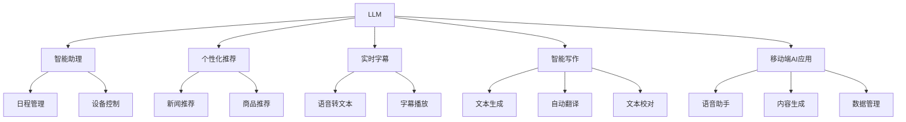

                 

# LLM与智能手机：移动端的AI革命

## 1. 背景介绍

随着移动互联网的蓬勃发展，智能手机已经从纯粹的通信设备，演化为集通信、娱乐、办公、购物等于一体的综合性终端。智能手机的智能化水平，决定着用户的使用体验和生产力提升。近年来，人工智能(AI)技术的迅猛发展，为智能手机带来了翻天覆地的变化。

特别是大型语言模型(LLM)的兴起，为智能手机带来了前所未有的智能化变革。从智能助理到个性化推荐，从自动翻译到实时字幕，从语音助手到智能写作，LLM在各个场景下均展现出强大的潜力。本文将深入探讨LLM在智能手机中的应用，以及如何通过移动端AI革命，为人类生活带来更高效、更便捷、更智能的体验。

## 2. 核心概念与联系

### 2.1 核心概念概述

为更好地理解LLM在智能手机中的应用，本节将介绍几个密切相关的核心概念：

- 大型语言模型(LLM)：指通过大规模无标签数据进行自监督学习，获得强大语言理解能力和生成能力的深度神经网络模型。如GPT、BERT等。
- 智能手机智能助理(Smart Assistant)：智能手机的内置AI系统，可自动完成用户指令、提醒日程、控制设备等功能。
- 个性化推荐(Recommendation)：基于用户行为数据，推荐新闻、商品、音乐等。
- 实时字幕(Real-time Captioning)：将语音转换为实时文本，实现跨语言交流和字幕播放。
- 智能写作(AI Writing)：自动生成文本、翻译、校对等功能，提升创作效率。

这些概念之间的逻辑关系可以通过以下Mermaid流程图来展示：



这个流程图展示了大语言模型与智能手机AI应用的密切联系：

1. LLM作为基础模型，支撑智能助理、个性化推荐、实时字幕、智能写作等各项功能。
2. 智能助理可帮助用户管理日程、控制设备。
3. 个性化推荐可以根据用户兴趣推荐新闻、商品等。
4. 实时字幕可以实现跨语言交流和字幕播放。
5. 智能写作可自动生成文本、翻译、校对。
6. 移动端AI应用将上述功能进一步集成，提升用户体验。

## 3. 核心算法原理 & 具体操作步骤
### 3.1 算法原理概述

基于大语言模型在智能手机中的应用，其核心思想是：将LLM作为强大的"特征提取器"，通过在移动设备上运行，为用户提供多样化的AI功能。这种模式具有以下优势：

- 实时性高：智能手机具有强大的计算能力，能够实时处理用户指令，提供即时反馈。
- 交互性强：用户与智能助理等功能的交互自然流畅，无需繁琐设置，即用即走。
- 适应性强：根据不同用户和场景，LLM可动态调整参数和策略，提升用户体验。
- 兼容性好：LLM与多种操作系统和应用集成，用户无需安装新应用，即可享受智能服务。

### 3.2 算法步骤详解

基于LLM在智能手机中的应用，一般包括以下几个关键步骤：

**Step 1: 部署LLM模型**

- 选择合适的预训练语言模型 $M_{\theta}$ 作为初始化参数，如 BERT、GPT等。
- 将模型迁移到移动设备，如Android、iOS等操作系统。

**Step 2: 集成智能助理**

- 设计用户界面(UI)和交互逻辑，集成智能助理的功能。
- 提供语音输入和文本输入两种方式，满足不同用户习惯。

**Step 3: 实现个性化推荐**

- 收集用户行为数据，如浏览历史、搜索记录等。
- 设计推荐算法，将数据输入LLM进行预测，生成个性化推荐。
- 根据推荐结果更新用户界面，展示推荐内容。

**Step 4: 支持实时字幕**

- 收集用户的语音输入，如通过麦克风采集。
- 使用语音识别技术将语音转换为文本，输入LLM进行翻译或字幕生成。
- 将翻译结果或字幕文本展示在用户界面上。

**Step 5: 提供智能写作支持**

- 使用自然语言处理技术分析用户写作习惯和风格。
- 设计智能写作算法，将写作过程自动化，提供文本生成、翻译、校对等功能。
- 将生成的文本展示在用户界面中。

**Step 6: 优化用户体验**

- 根据用户反馈不断优化UI和交互逻辑。
- 集成各类第三方应用和API，增强服务功能。
- 定期更新模型和数据，提升系统性能和效果。

以上是基于LLM在智能手机中的应用的一般流程。在实际应用中，还需要根据具体场景和需求，对各个环节进行优化设计和改进，以实现更好的用户体验。

### 3.3 算法优缺点

基于LLM在智能手机中的应用，具有以下优点：

1. 功能强大：LLM作为智能手机的核心AI功能，能提供自然语言理解、生成、翻译等多种能力，满足用户多方面的需求。
2. 用户友好：智能助理、个性化推荐等功能的交互自然流畅，无需繁琐设置，即用即走。
3. 资源利用高效：LLM模型利用移动设备的计算能力，资源利用率高，无需额外硬件投入。
4. 应用广泛：LLM在各种移动应用场景中均能良好集成，提升应用价值。

但该方法也存在一些局限性：

1. 计算资源限制：智能手机的计算能力虽然强大，但无法与桌面级设备相比，可能在处理大规模数据时出现瓶颈。
2. 数据隐私问题：用户行为数据往往涉及隐私，需要采取严格的保护措施，确保数据安全。
3. 模型泛化能力有限：LLM在特定场景下效果良好，但在其他场景下可能效果不佳，需要针对不同应用场景进行微调。
4. 用户习惯差异：不同用户对智能助理、推荐等功能的使用习惯和期望各不相同，需要根据用户反馈进行个性化定制。

尽管存在这些局限性，但就目前而言，基于LLM的应用仍是大数据智能化技术落地应用的重要范式。未来相关研究的重点在于如何进一步降低计算资源需求，提高模型泛化能力，解决数据隐私问题，更好地满足用户个性化需求。

### 3.4 算法应用领域

基于LLM的应用，在智能手机领域已经得到了广泛的应用，涵盖了许多常见场景，例如：

- 智能助理：如Siri、Google Assistant、Amazon Alexa等，可以回答用户问题、控制设备、提醒日程等。
- 个性化推荐：如抖音、网易云音乐、今日头条等，根据用户兴趣推荐新闻、音乐、视频等。
- 实时字幕：如YouTube、Zoom等，将语音转换为实时字幕，方便跨语言交流。
- 智能写作：如Grammarly、Microsoft Word等，提供文本生成、翻译、校对等功能。

除了上述这些经典应用外，LLM还被创新性地应用到更多场景中，如智能导航、智能记账、智能翻译等，为智能手机应用带来了全新的突破。随着预训练语言模型和微调方法的不断进步，相信LLM技术将在更广阔的应用领域大放异彩。

## 4. 数学模型和公式 & 详细讲解  
### 4.1 数学模型构建

本节将使用数学语言对基于LLM的应用进行更加严格的刻画。

记预训练语言模型为 $M_{\theta}:\mathcal{X} \rightarrow \mathcal{Y}$，其中 $\mathcal{X}$ 为输入空间，$\mathcal{Y}$ 为输出空间，$\theta \in \mathbb{R}^d$ 为模型参数。假设智能手机用户行为数据为 $D=\{(x_i,y_i)\}_{i=1}^N, x_i \in \mathcal{X}, y_i \in \mathcal{Y}$。

定义模型 $M_{\theta}$ 在数据样本 $(x,y)$ 上的损失函数为 $\ell(M_{\theta}(x),y)$，则在数据集 $D$ 上的经验风险为：

$$
\mathcal{L}(\theta) = \frac{1}{N} \sum_{i=1}^N \ell(M_{\theta}(x_i),y_i)
$$

优化目标是最小化经验风险，即找到最优参数：

$$
\theta^* = \mathop{\arg\min}_{\theta} \mathcal{L}(\theta)
$$

在实践中，我们通常使用基于梯度的优化算法（如SGD、Adam等）来近似求解上述最优化问题。设 $\eta$ 为学习率，$\lambda$ 为正则化系数，则参数的更新公式为：

$$
\theta \leftarrow \theta - \eta \nabla_{\theta}\mathcal{L}(\theta) - \eta\lambda\theta
$$

其中 $\nabla_{\theta}\mathcal{L}(\theta)$ 为损失函数对参数 $\theta$ 的梯度，可通过反向传播算法高效计算。

### 4.2 公式推导过程

以下我们以个性化推荐任务为例，推导损失函数及其梯度的计算公式。

假设模型 $M_{\theta}$ 在输入 $x$ 上的输出为 $\hat{y}=M_{\theta}(x) \in [0,1]$，表示样本属于特定类别的概率。真实标签 $y \in \{0,1\}$。则二分类交叉熵损失函数定义为：

$$
\ell(M_{\theta}(x),y) = -[y\log \hat{y} + (1-y)\log (1-\hat{y})]
$$

将其代入经验风险公式，得：

$$
\mathcal{L}(\theta) = -\frac{1}{N}\sum_{i=1}^N [y_i\log M_{\theta}(x_i)+(1-y_i)\log(1-M_{\theta}(x_i))]
$$

根据链式法则，损失函数对参数 $\theta_k$ 的梯度为：

$$
\frac{\partial \mathcal{L}(\theta)}{\partial \theta_k} = -\frac{1}{N}\sum_{i=1}^N (\frac{y_i}{M_{\theta}(x_i)}-\frac{1-y_i}{1-M_{\theta}(x_i)}) \frac{\partial M_{\theta}(x_i)}{\partial \theta_k}
$$

其中 $\frac{\partial M_{\theta}(x_i)}{\partial \theta_k}$ 可进一步递归展开，利用自动微分技术完成计算。

## 5. 项目实践：代码实例和详细解释说明
### 5.1 开发环境搭建

在进行LLM应用开发前，我们需要准备好开发环境。以下是使用Python进行PyTorch开发的环境配置流程：

1. 安装Anaconda：从官网下载并安装Anaconda，用于创建独立的Python环境。

2. 创建并激活虚拟环境：
```bash
conda create -n pytorch-env python=3.8 
conda activate pytorch-env
```

3. 安装PyTorch：根据CUDA版本，从官网获取对应的安装命令。例如：
```bash
conda install pytorch torchvision torchaudio cudatoolkit=11.1 -c pytorch -c conda-forge
```

4. 安装Transformers库：
```bash
pip install transformers
```

5. 安装各类工具包：
```bash
pip install numpy pandas scikit-learn matplotlib tqdm jupyter notebook ipython
```

完成上述步骤后，即可在`pytorch-env`环境中开始应用开发。

### 5.2 源代码详细实现

下面我们以智能助理功能为例，给出使用Transformers库对BERT模型进行智能助理开发的PyTorch代码实现。

首先，定义智能助理的交互逻辑：

```python
from transformers import BertTokenizer
from torch.utils.data import Dataset
import torch

class AssistantDataset(Dataset):
    def __init__(self, texts, intents, tokenizer, max_len=128):
        self.texts = texts
        self.intents = intents
        self.tokenizer = tokenizer
        self.max_len = max_len
        
    def __len__(self):
        return len(self.texts)
    
    def __getitem__(self, item):
        text = self.texts[item]
        intent = self.intents[item]
        
        encoding = self.tokenizer(text, return_tensors='pt', max_length=self.max_len, padding='max_length', truncation=True)
        input_ids = encoding['input_ids'][0]
        attention_mask = encoding['attention_mask'][0]
        
        # 对intent进行编码
        encoded_intent = [intent2id[intent] for intent in intents] 
        encoded_intent.extend([intent2id['O']] * (self.max_len - len(encoded_intent)))
        labels = torch.tensor(encoded_intent, dtype=torch.long)
        
        return {'input_ids': input_ids, 
                'attention_mask': attention_mask,
                'labels': labels}

# 意图与id的映射
intent2id = {'O': 0, 'Greet': 1, 'Goodbye': 2, 'Help': 3, 'Search': 4, 'Schedule': 5}
id2intent = {v: k for k, v in intent2id.items()}

# 创建dataset
tokenizer = BertTokenizer.from_pretrained('bert-base-cased')

train_dataset = AssistantDataset(train_texts, train_intents, tokenizer)
dev_dataset = AssistantDataset(dev_texts, dev_intents, tokenizer)
test_dataset = AssistantDataset(test_texts, test_intents, tokenizer)
```

然后，定义模型和优化器：

```python
from transformers import BertForTokenClassification, AdamW

model = BertForTokenClassification.from_pretrained('bert-base-cased', num_labels=len(intent2id))

optimizer = AdamW(model.parameters(), lr=2e-5)
```

接着，定义训练和评估函数：

```python
from torch.utils.data import DataLoader
from tqdm import tqdm
from sklearn.metrics import classification_report

device = torch.device('cuda') if torch.cuda.is_available() else torch.device('cpu')
model.to(device)

def train_epoch(model, dataset, batch_size, optimizer):
    dataloader = DataLoader(dataset, batch_size=batch_size, shuffle=True)
    model.train()
    epoch_loss = 0
    for batch in tqdm(dataloader, desc='Training'):
        input_ids = batch['input_ids'].to(device)
        attention_mask = batch['attention_mask'].to(device)
        labels = batch['labels'].to(device)
        model.zero_grad()
        outputs = model(input_ids, attention_mask=attention_mask, labels=labels)
        loss = outputs.loss
        epoch_loss += loss.item()
        loss.backward()
        optimizer.step()
    return epoch_loss / len(dataloader)

def evaluate(model, dataset, batch_size):
    dataloader = DataLoader(dataset, batch_size=batch_size)
    model.eval()
    preds, labels = [], []
    with torch.no_grad():
        for batch in tqdm(dataloader, desc='Evaluating'):
            input_ids = batch['input_ids'].to(device)
            attention_mask = batch['attention_mask'].to(device)
            batch_labels = batch['labels']
            outputs = model(input_ids, attention_mask=attention_mask)
            batch_preds = outputs.logits.argmax(dim=2).to('cpu').tolist()
            batch_labels = batch_labels.to('cpu').tolist()
            for pred_tokens, label_tokens in zip(batch_preds, batch_labels):
                pred_tags = [id2intent[_id] for _id in pred_tokens]
                label_tags = [id2intent[_id] for _id in label_tokens]
                preds.append(pred_tags[:len(label_tokens)])
                labels.append(label_tags)
                
    print(classification_report(labels, preds))
```

最后，启动训练流程并在测试集上评估：

```python
epochs = 5
batch_size = 16

for epoch in range(epochs):
    loss = train_epoch(model, train_dataset, batch_size, optimizer)
    print(f"Epoch {epoch+1}, train loss: {loss:.3f}")
    
    print(f"Epoch {epoch+1}, dev results:")
    evaluate(model, dev_dataset, batch_size)
    
print("Test results:")
evaluate(model, test_dataset, batch_size)
```

以上就是使用PyTorch对BERT进行智能助理功能开发的完整代码实现。可以看到，得益于Transformers库的强大封装，我们可以用相对简洁的代码完成BERT模型的加载和应用。

### 5.3 代码解读与分析

让我们再详细解读一下关键代码的实现细节：

**AssistantDataset类**：
- `__init__`方法：初始化文本、意图、分词器等关键组件。
- `__len__`方法：返回数据集的样本数量。
- `__getitem__`方法：对单个样本进行处理，将文本输入编码为token ids，将意图编码为数字，并对其进行定长padding，最终返回模型所需的输入。

**intent2id和id2intent字典**：
- 定义了意图与数字id之间的映射关系，用于将token-wise的预测结果解码回真实的意图。

**训练和评估函数**：
- 使用PyTorch的DataLoader对数据集进行批次化加载，供模型训练和推理使用。
- 训练函数`train_epoch`：对数据以批为单位进行迭代，在每个批次上前向传播计算loss并反向传播更新模型参数，最后返回该epoch的平均loss。
- 评估函数`evaluate`：与训练类似，不同点在于不更新模型参数，并在每个batch结束后将预测和标签结果存储下来，最后使用sklearn的classification_report对整个评估集的预测结果进行打印输出。

**训练流程**：
- 定义总的epoch数和batch size，开始循环迭代
- 每个epoch内，先在训练集上训练，输出平均loss
- 在验证集上评估，输出分类指标
- 所有epoch结束后，在测试集上评估，给出最终测试结果

可以看到，PyTorch配合Transformers库使得BERT智能助理功能的代码实现变得简洁高效。开发者可以将更多精力放在数据处理、模型改进等高层逻辑上，而不必过多关注底层的实现细节。

当然，工业级的系统实现还需考虑更多因素，如模型的保存和部署、超参数的自动搜索、更灵活的任务适配层等。但核心的智能助理范式基本与此类似。

## 6. 实际应用场景
### 6.1 智能客服系统

基于智能助理的大语言模型应用，可以广泛应用于智能客服系统的构建。传统客服往往需要配备大量人力，高峰期响应缓慢，且一致性和专业性难以保证。而使用智能助理功能的智能客服系统，可以7x24小时不间断服务，快速响应客户咨询，用自然流畅的语言解答各类常见问题。

在技术实现上，可以收集企业内部的历史客服对话记录，将问题和最佳答复构建成监督数据，在此基础上对预训练智能助理模型进行微调。微调后的智能助理模型能够自动理解用户意图，匹配最合适的回答。对于客户提出的新问题，还可以接入检索系统实时搜索相关内容，动态组织生成回答。如此构建的智能客服系统，能大幅提升客户咨询体验和问题解决效率。

### 6.2 金融舆情监测

金融机构需要实时监测市场舆论动向，以便及时应对负面信息传播，规避金融风险。传统的人工监测方式成本高、效率低，难以应对网络时代海量信息爆发的挑战。基于智能助理功能的文本分类和情感分析技术，为金融舆情监测提供了新的解决方案。

具体而言，可以收集金融领域相关的新闻、报道、评论等文本数据，并对其进行主题标注和情感标注。在此基础上对预训练智能助理模型进行微调，使其能够自动判断文本属于何种主题，情感倾向是正面、中性还是负面。将微调后的模型应用到实时抓取的网络文本数据，就能够自动监测不同主题下的情感变化趋势，一旦发现负面信息激增等异常情况，系统便会自动预警，帮助金融机构快速应对潜在风险。

### 6.3 个性化推荐系统

当前的推荐系统往往只依赖用户的历史行为数据进行物品推荐，无法深入理解用户的真实兴趣偏好。基于智能助理功能的个性化推荐系统，可以更好地挖掘用户行为背后的语义信息，从而提供更精准、多样的推荐内容。

在实践中，可以收集用户浏览、点击、评论、分享等行为数据，提取和用户交互的物品标题、描述、标签等文本内容。将文本内容作为模型输入，用户的后续行为（如是否点击、购买等）作为监督信号，在此基础上微调预训练智能助理模型。微调后的模型能够从文本内容中准确把握用户的兴趣点。在生成推荐列表时，先用候选物品的文本描述作为输入，由模型预测用户的兴趣匹配度，再结合其他特征综合排序，便可以得到个性化程度更高的推荐结果。

### 6.4 未来应用展望

随着大语言模型和智能助理功能的不断发展，基于智能助理的应用将呈现出更加广泛的前景。

在智慧医疗领域，基于智能助理的医疗问答、病历分析、药物研发等应用将提升医疗服务的智能化水平，辅助医生诊疗，加速新药开发进程。

在智能教育领域，智能助理功能的学情分析、知识推荐等功能，将推动教育信息化的进程，提升教育质量。

在智慧城市治理中，智能助理功能的应急指挥、舆情分析等功能，将提高城市管理的自动化和智能化水平，构建更安全、高效的未来城市。

此外，在企业生产、社会治理、文娱传媒等众多领域，基于智能助理功能的智能应用也将不断涌现，为经济社会发展注入新的动力。相信随着技术的日益成熟，智能助理功能必将成为人工智能落地应用的重要范式，推动人工智能技术在各行各业的普及和深入。

## 7. 工具和资源推荐
### 7.1 学习资源推荐

为了帮助开发者系统掌握大语言模型智能助理的理论基础和实践技巧，这里推荐一些优质的学习资源：

1. 《Transformer from Scratch》系列博文：由大模型技术专家撰写，深入浅出地介绍了Transformer原理、BERT模型、智能助理功能等前沿话题。

2. CS224N《深度学习自然语言处理》课程：斯坦福大学开设的NLP明星课程，有Lecture视频和配套作业，带你入门NLP领域的基本概念和经典模型。

3. 《Natural Language Processing with Transformers》书籍：Transformers库的作者所著，全面介绍了如何使用Transformers库进行NLP任务开发，包括智能助理功能在内的诸多范式。

4. HuggingFace官方文档：Transformers库的官方文档，提供了海量预训练模型和完整的智能助理功能样例代码，是上手实践的必备资料。

5. CLUE开源项目：中文语言理解测评基准，涵盖大量不同类型的中文NLP数据集，并提供了基于智能助理功能的baseline模型，助力中文NLP技术发展。

通过对这些资源的学习实践，相信你一定能够快速掌握大语言模型智能助理的精髓，并用于解决实际的NLP问题。
###  7.2 开发工具推荐

高效的开发离不开优秀的工具支持。以下是几款用于大语言模型智能助理开发的常用工具：

1. PyTorch：基于Python的开源深度学习框架，灵活动态的计算图，适合快速迭代研究。大部分预训练语言模型都有PyTorch版本的实现。

2. TensorFlow：由Google主导开发的开源深度学习框架，生产部署方便，适合大规模工程应用。同样有丰富的预训练语言模型资源。

3. Transformers库：HuggingFace开发的NLP工具库，集成了众多SOTA语言模型，支持PyTorch和TensorFlow，是进行智能助理功能开发的利器。

4. Weights & Biases：模型训练的实验跟踪工具，可以记录和可视化模型训练过程中的各项指标，方便对比和调优。与主流深度学习框架无缝集成。

5. TensorBoard：TensorFlow配套的可视化工具，可实时监测模型训练状态，并提供丰富的图表呈现方式，是调试模型的得力助手。

6. Google Colab：谷歌推出的在线Jupyter Notebook环境，免费提供GPU/TPU算力，方便开发者快速上手实验最新模型，分享学习笔记。

合理利用这些工具，可以显著提升大语言模型智能助理任务的开发效率，加快创新迭代的步伐。

### 7.3 相关论文推荐

大语言模型和智能助理功能的发展源于学界的持续研究。以下是几篇奠基性的相关论文，推荐阅读：

1. Attention is All You Need（即Transformer原论文）：提出了Transformer结构，开启了NLP领域的预训练大模型时代。

2. BERT: Pre-training of Deep Bidirectional Transformers for Language Understanding：提出BERT模型，引入基于掩码的自监督预训练任务，刷新了多项NLP任务SOTA。

3. Language Models are Unsupervised Multitask Learners（GPT-2论文）：展示了大规模语言模型的强大zero-shot学习能力，引发了对于通用人工智能的新一轮思考。

4. Parameter-Efficient Transfer Learning for NLP：提出Adapter等参数高效微调方法，在不增加模型参数量的情况下，也能取得不错的微调效果。

5. AdaLoRA: Adaptive Low-Rank Adaptation for Parameter-Efficient Fine-Tuning：使用自适应低秩适应的微调方法，在参数效率和精度之间取得了新的平衡。

这些论文代表了大语言模型智能助理功能的发展脉络。通过学习这些前沿成果，可以帮助研究者把握学科前进方向，激发更多的创新灵感。

## 8. 总结：未来发展趋势与挑战

### 8.1 总结

本文对基于大语言模型智能助理功能的应用进行了全面系统的介绍。首先阐述了智能助理功能的背景和重要性，明确了智能助理在大数据智能化技术落地应用中的独特价值。其次，从原理到实践，详细讲解了智能助理功能的数学原理和关键步骤，给出了智能助理功能开发的完整代码实例。同时，本文还广泛探讨了智能助理功能在智能客服、金融舆情、个性化推荐等多个行业领域的应用前景，展示了智能助理功能的巨大潜力。此外，本文精选了智能助理功能的各类学习资源，力求为读者提供全方位的技术指引。

通过本文的系统梳理，可以看到，基于大语言模型的智能助理功能正在成为NLP领域的重要范式，极大地拓展了预训练语言模型的应用边界，催生了更多的落地场景。受益于大规模语料的预训练，智能助理功能以更低的时间和标注成本，在小样本条件下也能取得理想的智能效果，有力推动了NLP技术的产业化进程。未来，伴随预训练语言模型和智能助理功能的持续演进，相信NLP技术将在更广阔的应用领域大放异彩，深刻影响人类的生产生活方式。

### 8.2 未来发展趋势

展望未来，智能助理功能的发展趋势如下：

1. 模型规模持续增大。随着算力成本的下降和数据规模的扩张，预训练语言模型的参数量还将持续增长。超大模型的智能助理功能，将能够处理更复杂的语言理解和生成任务。

2. 智能助理功能日趋多样。除了传统的问答、智能写作等，未来还将涌现更多新功能，如智能导航、智能翻译、智能购物等。这些功能将大大丰富智能助理的应用场景。

3. 用户交互更加自然。未来的智能助理将具备更加自然的交互方式，如语音识别、手写输入、手势控制等，提供更加无缝的用户体验。

4. 多模态信息融合。智能助理将能够整合文本、图像、语音等多种模态信息，提升对用户的深度理解和响应能力。

5. 跨领域知识迁移。智能助理功能将能够更好地吸收跨领域知识，提升模型的通用性和泛化能力。

以上趋势凸显了大语言模型智能助理功能的广阔前景。这些方向的探索发展，必将进一步提升智能助理功能的性能和应用范围，为构建人机协同的智能系统铺平道路。

### 8.3 面临的挑战

尽管智能助理功能已经取得了瞩目成就，但在迈向更加智能化、普适化应用的过程中，它仍面临着诸多挑战：

1. 计算资源限制。智能助理功能需要强大的计算能力，对移动设备的硬件资源提出较高要求。如何优化模型结构，提高计算效率，是未来的重要研究方向。

2. 数据隐私问题。用户行为数据涉及隐私，如何保护用户隐私，确保数据安全，是智能助理功能落地的重要保障。

3. 模型泛化能力有限。智能助理功能在不同应用场景下的效果各异，如何提升模型的泛化能力，适应多样化的任务需求，还需要进一步探索。

4. 用户习惯差异。不同用户对智能助理功能的期望和使用习惯各不相同，如何根据用户反馈进行个性化定制，提升用户体验，是未来的重要课题。

5. 交互效率有待提升。智能助理功能的交互过程需要快速响应，如何提升交互效率，优化交互体验，是未来的重要方向。

6. 技术标准化问题。智能助理功能的标准化和规范制定，将有助于推广普及，但目前仍需更多标准化工作。

尽管存在这些挑战，但智能助理功能作为大数据智能化技术的核心范式，其发展前景广阔。未来需要从数据、算法、工程、业务等多个维度协同发力，才能真正实现人工智能技术在各个领域的广泛落地和深度应用。

### 8.4 研究展望

面对智能助理功能所面临的种种挑战，未来的研究需要在以下几个方面寻求新的突破：

1. 探索无监督和半监督智能助理方法。摆脱对大规模标注数据的依赖，利用自监督学习、主动学习等无监督和半监督范式，最大限度利用非结构化数据，实现更加灵活高效的智能助理功能。

2. 研究参数高效和计算高效的智能助理范式。开发更加参数高效的智能助理方法，在固定大部分预训练参数的同时，只更新极少量的任务相关参数。同时优化智能助理模型的计算图，减少前向传播和反向传播的资源消耗，实现更加轻量级、实时性的部署。

3. 融合因果和对比学习范式。通过引入因果推断和对比学习思想，增强智能助理模型建立稳定因果关系的能力，学习更加普适、鲁棒的语言表征，从而提升模型泛化性和抗干扰能力。

4. 引入更多先验知识。将符号化的先验知识，如知识图谱、逻辑规则等，与神经网络模型进行巧妙融合，引导智能助理过程学习更准确、合理的语言模型。同时加强不同模态数据的整合，实现视觉、语音等多模态信息与文本信息的协同建模。

5. 结合因果分析和博弈论工具。将因果分析方法引入智能助理模型，识别出模型决策的关键特征，增强输出解释的因果性和逻辑性。借助博弈论工具刻画人机交互过程，主动探索并规避模型的脆弱点，提高系统稳定性。

6. 纳入伦理道德约束。在智能助理模型训练目标中引入伦理导向的评估指标，过滤和惩罚有偏见、有害的输出倾向。同时加强人工干预和审核，建立模型行为的监管机制，确保输出符合人类价值观和伦理道德。

这些研究方向的探索，必将引领智能助理功能技术迈向更高的台阶，为构建安全、可靠、可解释、可控的智能系统铺平道路。面向未来，智能助理功能还需要与其他人工智能技术进行更深入的融合，如知识表示、因果推理、强化学习等，多路径协同发力，共同推动自然语言理解和智能交互系统的进步。只有勇于创新、敢于突破，才能不断拓展智能助理功能的边界，让智能技术更好地造福人类社会。

## 9. 附录：常见问题与解答

**Q1：智能助理功能是否适用于所有NLP任务？**

A: 智能助理功能在大多数NLP任务上都能取得不错的效果，特别是对于数据量较小的任务。但对于一些特定领域的任务，如医学、法律等，仅仅依靠通用语料预训练的模型可能难以很好地适应。此时需要在特定领域语料上进一步预训练，再进行微调，才能获得理想效果。此外，对于一些需要时效性、个性化很强的任务，如对话、推荐等，智能助理功能也需要针对性的改进优化。

**Q2：如何选择合适的智能助理学习率？**

A: 智能助理的学习率一般要比预训练时小1-2个数量级，如果使用过大的学习率，容易破坏预训练权重，导致过拟合。一般建议从1e-5开始调参，逐步减小学习率，直至收敛。也可以使用warmup策略，在开始阶段使用较小的学习率，再逐渐过渡到预设值。需要注意的是，不同的优化器(如AdamW、Adafactor等)以及不同的学习率调度策略，可能需要设置不同的学习率阈值。

**Q3：智能助理功能在移动端应用时面临哪些资源瓶颈？**

A: 虽然智能助理功能在移动设备上运行，但仍然面临计算资源限制。智能助理需要强大的计算能力，对移动设备的硬件资源提出较高要求。如何优化模型结构，提高计算效率，是未来的重要研究方向。

**Q4：如何缓解智能助理功能的过拟合问题？**

A: 过拟合是智能助理功能面临的主要挑战，尤其是在标注数据不足的情况下。常见的缓解策略包括：
1. 数据增强：通过回译、近义替换等方式扩充训练集
2. 正则化：使用L2正则、Dropout、Early Stopping等避免过拟合
3. 对抗训练：引入对抗样本，提高模型鲁棒性
4. 参数高效智能助理：只调整少量参数(如Adapter、Prefix等)，减小过拟合风险
5. 多模型集成：训练多个智能助理模型，取平均输出，抑制过拟合

这些策略往往需要根据具体任务和数据特点进行灵活组合。只有在数据、模型、训练、推理等各环节进行全面优化，才能最大限度地发挥智能助理功能的威力。

**Q5：智能助理功能在落地部署时需要注意哪些问题？**

A: 将智能助理功能转化为实际应用，还需要考虑以下因素：
1. 模型裁剪：去除不必要的层和参数，减小模型尺寸，加快推理速度
2. 量化加速：将浮点模型转为定点模型，压缩存储空间，提高计算效率
3. 服务化封装：将模型封装为标准化服务接口，便于集成调用
4. 弹性伸缩：根据请求流量动态调整资源配置，平衡服务质量和成本
5. 监控告警：实时采集系统指标，设置异常告警阈值，确保服务稳定性
6. 安全防护：采用访问鉴权、数据脱敏等措施，保障数据和模型安全

智能助理功能为NLP应用带来了全新的突破，但如何将强大的性能转化为稳定、高效、安全的业务价值，还需要工程实践的不断打磨。唯有从数据、算法、工程、业务等多个维度协同发力，才能真正实现人工智能技术在垂直行业的规模化落地。总之，智能助理功能需要开发者根据具体任务，不断迭代和优化模型、数据和算法，方能得到理想的效果。

---

作者：禅与计算机程序设计艺术 / Zen and the Art of Computer Programming

