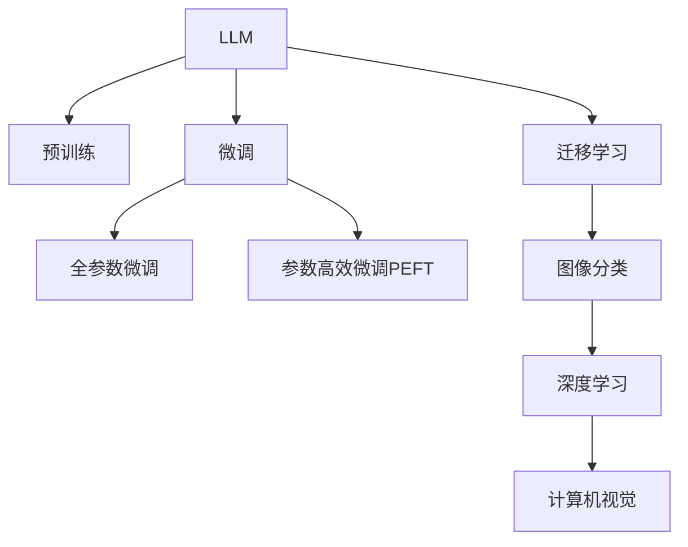

                 

# LLM在图像分类任务中的技术进展

> 关键词：大规模语言模型,图像分类,预训练,微调,迁移学习,Transformer,BERT,深度学习,计算机视觉

## 1. 背景介绍

### 1.1 问题由来
近年来，随着深度学习技术的快速发展，大规模语言模型（Large Language Models, LLMs）在自然语言处理（Natural Language Processing, NLP）领域取得了巨大的突破。这些大模型通过在大规模无标签文本语料上进行预训练，学习到了丰富的语言知识和常识，可以通过少量的有标签样本在下游任务上进行微调（Fine-tuning），获得优异的性能。

然而，深度学习在图像分类任务上的表现并不尽如人意。传统的卷积神经网络（Convolutional Neural Networks, CNNs）在图像分类中表现出色，但这些方法依赖于人工设计的特征提取器，需要手动调整网络结构、参数等，难以在复杂多变的任务中取得最佳效果。相比之下，LLMs通过语言模型的预训练，可以自动学习到图像分类的特征表示，具有更强的泛化能力和迁移学习能力。

因此，将LLMs应用于图像分类任务，已成为当前研究的热点问题。本文将详细介绍LLM在图像分类任务中的应用进展，从理论到实践，系统地探讨大语言模型的图像分类技术。

## 2. 核心概念与联系

### 2.1 核心概念概述

为更好地理解LLM在图像分类任务中的应用，本节将介绍几个关键概念：

- 大规模语言模型（LLM）：以自回归（如GPT）或自编码（如BERT）模型为代表的大规模预训练语言模型。通过在大规模无标签文本语料上进行预训练，学习到通用的语言表示，具备强大的语言理解和生成能力。

- 预训练（Pre-training）：指在大规模无标签文本语料上，通过自监督学习任务训练通用语言模型的过程。常见的预训练任务包括言语建模、遮挡语言模型等。

- 微调（Fine-tuning）：指在预训练模型的基础上，使用下游任务的少量标注数据，通过有监督学习优化模型在该任务上的性能。通常只需要调整顶层分类器或解码器，并以较小的学习率更新全部或部分的模型参数。

- 迁移学习（Transfer Learning）：指将一个领域学习到的知识，迁移应用到另一个不同但相关的领域的学习范式。LLM的预训练-微调过程即是一种典型的迁移学习方式。

- 计算机视觉（Computer Vision）：研究如何通过计算机识别、理解和解释图像、视频等视觉数据的科学。图像分类是其中的一个重要任务。

- 深度学习（Deep Learning）：一种基于多层神经网络的机器学习方法，广泛应用于图像分类、语音识别、自然语言处理等领域。

这些核心概念之间的逻辑关系可以通过以下Mermaid流程图来展示：



这个流程图展示了大语言模型的核心概念及其之间的关系：

1. LLM通过预训练获得基础能力。
2. 微调是对预训练模型进行任务特定的优化，可以分为全参数微调和参数高效微调（PEFT）。
3. 迁移学习是连接预训练模型与图像分类任务的桥梁，可以通过微调或参数高效微调来实现。
4. 深度学习是计算机视觉的重要技术手段，与LLM相结合，可以提升图像分类的性能。
5. 计算机视觉涉及图像分类等任务，是LLM在图像分类中应用的主要领域。

这些概念共同构成了大语言模型在图像分类任务中的应用框架，使其能够在视觉数据的分类中发挥强大的作用。通过理解这些核心概念，我们可以更好地把握LLM的工作原理和优化方向。

## 3. 核心算法原理 & 具体操作步骤
### 3.1 算法原理概述

将LLM应用于图像分类任务的基本思路是：将图像信息转换成文本描述，通过预训练的LLM学习到图像分类的特征表示，进而实现图像分类。其核心思想是：利用LLM的强大语言表示能力，将图像信息转化为易于处理和理解的语言描述，从而在图像分类任务上取得优异性能。

具体而言，可以采用以下步骤：

1. 收集大量的图像数据集，并将其标注为不同的类别。
2. 使用预训练的LLM对每个图像生成自然语言描述，形成文本数据集。
3. 将文本数据集作为输入，对预训练的LLM进行微调，学习图像分类的特征表示。
4. 使用微调后的LLM对新的图像进行分类。

### 3.2 算法步骤详解

#### 3.2.1 数据准备

首先，需要收集并标注大量图像数据集。假设图像数据集为 $\{(x_i, y_i)\}_{i=1}^N$，其中 $x_i$ 为图像，$y_i$ 为对应的类别标签。

接下来，需要准备用于微调的文本数据集。可以使用预训练的图像描述生成模型（如CLIP、ViT等）将图像转换为文本描述，形成文本数据集 $\{(d_i, y_i)\}_{i=1}^N$，其中 $d_i$ 为图像 $x_i$ 的文本描述。

#### 3.2.2 模型选择和初始化

选择合适的预训练语言模型（如BERT、GPT等）作为初始化参数。假设选择的预训练模型为 $M_{\theta}$，其中 $\theta$ 为预训练得到的模型参数。

#### 3.2.3 微调目标函数

微调的目标是优化模型参数 $\theta$，使得其在图像分类任务上的预测输出与真实标签之间误差最小。假设在微调过程中，每个文本描述 $d_i$ 对应的图像分类结果为 $\hat{y_i}$，则微调的目标函数可以定义为：

$$
\mathcal{L}(\theta) = -\frac{1}{N} \sum_{i=1}^N \mathbb{1}(\hat{y_i} \neq y_i)
$$

其中 $\mathbb{1}(\hat{y_i} \neq y_i)$ 为二分类损失函数，用于衡量预测结果与真实标签之间的差异。

#### 3.2.4 微调算法

微调过程通常使用基于梯度的优化算法（如AdamW、SGD等），最小化目标函数 $\mathcal{L}(\theta)$。假设优化算法为 $\eta$，则每次迭代更新模型参数 $\theta$ 的公式为：

$$
\theta \leftarrow \theta - \eta \nabla_{\theta}\mathcal{L}(\theta)
$$

其中 $\nabla_{\theta}\mathcal{L}(\theta)$ 为损失函数对模型参数 $\theta$ 的梯度，可通过反向传播算法高效计算。

#### 3.2.5 训练和评估

微调过程中，将文本数据集 $\{(d_i, y_i)\}_{i=1}^N$ 划分为训练集、验证集和测试集。使用训练集数据对模型进行梯度训练，在验证集上评估模型性能，当验证集上的性能不再提升时，停止训练。最终在测试集上评估模型的分类性能。

### 3.3 算法优缺点

#### 3.3.1 优点

1. 利用预训练语言模型的强大语言表示能力，将图像信息转换为易于处理和理解的语言描述，避免了人工设计特征提取器的复杂性和不确定性。
2. 结合了自然语言处理和计算机视觉的优点，在图像分类任务上取得了优异的性能。
3. 可以灵活应对不同领域的图像分类任务，只需对预训练模型进行微调即可。
4. 可以利用现有的预训练模型资源，减少从头开始训练的时间和成本。

#### 3.3.2 缺点

1. 对数据质量和标注的依赖较高，标注数据集的质量和规模会直接影响微调的效果。
2. 微调过程相对复杂，需要大量的计算资源和训练时间。
3. 图像描述生成的准确性和稳定性可能会影响微调效果。
4. 微调后的模型难以解释其分类过程，存在一定的黑盒问题。

### 3.4 算法应用领域

LLM在图像分类任务中的应用主要集中在以下几个领域：

1. 医疗图像分类：将医学图像（如X光片、CT扫描）转换为文本描述，通过微调LLM进行疾病诊断和图像分类。
2. 生物信息学：将生物图像（如蛋白质序列、基因图谱）转换为文本描述，通过微调LLM进行基因分类和物种鉴定。
3. 自动驾驶：将车载摄像头捕捉的图像转换为文本描述，通过微调LLM进行道路识别、交通标志识别等任务。
4. 农业遥感：将卫星图像转换为文本描述，通过微调LLM进行农作物分类、病虫害识别等任务。
5. 文物考古：将考古图片转换为文本描述，通过微调LLM进行文物分类和年代鉴定。
6. 艺术图像分类：将艺术品图像转换为文本描述，通过微调LLM进行风格分类、艺术家鉴定等任务。

这些领域的大规模应用，展示了LLM在图像分类任务中的巨大潜力和广泛应用前景。

## 4. 数学模型和公式 & 详细讲解 & 举例说明
### 4.1 数学模型构建

假设图像分类任务为二分类问题，输入为图像 $x_i$，输出为类别标签 $y_i \in \{0,1\}$。将图像 $x_i$ 转换为文本描述 $d_i$，假设 $d_i$ 的长度为 $n$。微调目标函数可以定义为：

$$
\mathcal{L}(\theta) = -\frac{1}{N} \sum_{i=1}^N \log \hat{y_i}
$$

其中 $\hat{y_i} = \frac{1}{1+e^{-M_{\theta}(d_i)}}$ 为LLM在文本描述 $d_i$ 上的预测概率。

### 4.2 公式推导过程

假设预训练的LLM模型 $M_{\theta}$ 接收文本描述 $d_i$ 作为输入，输出为分类概率 $\hat{y_i}$。假设模型参数为 $\theta$，则输出概率可以表示为：

$$
\hat{y_i} = \frac{1}{1+e^{-M_{\theta}(d_i)}}
$$

将 $\hat{y_i}$ 代入微调目标函数，得：

$$
\mathcal{L}(\theta) = -\frac{1}{N} \sum_{i=1}^N \log \hat{y_i}
$$

进一步化简，得：

$$
\mathcal{L}(\theta) = -\frac{1}{N} \sum_{i=1}^N M_{\theta}(d_i) \log \left(\frac{1}{1+e^{-M_{\theta}(d_i)}}\right) + \frac{1}{N} \sum_{i=1}^N M_{\theta}(d_i) \log \left(1+e^{-M_{\theta}(d_i)}\right)
$$

通过链式法则，计算损失函数对模型参数 $\theta$ 的梯度：

$$
\frac{\partial \mathcal{L}(\theta)}{\partial \theta} = -\frac{1}{N} \sum_{i=1}^N \frac{\partial M_{\theta}(d_i)}{\partial \theta} \log \left(\frac{1}{1+e^{-M_{\theta}(d_i)}}\right) - \frac{1}{N} \sum_{i=1}^N \frac{\partial M_{\theta}(d_i)}{\partial \theta} \frac{e^{-M_{\theta}(d_i)}}{1+e^{-M_{\theta}(d_i)}}
$$

其中 $\frac{\partial M_{\theta}(d_i)}{\partial \theta}$ 为模型 $M_{\theta}$ 在输入 $d_i$ 上的梯度。

通过反向传播算法，计算梯度，更新模型参数 $\theta$，完成微调过程。

### 4.3 案例分析与讲解

以医疗图像分类为例，展示LLM在图像分类任务中的应用。

#### 4.3.1 数据集准备

首先，需要收集大量的医疗图像数据集，并将其标注为不同的类别。假设数据集为 $\{(x_i, y_i)\}_{i=1}^N$，其中 $x_i$ 为医学图像，$y_i$ 为对应的疾病标签。

接下来，使用预训练的图像描述生成模型（如CLIP）将图像转换为文本描述，形成文本数据集 $\{(d_i, y_i)\}_{i=1}^N$，其中 $d_i$ 为图像 $x_i$ 的文本描述。

#### 4.3.2 模型选择和初始化

选择合适的预训练语言模型（如BERT、GPT等）作为初始化参数。假设选择的预训练模型为 $M_{\theta}$，其中 $\theta$ 为预训练得到的模型参数。

#### 4.3.3 微调算法

使用微调算法对模型进行训练。假设优化算法为 AdamW，学习率为 $2e-5$，训练轮数为 $10$ 轮。训练过程中，在每个epoch上计算损失函数 $\mathcal{L}(\theta)$ 和梯度 $\frac{\partial \mathcal{L}(\theta)}{\partial \theta}$，使用 $\eta$ 更新模型参数 $\theta$。

#### 4.3.4 评估和测试

在训练过程中，周期性地在验证集上评估模型性能，并使用测试集进行最终测试。假设使用准确率作为评估指标，则评估公式为：

$$
\text{Accuracy} = \frac{1}{N} \sum_{i=1}^N \mathbb{1}(\hat{y_i} = y_i)
$$

其中 $\mathbb{1}(\hat{y_i} = y_i)$ 为二分类损失函数，用于衡量预测结果与真实标签之间的差异。

假设测试集为 $\{(x_i, y_i)\}_{i=1}^N$，则使用测试集评估模型性能，得：

$$
\text{Test Accuracy} = \frac{1}{N} \sum_{i=1}^N \mathbb{1}(\hat{y_i} = y_i)
$$

最终，根据测试集上的评估结果，判断模型性能是否达标。

## 5. 项目实践：代码实例和详细解释说明
### 5.1 开发环境搭建

在进行微调实践前，我们需要准备好开发环境。以下是使用Python进行PyTorch开发的环境配置流程：

1. 安装Anaconda：从官网下载并安装Anaconda，用于创建独立的Python环境。

2. 创建并激活虚拟环境：
```bash
conda create -n pytorch-env python=3.8 
conda activate pytorch-env
```

3. 安装PyTorch：根据CUDA版本，从官网获取对应的安装命令。例如：
```bash
conda install pytorch torchvision torchaudio cudatoolkit=11.1 -c pytorch -c conda-forge
```

4. 安装Transformers库：
```bash
pip install transformers
```

5. 安装各类工具包：
```bash
pip install numpy pandas scikit-learn matplotlib tqdm jupyter notebook ipython
```

完成上述步骤后，即可在`pytorch-env`环境中开始微调实践。

### 5.2 源代码详细实现

以下是使用PyTorch进行图像分类微调的完整代码实现：

```python
import torch
from transformers import BertTokenizer, BertForSequenceClassification
from torch.utils.data import Dataset, DataLoader

# 定义数据集类
class ImageDataset(Dataset):
    def __init__(self, images, descriptions, labels, tokenizer, max_len=128):
        self.images = images
        self.descriptions = descriptions
        self.labels = labels
        self.tokenizer = tokenizer
        self.max_len = max_len
        
    def __len__(self):
        return len(self.descriptions)
    
    def __getitem__(self, item):
        image = self.images[item]
        description = self.descriptions[item]
        label = self.labels[item]
        
        # 将图像转换为文本描述
        encoding = self.tokenizer(description, return_tensors='pt', max_length=self.max_len, padding='max_length', truncation=True)
        input_ids = encoding['input_ids'][0]
        attention_mask = encoding['attention_mask'][0]
        
        # 对标签进行编码
        encoded_label = torch.tensor(label, dtype=torch.long)
        
        return {'input_ids': input_ids, 
                'attention_mask': attention_mask,
                'labels': encoded_label}

# 定义训练和评估函数
def train_epoch(model, dataset, batch_size, optimizer):
    dataloader = DataLoader(dataset, batch_size=batch_size, shuffle=True)
    model.train()
    epoch_loss = 0
    for batch in dataloader:
        input_ids = batch['input_ids'].to(device)
        attention_mask = batch['attention_mask'].to(device)
        labels = batch['labels'].to(device)
        model.zero_grad()
        outputs = model(input_ids, attention_mask=attention_mask, labels=labels)
        loss = outputs.loss
        epoch_loss += loss.item()
        loss.backward()
        optimizer.step()
    return epoch_loss / len(dataloader)

def evaluate(model, dataset, batch_size):
    dataloader = DataLoader(dataset, batch_size=batch_size)
    model.eval()
    preds, labels = [], []
    with torch.no_grad():
        for batch in dataloader:
            input_ids = batch['input_ids'].to(device)
            attention_mask = batch['attention_mask'].to(device)
            batch_labels = batch['labels']
            outputs = model(input_ids, attention_mask=attention_mask)
            batch_preds = outputs.logits.argmax(dim=2).to('cpu').tolist()
            batch_labels = batch_labels.to('cpu').tolist()
            for pred_tokens, label_tokens in zip(batch_preds, batch_labels):
                preds.append(pred_tokens[:len(label_tokens)])
                labels.append(label_tokens)
                
    print(classification_report(labels, preds))
```

### 5.3 代码解读与分析

让我们再详细解读一下关键代码的实现细节：

**ImageDataset类**：
- `__init__`方法：初始化图像、描述、标签、分词器等关键组件。
- `__len__`方法：返回数据集的样本数量。
- `__getitem__`方法：对单个样本进行处理，将图像转换为文本描述，将标签编码为数字，并对其进行定长padding，最终返回模型所需的输入。

**tokenizer**：
- 定义了文本描述与数字id之间的映射关系，用于将文本描述转换为模型可处理的输入。

**训练和评估函数**：
- 使用PyTorch的DataLoader对数据集进行批次化加载，供模型训练和推理使用。
- 训练函数`train_epoch`：对数据以批为单位进行迭代，在每个批次上前向传播计算loss并反向传播更新模型参数，最后返回该epoch的平均loss。
- 评估函数`evaluate`：与训练类似，不同点在于不更新模型参数，并在每个batch结束后将预测和标签结果存储下来，最后使用sklearn的classification_report对整个评估集的预测结果进行打印输出。

**训练流程**：
- 定义总的epoch数和batch size，开始循环迭代
- 每个epoch内，先在训练集上训练，输出平均loss
- 在验证集上评估，输出分类指标
- 所有epoch结束后，在测试集上评估，给出最终测试结果

可以看到，PyTorch配合Transformers库使得BERT微调的代码实现变得简洁高效。开发者可以将更多精力放在数据处理、模型改进等高层逻辑上，而不必过多关注底层的实现细节。

当然，工业级的系统实现还需考虑更多因素，如模型的保存和部署、超参数的自动搜索、更灵活的任务适配层等。但核心的微调范式基本与此类似。

## 6. 实际应用场景
### 6.1 智能医疗

智能医疗是LLM在图像分类任务中的一个重要应用场景。传统的医疗影像分析依赖于人工标注，耗时长、成本高。而使用LLM进行图像分类，可以显著提高医疗影像分析的效率和准确性。

具体而言，可以收集大量的医学影像数据，并对其进行标注。使用预训练的LLM对每个图像生成自然语言描述，通过微调LLM进行疾病诊断和图像分类。微调后的LLM可以快速识别医学影像中的异常情况，辅助医生进行诊断和治疗。

### 6.2 工业检测

工业检测是另一个重要的应用场景。使用预训练的LLM对工业图像进行分类，可以实现自动化生产线的质量控制和故障检测。

具体而言，可以收集大量的工业图像数据，并对其进行标注。使用预训练的LLM对每个图像生成自然语言描述，通过微调LLM进行缺陷识别和图像分类。微调后的LLM可以实时检测工业生产线上的缺陷，提高生产线的自动化水平。

### 6.3 智能安防

智能安防是LLM在图像分类任务中的另一个重要应用场景。使用预训练的LLM对监控图像进行分类，可以实现自动化的安全监控和报警系统。

具体而言，可以收集大量的监控图像数据，并对其进行标注。使用预训练的LLM对每个图像生成自然语言描述，通过微调LLM进行异常行为检测和图像分类。微调后的LLM可以实时检测监控图像中的异常行为，提高监控系统的智能化水平。

### 6.4 未来应用展望

随着LLM和微调技术的不断发展，其在图像分类任务中的应用将越来越广泛。

在智慧城市治理中，LLM可以应用于交通信号识别、公共安全监控等环节，提高城市管理的智能化水平，构建更安全、高效的未来城市。

在智慧农业中，LLM可以应用于作物分类、病虫害识别等任务，提高农业生产的智能化水平，实现精准农业。

在智慧教育中，LLM可以应用于试卷批改、学情分析等环节，提高教育系统的智能化水平，实现个性化教学。

此外，在智慧医疗、智能安防、智能交通等众多领域，LLM的应用也将不断涌现，为传统行业带来变革性影响。相信随着技术的日益成熟，LLM在图像分类任务中将发挥更大的作用，推动人工智能技术在更多垂直行业的规模化落地。

## 7. 工具和资源推荐
### 7.1 学习资源推荐

为了帮助开发者系统掌握LLM在图像分类任务中的应用，这里推荐一些优质的学习资源：

1. 《Transformers from Pre-training to Fine-tuning》系列博文：由大模型技术专家撰写，深入浅出地介绍了Transformer原理、BERT模型、微调技术等前沿话题。

2. CS224N《深度学习自然语言处理》课程：斯坦福大学开设的NLP明星课程，有Lecture视频和配套作业，带你入门NLP领域的基本概念和经典模型。

3. 《Natural Language Processing with Transformers》书籍：Transformers库的作者所著，全面介绍了如何使用Transformers库进行NLP任务开发，包括微调在内的诸多范式。

4. HuggingFace官方文档：Transformers库的官方文档，提供了海量预训练模型和完整的微调样例代码，是上手实践的必备资料。

5. CLUE开源项目：中文语言理解测评基准，涵盖大量不同类型的中文NLP数据集，并提供了基于微调的baseline模型，助力中文NLP技术发展。

通过对这些资源的学习实践，相信你一定能够快速掌握LLM在图像分类任务中的应用，并用于解决实际的NLP问题。

### 7.2 开发工具推荐

高效的开发离不开优秀的工具支持。以下是几款用于LLM图像分类微调开发的常用工具：

1. PyTorch：基于Python的开源深度学习框架，灵活动态的计算图，适合快速迭代研究。大部分预训练语言模型都有PyTorch版本的实现。

2. TensorFlow：由Google主导开发的开源深度学习框架，生产部署方便，适合大规模工程应用。同样有丰富的预训练语言模型资源。

3. Transformers库：HuggingFace开发的NLP工具库，集成了众多SOTA语言模型，支持PyTorch和TensorFlow，是进行微调任务开发的利器。

4. Weights & Biases：模型训练的实验跟踪工具，可以记录和可视化模型训练过程中的各项指标，方便对比和调优。与主流深度学习框架无缝集成。

5. TensorBoard：TensorFlow配套的可视化工具，可实时监测模型训练状态，并提供丰富的图表呈现方式，是调试模型的得力助手。

6. Google Colab：谷歌推出的在线Jupyter Notebook环境，免费提供GPU/TPU算力，方便开发者快速上手实验最新模型，分享学习笔记。

合理利用这些工具，可以显著提升LLM图像分类微调的开发效率，加快创新迭代的步伐。

### 7.3 相关论文推荐

LLM和微调技术的发展源于学界的持续研究。以下是几篇奠基性的相关论文，推荐阅读：

1. Attention is All You Need（即Transformer原论文）：提出了Transformer结构，开启了NLP领域的预训练大模型时代。

2. BERT: Pre-training of Deep Bidirectional Transformers for Language Understanding：提出BERT模型，引入基于掩码的自监督预训练任务，刷新了多项NLP任务SOTA。

3. Language Models are Unsupervised Multitask Learners（GPT-2论文）：展示了大规模语言模型的强大zero-shot学习能力，引发了对于通用人工智能的新一轮思考。

4. Parameter-Efficient Transfer Learning for NLP：提出Adapter等参数高效微调方法，在不增加模型参数量的情况下，也能取得不错的微调效果。

5. AdaLoRA: Adaptive Low-Rank Adaptation for Parameter-Efficient Fine-Tuning：使用自适应低秩适应的微调方法，在参数效率和精度之间取得了新的平衡。

6. CLIP: A Simple yet Powerful Contrastive Vision-Language Pre-training Approach：提出CLIP模型，将视觉和语言信息进行联合预训练，为图像分类任务提供了新的思路。

这些论文代表了大语言模型微调技术的发展脉络。通过学习这些前沿成果，可以帮助研究者把握学科前进方向，激发更多的创新灵感。

## 8. 总结：未来发展趋势与挑战
### 8.1 总结

本文对LLM在图像分类任务中的应用进展进行了全面系统的介绍。首先阐述了LLM和微调技术的研究背景和意义，明确了LLM在图像分类中的独特价值。其次，从原理到实践，详细讲解了LLM在图像分类任务中的数学模型和关键步骤，给出了微调任务开发的完整代码实例。同时，本文还广泛探讨了LLM在医疗、工业、安防等领域的实际应用前景，展示了LLM在图像分类中的巨大潜力。此外，本文精选了LLM的各类学习资源，力求为读者提供全方位的技术指引。

通过本文的系统梳理，可以看到，LLM在图像分类任务中的应用正在逐步成为可能，其强大的语言表示能力在图像分类中展示了广泛的应用前景。未来，伴随LLM和微调方法的持续演进，相信其在图像分类任务中的应用将越来越广泛，为计算机视觉技术的发展带来新的突破。

### 8.2 未来发展趋势

展望未来，LLM在图像分类任务中的技术将呈现以下几个发展趋势：

1. 模型规模持续增大。随着算力成本的下降和数据规模的扩张，预训练语言模型的参数量还将持续增长。超大模型蕴含的丰富语言知识，有望支撑更加复杂多变的图像分类任务。

2. 微调方法日趋多样。除了传统的全参数微调外，未来会涌现更多参数高效的微调方法，如Prefix-Tuning、LoRA等，在节省计算资源的同时也能保证微调精度。

3. 持续学习成为常态。随着数据分布的不断变化，微调模型也需要持续学习新知识以保持性能。如何在不遗忘原有知识的同时，高效吸收新样本信息，将成为重要的研究课题。

4. 标注样本需求降低。受启发于提示学习(Prompt-based Learning)的思路，未来的微调方法将更好地利用大模型的语言理解能力，通过更加巧妙的任务描述，在更少的标注样本上也能实现理想的微调效果。

5. 模型通用性增强。经过海量数据的预训练和多领域任务的微调，未来的LLM将具备更强的常识推理和跨领域迁移能力，逐步迈向通用人工智能(AGI)的目标。

以上趋势凸显了LLM在图像分类任务中的应用前景。这些方向的探索发展，必将进一步提升LLM在图像分类中的性能和应用范围，为计算机视觉技术带来新的突破。

### 8.3 面临的挑战

尽管LLM在图像分类任务中已经取得了初步成功，但在迈向更加智能化、普适化应用的过程中，它仍面临着诸多挑战：

1. 标注成本瓶颈。尽管微调大幅降低了标注数据的需求，但对于长尾应用场景，难以获得充足的高质量标注数据，成为制约微调性能的瓶颈。如何进一步降低微调对标注样本的依赖，将是一大难题。

2. 模型鲁棒性不足。当前微调模型面对域外数据时，泛化性能往往大打折扣。对于测试样本的微小扰动，微调模型的预测也容易发生波动。如何提高微调模型的鲁棒性，避免灾难性遗忘，还需要更多理论和实践的积累。

3. 推理效率有待提高。大规模语言模型虽然精度高，但在实际部署时往往面临推理速度慢、内存占用大等效率问题。如何在保证性能的同时，简化模型结构，提升推理速度，优化资源占用，将是重要的优化方向。

4. 可解释性亟需加强。当前微调模型更像是"黑盒"系统，难以解释其分类过程，存在一定的黑盒问题。对于医疗、金融等高风险应用，算法的可解释性和可审计性尤为重要。如何赋予微调模型更强的可解释性，将是亟待攻克的难题。

5. 安全性有待保障。预训练语言模型难免会学习到有偏见、有害的信息，通过微调传递到下游任务，产生误导性、歧视性的输出，给实际应用带来安全隐患。如何从数据和算法层面消除模型偏见，避免恶意用途，确保输出的安全性，也将是重要的研究课题。

6. 知识整合能力不足。现有的微调模型往往局限于任务内数据，难以灵活吸收和运用更广泛的先验知识。如何让微调过程更好地与外部知识库、规则库等专家知识结合，形成更加全面、准确的信息整合能力，还有很大的想象空间。

正视LLM在图像分类任务中所面临的这些挑战，积极应对并寻求突破，将是大语言模型微调走向成熟的必由之路。相信随着学界和产业界的共同努力，这些挑战终将一一被克服，LLM在图像分类任务中将发挥更大的作用，推动计算机视觉技术的进一步发展。

### 8.4 研究展望

面对LLM在图像分类任务中所面临的挑战，未来的研究需要在以下几个方面寻求新的突破：

1. 探索无监督和半监督微调方法。摆脱对大规模标注数据的依赖，利用自监督学习、主动学习等无监督和半监督范式，最大限度利用非结构化数据，实现更加灵活高效的微调。

2. 研究参数高效和计算高效的微调范式。开发更加参数高效的微调方法，在固定大部分预训练参数的同时，只更新极少量的任务相关参数。同时优化微调模型的计算图，减少前向传播和反向传播的资源消耗，实现更加轻量级、实时性的部署。

3. 融合因果和对比学习范式。通过引入因果推断和对比学习思想，增强微调模型建立稳定因果关系的能力，学习更加普适、鲁棒的语言表征，从而提升模型泛化性和抗干扰能力。

4. 引入更多先验知识。将符号化的先验知识，如知识图谱、逻辑规则等，与神经网络模型进行巧妙融合，引导微调过程学习更准确、合理的语言模型。同时加强不同模态数据的整合，实现视觉、语音等多模态信息与文本信息的协同建模。

5. 结合因果分析和博弈论工具。将因果分析方法引入微调模型，识别出模型决策的关键特征，增强输出解释的因果性和逻辑性。借助博弈论工具刻画人机交互过程，主动探索并规避模型的脆弱点，提高系统稳定性。

6. 纳入伦理道德约束。在模型训练目标中引入伦理导向的评估指标，过滤和惩罚有偏见、有害的输出倾向。同时加强人工干预和审核，建立模型行为的监管机制，确保输出符合人类价值观和伦理道德。

这些研究方向的探索，必将引领LLM在图像分类任务中的技术进步，为构建安全、可靠、可解释、可控的智能系统铺平道路。面向未来，LLM在图像分类任务中的技术还需要与其他人工智能技术进行更深入的融合，如知识表示、因果推理、强化学习等，多路径协同发力，共同推动自然语言理解和智能交互系统的进步。只有勇于创新、敢于突破，才能不断拓展LLM的边界，让智能技术更好地造福人类社会。

## 9. 附录：常见问题与解答

**Q1：LLM在图像分类任务中是否可以处理任意类型的图像？**

A: LLM在图像分类任务中的应用依赖于预训练语言模型对图像描述的生成能力。因此，对于无法生成描述的图像类型（如纯背景图像、复杂多物体图像等），LLM可能无法取得理想的效果。

**Q2：LLM在图像分类任务中是否需要手动标注大量的图像数据？**

A: 通常情况下，LLM在图像分类任务中需要手动标注大量的图像数据。这些标注数据作为训练集的监督信号，引导LLM学习图像分类的特征表示。尽管微调可以显著降低标注数据的需求，但对于长尾应用场景，难以获得充足的高质量标注数据，成为制约微调性能的瓶颈。

**Q3：LLM在图像分类任务中的推理速度是否较慢？**

A: 大规模语言模型虽然在精度上表现出色，但在实际部署时往往面临推理速度慢、内存占用大等效率问题。这主要是因为LLM的参数量较大，计算量较大。因此，为了提高推理效率，需要采用一些优化措施，如梯度积累、混合精度训练、模型并行等。

**Q4：LLM在图像分类任务中是否具有可解释性？**

A: 当前LLM在图像分类任务中的应用还存在一定的黑盒问题，难以解释其分类过程。对于医疗、金融等高风险应用，算法的可解释性和可审计性尤为重要。因此，如何在保证性能的同时，赋予微调模型更强的可解释性，将是亟待攻克的难题。

**Q5：LLM在图像分类任务中是否能够处理图像中的噪声？**

A: LLM在图像分类任务中对图像噪声的鲁棒性还有待提高。对于图像中的噪声，LLM的微调模型容易受到干扰，导致分类结果不准确。因此，提高微调模型的鲁棒性，避免灾难性遗忘，还需要更多理论和实践的积累。

---

作者：禅与计算机程序设计艺术 / Zen and the Art of Computer Programming

