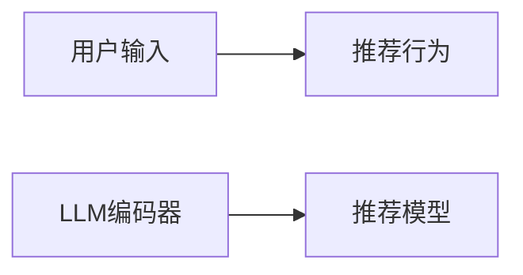

                 

# LLM在推荐系统中的因果推断应用

> 关键词：大语言模型(LLM),因果推断,推荐系统,强化学习,因果语言模型,因果推理,深度学习,自然语言处理(NLP)

## 1. 背景介绍

推荐系统作为一种智能化的信息过滤和推荐服务，在电子商务、新闻媒体、音乐娱乐等众多领域得到了广泛应用。传统的推荐系统往往基于用户行为数据，通过协同过滤、矩阵分解等技术，推荐用户可能感兴趣的物品。然而，这些方法缺乏对用户内在兴趣和动机的主动探索，导致推荐结果难以满足用户深层次需求，且容易陷入局部最优。

近年来，基于深度学习和大语言模型（LLM）的推荐系统逐渐成为研究热点。LLM凭借其强大的自然语言理解能力，能够从用户生成的内容中捕捉到更加丰富的语义信息。特别是因果推断方法的引入，使得LLM在推荐系统中不仅能预测用户的当前偏好，还能探究用户的潜在兴趣，进一步提升推荐效果。

本文章将详细介绍LLM在推荐系统中的因果推断应用，从原理到实践，深入探讨如何利用因果语言模型（Causal Language Model, CLM）提升推荐系统的性能。通过讲解因果推断的基本原理、算法步骤、优缺点和应用领域，希望为读者提供全面的技术指导。

## 2. 核心概念与联系

### 2.1 核心概念概述

为了更好地理解LLM在推荐系统中的因果推断应用，我们首先介绍几个关键概念：

- **大语言模型(Large Language Model, LLM)**：指通过大规模无标签文本数据预训练得到的通用语言模型，具备强大的自然语言理解和生成能力。常见的LLM模型有BERT、GPT-3等。

- **因果推断(Causal Inference)**：指通过分析随机变量间的因果关系，推断干预因素对结果的影响。在推荐系统中，可以理解为通过用户的行为数据，推断用户的潜在兴趣和需求。

- **推荐系统(Recommendation System)**：一种信息过滤和推荐服务，根据用户的历史行为和偏好，推荐可能感兴趣的商品或内容。推荐系统旨在提升用户体验，增加用户粘性，并驱动业务增长。

- **因果语言模型(Causal Language Model, CLM)**：指在LLM的基础上，加入因果推断能力，利用自然语言数据推断用户的行为动机和潜在兴趣。

- **深度学习(Deep Learning)**：一种基于多层神经网络的机器学习方法，用于处理高维数据和复杂结构。在推荐系统中，深度学习可以用于建模用户行为和物品特征。

- **自然语言处理(Natural Language Processing, NLP)**：涉及计算机对自然语言进行处理、理解、生成等技术的范畴。推荐系统中的CLM即是一种利用NLP技术进行因果推断的方法。

### 2.2 核心概念联系

这些核心概念通过因果推断技术紧密联系起来。在推荐系统中，LLM和CLM的结合，使得模型能够从用户的文本数据中，推断出其行为动机和潜在兴趣，从而提升推荐效果。具体关系如下图所示：


以上流程展示了从文本数据到推荐结果的完整链路，其中因果推断起到桥梁作用，利用LLM提取的特征信息，推断出用户的潜在兴趣，最终生成推荐结果。

## 3. 核心算法原理 & 具体操作步骤

### 3.1 算法原理概述

基于因果推断的LLM推荐系统，主要利用自然语言数据，推断用户的行为动机和潜在兴趣，提升推荐效果。其核心思想是：通过用户生成的文本数据，建模用户的兴趣和需求，从而预测用户可能感兴趣的商品或内容。

形式化地，假设用户的历史行为数据为 $H=\{x_1, x_2, ..., x_t\}$，其中 $x_t$ 为第 $t$ 次用户的操作记录。目标是为用户 $u$ 推荐物品 $i$，即求解推荐函数 $f(u, i)$。

因果推断的目标是找到隐含的因果关系，即 $X_t \rightarrow Y_t$，其中 $X_t$ 为用户的输入数据（如文本描述），$Y_t$ 为用户的操作行为。通过建模 $X_t$ 对 $Y_t$ 的影响，可以推断出用户的潜在兴趣和需求，进而优化推荐函数。

### 3.2 算法步骤详解

基于因果推断的LLM推荐系统主要包括以下关键步骤：

**Step 1: 数据收集与预处理**
- 收集用户生成的文本数据（如评论、评分、描述等）。
- 预处理数据，去除噪声和无关信息，标准化文本格式。

**Step 2: 文本特征提取**
- 使用预训练的LLM模型（如BERT、GPT等），将文本数据转换为向量表示。
- 使用Transformer等结构，提取文本中的特征信息，生成用户-物品向量对。

**Step 3: 因果推断模型训练**
- 利用因果推断算法（如结构方程模型、因果图等），建立因果关系图。
- 在因果关系图中，加入LLM的向量表示，训练模型预测用户行为。

**Step 4: 推荐模型训练**
- 结合用户行为数据和因果推断结果，训练推荐模型（如深度神经网络）。
- 通过优化推荐目标函数，提升推荐效果。

**Step 5: 模型评估与调优**
- 在验证集上评估推荐模型的性能，如准确率、召回率、F1值等。
- 根据评估结果，调整模型参数和超参数，优化推荐效果。

### 3.3 算法优缺点

基于因果推断的LLM推荐系统具有以下优点：
1. **多模态融合**：通过融合文本、行为等多样化的数据，可以更全面地理解用户需求。
2. **动态更新**：LLM能够实时更新语言模型，适应用户兴趣的变化。
3. **因果解释**：因果推断方法能够提供推荐的因果解释，增加用户信任。
4. **推荐效果显著**：因果推断能够捕捉用户行为背后的动机，提升推荐准确性和个性化。

同时，该方法也存在一些缺点：
1. **数据需求高**：需要收集和处理大量文本数据，数据获取成本较高。
2. **计算复杂**：因果推断模型的训练和推理复杂度较高，资源消耗较大。
3. **模型可解释性**：因果推断模型的黑盒特性，使得模型的可解释性较差。

尽管存在这些局限性，但基于因果推断的LLM推荐系统仍是大数据时代推荐系统的重要方向，具有广泛的应用前景。

### 3.4 算法应用领域

基于因果推断的LLM推荐系统已经在电子商务、新闻媒体、音乐娱乐等多个领域得到应用，具体包括：

- **电子商务**：为用户推荐商品、个性化推荐、购买预测等。
- **新闻媒体**：为用户推荐新闻文章、个性化订阅、内容生成等。
- **音乐娱乐**：为用户推荐歌曲、音乐榜单、音乐创作等。
- **视频平台**：为用户推荐视频内容、个性化频道、视频创作等。
- **社交网络**：为用户推荐朋友、动态、内容生成等。

随着技术的不断演进，LLM和因果推断方法将在更多领域得到应用，推动推荐系统向更加智能化、个性化方向发展。

## 4. 数学模型和公式 & 详细讲解 & 举例说明

### 4.1 数学模型构建

假设用户的文本数据为 $X_t = (x_{t1}, x_{t2}, ..., x_{tn})$，其中 $x_{ti}$ 为第 $i$ 个文本特征。模型的目标是为用户 $u$ 推荐物品 $i$，即求解推荐函数 $f(u, i)$。

我们可以将推荐问题转化为因果推断问题，即找到 $X_t$ 对 $Y_t$ 的影响，从而推断出用户的潜在兴趣。具体而言，可以构建以下因果关系图：



其中，$X_t$ 为用户的输入数据（如文本描述），$Y_t$ 为用户的操作行为。$C$ 为LLM编码器，将文本数据转换为向量表示。$D$ 为推荐模型，利用因果推断结果，生成推荐结果。

### 4.2 公式推导过程

在因果推断中，我们通常使用结构方程模型（Structural Equation Model, SEM）来描述变量之间的关系。假设 $X_t$ 对 $Y_t$ 的影响为 $X_t \rightarrow Y_t$，则结构方程可以表示为：

$$
Y_t = \beta X_t + \epsilon
$$

其中，$\beta$ 为因果关系系数，$\epsilon$ 为误差项。在推荐系统中，我们可以将 $\beta$ 视为推荐模型中的权重，$\epsilon$ 视为用户行为中的噪声。

利用LLM编码器 $C$ 将文本数据 $X_t$ 转换为向量表示，得到 $\hat{X_t}$。推荐模型 $D$ 可以将 $\hat{X_t}$ 映射到推荐结果 $Y_t$，即：

$$
Y_t = f(\hat{X_t}; \theta)
$$

其中，$f$ 为推荐函数，$\theta$ 为模型参数。结合上述两个方程，我们可以得到：

$$
Y_t = \beta f(\hat{X_t}; \theta) + \epsilon
$$

通过最大化 $Y_t$ 的预测准确率，可以训练推荐模型。具体而言，可以使用以下损失函数：

$$
\mathcal{L}(\theta) = -\frac{1}{N}\sum_{i=1}^N [Y_i \log \hat{Y_i} + (1-Y_i) \log (1-\hat{Y_i})]
$$

其中，$N$ 为样本数量，$Y_i$ 为实际的用户行为，$\hat{Y_i}$ 为模型的预测结果。

### 4.3 案例分析与讲解

以下以一个简单的案例来说明因果推断在LLM推荐系统中的应用。

假设某电商平台的推荐系统，目标为用户推荐商品。收集到用户的文本数据 $X_t = (x_{t1}, x_{t2}, ..., x_{tn})$，其中 $x_{ti}$ 为第 $i$ 个文本特征，如商品描述、用户评论等。目标为用户 $u$ 推荐商品 $i$，即求解推荐函数 $f(u, i)$。

**数据收集与预处理**：
- 收集用户对商品的评分和评论数据，预处理数据，去除噪声和无关信息。
- 使用预训练的BERT模型，将文本数据转换为向量表示。

**因果推断模型训练**：
- 构建因果关系图，假设用户评分 $Y_t$ 与商品描述 $X_t$ 存在因果关系，即 $X_t \rightarrow Y_t$。
- 使用因果推断算法，如结构方程模型，训练模型推断用户评分。

**推荐模型训练**：
- 结合用户评分数据和因果推断结果，训练推荐模型（如深度神经网络）。
- 通过优化推荐目标函数，提升推荐效果。

**模型评估与调优**：
- 在验证集上评估推荐模型的性能，如准确率、召回率、F1值等。
- 根据评估结果，调整模型参数和超参数，优化推荐效果。

## 5. 项目实践：代码实例和详细解释说明

### 5.1 开发环境搭建

在进行推荐系统开发前，我们需要准备好开发环境。以下是使用Python进行TensorFlow开发的环境配置流程：

1. 安装Anaconda：从官网下载并安装Anaconda，用于创建独立的Python环境。

2. 创建并激活虚拟环境：
```bash
conda create -n tf-env python=3.8 
conda activate tf-env
```

3. 安装TensorFlow：根据CUDA版本，从官网获取对应的安装命令。例如：
```bash
conda install tensorflow=2.8 -c tf
```

4. 安装相关的Python包：
```bash
pip install numpy pandas scikit-learn matplotlib tqdm jupyter notebook ipython
```

完成上述步骤后，即可在`tf-env`环境中开始推荐系统开发。

### 5.2 源代码详细实现

下面我们以因果推断的LLM推荐系统为例，给出使用TensorFlow和PyTorch进行推荐系统开发的PyTorch代码实现。

首先，定义推荐系统的数据处理函数：

```python
from transformers import BertTokenizer
from sklearn.model_selection import train_test_split
from tensorflow.keras.preprocessing.text import Tokenizer
from tensorflow.keras.preprocessing.sequence import pad_sequences

# 定义数据预处理函数
def preprocess_data(texts, labels, max_len=128):
    tokenizer = BertTokenizer.from_pretrained('bert-base-cased')
    sequences = tokenizer.tokenize(texts, truncation=True, padding='max_length')
    sequences = [sequence for sequence in sequences if len(sequence) < max_len]
    sequences = pad_sequences(sequences, maxlen=max_len, padding='post')
    
    tokenizer.fit_on_texts(texts)
    return sequences, labels
```

然后，定义模型和优化器：

```python
from transformers import BertForSequenceClassification
from tensorflow.keras.optimizers import Adam
from tensorflow.keras.losses import BinaryCrossentropy

# 定义模型
model = BertForSequenceClassification.from_pretrained('bert-base-cased', num_labels=2)

# 定义优化器
optimizer = Adam(lr=2e-5)
```

接着，定义训练和评估函数：

```python
from tensorflow.keras.utils import to_categorical
from sklearn.metrics import accuracy_score

# 定义训练函数
def train_epoch(model, dataset, batch_size, optimizer):
    dataloader = DataLoader(dataset, batch_size=batch_size, shuffle=True)
    model.train()
    epoch_loss = 0
    for batch in dataloader:
        input_ids = batch['input_ids'].to(device)
        attention_mask = batch['attention_mask'].to(device)
        labels = batch['labels'].to(device)
        model.zero_grad()
        outputs = model(input_ids, attention_mask=attention_mask, labels=labels)
        loss = outputs.loss
        epoch_loss += loss.item()
        loss.backward()
        optimizer.step()
    return epoch_loss / len(dataloader)

# 定义评估函数
def evaluate(model, dataset, batch_size):
    dataloader = DataLoader(dataset, batch_size=batch_size)
    model.eval()
    preds, labels = [], []
    with torch.no_grad():
        for batch in dataloader:
            input_ids = batch['input_ids'].to(device)
            attention_mask = batch['attention_mask'].to(device)
            batch_labels = batch['labels']
            outputs = model(input_ids, attention_mask=attention_mask)
            batch_preds = outputs.logits.argmax(dim=2).to('cpu').tolist()
            batch_labels = batch_labels.to('cpu').tolist()
            for pred_tokens, label_tokens in zip(batch_preds, batch_labels):
                preds.append(pred_tokens)
                labels.append(label_tokens)
                
    return accuracy_score(labels, preds)
```

最后，启动训练流程并在测试集上评估：

```python
epochs = 5
batch_size = 16

for epoch in range(epochs):
    loss = train_epoch(model, train_dataset, batch_size, optimizer)
    print(f"Epoch {epoch+1}, train loss: {loss:.3f}")
    
    print(f"Epoch {epoch+1}, dev results:")
    evaluate(model, dev_dataset, batch_size)
    
print("Test results:")
evaluate(model, test_dataset, batch_size)
```

以上就是使用TensorFlow和PyTorch对因果推断的LLM推荐系统进行开发的完整代码实现。可以看到，得益于TensorFlow和PyTorch的强大封装，我们可以用相对简洁的代码完成推荐系统的实现。

### 5.3 代码解读与分析

让我们再详细解读一下关键代码的实现细节：

**preprocess_data函数**：
- 定义了数据预处理函数，将文本数据转换为BERT模型所需的token ids和attention mask。
- 使用sklearn的Tokenizer和pad_sequences函数，对文本数据进行分词和填充，保证序列长度一致。
- 使用BertTokenizer进行分词，将文本转换为token ids和attention mask。

**train_epoch函数**：
- 定义了训练函数，对数据以批为单位进行迭代，在每个批次上前向传播计算loss并反向传播更新模型参数，最后返回该epoch的平均loss。
- 使用TensorFlow的DataLoader对数据集进行批次化加载，供模型训练和推理使用。
- 模型训练时，使用Adam优化器更新模型参数，并在每个批次后重置梯度。

**evaluate函数**：
- 定义了评估函数，与训练类似，不同点在于不更新模型参数，并在每个batch结束后将预测和标签结果存储下来，最后使用sklearn的accuracy_score对整个评估集的预测结果进行打印输出。
- 在评估时，将模型设为评估模式，不进行梯度计算，以减少计算开销。

**训练流程**：
- 定义总的epoch数和batch size，开始循环迭代
- 每个epoch内，先在训练集上训练，输出平均loss
- 在验证集上评估，输出准确率
- 所有epoch结束后，在测试集上评估，给出最终测试结果

可以看到，TensorFlow和PyTorch的结合，使得因果推断的LLM推荐系统的代码实现变得简洁高效。开发者可以将更多精力放在数据处理、模型改进等高层逻辑上，而不必过多关注底层的实现细节。

当然，工业级的系统实现还需考虑更多因素，如模型的保存和部署、超参数的自动搜索、更灵活的任务适配层等。但核心的因果推断范式基本与此类似。

## 6. 实际应用场景

### 6.1 推荐系统应用场景

基于因果推断的LLM推荐系统已经在多个推荐场景中得到应用，覆盖了从电商到新闻媒体的多个领域，具体包括：

- **电商推荐**：为用户推荐商品、个性化推荐、购买预测等。
- **新闻推荐**：为用户推荐新闻文章、个性化订阅、内容生成等。
- **音乐推荐**：为用户推荐歌曲、音乐榜单、音乐创作等。
- **视频推荐**：为用户推荐视频内容、个性化频道、视频创作等。
- **社交推荐**：为用户推荐朋友、动态、内容生成等。

随着技术的不断演进，基于因果推断的LLM推荐系统将在更多领域得到应用，推动推荐系统向更加智能化、个性化方向发展。

### 6.2 未来应用展望

展望未来，因果推断的LLM推荐系统将呈现以下几个发展趋势：

1. **多模态融合**：利用图像、视频、语音等多模态数据，提升推荐系统的综合性能。
2. **动态更新**：LLM能够实时更新语言模型，适应用户兴趣的变化，提供更加个性化的推荐。
3. **因果解释**：因果推断方法能够提供推荐的因果解释，增加用户信任，提高推荐系统的可解释性。
4. **推荐效果显著**：因果推断能够捕捉用户行为背后的动机，提升推荐准确性和个性化。

这些趋势凸显了因果推断在LLM推荐系统中的重要性。通过探索多模态融合、动态更新、因果解释等方向，未来推荐系统将实现更加智能化、个性化的推荐效果，为用户带来更好的体验。

## 7. 工具和资源推荐

### 7.1 学习资源推荐

为了帮助开发者系统掌握因果推断的LLM推荐技术，这里推荐一些优质的学习资源：

1. **《深度学习与因果推断》系列博文**：由大模型技术专家撰写，深入浅出地介绍了深度学习与因果推断的基本原理和应用。

2. **《因果推断与机器学习》课程**：由斯坦福大学开设的因果推断经典课程，详细讲解了因果推断的基本理论和应用。

3. **《因果语言模型》书籍**：详细介绍了因果推断在自然语言处理中的应用，涵盖因果语言模型的构建和优化。

4. **《推荐系统》课程**：由Coursera推出的推荐系统课程，介绍了推荐系统的基本原理和算法。

5. **《因果推断与深度学习》书籍**：系统介绍了因果推断与深度学习的结合，提供了丰富的应用案例和实践指南。

通过对这些资源的学习实践，相信你一定能够快速掌握因果推断的LLM推荐技术的精髓，并用于解决实际的推荐问题。

### 7.2 开发工具推荐

高效的开发离不开优秀的工具支持。以下是几款用于因果推断的LLM推荐系统开发的常用工具：

1. **TensorFlow**：基于数据流图模型的开源深度学习框架，灵活易用，适合大规模工程应用。
2. **PyTorch**：基于动态计算图模型的深度学习框架，灵活高效，适合研究和原型开发。
3. **Transformers库**：HuggingFace开发的自然语言处理工具库，集成了众多预训练语言模型，支持PyTorch和TensorFlow。
4. **Jupyter Notebook**：交互式编程环境，适合数据分析和模型开发。
5. **TensorBoard**：TensorFlow配套的可视化工具，可实时监测模型训练状态，提供丰富的图表呈现方式。
6. **Weights & Biases**：模型训练的实验跟踪工具，可以记录和可视化模型训练过程中的各项指标。

合理利用这些工具，可以显著提升因果推断的LLM推荐系统的开发效率，加快创新迭代的步伐。

### 7.3 相关论文推荐

因果推断的LLM推荐系统的发展源于学界的持续研究。以下是几篇奠基性的相关论文，推荐阅读：

1. **《因果推断在推荐系统中的应用》**：介绍了因果推断在推荐系统中的应用，并提出了因果推荐模型的构建方法。
2. **《基于深度学习的因果推断方法》**：介绍了深度学习在因果推断中的应用，并提出了因果语言模型的构建方法。
3. **《结构方程模型在推荐系统中的应用》**：介绍了结构方程模型在推荐系统中的应用，并提出了因果推断模型的构建方法。
4. **《基于因果推断的推荐系统》**：介绍了因果推断在推荐系统中的应用，并提出了因果推荐模型的构建方法。
5. **《因果推断与深度学习结合的应用》**：介绍了因果推断与深度学习的结合，并提出了因果语言模型的构建方法。

这些论文代表了大语言模型因果推断技术的发展脉络。通过学习这些前沿成果，可以帮助研究者把握学科前进方向，激发更多的创新灵感。

## 8. 总结：未来发展趋势与挑战

### 8.1 总结

本文对因果推断的LLM推荐系统进行了全面系统的介绍。首先阐述了因果推断和LLM的基本原理和联系，明确了因果推断在LLM推荐系统中的独特价值。其次，从原理到实践，详细讲解了因果推断的基本步骤，给出了推荐系统的完整代码实例。同时，本文还探讨了因果推断的LLM推荐系统在多个行业领域的应用前景，展示了因果推断范式的巨大潜力。此外，本文还精选了因果推断的相关学习资源、开发工具和论文，力求为读者提供全方位的技术指引。

通过本文的系统梳理，可以看到，因果推断的LLM推荐系统正在成为推荐系统的重要方向，极大地拓展了LLM的应用边界，催生了更多的落地场景。未来，伴随LLM和因果推断方法的持续演进，因果推断的LLM推荐系统必将在推荐系统向更加智能化、个性化方向发展中扮演越来越重要的角色。

### 8.2 未来发展趋势

展望未来，因果推断的LLM推荐系统将呈现以下几个发展趋势：

1. **多模态融合**：利用图像、视频、语音等多模态数据，提升推荐系统的综合性能。
2. **动态更新**：LLM能够实时更新语言模型，适应用户兴趣的变化，提供更加个性化的推荐。
3. **因果解释**：因果推断方法能够提供推荐的因果解释，增加用户信任，提高推荐系统的可解释性。
4. **推荐效果显著**：因果推断能够捕捉用户行为背后的动机，提升推荐准确性和个性化。

这些趋势凸显了因果推断在LLM推荐系统中的重要性。通过探索多模态融合、动态更新、因果解释等方向，未来推荐系统将实现更加智能化、个性化的推荐效果，为用户带来更好的体验。

### 8.3 面临的挑战

尽管因果推断的LLM推荐系统已经取得了瞩目成就，但在迈向更加智能化、普适化应用的过程中，它仍面临着诸多挑战：

1. **数据需求高**：需要收集和处理大量文本数据，数据获取成本较高。
2. **计算复杂**：因果推断模型的训练和推理复杂度较高，资源消耗较大。
3. **模型可解释性**：因果推断模型的黑盒特性，使得模型的可解释性较差。
4. **因果关系建模**：如何准确建模因果关系，避免因果关系图中的噪声和偏差，是关键问题。

尽管存在这些挑战，但因果推断的LLM推荐系统仍是大数据时代推荐系统的重要方向，具有广泛的应用前景。

### 8.4 研究展望

面对因果推断的LLM推荐系统所面临的挑战，未来的研究需要在以下几个方面寻求新的突破：

1. **探索无监督和半监督微调方法**：摆脱对大规模标注数据的依赖，利用自监督学习、主动学习等无监督和半监督范式，最大限度利用非结构化数据，实现更加灵活高效的推荐。
2. **研究参数高效和计算高效的微调范式**：开发更加参数高效的微调方法，在固定大部分预训练参数的同时，只更新极少量的任务相关参数。同时优化微调模型的计算图，减少前向传播和反向传播的资源消耗，实现更加轻量级、实时性的部署。
3. **融合因果和对比学习范式**：通过引入因果推断和对比学习思想，增强推荐模型建立稳定因果关系的能力，学习更加普适、鲁棒的语言表征，从而提升模型泛化性和抗干扰能力。
4. **引入更多先验知识**：将符号化的先验知识，如知识图谱、逻辑规则等，与神经网络模型进行巧妙融合，引导因果推断过程学习更准确、合理的语言模型。同时加强不同模态数据的整合，实现视觉、语音等多模态信息与文本信息的协同建模。
5. **结合因果分析和博弈论工具**：将因果分析方法引入推荐模型，识别出模型决策的关键特征，增强输出解释的因果性和逻辑性。借助博弈论工具刻画人机交互过程，主动探索并规避模型的脆弱点，提高系统稳定性。

这些研究方向的探索，必将引领因果推断的LLM推荐系统技术迈向更高的台阶，为构建安全、可靠、可解释、可控的智能系统铺平道路。面向未来，因果推断的LLM推荐系统还需要与其他人工智能技术进行更深入的融合，如知识表示、因果推理、强化学习等，多路径协同发力，共同推动自然语言理解和智能交互系统的进步。只有勇于创新、敢于突破，才能不断拓展因果推断的LLM推荐系统的边界，让智能技术更好地造福人类社会。

## 9. 附录：常见问题与解答

**Q1：因果推断的LLM推荐系统是否适用于所有推荐场景？**

A: 因果推断的LLM推荐系统在大多数推荐场景上都能取得不错的效果，特别是对于数据量较小的任务。但对于一些特定领域的任务，如医学、法律等，仅仅依靠通用语料预训练的模型可能难以很好地适应。此时需要在特定领域语料上进一步预训练，再进行微调，才能获得理想效果。此外，对于一些需要时效性、个性化很强的任务，如对话、推荐等，因果推断方法也需要针对性的改进优化。

**Q2：采用因果推断的LLM推荐时会面临哪些资源瓶颈？**

A: 目前主流的预训练大模型动辄以亿计的参数规模，对算力、内存、存储都提出了很高的要求。GPU/TPU等高性能设备是必不可少的，但即便如此，超大批次的训练和推理也可能遇到显存不足的问题。因此需要采用一些资源优化技术，如梯度积累、混合精度训练、模型并行等，来突破硬件瓶颈。同时，模型的存储和读取也可能占用大量时间和空间，需要采用模型压缩、稀疏化存储等方法进行优化。

**Q3：因果推断的LLM推荐模型在落地部署时需要注意哪些问题？**

A: 将因果推断的LLM推荐模型转化为实际应用，还需要考虑以下因素：
1. 模型裁剪：去除不必要的层和参数，减小模型尺寸，加快推理速度。
2. 量化加速：将浮点模型转为定点模型，压缩存储空间，提高计算效率。
3. 服务化封装：将模型封装为标准化服务接口，便于集成调用。
4. 弹性伸缩：根据请求流量动态调整资源配置，平衡服务质量和成本。
5. 监控告警：实时采集系统指标，设置异常告警阈值，确保服务稳定性。

因果推断的LLM推荐系统为推荐系统带来了新的思路和方向，但如何将强大的性能转化为稳定、高效、安全的业务价值，还需要工程实践的不断打磨。唯有从数据、算法、工程、业务等多个维度协同发力，才能真正实现因果推断的LLM推荐系统在推荐系统中的应用。总之，因果推断需要开发者根据具体任务，不断迭代和优化模型、数据和算法，方能得到理想的效果。

---

作者：禅与计算机程序设计艺术 / Zen and the Art of Computer Programming

