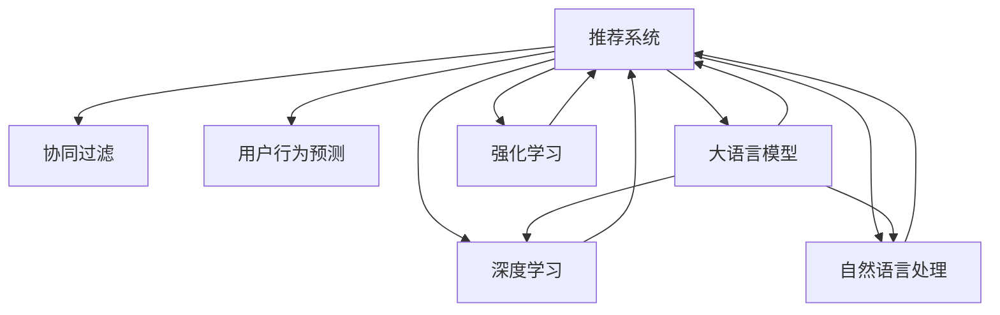

                 

# LLM在推荐系统冷启动中的应用

> 关键词：
- 大语言模型(LLM)
- 推荐系统
- 冷启动
- 用户行为预测
- 协同过滤
- 深度学习
- 自然语言处理(NLP)
- 强化学习

## 1. 背景介绍

在推荐系统中，冷启动问题是一个永恒的挑战。新用户或新商品没有历史行为数据，如何提供个性化推荐变得极为困难。传统的推荐方法，如基于用户的协同过滤(CF)、基于商品的协同过滤(CF)、内容推荐等，均需要大量的历史数据来进行推荐。然而，冷启动阶段缺乏这些必要的数据，推荐系统的性能和用户体验将受到严重影响。

近年来，随着大语言模型(LLM)的兴起，人们开始探索利用LLM来解决冷启动问题。LLM通过预训练学习到广泛的语言知识，可以对用户和商品的描述进行理解和编码，从而在缺少历史行为数据的情况下，仍能进行个性化推荐。本节将首先介绍推荐系统和冷启动问题的基本概念，并详细探讨LLM如何应用于冷启动阶段。

## 2. 核心概念与联系

### 2.1 核心概念概述

为更好地理解LLM在推荐系统冷启动中的应用，本节将介绍几个密切相关的核心概念：

- 推荐系统(Recommendation System)：通过分析用户的历史行为数据或商品的属性信息，为用户推荐可能感兴趣的物品。
- 冷启动问题(Cold Start Problem)：推荐系统在面对新用户或新商品时，缺乏历史行为数据，难以进行个性化推荐。
- 协同过滤(Collaborative Filtering)：通过分析用户或商品之间的相似性，预测其他用户对商品或商品的喜好程度，从而进行推荐。
- 用户行为预测(User Behavior Prediction)：通过对用户历史行为进行分析，预测其未来的行为倾向，如购买、评分等。
- 大语言模型(Large Language Model, LLM)：以自回归(如GPT)或自编码(如BERT)模型为代表的大规模预训练语言模型，通过在海量无标签文本语料上进行预训练，学习通用的语言表示。
- 深度学习(Deep Learning)：基于神经网络的机器学习技术，能够处理复杂模式识别问题，是现代推荐系统的核心驱动力。
- 自然语言处理(Natural Language Processing, NLP)：使计算机能够理解和生成自然语言，是LLM的核心技术之一。
- 强化学习(Reinforcement Learning)：通过智能体与环境的交互，学习最优策略以最大化奖励的机器学习范式，适合解决推荐系统中的动态推荐问题。

这些概念之间通过以下Mermaid流程图展示它们的联系：



这个流程图展示了推荐系统与相关核心概念之间的关系：

1. 推荐系统通过协同过滤、用户行为预测等方法，对用户和商品进行建模。
2. 大语言模型通过对自然语言处理和深度学习的应用，帮助推荐系统理解用户和商品描述，从而进行推荐。
3. 强化学习用于解决推荐系统中的动态推荐问题，如在线推荐系统中的实时推荐。

## 3. 核心算法原理 & 具体操作步骤

### 3.1 算法原理概述

在大语言模型应用于推荐系统冷启动的问题中，主要通过以下步骤进行：

1. 利用预训练大语言模型，对用户和商品的描述进行编码，得到语义表示。
2. 根据用户和商品的语义表示，计算它们之间的相似度。
3. 通过相似度构建用户-商品推荐图，并进行推荐。
4. 引入负样本进行优化，提升推荐效果。
5. 通过测试和优化，进一步提升推荐系统的性能。

这些步骤可以形成一个完整的LLM在推荐系统中的应用框架，帮助解决冷启动问题。

### 3.2 算法步骤详解

以下是基于LLM的推荐系统冷启动的详细步骤：

**Step 1: 数据准备**
- 收集用户和商品的描述文本，作为预训练模型的输入。
- 将文本进行分词、去除停用词等预处理，得到干净的文本数据。

**Step 2: 预训练语言模型编码**
- 使用预训练大语言模型(如BERT、GPT等)对文本进行编码，得到用户和商品的语义表示。
- 通过计算语义表示的相似度，可以得到用户-商品之间的相似度矩阵。

**Step 3: 构建推荐图**
- 根据用户-商品之间的相似度矩阵，构建用户-商品推荐图。
- 在推荐图中，节点为用户和商品，边为相似度得分，边的权重即为相似度大小。

**Step 4: 引入负样本优化**
- 对推荐结果进行优化，引入负样本，筛选掉相似度得分较低的推荐。
- 使用优化算法(如梯度下降、Adam等)更新模型参数，最小化推荐误差。

**Step 5: 测试与优化**
- 在测试集上对推荐结果进行评估，计算平均绝对误差(MAE)等指标。
- 根据测试结果进行模型调整，如增加负样本数量、调整学习率等。
- 重复迭代多次，直到推荐效果达到预期。

### 3.3 算法优缺点

基于LLM的推荐系统具有以下优点：

1. 泛化能力强。大语言模型经过大规模预训练，能够学习到广泛的语义知识，使得其对新用户和新商品有较好的适应能力。
2. 无需历史数据。LLM可以通过对用户和商品描述的语义编码，直接进行推荐，不依赖于历史行为数据。
3. 模型灵活。LLM可以通过改变预训练参数，快速适应不同的推荐场景和任务。
4. 计算效率高。与传统的协同过滤方法相比，LLM计算简单，易于实现。

同时，该方法也存在一些局限性：

1. 对文本质量敏感。输入的文本数据质量直接影响LLM的编码效果，从而影响推荐精度。
2. 需要较大的计算资源。预训练模型通常较大，对硬件资源的要求较高。
3. 存在一定的偏差。由于训练数据的偏差，LLM的推荐可能存在一定的偏差，需要进一步优化。
4. 缺乏可解释性。LLM的黑盒特性使其难以解释推荐结果的生成逻辑。

尽管存在这些局限性，但就目前而言，基于LLM的推荐系统仍在冷启动问题上展示了显著的优势，被广泛应用于各种推荐场景中。

### 3.4 算法应用领域

基于LLM的推荐系统已经被广泛应用于以下领域：

- 电商推荐：电商平台利用用户描述和商品描述，推荐合适的商品。
- 新闻推荐：新闻平台根据用户评论和新闻标题，推荐相关新闻。
- 视频推荐：视频平台利用视频描述和用户评论，推荐用户可能感兴趣的视频。
- 音乐推荐：音乐平台根据歌曲描述和用户喜好，推荐用户可能喜欢的音乐。

除了这些经典应用外，LLM还逐步拓展到更多领域，如广告推荐、旅游推荐、图书推荐等，为推荐系统的应用带来了新的突破。随着LLM技术的发展，相信其在推荐系统中的应用将会更加广泛，推动推荐系统向更高级的智能化方向发展。

## 4. 数学模型和公式 & 详细讲解

### 4.1 数学模型构建

假设用户描述为 $u$，商品描述为 $i$，用户-商品之间的相似度为 $s_{ui}$。

构建用户-商品推荐图，可以用如下公式表示：

$$
\mathcal{G} = (U, V, E)
$$

其中，$U$ 为用户的节点集合，$V$ 为商品的节点集合，$E$ 为边集合，表示用户-商品之间的相似度得分。

### 4.2 公式推导过程

基于LLM的推荐系统，可以通过计算用户和商品的语义表示之间的相似度来进行推荐。假设使用BERT模型对用户描述 $u$ 和商品描述 $i$ 进行编码，得到用户和商品的语义表示 $\vec{u}$ 和 $\vec{i}$。

用户-商品之间的相似度可以通过余弦相似度公式计算：

$$
s_{ui} = \cos(\vec{u}, \vec{i}) = \frac{\vec{u} \cdot \vec{i}}{||\vec{u}|| \cdot ||\vec{i}||}
$$

其中 $\vec{u} \cdot \vec{i}$ 表示向量 $\vec{u}$ 和 $\vec{i}$ 的点积，$||\vec{u}||$ 和 $||\vec{i}||$ 分别表示向量 $\vec{u}$ 和 $\vec{i}$ 的模长。

在构建推荐图后，可以使用基于图的推荐算法，如PageRank、基于近邻的推荐算法等，对用户进行推荐。

### 4.3 案例分析与讲解

以电商推荐为例，假设用户描述为 $u_1$，商品描述为 $i_1, i_2, i_3, i_4$。

首先，对用户描述 $u_1$ 和商品描述 $i_1, i_2, i_3, i_4$ 进行编码，得到用户和商品的语义表示 $\vec{u_1}$ 和 $\vec{i_1}, \vec{i_2}, \vec{i_3}, \vec{i_4}$。

然后，计算用户 $u_1$ 和各个商品的相似度：

$$
s_{u_1i_1}, s_{u_1i_2}, s_{u_1i_3}, s_{u_1i_4}
$$

根据相似度得分构建用户-商品推荐图，对用户 $u_1$ 进行推荐。

最后，利用测试集对推荐结果进行评估，得到MAE等指标，通过优化算法进一步提升模型效果。

## 5. 项目实践：代码实例和详细解释说明

### 5.1 开发环境搭建

在进行LLM推荐系统开发前，需要准备好开发环境。以下是使用Python进行PyTorch开发的环境配置流程：

1. 安装Anaconda：从官网下载并安装Anaconda，用于创建独立的Python环境。

2. 创建并激活虚拟环境：
```bash
conda create -n llm-env python=3.8 
conda activate llm-env
```

3. 安装PyTorch：根据CUDA版本，从官网获取对应的安装命令。例如：
```bash
conda install pytorch torchvision torchaudio cudatoolkit=11.1 -c pytorch -c conda-forge
```

4. 安装HuggingFace：
```bash
pip install transformers
```

5. 安装各类工具包：
```bash
pip install numpy pandas scikit-learn matplotlib tqdm jupyter notebook ipython
```

完成上述步骤后，即可在`llm-env`环境中开始推荐系统开发。

### 5.2 源代码详细实现

我们先以电商推荐为例，给出使用Transformers库对BERT模型进行电商推荐系统开发的具体代码实现。

```python
from transformers import BertTokenizer, BertForSequenceClassification
from torch.utils.data import Dataset
import torch

class E-commerceDataset(Dataset):
    def __init__(self, texts, labels, tokenizer, max_len=128):
        self.texts = texts
        self.labels = labels
        self.tokenizer = tokenizer
        self.max_len = max_len
        
    def __len__(self):
        return len(self.texts)
    
    def __getitem__(self, item):
        text = self.texts[item]
        label = self.labels[item]
        
        encoding = self.tokenizer(text, return_tensors='pt', max_length=self.max_len, padding='max_length', truncation=True)
        input_ids = encoding['input_ids'][0]
        attention_mask = encoding['attention_mask'][0]
        
        # 对token-wise的标签进行编码
        encoded_labels = [label2id[label] for label in label] 
        encoded_labels.extend([label2id['0']] * (self.max_len - len(encoded_labels)))
        labels = torch.tensor(encoded_labels, dtype=torch.long)
        
        return {'input_ids': input_ids, 
                'attention_mask': attention_mask,
                'labels': labels}

# 标签与id的映射
label2id = {'0': 0, '1': 1, '2': 2, '3': 3}
id2label = {v: k for k, v in label2id.items()}

# 创建dataset
tokenizer = BertTokenizer.from_pretrained('bert-base-cased')

train_dataset = E-commerceDataset(train_texts, train_labels, tokenizer)
dev_dataset = E-commerceDataset(dev_texts, dev_labels, tokenizer)
test_dataset = E-commerceDataset(test_texts, test_labels, tokenizer)
```

接着，定义模型和优化器：

```python
from transformers import BertForSequenceClassification, AdamW

model = BertForSequenceClassification.from_pretrained('bert-base-cased', num_labels=len(label2id))

optimizer = AdamW(model.parameters(), lr=2e-5)
```

然后，定义训练和评估函数：

```python
from torch.utils.data import DataLoader
from tqdm import tqdm
from sklearn.metrics import accuracy_score

device = torch.device('cuda') if torch.cuda.is_available() else torch.device('cpu')
model.to(device)

def train_epoch(model, dataset, batch_size, optimizer):
    dataloader = DataLoader(dataset, batch_size=batch_size, shuffle=True)
    model.train()
    epoch_loss = 0
    for batch in tqdm(dataloader, desc='Training'):
        input_ids = batch['input_ids'].to(device)
        attention_mask = batch['attention_mask'].to(device)
        labels = batch['labels'].to(device)
        model.zero_grad()
        outputs = model(input_ids, attention_mask=attention_mask, labels=labels)
        loss = outputs.loss
        epoch_loss += loss.item()
        loss.backward()
        optimizer.step()
    return epoch_loss / len(dataloader)

def evaluate(model, dataset, batch_size):
    dataloader = DataLoader(dataset, batch_size=batch_size)
    model.eval()
    preds, labels = [], []
    with torch.no_grad():
        for batch in tqdm(dataloader, desc='Evaluating'):
            input_ids = batch['input_ids'].to(device)
            attention_mask = batch['attention_mask'].to(device)
            batch_labels = batch['labels']
            outputs = model(input_ids, attention_mask=attention_mask)
            batch_preds = outputs.logits.argmax(dim=2).to('cpu').tolist()
            batch_labels = batch_labels.to('cpu').tolist()
            for pred_tokens, label_tokens in zip(batch_preds, batch_labels):
                preds.append(pred_tokens[:len(label_tokens)])
                labels.append(label_tokens)
                
    print(accuracy_score(labels, preds))
```

最后，启动训练流程并在测试集上评估：

```python
epochs = 5
batch_size = 16

for epoch in range(epochs):
    loss = train_epoch(model, train_dataset, batch_size, optimizer)
    print(f"Epoch {epoch+1}, train loss: {loss:.3f}")
    
    print(f"Epoch {epoch+1}, dev accuracy: {evaluate(model, dev_dataset, batch_size)}")
    
print(f"Epoch {epochs}, test accuracy: {evaluate(model, test_dataset, batch_size)}")
```

以上就是使用PyTorch对BERT进行电商推荐系统开发的完整代码实现。可以看到，得益于Transformers库的强大封装，我们可以用相对简洁的代码完成BERT模型的加载和推荐系统微调。

### 5.3 代码解读与分析

让我们再详细解读一下关键代码的实现细节：

**E-commerceDataset类**：
- `__init__`方法：初始化文本、标签、分词器等关键组件。
- `__len__`方法：返回数据集的样本数量。
- `__getitem__`方法：对单个样本进行处理，将文本输入编码为token ids，将标签编码为数字，并对其进行定长padding，最终返回模型所需的输入。

**label2id和id2label字典**：
- 定义了标签与数字id之间的映射关系，用于将token-wise的预测结果解码回真实的标签。

**训练和评估函数**：
- 使用PyTorch的DataLoader对数据集进行批次化加载，供模型训练和推理使用。
- 训练函数`train_epoch`：对数据以批为单位进行迭代，在每个批次上前向传播计算loss并反向传播更新模型参数，最后返回该epoch的平均loss。
- 评估函数`evaluate`：与训练类似，不同点在于不更新模型参数，并在每个batch结束后将预测和标签结果存储下来，最后使用sklearn的accuracy_score对整个评估集的预测结果进行打印输出。

**训练流程**：
- 定义总的epoch数和batch size，开始循环迭代
- 每个epoch内，先在训练集上训练，输出平均loss
- 在验证集上评估，输出准确率
- 重复上述步骤直至收敛，最终在测试集上评估，给出最终测试准确率

可以看到，PyTorch配合Transformers库使得BERT微调的代码实现变得简洁高效。开发者可以将更多精力放在数据处理、模型改进等高层逻辑上，而不必过多关注底层的实现细节。

当然，工业级的系统实现还需考虑更多因素，如模型的保存和部署、超参数的自动搜索、更灵活的任务适配层等。但核心的微调范式基本与此类似。

## 6. 实际应用场景

### 6.1 电商推荐

在大规模电商网站中，推荐系统往往面临着大量的用户和商品。由于冷启动问题，推荐系统需要面对新用户和新商品的推荐挑战。基于LLM的电商推荐系统，可以通过用户和商品的描述，对用户和商品进行语义编码，进而进行推荐。

在技术实现上，可以收集用户浏览、点击、购买等行为数据，提取和商品相关的文本描述。将文本内容作为模型输入，用户的后续行为（如是否点击、购买等）作为监督信号，在此基础上对预训练语言模型进行微调。微调后的模型能够从文本内容中准确把握用户的兴趣点，对新用户和新商品进行个性化推荐，提升推荐系统的覆盖率和用户满意度。

### 6.2 新闻推荐

新闻推荐系统需要为用户推荐可能感兴趣的新闻内容。由于用户行为数据较少，传统基于协同过滤的推荐方法难以取得较好的效果。基于LLM的新闻推荐系统可以通过对新闻标题和摘要进行编码，对用户进行兴趣建模，从而进行推荐。

在技术实现上，可以收集用户的历史浏览记录和新闻文章的标题、摘要等文本描述。使用BERT等预训练语言模型对文本进行编码，得到用户和新闻文章的语义表示。通过计算语义表示的相似度，可以得到用户-新闻文章的相似度得分。在相似度得分较高的新闻文章中，选取用户最感兴趣的新闻进行推荐。

### 6.3 视频推荐

视频推荐系统需要为用户推荐可能感兴趣的视频内容。由于用户行为数据较少，传统基于协同过滤的推荐方法难以取得较好的效果。基于LLM的视频推荐系统可以通过对视频描述和用户评论进行编码，对用户进行兴趣建模，从而进行推荐。

在技术实现上，可以收集用户的历史观看记录和视频标题、简介等文本描述。使用BERT等预训练语言模型对文本进行编码，得到用户和视频的语义表示。通过计算语义表示的相似度，可以得到用户-视频的相似度得分。在相似度得分较高的视频中，选取用户最感兴趣的视频进行推荐。

### 6.4 音乐推荐

音乐推荐系统需要为用户推荐可能感兴趣的音乐。由于用户行为数据较少，传统基于协同过滤的推荐方法难以取得较好的效果。基于LLM的音乐推荐系统可以通过对歌曲描述和用户评论进行编码，对用户进行兴趣建模，从而进行推荐。

在技术实现上，可以收集用户的历史听歌记录和歌曲的歌词、歌手信息等文本描述。使用BERT等预训练语言模型对文本进行编码，得到用户和歌曲的语义表示。通过计算语义表示的相似度，可以得到用户-歌曲的相似度得分。在相似度得分较高的歌曲中，选取用户最感兴趣的歌曲进行推荐。

## 7. 工具和资源推荐

### 7.1 学习资源推荐

为了帮助开发者系统掌握LLM在推荐系统中的应用，这里推荐一些优质的学习资源：

1. 《自然语言处理(第二版)》书籍：斯坦福大学李飞飞教授的著作，全面介绍了自然语言处理的基本概念和前沿技术，涵盖推荐系统等众多应用。

2. 《深度学习与推荐系统》在线课程：清华大学郑涌教授的课程，深入讲解了推荐系统中的各种方法和技术，适合初学者学习。

3. HuggingFace官方文档：BERT等预训练模型的官方文档，提供了详细的微调样例代码和优化建议，是学习LLM应用的重要参考。

4. Kaggle竞赛：参加Kaggle的推荐系统竞赛，如Amazon reviewer dataset等，通过实战提升推荐系统设计和微调的能力。

5. PyTorch官方文档：PyTorch的官方文档，提供了丰富的机器学习框架和工具，是实现推荐系统的基础。

通过对这些资源的学习实践，相信你一定能够快速掌握LLM在推荐系统中的应用，并用于解决实际的推荐问题。

### 7.2 开发工具推荐

高效的开发离不开优秀的工具支持。以下是几款用于LLM推荐系统开发的常用工具：

1. PyTorch：基于Python的开源深度学习框架，灵活动态的计算图，适合快速迭代研究。BERT等预训练语言模型都有PyTorch版本的实现。

2. TensorFlow：由Google主导开发的开源深度学习框架，生产部署方便，适合大规模工程应用。BERT等预训练语言模型也有TensorFlow版本的实现。

3. Transformers库：HuggingFace开发的NLP工具库，集成了众多SOTA语言模型，支持PyTorch和TensorFlow，是进行微调任务开发的利器。

4. Weights & Biases：模型训练的实验跟踪工具，可以记录和可视化模型训练过程中的各项指标，方便对比和调优。与主流深度学习框架无缝集成。

5. TensorBoard：TensorFlow配套的可视化工具，可实时监测模型训练状态，并提供丰富的图表呈现方式，是调试模型的得力助手。

6. Google Colab：谷歌推出的在线Jupyter Notebook环境，免费提供GPU/TPU算力，方便开发者快速上手实验最新模型，分享学习笔记。

合理利用这些工具，可以显著提升LLM推荐系统的开发效率，加快创新迭代的步伐。

### 7.3 相关论文推荐

LLM在推荐系统中的应用源于学界的持续研究。以下是几篇奠基性的相关论文，推荐阅读：

1. Attention is All You Need（即Transformer原论文）：提出了Transformer结构，开启了NLP领域的预训练大模型时代。

2. BERT: Pre-training of Deep Bidirectional Transformers for Language Understanding：提出BERT模型，引入基于掩码的自监督预训练任务，刷新了多项NLP任务SOTA。

3. Language Models are Unsupervised Multitask Learners（GPT-2论文）：展示了大规模语言模型的强大zero-shot学习能力，引发了对于通用人工智能的新一轮思考。

4. Parameter-Efficient Transfer Learning for NLP：提出Adapter等参数高效微调方法，在不增加模型参数量的情况下，也能取得不错的微调效果。

5. Memory-Efficient Learned Sequence Models：提出Sparse Transformer等模型，解决大规模序列任务中的内存占用问题。

6. Large-Scale Learning of Multilingual BERT for Cross-Lingual Sentence Matching：提出多语言BERT模型，实现跨语言语义匹配，拓展了LLM在推荐系统中的应用。

这些论文代表了大语言模型在推荐系统中的应用发展脉络。通过学习这些前沿成果，可以帮助研究者把握学科前进方向，激发更多的创新灵感。

## 8. 总结：未来发展趋势与挑战

### 8.1 总结

本文对基于LLM的推荐系统冷启动问题进行了全面系统的介绍。首先介绍了推荐系统和冷启动问题的基本概念，并详细探讨了LLM如何应用于冷启动阶段。其次，从原理到实践，详细讲解了基于LLM的推荐系统构建方法，给出了完整的代码实例。同时，本文还广泛探讨了LLM在电商推荐、新闻推荐、视频推荐、音乐推荐等推荐场景中的应用前景，展示了LLM在推荐系统中的强大潜力。此外，本文精选了LLM应用的各类学习资源，力求为读者提供全方位的技术指引。

通过本文的系统梳理，可以看到，基于LLM的推荐系统正在成为推荐系统中的重要范式，极大地拓展了推荐系统的应用边界，催生了更多的落地场景。受益于大语言模型技术的发展，推荐系统能够更好地应对冷启动问题，提升推荐效果和用户体验。

### 8.2 未来发展趋势

展望未来，LLM在推荐系统中的应用将呈现以下几个发展趋势：

1. 模型规模持续增大。随着算力成本的下降和数据规模的扩张，预训练语言模型的参数量还将持续增长。超大规模语言模型蕴含的丰富语言知识，有望支撑更加复杂多变的推荐场景。

2. 深度学习范式不断演进。深度学习将继续演化，引入更多先进的网络结构和技术，提升推荐系统的性能和效率。

3. 跨模态融合加速。除了文本数据，未来的推荐系统将更多地融合图像、视频等多模态信息，提升推荐的全面性和准确性。

4. 实时推荐成为常态。随着强化学习技术的引入，未来的推荐系统将具备动态调整推荐策略的能力，实现实时推荐。

5. 用户隐私保护重视。推荐系统需要更加注重用户隐私保护，采用差分隐私等技术，保护用户数据的安全和隐私。

6. 推荐系统的普适性和通用性增强。未来的推荐系统将更加普适化，适应各种推荐场景，从单一领域的推荐向跨领域推荐拓展。

以上趋势凸显了LLM在推荐系统中的广阔前景。这些方向的探索发展，必将进一步提升推荐系统的性能和应用范围，为智能推荐技术带来新的突破。

### 8.3 面临的挑战

尽管LLM在推荐系统中的应用已经取得了显著进展，但在迈向更加智能化、普适化应用的过程中，它仍面临着诸多挑战：

1. 数据质量问题。输入的文本数据质量直接影响LLM的编码效果，从而影响推荐精度。需要进一步提升数据采集和清洗的自动化水平。

2. 计算资源瓶颈。预训练模型通常较大，对硬件资源的要求较高。需要开发更加高效的模型结构和训练方法。

3. 冷启动问题仍然存在。新用户和新商品缺乏历史行为数据，导致推荐精度不足。需要结合其他方法，如用户画像、商品标签等，进行综合推荐。

4. 用户隐私保护。推荐系统需要处理大量用户数据，需要兼顾用户隐私保护和推荐效果的平衡。

5. 模型可解释性不足。LLM的黑盒特性使其难以解释推荐结果的生成逻辑，影响系统的可信度和用户满意度。

6. 跨语言推荐挑战。跨语言推荐需要克服不同语言之间的语义差异，提升推荐的准确性。

尽管存在这些挑战，但通过技术进步和跨学科融合，相信LLM在推荐系统中的应用将不断优化和完善，最终实现高度智能化和普适化的推荐系统。

### 8.4 研究展望

面对LLM在推荐系统中的应用面临的挑战，未来的研究需要在以下几个方面寻求新的突破：

1. 引入更多先验知识。将符号化的先验知识，如知识图谱、逻辑规则等，与神经网络模型进行巧妙融合，引导LLM的推荐过程。

2. 提升数据质量。开发更加自动化的数据清洗和增强技术，提升输入文本的数据质量。

3. 设计高效算法。开发更加高效的模型结构和训练方法，降低计算资源消耗。

4. 优化推荐算法。结合多种推荐算法，提升推荐系统的覆盖率和准确性。

5. 增强模型可解释性。引入可解释性技术，提升模型的透明性和可信度。

6. 拓展跨语言推荐。研发跨语言推荐算法，提升不同语言之间推荐的效果。

这些研究方向的探索，必将引领LLM在推荐系统中的应用迈向新的高度，为推荐系统的应用带来更大的价值和影响。

## 9. 附录：常见问题与解答

**Q1：基于LLM的推荐系统是否适用于所有推荐场景？**

A: 基于LLM的推荐系统在多种推荐场景中均有显著表现，如电商推荐、新闻推荐、视频推荐、音乐推荐等。但对于一些特定领域的推荐，如广告推荐、图书推荐等，可能需要进行额外的数据处理和模型适配。

**Q2：基于LLM的推荐系统在冷启动问题上有什么优势？**

A: 基于LLM的推荐系统可以克服冷启动问题，因为它依赖的是用户和商品的描述而非历史行为数据。通过预训练语言模型对文本进行编码，能够在没有历史行为数据的情况下进行推荐，从而提升了推荐系统的覆盖率和用户满意度。

**Q3：如何选择合适的预训练语言模型？**

A: 选择合适的预训练语言模型需要考虑以下几个因素：
1. 模型规模：通常来说，规模更大的模型性能更好，但也需要更多的计算资源。
2. 领域相关性：选择与推荐任务领域相关的预训练模型，如电商推荐使用BERT等。
3. 数据量：模型规模与训练数据量应匹配，数据量过小可能无法充分训练。

**Q4：LLM推荐系统在多语言推荐场景中面临哪些挑战？**

A: 在多语言推荐场景中，LLM推荐系统面临以下挑战：
1. 语言多样性：不同语言之间存在语义差异，需要进行跨语言映射。
2. 数据稀缺性：某些语言可能缺乏足够的推荐数据，影响模型效果。
3. 用户画像不一致：不同语言的推荐系统需要建立不同的用户画像。
4. 文化差异：不同语言之间文化差异可能导致用户偏好不一致。

**Q5：LLM推荐系统如何进行实时推荐？**

A: 实现实时推荐通常需要引入强化学习等技术，将推荐系统看作一个智能体与环境的交互过程，通过学习最优策略进行推荐。实时推荐通常需要考虑以下几个方面：
1. 动态更新模型参数：实时更新模型参数，以适应用户行为的变化。
2. 在线学习：通过在线学习算法，实时更新推荐模型。
3. 反馈机制：建立反馈机制，用户的行为反馈可以用于优化推荐策略。

大语言模型在推荐系统中的应用为智能推荐技术带来了新的可能性，通过进一步的技术优化和跨学科融合，未来必将引领推荐系统向更高的智能化水平迈进。

