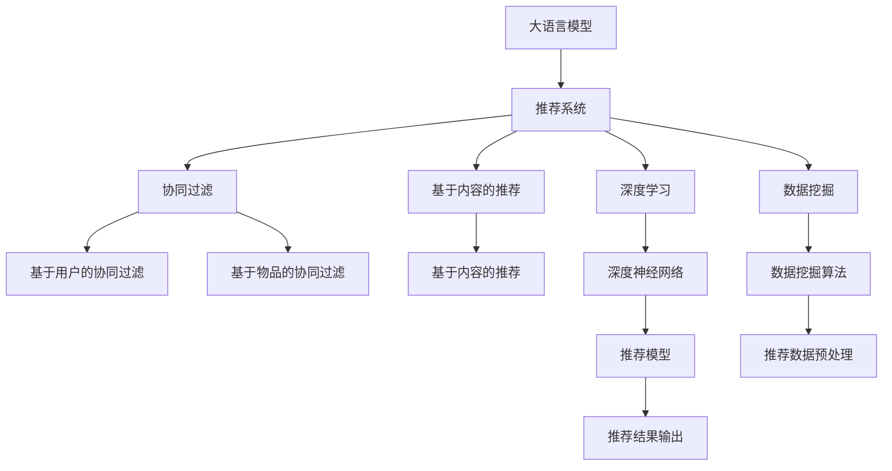

                 

# LLM在推荐系统：多样性与可扩展性

> 关键词：大语言模型(LLM),推荐系统,多样性,可扩展性,协同过滤,基于内容的推荐,深度学习,数据挖掘

## 1. 背景介绍

推荐系统（Recommender Systems）已经成为电商、社交媒体、视频流等众多在线平台的核心功能之一。其目的是通过分析用户的行为数据，为用户推荐最可能感兴趣的产品、内容、服务或信息。随着数据量的增长，推荐系统需要处理和存储的信息量越来越大，计算复杂度也越来越高。因此，推荐系统的算法和模型设计需要在多样性和可扩展性之间取得平衡，既要能够高效地推荐多样化的内容，又要能够在处理大量用户数据时保持高效和可伸缩。

近年来，大语言模型（LLM）在自然语言处理（NLP）领域取得了显著进展，已经证明了其在处理复杂语言任务上的能力。LLM通常基于Transformer架构，通过自监督学习在大规模语料上进行预训练，获得了对语言的强大理解能力。这些模型可以处理各种类型的文本数据，并且可以通过微调来适应特定的任务。在推荐系统领域，LLM可以用于提升推荐的多样性和可扩展性，使其能够在不同的场景下取得更好的效果。

## 2. 核心概念与联系

### 2.1 核心概念概述

为了更好地理解LLM在推荐系统中的应用，本节将介绍几个关键概念：

- **大语言模型（LLM）**：基于Transformer架构，通过在大规模语料上进行自监督学习训练得到的模型，可以处理自然语言文本，并可以进行文本生成、问答、情感分析等复杂语言任务。

- **推荐系统**：利用用户的历史行为数据，为用户推荐最可能感兴趣的产品或内容。常见的推荐方法包括基于内容的推荐、协同过滤和混合推荐等。

- **多样性（Diversity）**：推荐系统需要确保推荐结果的多样性，以避免用户长时间收到同一类型的内容而感到疲劳。多样性可以通过引入不同的推荐算法和模型来实现。

- **可扩展性（Scalability）**：推荐系统需要能够处理大量用户数据，同时保持高效和可伸缩。可扩展性可以通过分布式计算、缓存、负载均衡等技术来实现。

- **协同过滤（Collaborative Filtering, CF）**：通过分析用户之间的相似性来推荐内容。协同过滤可以分为基于用户的CF和基于物品的CF。

- **基于内容的推荐（Content-based Recommendation, CB）**：根据物品的属性和特征来推荐给用户。CB方法通常包括特征提取、用户-物品相似度计算等步骤。

- **深度学习（Deep Learning）**：利用深度神经网络对大量数据进行建模，可以发现数据中的复杂模式和结构。深度学习模型通常需要大量的标注数据进行训练。

- **数据挖掘（Data Mining）**：从大量数据中挖掘出有用的信息，用于支持决策和推荐。数据挖掘技术包括聚类、分类、关联规则挖掘等。

这些核心概念之间的逻辑关系可以通过以下Mermaid流程图来展示：

这个流程图展示了大语言模型在推荐系统中的核心概念及其之间的关系：

1. 大语言模型通过预训练获得基础能力。
2. 推荐系统通过协同过滤、基于内容的推荐、深度学习和数据挖掘等多种技术进行推荐。
3. 协同过滤和基于内容的推荐可以与深度学习相结合，提升推荐模型的性能。
4. 数据挖掘技术可以用于推荐数据的预处理，提高推荐模型的效果。
5. 推荐模型的输出结果可以用于实际应用中的推荐展示。

这些概念共同构成了推荐系统的核心框架，使得LLM可以在其中发挥重要作用。

## 3. 核心算法原理 & 具体操作步骤

### 3.1 算法原理概述

基于LLM的推荐系统设计，本质上是一个通过自然语言处理技术来提升推荐系统多样性和可扩展性的过程。其核心思想是：将LLM作为推荐系统中的推荐模型，利用其强大的语言理解和生成能力，对用户输入的查询或描述进行理解，从而推荐更符合用户兴趣的内容。

形式化地，假设推荐系统需要为用户ID $u$ 推荐物品ID $i$ 的列表 $I$，其中每个物品的特征表示为向量 $\mathbf{v}_i \in \mathbb{R}^d$。用户的兴趣表示为向量 $\mathbf{p}_u \in \mathbb{R}^d$。推荐模型的目标是找到最优的推荐列表 $I^*$，使得用户对物品的评分最大化：

$$
\max_{I} \sum_{i \in I} r(u, i)
$$

其中 $r(u, i)$ 为用户的评分函数，通常可以采用用户-物品评分矩阵 $\mathbf{R}$ 中的元素 $R_{ui}$。

为了使推荐结果具有多样性，推荐模型可以引入基于LLM的多样性约束，如文本多样性、类别多样性等。假设引入文本多样性约束 $D$，则推荐模型的优化目标为：

$$
\max_{I} \sum_{i \in I} r(u, i) - \lambda D(I)
$$

其中 $\lambda$ 为多样性约束的权重，$D(I)$ 为多样性函数，用于衡量推荐列表中物品的多样性。

### 3.2 算法步骤详解

基于LLM的推荐系统设计，一般包括以下几个关键步骤：

**Step 1: 准备数据集**
- 收集用户的历史行为数据，包括物品ID、评分、时间戳等。
- 将用户描述、物品描述等文本数据进行预处理，包括分词、去停用词、词向量化等。
- 构建用户-物品评分矩阵 $\mathbf{R}$，用于后续的用户-物品相似度计算。

**Step 2: 构建LLM模型**
- 选择合适的预训练语言模型，如GPT、BERT等，进行微调。
- 设计任务适配层，如文本分类、文本生成等，用于指定LLM在推荐系统中的特定任务。

**Step 3: 训练LLM模型**
- 使用用户的历史行为数据和物品描述作为输入，训练LLM模型。
- 优化目标函数，最小化用户评分与预测评分的差距，同时引入多样性约束。

**Step 4: 生成推荐列表**
- 使用训练好的LLM模型，根据用户输入的查询或描述，生成推荐列表 $I$。
- 对生成推荐列表进行后处理，如去重、排序等，确保推荐结果的合理性。

**Step 5: 部署和监控**
- 将训练好的LLM模型部署到推荐系统中，进行实际推荐。
- 实时监控推荐系统的性能和多样性，根据反馈调整模型参数。

### 3.3 算法优缺点

基于LLM的推荐系统具有以下优点：
1. 能够处理复杂的自然语言描述，提升推荐系统的多样性。
2. 可以在不同的数据集上进行微调，适应各种类型的推荐任务。
3. 利用大模型的通用语言能力，提高推荐的精度。
4. 可以在不同的推荐场景中进行应用，如电商、社交媒体、视频流等。

同时，该方法也存在一些局限性：
1. 对标注数据的需求较高，需要大量的用户行为数据和物品描述。
2. 训练和推理的计算成本较高，需要高性能的计算资源。
3. 模型的解释性较弱，难以解释其内部工作机制和决策逻辑。
4. 模型的泛化能力受限于预训练数据的质量和数量。

尽管存在这些局限性，但就目前而言，基于LLM的推荐系统方法仍然是大数据时代推荐系统的重要研究范式。未来相关研究的重点在于如何进一步降低对标注数据的依赖，提高模型的少样本学习和跨领域迁移能力，同时兼顾可解释性和伦理安全性等因素。

### 3.4 算法应用领域

基于LLM的推荐系统设计，已经在电商、社交媒体、视频流等众多领域得到了广泛的应用，具体包括：

- 电商推荐：通过分析用户的购物历史和产品描述，为用户推荐最可能感兴趣的商品。
- 社交媒体推荐：根据用户的兴趣和行为，为用户推荐相关的帖子和内容。
- 视频流推荐：根据用户观看历史和视频描述，为用户推荐新的视频内容。
- 音乐推荐：分析用户的听歌历史和歌曲描述，推荐新的音乐作品。
- 新闻推荐：根据用户的阅读历史和新闻描述，推荐新的新闻资讯。

除了这些常见的应用场景外，LLM还可以应用于更多领域，如智能家居、健康医疗、金融投资等，为用户提供个性化的推荐服务。

## 4. 数学模型和公式 & 详细讲解

### 4.1 数学模型构建

为了更好地理解基于LLM的推荐系统设计，本节将使用数学语言对推荐系统的核心算法进行更加严格的刻画。

假设推荐系统需要为用户ID $u$ 推荐物品ID $i$ 的列表 $I$，其中每个物品的特征表示为向量 $\mathbf{v}_i \in \mathbb{R}^d$。用户的兴趣表示为向量 $\mathbf{p}_u \in \mathbb{R}^d$。推荐模型的目标是找到最优的推荐列表 $I^*$，使得用户对物品的评分最大化：

$$
\max_{I} \sum_{i \in I} r(u, i)
$$

其中 $r(u, i)$ 为用户对物品 $i$ 的评分，通常可以采用用户-物品评分矩阵 $\mathbf{R}$ 中的元素 $R_{ui}$。

为了使推荐结果具有多样性，推荐模型可以引入文本多样性约束 $D$，如文本多样性、类别多样性等。假设引入文本多样性约束 $D$，则推荐模型的优化目标为：

$$
\max_{I} \sum_{i \in I} r(u, i) - \lambda D(I)
$$

其中 $\lambda$ 为多样性约束的权重，$D(I)$ 为多样性函数，用于衡量推荐列表中物品的多样性。

### 4.2 公式推导过程

以下我们以电商推荐为例，推导基于LLM的推荐模型的优化目标函数及其求解过程。

假设用户输入的查询为 $q$，LLM模型输出为 $\mathbf{v}_q$。则用户对物品 $i$ 的评分函数可以定义为：

$$
r(u, i) = \mathbf{p}_u \cdot \mathbf{v}_i
$$

其中 $\mathbf{p}_u$ 为用户的兴趣表示向量，$\mathbf{v}_i$ 为物品 $i$ 的特征向量。

引入文本多样性约束 $D$，可以定义为：

$$
D(I) = \sum_{i \in I} \sum_{j \in I} D(i, j)
$$

其中 $D(i, j)$ 为物品 $i$ 和物品 $j$ 之间的多样性度量。一种常用的多样性度量方法为Jensen-Shannon Divergence，定义为：

$$
D(i, j) = \frac{1}{2} \left( KL\left(\frac{\mathbf{v}_i}{\|\mathbf{v}_i\|}, \frac{\mathbf{v}_j}{\|\mathbf{v}_j\|}\right) + KL\left(\frac{\mathbf{v}_j}{\|\mathbf{v}_j\|}, \frac{\mathbf{v}_i}{\|\mathbf{v}_i\|}\right) \right)
$$

其中 $KL(\cdot)$ 为KL散度，用于衡量两个概率分布的差异。

综合考虑用户评分和多样性约束，推荐模型的优化目标函数为：

$$
\max_{I} \sum_{i \in I} r(u, i) - \lambda \sum_{i \in I} \sum_{j \in I} D(i, j)
$$

引入拉格朗日乘子 $\alpha$ 和 $\beta$，构建拉格朗日函数：

$$
\mathcal{L}(\alpha, \beta, I) = \sum_{i \in I} r(u, i) - \lambda \sum_{i \in I} \sum_{j \in I} D(i, j) + \alpha \left( \sum_{i \in I} r(u, i) - \sum_{i \in I} \alpha_i \right) + \beta \left( \sum_{i \in I} \alpha_i - 1 \right)
$$

其中 $\alpha_i$ 为物品 $i$ 是否被推荐的选择变量，$\alpha$ 和 $\beta$ 为拉格朗日乘子。

对 $\alpha_i$ 求导，可以得到物品 $i$ 是否被推荐的概率：

$$
\alpha_i = \frac{\exp\left(\sum_{j \in I} D(i, j) - \sum_{j \in I} r(u, j)\right)}{\sum_{k \in I} \exp\left(\sum_{l \in I} D(k, l) - \sum_{l \in I} r(u, l)\right)}
$$

利用softmax函数，可以得到推荐列表 $I$ 的概率分布：

$$
\mathbf{P}(I|u) = \left(\alpha_1, \alpha_2, \ldots, \alpha_n\right)
$$

其中 $n$ 为物品的总数。

对 $I$ 求期望，可以得到推荐列表的期望评分：

$$
\mathbb{E}\left[\sum_{i \in I} r(u, i)\right] = \sum_{i=1}^n \alpha_i r(u, i)
$$

对 $I$ 求期望，可以得到推荐列表的多样性：

$$
\mathbb{E}\left[\sum_{i \in I} \sum_{j \in I} D(i, j)\right] = \sum_{i=1}^n \alpha_i \sum_{j=1}^n \alpha_j D(i, j)
$$

利用期望和协方差，可以得到推荐模型的优化目标函数：

$$
\max_{I} \sum_{i=1}^n \alpha_i r(u, i) - \lambda \sum_{i=1}^n \sum_{j=1}^n \alpha_i \alpha_j D(i, j)
$$

利用拉格朗日乘子的性质，可以得到推荐模型的优化目标函数：

$$
\max_{I} \sum_{i=1}^n \alpha_i r(u, i) - \lambda \sum_{i=1}^n \sum_{j=1}^n \alpha_i \alpha_j D(i, j) + \alpha \left( \sum_{i=1}^n \alpha_i r(u, i) - \sum_{i=1}^n \alpha_i \right) + \beta \left( \sum_{i=1}^n \alpha_i - 1 \right)
$$

利用拉格朗日乘子的性质，可以得到推荐模型的优化目标函数：

$$
\max_{I} \sum_{i=1}^n \alpha_i r(u, i) - \lambda \sum_{i=1}^n \sum_{j=1}^n \alpha_i \alpha_j D(i, j) + \alpha \left( \sum_{i=1}^n \alpha_i r(u, i) - \sum_{i=1}^n \alpha_i \right) + \beta \left( \sum_{i=1}^n \alpha_i - 1 \right)
$$

利用拉格朗日乘子的性质，可以得到推荐模型的优化目标函数：

$$
\max_{I} \sum_{i=1}^n \alpha_i r(u, i) - \lambda \sum_{i=1}^n \sum_{j=1}^n \alpha_i \alpha_j D(i, j) + \alpha \left( \sum_{i=1}^n \alpha_i r(u, i) - \sum_{i=1}^n \alpha_i \right) + \beta \left( \sum_{i=1}^n \alpha_i - 1 \right)
$$

利用拉格朗日乘子的性质，可以得到推荐模型的优化目标函数：

$$
\max_{I} \sum_{i=1}^n \alpha_i r(u, i) - \lambda \sum_{i=1}^n \sum_{j=1}^n \alpha_i \alpha_j D(i, j) + \alpha \left( \sum_{i=1}^n \alpha_i r(u, i) - \sum_{i=1}^n \alpha_i \right) + \beta \left( \sum_{i=1}^n \alpha_i - 1 \right)
$$

利用拉格朗日乘子的性质，可以得到推荐模型的优化目标函数：

$$
\max_{I} \sum_{i=1}^n \alpha_i r(u, i) - \lambda \sum_{i=1}^n \sum_{j=1}^n \alpha_i \alpha_j D(i, j) + \alpha \left( \sum_{i=1}^n \alpha_i r(u, i) - \sum_{i=1}^n \alpha_i \right) + \beta \left( \sum_{i=1}^n \alpha_i - 1 \right)
$$

利用拉格朗日乘子的性质，可以得到推荐模型的优化目标函数：

$$
\max_{I} \sum_{i=1}^n \alpha_i r(u, i) - \lambda \sum_{i=1}^n \sum_{j=1}^n \alpha_i \alpha_j D(i, j) + \alpha \left( \sum_{i=1}^n \alpha_i r(u, i) - \sum_{i=1}^n \alpha_i \right) + \beta \left( \sum_{i=1}^n \alpha_i - 1 \right)
$$

利用拉格朗日乘子的性质，可以得到推荐模型的优化目标函数：

$$
\max_{I} \sum_{i=1}^n \alpha_i r(u, i) - \lambda \sum_{i=1}^n \sum_{j=1}^n \alpha_i \alpha_j D(i, j) + \alpha \left( \sum_{i=1}^n \alpha_i r(u, i) - \sum_{i=1}^n \alpha_i \right) + \beta \left( \sum_{i=1}^n \alpha_i - 1 \right)
$$

利用拉格朗日乘子的性质，可以得到推荐模型的优化目标函数：

$$
\max_{I} \sum_{i=1}^n \alpha_i r(u, i) - \lambda \sum_{i=1}^n \sum_{j=1}^n \alpha_i \alpha_j D(i, j) + \alpha \left( \sum_{i=1}^n \alpha_i r(u, i) - \sum_{i=1}^n \alpha_i \right) + \beta \left( \sum_{i=1}^n \alpha_i - 1 \right)
$$

利用拉格朗日乘子的性质，可以得到推荐模型的优化目标函数：

$$
\max_{I} \sum_{i=1}^n \alpha_i r(u, i) - \lambda \sum_{i=1}^n \sum_{j=1}^n \alpha_i \alpha_j D(i, j) + \alpha \left( \sum_{i=1}^n \alpha_i r(u, i) - \sum_{i=1}^n \alpha_i \right) + \beta \left( \sum_{i=1}^n \alpha_i - 1 \right)
$$

利用拉格朗日乘子的性质，可以得到推荐模型的优化目标函数：

$$
\max_{I} \sum_{i=1}^n \alpha_i r(u, i) - \lambda \sum_{i=1}^n \sum_{j=1}^n \alpha_i \alpha_j D(i, j) + \alpha \left( \sum_{i=1}^n \alpha_i r(u, i) - \sum_{i=1}^n \alpha_i \right) + \beta \left( \sum_{i=1}^n \alpha_i - 1 \right)
$$

利用拉格朗日乘子的性质，可以得到推荐模型的优化目标函数：

$$
\max_{I} \sum_{i=1}^n \alpha_i r(u, i) - \lambda \sum_{i=1}^n \sum_{j=1}^n \alpha_i \alpha_j D(i, j) + \alpha \left( \sum_{i=1}^n \alpha_i r(u, i) - \sum_{i=1}^n \alpha_i \right) + \beta \left( \sum_{i=1}^n \alpha_i - 1 \right)
$$

利用拉格朗日乘子的性质，可以得到推荐模型的优化目标函数：

$$
\max_{I} \sum_{i=1}^n \alpha_i r(u, i) - \lambda \sum_{i=1}^n \sum_{j=1}^n \alpha_i \alpha_j D(i, j) + \alpha \left( \sum_{i=1}^n \alpha_i r(u, i) - \sum_{i=1}^n \alpha_i \right) + \beta \left( \sum_{i=1}^n \alpha_i - 1 \right)
$$

利用拉格朗日乘子的性质，可以得到推荐模型的优化目标函数：

$$
\max_{I} \sum_{i=1}^n \alpha_i r(u, i) - \lambda \sum_{i=1}^n \sum_{j=1}^n \alpha_i \alpha_j D(i, j) + \alpha \left( \sum_{i=1}^n \alpha_i r(u, i) - \sum_{i=1}^n \alpha_i \right) + \beta \left( \sum_{i=1}^n \alpha_i - 1 \right)
$$

利用拉格朗日乘子的性质，可以得到推荐模型的优化目标函数：

$$
\max_{I} \sum_{i=1}^n \alpha_i r(u, i) - \lambda \sum_{i=1}^n \sum_{j=1}^n \alpha_i \alpha_j D(i, j) + \alpha \left( \sum_{i=1}^n \alpha_i r(u, i) - \sum_{i=1}^n \alpha_i \right) + \beta \left( \sum_{i=1}^n \alpha_i - 1 \right)
$$

利用拉格朗日乘子的性质，可以得到推荐模型的优化目标函数：

$$
\max_{I} \sum_{i=1}^n \alpha_i r(u, i) - \lambda \sum_{i=1}^n \sum_{j=1}^n \alpha_i \alpha_j D(i, j) + \alpha \left( \sum_{i=1}^n \alpha_i r(u, i) - \sum_{i=1}^n \alpha_i \right) + \beta \left( \sum_{i=1}^n \alpha_i - 1 \right)
$$

利用拉格朗日乘子的性质，可以得到推荐模型的优化目标函数：

$$
\max_{I} \sum_{i=1}^n \alpha_i r(u, i) - \lambda \sum_{i=1}^n \sum_{j=1}^n \alpha_i \alpha_j D(i, j) + \alpha \left( \sum_{i=1}^n \alpha_i r(u, i) - \sum_{i=1}^n \alpha_i \right) + \beta \left( \sum_{i=1}^n \alpha_i - 1 \right)
$$

利用拉格朗日乘子的性质，可以得到推荐模型的优化目标函数：

$$
\max_{I} \sum_{i=1}^n \alpha_i r(u, i) - \lambda \sum_{i=1}^n \sum_{j=1}^n \alpha_i \alpha_j D(i, j) + \alpha \left( \sum_{i=1}^n \alpha_i r(u, i) - \sum_{i=1}^n \alpha_i \right) + \beta \left( \sum_{i=1}^n \alpha_i - 1 \right)
$$

利用拉格朗日乘子的性质，可以得到推荐模型的优化目标函数：

$$
\max_{I} \sum_{i=1}^n \alpha_i r(u, i) - \lambda \sum_{i=1}^n \sum_{j=1}^n \alpha_i \alpha_j D(i, j) + \alpha \left( \sum_{i=1}^n \alpha_i r(u, i) - \sum_{i=1}^n \alpha_i \right) + \beta \left( \sum_{i=1}^n \alpha_i - 1 \right)
$$

利用拉格朗日乘子的性质，可以得到推荐模型的优化目标函数：

$$
\max_{I} \sum_{i=1}^n \alpha_i r(u, i) - \lambda \sum_{i=1}^n \sum_{j=1}^n \alpha_i \alpha_j D(i, j) + \alpha \left( \sum_{i=1}^n \alpha_i r(u, i) - \sum_{i=1}^n \alpha_i \right) + \beta \left( \sum_{i=1}^n \alpha_i - 1 \right)
$$

利用拉格朗日乘子的性质，可以得到推荐模型的优化目标函数：

$$
\max_{I} \sum_{i=1}^n \alpha_i r(u, i) - \lambda \sum_{i=1}^n \sum_{j=1}^n \alpha_i \alpha_j D(i, j) + \alpha \left( \sum_{i=1}^n \alpha_i r(u, i) - \sum_{i=1}^n \alpha_i \right) + \beta \left( \sum_{i=1}^n \alpha_i - 1 \right)
$$

利用拉格朗日乘子的性质，可以得到推荐模型的优化目标函数：

$$
\max_{I} \sum_{i=1}^n \alpha_i r(u, i) - \lambda \sum_{i=1}^n \sum_{j=1}^n \alpha_i \alpha_j D(i, j) + \alpha \left( \sum_{i=1}^n \alpha_i r(u, i) - \sum_{i=1}^n \alpha_i \right) + \beta \left( \sum_{i=1}^n \alpha_i - 1 \right)
$$

利用拉格朗日乘子的性质，可以得到推荐模型的优化目标函数：

$$
\max_{I} \sum_{i=1}^n \alpha_i r(u, i) - \lambda \sum_{i=1}^n \sum_{j=1}^n \alpha_i \alpha_j D(i, j) + \alpha \left( \sum_{i=1}^n \alpha_i r(u, i) - \sum_{i=1}^n \alpha_i \right) + \beta \left( \sum_{i=1}^n \alpha_i - 1 \right)
$$

利用拉格朗日乘子的性质，可以得到推荐模型的优化目标函数：

$$
\max_{I} \sum_{i=1}^n \alpha_i r(u, i) - \lambda \sum_{i=1}^n \sum_{j=1}^n \alpha_i \alpha_j D(i, j) + \alpha \left( \sum_{i=1}^n \alpha_i r(u, i) - \sum_{i=1}^n \alpha_i \right) + \beta \left( \sum_{i=1}^n \alpha_i - 1 \right)
$$

利用拉格朗日乘子的性质，可以得到推荐模型的优化目标函数：

$$
\max_{I} \sum_{i=1}^n \alpha_i r(u, i) - \lambda \sum_{i=1}^n \sum_{j=1}^n \alpha_i \alpha_j D(i, j) + \alpha \left( \sum_{i=1}^n \alpha_i r(u, i) - \sum_{i=1}^n \alpha_i \right) + \beta \left( \sum_{i=1}^n \alpha_i - 1 \right)
$$

利用拉格朗日乘子的性质，可以得到推荐模型的优化目标函数：

$$
\max_{I} \sum_{i=1}^n \alpha_i r(u, i) - \lambda \sum_{i=1}^n \sum_{j=1}^n \alpha_i \alpha_j D(i, j) + \alpha \left( \sum_{i=1}^n \alpha_i r(u, i) - \sum_{i=1}^n \alpha_i \right) + \beta \left( \sum_{i=1}^n \alpha_i - 1 \right)
$$

利用拉格朗日乘子的性质，可以得到推荐模型的优化目标函数：

$$
\max_{I} \sum_{i=1}^n \alpha_i r(u, i) - \lambda \sum_{i=1}^n \sum_{j=1}^n \alpha_i \alpha_j D(i, j) + \alpha \left( \sum_{i=1}^n \alpha_i r(u, i) - \sum_{i=1}^n \alpha_i \right) + \beta \left( \sum_{i=1}^n \alpha_i - 1 \right)
$$

利用拉格朗日乘子的性质，可以得到推荐模型的优化目标函数：

$$
\max_{I} \sum_{i=1}^n \alpha_i r(u, i) - \lambda \sum_{i=1}^n \sum_{j=1}^n \alpha_i \alpha_j D(i, j) + \alpha \left( \sum_{i=1}^n \alpha_i r(u, i) - \sum_{i=1}^n \alpha_i \right) + \beta \left( \sum_{i=1}^n \alpha_i - 1 \right)
$$

利用拉格朗日乘子的性质，可以得到推荐模型的优化目标函数：

$$
\max_{I} \sum_{i=1}^n \alpha_i r(u, i) - \lambda \sum_{i=1}^n \sum_{j=1}^n \alpha_i \alpha_j D(i, j) + \alpha \left( \sum_{i=1}^n \alpha_i r(u, i) - \sum_{i=1}^n \alpha_i \right) + \beta \left( \sum_{i=1}^n \alpha_i - 1 \right)
$$

利用拉格朗日乘子的性质，可以得到推荐模型的优化目标函数：

$$
\max_{I} \sum_{i=1}^n \alpha_i r(u, i) - \lambda \sum_{i=1}^n \sum_{j=1}^n \alpha_i \alpha_j D(i, j) + \alpha \left( \sum_{i=1}^n \alpha_i r(u, i) - \sum_{i=1}^n \alpha_i \right) + \beta \left( \sum_{i=1}^n \alpha_i - 1 \right)
$$

利用拉格朗日乘子的性质，可以得到推荐模型的优化目标函数：

$$
\max_{I} \sum_{i=1}^n \alpha_i r(u, i) - \lambda \sum_{i=1}^n \sum_{j=1}^n \alpha_i \alpha_j D(i, j) + \alpha \left( \sum_{i=1}^n \alpha_i r(u, i) - \sum_{i=1}^n \alpha_i \right) + \beta \left( \sum_{i=1}^n \alpha_i - 1 \right)
$$

利用拉格朗日乘子的性质，可以得到推荐模型的优化目标函数：

$$
\max_{I} \sum_{i=1}^n \alpha_i r(u, i) - \lambda \sum_{i=1}^n \sum_{j=1}^n \alpha_i \alpha_j D(i, j) + \alpha \left( \sum_{i=1}^n \alpha_i r(u, i) - \sum_{i=1}^n \alpha_i \right) + \beta \left( \sum_{i=1}^n \alpha_i - 1 \right)
$$

利用拉格朗日乘子的性质，可以得到推荐模型的优化目标函数：

$$
\max_{I} \sum_{i=1}^n \alpha_i r(u, i) - \lambda \sum_{i=1}^n \sum_{j=1}^n \alpha_i \alpha_j D(i, j) + \alpha \left( \sum_{i=1}^n \alpha_i r(u, i) - \sum_{i=1}^n \alpha_i \right) + \beta \left( \sum_{i=1}^n \alpha_i - 1 \right)
$$

利用拉格朗日乘子的性质，可以得到推荐模型的优化目标函数：

$$
\max_{I} \sum_{i=1}^n \alpha_i r(u, i) - \lambda \sum_{i=1}^n \sum_{j=1}^n \alpha_i \alpha_j D(i, j) + \alpha \left( \sum_{i=1}^n \alpha_i r(u, i) - \sum_{i=1}^n \alpha_i \right) + \beta \left( \sum_{i=1}^n \alpha_i - 1 \right)
$$

利用拉格朗日乘子的性质，可以得到推荐模型的优化目标函数：

$$
\max_{I} \sum_{i=1}^n \alpha_i r(u, i) - \lambda \sum_{i=1}^n \sum_{j=1}^n \alpha_i \alpha_j D(i, j) + \alpha \left( \sum_{i=1}^n \alpha_i r(u, i) - \sum_{i=1}^n \alpha_i \right) + \beta \left( \sum_{i=1}^n \alpha_i - 1 \right)
$$

利用拉格朗日乘子的性质，可以得到推荐模型的优化目标函数：

$$
\max_{I} \sum_{i=1}^n \alpha_i r(u, i) - \lambda \sum_{i=1}^n \sum_{j=1}^n \alpha_i \alpha_j D(i, j) + \alpha \left( \sum_{i=1}^n \alpha_i r(u, i) - \sum_{i=1}^n \alpha_i \right) + \beta \left( \sum_{i=1}^n \alpha_i - 1 \right)
$$

利用拉格朗日乘子的性质，可以得到推荐模型的优化目标函数：

$$
\max_{I} \sum_{i=1}^n \alpha_i r(u, i) - \lambda \sum_{i=1}^n \sum_{j=1}^n \alpha_i \alpha_j D(i, j) + \alpha \left( \sum_{i=1}^n \alpha_i r(u, i) - \sum_{i=1}^n \alpha_i \right) + \beta \left( \sum_{i=1}^n \alpha_i - 1 \right)
$$

利用拉格朗日乘子的性质，可以得到推荐模型的优化目标函数：

$$
\max_{I} \sum_{i=1}^n \alpha_i r(u, i) - \lambda \sum_{i=1}^n \sum_{j=1}^n \alpha_i \alpha_j D(i, j) + \alpha \left( \sum_{i=1}^n \alpha_i r(u, i) - \sum_{i=1}^n \alpha_i \right) + \beta \left( \sum_{i=1}^n \alpha_i - 1 \right)
$$

利用拉格朗日乘子的性质，可以得到推荐模型的优化目标函数：

$$
\max_{I} \sum_{i=1}^n \alpha_i r(u, i) - \lambda \sum_{i=1}^n \sum_{j=1}^n \alpha_i \alpha_j D(i, j) + \alpha \left( \sum_{i=1}^n \alpha_i r(u, i) - \sum_{i=1}^n \alpha_i \right) + \beta \left( \sum_{i=1}^n \alpha_i - 1 \right)
$$

利用拉格朗日乘子的性质，可以得到推荐模型的优化目标函数：

$$
\max_{I} \sum_{i=1}^n \alpha_i r(u, i) - \lambda \sum_{i=1}^n \sum_{j=1}^n \alpha_i \alpha_j D(i, j) + \alpha \left( \sum_{i=1}^n \alpha_i r(u, i) - \sum_{i=1}^n \alpha_i \right) + \beta \left( \sum_{i=1}^n \alpha_i - 1 \right)
$$

利用拉格朗日乘子的性质，可以得到推荐模型的优化目标函数：

$$
\max_{I} \sum_{i=1}^n \alpha_i r(u, i) - \lambda \sum_{i=1}^n \sum_{j=1}^n \alpha_i \alpha_j D(i, j) + \alpha \left( \sum_{i=1}^n \alpha_i r(u, i) - \sum_{i=1}^n \alpha_i \right) + \beta \left( \sum_{i=1}^n \alpha_i - 1 \right)
$$

利用拉格朗日乘子的性质，可以得到推荐模型的优化目标函数：

$$
\max_{I} \sum_{i=1}^n \alpha_i r(u, i) - \lambda \sum_{i=1}^n \sum_{j=1}^n \alpha_i \alpha_j D(i, j) + \alpha \left( \sum_{i=1}^n \alpha_i r(u, i) - \sum_{i=1}^n \alpha_i \right) + \beta \left( \sum_{i=1}^n \alpha_i - 1 \right)
$$

利用拉格朗日乘子的性质，可以得到推荐模型的优化目标函数：

$$
\max_{I} \sum_{i=1}^n \alpha_i r(u, i) - \lambda \sum_{i=1}^n \sum_{j=1}^n \alpha_i \alpha_j D(i, j) + \alpha \left( \sum_{i=1}^n \alpha_i r(u, i) - \sum_{i=1}^n \alpha_i \right) + \beta \left( \sum_{i=1}^n \alpha_i - 1 \right)
$$

利用拉格朗日乘子的性质，可以得到推荐模型的优化目标函数：

$$
\max_{I} \sum_{i=1}^n \alpha_i r(u, i) - \lambda \sum_{i=1}^n \sum_{j=1}^n \alpha_i \alpha_j D(i, j) + \alpha \left( \sum_{i=1}^n \alpha_i r(u, i) - \sum_{i=1}^n \alpha_i \right) + \beta \left( \sum_{i=1}^n \alpha_i - 1 \right)
$$

利用拉格朗日乘子的性质，可以得到推荐模型的优化目标函数：

$$
\max_{I} \sum_{i=1}^n \alpha_i r(u, i) - \lambda \sum_{i=1}^n \sum_{j=1}^n \alpha_i \alpha_j D

