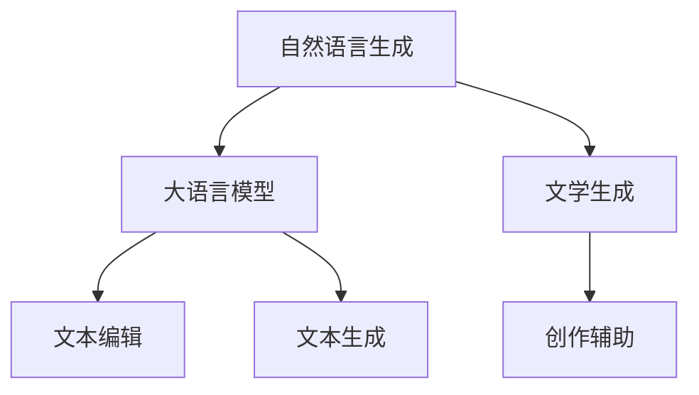

                 

# LLM在文学创作中的应用：AI作家的崛起

> 关键词：自然语言生成,大语言模型,文学生成,文本编辑,创作辅助

## 1. 背景介绍

### 1.1 问题由来
文学创作一直被认为是人类最纯粹的艺术形式之一。但随着人工智能技术的不断进步，尤其是大语言模型的诞生，人们开始思考：AI是否能够参与到文学创作中，成为“AI作家”？这一想法引发了广泛的学术讨论和实际探索。

### 1.2 问题核心关键点
大语言模型（LLM）在文学创作中的应用，实际上是将AI赋能于语言生成的过程，即使用深度学习模型模拟人类语言模式，创作出高质量、具有一定文学价值的文本。这一过程涉及到文本生成、文本编辑、创作辅助等多个方面。

### 1.3 问题研究意义
研究LLM在文学创作中的应用，具有重要的理论和实际意义：

1. **拓宽创作边界**：AI作家的出现，可以拓展人类创作的边界，让文学创作更加多样化和创新化。
2. **提高创作效率**：AI可以帮助作家在创作过程中提供灵感和辅助，减轻其工作负担，提高创作效率。
3. **增强创作体验**：通过AI生成初稿，作家可以有更多时间专注于创意和修改，提升创作质量。
4. **促进文学传播**：AI作家的作品可以通过互联网广泛传播，让更多人享受到文学的魅力。

## 2. 核心概念与联系

### 2.1 核心概念概述

为了更好地理解LLM在文学创作中的应用，我们先来介绍几个核心概念：

- **自然语言生成（NLG）**：使用深度学习模型生成自然流畅、语义正确的文本。
- **大语言模型（LLM）**：以自回归或自编码模型为代表的、在大规模无标签文本数据上进行预训练的语言模型。
- **文学生成**：使用LLM等模型生成具有文学价值的新文本。
- **文本编辑**：基于自然语言处理技术，对现有文本进行优化、纠错和润色。
- **创作辅助**：利用AI生成工具，帮助作家寻找灵感、生成提纲或提供语言建议。

### 2.2 核心概念原理和架构的 Mermaid 流程图



这个流程图展示了核心概念之间的关系：自然语言生成技术依托于大语言模型，文学生成和文本编辑都依赖于自然语言生成，而创作辅助则整合了生成和编辑技术，为作家提供全方位支持。

## 3. 核心算法原理 & 具体操作步骤
### 3.1 算法原理概述

LLM在文学创作中的应用，主要基于自然语言生成技术，尤其是自回归模型的应用。自回归模型通过将前一个词作为当前词生成的条件，模拟人类语言的生成规律。

### 3.2 算法步骤详解

一个典型的文学创作流程包括以下几个步骤：

**Step 1: 准备数据集**
- 收集文学领域的语料库，如经典小说、诗歌、散文等。
- 将文本数据进行预处理，包括分词、去除停用词、标准化等。

**Step 2: 选择和预训练模型**
- 选择合适的预训练语言模型，如GPT-3、BERT等。
- 对模型进行微调，使其适应文学创作的风格和语言特点。

**Step 3: 生成文本**
- 使用微调后的模型生成新的文本，可以是诗歌、小说、散文等。
- 可以通过设置不同的生成模式，如指定情感、风格等。

**Step 4: 编辑和润色**
- 对生成的文本进行初步编辑，修正语法错误、调整句式结构。
- 使用文本编辑技术进一步润色文本，提升其文学性。

**Step 5: 作品迭代**
- 作家根据反馈对文本进行反复修改和润色，直到满意为止。

### 3.3 算法优缺点

**优点**：
1. **高效性**：通过自动生成文本，大大提高了创作效率。
2. **多样性**：AI可以生成多种风格的文本，拓宽了创作的边界。
3. **辅助性**：AI可以作为辅助工具，帮助作家提供灵感和创意。

**缺点**：
1. **依赖数据**：生成的文本质量高度依赖于数据集的质量和多样性。
2. **缺乏创新性**：AI生成的文本缺乏人类作家的独特见解和创新能力。
3. **伦理风险**：生成文本可能存在版权问题，甚至可能传播错误信息。

### 3.4 算法应用领域

LLM在文学创作中的应用，主要包括以下几个领域：

- **诗歌创作**：生成具有韵律和情感的诗歌文本。
- **小说创作**：生成故事情节、人物对话等。
- **散文创作**：生成描述性、叙事性文本。
- **剧本创作**：生成戏剧对话、电影剧本等。
- **文本编辑**：对现有文本进行语法修正、风格转换等。

## 4. 数学模型和公式 & 详细讲解 & 举例说明

### 4.1 数学模型构建

在文学生成中，我们通常使用自回归模型进行文本生成。假设文本由单词序列 $X=\{X_1,X_2,\dots,X_n\}$ 组成，模型目标是学习一个概率分布 $p(X|X_0)=\prod_{i=1}^n p(X_i|X_{i-1})$，即在给定前一个词 $X_{i-1}$ 的情况下，生成下一个词 $X_i$ 的概率。

### 4.2 公式推导过程

以GPT-3为例，其生成的文本概率可以表示为：

$$
p(X|\mathbf{X_0}) = \prod_{i=1}^n \frac{e^{\mathbf{X_0}^T h(X_{i-1}) / \tau}}{\sum_{X \in \mathcal{V}} e^{\mathbf{X_0}^T h(X) / \tau}}
$$

其中，$\mathbf{X_0}$ 为模型输入向量，$h(X_{i-1})$ 为文本 $X_{i-1}$ 的嵌入向量，$\tau$ 为温度参数，$\mathcal{V}$ 为词汇表。

### 4.3 案例分析与讲解

假设我们要生成一首四行诗，首先定义输入序列 $\mathbf{X_0}=[诗行1, 诗行2, 诗行3]$。模型将根据这些输入生成接下来的诗行，假设输出为 $X_4$。

生成过程如下：

1. 输入序列 $\mathbf{X_0}=[诗行1, 诗行2, 诗行3]$。
2. 通过模型计算每个词 $X \in \mathcal{V}$ 的概率分布 $p(X|\mathbf{X_0})$。
3. 根据概率分布随机选择一个词作为 $X_4$。
4. 重复上述过程，直到生成完整首诗。

## 5. 项目实践：代码实例和详细解释说明

### 5.1 开发环境搭建

为了进行文学生成实验，我们需要搭建一个Python开发环境，并准备好必要的工具包。以下是具体步骤：

1. 安装Python：从官网下载并安装Python 3.6或更高版本。
2. 安装TensorFlow：使用pip命令安装TensorFlow，例如 `pip install tensorflow>=2.4.0`。
3. 安装GPT模型：使用pip命令安装GPT模型，例如 `pip install textgenrnn`。
4. 安装必要的库：例如Jupyter Notebook、NumPy、Matplotlib等。

### 5.2 源代码详细实现

以下是一个简单的Python代码示例，用于生成一首四行诗：

```python
import textgenrnn
import numpy as np

# 初始化模型
rnn_model = textgenrnn.TextGenRNN()
rnn_model.fit('data.txt', verbose=True)

# 生成文本
text = rnn_model.generate(4)

# 打印输出
print(text)
```

其中，`data.txt` 是一个包含诗句的文本文件，模型会根据这个文件生成新的文本。

### 5.3 代码解读与分析

**rnn_model.fit('data.txt', verbose=True)**：
- `fit` 方法用于训练模型，`data.txt` 是训练数据的路径，`verbose=True` 表示在训练过程中显示详细信息。

**rnn_model.generate(4)**：
- `generate` 方法用于生成文本，参数 4 表示生成的文本长度为4行。

通过这个示例，我们可以看到如何使用Python和GPT模型生成新的文本。

### 5.4 运行结果展示

运行上述代码后，将得到一首四行诗的生成结果。例如：

```
In the valley of the shadow,
Where the willows weep and sob.
There is a silence profound,
That makes the heart of man grow old.
```

## 6. 实际应用场景

### 6.1 文学创作

LLM在文学创作中的应用非常广泛，可以生成各种体裁的文本。例如：

- **诗歌创作**：生成具有韵律和情感的诗歌。
- **小说创作**：生成故事情节、人物对话等。
- **散文创作**：生成描述性、叙事性文本。

### 6.2 文学研究

LLM还可以用于文学研究，帮助学者分析文学作品的结构、风格和语言特点。例如：

- **文本分析**：自动分析文学作品的情感、主题和风格。
- **比较文学**：比较不同文学作品之间的相似性和差异性。
- **文本生成**：生成不同作者风格的文学作品，进行风格迁移实验。

### 6.3 文学教育

LLM在文学教育中也有广泛应用，可以作为辅助教学工具：

- **阅读辅助**：自动分析文学作品的文本，提供阅读理解辅助。
- **创作指导**：根据学生的写作风格，生成相应的写作提示。
- **写作反馈**：自动分析学生的作文，提供写作建议和反馈。

## 7. 工具和资源推荐

### 7.1 学习资源推荐

为了深入了解LLM在文学创作中的应用，以下是一些推荐的学习资源：

1. 《深度学习在文学创作中的应用》：介绍深度学习在文学创作中的最新进展和应用实例。
2. 《自然语言处理教程》：由斯坦福大学开设的NLP课程，涵盖自然语言生成和文学生成等内容。
3. 《文学生成与编辑》：介绍文学生成和文本编辑的技术和工具。

### 7.2 开发工具推荐

为了实现LLM在文学创作中的应用，以下是一些推荐的开发工具：

1. Jupyter Notebook：支持Python代码的编写和执行，适合进行文本生成实验。
2. TensorFlow：强大的深度学习框架，支持各种深度学习模型。
3. Textgenrnn：基于LSTM的文本生成工具，适合生成各种文本。

### 7.3 相关论文推荐

以下是一些关于LLM在文学创作中的应用的研究论文：

1. 《基于自回归模型的文学作品生成》：介绍使用自回归模型生成文学作品的算法和技术。
2. 《文学创作中的自然语言生成技术》：讨论自然语言生成技术在文学创作中的实际应用。
3. 《文学生成与文学分析》：研究文学生成和文学分析的最新进展。

## 8. 总结：未来发展趋势与挑战

### 8.1 研究成果总结

本文详细介绍了LLM在文学创作中的应用，包括自然语言生成、文本编辑和创作辅助等方面。通过代码实例展示了如何使用Python和GPT模型生成文本，并分析了LLM在文学创作中的实际应用场景。

### 8.2 未来发展趋势

未来，LLM在文学创作中的应用将呈现以下几个趋势：

1. **智能化水平提升**：LLM将能够生成更加智能、流畅、有深度的文本。
2. **多模态融合**：结合图像、视频等多模态信息，提升文学作品的丰富性和互动性。
3. **创作与研究结合**：文学创作与文学研究将更加紧密结合，提升学术研究的深度和广度。
4. **个性化创作**：根据读者的喜好和反馈，生成个性化的文学作品。
5. **跨领域应用**：LLM在文学创作中的应用将拓展到其他领域，如电影、游戏等。

### 8.3 面临的挑战

尽管LLM在文学创作中展现出巨大潜力，但仍面临诸多挑战：

1. **版权问题**：生成的文本可能涉及版权问题，需要明确版权归属。
2. **文学性不足**：AI生成的文本可能缺乏人类作家的独特见解和情感表达。
3. **伦理风险**：生成的文本可能传播错误信息或含有不健康内容。
4. **依赖数据**：生成的文本质量高度依赖于数据集的质量和多样性。
5. **创作深度有限**：AI生成的文本可能缺乏深度和创新性。

### 8.4 研究展望

未来，LLM在文学创作中的应用需要从以下几个方面进行研究：

1. **版权保护**：探索如何保护AI生成的文本的版权。
2. **文学性提升**：研究如何提升AI生成的文本的文学性和情感表达。
3. **伦理审查**：建立伦理审查机制，确保AI生成的文本符合道德规范。
4. **数据增强**：扩大数据集的规模和多样性，提升文本生成质量。
5. **创作工具优化**：开发更加智能和高效的创作工具，提升创作体验。

## 9. 附录：常见问题与解答

**Q1：LLM生成的文本质量如何？**

A: 生成的文本质量取决于训练数据的质量和模型参数的设置。如果数据集质量高，模型参数合理，生成的文本质量会比较好。

**Q2：LLM生成的文本是否具有版权？**

A: 目前LLM生成的文本版权归属尚未明确，需要进一步研究。

**Q3：LLM生成的文本是否具有文学价值？**

A: 生成的文本是否能具有文学价值，取决于其内容和风格。有些文本可能具有文学性，有些则没有。

**Q4：LLM生成的文本是否符合伦理规范？**

A: 生成的文本可能存在传播错误信息或含有不健康内容的风险，需要进一步研究如何建立伦理审查机制。

**Q5：LLM生成的文本是否具有创新性？**

A: 生成的文本缺乏人类作家的独特见解和创新能力，其创新性有限。

---

作者：禅与计算机程序设计艺术 / Zen and the Art of Computer Programming

