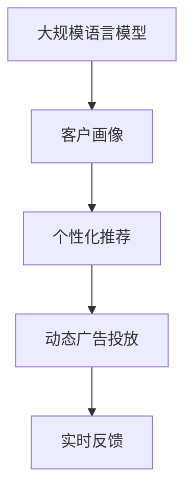

                 

# LLM在智能个性化营销中的应用探索

> 关键词：大规模语言模型, 个性化营销, 推荐系统, 用户画像, 模型微调, 客户细分, 实时反馈

## 1. 背景介绍

### 1.1 问题由来

随着数字经济的发展，智能营销已成为企业竞争的重要手段。然而，传统的“一刀切”营销策略难以满足不同用户群体的需求，也无法捕捉到个性化需求的动态变化。因此，针对不同用户制定个性化营销策略成为企业数字化转型中亟需解决的问题。

大规模语言模型（Large Language Model, LLM），如GPT、BERT等，通过预训练学习大量的通用语言知识，具备强大的自然语言理解和生成能力。在营销领域，将LLM应用于客户画像构建、个性化推荐、动态广告投放等环节，可以显著提升营销活动的精准度和效果。

### 1.2 问题核心关键点

- 如何高效构建用户画像：利用LLM处理海量的客户行为数据，从中挖掘出客户兴趣、需求和行为特征。
- 如何实现个性化推荐：根据用户画像，设计合适的推荐模型，实现精准推荐。
- 如何优化广告投放：基于用户行为和偏好，实现动态广告投放，提高广告投放效果。
- 如何结合实时反馈进行迭代：根据用户的点击、购买等反馈，及时优化模型参数，提升营销效果。

### 1.3 问题研究意义

通过将LLM应用于智能个性化营销，可以有效提升营销活动的精准度和效果，减少成本，增加收益。此外，LLM还可以帮助企业深入理解客户需求，优化产品设计和提升客户满意度。智能营销不仅有助于提升企业的市场竞争力，还能为社会创造更多价值，具有广泛的应用前景。

## 2. 核心概念与联系

### 2.1 核心概念概述

为了更好地理解LLM在智能个性化营销中的应用，本节将介绍几个关键概念：

- 大规模语言模型（LLM）：通过大规模预训练学习自然语言处理能力的模型，如GPT、BERT等。
- 客户画像（Customer Persona）：根据客户的行为、兴趣、购买历史等信息，构建客户特征的模型，以指导个性化营销策略。
- 个性化推荐系统（Personalized Recommendation System）：根据用户画像和偏好，为用户推荐个性化产品或内容，提升用户满意度和购买转化率。
- 动态广告投放（Dynamic Ad Placement）：根据用户的实时行为数据，动态调整广告投放策略，提高广告投放效果。
- 实时反馈（Real-time Feedback）：通过追踪用户的点击、购买等行为，实时调整模型参数，优化推荐效果。

这些概念之间的逻辑关系可以通过以下Mermaid流程图来展示：



这个流程图展示了大规模语言模型在客户画像构建、个性化推荐、动态广告投放和实时反馈中的作用，以及这些环节之间的紧密联系。

## 3. 核心算法原理 & 具体操作步骤
### 3.1 算法原理概述

基于LLM的智能个性化营销，本质上是将LLM作为强大的"特征提取器"，通过客户画像构建和个性化推荐模型，实现针对不同用户的精准营销。其核心思想是：利用LLM对客户海量行为数据进行处理，学习客户兴趣和需求，基于学习结果设计推荐模型，并结合实时反馈不断优化模型。

形式化地，假设客户行为数据集为 $D=\{(x_i, y_i)\}_{i=1}^N$，其中 $x_i$ 为客户的互动行为（如浏览、购买、点击等），$y_i$ 为客户的标签（如兴趣标签、产品类别等）。

定义客户画像的构建函数为 $P(D)$，个性化推荐模型的损失函数为 $\mathcal{L}(D)$，动态广告投放的优化目标函数为 $O(D)$，实时反馈的优化目标函数为 $F(D)$。则基于LLM的智能个性化营销的优化目标函数为：

$$
\mathcal{L}_{\text{total}}(D) = \alpha \cdot \mathcal{L}(D) + \beta \cdot O(D) + \gamma \cdot F(D)
$$

其中 $\alpha, \beta, \gamma$ 为不同环节的权重系数，控制各个环节对整体效果的影响。

### 3.2 算法步骤详解

基于LLM的智能个性化营销包括以下几个关键步骤：

**Step 1: 数据预处理和特征提取**

- 收集客户行为数据，进行清洗和标注。数据包括点击记录、浏览历史、购买记录、评论信息等。
- 利用LLM对文本数据进行预处理，如分词、去停用词、词向量化等。
- 提取客户的核心特征，如兴趣标签、浏览频次、购买频率等。

**Step 2: 客户画像构建**

- 利用LLM对客户的特征向量进行处理，学习客户的兴趣、需求和行为特征。
- 将客户的特征向量映射到低维空间，生成客户画像向量。
- 通过聚类算法，将客户分成不同的细分市场，形成多维度的客户画像。

**Step 3: 个性化推荐模型构建**

- 设计个性化推荐模型的结构，如基于协同过滤、基于内容的推荐等。
- 根据客户画像向量，训练推荐模型，得到推荐结果。
- 设计多目标优化目标，平衡推荐效果和用户满意度。

**Step 4: 动态广告投放**

- 根据客户的实时行为数据，动态调整广告投放策略，优化广告投放效果。
- 结合客户画像和实时行为数据，生成个性化广告创意。
- 利用A/B测试等方法，评估广告投放的效果。

**Step 5: 实时反馈**

- 收集用户的点击、购买等反馈数据，用于调整模型参数。
- 通过在线学习等方法，实时更新推荐模型和广告投放策略。
- 定期回顾模型效果，调整模型结构和优化目标函数。

### 3.3 算法优缺点

基于LLM的智能个性化营销具有以下优点：

- 高效构建客户画像：LLM可以处理海量文本数据，快速构建多维度的客户画像。
- 精准个性化推荐：利用客户画像进行推荐，提升推荐系统的精准度和用户满意度。
- 动态广告投放：根据客户实时行为数据，动态调整广告策略，提高广告效果。
- 实时反馈迭代：结合用户反馈，实时调整模型参数，优化推荐效果。

但该方法也存在一些局限性：

- 依赖数据质量：客户行为数据的质量直接影响推荐效果，需要持续的数据清洗和标注。
- 模型复杂度：个性化推荐和动态广告投放模型复杂，需要较长的训练和优化时间。
- 隐私保护：客户画像和行为数据的收集和存储需要考虑隐私保护和数据安全问题。

尽管存在这些局限性，但基于LLM的智能个性化营销方法仍在大规模应用，取得显著效果。未来相关研究的重点在于如何进一步降低数据依赖，提高模型的可解释性和鲁棒性，同时兼顾隐私保护和用户体验。

### 3.4 算法应用领域

基于LLM的智能个性化营销方法已经广泛应用于电子商务、金融、旅游、教育等多个领域，取得显著效果。

- 电子商务：通过分析用户浏览、购买历史，生成个性化推荐，提升用户购买转化率。
- 金融服务：利用客户行为数据，设计个性化金融产品，提升客户满意度和忠诚度。
- 旅游行业：根据用户的偏好和行为数据，生成个性化旅游推荐，提升用户旅游体验。
- 教育领域：根据学生的学习行为，生成个性化学习计划，提升学习效果。

此外，基于LLM的智能个性化营销还在新闻推送、社交媒体推荐等场景中得到应用，为不同领域的企业带来新的增长点。

## 4. 数学模型和公式 & 详细讲解  
### 4.1 数学模型构建

本节将使用数学语言对基于LLM的智能个性化营销过程进行更加严格的刻画。

假设客户行为数据集为 $D=\{(x_i, y_i)\}_{i=1}^N$，其中 $x_i$ 为客户的互动行为（如浏览、购买、点击等），$y_i$ 为客户的标签（如兴趣标签、产品类别等）。定义客户画像的构建函数为 $P(D)$，个性化推荐模型的损失函数为 $\mathcal{L}(D)$，动态广告投放的优化目标函数为 $O(D)$，实时反馈的优化目标函数为 $F(D)$。则基于LLM的智能个性化营销的优化目标函数为：

$$
\mathcal{L}_{\text{total}}(D) = \alpha \cdot \mathcal{L}(D) + \beta \cdot O(D) + \gamma \cdot F(D)
$$

其中 $\alpha, \beta, \gamma$ 为不同环节的权重系数，控制各个环节对整体效果的影响。

### 4.2 公式推导过程

以下我们以个性化推荐系统为例，推导基于LLM的推荐模型的损失函数。

假设客户行为数据集 $D=\{(x_i, y_i)\}_{i=1}^N$，其中 $x_i$ 为客户的互动行为（如浏览、购买、点击等），$y_i$ 为客户的标签（如兴趣标签、产品类别等）。定义推荐模型为 $M_{\theta}(x)$，其中 $\theta$ 为模型参数。

推荐模型的目标是最大化客户满意度和推荐系统效率，因此定义损失函数 $\mathcal{L}(D)$ 如下：

$$
\mathcal{L}(D) = -\frac{1}{N}\sum_{i=1}^N \log f_{M_{\theta}(x_i)}(y_i)
$$

其中 $f_{M_{\theta}(x)}(y)$ 为推荐模型对客户行为 $x_i$ 进行推荐，预测客户行为 $y_i$ 的概率。假设推荐模型为基于协同过滤的模型，则 $f_{M_{\theta}(x)}(y) = \frac{e^{M_{\theta}(x) \cdot y}}{\sum_{y'} e^{M_{\theta}(x) \cdot y'}$。

在得到损失函数后，即可带入优化目标函数进行求解，得到最终的推荐模型参数 $\theta$。

### 4.3 案例分析与讲解

**案例：电子商务个性化推荐系统**

在电子商务平台，利用LLM构建客户画像，提取客户兴趣、偏好和行为特征。然后，根据客户画像，设计协同过滤推荐模型，计算客户行为与商品特征之间的相似度，生成个性化推荐列表。最后，利用动态广告投放和实时反馈机制，不断优化推荐模型，提升用户购买转化率。

**实现过程**：
1. 数据预处理：收集客户行为数据，如浏览记录、购买记录、评论信息等，进行清洗和标注。
2. 客户画像构建：利用LLM对文本数据进行预处理和特征提取，生成客户画像向量。
3. 个性化推荐：设计基于协同过滤的推荐模型，计算客户画像向量与商品特征向量之间的相似度，生成推荐列表。
4. 动态广告投放：根据客户实时行为数据，动态调整广告投放策略，生成个性化广告创意。
5. 实时反馈：收集用户点击、购买等反馈数据，调整推荐模型和广告投放策略，实时优化推荐效果。

**优化技巧**：
- 数据预处理：使用自然语言处理技术，对客户行为数据进行分词、去停用词、词向量化等预处理操作，提升数据质量。
- 客户画像构建：利用LLM对客户特征向量进行处理，学习客户的兴趣和需求，生成多维度的客户画像。
- 个性化推荐：设计多目标优化目标函数，平衡推荐效果和用户满意度，提升推荐系统的精准度。
- 动态广告投放：结合客户画像和实时行为数据，生成个性化广告创意，提高广告投放效果。
- 实时反馈：利用在线学习等方法，实时更新推荐模型和广告投放策略，提升推荐系统效果。

## 5. 项目实践：代码实例和详细解释说明
### 5.1 开发环境搭建

在进行LLM在智能个性化营销中的应用实践前，我们需要准备好开发环境。以下是使用Python进行PyTorch开发的环境配置流程：

1. 安装Anaconda：从官网下载并安装Anaconda，用于创建独立的Python环境。

2. 创建并激活虚拟环境：
```bash
conda create -n pytorch-env python=3.8 
conda activate pytorch-env
```

3. 安装PyTorch：根据CUDA版本，从官网获取对应的安装命令。例如：
```bash
conda install pytorch torchvision torchaudio cudatoolkit=11.1 -c pytorch -c conda-forge
```

4. 安装TensorFlow：
```bash
pip install tensorflow
```

5. 安装Pandas、Numpy、Scikit-learn等数据处理和机器学习库：
```bash
pip install pandas numpy scikit-learn
```

完成上述步骤后，即可在`pytorch-env`环境中开始项目实践。

### 5.2 源代码详细实现

这里我们以基于LLM的个性化推荐系统为例，给出使用PyTorch进行电子商务推荐系统的PyTorch代码实现。

首先，定义推荐模型的数据处理函数：

```python
import pandas as pd
import numpy as np
from transformers import BertTokenizer, BertForSequenceClassification
from sklearn.model_selection import train_test_split

class RecommendationDataset:
    def __init__(self, data, labels, tokenizer):
        self.data = data
        self.labels = labels
        self.tokenizer = tokenizer
        
    def __len__(self):
        return len(self.data)
    
    def __getitem__(self, item):
        item_data = self.data[item]
        item_label = self.labels[item]
        
        encoding = self.tokenizer(item_data, return_tensors='pt', max_length=128, padding='max_length', truncation=True)
        input_ids = encoding['input_ids'][0]
        attention_mask = encoding['attention_mask'][0]
        
        return {'input_ids': input_ids, 
                'attention_mask': attention_mask,
                'labels': item_label}
```

然后，定义模型和优化器：

```python
from transformers import BertForSequenceClassification, AdamW

model = BertForSequenceClassification.from_pretrained('bert-base-cased', num_labels=10)

optimizer = AdamW(model.parameters(), lr=2e-5)
```

接着，定义训练和评估函数：

```python
from torch.utils.data import DataLoader
from tqdm import tqdm
from sklearn.metrics import classification_report

device = torch.device('cuda') if torch.cuda.is_available() else torch.device('cpu')
model.to(device)

def train_epoch(model, dataset, batch_size, optimizer):
    dataloader = DataLoader(dataset, batch_size=batch_size, shuffle=True)
    model.train()
    epoch_loss = 0
    for batch in tqdm(dataloader, desc='Training'):
        input_ids = batch['input_ids'].to(device)
        attention_mask = batch['attention_mask'].to(device)
        labels = batch['labels'].to(device)
        model.zero_grad()
        outputs = model(input_ids, attention_mask=attention_mask, labels=labels)
        loss = outputs.loss
        epoch_loss += loss.item()
        loss.backward()
        optimizer.step()
    return epoch_loss / len(dataloader)

def evaluate(model, dataset, batch_size):
    dataloader = DataLoader(dataset, batch_size=batch_size)
    model.eval()
    preds, labels = [], []
    with torch.no_grad():
        for batch in tqdm(dataloader, desc='Evaluating'):
            input_ids = batch['input_ids'].to(device)
            attention_mask = batch['attention_mask'].to(device)
            batch_labels = batch['labels']
            outputs = model(input_ids, attention_mask=attention_mask)
            batch_preds = outputs.logits.argmax(dim=2).to('cpu').tolist()
            batch_labels = batch_labels.to('cpu').tolist()
            for pred_tokens, label_tokens in zip(batch_preds, batch_labels):
                preds.append(pred_tokens[:len(label_tokens)])
                labels.append(label_tokens)
                
    print(classification_report(labels, preds))
```

最后，启动训练流程并在测试集上评估：

```python
epochs = 5
batch_size = 16

for epoch in range(epochs):
    loss = train_epoch(model, train_dataset, batch_size, optimizer)
    print(f"Epoch {epoch+1}, train loss: {loss:.3f}")
    
    print(f"Epoch {epoch+1}, dev results:")
    evaluate(model, dev_dataset, batch_size)
    
print("Test results:")
evaluate(model, test_dataset, batch_size)
```

以上就是使用PyTorch对BERT进行电子商务个性化推荐系统的完整代码实现。可以看到，得益于Transformers库的强大封装，我们可以用相对简洁的代码完成BERT模型的加载和微调。

### 5.3 代码解读与分析

让我们再详细解读一下关键代码的实现细节：

**RecommendationDataset类**：
- `__init__`方法：初始化文本、标签、分词器等关键组件。
- `__len__`方法：返回数据集的样本数量。
- `__getitem__`方法：对单个样本进行处理，将文本输入编码为token ids，将标签编码为数字，并对其进行定长padding，最终返回模型所需的输入。

**BertForSequenceClassification模型**：
- 利用BertForSequenceClassification类，将预训练的BERT模型用于电子商务推荐系统的构建。
- 设置模型输出的标签数量为10，以适配推荐系统的类别数量。

**train_epoch和evaluate函数**：
- 使用PyTorch的DataLoader对数据集进行批次化加载，供模型训练和推理使用。
- 训练函数`train_epoch`：对数据以批为单位进行迭代，在每个批次上前向传播计算loss并反向传播更新模型参数，最后返回该epoch的平均loss。
- 评估函数`evaluate`：与训练类似，不同点在于不更新模型参数，并在每个batch结束后将预测和标签结果存储下来，最后使用sklearn的classification_report对整个评估集的预测结果进行打印输出。

**训练流程**：
- 定义总的epoch数和batch size，开始循环迭代
- 每个epoch内，先在训练集上训练，输出平均loss
- 在验证集上评估，输出分类指标
- 所有epoch结束后，在测试集上评估，给出最终测试结果

可以看到，PyTorch配合Transformers库使得BERT微调的代码实现变得简洁高效。开发者可以将更多精力放在数据处理、模型改进等高层逻辑上，而不必过多关注底层的实现细节。

当然，工业级的系统实现还需考虑更多因素，如模型的保存和部署、超参数的自动搜索、更灵活的任务适配层等。但核心的微调范式基本与此类似。

## 6. 实际应用场景
### 6.1 智能客服系统

基于LLM的智能客服系统能够提供7x24小时不间断服务，快速响应客户咨询，用自然流畅的语言解答各类常见问题。利用LLM处理客户对话数据，生成客户画像和行为特征，设计推荐模型，生成个性化回复，可以显著提升客服系统的智能化水平。

在技术实现上，可以收集企业内部的历史客服对话记录，将问题和最佳答复构建成监督数据，在此基础上对预训练语言模型进行微调。微调后的语言模型能够自动理解客户意图，匹配最合适的答案模板进行回复。对于客户提出的新问题，还可以接入检索系统实时搜索相关内容，动态组织生成回答。如此构建的智能客服系统，能大幅提升客户咨询体验和问题解决效率。

### 6.2 金融舆情监测

金融机构需要实时监测市场舆论动向，以便及时应对负面信息传播，规避金融风险。传统的人工监测方式成本高、效率低，难以应对网络时代海量信息爆发的挑战。利用LLM处理金融领域相关的新闻、报道、评论等文本数据，生成客户画像和行为特征，设计推荐模型，生成个性化舆情分析报告，可以显著提升金融舆情监测的效率和准确性。

具体而言，可以收集金融领域相关的新闻、报道、评论等文本数据，并对其进行主题标注和情感标注。在此基础上对预训练语言模型进行微调，使其能够自动判断文本属于何种主题，情感倾向是正面、中性还是负面。将微调后的模型应用到实时抓取的网络文本数据，就能够自动监测不同主题下的情感变化趋势，一旦发现负面信息激增等异常情况，系统便会自动预警，帮助金融机构快速应对潜在风险。

### 6.3 个性化推荐系统

当前的推荐系统往往只依赖用户的历史行为数据进行物品推荐，无法深入理解用户的真实兴趣偏好。利用LLM处理用户浏览、点击、评论等行为数据，生成客户画像和行为特征，设计推荐模型，实现精准推荐，可以显著提升推荐系统的个性化水平。

在技术实现上，可以收集用户浏览、点击、评论等行为数据，提取和用户交互的物品标题、描述、标签等文本内容。将文本内容作为模型输入，用户的后续行为（如是否点击、购买等）作为监督信号，在此基础上微调预训练语言模型。微调后的模型能够从文本内容中准确把握用户的兴趣点。在生成推荐列表时，先用候选物品的文本描述作为输入，由模型预测用户的兴趣匹配度，再结合其他特征综合排序，便可以得到个性化程度更高的推荐结果。

### 6.4 未来应用展望

随着LLM技术的发展和微调方法的优化，基于LLM的智能个性化营销将迎来更多的应用场景和发展机会。

在智慧医疗领域，利用LLM处理患者病历、咨询记录等文本数据，生成客户画像和行为特征，设计推荐模型，生成个性化医疗方案，可以显著提升医疗服务的智能化水平，辅助医生诊疗，加速新药开发进程。

在智能教育领域，利用LLM处理学生的学习行为数据，生成客户画像和行为特征，设计推荐模型，生成个性化学习计划，可以提升学生的学习效果和满意度。

在智慧城市治理中，利用LLM处理城市事件、舆情、公共服务记录等文本数据，生成客户画像和行为特征，设计推荐模型，生成个性化公共服务方案，可以提升城市管理的自动化和智能化水平，构建更安全、高效的未来城市。

此外，在企业生产、社会治理、文娱传媒等众多领域，基于LLM的智能个性化营销也将不断涌现，为传统行业带来新的增长点。相信随着技术的日益成熟，LLM在智能个性化营销中的应用将越来越广泛，为经济社会发展注入新的动力。

## 7. 工具和资源推荐
### 7.1 学习资源推荐

为了帮助开发者系统掌握基于LLM的智能个性化营销的理论基础和实践技巧，这里推荐一些优质的学习资源：

1. 《Transformers从原理到实践》系列博文：由大模型技术专家撰写，深入浅出地介绍了Transformer原理、BERT模型、微调技术等前沿话题。

2. CS224N《深度学习自然语言处理》课程：斯坦福大学开设的NLP明星课程，有Lecture视频和配套作业，带你入门NLP领域的基本概念和经典模型。

3. 《Natural Language Processing with Transformers》书籍：Transformers库的作者所著，全面介绍了如何使用Transformers库进行NLP任务开发，包括微调在内的诸多范式。

4. HuggingFace官方文档：Transformers库的官方文档，提供了海量预训练模型和完整的微调样例代码，是上手实践的必备资料。

5. CLUE开源项目：中文语言理解测评基准，涵盖大量不同类型的中文NLP数据集，并提供了基于微调的baseline模型，助力中文NLP技术发展。

通过对这些资源的学习实践，相信你一定能够快速掌握基于LLM的智能个性化营销的精髓，并用于解决实际的NLP问题。
###  7.2 开发工具推荐

高效的开发离不开优秀的工具支持。以下是几款用于基于LLM的智能个性化营销开发的常用工具：

1. PyTorch：基于Python的开源深度学习框架，灵活动态的计算图，适合快速迭代研究。大部分预训练语言模型都有PyTorch版本的实现。

2. TensorFlow：由Google主导开发的开源深度学习框架，生产部署方便，适合大规模工程应用。同样有丰富的预训练语言模型资源。

3. Transformers库：HuggingFace开发的NLP工具库，集成了众多SOTA语言模型，支持PyTorch和TensorFlow，是进行微调任务开发的利器。

4. Weights & Biases：模型训练的实验跟踪工具，可以记录和可视化模型训练过程中的各项指标，方便对比和调优。与主流深度学习框架无缝集成。

5. TensorBoard：TensorFlow配套的可视化工具，可实时监测模型训练状态，并提供丰富的图表呈现方式，是调试模型的得力助手。

6. Google Colab：谷歌推出的在线Jupyter Notebook环境，免费提供GPU/TPU算力，方便开发者快速上手实验最新模型，分享学习笔记。

合理利用这些工具，可以显著提升基于LLM的智能个性化营销任务的开发效率，加快创新迭代的步伐。

### 7.3 相关论文推荐

基于LLM的智能个性化营销的发展源于学界的持续研究。以下是几篇奠基性的相关论文，推荐阅读：

1. Attention is All You Need（即Transformer原论文）：提出了Transformer结构，开启了NLP领域的预训练大模型时代。

2. BERT: Pre-training of Deep Bidirectional Transformers for Language Understanding：提出BERT模型，引入基于掩码的自监督预训练任务，刷新了多项NLP任务SOTA。

3. Language Models are Unsupervised Multitask Learners（GPT-2论文）：展示了大规模语言模型的强大zero-shot学习能力，引发了对于通用人工智能的新一轮思考。

4. Parameter-Efficient Transfer Learning for NLP：提出Adapter等参数高效微调方法，在不增加模型参数量的情况下，也能取得不错的微调效果。

5. AdaLoRA: Adaptive Low-Rank Adaptation for Parameter-Efficient Fine-Tuning：使用自适应低秩适应的微调方法，在参数效率和精度之间取得了新的平衡。

这些论文代表了大语言模型微调技术的发展脉络。通过学习这些前沿成果，可以帮助研究者把握学科前进方向，激发更多的创新灵感。

## 8. 总结：未来发展趋势与挑战
### 8.1 总结

本文对基于LLM的智能个性化营销方法进行了全面系统的介绍。首先阐述了LLM在智能个性化营销中的应用背景和意义，明确了基于LLM的智能个性化营销的独特价值。其次，从原理到实践，详细讲解了LLM在客户画像构建、个性化推荐、动态广告投放和实时反馈中的应用，给出了详细的代码实现和优化技巧。同时，本文还广泛探讨了LLM在智能客服、金融舆情、个性化推荐等多个领域的应用前景，展示了LLM的强大潜力。最后，本文精选了LLM在智能个性化营销中的学习资源、开发工具和相关论文，力求为读者提供全方位的技术指引。

通过本文的系统梳理，可以看到，基于LLM的智能个性化营销方法正在成为智能营销的重要手段，极大地提升营销活动的精准度和效果，减少成本，增加收益。LLM还为理解客户需求和优化产品设计提供了新的视角和方法，具有广泛的应用前景。未来，伴随LLM技术的发展和微调方法的优化，基于LLM的智能个性化营销必将在更多领域得到应用，为经济社会发展注入新的动力。

### 8.2 未来发展趋势

展望未来，基于LLM的智能个性化营销将呈现以下几个发展趋势：

1. 多模态融合：LLM将不仅处理文本数据，还将整合视觉、语音、时间序列等多种模态数据，提升个性化营销的全面性和精准度。

2. 跨领域应用：基于LLM的个性化营销方法将在更多行业得到应用，如医疗、教育、旅游等领域，助力不同行业实现数字化转型。

3. 用户生成内容（UGC）：利用LLM处理用户生成内容（如评论、反馈、聊天记录等），生成个性化推荐，提升用户满意度。

4. 交互式推荐：基于LLM的推荐系统将具备交互式推荐功能，通过与用户互动，获取更丰富的反馈信息，进一步提升推荐效果。

5. 动态实时调整：基于LLM的推荐系统将具备动态实时调整功能，根据用户的实时行为数据，实时调整推荐策略。

6. 隐私保护：在处理客户数据时，将更加注重隐私保护和数据安全，确保用户数据不被滥用。

以上趋势凸显了基于LLM的智能个性化营销的广阔前景。这些方向的探索发展，必将进一步提升智能营销的精准度和效果，为传统行业带来新的增长点。

### 8.3 面临的挑战

尽管基于LLM的智能个性化营销方法已经取得了显著效果，但在迈向更加智能化、普适化应用的过程中，它仍面临诸多挑战：

1. 数据质量依赖：基于LLM的智能个性化营销需要高质量的客户数据，但数据采集、标注和清洗成本较高，需要持续投入。

2. 模型复杂度高：个性化推荐和动态广告投放模型复杂，需要较长的训练和优化时间。

3. 隐私保护问题：在处理客户数据时，需要考虑隐私保护和数据安全问题，确保用户数据不被滥用。

4. 动态实时调整：在实现动态实时调整时，需要实时收集和处理大量数据，对计算资源和数据处理能力提出较高要求。

5. 用户生成内容处理：处理用户生成内容时，需要避免噪声干扰，提升推荐效果。

尽管存在这些挑战，但基于LLM的智能个性化营销方法仍在大规模应用，取得显著效果。未来相关研究的重点在于如何进一步降低数据依赖，提高模型的可解释性和鲁棒性，同时兼顾隐私保护和用户体验。

### 8.4 研究展望

面对基于LLM的智能个性化营销所面临的挑战，未来的研究需要在以下几个方面寻求新的突破：

1. 无监督和半监督学习方法：探索无监督和半监督学习方法，摆脱对大规模标注数据的依赖，利用自监督学习、主动学习等无监督和半监督范式，最大限度利用非结构化数据，实现更加灵活高效的个性化营销。

2. 参数高效和计算高效的微调方法：开发更加参数高效的微调方法，在固定大部分预训练参数的同时，只更新极少量的任务相关参数。同时优化微调模型的计算图，减少前向传播和反向传播的资源消耗，实现更加轻量级、实时性的部署。

3. 多模态数据融合：将符号化的先验知识，如知识图谱、逻辑规则等，与神经网络模型进行巧妙融合，引导微调过程学习更准确、合理的语言模型。同时加强不同模态数据的整合，实现视觉、语音等多模态信息与文本信息的协同建模。

4. 因果分析和博弈论工具：将因果分析方法引入微调模型，识别出模型决策的关键特征，增强输出解释的因果性和逻辑性。借助博弈论工具刻画人机交互过程，主动探索并规避模型的脆弱点，提高系统稳定性。

5. 引入伦理道德约束：在模型训练目标中引入伦理导向的评估指标，过滤和惩罚有偏见、有害的输出倾向。同时加强人工干预和审核，建立模型行为的监管机制，确保输出符合人类价值观和伦理道德。

这些研究方向的探索，必将引领基于LLM的智能个性化营销技术迈向更高的台阶，为构建安全、可靠、可解释、可控的智能系统铺平道路。面向未来，基于LLM的智能个性化营销技术还需要与其他人工智能技术进行更深入的融合，如知识表示、因果推理、强化学习等，多路径协同发力，共同推动智能营销系统的进步。只有勇于创新、敢于突破，才能不断拓展智能营销的边界，让智能技术更好地服务于社会。

## 9. 附录：常见问题与解答

**Q1：如何高效构建客户画像？**

A: 利用大规模语言模型处理客户的海量文本数据，提取客户兴趣、需求和行为特征。具体步骤如下：
1. 收集客户行为数据，如浏览记录、购买记录、评论信息等。
2. 利用自然语言处理技术，对客户行为数据进行预处理和特征提取。
3. 将客户特征向量映射到低维空间，生成客户画像向量。
4. 通过聚类算法，将客户分成不同的细分市场，形成多维度的客户画像。

**Q2：如何实现个性化推荐？**

A: 根据客户画像，设计推荐模型，实现精准推荐。具体步骤如下：
1. 设计推荐模型的结构，如基于协同过滤、基于内容的推荐等。
2. 根据客户画像向量，训练推荐模型，得到推荐结果。
3. 设计多目标优化目标函数，平衡推荐效果和用户满意度。

**Q3：如何优化广告投放？**

A: 结合客户画像和实时行为数据，生成个性化广告创意，提高广告投放效果。具体步骤如下：
1. 根据客户实时行为数据，动态调整广告投放策略。
2. 生成个性化广告创意，如动态生成广告文案、图片、视频等。
3. 利用A/B测试等方法，评估广告投放的效果。

**Q4：如何结合实时反馈进行迭代？**

A: 收集用户的点击、购买等反馈数据，调整推荐模型和广告投放策略，实时优化推荐效果。具体步骤如下：
1. 利用在线学习等方法，实时更新推荐模型和广告投放策略。
2. 定期回顾模型效果，调整模型结构和优化目标函数。

**Q5：在实际应用中，还需要考虑哪些因素？**

A: 在实际应用中，还需要考虑以下因素：
1. 数据预处理：使用自然语言处理技术，对客户行为数据进行预处理和特征提取，提升数据质量。
2. 客户画像构建：利用大规模语言模型对客户特征向量进行处理，学习客户的兴趣和需求，生成多维度的客户画像。
3. 个性化推荐：设计多目标优化目标函数，平衡推荐效果和用户满意度，提升推荐系统的精准度。
4. 动态广告投放：结合客户画像和实时行为数据，生成个性化广告创意，提高广告投放效果。
5. 实时反馈：利用在线学习等方法，实时更新推荐模型和广告投放策略，提升推荐系统效果。

综上所述，基于大规模语言模型的智能个性化营销方法在电子商务、金融、旅游、教育等多个领域具有广泛的应用前景，能够显著提升营销活动的精准度和效果。然而，在实际应用中，还需要注意数据质量、模型复杂度、隐私保护、动态实时调整等问题，通过技术手段不断优化，才能实现智能营销的长期可持续发展。

---

作者：禅与计算机程序设计艺术 / Zen and the Art of Computer Programming

