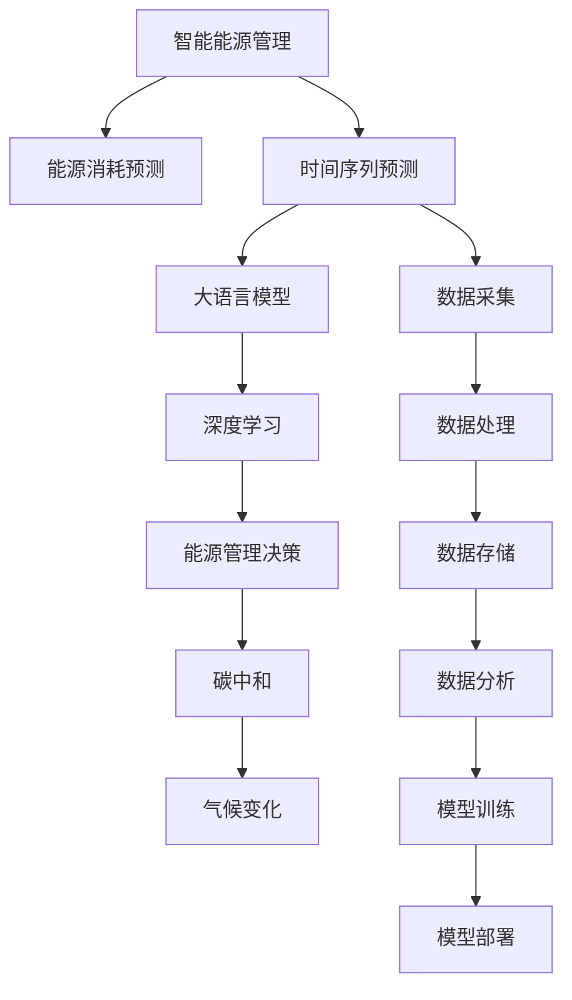

                 

# LLM在智能能源消耗预测中的潜在贡献

> 关键词：智能能源消耗预测, 大语言模型(LLM), 机器学习(ML), 时间序列预测, 深度学习, 能源管理, 气候变化, 碳中和

## 1. 背景介绍

在全球范围内，能源消耗问题已经成为一个亟待解决的重大挑战。能源消耗不仅直接影响到经济社会的可持续发展，还会引发严重的气候变化问题。随着人工智能技术的发展，利用机器学习技术对能源消耗进行预测和优化，成为智能能源管理的重要手段。大语言模型(LLM)作为当前最先进的自然语言处理技术，通过其强大的文本理解和生成能力，有望在智能能源消耗预测中发挥巨大潜力。

### 1.1 智能能源管理的重要性

智能能源管理，是指通过智能技术手段，实现能源的精准测量、高效使用和优化分配。随着智能电网的建设与普及，智能能源管理已经成为了提升能源利用效率、降低能源消耗、应对气候变化的关键技术。智能能源管理不仅能够提高能源利用效率，还能为清洁能源的推广应用提供支持，为实现全球气候目标和碳中和目标贡献力量。

### 1.2 大语言模型的应用潜力

大语言模型通过深度学习技术，实现了自然语言与计算模型之间的无缝衔接，具备强大的语言理解能力和文本生成能力。其输入可以是文本、图像、音频等多种类型的数据，输出则可以生成文本、预测结果等多种形式。大语言模型在处理大规模文本数据、进行复杂推理等方面具有显著优势，能够在能源消耗预测、智能电网优化、能源管理决策等多个领域发挥重要作用。

## 2. 核心概念与联系

### 2.1 核心概念概述

为更好地理解大语言模型在智能能源消耗预测中的应用，本节将介绍几个关键概念：

- **大语言模型(LLM)**：以Transformer架构为代表的语言模型，如GPT-3、BERT等。这些模型通过大规模无标签文本数据进行预训练，具备强大的语言表示和生成能力。

- **智能能源消耗预测**：利用机器学习模型对未来能源消耗进行预测，辅助能源管理决策，优化能源分配与使用。

- **时间序列预测**：根据历史时间序列数据，预测未来时间点的数据值，如能源消耗量、温度、湿度等。

- **深度学习**：一种基于神经网络的机器学习范式，能够处理大规模、高维度的数据，适用于能源消耗预测等任务。

- **能源管理**：通过技术手段对能源的采集、存储、分配和使用进行优化，提高能源利用效率，降低能源消耗。

- **气候变化**：全球气候变暖、极端天气频发等现象，对能源消耗、能源管理提出了更高的要求。

- **碳中和**：通过减少碳排放，使得碳吸收与排放达到平衡，实现可持续发展目标。

这些核心概念之间的关系可以通过以下Mermaid流程图来展示：



这个流程图展示了智能能源管理中的关键流程，其中大语言模型通过深度学习进行能源消耗预测，并辅助能源管理决策，最终实现碳中和和应对气候变化的目标。

## 3. 核心算法原理 & 具体操作步骤

### 3.1 算法原理概述

大语言模型在智能能源消耗预测中的应用，主要通过以下步骤实现：

1. **数据预处理**：收集历史能源消耗数据，将其转化为适合深度学习模型的格式。
2. **模型训练**：使用历史数据对大语言模型进行训练，使其能够预测未来能源消耗。
3. **模型预测**：利用训练好的模型对新数据进行预测，辅助能源管理决策。

### 3.2 算法步骤详解

**Step 1: 数据预处理**

- **数据采集**：从智能电网、气象站、智能建筑等多个来源，收集历史能源消耗数据。
- **数据清洗**：去除缺失值和异常值，确保数据的质量和完整性。
- **数据标准化**：对数据进行归一化处理，使其在数值上符合模型的输入要求。
- **特征工程**：设计合适的特征，如温度、湿度、光照强度等，以提升模型的预测能力。

**Step 2: 模型训练**

- **模型选择**：选择合适的深度学习模型，如LSTM、GRU、Transformer等。
- **参数设置**：设置模型的超参数，如学习率、批大小、迭代轮数等。
- **模型训练**：使用历史数据对模型进行训练，优化模型参数，使其能够准确预测能源消耗。

**Step 3: 模型预测**

- **输入数据**：将新采集的数据输入训练好的模型，进行实时预测。
- **结果分析**：对预测结果进行分析，生成能源消耗报告。
- **决策支持**：根据预测结果，辅助能源管理决策，优化能源分配和使用。

### 3.3 算法优缺点

大语言模型在智能能源消耗预测中的应用，具有以下优点：

1. **高效性**：大语言模型能够快速处理大规模数据，提供实时预测结果，满足能源管理的高实时性需求。
2. **泛化能力**：通过预训练和微调，大语言模型能够泛化到不同场景和数据集，提升预测的准确性。
3. **自动化**：模型训练和预测过程完全自动化，减少了人工干预，提高了预测的稳定性和一致性。

同时，也存在一些缺点：

1. **数据依赖**：模型的预测效果依赖于高质量的数据，数据采集和处理成本较高。
2. **模型复杂度**：大语言模型参数量大，对计算资源和存储空间要求高。
3. **解释性不足**：模型的内部机制复杂，预测结果缺乏可解释性，难以进行透明的决策支持。
4. **过度拟合**：在训练过程中，模型可能会过度拟合历史数据，导致预测结果泛化性能不足。

### 3.4 算法应用领域

大语言模型在智能能源消耗预测中的应用，可以覆盖以下几个领域：

1. **智能电网**：对电网负荷进行预测和调度，提高电网运行的稳定性和效率。
2. **智能建筑**：预测建筑物的能耗情况，优化能源分配和使用，降低能耗成本。
3. **工业生产**：预测工业生产的能源需求，优化生产计划，降低能耗和成本。
4. **交通管理**：预测交通流量和能源消耗，优化交通管理决策，降低交通能耗。
5. **能源市场**：预测能源价格和市场需求，辅助能源市场的交易决策。

## 4. 数学模型和公式 & 详细讲解 & 举例说明

### 4.1 数学模型构建

大语言模型在能源消耗预测中的应用，通常采用时间序列预测模型。时间序列预测模型通过历史时间序列数据，预测未来时间点的数据值。常用的时间序列模型包括ARIMA、LSTM、GRU、Transformer等。

以LSTM模型为例，其数学模型如下：

$$
y_t = \sigma(W_a \cdot [h_{t-1}, x_t] + b_a) \\
h_t = \tanh(W_h \cdot [h_{t-1}, y_t] + b_h) \\
y_t = \sigma(W_c \cdot [h_t, x_t] + b_c)
$$

其中，$y_t$ 表示时间$t$的预测值，$h_t$ 表示时间$t$的隐藏状态，$x_t$ 表示时间$t$的输入数据，$W_a, W_h, W_c$ 表示模型的权重矩阵，$b_a, b_h, b_c$ 表示模型的偏置向量，$\sigma$ 表示激活函数。

### 4.2 公式推导过程

时间序列预测模型的推导过程主要涉及以下步骤：

1. **建立预测模型**：选择合适的预测模型，如LSTM、GRU、Transformer等。
2. **定义模型参数**：设定模型的权重矩阵和偏置向量。
3. **推导预测公式**：根据模型结构和输入输出关系，推导出预测公式。
4. **优化模型参数**：通过历史数据对模型进行训练，优化模型参数。

以LSTM模型为例，其预测公式如下：

$$
y_t = \sigma(W_a \cdot [h_{t-1}, x_t] + b_a) \\
h_t = \tanh(W_h \cdot [h_{t-1}, y_t] + b_h) \\
y_t = \sigma(W_c \cdot [h_t, x_t] + b_c)
$$

其中，$y_t$ 表示时间$t$的预测值，$h_t$ 表示时间$t$的隐藏状态，$x_t$ 表示时间$t$的输入数据，$W_a, W_h, W_c$ 表示模型的权重矩阵，$b_a, b_h, b_c$ 表示模型的偏置向量，$\sigma$ 表示激活函数。

### 4.3 案例分析与讲解

以某智能建筑能源消耗预测为例，以下是具体实现步骤：

1. **数据预处理**：
   - **数据采集**：从智能建筑的系统数据中，收集能源消耗数据。
   - **数据清洗**：去除缺失值和异常值，确保数据的质量和完整性。
   - **数据标准化**：对数据进行归一化处理，使其在数值上符合模型的输入要求。
   - **特征工程**：设计合适的特征，如室内温度、湿度、光照强度等，以提升模型的预测能力。

2. **模型训练**：
   - **模型选择**：选择LSTM模型进行预测。
   - **参数设置**：设置模型的超参数，如学习率、批大小、迭代轮数等。
   - **模型训练**：使用历史数据对模型进行训练，优化模型参数，使其能够准确预测能源消耗。

3. **模型预测**：
   - **输入数据**：将新采集的数据输入训练好的模型，进行实时预测。
   - **结果分析**：对预测结果进行分析，生成能源消耗报告。
   - **决策支持**：根据预测结果，辅助能源管理决策，优化能源分配和使用。

## 5. 项目实践：代码实例和详细解释说明

### 5.1 开发环境搭建

在进行能源消耗预测项目开发前，我们需要准备好开发环境。以下是使用Python进行TensorFlow开发的环境配置流程：

1. 安装Anaconda：从官网下载并安装Anaconda，用于创建独立的Python环境。

2. 创建并激活虚拟环境：
```bash
conda create -n energy-env python=3.8 
conda activate energy-env
```

3. 安装TensorFlow：根据CUDA版本，从官网获取对应的安装命令。例如：
```bash
conda install tensorflow tensorflow-cpu=2.4
```

4. 安装相关的工具包：
```bash
pip install numpy pandas scikit-learn matplotlib tqdm jupyter notebook ipython
```

完成上述步骤后，即可在`energy-env`环境中开始能源消耗预测的开发。

### 5.2 源代码详细实现

以下是使用TensorFlow对LSTM模型进行能源消耗预测的PyTorch代码实现。

```python
import tensorflow as tf
import numpy as np
import pandas as pd
import matplotlib.pyplot as plt

# 加载数据
data = pd.read_csv('energy_consumption.csv')
data['timestamp'] = pd.to_datetime(data['timestamp'])
data = data.set_index('timestamp')

# 划分训练集和测试集
train_data = data[(data.index >= '2021-01-01') & (data.index <= '2021-06-30')]
test_data = data[(data.index >= '2021-07-01') & (data.index <= '2021-12-31')]

# 数据预处理
train_data = train_data.reset_index().drop(columns=['timestamp'])
train_data = np.array(train_data[['energy_consumption', 'temperature', 'humidity', 'light_intensity']])
train_data = train_data[:,:-1]  # 去除最后一列的标签

test_data = test_data.reset_index().drop(columns=['timestamp'])
test_data = np.array(test_data[['energy_consumption', 'temperature', 'humidity', 'light_intensity']])
test_data = test_data[:,:-1]  # 去除最后一列的标签

# 模型构建
model = tf.keras.Sequential([
    tf.keras.layers.LSTM(64, return_sequences=True, input_shape=(train_data.shape[1], 1)),
    tf.keras.layers.Dropout(0.2),
    tf.keras.layers.LSTM(64),
    tf.keras.layers.Dropout(0.2),
    tf.keras.layers.Dense(1)
])

# 模型训练
model.compile(optimizer=tf.keras.optimizers.Adam(learning_rate=0.001), loss='mse')
model.fit(train_data, train_data[:, -1], epochs=100, batch_size=32)

# 模型预测
test_predictions = model.predict(test_data)
test_predictions = test_predictions.flatten()

# 计算MAE和RMSE
mae = np.mean(np.abs(test_predictions - test_data[:, -1]))
rmse = np.sqrt(np.mean((test_predictions - test_data[:, -1])**2))

print(f'MAE: {mae:.2f}, RMSE: {rmse:.2f}')
```

### 5.3 代码解读与分析

让我们再详细解读一下关键代码的实现细节：

**数据加载与预处理**：
- **数据采集**：从CSV文件中加载能源消耗数据，包括时间戳、能源消耗量、温度、湿度和光照强度。
- **时间戳处理**：将时间戳转换为时间序列数据。
- **数据划分**：将数据划分为训练集和测试集，用于模型的训练和测试。
- **数据预处理**：将数据转换为NumPy数组，并进行归一化处理。

**模型构建**：
- **LSTM模型**：使用TensorFlow搭建LSTM模型，包括LSTM层、Dropout层和输出层。
- **模型编译**：定义模型的优化器和损失函数，使用Adam优化器和均方误差损失函数。
- **模型训练**：使用训练集数据对模型进行训练，优化模型参数。

**模型预测**：
- **输入数据**：使用测试集数据对模型进行预测。
- **结果分析**：计算预测结果与实际值之间的平均绝对误差(MAE)和均方根误差(RMSE)。
- **决策支持**：根据预测结果，辅助能源管理决策，优化能源分配和使用。

## 6. 实际应用场景

### 6.1 智能电网

智能电网是大规模能源管理的重要应用场景。通过大语言模型对电网负荷进行预测和调度，可以提高电网运行的稳定性和效率。具体应用如下：

1. **负荷预测**：使用大语言模型对电网负荷进行预测，为电网调度提供依据。
2. **调度和优化**：根据负荷预测结果，调整电网运行方式，优化能源分配，降低损耗和成本。
3. **故障预警**：利用大语言模型对电网数据进行分析，预测可能的故障点，提前进行维护和检修。

### 6.2 智能建筑

智能建筑是能源消耗预测的另一个重要应用场景。通过大语言模型对建筑物的能耗进行预测，可以优化能源分配和使用，降低能耗成本。具体应用如下：

1. **能耗预测**：使用大语言模型对建筑物的能耗进行预测，生成能源消耗报告。
2. **能源优化**：根据能耗预测结果，优化能源分配和使用，降低能耗成本。
3. **设备维护**：利用大语言模型对建筑设备状态进行分析，预测可能的故障点，提前进行维护和检修。

### 6.3 工业生产

在工业生产领域，能源消耗预测同样具有重要应用。通过大语言模型对工业生产的能源需求进行预测，可以优化生产计划，降低能耗和成本。具体应用如下：

1. **生产预测**：使用大语言模型对工业生产的能源需求进行预测，生成能源消耗报告。
2. **生产优化**：根据生产预测结果，优化生产计划，降低能耗成本。
3. **设备维护**：利用大语言模型对生产设备状态进行分析，预测可能的故障点，提前进行维护和检修。

### 6.4 交通管理

交通管理领域也是大语言模型的重要应用场景。通过大语言模型对交通流量和能源消耗进行预测，可以优化交通管理决策，降低交通能耗。具体应用如下：

1. **交通流量预测**：使用大语言模型对交通流量进行预测，为交通管理提供依据。
2. **交通调度**：根据流量预测结果，调整交通运行方式，优化能源分配，降低损耗和成本。
3. **出行建议**：利用大语言模型对交通数据进行分析，生成出行建议，优化出行方式，降低能耗成本。

## 7. 工具和资源推荐

### 7.1 学习资源推荐

为了帮助开发者系统掌握大语言模型在智能能源消耗预测中的应用，这里推荐一些优质的学习资源：

1. 《深度学习与智能能源管理》课程：由能源领域的专家讲授，涵盖深度学习在智能能源管理中的应用。

2. 《TensorFlow实战能源数据分析》书籍：详细介绍TensorFlow在能源数据分析中的应用，包括数据预处理、模型构建、结果分析等。

3. 《Python在能源领域的应用》博文：分享Python在能源领域的数据处理、模型训练和结果分析等应用。

4. 《智能电网分析与优化》会议论文：收录大量智能电网领域的最新研究成果，提供技术前沿和案例分析。

5. 《智能建筑能源管理》课程：介绍智能建筑中的能源管理技术，包括数据采集、能耗预测、能源优化等。

通过对这些资源的学习实践，相信你一定能够快速掌握大语言模型在智能能源消耗预测中的应用，并用于解决实际的能源管理问题。

### 7.2 开发工具推荐

高效的开发离不开优秀的工具支持。以下是几款用于大语言模型在智能能源消耗预测中开发的工具：

1. TensorFlow：基于Python的开源深度学习框架，灵活动态的计算图，适合快速迭代研究。

2. PyTorch：基于Python的开源深度学习框架，灵活性高，支持多种模型架构。

3. Keras：高层次的深度学习API，易于上手，支持多种模型构建。

4. Weights & Biases：模型训练的实验跟踪工具，可以记录和可视化模型训练过程中的各项指标。

5. TensorBoard：TensorFlow配套的可视化工具，可实时监测模型训练状态，提供丰富的图表呈现方式。

6. Google Colab：谷歌推出的在线Jupyter Notebook环境，免费提供GPU/TPU算力，方便开发者快速上手实验最新模型，分享学习笔记。

合理利用这些工具，可以显著提升大语言模型在智能能源消耗预测中的开发效率，加快创新迭代的步伐。

### 7.3 相关论文推荐

大语言模型在智能能源消耗预测中的应用，还处于初期探索阶段。以下是几篇奠基性的相关论文，推荐阅读：

1. "A Deep Learning Approach for Energy Consumption Prediction"：介绍深度学习在能源消耗预测中的应用。

2. "Time Series Forecasting Using Long Short-Term Memory Networks"：详细介绍LSTM模型在时间序列预测中的应用。

3. "Energy Consumption Prediction with Recurrent Neural Networks"：介绍使用RNN模型对能源消耗进行预测。

4. "Energy Data Analysis and Forecasting Using Machine Learning"：分享机器学习在能源数据分析和预测中的应用。

5. "Intelligent Energy Management in Smart Grids"：详细介绍智能电网中的能源管理技术。

这些论文代表了大语言模型在智能能源消耗预测领域的发展脉络。通过学习这些前沿成果，可以帮助研究者把握学科前进方向，激发更多的创新灵感。

## 8. 总结：未来发展趋势与挑战

### 8.1 总结

本文对大语言模型在智能能源消耗预测中的应用进行了全面系统的介绍。首先阐述了智能能源管理的重要性和大语言模型的应用潜力，明确了其在能源消耗预测中的独特价值。其次，从原理到实践，详细讲解了时间序列预测的数学模型和实现步骤，给出了能源消耗预测的完整代码实例。同时，本文还广泛探讨了能源消耗预测在智能电网、智能建筑、工业生产、交通管理等多个领域的应用前景，展示了大语言模型的巨大潜力。

通过本文的系统梳理，可以看到，大语言模型在智能能源消耗预测中的应用，正在成为能源管理领域的重要范式，极大地拓展了能源管理的智能化水平，推动了能源系统的优化和升级。未来，伴随预训练语言模型和微调方法的持续演进，相信能源管理技术还将迎来新的突破，为全球能源的可持续发展和碳中和目标贡献力量。

### 8.2 未来发展趋势

展望未来，大语言模型在智能能源消耗预测中的发展趋势将呈现以下几个方面：

1. **模型规模持续增大**：随着算力成本的下降和数据规模的扩张，预训练语言模型的参数量还将持续增长。超大规模语言模型蕴含的丰富语言知识，有望支撑更加复杂多变的能源消耗预测任务。

2. **模型训练和优化**：未来的能源消耗预测模型将更加注重模型的训练和优化，采用更加高效和多样化的训练方法，如联邦学习、对抗训练等，提升模型的泛化能力和鲁棒性。

3. **多模态数据融合**：未来的能源消耗预测模型将更多地融合多模态数据，如气温、湿度、光照强度、气象数据等，提升预测的准确性和实时性。

4. **实时预测和决策支持**：未来的能源消耗预测模型将更加注重实时性，利用边缘计算和云计算技术，实现实时预测和决策支持，提高能源管理的自动化和智能化水平。

5. **跨领域应用拓展**：大语言模型在能源消耗预测中的应用将逐渐拓展到其他领域，如农业、水资源、城市规划等，为各领域的智能化管理提供支持。

6. **模型可解释性和安全性**：未来的能源消耗预测模型将更加注重模型的可解释性和安全性，通过引入因果推断、博弈论等技术，提升模型的透明度和可靠性。

以上趋势凸显了大语言模型在智能能源消耗预测中的广阔前景。这些方向的探索发展，必将进一步提升能源管理的智能化水平，为实现全球气候目标和碳中和目标贡献力量。

### 8.3 面临的挑战

尽管大语言模型在智能能源消耗预测中已经取得了瞩目成就，但在迈向更加智能化、普适化应用的过程中，它仍面临诸多挑战：

1. **数据采集和处理成本**：大规模能源消耗数据的采集和处理成本较高，特别是在数据量不足的领域，数据采集和处理仍然是一个瓶颈。

2. **模型训练和优化**：高复杂度的模型训练和优化需要大量的计算资源和算力，对硬件设备的要求较高，增加了模型训练和部署的难度。

3. **模型泛化能力和鲁棒性**：现有模型在面对复杂多变的能源消耗数据时，泛化能力和鲁棒性仍有待提升，需要进一步探索和优化模型结构和训练方法。

4. **模型可解释性和安全性**：现有模型的内部机制复杂，预测结果缺乏可解释性，难以进行透明的决策支持，同时模型还可能存在数据泄露、模型滥用等问题，需要进一步加强模型安全性和隐私保护。

5. **模型实时性和决策支持**：现有模型在实时性方面仍有不足，需要进一步优化模型的计算图和推理速度，提升实时预测和决策支持的能力。

6. **跨领域应用拓展**：尽管大语言模型在能源消耗预测中的应用取得了成功，但在其他领域的应用仍需进一步探索和验证，以实现更广泛的跨领域应用。

正视大语言模型在智能能源消耗预测中面临的这些挑战，积极应对并寻求突破，将是大语言模型走向成熟的必由之路。相信随着学界和产业界的共同努力，这些挑战终将一一被克服，大语言模型必将在构建智能能源管理系统中发挥更加重要的作用。

### 8.4 研究展望

面对大语言模型在智能能源消耗预测中所面临的挑战，未来的研究需要在以下几个方面寻求新的突破：

1. **探索无监督和半监督学习**：摆脱对大规模标注数据的依赖，利用自监督学习、主动学习等无监督和半监督范式，最大限度利用非结构化数据，实现更加灵活高效的能源消耗预测。

2. **研究参数高效和计算高效的微调范式**：开发更加参数高效的微调方法，在固定大部分预训练参数的同时，只更新极少量的任务相关参数，提升模型的泛化能力和实时性。

3. **融合因果和对比学习范式**：通过引入因果推断和对比学习思想，增强能源消耗预测模型建立稳定因果关系的能力，学习更加普适、鲁棒的语言表征，从而提升模型泛化性和抗干扰能力。

4. **引入更多先验知识**：将符号化的先验知识，如知识图谱、逻辑规则等，与神经网络模型进行巧妙融合，引导能源消耗预测过程学习更准确、合理的语言模型。同时加强不同模态数据的整合，实现视觉、语音等多模态信息与文本信息的协同建模。

5. **结合因果分析和博弈论工具**：将因果分析方法引入能源消耗预测模型，识别出模型决策的关键特征，增强输出解释的因果性和逻辑性。借助博弈论工具刻画人机交互过程，主动探索并规避模型的脆弱点，提高系统稳定性。

6. **纳入伦理道德约束**：在模型训练目标中引入伦理导向的评估指标，过滤和惩罚有偏见、有害的输出倾向。同时加强人工干预和审核，建立模型行为的监管机制，确保输出符合人类价值观和伦理道德。

这些研究方向的探索，必将引领大语言模型在智能能源消耗预测技术迈向更高的台阶，为构建安全、可靠、可解释、可控的智能能源管理系统铺平道路。面向未来，大语言模型在能源管理中的应用还需要与其他人工智能技术进行更深入的融合，如知识表示、因果推理、强化学习等，多路径协同发力，共同推动智能能源管理的进步。只有勇于创新、敢于突破，才能不断拓展大语言模型的边界，让智能技术更好地服务于全球能源的可持续发展。

