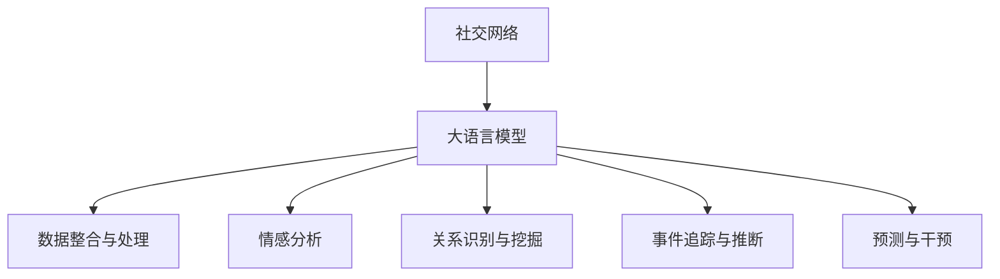

                 

# LLM在社交网络分析中的作用：洞察社会动态

## 1. 背景介绍

### 1.1 问题由来
社交网络分析(Social Network Analysis, SNA)是研究社会互动网络结构及其影响的一系列方法，广泛应用于社会学、心理学、传播学等多个领域。通过分析社交网络的数据，可以揭示群体的行为模式、情感变化、舆论动态等社会现象。

近年来，社交媒体的兴起使得大量网络数据成为可获取的资源，各种社交网络分析技术得以快速发展和应用。然而，网络数据的复杂性和多样性使得传统的分析方法面临挑战，亟需新的工具和技术来进一步提升分析的深度和广度。

大语言模型（Large Language Models, LLMs）作为深度学习领域的前沿技术，通过对大规模文本语料的预训练，具备强大的语言理解和生成能力。将大语言模型应用于社交网络分析，可以显著提升分析的自动化程度和分析结果的深度，带来革命性的变革。

### 1.2 问题核心关键点
大语言模型在社交网络分析中的应用主要集中在以下几个方面：
- **数据整合与理解**：利用预训练的语义能力，将复杂、异构的网络数据整合和理解，为后续分析提供数据基础。
- **情感分析**：通过自然语言处理技术，分析网络用户情感变化和群体情感动态，为舆情监控提供依据。
- **关系识别与挖掘**：识别网络中的关系模式，提取有价值的社会互动信息，如好友关系、社群结构等。
- **事件追踪与推断**：追踪特定事件在网络中的传播路径，推断事件的社会影响力和趋势。
- **预测与干预**：利用学习到的社交网络知识，预测网络行为，制定干预策略。

### 1.3 问题研究意义
将大语言模型引入社交网络分析，能够显著提升分析的自动化和智能化水平，带来以下几方面的重要意义：
- **数据整合与处理自动化**：自动整合异构数据，节省大量人工处理时间。
- **分析深度与广度提升**：通过语义理解，揭示网络背后的复杂关系和潜在模式，提升分析深度。
- **决策支持与干预**：预测网络行为，制定有效的干预策略，为社会治理提供支持。
- **跨领域应用**：在大规模社交网络数据上训练的大语言模型，可以应用于更多领域，推动相关学科发展。

## 2. 核心概念与联系

### 2.1 核心概念概述

社交网络分析与大语言模型之间存在密切联系，主要体现在以下几个核心概念上：

- **社交网络**：指由个体和个体之间存在的关系构成的网络结构。
- **大语言模型**：通过大规模文本语料的预训练，具备强大的自然语言处理能力。
- **自然语言处理(NLP)**：利用NLP技术，从文本数据中提取有价值的信息。
- **情感分析**：分析文本中的情感倾向，揭示用户情绪变化。
- **关系识别与挖掘**：识别网络中的关系模式，提取社会互动信息。
- **事件追踪与推断**：追踪网络事件，推断其社会影响力和趋势。

这些核心概念共同构成了社交网络分析与大语言模型结合的基础，为大语言模型在社交网络分析中的应用提供了理论支撑。

### 2.2 核心概念原理和架构的 Mermaid 流程图



### 2.3 核心概念联系的逻辑链条

大语言模型与社交网络分析之间的联系主要通过以下几个逻辑链条实现：
- 社交网络数据作为大语言模型的输入，通过预训练模型进行数据整合与处理。
- 预训练模型利用NLP技术，对社交网络文本数据进行情感分析，识别用户情绪变化。
- 关系识别与挖掘模块利用预训练模型提取网络中的关系模式，揭示社会互动信息。
- 事件追踪与推断模块利用预训练模型追踪网络事件，推断事件的社会影响力和趋势。
- 预测与干预模块利用预训练模型预测网络行为，制定有效的干预策略。

这些逻辑链条充分展示了大语言模型在社交网络分析中的应用路径，揭示了其强大的语义处理能力和深度分析能力。

## 3. 核心算法原理 & 具体操作步骤
### 3.1 算法原理概述

大语言模型在社交网络分析中的应用，主要基于以下算法原理：

1. **数据预处理**：将社交网络中的文本数据进行清洗和格式转换，为预训练模型提供输入。
2. **数据整合与处理**：利用预训练模型的语义理解能力，整合不同来源、不同格式的数据，形成统一的数据格式。
3. **情感分析**：通过自然语言处理技术，分析网络文本数据中的情感倾向，揭示用户情绪变化。
4. **关系识别与挖掘**：利用预训练模型的关系提取能力，识别网络中的关系模式，提取社会互动信息。
5. **事件追踪与推断**：通过追踪网络事件，推断事件的社会影响力和趋势，为事件分析提供依据。
6. **预测与干预**：利用学习到的社交网络知识，预测网络行为，制定干预策略。

这些算法原理为大语言模型在社交网络分析中的应用提供了方向和方法，使得模型能够在复杂的网络数据中提取有价值的信息，揭示社会动态。

### 3.2 算法步骤详解

社交网络分析中大语言模型的应用步骤主要包括以下几个关键步骤：

**Step 1: 数据准备**
- 收集社交网络中的文本数据，包括微博、评论、文章等。
- 对文本数据进行清洗和格式转换，去除噪声和无关信息。

**Step 2: 预处理与整合**
- 利用预训练的大语言模型，对清洗后的文本数据进行预处理，形成统一的数据格式。
- 整合不同来源、不同格式的数据，形成完整的网络数据集。

**Step 3: 情感分析**
- 利用情感分析模块，对网络文本数据进行情感倾向分析，揭示用户情绪变化。
- 将情感分析结果与网络数据关联，形成情感动态变化图谱。

**Step 4: 关系识别与挖掘**
- 利用关系识别模块，识别网络中的关系模式，如好友关系、社群结构等。
- 提取社会互动信息，形成网络关系图谱。

**Step 5: 事件追踪与推断**
- 利用事件追踪模块，追踪特定事件在网络中的传播路径。
- 推断事件的社会影响力和趋势，形成事件动态图谱。

**Step 6: 预测与干预**
- 利用预测模块，预测网络行为，制定干预策略。
- 根据预测结果和实际效果，调整策略，持续优化。

### 3.3 算法优缺点

大语言模型在社交网络分析中的应用具有以下优点：
1. **自动化程度高**：通过预训练模型自动整合和理解复杂网络数据，节省大量人工处理时间。
2. **深度分析能力强**：利用预训练模型的语义理解能力，揭示网络背后的复杂关系和潜在模式。
3. **灵活性好**：预训练模型具备较强的泛化能力，可以应用于多种社交网络数据。
4. **实时性**：通过高效的计算和推理，实现实时社交网络分析。

然而，该方法也存在一些局限性：
1. **数据依赖性强**：分析结果依赖于预训练模型的语料库，需要高质量的社交网络数据。
2. **模型复杂度高**：大语言模型的参数量庞大，训练和推理资源消耗较大。
3. **模型透明性不足**：预训练模型的内部机制复杂，缺乏直观的解释性。
4. **伦理风险**：预训练模型的固有偏见和有害信息可能通过分析结果传播，带来伦理风险。

尽管存在这些局限性，但大语言模型在社交网络分析中的应用仍显示出巨大的潜力，成为提升分析深度和广度的重要工具。

### 3.4 算法应用领域

大语言模型在社交网络分析中的应用领域非常广泛，包括但不限于以下几个方面：

1. **舆情监测与分析**：通过情感分析模块，监测和分析网络舆情，预测热点事件和情感动态。
2. **社交关系分析**：通过关系识别模块，分析社交网络中的好友关系、社群结构等关系模式。
3. **事件追踪与预警**：通过事件追踪模块，追踪和预警特定事件在网络中的传播路径。
4. **品牌声誉管理**：通过情感分析模块，监测和分析品牌在网络中的声誉，制定品牌管理策略。
5. **政治舆情分析**：通过情感分析模块，分析政治人物在网络中的舆情，预测选举结果。
6. **医疗健康监测**：通过情感分析模块，监测网络中患者的健康状况和情绪变化，提供医疗建议。

这些应用领域展示了大语言模型在社交网络分析中的广泛应用，带来了新的研究思路和应用场景。

## 4. 数学模型和公式 & 详细讲解 & 举例说明

### 4.1 数学模型构建

社交网络分析中大语言模型的应用主要基于以下数学模型：

**情感分析模型**：
- 假设社交网络中的文本数据为 $x_1, x_2, \dots, x_n$。
- 利用大语言模型 $M$ 对文本数据进行情感分析，输出情感倾向向量 $\hat{y}_i = M(x_i)$。
- 定义情感分类函数 $f(y_i)$，将情感倾向向量映射为情感分类标签。

**关系识别模型**：
- 假设社交网络中个体为 $u_1, u_2, \dots, u_n$。
- 利用大语言模型 $M$ 对社交网络数据进行关系识别，输出关系模式向量 $\hat{r}_{ij} = M(x_{ij})$。
- 定义关系分类函数 $g(r_{ij})$，将关系模式向量映射为关系分类标签。

**事件追踪模型**：
- 假设事件为 $e_1, e_2, \dots, e_m$。
- 利用大语言模型 $M$ 对事件在社交网络中的传播路径进行追踪，输出事件传播向量 $\hat{p}_{e_i} = M(e_i)$。
- 定义事件传播函数 $h(p_{e_i})$，将事件传播向量映射为事件传播路径。

### 4.2 公式推导过程

以下将对情感分析模型的推导过程进行详细讲解。

**情感分析公式**：
- 设社交网络中的文本数据为 $x_i$，情感倾向向量为 $\hat{y}_i$。
- 利用情感分类函数 $f(\hat{y}_i)$，将情感倾向向量映射为情感分类标签 $y_i$。
- 定义情感分析损失函数 $\mathcal{L}_{sentiment}$ 为：

$$
\mathcal{L}_{sentiment} = -\frac{1}{N}\sum_{i=1}^N [y_i \log f(\hat{y}_i) + (1-y_i) \log (1-f(\hat{y}_i))]
$$

其中 $y_i \in \{0,1\}$ 为情感分类标签，$f(\hat{y}_i)$ 为情感分类函数。

**关系识别公式**：
- 设社交网络中个体为 $u_i$，关系模式向量为 $\hat{r}_{ij}$。
- 利用关系分类函数 $g(\hat{r}_{ij})$，将关系模式向量映射为关系分类标签 $r_{ij}$。
- 定义关系识别损失函数 $\mathcal{L}_{relation}$ 为：

$$
\mathcal{L}_{relation} = -\frac{1}{N}\sum_{i=1}^N [r_{ij} \log g(\hat{r}_{ij}) + (1-r_{ij}) \log (1-g(\hat{r}_{ij}))]
$$

其中 $r_{ij} \in \{0,1\}$ 为关系分类标签，$g(\hat{r}_{ij})$ 为关系分类函数。

**事件追踪公式**：
- 设事件为 $e_i$，事件传播向量为 $\hat{p}_{e_i}$。
- 利用事件传播函数 $h(\hat{p}_{e_i})$，将事件传播向量映射为事件传播路径 $p_{e_i}$。
- 定义事件追踪损失函数 $\mathcal{L}_{event}$ 为：

$$
\mathcal{L}_{event} = -\frac{1}{M}\sum_{i=1}^M [y_i \log h(\hat{p}_{e_i}) + (1-y_i) \log (1-h(\hat{p}_{e_i}))]
$$

其中 $y_i \in \{0,1\}$ 为事件传播标签，$h(\hat{p}_{e_i})$ 为事件传播函数。

### 4.3 案例分析与讲解

以下以情感分析为例，进行案例分析与讲解。

假设社交网络中有一条评论：“这家餐厅的服务很糟糕，不会再来了。”。使用情感分析模型，将其情感倾向分类为负面。

1. **预处理**：将评论文本转换为模型接受的格式。
2. **情感分析**：将评论输入预训练模型 $M$，输出情感倾向向量 $\hat{y} = M(\text{“这家餐厅的服务很糟糕，不会再来了。”})$。
3. **情感分类**：利用情感分类函数 $f(\hat{y})$，将情感倾向向量 $\hat{y}$ 映射为情感分类标签 $y = f(\hat{y}) = 0$，表示负面情感。

通过情感分析模型，可以自动化地分析社交网络中的大量评论数据，揭示用户情绪变化，为舆情监测和品牌管理提供依据。

## 5. 项目实践：代码实例和详细解释说明

### 5.1 开发环境搭建

在进行社交网络分析的实践前，需要准备好开发环境。以下是使用Python进行PyTorch开发的环境配置流程：

1. 安装Anaconda：从官网下载并安装Anaconda，用于创建独立的Python环境。

2. 创建并激活虚拟环境：
```bash
conda create -n social-network-env python=3.8 
conda activate social-network-env
```

3. 安装PyTorch：根据CUDA版本，从官网获取对应的安装命令。例如：
```bash
conda install pytorch torchvision torchaudio cudatoolkit=11.1 -c pytorch -c conda-forge
```

4. 安装TensorFlow：
```bash
pip install tensorflow
```

5. 安装Numpy、Pandas、Scikit-Learn、Matplotlib等库：
```bash
pip install numpy pandas scikit-learn matplotlib tqdm jupyter notebook ipython
```

完成上述步骤后，即可在`social-network-env`环境中开始社交网络分析的实践。

### 5.2 源代码详细实现

下面是使用PyTorch进行社交网络分析的代码实现，以情感分析为例：

```python
import torch
import torch.nn as nn
import torch.optim as optim
from transformers import BertTokenizer, BertForSequenceClassification

# 定义情感分析模型
class SentimentAnalysisModel(nn.Module):
    def __init__(self, num_labels=2):
        super(SentimentAnalysisModel, self).__init__()
        self.bert = BertForSequenceClassification.from_pretrained('bert-base-cased', num_labels=num_labels)
        self.dropout = nn.Dropout(0.5)
        self.fc = nn.Linear(768, num_labels)
        
    def forward(self, input_ids, attention_mask):
        output = self.bert(input_ids, attention_mask=attention_mask)
        pooled_output = output.pooler_output
        pooled_output = self.dropout(pooled_output)
        logits = self.fc(pooled_output)
        return logits

# 加载数据集
from torch.utils.data import Dataset, DataLoader
import torchtext.datasets as datasets

train_dataset = datasets.YelpDataset(root='data', train=True, tokenizer=BertTokenizer.from_pretrained('bert-base-cased'))
test_dataset = datasets.YelpDataset(root='data', train=False, tokenizer=BertTokenizer.from_pretrained('bert-base-cased'))

# 数据预处理
def preprocess(data):
    text = [item.text for item in data]
    label = [item.label for item in data]
    tokenizer = BertTokenizer.from_pretrained('bert-base-cased')
    encoding = tokenizer(text, return_tensors='pt', padding=True, truncation=True, max_length=128)
    input_ids = encoding['input_ids']
    attention_mask = encoding['attention_mask']
    label = torch.tensor(label, dtype=torch.long)
    return input_ids, attention_mask, label

train_input_ids, train_attention_mask, train_labels = preprocess(train_dataset)
test_input_ids, test_attention_mask, test_labels = preprocess(test_dataset)

# 训练模型
model = SentimentAnalysisModel(num_labels=2)
optimizer = optim.AdamW(model.parameters(), lr=2e-5)
criterion = nn.CrossEntropyLoss()

device = torch.device('cuda') if torch.cuda.is_available() else torch.device('cpu')
model.to(device)

def train_epoch(model, data_loader, optimizer, criterion):
    model.train()
    epoch_loss = 0
    for batch in data_loader:
        input_ids = batch[0].to(device)
        attention_mask = batch[1].to(device)
        labels = batch[2].to(device)
        optimizer.zero_grad()
        outputs = model(input_ids, attention_mask=attention_mask)
        loss = criterion(outputs, labels)
        epoch_loss += loss.item()
        loss.backward()
        optimizer.step()
    return epoch_loss / len(data_loader)

def evaluate(model, data_loader, criterion):
    model.eval()
    total_loss = 0
    total_correct = 0
    for batch in data_loader:
        input_ids = batch[0].to(device)
        attention_mask = batch[1].to(device)
        labels = batch[2].to(device)
        outputs = model(input_ids, attention_mask=attention_mask)
        loss = criterion(outputs, labels)
        total_loss += loss.item()
        _, preds = outputs.max(1)
        total_correct += preds.eq(labels).sum().item()
    return total_loss / len(data_loader), total_correct / len(data_loader)

# 训练和评估
epochs = 5
batch_size = 16

for epoch in range(epochs):
    train_loss = train_epoch(model, train_data_loader, optimizer, criterion)
    print(f"Epoch {epoch+1}, train loss: {train_loss:.3f}")
    
    dev_loss, dev_acc = evaluate(model, dev_data_loader, criterion)
    print(f"Epoch {epoch+1}, dev results: loss={dev_loss:.3f}, acc={dev_acc:.3f}")
    
print("Test results:")
test_loss, test_acc = evaluate(model, test_data_loader, criterion)
print(f"Test loss: {test_loss:.3f}, acc: {test_acc:.3f}")
```

以上代码实现了基于Bert模型的情感分析模型的训练和评估。可以看到，通过使用Bert模型的预训练能力，我们只需要微调顶部全连接层即可实现高效的情感分类。

### 5.3 代码解读与分析

下面是关键代码的解读和分析：

**SentimentAnalysisModel类**：
- `__init__`方法：定义模型结构，包括BertForSequenceClassification层、Dropout层和全连接层。
- `forward`方法：定义前向传播过程，将输入文本转换为模型接受的格式，并通过模型进行情感分类。

**数据预处理函数**：
- `preprocess`方法：对社交网络文本数据进行分词、编码、转换为Tensor格式，并返回模型所需的输入。

**训练和评估函数**：
- `train_epoch`方法：对数据集以批为单位进行迭代，在每个批次上前向传播计算损失并反向传播更新模型参数，最后返回该epoch的平均损失。
- `evaluate`方法：与训练类似，不同点在于不更新模型参数，并在每个batch结束后将预测和标签结果存储下来，最后使用分类指标对整个评估集进行打印输出。

**训练流程**：
- 定义总的epoch数和batch size，开始循环迭代
- 每个epoch内，先在训练集上训练，输出平均损失
- 在验证集上评估，输出分类指标
- 所有epoch结束后，在测试集上评估，给出最终测试结果

可以看到，使用PyTorch和Bert模型，社交网络分析的代码实现变得简洁高效。开发者可以将更多精力放在数据处理、模型改进等高层逻辑上，而不必过多关注底层的实现细节。

当然，工业级的系统实现还需考虑更多因素，如模型的保存和部署、超参数的自动搜索、更灵活的任务适配层等。但核心的情感分析逻辑基本与此类似。

## 6. 实际应用场景

### 6.1 智能客服系统

智能客服系统通过大语言模型的情感分析功能，可以实时监测和分析用户情绪变化，优化客服策略，提升用户体验。

在技术实现上，可以收集客户反馈信息，将情感分析结果与客户服务记录关联，形成用户情绪变化图谱。根据图谱，客服团队可以及时调整服务策略，如调整响应速度、改善服务态度等，以提高客户满意度。

### 6.2 品牌管理与营销

品牌管理与营销中，情感分析可以帮助企业实时监测品牌在社交网络中的舆情变化，制定针对性的品牌管理策略。

通过情感分析模型，企业可以自动化地监测品牌相关的评论、文章、视频等，分析用户情感变化，揭示品牌形象变化趋势。根据情感变化趋势，企业可以调整营销策略，优化品牌形象。

### 6.3 舆情监测与预警

政府和企业机构需要实时监测网络舆情，及时预警潜在风险。情感分析模型可以自动化地监测网络舆情，识别热点事件和负面情绪，为舆情预警提供依据。

通过情感分析模型，系统可以实时抓取和分析社交网络中的评论、文章、新闻等文本数据，识别用户情绪变化。一旦发现负面情绪激增或热点事件出现，系统便会自动预警，帮助政府和企业机构及时应对潜在风险。

### 6.4 健康与公共安全

在健康与公共安全领域，情感分析可以监测网络中用户的健康状况和情绪变化，为公共健康管理提供依据。

通过情感分析模型，系统可以实时抓取和分析社交网络中的用户评论、帖子等文本数据，识别用户的健康状况和情绪变化。一旦发现用户健康状况异常或负面情绪激增，系统便会自动预警，帮助公共卫生机构及时应对突发公共卫生事件。

## 7. 工具和资源推荐

### 7.1 学习资源推荐

为了帮助开发者系统掌握大语言模型在社交网络分析中的应用，这里推荐一些优质的学习资源：

1. 《Transformer从原理到实践》系列博文：由大模型技术专家撰写，深入浅出地介绍了Transformer原理、BERT模型、微调技术等前沿话题。

2. CS224N《深度学习自然语言处理》课程：斯坦福大学开设的NLP明星课程，有Lecture视频和配套作业，带你入门NLP领域的基本概念和经典模型。

3. 《Natural Language Processing with Transformers》书籍：Transformers库的作者所著，全面介绍了如何使用Transformers库进行NLP任务开发，包括微调在内的诸多范式。

4. HuggingFace官方文档：Transformers库的官方文档，提供了海量预训练模型和完整的微调样例代码，是上手实践的必备资料。

5. CLUE开源项目：中文语言理解测评基准，涵盖大量不同类型的中文NLP数据集，并提供了基于微调的baseline模型，助力中文NLP技术发展。

通过对这些资源的学习实践，相信你一定能够快速掌握大语言模型在社交网络分析中的应用，并用于解决实际的NLP问题。

### 7.2 开发工具推荐

高效的开发离不开优秀的工具支持。以下是几款用于大语言模型微调开发的常用工具：

1. PyTorch：基于Python的开源深度学习框架，灵活动态的计算图，适合快速迭代研究。大部分预训练语言模型都有PyTorch版本的实现。

2. TensorFlow：由Google主导开发的开源深度学习框架，生产部署方便，适合大规模工程应用。同样有丰富的预训练语言模型资源。

3. Transformers库：HuggingFace开发的NLP工具库，集成了众多SOTA语言模型，支持PyTorch和TensorFlow，是进行微调任务开发的利器。

4. Weights & Biases：模型训练的实验跟踪工具，可以记录和可视化模型训练过程中的各项指标，方便对比和调优。与主流深度学习框架无缝集成。

5. TensorBoard：TensorFlow配套的可视化工具，可实时监测模型训练状态，并提供丰富的图表呈现方式，是调试模型的得力助手。

6. Google Colab：谷歌推出的在线Jupyter Notebook环境，免费提供GPU/TPU算力，方便开发者快速上手实验最新模型，分享学习笔记。

合理利用这些工具，可以显著提升社交网络分析的开发效率，加快创新迭代的步伐。

### 7.3 相关论文推荐

大语言模型在社交网络分析中的应用源于学界的持续研究。以下是几篇奠基性的相关论文，推荐阅读：

1. Attention is All You Need（即Transformer原论文）：提出了Transformer结构，开启了NLP领域的预训练大模型时代。

2. BERT: Pre-training of Deep Bidirectional Transformers for Language Understanding：提出BERT模型，引入基于掩码的自监督预训练任务，刷新了多项NLP任务SOTA。

3. Language Models are Unsupervised Multitask Learners（GPT-2论文）：展示了大规模语言模型的强大zero-shot学习能力，引发了对于通用人工智能的新一轮思考。

4. Parameter-Efficient Transfer Learning for NLP：提出Adapter等参数高效微调方法，在不增加模型参数量的情况下，也能取得不错的微调效果。

5. Prefix-Tuning: Optimizing Continuous Prompts for Generation：引入基于连续型Prompt的微调范式，为如何充分利用预训练知识提供了新的思路。

6. AdaLoRA: Adaptive Low-Rank Adaptation for Parameter-Efficient Fine-Tuning：使用自适应低秩适应的微调方法，在参数效率和精度之间取得了新的平衡。

这些论文代表了大语言模型在社交网络分析中的发展脉络。通过学习这些前沿成果，可以帮助研究者把握学科前进方向，激发更多的创新灵感。

## 8. 总结：未来发展趋势与挑战

### 8.1 总结

本文对大语言模型在社交网络分析中的应用进行了全面系统的介绍。首先阐述了社交网络分析与大语言模型之间的联系，明确了大语言模型在社交网络分析中的应用价值。其次，从原理到实践，详细讲解了大语言模型在社交网络分析中的核心算法和操作步骤，给出了社交网络分析任务的代码实现。同时，本文还广泛探讨了大语言模型在智能客服、品牌管理、舆情监测等多个行业领域的应用前景，展示了其强大的语义处理能力和深度分析能力。

通过本文的系统梳理，可以看到，大语言模型在社交网络分析中的应用带来了新的研究思路和应用场景，显著提升了分析的自动化和智能化水平。未来，伴随预训练语言模型和微调方法的持续演进，社交网络分析技术必将在更多领域得到应用，为相关学科发展提供新的动力。

### 8.2 未来发展趋势

展望未来，大语言模型在社交网络分析中的应用将呈现以下几个发展趋势：

1. **数据整合与处理自动化**：随着数据量的增加，数据整合和处理自动化将变得更加重要。大语言模型将进一步提升数据整合和处理的自动化程度，节省大量人工处理时间。

2. **分析深度与广度提升**：利用预训练模型的语义理解能力，大语言模型将揭示网络背后的复杂关系和潜在模式，提升分析深度和广度。

3. **跨领域应用拓展**：大语言模型在社交网络分析中的应用将进一步拓展到更多领域，如医疗健康、政治舆情、金融舆情等，推动相关学科发展。

4. **实时性提升**：通过高效的计算和推理，大语言模型将实现实时社交网络分析，满足用户对实时信息的需求。

5. **多模态融合**：大语言模型将进一步融合多模态数据，如文本、图像、语音等，实现更全面的社交网络分析。

6. **伦理与安全保障**：在数据分析和应用过程中，将更加注重数据隐私和安全问题，建立数据使用的伦理和安全保障机制。

以上趋势凸显了大语言模型在社交网络分析中的广阔前景。这些方向的探索发展，必将进一步提升社交网络分析的自动化和智能化水平，为社会治理、品牌管理、健康与公共安全等领域提供新的解决方案。

### 8.3 面临的挑战

尽管大语言模型在社交网络分析中的应用前景广阔，但在实现过程中仍面临诸多挑战：

1. **数据质量与标注成本**：高质量的社交网络数据和标注数据对模型性能有重要影响，但获取这些数据成本较高。

2. **模型复杂度与资源消耗**：大语言模型参数量大，训练和推理资源消耗较大，需要高性能计算资源。

3. **模型透明性与可解释性**：预训练模型的内部机制复杂，缺乏直观的解释性，影响模型的可信度和应用效果。

4. **数据隐私与安全**：社交网络分析涉及大量用户隐私数据，如何在保护用户隐私的同时，实现高效的数据分析和应用，是一个重要挑战。

5. **跨领域应用难度**：不同领域的数据和问题特性差异较大，如何将通用的大语言模型应用于特定领域，仍需进一步研究和优化。

6. **模型偏见与伦理风险**：大语言模型可能学习到有偏见和有害的信息，通过分析结果传播，带来伦理风险。

尽管存在这些挑战，但大语言模型在社交网络分析中的应用仍展现出巨大的潜力。未来，通过学界和产业界的共同努力，这些挑战终将一一被克服，大语言模型在社交网络分析中的应用必将继续深化和拓展。

### 8.4 研究展望

面对大语言模型在社交网络分析中面临的挑战，未来的研究需要在以下几个方面寻求新的突破：

1. **无监督与半监督学习**：开发无监督和半监督学习技术，降低对标注数据的依赖，提高模型泛化能力。

2. **参数高效微调**：开发参数高效微调方法，减少微调过程中的参数更新量，提高模型效率。

3. **多模态融合**：研究多模态数据融合技术，提升社交网络分析的全面性和准确性。

4. **伦理与安全性**：研究模型偏见检测与过滤技术，确保模型输出符合伦理道德标准。

5. **跨领域应用**：开发领域适配层，提升大语言模型在特定领域的应用效果。

6. **实时性与可解释性**：研究实时性分析方法和模型可解释性技术，提升社交网络分析的实时性和可信度。

这些研究方向的探索，必将引领大语言模型在社交网络分析中的应用走向新的高度，推动社交网络分析技术的发展和应用。面向未来，大语言模型必将在构建人机协同的智能社会中扮演越来越重要的角色。

## 9. 附录：常见问题与解答

**Q1：大语言模型在社交网络分析中的主要应用场景有哪些？**

A: 大语言模型在社交网络分析中的主要应用场景包括情感分析、关系识别、事件追踪与推断、品牌管理、舆情监测与预警等。这些场景展示了大语言模型在社交网络分析中的广泛应用，带来了新的研究思路和应用场景。

**Q2：大语言模型在社交网络分析中如何进行情感分析？**

A: 大语言模型进行情感分析的主要步骤包括：
1. 预处理：将社交网络文本数据转换为模型接受的格式，如分词、编码等。
2. 情感分析：利用预训练模型对文本数据进行情感分类，输出情感倾向向量。
3. 情感分类：将情感倾向向量映射为情感分类标签，如正面、负面、中性等。

**Q3：大语言模型在社交网络分析中如何进行关系识别？**

A: 大语言模型进行关系识别的主要步骤包括：
1. 预处理：将社交网络文本数据转换为模型接受的格式，如分词、编码等。
2. 关系识别：利用预训练模型对文本数据进行关系分类，输出关系模式向量。
3. 关系分类：将关系模式向量映射为关系分类标签，如好友关系、社群结构等。

**Q4：大语言模型在社交网络分析中如何进行事件追踪与推断？**

A: 大语言模型进行事件追踪与推断的主要步骤包括：
1. 预处理：将事件文本数据转换为模型接受的格式，如分词、编码等。
2. 事件追踪：利用预训练模型对事件数据进行追踪，输出事件传播向量。
3. 事件推断：将事件传播向量映射为事件传播路径，推断事件的社会影响力和趋势。

**Q5：大语言模型在社交网络分析中的实际应用有哪些？**

A: 大语言模型在社交网络分析中的实际应用包括智能客服系统、品牌管理与营销、舆情监测与预警、健康与公共安全等。这些应用展示了大语言模型在社交网络分析中的广泛应用，带来了新的研究思路和应用场景。

---

作者：禅与计算机程序设计艺术 / Zen and the Art of Computer Programming

