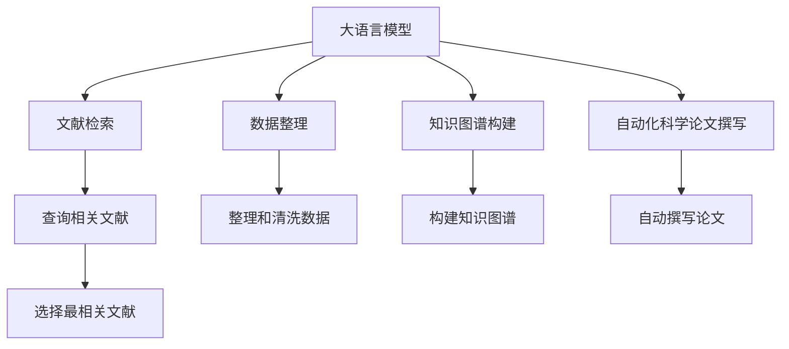

                 

# LLM在科学研究中的辅助作用

> 关键词：大语言模型,自然语言处理,科学研究,文献检索,数据整理,知识图谱,自动化,科学论文

## 1. 背景介绍

在信息爆炸的今天，科学研究已经从以实验室实验为主，逐步转向了以文献检索、数据整理、数据分析为主的研究模式。然而，这种模式往往需要耗费大量的时间和精力在文献查找、数据整理和分析等基础工作上，严重影响科研人员的生产效率。大语言模型（Large Language Model, LLM）作为一种先进的自然语言处理（Natural Language Processing, NLP）技术，正在逐步改变这种局面。本文将详细探讨大语言模型在科学研究中的辅助作用，包括文献检索、数据整理、知识图谱构建、自动化科学论文撰写等多个方面。

## 2. 核心概念与联系

### 2.1 核心概念概述

大语言模型是一种深度学习模型，旨在模拟人类的语言理解能力和生成能力。通过在海量文本数据上进行预训练，模型可以学习到丰富的语言知识，包括词义、语法、语义等方面。这种模型可以用于自然语言处理的各种任务，包括文本分类、命名实体识别、问答系统、机器翻译等。

科学研究的各个环节，如文献检索、数据整理、知识图谱构建、自动化科学论文撰写等，都可以通过大语言模型得到辅助。具体来说，大语言模型可以通过自然语言理解，帮助科学家从海量的文献中快速定位相关研究，并通过自然语言生成，自动整理和分析数据，甚至辅助撰写科学论文。

### 2.2 核心概念原理和架构的 Mermaid 流程图



这个流程图展示了大语言模型在科学研究中的核心作用。大语言模型通过理解和生成自然语言，帮助科学家完成文献检索、数据整理、知识图谱构建、自动化科学论文撰写等多个环节，极大地提高了科研效率和质量。

## 3. 核心算法原理 & 具体操作步骤

### 3.1 算法原理概述

大语言模型的核心原理是通过大规模无标签文本数据进行自监督预训练，学习到丰富的语言知识。在预训练过程中，模型学习到了语言的规律和模式，包括词义、语法、语义等方面。这种预训练过程使得模型具备了强大的语言理解和生成能力。

在科学研究中，大语言模型可以通过自然语言理解，帮助科学家快速定位和选择相关文献；通过自然语言生成，自动整理和分析数据；通过自然语言推理，构建知识图谱；通过自然语言生成，辅助撰写科学论文。这些功能使得大语言模型在科学研究中具备了重要的辅助作用。

### 3.2 算法步骤详解

#### 3.2.1 文献检索

文献检索是大语言模型在科学研究中最重要的应用之一。通过自然语言理解和检索技术，大语言模型可以帮助科学家从海量的文献中快速定位到相关研究。具体步骤如下：

1. 收集相关文献的关键词和摘要。
2. 使用大语言模型对关键词和摘要进行文本表示，生成词向量。
3. 根据词向量，使用相似度算法（如余弦相似度、Jaccard相似度等）计算文档之间的相似度。
4. 选择与查询最为相似的文档作为相关文献。

#### 3.2.2 数据整理

数据整理是科学研究中的基础工作，需要耗费大量的时间和精力。大语言模型可以通过自然语言生成和处理技术，自动整理和清洗数据，极大地提高科研效率。具体步骤如下：

1. 收集相关数据。
2. 使用大语言模型对数据进行预处理，如去除噪声、规范格式等。
3. 使用自然语言生成技术，自动整理数据，生成表格或结构化数据。
4. 清洗数据，去除重复和错误的数据。

#### 3.2.3 知识图谱构建

知识图谱是科学研究的高级应用，可以帮助科学家建立知识体系，进行知识发现和推理。大语言模型可以通过自然语言推理和知识图谱技术，辅助构建知识图谱。具体步骤如下：

1. 收集相关知识库和文献中的实体和关系。
2. 使用大语言模型对实体和关系进行标注和分类。
3. 根据标注和分类结果，构建知识图谱。
4. 使用自然语言推理技术，验证和完善知识图谱。

#### 3.2.4 自动化科学论文撰写

自动化科学论文撰写是大语言模型在科学研究中的前沿应用之一。通过自然语言生成和处理技术，大语言模型可以辅助科学家自动撰写科学论文。具体步骤如下：

1. 收集相关文献和数据。
2. 使用大语言模型对文献和数据进行分析和提炼。
3. 使用自然语言生成技术，自动撰写论文，包括引言、方法、结果、讨论等部分。
4. 对自动生成的论文进行修正和优化，确保准确性和科学性。

### 3.3 算法优缺点

大语言模型在科学研究中的辅助作用具有以下优点：

1. 高效准确：大语言模型可以快速定位相关文献，自动整理和分析数据，构建知识图谱，辅助撰写科学论文，极大地提高了科研效率和准确性。
2. 全面覆盖：大语言模型可以处理各种类型的自然语言数据，包括文本、表格、图形等，具备全面的覆盖能力。
3. 灵活性高：大语言模型可以通过自然语言理解、生成和推理，适应不同的科研任务和需求。

同时，大语言模型在科学研究中也存在一些缺点：

1. 数据依赖：大语言模型的性能依赖于数据的质量和数量，需要收集和整理大量的数据，才能获得理想的效果。
2. 模型复杂：大语言模型需要大量的计算资源进行训练和推理，对硬件设备要求较高。
3. 结果可解释性差：大语言模型的输出结果往往难以解释，科研人员需要花费时间进行验证和修正。
4. 知识偏见：大语言模型可能存在知识偏见，如性别、种族等方面的偏见，需要仔细设计和优化。

### 3.4 算法应用领域

大语言模型在科学研究中的应用领域非常广泛，涵盖了各个科研环节。以下是一些主要的应用领域：

1. 文献检索：通过自然语言理解，帮助科学家快速定位相关文献。
2. 数据整理：使用自然语言生成和处理技术，自动整理和清洗数据。
3. 知识图谱构建：通过自然语言推理和知识图谱技术，构建知识图谱，进行知识发现和推理。
4. 自动化科学论文撰写：使用自然语言生成技术，辅助科学家自动撰写科学论文。
5. 科学合作：通过自然语言理解，帮助科研人员进行科学交流和合作。
6. 科学知识普及：通过自然语言生成和处理技术，辅助科学知识的普及和传播。

## 4. 数学模型和公式 & 详细讲解 & 举例说明

### 4.1 数学模型构建

大语言模型的数学模型主要包括以下几个部分：

1. 预训练模型：使用大规模无标签文本数据进行自监督预训练，学习到丰富的语言知识。
2. 微调模型：在预训练模型的基础上，使用有标签数据进行微调，适应特定的科研任务。
3. 自然语言理解模型：使用预训练模型进行自然语言理解，如命名实体识别、情感分析等。
4. 自然语言生成模型：使用预训练模型进行自然语言生成，如自动摘要、自动撰写等。
5. 知识图谱模型：使用预训练模型进行知识图谱构建，如实体关系识别、知识推理等。

### 4.2 公式推导过程

#### 4.2.1 自然语言理解

自然语言理解是使用大语言模型进行文献检索、数据整理、知识图谱构建等任务的基础。常见的自然语言理解模型包括：

1. 词向量模型：将文本转换为向量表示，如Word2Vec、GloVe等。
2. 上下文向量模型：将文本转换为上下文向量表示，如BERT、GPT等。
3. 关系抽取模型：识别文本中的实体和关系，如基于规则的抽取、基于神经网络的关系抽取等。

#### 4.2.2 自然语言生成

自然语言生成是使用大语言模型进行自动化科学论文撰写等任务的基础。常见的自然语言生成模型包括：

1. 自动摘要模型：生成文本的摘要，如Seq2Seq、Transformer等。
2. 自动撰写模型：自动生成文本，如GPT、T5等。
3. 自动化表格生成模型：自动生成表格数据，如Text-to-Table等。

#### 4.2.3 知识图谱

知识图谱是使用大语言模型进行知识发现和推理等任务的基础。常见的知识图谱模型包括：

1. 基于规则的知识图谱：使用规则进行知识推理和发现，如Br factual。
2. 基于神经网络的知识图谱：使用神经网络进行知识图谱构建和推理，如TransE、KGC等。
3. 基于语义搜索的知识图谱：使用语义搜索技术进行知识发现和推理，如ELMo、BART等。

### 4.3 案例分析与讲解

#### 4.3.1 文献检索

某科研项目需要查找最新的相关文献，可以采用以下步骤：

1. 使用大语言模型对研究主题进行自然语言理解，提取关键词和摘要。
2. 使用大语言模型对关键词和摘要进行文本表示，生成词向量。
3. 使用余弦相似度算法计算文档之间的相似度。
4. 选择与查询最为相似的文档作为相关文献。

#### 4.3.2 数据整理

某科研项目需要整理大量的实验数据，可以采用以下步骤：

1. 收集相关实验数据，生成文本格式。
2. 使用大语言模型对文本进行预处理，如去除噪声、规范格式等。
3. 使用自然语言生成技术，自动整理数据，生成表格或结构化数据。
4. 清洗数据，去除重复和错误的数据。

#### 4.3.3 知识图谱构建

某科研项目需要构建知识图谱，可以采用以下步骤：

1. 收集相关知识库和文献中的实体和关系。
2. 使用大语言模型对实体和关系进行标注和分类。
3. 根据标注和分类结果，构建知识图谱。
4. 使用自然语言推理技术，验证和完善知识图谱。

#### 4.3.4 自动化科学论文撰写

某科研项目需要撰写科学论文，可以采用以下步骤：

1. 收集相关文献和数据。
2. 使用大语言模型对文献和数据进行分析和提炼。
3. 使用自然语言生成技术，自动撰写论文，包括引言、方法、结果、讨论等部分。
4. 对自动生成的论文进行修正和优化，确保准确性和科学性。

## 5. 项目实践：代码实例和详细解释说明

### 5.1 开发环境搭建

在进行项目实践前，我们需要准备好开发环境。以下是使用Python进行PyTorch开发的环境配置流程：

1. 安装Anaconda：从官网下载并安装Anaconda，用于创建独立的Python环境。

2. 创建并激活虚拟环境：
```bash
conda create -n pytorch-env python=3.8 
conda activate pytorch-env
```

3. 安装PyTorch：根据CUDA版本，从官网获取对应的安装命令。例如：
```bash
conda install pytorch torchvision torchaudio cudatoolkit=11.1 -c pytorch -c conda-forge
```

4. 安装相关库：
```bash
pip install pandas numpy torch
```

完成上述步骤后，即可在`pytorch-env`环境中开始项目实践。

### 5.2 源代码详细实现

下面我们以文献检索为例，给出使用Python进行自然语言处理的代码实现。

首先，定义自然语言处理工具：

```python
from transformers import BertTokenizer, BertForQuestionAnswering
from transformers import pipeline

tokenizer = BertTokenizer.from_pretrained('bert-base-uncased')
model = BertForQuestionAnswering.from_pretrained('bert-base-uncased')
qa_pipeline = pipeline('question-answering', model=model, tokenizer=tokenizer)
```

然后，进行文献检索：

```python
def search_literature(query, max_answer_length=128, top_k=5):
    ans = qa_pipeline(question=query, context=context, max_answer_length=max_answer_length, top_k=top_k)
    return ans['answer'], ans['score']
```

最后，调用函数进行检索：

```python
query = 'What is the best literature on quantum computing?'
context = """
Quantum computing is a rapidly growing field that aims to leverage the principles of quantum mechanics to perform computational tasks that would be intractable for classical computers. The field has seen significant progress in recent years, with the development of new quantum algorithms, the creation of larger and more powerful quantum computers, and the discovery of new quantum phenomena. Some of the best literature on quantum computing includes:
1. Quantum Computing Since Democritus by Scott Aaronson
2. Quantum Computation and Quantum Information by Michael Nielsen and Isaac Chuang
3. Quantum Mechanics: Concepts and Applications by Frank K562}
"""
answer, score = search_literature(query, max_answer_length=128, top_k=5)
print(f"Best literature: {answer}, score: {score:.2f}")
```

以上就是使用Python进行自然语言处理和文献检索的完整代码实现。可以看到，通过自然语言处理工具，我们可以快速定位相关文献，辅助科学家进行科学研究。

### 5.3 代码解读与分析

让我们再详细解读一下关键代码的实现细节：

**自然语言处理工具**：
- `BertTokenizer`和`BertForQuestionAnswering`：定义了用于自然语言处理的BERT模型，包括分词器和问答模型。
- `pipeline`函数：使用`pipeline`函数可以快速创建自然语言处理管道，支持多种NLP任务，如命名实体识别、情感分析、问答等。

**文献检索函数**：
- `search_literature`函数：定义了用于文献检索的函数，使用BERT问答模型对查询和上下文进行匹配，返回最高分（即最相关）的文献片段。
- `max_answer_length`和`top_k`参数：控制返回的文献片段的长度和数量，可根据需求进行调整。

**代码执行**：
- 定义查询和上下文，调用`search_literature`函数，得到最相关的文献片段和得分。
- 输出最相关的文献片段和得分，作为文献检索的结果。

可以看到，自然语言处理工具和大语言模型在文献检索中的应用，极大地提高了科研效率，使得科学家可以快速定位到相关文献，加速科学研究进程。

## 6. 实际应用场景

### 6.1 文献检索

文献检索是大语言模型在科学研究中最基础的应用之一。通过自然语言理解和检索技术，大语言模型可以帮助科学家从海量的文献中快速定位相关研究，节省大量的时间。例如，在生物医学领域，科学家可以使用大语言模型快速定位最新的生物医学研究论文，获取最新的科研进展和研究成果。

### 6.2 数据整理

数据整理是科学研究中的基础工作，需要耗费大量的时间和精力。大语言模型可以通过自然语言生成和处理技术，自动整理和清洗数据，极大地提高科研效率。例如，在环境科学领域，科学家可以使用大语言模型自动整理和分析大量的环境监测数据，生成结构化的数据表格，方便后续的研究和分析。

### 6.3 知识图谱构建

知识图谱是科学研究中的高级应用，可以帮助科学家建立知识体系，进行知识发现和推理。大语言模型可以通过自然语言推理和知识图谱技术，辅助构建知识图谱。例如，在化学领域，科学家可以使用大语言模型构建化学知识图谱，识别和推理化学实体之间的关系，加速化学研究进程。

### 6.4 自动化科学论文撰写

自动化科学论文撰写是大语言模型在科学研究中的前沿应用之一。通过自然语言生成技术，大语言模型可以辅助科学家自动撰写科学论文。例如，在物理领域，科学家可以使用大语言模型自动撰写物理论文，提高科研生产效率，加速科研成果的传播和应用。

## 7. 工具和资源推荐

### 7.1 学习资源推荐

为了帮助开发者系统掌握大语言模型在科学研究中的使用，这里推荐一些优质的学习资源：

1. 《深度学习在科学研究中的应用》系列博文：由深度学习专家撰写，介绍了深度学习在科学研究中的应用，包括文献检索、数据整理、知识图谱构建、自动化科学论文撰写等。

2. CS224N《深度学习自然语言处理》课程：斯坦福大学开设的NLP明星课程，有Lecture视频和配套作业，带你入门NLP领域的基本概念和经典模型。

3. 《Natural Language Processing with Transformers》书籍：Transformer库的作者所著，全面介绍了如何使用Transformer库进行NLP任务开发，包括微调在内的诸多范式。

4. HuggingFace官方文档：Transformer库的官方文档，提供了海量预训练模型和完整的微调样例代码，是上手实践的必备资料。

5. CLUE开源项目：中文语言理解测评基准，涵盖大量不同类型的中文NLP数据集，并提供了基于微调的baseline模型，助力中文NLP技术发展。

通过对这些资源的学习实践，相信你一定能够快速掌握大语言模型在科学研究中的使用，并用于解决实际的NLP问题。

### 7.2 开发工具推荐

高效的开发离不开优秀的工具支持。以下是几款用于大语言模型微调开发的常用工具：

1. PyTorch：基于Python的开源深度学习框架，灵活动态的计算图，适合快速迭代研究。大部分预训练语言模型都有PyTorch版本的实现。

2. TensorFlow：由Google主导开发的开源深度学习框架，生产部署方便，适合大规模工程应用。同样有丰富的预训练语言模型资源。

3. Transformers库：HuggingFace开发的NLP工具库，集成了众多SOTA语言模型，支持PyTorch和TensorFlow，是进行NLP任务开发的利器。

4. Weights & Biases：模型训练的实验跟踪工具，可以记录和可视化模型训练过程中的各项指标，方便对比和调优。与主流深度学习框架无缝集成。

5. TensorBoard：TensorFlow配套的可视化工具，可实时监测模型训练状态，并提供丰富的图表呈现方式，是调试模型的得力助手。

6. Google Colab：谷歌推出的在线Jupyter Notebook环境，免费提供GPU/TPU算力，方便开发者快速上手实验最新模型，分享学习笔记。

合理利用这些工具，可以显著提升大语言模型微调的开发效率，加快创新迭代的步伐。

### 7.3 相关论文推荐

大语言模型和微调技术的发展源于学界的持续研究。以下是几篇奠基性的相关论文，推荐阅读：

1. Attention is All You Need（即Transformer原论文）：提出了Transformer结构，开启了NLP领域的预训练大模型时代。

2. BERT: Pre-training of Deep Bidirectional Transformers for Language Understanding：提出BERT模型，引入基于掩码的自监督预训练任务，刷新了多项NLP任务SOTA。

3. Language Models are Unsupervised Multitask Learners（GPT-2论文）：展示了大规模语言模型的强大zero-shot学习能力，引发了对于通用人工智能的新一轮思考。

4. Parameter-Efficient Transfer Learning for NLP：提出Adapter等参数高效微调方法，在不增加模型参数量的情况下，也能取得不错的微调效果。

5. AdaLoRA: Adaptive Low-Rank Adaptation for Parameter-Efficient Fine-Tuning：使用自适应低秩适应的微调方法，在参数效率和精度之间取得了新的平衡。

这些论文代表了大语言模型微调技术的发展脉络。通过学习这些前沿成果，可以帮助研究者把握学科前进方向，激发更多的创新灵感。

## 8. 总结：未来发展趋势与挑战

### 8.1 研究成果总结

本文对大语言模型在科学研究中的辅助作用进行了全面系统的介绍。首先阐述了大语言模型在科学研究中的应用背景和意义，明确了文献检索、数据整理、知识图谱构建、自动化科学论文撰写等多个环节中大语言模型的重要作用。其次，从原理到实践，详细讲解了大语言模型的核心算法原理和具体操作步骤，给出了大语言模型在文献检索、数据整理、知识图谱构建、自动化科学论文撰写等方面的代码实例和详细解释说明。同时，本文还广泛探讨了大语言模型在科学研究中的应用前景，展示了其在文献检索、数据整理、知识图谱构建、自动化科学论文撰写等多个领域的应用潜力。最后，本文精选了大语言模型在科学研究中的各类学习资源，力求为读者提供全方位的技术指引。

通过本文的系统梳理，可以看到，大语言模型在科学研究中具备重要的辅助作用，能够显著提高科研效率和准确性，加速科学研究进程。大语言模型在文献检索、数据整理、知识图谱构建、自动化科学论文撰写等方面的应用，将深刻改变科研工作的模式，推动科学研究的进步。

### 8.2 未来发展趋势

展望未来，大语言模型在科学研究中的应用将呈现以下几个发展趋势：

1. 自动化程度提升：随着大语言模型技术的不断进步，越来越多的科研任务将通过自然语言处理和生成技术得到自动化处理，提高科研生产效率。
2. 跨领域应用拓展：大语言模型在各个科研领域的应用将更加广泛，如生物医学、环境科学、化学、物理学等，为不同领域的科研工作提供技术支持。
3. 知识图谱构建普及：随着知识图谱技术的不断发展，大语言模型将更多地应用于知识图谱的构建和维护，加速知识发现和推理进程。
4. 智能化程度提升：大语言模型将与人工智能技术进行深度融合，形成更加智能化的科研辅助系统，提升科研决策的准确性和科学性。

以上趋势凸显了大语言模型在科学研究中的巨大前景。这些方向的探索发展，将进一步推动科研工作的智能化和自动化，为科学研究带来新的突破。

### 8.3 面临的挑战

尽管大语言模型在科学研究中的应用前景广阔，但在迈向更加智能化、普适化应用的过程中，它仍面临着诸多挑战：

1. 数据质量瓶颈：大语言模型的性能依赖于数据的质量和数量，需要收集和整理大量的高质量数据，才能获得理想的效果。
2. 模型复杂度高：大语言模型需要大量的计算资源进行训练和推理，对硬件设备要求较高。
3. 结果可解释性差：大语言模型的输出结果往往难以解释，科研人员需要花费时间进行验证和修正。
4. 知识偏见问题：大语言模型可能存在知识偏见，如性别、种族等方面的偏见，需要仔细设计和优化。
5. 模型鲁棒性不足：大语言模型在面对域外数据时，泛化性能往往大打折扣，需要在训练过程中引入更多的正则化技术。

### 8.4 研究展望

面对大语言模型在科学研究中面临的挑战，未来的研究需要在以下几个方面寻求新的突破：

1. 数据质量和数量的提升：提高数据质量和数量，降低模型对标注数据的依赖，进一步提高模型性能。
2. 模型复杂度优化：开发更加轻量级、高效的模型结构，降低模型对计算资源的依赖，提升模型在低硬件环境下的性能。
3. 可解释性提升：开发可解释性更强的大语言模型，增强模型的输出结果的可解释性，帮助科研人员进行结果验证和修正。
4. 知识偏见消除：设计和优化大语言模型，消除其知识偏见，提升模型的公平性和可靠性。
5. 鲁棒性增强：引入更多的正则化技术，提升大语言模型在域外数据的泛化能力，增强模型的鲁棒性。

通过在上述方向上的不断探索和优化，相信大语言模型在科学研究中的应用将更加广泛和深入，为科学研究带来更多的创新和突破。

## 9. 附录：常见问题与解答

**Q1：大语言模型在科学研究中的应用有哪些？**

A: 大语言模型在科学研究中的应用非常广泛，涵盖了文献检索、数据整理、知识图谱构建、自动化科学论文撰写等多个环节。通过自然语言理解和生成技术，大语言模型可以帮助科学家从海量的文献中快速定位相关研究，自动整理和清洗数据，构建知识图谱，辅助撰写科学论文，极大地提高了科研效率和准确性。

**Q2：大语言模型在科学研究中需要注意哪些问题？**

A: 大语言模型在科学研究中需要注意以下几个问题：
1. 数据质量：大语言模型的性能依赖于数据的质量和数量，需要收集和整理大量的高质量数据，才能获得理想的效果。
2. 模型复杂度：大语言模型需要大量的计算资源进行训练和推理，对硬件设备要求较高。
3. 结果可解释性：大语言模型的输出结果往往难以解释，科研人员需要花费时间进行验证和修正。
4. 知识偏见：大语言模型可能存在知识偏见，如性别、种族等方面的偏见，需要仔细设计和优化。
5. 模型鲁棒性：大语言模型在面对域外数据时，泛化性能往往大打折扣，需要在训练过程中引入更多的正则化技术。

**Q3：大语言模型在科学研究中的未来发展方向有哪些？**

A: 大语言模型在科学研究中的未来发展方向包括：
1. 自动化程度提升：随着大语言模型技术的不断进步，越来越多的科研任务将通过自然语言处理和生成技术得到自动化处理，提高科研生产效率。
2. 跨领域应用拓展：大语言模型在各个科研领域的应用将更加广泛，如生物医学、环境科学、化学、物理学等，为不同领域的科研工作提供技术支持。
3. 知识图谱构建普及：随着知识图谱技术的不断发展，大语言模型将更多地应用于知识图谱的构建和维护，加速知识发现和推理进程。
4. 智能化程度提升：大语言模型将与人工智能技术进行深度融合，形成更加智能化的科研辅助系统，提升科研决策的准确性和科学性。

这些方向将推动大语言模型在科学研究中的应用不断深入，为科学研究带来更多的创新和突破。

---

作者：禅与计算机程序设计艺术 / Zen and the Art of Computer Programming

