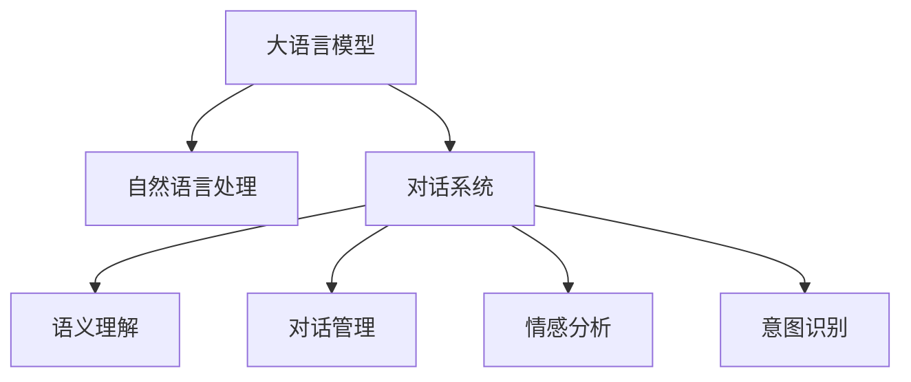

                 

# LLM对传统客户服务的革新

> 关键词：大语言模型(LLM),智能客服,自然语言处理(NLP),对话系统,语义理解,对话管理,情感分析,意图识别

## 1. 背景介绍

### 1.1 问题由来

在现代社会中，客户服务是每个企业不可或缺的重要环节。传统客户服务主要依赖于人工客服团队，通过电话、邮件、在线聊天等多种渠道，为客户提供个性化、人性化的服务体验。然而，传统客户服务存在诸多问题：

- **成本高**：人工客服需要投入大量人力成本，尤其是在高峰期，往往需要大量的人手，同时需要支付不菲的工资。
- **响应慢**：由于人力资源的限制，客服响应时间较长，无法即时满足客户的咨询需求。
- **效率低**：人工客服依赖于员工的经验和知识，无法24小时不间断服务，且存在人为错误的风险。
- **一致性差**：由于客户服务由不同员工提供，服务质量存在较大差异，无法保证一致性和专业性。

为了解决这些问题，企业开始引入自动化技术，以提高客户服务的效率和质量。其中，基于大语言模型的智能客服系统成为近年来的热门研究方向，给传统的客户服务带来了深刻变革。

## 2. 核心概念与联系

### 2.1 核心概念概述

为了更好地理解智能客服系统的实现原理，本节将介绍几个关键概念：

- **大语言模型(LLM)**：以自回归(如GPT)或自编码(如BERT)模型为代表的大规模预训练语言模型。通过在大规模无标签文本语料上进行预训练，学习通用的语言知识和常识，具备强大的语言理解和生成能力。
- **自然语言处理(NLP)**：研究如何让计算机理解和处理自然语言的技术，包括语言模型、语义分析、对话管理等。
- **对话系统**：使计算机能够自然地与人类进行对话的系统，分为规则型和统计型两大类。
- **语义理解**：使计算机能够理解用户输入的自然语言语句，并映射到相应的意图和实体。
- **对话管理**：管理对话过程中不同轮次的交互，确保对话流畅且高效。
- **情感分析**：识别并分析用户输入中的情感倾向，以提高服务质量和客户满意度。
- **意图识别**：从用户输入中提取并识别出用户的真实意图，以便进行个性化服务。

这些概念之间的逻辑关系可以通过以下Mermaid流程图来展示：



这个流程图展示了大语言模型在智能客服系统中的核心概念及其之间的关系：

1. 大语言模型通过预训练获得基础能力。
2. 对话系统通过大语言模型进行语义理解和对话管理，构建自然对话流程。
3. 对话系统利用语义理解、情感分析和意图识别等技术，提升对话体验和个性化服务质量。

## 3. 核心算法原理 & 具体操作步骤
### 3.1 算法原理概述

基于大语言模型的智能客服系统，主要通过以下几个步骤实现：

1. **数据准备**：收集企业内部历史客服对话记录，将问题和最佳答复构建成监督数据。
2. **模型微调**：在大语言模型的基础上，使用监督数据对模型进行微调，使其能够自动理解用户意图，匹配最合适的答案模板进行回复。
3. **对话管理**：构建对话管理策略，根据用户输入生成对话策略，管理对话流程，确保对话连贯性和一致性。
4. **用户反馈**：记录用户对客服服务的反馈，持续改进模型和服务质量。

整个系统运行流程可以描述如下：


### 3.2 算法步骤详解

#### 3.2.1 数据准备

**数据收集**：收集企业内部历史客服对话记录，将问题和最佳答复构建成监督数据。可以通过自然语言处理技术，如命名实体识别、情感分析、意图识别等，进一步处理原始数据，构建更加规范的监督数据。

**数据标注**：将对话数据标注为问题、意图、答案等格式，以便后续模型的训练和推理。标注过程需要人工介入，保证标注的准确性和一致性。

**数据增强**：利用数据增强技术，扩充训练集规模。可以通过回译、近义词替换等方式，生成更多的对话数据，提升模型的泛化能力。

#### 3.2.2 模型微调

**选择模型**：选择合适的预训练语言模型，如BERT、GPT等，作为初始化参数。

**模型微调**：在微调过程中，通常使用大语言模型作为基础，仅更新顶层或部分参数，以减少计算资源消耗。微调的目标是优化模型在特定任务上的性能，如问题回答、对话管理等。

**超参数调优**：根据任务特点，选择合适的优化算法及其参数，如AdamW、SGD等，设置学习率、批大小、迭代轮数等。

**正则化技术**：应用L2正则、Dropout、Early Stopping等技术，防止模型过拟合。

**模型评估**：在验证集上评估模型性能，根据性能指标决定是否触发Early Stopping。

#### 3.2.3 对话管理

**对话策略设计**：设计对话管理策略，根据用户输入生成对话策略，管理对话流程。可以采用规则型或统计型策略，结合人工干预和自动调整，实现高效对话。

**上下文管理**：管理对话过程中不同轮次的交互，确保对话连贯性和一致性。需要记录用户输入和系统回复，构建对话历史上下文。

**意图识别**：从用户输入中提取并识别出用户的真实意图，以便进行个性化服务。可以结合自然语言处理技术和统计方法，识别用户意图。

**答案生成**：根据用户意图，从知识库中检索最佳回答，或通过微调后的模型生成动态回答。答案生成过程需要考虑情感、语气等因素，提升回答质量。

### 3.3 算法优缺点

基于大语言模型的智能客服系统具有以下优点：

- **成本低**：相较于人工客服，智能客服系统可以显著降低人力成本，特别是在高峰期。
- **响应快**：智能客服系统可以24小时不间断服务，快速响应客户咨询。
- **效率高**：智能客服系统能够即时处理大量客户请求，显著提高服务效率。
- **一致性好**：智能客服系统提供统一的服务，不受人员波动影响。

然而，基于大语言模型的智能客服系统也存在一些缺点：

- **理解误差**：当用户输入存在歧义或含糊不清时，系统可能无法准确理解用户意图，导致回答错误。
- **多轮对话管理复杂**：智能客服系统需要处理多轮对话，管理策略复杂，容易出错。
- **缺乏灵活性**：当前技术水平下，智能客服系统无法处理非常规或特殊场景，需要人工介入。
- **缺乏情感感知**：当前系统无法感知用户情感，无法提供情感化的服务。

### 3.4 算法应用领域

基于大语言模型的智能客服系统，已经在金融、医疗、电商、教育等多个领域得到广泛应用，具体包括：

- **金融领域**：智能客服系统可以处理用户的咨询、交易、理财等问题，提供实时金融服务。
- **医疗领域**：智能客服系统可以解答患者的问题，提供健康建议，提升医疗服务的可达性和效率。
- **电商领域**：智能客服系统可以解答用户的购买、退换货、物流等问题，提升购物体验。
- **教育领域**：智能客服系统可以解答学生的疑问，提供学习资源，辅助教育过程。

## 4. 数学模型和公式 & 详细讲解
### 4.1 数学模型构建

基于大语言模型的智能客服系统，可以建模为一个对话生成问题，即在给定对话历史的情况下，预测系统回复的语句。形式化地，假设输入序列为 $X=(x_1, x_2, ..., x_t)$，其中 $x_i$ 为第 $i$ 轮用户输入，输出序列为 $Y=(y_1, y_2, ..., y_t)$，其中 $y_i$ 为第 $i$ 轮系统回复。

假设模型 $M_{\theta}$ 将输入序列 $X$ 映射到输出序列 $Y$，则问题可以表示为：

$$
y_i = M_{\theta}(x_i, y_{<i})
$$

其中 $y_{<i}=(y_1, y_2, ..., y_{i-1})$。

目标是通过监督数据训练模型 $M_{\theta}$，使其能够自动生成高质量的回复。

### 4.2 公式推导过程

以BERT模型为例，其对话生成过程可以描述如下：

1. **输入编码**：将用户输入 $x_i$ 和对话历史 $y_{<i}$ 编码为向量表示 $h_i$。
2. **前向传播**：输入编码 $h_i$ 通过BERT模型，得到上下文表示 $c_i$。
3. **回答生成**：通过线性层和softmax层，生成回答概率分布 $P(y_i|x_i, y_{<i})$。

具体地，设BERT模型的参数为 $\theta$，输入编码为 $h_i = M_{\theta}(x_i)$，上下文表示为 $c_i = M_{\theta}(h_i, y_{<i})$。回答生成的过程为：

$$
y_i = \mathop{\arg\max}_{y} P(y|c_i) = \mathop{\arg\max}_{y} softmax(W_l h_i + b_l)^\top c_i
$$

其中 $W_l$ 和 $b_l$ 为线性层和softmax层的参数，可以通过微调过程进行优化。

### 4.3 案例分析与讲解

假设某电商平台需要部署智能客服系统，处理用户的购买咨询、物流查询等问题。具体流程如下：

1. **数据准备**：收集历史客服对话数据，标注问题和答案，构建监督数据集。
2. **模型微调**：选择BERT作为初始化参数，使用监督数据集进行微调，优化模型的回答生成能力。
3. **对话管理**：设计对话管理策略，根据用户输入生成对话策略，管理对话流程。
4. **用户反馈**：记录用户对客服服务的反馈，持续改进模型和服务质量。

假设某用户输入“我的订单状态如何”，系统首先识别出用户意图为查询订单状态，从知识库中检索相关信息，生成回答“您的订单状态为已发货，预计将在XX日送达”。

## 5. 项目实践：代码实例和详细解释说明
### 5.1 开发环境搭建

在进行智能客服系统开发前，我们需要准备好开发环境。以下是使用Python进行PyTorch开发的环境配置流程：

1. 安装Anaconda：从官网下载并安装Anaconda，用于创建独立的Python环境。

2. 创建并激活虚拟环境：
```bash
conda create -n chatbot-env python=3.8 
conda activate chatbot-env
```

3. 安装PyTorch：根据CUDA版本，从官网获取对应的安装命令。例如：
```bash
conda install pytorch torchvision torchaudio cudatoolkit=11.1 -c pytorch -c conda-forge
```

4. 安装Transformers库：
```bash
pip install transformers
```

5. 安装各类工具包：
```bash
pip install numpy pandas scikit-learn matplotlib tqdm jupyter notebook ipython
```

完成上述步骤后，即可在`chatbot-env`环境中开始智能客服系统的开发。

### 5.2 源代码详细实现

下面以智能客服系统为例，给出使用Transformers库对BERT模型进行智能客服系统开发的PyTorch代码实现。

首先，定义智能客服系统的数据处理函数：

```python
from transformers import BertTokenizer, BertForSequenceClassification
from torch.utils.data import Dataset
import torch

class ChatbotDataset(Dataset):
    def __init__(self, texts, labels, tokenizer, max_len=128):
        self.texts = texts
        self.labels = labels
        self.tokenizer = tokenizer
        self.max_len = max_len
        
    def __len__(self):
        return len(self.texts)
    
    def __getitem__(self, item):
        text = self.texts[item]
        label = self.labels[item]
        
        encoding = self.tokenizer(text, return_tensors='pt', max_length=self.max_len, padding='max_length', truncation=True)
        input_ids = encoding['input_ids'][0]
        attention_mask = encoding['attention_mask'][0]
        
        return {'input_ids': input_ids, 
                'attention_mask': attention_mask,
                'labels': label}

# 标签与id的映射
label2id = {'查询订单状态': 0, '查询物流信息': 1, '申请退款': 2, '其他咨询': 3}

# 创建dataset
tokenizer = BertTokenizer.from_pretrained('bert-base-cased')

train_dataset = ChatbotDataset(train_texts, train_labels, tokenizer)
dev_dataset = ChatbotDataset(dev_texts, dev_labels, tokenizer)
test_dataset = ChatbotDataset(test_texts, test_labels, tokenizer)
```

然后，定义模型和优化器：

```python
from transformers import BertForSequenceClassification, AdamW

model = BertForSequenceClassification.from_pretrained('bert-base-cased', num_labels=len(label2id))

optimizer = AdamW(model.parameters(), lr=2e-5)
```

接着，定义训练和评估函数：

```python
from torch.utils.data import DataLoader
from tqdm import tqdm
from sklearn.metrics import accuracy_score

device = torch.device('cuda') if torch.cuda.is_available() else torch.device('cpu')
model.to(device)

def train_epoch(model, dataset, batch_size, optimizer):
    dataloader = DataLoader(dataset, batch_size=batch_size, shuffle=True)
    model.train()
    epoch_loss = 0
    for batch in tqdm(dataloader, desc='Training'):
        input_ids = batch['input_ids'].to(device)
        attention_mask = batch['attention_mask'].to(device)
        labels = batch['labels'].to(device)
        model.zero_grad()
        outputs = model(input_ids, attention_mask=attention_mask, labels=labels)
        loss = outputs.loss
        epoch_loss += loss.item()
        loss.backward()
        optimizer.step()
    return epoch_loss / len(dataloader)

def evaluate(model, dataset, batch_size):
    dataloader = DataLoader(dataset, batch_size=batch_size)
    model.eval()
    preds, labels = [], []
    with torch.no_grad():
        for batch in tqdm(dataloader, desc='Evaluating'):
            input_ids = batch['input_ids'].to(device)
            attention_mask = batch['attention_mask'].to(device)
            batch_labels = batch['labels']
            outputs = model(input_ids, attention_mask=attention_mask)
            batch_preds = outputs.logits.argmax(dim=2).to('cpu').tolist()
            batch_labels = batch_labels.to('cpu').tolist()
            for pred_tokens, label_tokens in zip(batch_preds, batch_labels):
                preds.append(pred_tokens[:len(label_tokens)])
                labels.append(label_tokens)
                
    print(accuracy_score(labels, preds))
```

最后，启动训练流程并在测试集上评估：

```python
epochs = 5
batch_size = 16

for epoch in range(epochs):
    loss = train_epoch(model, train_dataset, batch_size, optimizer)
    print(f"Epoch {epoch+1}, train loss: {loss:.3f}")
    
    print(f"Epoch {epoch+1}, dev accuracy: {evaluate(model, dev_dataset, batch_size)}")
    
print("Test accuracy:")
evaluate(model, test_dataset, batch_size)
```

以上就是使用PyTorch对BERT进行智能客服系统开发的完整代码实现。可以看到，得益于Transformers库的强大封装，我们可以用相对简洁的代码完成BERT模型的加载和微调。

### 5.3 代码解读与分析

让我们再详细解读一下关键代码的实现细节：

**ChatbotDataset类**：
- `__init__`方法：初始化文本、标签、分词器等关键组件。
- `__len__`方法：返回数据集的样本数量。
- `__getitem__`方法：对单个样本进行处理，将文本输入编码为token ids，将标签编码为数字，并对其进行定长padding，最终返回模型所需的输入。

**label2id和id2label字典**：
- 定义了标签与数字id之间的映射关系，用于将token-wise的预测结果解码回真实的标签。

**训练和评估函数**：
- 使用PyTorch的DataLoader对数据集进行批次化加载，供模型训练和推理使用。
- 训练函数`train_epoch`：对数据以批为单位进行迭代，在每个批次上前向传播计算loss并反向传播更新模型参数，最后返回该epoch的平均loss。
- 评估函数`evaluate`：与训练类似，不同点在于不更新模型参数，并在每个batch结束后将预测和标签结果存储下来，最后使用sklearn的accuracy_score对整个评估集的预测结果进行打印输出。

**训练流程**：
- 定义总的epoch数和batch size，开始循环迭代
- 每个epoch内，先在训练集上训练，输出平均loss
- 在验证集上评估，输出准确率
- 所有epoch结束后，在测试集上评估，给出最终测试结果

可以看到，PyTorch配合Transformers库使得BERT微调的代码实现变得简洁高效。开发者可以将更多精力放在数据处理、模型改进等高层逻辑上，而不必过多关注底层的实现细节。

当然，工业级的系统实现还需考虑更多因素，如模型的保存和部署、超参数的自动搜索、更灵活的任务适配层等。但核心的微调范式基本与此类似。

## 6. 实际应用场景
### 6.1 智能客服系统

基于大语言模型的智能客服系统可以广泛应用于电商、金融、医疗等多个领域，解决客户服务中的各种问题。具体应用场景包括：

- **电商领域**：智能客服系统可以解答用户的购买咨询、退换货、物流查询等问题，提升购物体验。
- **金融领域**：智能客服系统可以处理用户的咨询、交易、理财等问题，提供实时金融服务。
- **医疗领域**：智能客服系统可以解答患者的健康咨询、预约挂号等问题，提升医疗服务的可达性和效率。

### 6.2 未来应用展望

随着大语言模型和智能客服技术的不断发展，未来基于大语言模型的智能客服系统将在更多领域得到应用，为传统行业带来变革性影响。

在智慧医疗领域，基于大语言模型的智能客服系统可以辅助医生诊疗，提供快速响应和智能推荐，提升医疗服务的效率和质量。

在智能教育领域，智能客服系统可以解答学生的疑问，提供学习资源，辅助教育过程，提升教学效果。

在智慧城市治理中，智能客服系统可以处理市民的咨询、投诉、建议等问题，提升城市管理的自动化和智能化水平，构建更安全、高效的未来城市。

此外，在企业生产、社会治理、文娱传媒等众多领域，基于大语言模型的智能客服系统也将不断涌现，为各行各业带来新的数字化解决方案。

## 7. 工具和资源推荐
### 7.1 学习资源推荐

为了帮助开发者系统掌握大语言模型智能客服系统的理论基础和实践技巧，这里推荐一些优质的学习资源：

1. 《Transformer从原理到实践》系列博文：由大模型技术专家撰写，深入浅出地介绍了Transformer原理、BERT模型、智能客服系统等前沿话题。

2. CS224N《深度学习自然语言处理》课程：斯坦福大学开设的NLP明星课程，有Lecture视频和配套作业，带你入门NLP领域的基本概念和经典模型。

3. 《Natural Language Processing with Transformers》书籍：Transformers库的作者所著，全面介绍了如何使用Transformers库进行NLP任务开发，包括智能客服系统在内的诸多范式。

4. HuggingFace官方文档：Transformers库的官方文档，提供了海量预训练模型和完整的智能客服系统开发样例代码，是上手实践的必备资料。

5. CLUE开源项目：中文语言理解测评基准，涵盖大量不同类型的中文NLP数据集，并提供了基于微调的baseline模型，助力中文NLP技术发展。

通过对这些资源的学习实践，相信你一定能够快速掌握大语言模型智能客服系统的精髓，并用于解决实际的NLP问题。
###  7.2 开发工具推荐

高效的开发离不开优秀的工具支持。以下是几款用于智能客服系统开发的常用工具：

1. PyTorch：基于Python的开源深度学习框架，灵活动态的计算图，适合快速迭代研究。大部分预训练语言模型都有PyTorch版本的实现。

2. TensorFlow：由Google主导开发的开源深度学习框架，生产部署方便，适合大规模工程应用。同样有丰富的预训练语言模型资源。

3. Transformers库：HuggingFace开发的NLP工具库，集成了众多SOTA语言模型，支持PyTorch和TensorFlow，是进行智能客服系统开发的利器。

4. Weights & Biases：模型训练的实验跟踪工具，可以记录和可视化模型训练过程中的各项指标，方便对比和调优。与主流深度学习框架无缝集成。

5. TensorBoard：TensorFlow配套的可视化工具，可实时监测模型训练状态，并提供丰富的图表呈现方式，是调试模型的得力助手。

6. Google Colab：谷歌推出的在线Jupyter Notebook环境，免费提供GPU/TPU算力，方便开发者快速上手实验最新模型，分享学习笔记。

合理利用这些工具，可以显著提升智能客服系统开发的效率，加快创新迭代的步伐。

### 7.3 相关论文推荐

大语言模型和智能客服技术的发展源于学界的持续研究。以下是几篇奠基性的相关论文，推荐阅读：

1. Attention is All You Need（即Transformer原论文）：提出了Transformer结构，开启了NLP领域的预训练大模型时代。

2. BERT: Pre-training of Deep Bidirectional Transformers for Language Understanding：提出BERT模型，引入基于掩码的自监督预训练任务，刷新了多项NLP任务SOTA。

3. Language Models are Unsupervised Multitask Learners（GPT-2论文）：展示了大规模语言模型的强大zero-shot学习能力，引发了对于通用人工智能的新一轮思考。

4. Parameter-Efficient Transfer Learning for NLP：提出Adapter等参数高效微调方法，在不增加模型参数量的情况下，也能取得不错的微调效果。

5. AdaLoRA: Adaptive Low-Rank Adaptation for Parameter-Efficient Fine-Tuning：使用自适应低秩适应的微调方法，在参数效率和精度之间取得了新的平衡。

6. Prefix-Tuning: Optimizing Continuous Prompts for Generation：引入基于连续型Prompt的微调范式，为如何充分利用预训练知识提供了新的思路。

这些论文代表了大语言模型智能客服系统的发展脉络。通过学习这些前沿成果，可以帮助研究者把握学科前进方向，激发更多的创新灵感。

## 8. 总结：未来发展趋势与挑战
### 8.1 总结

本文对基于大语言模型的智能客服系统进行了全面系统的介绍。首先阐述了智能客服系统的研究背景和意义，明确了智能客服系统在提升客户服务效率和质量方面的独特价值。其次，从原理到实践，详细讲解了智能客服系统的数学原理和关键步骤，给出了智能客服系统开发的完整代码实例。同时，本文还广泛探讨了智能客服系统在电商、金融、医疗等多个领域的应用前景，展示了智能客服系统的巨大潜力。

通过本文的系统梳理，可以看到，基于大语言模型的智能客服系统正在成为NLP领域的重要范式，极大地提升了客户服务的智能化水平，为传统行业带来了深刻的变革。

### 8.2 未来发展趋势

展望未来，智能客服系统的发展趋势将主要集中在以下几个方面：

1. **多模态融合**：未来的智能客服系统将不仅依赖于文本数据，还将融合语音、图像、视频等多模态数据，提升系统的智能化水平。

2. **多轮对话管理**：多轮对话管理是智能客服系统的核心挑战之一。未来的系统将更加注重多轮对话的连贯性和一致性，引入深度学习技术，提升对话管理能力。

3. **个性化推荐**：智能客服系统将不仅提供标准化服务，还将利用用户行为数据，进行个性化推荐，提升用户体验。

4. **知识图谱整合**：未来的智能客服系统将与知识图谱等专家知识库进行深度整合，提供更加全面、准确的信息服务。

5. **情感感知**：未来的系统将更加注重用户的情感感知，通过情感分析技术，提供情感化的服务，提升客户满意度。

6. **智能调优**：基于大语言模型的智能客服系统将具备自我学习和调优的能力，通过持续学习，不断优化服务质量。

### 8.3 面临的挑战

尽管基于大语言模型的智能客服系统已经取得了瞩目成就，但在迈向更加智能化、普适化应用的过程中，它仍面临诸多挑战：

1. **理解误差**：当用户输入存在歧义或含糊不清时，系统可能无法准确理解用户意图，导致回答错误。

2. **多轮对话管理复杂**：智能客服系统需要处理多轮对话，管理策略复杂，容易出错。

3. **缺乏灵活性**：当前技术水平下，智能客服系统无法处理非常规或特殊场景，需要人工介入。

4. **缺乏情感感知**：当前系统无法感知用户情感，无法提供情感化的服务。

5. **知识库更新**：知识库的更新和维护是智能客服系统的关键。需要不断更新知识库，保持系统服务的准确性和时效性。

### 8.4 研究展望

面对智能客服系统面临的挑战，未来的研究需要在以下几个方面寻求新的突破：

1. **多轮对话理解**：通过引入深度学习技术，提升智能客服系统的多轮对话理解能力，构建更加连贯和一致的对话流程。

2. **多模态融合**：研究多模态融合技术，提升智能客服系统对语音、图像、视频等数据的理解和处理能力，构建更加智能化的客户服务系统。

3. **个性化推荐**：通过机器学习技术，挖掘用户行为数据，进行个性化推荐，提升用户体验。

4. **情感感知**：研究情感感知技术，提升智能客服系统的情感识别和处理能力，提供情感化的服务，提升客户满意度。

5. **知识库更新**：研究知识图谱和知识抽取技术，构建动态更新的知识库，保持智能客服系统的准确性和时效性。

这些研究方向的探索，必将引领智能客服系统技术迈向更高的台阶，为构建安全、可靠、可解释、可控的智能客户服务系统铺平道路。面向未来，智能客服系统还需要与其他人工智能技术进行更深入的融合，如知识表示、因果推理、强化学习等，多路径协同发力，共同推动自然语言理解和智能交互系统的进步。只有勇于创新、敢于突破，才能不断拓展智能客服系统的边界，让智能技术更好地造福人类社会。

## 9. 附录：常见问题与解答

**Q1：智能客服系统是否适用于所有客户服务场景？**

A: 智能客服系统在大多数客户服务场景中都能取得不错的效果，特别是在处理标准化的客户咨询时。但对于一些特定领域的客户服务，如高端咨询、复杂问题解答等，智能客服系统可能无法完全替代人工客服。因此，在实际应用中，需要根据场景特点进行合理选择。

**Q2：智能客服系统如何处理复杂场景？**

A: 复杂场景的处理是智能客服系统的核心挑战之一。可以结合自然语言处理技术和人工干预，实现问题分类和转接。例如，将复杂问题分类为“需要人工处理”，然后将用户转接给人工客服团队。

**Q3：智能客服系统如何提高情感感知能力？**

A: 情感感知能力是智能客服系统的关键，可以通过引入情感分析技术，提升系统对用户情感的识别和处理能力。例如，在回答生成过程中，根据用户情感倾向，调整回答的语气和措辞，提升用户体验。

**Q4：智能客服系统如何确保知识库的准确性和时效性？**

A: 知识库的更新和维护是智能客服系统的核心挑战之一。可以采用定期更新和动态维护的方式，保持知识库的准确性和时效性。同时，可以通过知识抽取技术，自动从各类数据源中提取知识，丰富知识库内容。

**Q5：智能客服系统如何提升多轮对话管理能力？**

A: 多轮对话管理是智能客服系统的核心挑战之一。可以采用基于深度学习的技术，如序列到序列模型、注意力机制等，提升系统对多轮对话的理解和管理能力。同时，可以通过上下文感知和记忆机制，提高系统对用户历史对话的理解和记忆。

这些研究方向的探索，必将引领智能客服系统技术迈向更高的台阶，为构建安全、可靠、可解释、可控的智能客户服务系统铺平道路。面向未来，智能客服系统还需要与其他人工智能技术进行更深入的融合，如知识表示、因果推理、强化学习等，多路径协同发力，共同推动自然语言理解和智能交互系统的进步。只有勇于创新、敢于突破，才能不断拓展智能客服系统的边界，让智能技术更好地造福人类社会。

---

作者：禅与计算机程序设计艺术 / Zen and the Art of Computer Programming

