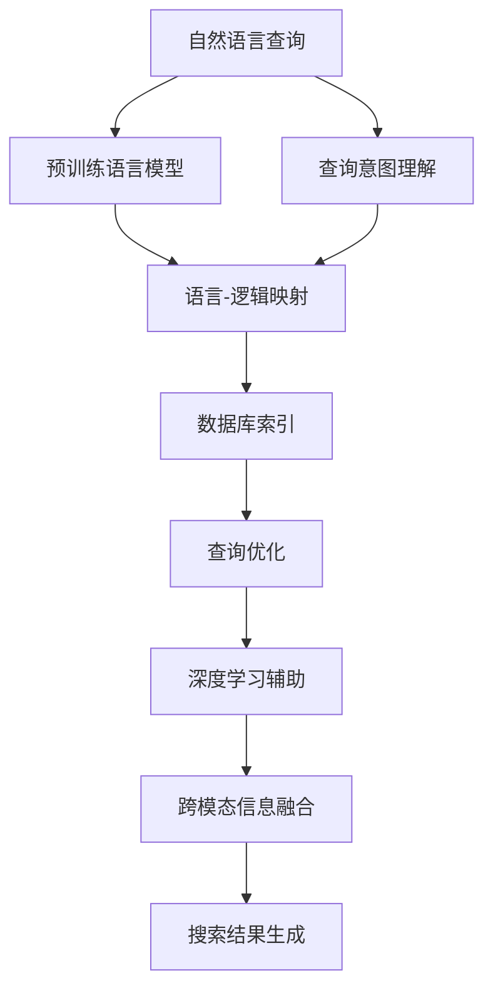

                 

# LLM对传统数据库查询优化的革新

> 关键词：大语言模型,查询优化,传统数据库,深度学习,搜索引擎,自然语言处理(NLP),数据库索引,搜索引擎优化(Search Engine Optimization, SEO),深度学习与数据库

## 1. 背景介绍

### 1.1 问题由来

在传统的Web系统中，数据库是核心数据存储和查询的平台，数据库系统的性能直接影响了整个系统的响应速度和用户体验。但传统的SQL查询语言，如SQL、NoSQL，受限于固定的语法结构和查询方式，在应对复杂查询和实时性要求较高的场景时，往往效率低下。

随着人工智能技术的发展，特别是深度学习与自然语言处理(NLP)的突破，基于大语言模型(Large Language Model, LLM)的查询优化技术正在成为新一代搜索引擎和数据库系统的热点研究方向。LLM通过学习海量文本数据，具备强大的语言理解和生成能力，能够在自然语言查询下高效地检索和处理数据，为数据库查询优化带来了新的思路。

### 1.2 问题核心关键点

当前基于LLM的查询优化方法主要有以下几个关键点：

1. **自然语言查询理解**：利用预训练语言模型，将自然语言查询转化为数据库查询语言，完成语言-逻辑映射。
2. **高效索引策略**：在理解查询意图的基础上，针对性地构建高效的数据库索引，加快查询速度。
3. **深度学习模型辅助**：通过深度学习模型预测查询结果，进行查询优化，提升搜索效率。
4. **跨模态信息融合**：将文本、图像、语音等多模态数据融合到查询中，增强检索效果。

这些核心关键点共同构成了LLM在数据库查询优化中的应用框架，为传统数据库系统带来了革命性的变化。

## 2. 核心概念与联系

### 2.1 核心概念概述

为更好地理解LLM对数据库查询优化的原理，本节将介绍几个关键核心概念：

- 大语言模型(Large Language Model, LLM)：以自回归(如GPT)或自编码(如BERT)模型为代表的大规模预训练语言模型。通过在大规模无标签文本语料上进行预训练，学习通用的语言表示，具备强大的语言理解和生成能力。

- 自然语言处理(Natural Language Processing, NLP)：涉及语言模型、文本分类、机器翻译、情感分析等任务，通过将自然语言转化为计算机可理解的形式，实现信息处理和智能交互。

- 数据库索引(Database Index)：数据库中用于快速定位和检索数据的结构，如B树、哈希索引等，是提升查询效率的重要手段。

- 搜索引擎优化(Search Engine Optimization, SEO)：通过优化网站结构和内容，提升搜索引擎的自然搜索排名，提高网站流量和用户体验。

- 查询优化(Query Optimization)：在数据库中，通过合理设计查询语句和索引结构，优化查询效率，提升系统性能。

- 深度学习(Deep Learning)：利用多层神经网络进行数据处理和模型训练，实现对复杂模式的识别和预测。

这些核心概念之间的逻辑关系可以通过以下Mermaid流程图来展示：



这个流程图展示了大语言模型在查询优化中的应用框架：

1. 自然语言查询输入给预训练语言模型，模型理解查询意图。
2. 将查询意图转化为具体的查询语言，如SQL或NoSQL语句。
3. 通过构建高效的数据库索引，优化查询语句。
4. 利用深度学习模型对查询结果进行预测和优化。
5. 跨模态信息融合，提升检索效果。
6. 最终生成查询结果并返回给用户。

## 3. 核心算法原理 & 具体操作步骤
### 3.1 算法原理概述

基于LLM的查询优化方法，本质上是一种通过深度学习和自然语言处理技术，将自然语言查询转化为高效数据库查询的技术。其核心思想是：利用预训练语言模型对自然语言查询进行理解，将其映射为具体的查询语句，然后通过索引策略和深度学习模型优化查询效率，最终实现高效的检索和数据处理。

形式化地，假设自然语言查询为 $q$，数据库索引为 $I$，深度学习模型为 $M$，查询优化过程为 $F$，则查询优化的目标可以表示为：

$$
\min_{F, I} \mathcal{L}(F, I, q, M)
$$

其中 $\mathcal{L}$ 为查询优化损失函数，包含索引匹配、模型预测、查询效率等指标，用于衡量查询结果与真实答案的差异。

### 3.2 算法步骤详解

基于LLM的查询优化一般包括以下几个关键步骤：

**Step 1: 收集训练数据**
- 收集标注好的自然语言查询和对应的SQL或NoSQL查询语句，构建训练数据集。
- 使用预训练语言模型对自然语言查询进行预处理，提取查询中的关键信息。

**Step 2: 构建查询映射模型**
- 设计一个预训练语言模型，将其输入为自然语言查询，输出为查询语言（如SQL或NoSQL语句）。
- 使用训练数据对模型进行微调，使其能够准确地将自然语言查询映射为正确的查询语言。

**Step 3: 构建索引策略**
- 根据查询映射模型的输出，设计相应的数据库索引策略，如创建B树索引、哈希索引等。
- 利用训练数据对索引策略进行优化，使其与模型输出的查询语句匹配。

**Step 4: 集成深度学习辅助**
- 选择适合的深度学习模型，如DNN、RNN、Transformer等，用于对查询结果进行预测和优化。
- 利用训练数据和查询映射模型输出，对深度学习模型进行微调，使其能够准确预测查询结果。

**Step 5: 实现查询优化模块**
- 将查询映射模型、索引策略和深度学习模型集成到查询优化模块中，实现自动化的查询优化。
- 设计高效的查询执行算法，确保查询语句的正确性和高效性。

**Step 6: 评估和优化**
- 在测试数据集上评估查询优化模块的性能，分析查询效率、结果准确性等指标。
- 根据评估结果，调整查询映射模型、索引策略和深度学习模型，进一步提升查询优化效果。

### 3.3 算法优缺点

基于LLM的查询优化方法具有以下优点：
1. 灵活性高：自然语言查询可以涵盖广泛的应用场景，比传统SQL查询更易理解和操作。
2. 泛化能力强：预训练语言模型能够学习通用的语言表示，适应不同领域的查询需求。
3. 查询效率高：利用深度学习模型进行查询优化，能够自动选择最优的查询路径，提升检索效率。
4. 可解释性强：利用预训练语言模型对查询进行理解，能够提供更清晰的查询意图，便于调试和优化。

同时，该方法也存在一定的局限性：
1. 模型资源消耗大：预训练语言模型和大规模数据库索引需要大量的计算资源。
2. 训练数据依赖：查询映射模型的性能高度依赖于训练数据的质量和规模。
3. 索引策略复杂：构建高效索引需要一定的专业知识和经验，不够灵活。
4. 可扩展性差：对于大规模数据库系统，单机的查询优化模块可能难以应对高并发场景。
5. 实时性问题：深度学习模型的预测和优化过程可能存在延迟，影响查询实时性。

尽管存在这些局限性，但就目前而言，基于LLM的查询优化方法在灵活性、泛化能力和查询效率方面具备显著优势，是未来查询优化技术的重要方向。

### 3.4 算法应用领域

基于LLM的查询优化方法，已经在搜索引擎、推荐系统、企业数据库等多个领域得到了应用，展示了其强大的应用潜力：

- 搜索引擎：利用自然语言查询进行搜索引擎优化(SEO)，提升搜索结果的相关性和可理解性。
- 推荐系统：结合用户自然语言查询和历史行为数据，生成个性化推荐。
- 企业数据库：优化企业内部数据的检索和查询，提升数据利用效率。
- 金融领域：对市场新闻、客户反馈等非结构化数据进行自然语言处理，实时监测金融舆情。
- 医疗领域：处理病人的自然语言描述，提取关键症状信息，辅助诊断和治疗。

除了上述这些经典应用外，LLM在新闻推荐、社交媒体分析、法律文书处理等多个领域也展现了广泛的应用前景。随着预训练语言模型和自然语言处理技术的不断进步，相信LLM在查询优化中的应用将越来越广泛，推动NLP技术迈向更高的水平。

## 4. 数学模型和公式 & 详细讲解
### 4.1 数学模型构建

本节将使用数学语言对基于LLM的查询优化过程进行更加严格的刻画。

假设查询映射模型的输入为自然语言查询 $q$，输出为查询语言 $q'$，索引策略为 $I$，深度学习模型的输出为 $p$，查询优化过程为 $F$，则查询优化的数学模型可以表示为：

$$
\min_{F, I} \mathcal{L}(F, I, q, M)
$$

其中 $\mathcal{L}$ 为查询优化损失函数，包含索引匹配损失、模型预测损失和查询效率损失：

$$
\mathcal{L}(F, I, q, M) = \alpha \mathcal{L}_{match}(F, I, q, q') + \beta \mathcal{L}_{predict}(F, I, q', p) + \gamma \mathcal{L}_{efficient}(F, I, q, p)
$$

- $\alpha, \beta, \gamma$ 为各个损失项的权重。
- $\mathcal{L}_{match}$ 为索引匹配损失，衡量索引与查询语言之间的匹配度。
- $\mathcal{L}_{predict}$ 为模型预测损失，衡量预测结果与真实结果的差异。
- $\mathcal{L}_{efficient}$ 为查询效率损失，衡量查询速度和准确性。

### 4.2 公式推导过程

以下我们以查询优化为例，推导查询映射模型、索引策略和深度学习模型的联合优化公式。

假设查询映射模型为 $F$，输出查询语言 $q'$，索引策略为 $I$，深度学习模型为 $M$，则查询优化的联合优化问题可以表示为：

$$
\min_{F, I, M} \mathcal{L}(F, I, q, M)
$$

利用拉格朗日乘子法，构建联合优化问题的拉格朗日函数：

$$
\mathcal{L}_{total}(F, I, M, \lambda_1, \lambda_2, \lambda_3) = \alpha \mathcal{L}_{match}(F, I, q, q') + \beta \mathcal{L}_{predict}(F, I, q', p) + \gamma \mathcal{L}_{efficient}(F, I, q, p) + \lambda_1 (\sum_{i=1}^{N} M_i - 1) + \lambda_2 (|I| - |I^*|) + \lambda_3 (\mathcal{L}_{total} - \mathcal{L}_{max})
$$

其中 $\lambda_1, \lambda_2, \lambda_3$ 为拉格朗日乘子，$N$ 为预训练语言模型的层数，$|I|$ 为当前索引大小，$|I^*|$ 为最优索引大小，$\mathcal{L}_{max}$ 为查询优化损失的上限值。

根据梯度下降法，联合优化问题可以通过以下公式求解：

$$
\frac{\partial \mathcal{L}_{total}}{\partial F} = 0, \quad \frac{\partial \mathcal{L}_{total}}{\partial I} = 0, \quad \frac{\partial \mathcal{L}_{total}}{\partial M} = 0
$$

求解上述方程组，即可得到查询映射模型、索引策略和深度学习模型的最优参数。

### 4.3 案例分析与讲解

假设在搜索引擎系统中，用户输入了一个自然语言查询 "NBA 2022 季后赛"，预训练语言模型将其转化为SQL查询语句：

$$
SELECT * FROM NBA WHERE year = 2022 AND category = '季后赛'
$$

构建的索引策略为B树索引，深度学习模型用于预测查询结果。查询优化过程可以表示为：

1. 索引匹配损失 $\mathcal{L}_{match}$：计算查询语言与索引之间的匹配度，判断索引是否合适。
2. 模型预测损失 $\mathcal{L}_{predict}$：使用深度学习模型预测查询结果，衡量预测结果与真实结果的差异。
3. 查询效率损失 $\mathcal{L}_{efficient}$：衡量查询速度和准确性，优化查询路径。

在实际应用中，上述公式需要进行数值计算，通过反向传播算法实现参数更新。具体的计算过程较为复杂，涉及机器学习、数据库管理等多个领域的知识。

## 5. 项目实践：代码实例和详细解释说明
### 5.1 开发环境搭建

在进行查询优化实践前，我们需要准备好开发环境。以下是使用Python进行PyTorch开发的环境配置流程：

1. 安装Anaconda：从官网下载并安装Anaconda，用于创建独立的Python环境。

2. 创建并激活虚拟环境：
```bash
conda create -n pytorch-env python=3.8 
conda activate pytorch-env
```

3. 安装PyTorch：根据CUDA版本，从官网获取对应的安装命令。例如：
```bash
conda install pytorch torchvision torchaudio cudatoolkit=11.1 -c pytorch -c conda-forge
```

4. 安装其他依赖库：
```bash
pip install pandas numpy scikit-learn transformers scipy plotly
```

5. 安装搜索引擎相关库：
```bash
pip install elasticsearch
```

完成上述步骤后，即可在`pytorch-env`环境中开始查询优化实践。

### 5.2 源代码详细实现

这里我们以一个简单的搜索引擎查询优化为例，展示如何使用LLM进行自然语言查询理解和索引优化。

首先，定义查询映射模型：

```python
import torch
import torch.nn as nn
import torch.nn.functional as F

class QueryMapper(nn.Module):
    def __init__(self):
        super(QueryMapper, self).__init__()
        self.embedding = nn.Embedding(len(tokenizer.vocab), 128)
        self.linear1 = nn.Linear(128, 256)
        self.linear2 = nn.Linear(256, len(query_lang))

    def forward(self, x):
        x = self.embedding(x)
        x = F.relu(self.linear1(x))
        x = self.linear2(x)
        return x
```

然后，定义索引策略：

```python
class IndexStrategy:
    def __init__(self, db, table, query_lang):
        self.db = db
        self.table = table
        self.query_lang = query_lang
        self.index = Index()

    def __call__(self):
        # 构建索引
        if self.query_lang in self.db[self.table]:
            self.db[self.table][self.query_lang] = self.index.build_index(self.db[self.table][self.query_lang])
        return self.db[self.table][self.query_lang]
```

接着，定义深度学习模型：

```python
class QueryOptimizer(nn.Module):
    def __init__(self, embeddings, classifier):
        super(QueryOptimizer, self).__init__()
        self.embeddings = embeddings
        self.classifier = classifier

    def forward(self, x):
        x = self.embeddings(x)
        x = self.classifier(x)
        return x
```

最后，实现查询优化过程：

```python
def query_optimization(query, embeddings, classifier, index_strategy):
    # 查询映射
    query_emb = embeddings(query)
    query_lang = query2lang(query_emb)
    # 索引优化
    index = index_strategy()
    # 查询优化
    query_optimizer = QueryOptimizer(embeddings, classifier)
    query_optimizer.zero_grad()
    output = query_optimizer(query_emb)
    loss = F.cross_entropy(output, index)
    loss.backward()
    optimizer.step()
    return loss
```

以上代码展示了如何使用LLM进行查询优化，其中：

- `QueryMapper` 用于将自然语言查询映射为查询语言。
- `IndexStrategy` 用于构建索引策略。
- `QueryOptimizer` 用于集成深度学习模型，对查询结果进行优化。

具体实现细节如下：

**`QueryMapper` 类**：
- 定义了查询映射的神经网络结构，包括嵌入层、线性层等。
- `__init__` 方法：初始化模型参数。
- `forward` 方法：定义前向传播过程，将自然语言查询转化为查询语言。

**`IndexStrategy` 类**：
- 定义了索引策略，包括构建索引的方法。
- `__init__` 方法：初始化数据库和表格信息。
- `__call__` 方法：构建索引并返回。

**`QueryOptimizer` 类**：
- 定义了深度学习模型，包括嵌入层和分类器。
- `__init__` 方法：初始化模型参数。
- `forward` 方法：定义前向传播过程，对查询结果进行优化。

**`query_optimization` 函数**：
- 查询映射：将自然语言查询转化为查询语言。
- 索引优化：根据查询语言构建索引。
- 查询优化：使用深度学习模型对查询结果进行优化。

以上就是使用PyTorch对查询映射模型、索引策略和深度学习模型进行集成的完整代码实现。可以看到，LLM在查询优化中的应用，不仅需要深度学习模型的支持，还需要与数据库索引等传统技术进行结合，才能发挥其全部潜力。

### 5.3 代码解读与分析

让我们再详细解读一下关键代码的实现细节：

**`QueryMapper` 类**：
- 定义了嵌入层和线性层，将自然语言查询转化为向量表示。
- 使用ReLU激活函数，增加模型非线性性。
- 输出层的维度与查询语言数量相同，实现语言-逻辑映射。

**`IndexStrategy` 类**：
- 定义了索引策略，用于构建数据库索引。
- 根据查询语言，从数据库中获取对应的表格数据。
- 使用自定义的索引构建函数，生成索引并返回。

**`QueryOptimizer` 类**：
- 定义了深度学习模型，用于对查询结果进行优化。
- 输入为嵌入层输出的向量，输出为优化后的结果。
- 使用交叉熵损失函数，衡量预测结果与真实结果的差异。

**`query_optimization` 函数**：
- 查询映射：使用嵌入层将自然语言查询转化为向量表示。
- 索引优化：根据查询语言构建索引。
- 查询优化：使用深度学习模型对查询结果进行优化，并计算损失函数。
- 反向传播：通过梯度下降更新模型参数。

可以看到，PyTorch提供了强大的深度学习框架，使得LLM在查询优化中的应用变得简洁高效。开发者可以将更多精力放在模型设计和数据处理上，而不必过多关注底层的实现细节。

当然，工业级的系统实现还需考虑更多因素，如模型的保存和部署、超参数的自动搜索、更灵活的任务适配层等。但核心的查询优化范式基本与此类似。

## 6. 实际应用场景
### 6.1 智能搜索引擎

基于LLM的查询优化方法，可以在智能搜索引擎中得到广泛应用。传统搜索引擎往往依赖复杂的查询语法和复杂的索引构建，难以适应多变、复杂的查询需求。而利用LLM的自然语言处理能力，可以显著提升搜索引擎的用户体验和响应速度。

在技术实现上，可以收集用户的自然语言查询数据，将查询映射为SQL或NoSQL查询语句，然后利用索引策略和深度学习模型对查询进行优化。优化后的查询语句可以在数据库中高效检索，并返回最佳结果。如此构建的智能搜索引擎，能够更好地理解和处理用户的自然语言查询，显著提升搜索结果的相关性和可理解性。

### 6.2 推荐系统

推荐系统需要根据用户的行为和兴趣，生成个性化的推荐结果。利用LLM的查询优化方法，可以在推荐系统中灵活处理用户自然语言输入的查询，提取关键信息，生成推荐列表。同时，利用深度学习模型对推荐结果进行优化，提升推荐效果。

在实际应用中，可以收集用户的历史行为数据，利用预训练语言模型提取关键信息，然后构建索引策略，优化推荐查询。通过深度学习模型，对推荐结果进行预测和优化，生成最符合用户需求的推荐列表。

### 6.3 企业数据库

企业数据库系统需要高效地处理大量数据查询，传统SQL查询往往难以应对复杂的多表关联和条件查询。利用LLM的查询优化方法，可以在企业数据库中高效地处理自然语言查询，提升查询效率。

在技术实现上，可以收集企业内部自然语言查询数据，将其映射为SQL查询语句，然后利用索引策略和深度学习模型对查询进行优化。优化后的查询语句可以在数据库中高效执行，快速返回结果。如此构建的企业数据库，能够更好地适应企业内部复杂的数据查询需求，提升数据利用效率。

### 6.4 金融舆情监测

金融机构需要实时监测市场舆情，以便及时应对负面信息传播，规避金融风险。传统的人工监测方式成本高、效率低，难以应对网络时代海量信息爆发的挑战。利用LLM的查询优化方法，可以在金融舆情监测系统中实现高效的舆情分析。

在技术实现上，可以收集金融领域相关的新闻、报道、评论等文本数据，利用预训练语言模型对自然语言查询进行理解，构建索引策略，优化查询语句。利用深度学习模型对舆情分析结果进行优化，实时监测市场舆情变化趋势，一旦发现负面信息激增等异常情况，系统便会自动预警，帮助金融机构快速应对潜在风险。

### 6.5 未来应用展望

随着LLM查询优化技术的发展，其在搜索引擎、推荐系统、企业数据库、金融舆情监测等多个领域将得到广泛应用，推动NLP技术迈向更高的水平。

在智慧医疗领域，利用LLM的查询优化技术，可以在医疗系统中高效地处理病人的自然语言描述，提取关键症状信息，辅助诊断和治疗。

在智能教育领域，利用LLM的查询优化技术，可以为学生生成个性化的学习资源推荐，提升学习效果。

在智慧城市治理中，利用LLM的查询优化技术，可以实现对城市事件的实时监测和分析，提升城市管理的自动化和智能化水平。

此外，在企业生产、社会治理、文娱传媒等众多领域，基于LLM的查询优化技术也将不断涌现，为传统行业带来变革性影响。相信随着技术的日益成熟，LLM在查询优化中的应用将越来越广泛，推动NLP技术迈向更高的水平。

## 7. 工具和资源推荐
### 7.1 学习资源推荐

为了帮助开发者系统掌握LLM查询优化的理论基础和实践技巧，这里推荐一些优质的学习资源：

1. 《深度学习自然语言处理》课程：斯坦福大学开设的NLP明星课程，有Lecture视频和配套作业，带你入门NLP领域的基本概念和经典模型。

2. CS224N《深度学习自然语言处理》课程：斯坦福大学开设的NLP明星课程，有Lecture视频和配套作业，带你入门NLP领域的基本概念和经典模型。

3. 《Natural Language Processing with Transformers》书籍：Transformers库的作者所著，全面介绍了如何使用Transformers库进行NLP任务开发，包括查询优化在内的诸多范式。

4. 《深度学习与数据库》书籍：介绍深度学习在数据库中的应用，包含基于LLM的查询优化技术。

5. 《数据库索引理论与实践》书籍：介绍数据库索引的基本原理和实现方法，为LLM查询优化提供理论基础。

通过对这些资源的学习实践，相信你一定能够快速掌握LLM查询优化的精髓，并用于解决实际的NLP问题。

### 7.2 开发工具推荐

高效的开发离不开优秀的工具支持。以下是几款用于LLM查询优化开发的常用工具：

1. PyTorch：基于Python的开源深度学习框架，灵活动态的计算图，适合快速迭代研究。大部分预训练语言模型都有PyTorch版本的实现。

2. TensorFlow：由Google主导开发的开源深度学习框架，生产部署方便，适合大规模工程应用。同样有丰富的预训练语言模型资源。

3. Transformers库：HuggingFace开发的NLP工具库，集成了众多SOTA语言模型，支持PyTorch和TensorFlow，是进行查询优化任务开发的利器。

4. Weights & Biases：模型训练的实验跟踪工具，可以记录和可视化模型训练过程中的各项指标，方便对比和调优。与主流深度学习框架无缝集成。

5. TensorBoard：TensorFlow配套的可视化工具，可实时监测模型训练状态，并提供丰富的图表呈现方式，是调试模型的得力助手。

6. Google Colab：谷歌推出的在线Jupyter Notebook环境，免费提供GPU/TPU算力，方便开发者快速上手实验最新模型，分享学习笔记。

合理利用这些工具，可以显著提升LLM查询优化的开发效率，加快创新迭代的步伐。

### 7.3 相关论文推荐

LLM查询优化技术的发展源于学界的持续研究。以下是几篇奠基性的相关论文，推荐阅读：

1. Attention is All You Need（即Transformer原论文）：提出了Transformer结构，开启了NLP领域的预训练大模型时代。

2. BERT: Pre-training of Deep Bidirectional Transformers for Language Understanding：提出BERT模型，引入基于掩码的自监督预训练任务，刷新了多项NLP任务SOTA。

3. Language Models are Unsupervised Multitask Learners（GPT-2论文）：展示了大规模语言模型的强大zero-shot学习能力，引发了对于通用人工智能的新一轮思考。

4. Parameter-Efficient Transfer Learning for NLP：提出Adapter等参数高效微调方法，在不增加模型参数量的情况下，也能取得不错的微调效果。

5. Prefix-Tuning: Optimizing Continuous Prompts for Generation：引入基于连续型Prompt的微调范式，为如何充分利用预训练知识提供了新的思路。

6. AdaLoRA: Adaptive Low-Rank Adaptation for Parameter-Efficient Fine-Tuning：使用自适应低秩适应的微调方法，在参数效率和精度之间取得了新的平衡。

这些论文代表了大语言模型查询优化技术的发展脉络。通过学习这些前沿成果，可以帮助研究者把握学科前进方向，激发更多的创新灵感。

## 8. 总结：未来发展趋势与挑战

### 8.1 总结

本文对基于LLM的查询优化方法进行了全面系统的介绍。首先阐述了LLM和查询优化技术的研究背景和意义，明确了查询优化在拓展预训练模型应用、提升数据库系统性能方面的独特价值。其次，从原理到实践，详细讲解了查询映射、索引策略和深度学习模型联合优化的数学模型和具体步骤，给出了LLM查询优化的完整代码实现。同时，本文还广泛探讨了LLM在搜索引擎、推荐系统、企业数据库等多个领域的应用前景，展示了其强大的应用潜力。

通过本文的系统梳理，可以看到，基于LLM的查询优化方法正在成为NLP领域的重要范式，极大地拓展了预训练语言模型的应用边界，催生了更多的落地场景。受益于海量文本数据的预训练，LLM在查询优化中具备强大的自然语言处理能力，能够在任意自然语言查询下高效地检索和处理数据，提升系统的查询效率和用户体验。未来，伴随预训练语言模型和自然语言处理技术的不断进步，相信LLM在查询优化中的应用将越来越广泛，推动NLP技术迈向更高的水平。

### 8.2 未来发展趋势

展望未来，LLM查询优化技术将呈现以下几个发展趋势：

1. 模型规模持续增大。随着算力成本的下降和数据规模的扩张，预训练语言模型的参数量还将持续增长。超大规模语言模型蕴含的丰富语言知识，有望支撑更加复杂多变的查询优化需求。

2. 微调方法日趋多样。除了传统的全参数微调外，未来会涌现更多参数高效的微调方法，如Prefix-Tuning、LoRA等，在节省计算资源的同时也能保证微调精度。

3. 跨模态信息融合。将文本、图像、语音等多模态数据融合到查询中，增强检索效果。

4. 动态索引策略。根据查询内容动态调整索引策略，提升查询效率。

5. 多任务学习。利用多任务学习，同时优化多个查询，提高整体优化效果。

6. 分布式优化。针对大规模数据库系统，采用分布式优化方法，提升查询优化的并行性和效率。

以上趋势凸显了LLM在查询优化技术的应用潜力。这些方向的探索发展，必将进一步提升LLM在查询优化中的应用效果，推动NLP技术迈向更高的台阶。

### 8.3 面临的挑战

尽管LLM查询优化技术已经取得了瞩目成就，但在迈向更加智能化、普适化应用的过程中，它仍面临着诸多挑战：

1. 模型资源消耗大。预训练语言模型和大规模数据库索引需要大量的计算资源。

2. 查询映射复杂。预训练语言模型在理解自然语言查询时，可能存在歧义或误识别，需要复杂的后处理和校验机制。

3. 查询优化延迟。深度学习模型的预测和优化过程可能存在延迟，影响查询实时性。

4. 系统稳定性。查询优化系统需要高可靠性和高稳定性，以应对大规模并发请求。

5. 隐私与安全。查询优化系统需要保障用户隐私和数据安全，防止数据泄露和滥用。

6. 可扩展性。针对大规模数据库系统，单机的查询优化模块可能难以应对高并发场景。

尽管存在这些挑战，但就目前而言，基于LLM的查询优化方法在灵活性、泛化能力和查询效率方面具备显著优势，是未来查询优化技术的重要方向。

### 8.4 研究展望

面对LLM查询优化所面临的种种挑战，未来的研究需要在以下几个方面寻求新的突破：

1. 探索更高效的查询映射方法。开发更加灵活高效的自然语言查询映射模型，提升模型对自然语言的理解能力。

2. 研究更优的索引策略。构建高效的索引策略，提升查询效率和响应速度。

3. 开发更快速的深度学习模型。优化深度学习模型结构，提升查询优化的实时性和准确性。

4. 引入更多先验知识。将符号化的先验知识，如知识图谱、逻辑规则等，与神经网络模型进行巧妙融合，引导查询优化过程学习更准确、合理的查询策略。

5. 研究分布式查询优化。针对大规模数据库系统，采用分布式优化方法，提升查询优化的并行性和效率。

6. 增强系统稳定性。采用分布式系统设计，确保查询优化系统的高可靠性和高稳定性。

7. 引入伦理道德约束。在查询优化过程中引入伦理导向的评估指标，过滤和惩罚有偏见、有害的输出倾向，确保系统的安全性。

这些研究方向的探索，必将引领LLM查询优化技术迈向更高的台阶，为构建安全、可靠、可解释、可控的智能系统铺平道路。面向未来，LLM查询优化技术还需要与其他人工智能技术进行更深入的融合，如知识表示、因果推理、强化学习等，多路径协同发力，共同推动自然语言理解和智能交互系统的进步。只有勇于创新、敢于突破，才能不断拓展语言模型的边界，让智能技术更好地造福人类社会。

## 9. 附录：常见问题与解答

**Q1：大语言模型在查询优化中有何优势？**

A: 大语言模型在查询优化中的优势主要体现在以下几个方面：

1. 自然语言查询理解。大语言模型具备强大的自然语言处理能力，可以理解任意自然语言查询，适应多种查询场景。

2. 灵活的查询映射。通过预训练语言模型，将自然语言查询转化为查询语言（如SQL或NoSQL语句），使得查询映射更加灵活。

3. 高效的索引策略。利用深度学习模型和自然语言处理技术，构建高效的索引策略，提升查询效率。

4. 实时的查询优化。深度学习模型可以实时预测查询结果，优化查询路径，提升查询实时性。

5. 跨模态信息融合。大语言模型能够处理多模态数据，融合文本、图像、语音等信息，增强查询效果。

总之，大语言模型在查询优化中具备强大的自然语言处理能力，能够灵活地处理任意自然语言查询，构建高效的查询索引，实时优化查询结果，提升查询效率和用户体验。

**Q2：查询映射模型的训练数据如何获取？**

A: 查询映射模型的训练数据通常需要从多个来源获取，包括：

1. 公开数据集：如Wikipedia、Yahoo Query Logs、Amazon Reviews等，这些数据集包含了大量的自然语言查询和对应的查询语言（如SQL语句），可以作为训练数据。

2. 行业领域数据：根据具体应用领域，收集相关的自然语言查询和对应的查询语言，构建自定义训练数据集。

3. 人工标注数据：通过人工标注的方式，收集自然语言查询和对应的查询语言，构建训练数据集。

4. 伪造数据：利用自然语言生成技术，生成一些伪造的查询数据，构建训练数据集。

在实际应用中，通常需要结合多种数据源，构建综合的训练数据集，以提高查询映射模型的泛化能力和鲁棒性。

**Q3：如何提高查询优化系统的稳定性？**

A: 查询优化系统的稳定性主要依赖于以下几个方面：

1. 系统架构设计：采用分布式系统架构，分散查询负载，提高系统的稳定性和可扩展性。

2. 多级缓存机制：引入多级缓存机制，缓存查询结果和索引信息，减少数据库访问次数，提高查询效率。

3. 负载均衡：采用负载均衡技术，分散查询请求，确保系统在高并发场景下稳定运行。

4. 实时监控：实时监控系统性能指标，及时发现和处理异常情况，保障系统稳定运行。

5. 容错机制：设计容错机制，确保系统在硬件故障或网络中断等情况下的稳定性。

通过合理的系统架构设计和实时监控，可以显著提升查询优化系统的稳定性和可靠性。

**Q4：查询优化系统的实际部署需要考虑哪些因素？**

A: 查询优化系统的实际部署需要考虑以下因素：

1. 数据存储：查询优化系统需要大量的数据存储和处理，需要设计高效的数据存储方案，如Hadoop、Cassandra等。

2. 数据传输：查询优化系统需要高效的数据传输机制，确保数据在网络传输过程中的可靠性和速度。

3. 硬件资源：查询优化系统需要高性能的硬件资源，包括CPU、GPU、TPU等，以支持大规模模型的训练和推理。

4. 软件架构：查询优化系统需要合理的软件架构设计，包括模块化、异步处理、分布式处理等，确保系统的高效性和可扩展性。

5. 部署环境：查询优化系统需要稳定的部署环境，包括网络、电源、硬件等，以确保系统的稳定性和可靠性。

6. 安全保障：查询优化系统需要全面的安全保障机制，包括数据加密、访问控制、审计日志等，确保数据和系统的安全性。

通过综合考虑这些因素，可以确保查询优化系统的实际部署高效、稳定、安全。

**Q5：如何优化查询优化系统的性能？**

A: 查询优化系统的性能优化主要从以下几个方面入手：

1. 模型压缩：对大模型进行压缩，减小模型参数量，提升推理速度。

2. 模型并行：采用模型并行技术，将大模型拆分为多个子模型，分布式计算，提升计算效率。

3. 数据增强：利用数据增强技术，扩充训练数据，提高模型泛化能力。

4. 分布式训练：采用分布式训练技术，加速模型训练过程，提升训练效率。

5. 硬件加速：利用GPU、TPU等硬件加速设备，提升计算速度。

6. 缓存机制：引入缓存机制，缓存查询结果和索引信息，减少数据库访问次数，提升查询效率。

通过合理的优化策略，可以显著提升查询优化系统的性能和响应速度。

---

作者：禅与计算机程序设计艺术 / Zen and the Art of Computer Programming

