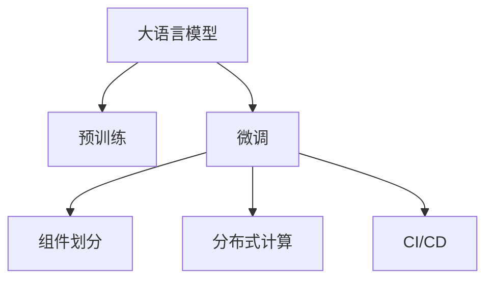

                 

# LLM对传统软件架构设计的挑战与创新

## 1. 背景介绍

随着人工智能(AI)技术的迅猛发展，特别是在自然语言处理(NLP)领域的突破，大语言模型(LLM)逐渐成为推动AI应用落地的重要工具。LLM如GPT-3、BERT等，已经展示出强大的文本理解和生成能力，被广泛应用于智能客服、文本摘要、机器翻译等多个领域。然而，尽管LLM在技术上取得了一系列突破，其在传统软件架构设计中的应用仍然面临许多挑战，急需创新以释放其全部潜力。

## 2. 核心概念与联系

### 2.1 核心概念概述

要深入探讨LLM对传统软件架构设计的挑战与创新，首先需明确几个核心概念：

- **大语言模型(LLM)**：利用自回归或自编码模型在大规模无标签文本数据上进行预训练的语言模型。它具备丰富的语言知识和理解能力，能够对文本进行生成、分类、推理等复杂任务。

- **微调(Fine-tuning)**：在大规模预训练模型基础上，使用特定任务的数据对模型进行进一步训练，以提升模型在该任务上的性能。微调通常通过有监督学习方法实现。

- **软件架构设计**：设计软件系统的总体结构，包括组件划分、数据流控制、交互方式等，是确保软件可维护性、可扩展性和可复用性的关键。

- **分布式计算**：将任务划分为多个子任务，分别部署在不同计算节点上并行处理，以提高计算效率和系统稳定性。

- **持续集成/持续部署(CI/CD)**：自动化软件开发和部署流程，提高软件开发效率和系统更新频率。

### 2.2 核心概念原理和架构的 Mermaid 流程图



这个流程图简明扼要地展示了LLM在传统软件架构设计中的位置和作用：预训练和微调作为LLM的核心技术，为组件划分、分布式计算和CI/CD等软件架构设计元素提供了强有力的支持。

## 3. 核心算法原理 & 具体操作步骤

### 3.1 算法原理概述

LLM在传统软件架构设计中的应用，主要通过以下核心算法原理实现：

- **预训练-微调模型**：通过在大规模无标签数据上进行预训练，学习通用的语言表示；然后通过特定任务的数据进行微调，提高模型在该任务上的性能。这种预训练-微调范式，使得LLM能够快速适应新任务，提升性能。

- **组件划分与任务适配层**：在微调过程中，将预训练模型的组件划分（如BERT的嵌入层、卷积层和分类层）与任务需求相适配，添加相应的任务适配层（如分类层或解码器）。

- **分布式计算优化**：利用分布式计算框架如TensorFlow、PyTorch等，将LLM模型的前向传播、后向传播和参数更新等操作分布在多个计算节点上进行，以提高计算效率和系统稳定性。

- **持续集成/持续部署**：通过自动化工具如Jenkins、GitLab CI等，实现LLM模型的自动构建、测试和部署，加速模型的迭代开发和应用部署。

### 3.2 算法步骤详解

基于LLM的架构设计，通常包括以下几个关键步骤：

1. **准备数据和环境**：收集特定任务的数据集，安装必要的工具和库，如TensorFlow、PyTorch、Jenkins等。

2. **模型选择与预训练**：选择合适的预训练模型（如BERT、GPT-3等），并对其进行预训练。

3. **微调模型**：根据特定任务，设计合适的任务适配层，使用微调数据集对模型进行进一步训练，优化模型参数。

4. **组件划分与设计**：将微调后的模型组件划分为不同的服务模块，如词向量提取、句子嵌入、分类器等，设计合理的组件交互协议。

5. **分布式计算部署**：利用分布式计算框架，将模型组件部署到多个计算节点上，并配置网络通信协议。

6. **CI/CD自动化**：搭建CI/CD系统，自动触发模型的构建、测试和部署流程，提升开发效率。

### 3.3 算法优缺点

基于LLM的软件架构设计，具有以下优点：

- **高效性能**：利用分布式计算技术，可以大幅提升模型的训练和推理速度，满足实时性需求。

- **广泛适用**：适用于多种自然语言处理任务，如文本分类、命名实体识别、机器翻译等，只需设计合适的任务适配层即可。

- **灵活配置**：通过组件划分，可以灵活配置模型组件，适应不同规模和复杂度的任务需求。

- **持续优化**：通过CI/CD系统，实现模型的持续集成和持续部署，保持系统的高效性和可靠性。

然而，该方法也存在以下局限性：

- **高成本**：预训练和微调模型需要大量计算资源和存储资源，成本较高。

- **模型复杂度**：预训练和微调模型的复杂性较高，设计不当可能导致性能下降。

- **可解释性不足**：预训练和微调模型通常是黑盒系统，难以解释其内部工作机制。

### 3.4 算法应用领域

LLM在传统软件架构设计中的应用领域广泛，包括但不限于以下几方面：

- **智能客服**：利用微调后的LLM模型，自动回答客户咨询，提高客服效率和满意度。

- **自然语言生成**：利用LLM生成文本摘要、翻译、对话等，满足特定需求。

- **文档处理**：利用微调后的LLM模型，自动识别文档结构、提取关键信息、生成文档摘要等。

- **情感分析**：利用微调后的LLM模型，分析用户情感，提升用户体验。

## 4. 数学模型和公式 & 详细讲解

### 4.1 数学模型构建

基于LLM的软件架构设计，可以构建如下数学模型：

$$
M_{\text{output}} = M_{\text{pre-trained}}\circ M_{\text{task-specific}}
$$

其中，$M_{\text{output}}$ 表示输出层，$M_{\text{pre-trained}}$ 表示预训练模型，$M_{\text{task-specific}}$ 表示任务适配层。

### 4.2 公式推导过程

以文本分类任务为例，推导输出层损失函数：

假设预训练模型输出为 $M_{\text{pre-trained}}(x)$，任务适配层输出为 $M_{\text{task-specific}}(M_{\text{pre-trained}}(x))$，则输出层的损失函数为：

$$
\mathcal{L}(y,\hat{y}) = \frac{1}{N}\sum_{i=1}^N -y_i\log\hat{y}_i
$$

其中，$y_i$ 表示真实标签，$\hat{y}_i$ 表示模型预测概率。

### 4.3 案例分析与讲解

在文本分类任务中，可以将预训练模型和任务适配层分为以下步骤：

1. 预训练模型的嵌入层和编码器输出文本特征向量。

2. 任务适配层的分类器将文本特征向量映射到类别概率分布。

3. 利用交叉熵损失函数计算输出层的损失，反向传播更新模型参数。

## 5. 项目实践：代码实例和详细解释说明

### 5.1 开发环境搭建

搭建LLM软件架构设计的环境，通常需要以下步骤：

1. 安装Python、pip等必要工具。

2. 安装TensorFlow、PyTorch等深度学习库。

3. 安装Jenkins、GitLab CI等自动化部署工具。

4. 配置分布式计算环境，如Apache Spark、Apache Hadoop等。

### 5.2 源代码详细实现

以下是一个基于LLM的文本分类模型的Python代码实现：

```python
import tensorflow as tf
from transformers import BertForSequenceClassification, BertTokenizer

model = BertForSequenceClassification.from_pretrained('bert-base-cased', num_labels=2)
tokenizer = BertTokenizer.from_pretrained('bert-base-cased')

def compute_loss(y_true, y_pred):
    loss = tf.keras.losses.categorical_crossentropy(y_true, y_pred)
    return tf.reduce_mean(loss)

@tf.function
def train_step(input_ids, attention_mask, labels):
    with tf.GradientTape() as tape:
        outputs = model(input_ids, attention_mask=attention_mask)
        loss = compute_loss(labels, outputs.logits)
    gradients = tape.gradient(loss, model.trainable_variables)
    optimizer.apply_gradients(zip(gradients, model.trainable_variables))

# 训练代码略
```

### 5.3 代码解读与分析

代码中的 `BertForSequenceClassification` 类，用于构建文本分类模型。`BertTokenizer` 类，用于分词和构建输入特征。`compute_loss` 函数，用于计算损失。`train_step` 函数，用于训练模型。

通过以上代码，我们可以构建一个基于BERT的文本分类模型，并进行训练。在训练过程中，模型会自动生成损失，并通过梯度下降算法优化模型参数。

### 5.4 运行结果展示

训练完成后，可以通过调用模型进行文本分类预测，如下所示：

```python
def predict(text):
    input_ids = tokenizer.encode_plus(text, max_length=128, padding='max_length', truncation=True, return_tensors='tf')
    outputs = model(input_ids['input_ids'], attention_mask=input_ids['attention_mask'])
    return tf.argmax(outputs.logits, axis=1).numpy()

text = "这是一篇关于机器学习的文章。"
print(predict(text))
```

## 6. 实际应用场景

### 6.1 智能客服

智能客服系统通常需要处理大量客户咨询，利用LLM微调技术，可以实现自动回答客户咨询，提升客服效率和满意度。例如，可以使用BERT模型在历史对话数据上进行微调，构建一个智能客服聊天机器人，自动回答客户问题。

### 6.2 自然语言生成

自然语言生成是LLM的重要应用领域，通过微调技术，可以生成高质量的文本摘要、翻译、对话等。例如，可以使用GPT模型在特定领域数据上进行微调，生成自然流畅的文本内容。

### 6.3 文档处理

利用LLM的文档处理能力，可以实现文档自动分类、关键信息提取、生成文档摘要等。例如，可以使用BERT模型在结构化文档数据上进行微调，自动提取文档中的关键信息。

### 6.4 情感分析

情感分析是NLP领域的重要任务，通过微调技术，可以自动分析用户情感，提升用户体验。例如，可以使用LSTM模型在用户评论数据上进行微调，自动分析用户情感倾向。

## 7. 工具和资源推荐

### 7.1 学习资源推荐

1. TensorFlow官方文档：提供完整的TensorFlow框架教程和示例代码。

2. PyTorch官方文档：提供详细的PyTorch框架教程和示例代码。

3. HuggingFace Transformers库官方文档：提供各种预训练模型的API接口和示例代码。

4. Google Colab：提供免费的GPU计算环境，方便进行深度学习实验。

5. Stanford NLP课程：提供深入浅出的自然语言处理课程内容。

### 7.2 开发工具推荐

1. TensorFlow：提供灵活的计算图和自动微分功能，适合复杂模型的构建和优化。

2. PyTorch：提供动态计算图和模块化设计，适合快速原型开发和迭代。

3. Jenkins：提供自动化持续集成和持续部署功能，提升开发效率。

4. GitLab CI：提供CI/CD自动化流水线管理，支持多种部署模式。

5. Apache Spark：提供分布式计算框架，适合大规模数据处理。

### 7.3 相关论文推荐

1. Attention is All You Need：提出Transformer结构，开启预训练大模型的时代。

2. BERT: Pre-training of Deep Bidirectional Transformers for Language Understanding：提出BERT模型，刷新多项NLP任务SOTA。

3. SOTA模型论文：如BERT、GPT-3等。

4. 深度学习框架比较论文：如TensorFlow与PyTorch的比较等。

5. 分布式计算框架论文：如Spark与Hadoop的比较等。

## 8. 总结：未来发展趋势与挑战

### 8.1 总结

基于LLM的软件架构设计，能够将深度学习模型与传统软件架构相结合，实现高性能、高可靠性的自然语言处理应用。然而，LLM在应用过程中仍面临一些挑战，需要不断探索和创新。

### 8.2 未来发展趋势

1. **分布式计算**：未来将进一步优化分布式计算框架，提高计算效率和系统稳定性。

2. **模型可解释性**：通过引入可解释性算法，提升模型的可解释性，满足应用需求。

3. **多模态融合**：将视觉、音频等多模态信息与文本信息进行融合，提升模型的理解和生成能力。

4. **自适应学习**：引入自适应学习算法，使得模型能够动态调整参数，适应不断变化的环境和数据。

5. **联邦学习**：利用联邦学习技术，实现数据隐私保护和模型协同训练。

### 8.3 面临的挑战

1. **高成本**：预训练和微调模型的计算资源和存储资源需求高，成本较高。

2. **模型复杂度**：模型设计复杂，可能导致性能下降。

3. **数据隐私**：预训练和微调模型需要大量数据，数据隐私保护问题需重视。

4. **可解释性不足**：模型通常是黑盒系统，难以解释其内部工作机制。

### 8.4 研究展望

未来研究应关注以下几方面：

1. **分布式计算优化**：进一步优化分布式计算框架，提升计算效率和系统稳定性。

2. **模型可解释性**：引入可解释性算法，提升模型的可解释性，满足应用需求。

3. **多模态融合**：将视觉、音频等多模态信息与文本信息进行融合，提升模型的理解和生成能力。

4. **自适应学习**：引入自适应学习算法，使得模型能够动态调整参数，适应不断变化的环境和数据。

5. **联邦学习**：利用联邦学习技术，实现数据隐私保护和模型协同训练。

## 9. 附录：常见问题与解答

**Q1: 预训练和微调模型是否适用于所有任务？**

A: 预训练和微调模型适用于大多数NLP任务，如文本分类、命名实体识别、机器翻译等。但对于一些特定领域的任务，可能需要进一步预训练和微调，以获得理想效果。

**Q2: 如何选择预训练模型和微调数据集？**

A: 选择合适的预训练模型和微调数据集，需要考虑任务类型、数据规模、计算资源等因素。预训练模型通常选择规模大、性能优的模型，微调数据集则需与任务需求相匹配。

**Q3: 如何评估微调模型的性能？**

A: 评估微调模型的性能，通常使用准确率、召回率、F1分数等指标。同时，还需要进行交叉验证，确保模型在不同数据集上的泛化能力。

**Q4: 如何优化分布式计算性能？**

A: 优化分布式计算性能，需要考虑任务划分、数据传输、计算资源分配等因素。同时，可以使用数据并行、模型并行、混合并行等技术，提升计算效率和系统稳定性。

**Q5: 如何实现模型自适应学习？**

A: 实现模型自适应学习，需要引入自适应学习算法，如Adagrad、Adam等。同时，可以通过在线学习、增量学习等技术，使得模型能够动态调整参数，适应不断变化的环境和数据。

---

作者：禅与计算机程序设计艺术 / Zen and the Art of Computer Programming

