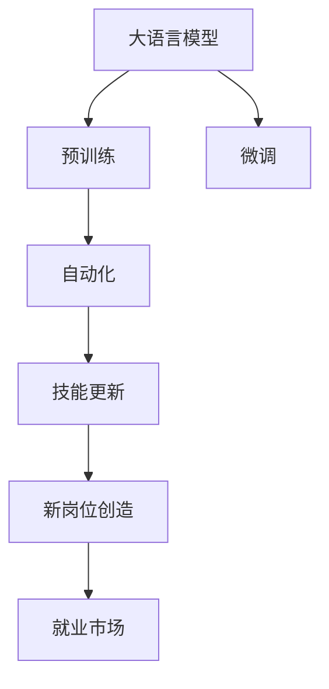

                 

# LLM对就业市场的潜在影响

大语言模型（LLM）在自然语言处理（NLP）领域的崛起，正在引发一场新的工业革命。这些模型，如GPT-3、BERT等，以其强大的语言理解与生成能力，为各行各业提供了前所未有的机遇。然而，LLM的广泛应用也将不可避免地对就业市场产生深远的影响。本文将系统性地探讨LLM在多个行业中的应用，分析其对就业市场的影响，并展望未来可能的趋势。

## 1. 背景介绍

### 1.1 问题的由来

大语言模型技术的迅猛发展，特别是OpenAI的GPT-3，不仅在学术界引起了轰动，更在工业界引发了广泛关注。通过在庞大的无标签文本数据集上预训练，这些模型能够在各种NLP任务上达到甚至超越人类专家的水平。随着LLM技术的日益成熟，其应用范围从简单的文本生成，拓展到了法律咨询、医疗诊断、金融分析等专业领域。

### 1.2 问题核心关键点

LLM对就业市场的影响是一个多维度的问题，涉及到技术应用、行业变革、就业结构变化等多个层面。关键点包括：
1. **自动化程度**：LLM能够自动完成哪些原本需要人类参与的任务？
2. **技能要求**：LLM的广泛应用是否会导致某些行业劳动力的过剩？
3. **新岗位创造**：LLM的应用是否会创造新的就业机会？
4. **伦理与隐私**：LLM在应用过程中如何平衡技术进步与伦理道德？

### 1.3 问题研究意义

研究LLM对就业市场的影响，对于理解未来劳动市场的发展趋势、制定相关政策和规范、以及指导教育与培训方向具有重要意义。LLM的普及可能改变现有的就业格局，为劳动力市场带来新的挑战和机遇。

## 2. 核心概念与联系

### 2.1 核心概念概述

- **大语言模型（LLM）**：利用Transformer等架构，在自监督学习下进行预训练的模型，能够在各种NLP任务上展现出色性能。
- **预训练-微调（Fine-tuning）**：在预训练模型基础上，通过有标签数据进行微调，适应特定任务。
- **自动化**：指技术手段取代人类执行某些工作任务。
- **技能更新**：指工作岗位因技术进步而要求劳动者更新其技能以适应新工作。
- **新岗位创造**：指新技术的应用创造出全新的工作岗位。
- **就业市场**：指劳动力供需关系、工资水平、就业结构等构成的市场环境。

这些核心概念之间的联系可以通过以下Mermaid流程图来展示：



这个流程图展示了大语言模型的核心概念及其之间的联系：

1. 大语言模型通过预训练获得基础能力。
2. 微调使其适应特定任务。
3. 自动化导致某些工作任务的执行自动化。
4. 技能更新要求劳动者掌握新技术。
5. 新岗位创造因自动化和技术创新而产生。
6. 就业市场因技术变革而发生结构变化。

## 3. 核心算法原理 & 具体操作步骤

### 3.1 算法原理概述

基于LLM的自动化过程，可以视为一个复杂的机器学习过程。该过程包括模型训练、参数微调、模型部署等多个步骤。其核心原理如下：

1. **预训练**：在大规模无标签文本数据上，通过自监督学习任务（如掩码语言模型、next word prediction）训练通用语言模型。
2. **微调**：在特定任务的数据集上，通过有标签数据训练模型，适应任务需求。
3. **自动化任务**：将微调后的模型应用于实际任务，如文本生成、摘要、问答等。

### 3.2 算法步骤详解

#### 3.2.1 预训练

预训练步骤的核心是选择合适的预训练任务和数据集。常见的预训练任务包括：
- **掩码语言模型（Masked Language Model, MLM）**：随机掩码部分文本，预测缺失部分的内容。
- **下一句预测（Next Sentence Prediction, NSP）**：预测句子对是否为连续。
- **语言建模（Language Modeling, LM）**：预测下一词的概率。

预训练模型通常使用Transformer架构，结合自注意力机制，在大规模语料上进行训练。

#### 3.2.2 微调

微调步骤包括：
1. **选择任务**：选择合适的NLP任务，如文本分类、命名实体识别、问答系统等。
2. **准备数据**：准备任务的标注数据集，划分为训练集、验证集和测试集。
3. **模型适配**：根据任务需求，调整模型的顶层结构，如添加分类器或解码器。
4. **设置超参数**：选择合适的优化器、学习率、批大小、迭代轮数等。
5. **训练模型**：使用有标签数据训练模型，优化参数。

### 3.3 算法优缺点

#### 3.3.1 优点

1. **高效自动化**：LLM能够在短时间内自动处理大量文本，提高工作效率。
2. **适应性强**：微调使模型能够适应特定任务，提升性能。
3. **泛化能力强**：LLM可以处理多种类型的文本，具有较强的泛化能力。
4. **可扩展性**：LLM的预训练模型可以通过微调进行定制，满足不同领域的需求。

#### 3.3.2 缺点

1. **数据依赖**：微调效果高度依赖标注数据的质量和数量，获取高质量标注数据的成本较高。
2. **过拟合风险**：在数据量不足的情况下，模型可能过拟合训练数据，影响泛化能力。
3. **模型偏见**：预训练数据可能带有偏见，微调后模型可能继承这些偏见，影响公平性。
4. **伦理挑战**：LLM在处理敏感信息时可能面临隐私保护和伦理道德问题。

### 3.4 算法应用领域

LLM已经在多个领域得到了广泛应用，包括：

- **法律领域**：如合同审查、法律咨询、案件分析等。
- **医疗领域**：如病历分析、诊断建议、药物研发等。
- **金融领域**：如市场分析、风险评估、情感分析等。
- **教育领域**：如智能答疑、个性化推荐、教材生成等。
- **客服领域**：如智能客服、自动化回复、情感识别等。
- **娱乐领域**：如内容生成、自动摘要、文本翻译等。

这些领域的应用展示了LLM的强大潜力，也预示着其对就业市场的深远影响。

## 4. 数学模型和公式 & 详细讲解 & 举例说明

### 4.1 数学模型构建

大语言模型的数学模型通常基于Transformer架构，其核心组件包括自注意力机制、多头注意力、位置编码等。预训练任务如掩码语言模型可以表示为：

$$
\mathcal{L}_{\text{MLM}} = -\frac{1}{N}\sum_{i=1}^N \log \hat{p}(x_i)
$$

其中 $\hat{p}(x_i)$ 为模型预测的概率分布，$x_i$ 为文本序列。

### 4.2 公式推导过程

预训练过程的优化目标是最小化损失函数 $\mathcal{L}_{\text{MLM}}$。具体来说，对于掩码语言模型，预训练过程的目标是最小化预测概率与真实概率之间的KL散度：

$$
\mathcal{L}_{\text{MLM}} = -\frac{1}{N}\sum_{i=1}^N \log \hat{p}(x_i) - \log p(x_i)
$$

其中 $p(x_i)$ 为真实概率分布。

微调过程的目标是在特定任务上最小化损失函数 $\mathcal{L}_{\text{task}}$，其形式可能因任务而异。例如，对于文本分类任务，损失函数可以表示为：

$$
\mathcal{L}_{\text{classification}} = -\frac{1}{N}\sum_{i=1}^N \log \hat{p}(y_i|x_i)
$$

其中 $y_i$ 为标签，$\hat{p}(y_i|x_i)$ 为模型预测的概率分布。

### 4.3 案例分析与讲解

以法律咨询为例，微调后的LLM可以在短时间内处理大量法律文本，提供法律建议。其工作流程包括：

1. **预训练**：在大规模法律文本上训练通用语言模型。
2. **微调**：在法律咨询任务的数据集上训练模型。
3. **自动化咨询**：将微调后的模型部署到在线平台，自动化处理用户咨询。

## 5. 项目实践：代码实例和详细解释说明

### 5.1 开发环境搭建

开发环境搭建主要包括以下步骤：

1. **安装PyTorch**：
```bash
pip install torch torchtext transformers
```

2. **准备数据**：
```python
import torchtext.datasets as datasets
from torchtext.data import Field, BucketIterator

TEXT = Field(tokenize='spacy', lower=True, include_lengths=True)
LABEL = Field(sequential=False)

train_data, test_data = datasets.IMDB.splits(TEXT, LABEL)
```

3. **定义模型**：
```python
from transformers import BertForSequenceClassification, AdamW

model = BertForSequenceClassification.from_pretrained('bert-base-uncased', num_labels=2)
```

4. **微调**：
```python
from torch.utils.data import DataLoader

device = 'cuda' if torch.cuda.is_available() else 'cpu'
model.to(device)

def train_epoch(model, data_loader, optimizer, criterion):
    model.train()
    total_loss = 0
    for batch in data_loader:
        input_ids, labels, seq_lengths = batch
        input_ids = input_ids.to(device)
        labels = labels.to(device)
        optimizer.zero_grad()
        outputs = model(input_ids)
        loss = criterion(outputs, labels)
        loss.backward()
        optimizer.step()
        total_loss += loss.item()
    return total_loss / len(data_loader)

def evaluate(model, data_loader, criterion):
    model.eval()
    total_loss = 0
    total_correct = 0
    with torch.no_grad():
        for batch in data_loader:
            input_ids, labels, seq_lengths = batch
            input_ids = input_ids.to(device)
            labels = labels.to(device)
            outputs = model(input_ids)
            loss = criterion(outputs, labels)
            total_loss += loss.item()
            total_correct += (outputs.argmax(1) == labels).sum().item()
    return total_correct / len(data_loader)
```

5. **训练**：
```python
from transformers import AdamW, get_linear_schedule_with_warmup

optimizer = AdamW(model.parameters(), lr=2e-5)
scheduler = get_linear_schedule_with_warmup(optimizer, num_warmup_steps=0, num_training_steps=len(train_data) // 16)
epochs = 3
for epoch in range(epochs):
    loss = train_epoch(model, train_iterator, optimizer, criterion)
    acc = evaluate(model, val_iterator, criterion)
    print(f'Epoch {epoch+1}, loss: {loss:.4f}, accuracy: {acc:.4f}')
```

### 5.2 源代码详细实现

以上代码实现了基于BERT的情感分类任务微调。具体步骤如下：

1. **准备数据**：使用`torchtext`库准备IMDB数据集。
2. **定义模型**：使用`transformers`库中的`BertForSequenceClassification`预训练模型。
3. **微调**：定义训练和评估函数，使用AdamW优化器和线性学习率调度器。
4. **训练**：在训练集上迭代训练，并使用验证集评估模型性能。

### 5.3 代码解读与分析

代码中使用了`transformers`库，这是一个专门用于NLP任务的库，提供了预训练模型和相关工具。代码步骤清晰，易于理解。

**数据准备**：使用`torchtext.datasets`模块准备IMDB数据集，使用`torchtext.data.Field`定义文本和标签的预处理方式。

**模型定义**：使用`transformers.BertForSequenceClassification`加载预训练模型，并定义标签数量。

**微调函数**：定义`train_epoch`和`evaluate`函数，使用AdamW优化器和线性学习率调度器进行模型训练和评估。

**训练循环**：在训练集上迭代训练，并使用验证集评估模型性能。

## 6. 实际应用场景

### 6.1 法律咨询

法律咨询是一个典型的应用场景。微调后的LLM可以处理大量的法律文本，提供法律建议和合同审查服务。例如，企业法务部门可以利用LLM自动审查合同，识别风险点，提高工作效率。

### 6.2 金融分析

金融分析是另一个重要应用。微调后的LLM可以处理市场报告、新闻、公告等文本，提供市场分析和投资建议。例如，金融机构可以利用LLM进行风险评估和投资决策。

### 6.3 医疗诊断

医疗诊断领域，微调后的LLM可以处理病历、报告、论文等文本，提供诊断建议和疾病预测。例如，医院可以利用LLM辅助医生进行病历分析和诊断。

### 6.4 未来应用展望

未来，LLM的应用将更加广泛，涵盖更多领域。例如：

- **智能客服**：利用LLM构建智能客服系统，提升客户服务质量。
- **内容生成**：利用LLM生成高质量的文本内容，如新闻报道、广告文案等。
- **自动摘要**：利用LLM自动生成文本摘要，提高信息检索效率。
- **情感分析**：利用LLM进行情感分析，了解用户情绪和市场趋势。

## 7. 工具和资源推荐

### 7.1 学习资源推荐

1. **《自然语言处理入门》**：这是一本介绍NLP基础知识的书籍，适合初学者。
2. **《深度学习与自然语言处理》**：这本书详细介绍了NLP的深度学习模型和算法。
3. **CS224N《自然语言处理与深度学习》**：斯坦福大学开设的NLP课程，提供了丰富的NLP学习资源。
4. **HuggingFace官方文档**：提供了预训练模型的下载和使用指南，是学习LLM的好资源。
5. **arXiv论文**：阅读最新的NLP研究论文，了解最新的技术进展。

### 7.2 开发工具推荐

1. **PyTorch**：深度学习框架，提供了灵活的计算图和丰富的模型库。
2. **TensorFlow**：另一个深度学习框架，提供了分布式计算和生产部署的支持。
3. **transformers**：专门用于NLP任务的库，提供了预训练模型和相关工具。
4. **Weights & Biases**：实验跟踪工具，帮助记录和可视化模型训练过程。
5. **TensorBoard**：可视化工具，帮助监测模型训练状态。

### 7.3 相关论文推荐

1. **BERT: Pre-training of Deep Bidirectional Transformers for Language Understanding**：提出BERT模型，为NLP领域带来了革命性的突破。
2. **Attention is All You Need**：介绍Transformer架构，是NLP预训练模型的重要基础。
3. **GPT-3**：介绍GPT-3模型，展示了LLM的强大能力。
4. **Maintaining Human Values in the Large-Scale Use of AI**：探讨LLM在应用中如何平衡技术进步与伦理道德。
5. **Parameter-Efficient Transfer Learning for NLP**：介绍参数高效微调方法，帮助优化LLM的应用。

## 8. 总结：未来发展趋势与挑战

### 8.1 研究成果总结

LLM对就业市场的影响是一个多维度的问题，涉及技术应用、行业变革、就业结构变化等多个层面。以下是研究成果的总结：

1. **自动化程度提升**：LLM能够在短时间内自动处理大量文本，提高工作效率。
2. **技能更新要求**：LLM的应用要求劳动者掌握新技术，进行技能更新。
3. **新岗位创造**：LLM的应用创造了许多新的就业机会，如智能客服、内容生成等。
4. **伦理与隐私问题**：LLM在处理敏感信息时可能面临隐私保护和伦理道德问题。

### 8.2 未来发展趋势

未来，LLM的应用将更加广泛，带来更多的机遇和挑战。以下是未来趋势的展望：

1. **更多应用场景**：LLM将应用于更多领域，如教育、娱乐、社交等。
2. **技术进步**：LLM的模型结构和算法将不断优化，提高性能和效率。
3. **伦理道德**：LLM的应用将更加注重伦理道德，确保技术进步与人类价值观的平衡。
4. **国际合作**：LLM的发展将依赖于国际合作，共享知识和资源。

### 8.3 面临的挑战

LLM在应用过程中也面临诸多挑战：

1. **数据依赖**：LLM的微调效果高度依赖标注数据的质量和数量，获取高质量标注数据的成本较高。
2. **过拟合风险**：在数据量不足的情况下，模型可能过拟合训练数据，影响泛化能力。
3. **模型偏见**：预训练数据可能带有偏见，微调后模型可能继承这些偏见，影响公平性。
4. **伦理挑战**：LLM在处理敏感信息时可能面临隐私保护和伦理道德问题。

### 8.4 研究展望

未来的研究需要在以下几个方面进行突破：

1. **无监督学习**：探索无监督和半监督学习方法，降低对标注数据的依赖。
2. **参数高效微调**：开发更多参数高效的微调方法，优化计算资源的使用。
3. **模型鲁棒性**：提高模型的鲁棒性和泛化能力，减少对数据分布的依赖。
4. **伦理研究**：加强对LLM应用伦理道德的研究，确保技术进步符合人类价值观。

## 9. 附录：常见问题与解答

**Q1: 什么是大语言模型（LLM）？**

A: 大语言模型是一种基于深度学习技术，通过大规模无标签文本数据进行预训练，并在特定任务上通过有标签数据进行微调的模型。

**Q2: 大语言模型（LLM）对就业市场有什么影响？**

A: LLM对就业市场的影响主要体现在自动化程度提升、技能更新要求、新岗位创造和伦理与隐私问题。LMM能够自动处理大量文本，提高工作效率，但也可能导致某些行业劳动力的过剩，要求劳动者掌握新技术，创造许多新的就业机会，同时面临隐私保护和伦理道德问题。

**Q3: 如何应对大语言模型（LLM）的伦理挑战？**

A: 应对LML的伦理挑战需要多方面的努力。首先，需要制定相关的伦理规范和法律法规，确保LML的应用符合伦理道德。其次，需要加强技术研发，避免模型在处理敏感信息时出现偏见和歧视。最后，需要建立监督机制，对LML的应用进行持续监控和评估，确保其符合人类价值观。

**Q4: 大语言模型（LLM）的未来发展趋势是什么？**

A: LLM的未来发展趋势包括更多应用场景的拓展、技术进步、伦理道德的重视和国际合作的加强。随着技术的发展，LLM将应用于更多领域，模型结构和算法将不断优化，伦理道德将得到更多的重视，国际合作将推动LLM的共享和创新。

---

作者：禅与计算机程序设计艺术 / Zen and the Art of Computer Programming

