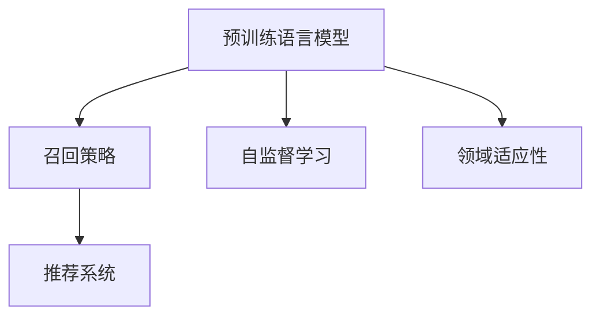

                 

# LLM对推荐系统召回策略的优化

## 1. 背景介绍

### 1.1 问题由来

在推荐系统领域，召回策略（Recall Strategy）是至关重要的环节。它决定着系统能够覆盖多少潜在感兴趣的用户或产品，进而影响到后续排序和评分模型的效果。传统的召回策略主要依赖于用户的历史行为数据和产品的标签信息，然而在数据量不足或用户兴趣多样化的情况下，这种基于统计的方法往往难以全面覆盖用户潜在的兴趣。

近年来，基于深度学习的推荐系统逐渐成为主流。利用大规模预训练语言模型（Large Language Models, LLMs）进行推荐系统召回策略优化，成为了研究热点。由于LLMs具备强大的语言理解能力，可以在大量无标注文本数据上进行自监督学习，并从中提取通用的语义特征，从而为推荐系统提供更丰富的召回依据。

### 1.2 问题核心关键点

LLM对推荐系统召回策略的优化主要基于以下几个核心关键点：

- **语义相似性匹配**：利用预训练语言模型对用户和产品描述进行语义相似性匹配，从而寻找潜在相关性。
- **多模态融合**：结合用户历史行为数据、产品标签等文本信息，提升召回策略的全面性和精准性。
- **自监督学习**：利用无标注数据对模型进行预训练，提升召回策略的泛化能力。
- **领域适应性**：通过微调预训练模型，使其适应特定领域的数据分布。
- **实时性和可解释性**：确保召回策略能够实时响应用户查询，并提供可解释的召回依据。

本文将详细阐述LLM在推荐系统召回策略优化中的原理、算法步骤、实际应用案例，以及面临的挑战和未来趋势。

## 2. 核心概念与联系

### 2.1 核心概念概述

为了更好地理解LLM在推荐系统中的应用，本节将介绍几个关键概念：

- **预训练语言模型（LLMs）**：以Transformer为基础的深度学习模型，通过在海量无标注文本数据上进行自监督学习，学习到丰富的语言知识和语义表示。常见的预训练模型包括BERT、GPT等。

- **召回策略（Recall Strategy）**：推荐系统中，用于确定可能感兴趣物品的策略。通过精细的召回策略，能够提升后续排序模型的效果。

- **推荐系统（Recommendation System）**：利用用户历史行为数据、产品特征等，为用户推荐可能感兴趣的商品或内容的系统。

- **自监督学习（Self-supervised Learning）**：利用未标注数据进行模型训练，学习模型对数据的理解能力。

- **领域适应性（Domain Adaptation）**：使模型能够适应特定领域数据分布，提升模型在特定任务上的性能。

这些核心概念之间的逻辑关系可以通过以下Mermaid流程图来展示：



这个流程图展示了预训练语言模型在推荐系统中的应用逻辑：

1. 预训练语言模型通过自监督学习获得丰富的语言知识。
2. 基于预训练模型的语义表示，优化召回策略，提升推荐系统的效果。
3. 通过领域适应性，模型能够更好地适应特定领域的数据分布。

## 3. 核心算法原理 & 具体操作步骤

### 3.1 算法原理概述

LLM对推荐系统召回策略的优化，主要基于预训练语言模型的语义表示能力。通过将用户和产品的文本描述编码为语义向量，计算它们之间的相似度，从而实现对潜在兴趣点的精准召回。

### 3.2 算法步骤详解

#### 3.2.1 数据准备

1. **用户数据准备**：收集用户的历史行为数据、兴趣标签等信息。
2. **产品数据准备**：收集产品的文本描述、标签、类别等信息。
3. **语料库准备**：构建或选择大规模语料库，用于预训练语言模型。

#### 3.2.2 预训练模型选择与微调

1. **选择预训练模型**：根据推荐系统的领域和需求，选择适合的预训练语言模型。
2. **微调预训练模型**：将预训练模型适应特定领域的数据分布，提升模型性能。

#### 3.2.3 召回策略实现

1. **用户文本编码**：利用预训练模型对用户历史行为、兴趣标签等进行编码，得到用户语义向量。
2. **产品文本编码**：利用预训练模型对产品描述、标签等信息进行编码，得到产品语义向量。
3. **语义相似性匹配**：计算用户和产品语义向量之间的相似度，筛选出潜在感兴趣的物品。

#### 3.2.4 后处理与优化

1. **数据增强**：通过回译、改写等方式，丰富训练数据的多样性，提升模型泛化能力。
2. **正则化技术**：应用L2正则、Dropout等正则化技术，防止模型过拟合。
3. **超参数调优**：通过网格搜索、随机搜索等方式，寻找最佳的超参数组合。

### 3.3 算法优缺点

#### 3.3.1 优点

1. **语义匹配精准**：利用预训练语言模型的语义表示能力，精准匹配用户和产品之间的语义关系。
2. **泛化能力强**：预训练模型的自监督学习能力，使其能够适应不同领域和场景下的数据。
3. **实时性好**：LLM的快速推理能力，使得召回策略能够实时响应用户查询。
4. **可解释性强**：语义相似性匹配提供了直观的召回依据，便于用户理解和反馈。

#### 3.3.2 缺点

1. **数据依赖性强**：预训练模型的效果依赖于高质量的语料库和标注数据。
2. **计算资源需求高**：大规模预训练模型的训练和推理需要大量的计算资源。
3. **模型复杂度高**：预训练语言模型参数量大，复杂度高，难以快速迭代优化。

### 3.4 算法应用领域

LLM对推荐系统召回策略的优化，在多个领域得到了广泛应用：

- **电子商务**：利用用户购买历史、评论等文本信息，为用户推荐可能感兴趣的商品。
- **内容推荐**：根据用户的浏览记录、点赞、分享等行为，推荐可能感兴趣的文章、视频等内容。
- **广告推荐**：利用用户的兴趣标签、点击行为等文本信息，推荐可能感兴趣的广告。
- **音乐推荐**：根据用户的听歌记录、喜好等文本信息，推荐可能感兴趣的音乐。
- **旅游推荐**：利用用户的旅游历史、评分等文本信息，推荐可能感兴趣的旅游目的地。

## 4. 数学模型和公式 & 详细讲解

### 4.1 数学模型构建

在推荐系统中，利用预训练语言模型对用户和产品进行编码，得到用户和产品的语义向量 $U$ 和 $P$。通过计算它们之间的余弦相似度，得到潜在相关性 $S(U, P)$：

$$
S(U, P) = \frac{\mathbf{U} \cdot \mathbf{P}}{\|\mathbf{U}\|\|\mathbf{P}\|}
$$

其中 $\mathbf{U}$ 和 $\mathbf{P}$ 分别为用户和产品的语义向量，$\cdot$ 表示向量点乘，$\|\cdot\|$ 表示向量范数。

### 4.2 公式推导过程

1. **用户文本编码**：
   - 用户历史行为、兴趣标签等文本信息，通过预训练模型得到用户语义向量 $\mathbf{U}$：

$$
\mathbf{U} = M_{\theta}(\text{user\_text})
$$

2. **产品文本编码**：
   - 产品描述、标签等文本信息，通过预训练模型得到产品语义向量 $\mathbf{P}$：

$$
\mathbf{P} = M_{\theta}(\text{product\_text})
$$

3. **语义相似性匹配**：
   - 计算用户和产品语义向量之间的余弦相似度，筛选出潜在感兴趣的物品：

$$
S(U, P) = \frac{\mathbf{U} \cdot \mathbf{P}}{\|\mathbf{U}\|\|\mathbf{P}\|}
$$

4. **后处理与优化**：
   - 数据增强：
     - 回译（Back-Translation）：将用户行为文本翻译为多种语言，增加训练数据的多样性。
     - 改写（Paraphrase）：通过替换、重组等方式，丰富用户行为描述。

   - 正则化技术：
     - L2正则化：

$$
\mathcal{L}_{reg} = \frac{1}{2} \sum_{i=1}^d \theta_i^2
$$

     - Dropout：

$$
\mathcal{L}_{dropout} = -\frac{1}{N} \sum_{i=1}^N \log P(y_i | \mathbf{U})
$$

5. **超参数调优**：
   - 网格搜索（Grid Search）：

$$
\min_{\theta} \mathcal{L}_{reg} + \mathcal{L}_{dropout} + \mathcal{L}_{sort}
$$

   - 随机搜索（Random Search）：

$$
\min_{\theta} f(\theta) = \frac{1}{N} \sum_{i=1}^N \log P(y_i | \mathbf{U})
$$

### 4.3 案例分析与讲解

#### 4.3.1 电商推荐

- **用户数据准备**：收集用户的历史购买记录、浏览记录、评分等文本信息。
- **产品数据准备**：收集产品的描述、标签、类别等文本信息。
- **语料库准备**：选择或构建适合电商领域的语料库，如电商评论、商品说明等。
- **预训练模型选择与微调**：选择适合的预训练语言模型，如BERT，并进行微调以适应电商领域的语义特征。
- **召回策略实现**：利用微调后的BERT模型，计算用户和产品之间的语义相似度，筛选出潜在感兴趣的物品。
- **后处理与优化**：通过数据增强、正则化技术、超参数调优等，提升召回策略的性能。

## 5. 项目实践：代码实例和详细解释说明

### 5.1 开发环境搭建

在搭建开发环境前，需要确保已经安装了Python、PyTorch、HuggingFace等依赖库。以下是Python开发环境搭建的步骤：

1. **安装Python**：下载并安装Python 3.8及以上版本。
2. **安装PyTorch**：
   ```bash
   pip install torch torchvision torchaudio
   ```

3. **安装HuggingFace Transformers库**：
   ```bash
   pip install transformers
   ```

4. **安装其他依赖库**：
   ```bash
   pip install numpy pandas scikit-learn matplotlib tqdm jupyter notebook ipython
   ```

完成上述步骤后，即可开始使用Transformers库进行推荐系统召回策略的优化。

### 5.2 源代码详细实现

以下是使用Transformers库进行电商推荐系统召回策略优化的PyTorch代码实现：

```python
import torch
import torch.nn as nn
import torch.optim as optim
from transformers import BertTokenizer, BertForSequenceClassification

# 设置超参数
device = torch.device('cuda' if torch.cuda.is_available() else 'cpu')
batch_size = 64
learning_rate = 2e-5
num_epochs = 5

# 构建模型
tokenizer = BertTokenizer.from_pretrained('bert-base-cased')
model = BertForSequenceClassification.from_pretrained('bert-base-cased', num_labels=2)
model.to(device)

# 构建数据集
train_data = ...
val_data = ...
test_data = ...

# 构建数据加载器
train_loader = DataLoader(train_data, batch_size=batch_size, shuffle=True)
val_loader = DataLoader(val_data, batch_size=batch_size, shuffle=False)
test_loader = DataLoader(test_data, batch_size=batch_size, shuffle=False)

# 构建优化器和损失函数
optimizer = optim.Adam(model.parameters(), lr=learning_rate)
loss_fn = nn.BCEWithLogitsLoss()

# 训练模型
for epoch in range(num_epochs):
    for batch in tqdm(train_loader):
        input_ids = batch['input_ids'].to(device)
        attention_mask = batch['attention_mask'].to(device)
        labels = batch['labels'].to(device)

        model.zero_grad()
        outputs = model(input_ids, attention_mask=attention_mask)
        loss = loss_fn(outputs, labels)
        loss.backward()
        optimizer.step()

    # 在验证集上评估模型
    model.eval()
    with torch.no_grad():
        eval_loss = 0
        eval_acc = 0
        for batch in val_loader:
            input_ids = batch['input_ids'].to(device)
            attention_mask = batch['attention_mask'].to(device)
            labels = batch['labels'].to(device)

            outputs = model(input_ids, attention_mask=attention_mask)
            loss = loss_fn(outputs, labels)
            eval_loss += loss.item()
            logits = outputs.logits
            eval_acc += (torch.argmax(logits, dim=1) == labels).float().mean().item()

    print(f'Epoch {epoch+1}, loss: {eval_loss/len(val_loader):.4f}, acc: {eval_acc/len(val_loader):.4f}')

# 在测试集上评估模型
model.eval()
with torch.no_grad():
    test_loss = 0
    test_acc = 0
    for batch in test_loader:
        input_ids = batch['input_ids'].to(device)
        attention_mask = batch['attention_mask'].to(device)
        labels = batch['labels'].to(device)

        outputs = model(input_ids, attention_mask=attention_mask)
        loss = loss_fn(outputs, labels)
        test_loss += loss.item()
        logits = outputs.logits
        test_acc += (torch.argmax(logits, dim=1) == labels).float().mean().item()

print(f'Test loss: {test_loss/len(test_loader):.4f}, test acc: {test_acc/len(test_loader):.4f}')
```

### 5.3 代码解读与分析

#### 5.3.1 数据准备

1. **构建数据集**：
   - 电商推荐中，用户和产品的文本数据通过数据预处理步骤（如分词、编码）转化为输入模型所需的格式。
   - 用户行为数据通常包括购买历史、浏览记录、评分等文本信息，产品数据包括产品描述、标签、类别等文本信息。

2. **构建数据加载器**：
   - 利用PyTorch的DataLoader模块，对数据进行分批次加载，以适应模型训练和推理的需求。

#### 5.3.2 模型构建

1. **选择预训练模型**：
   - 本文采用BERT作为预训练模型，并进行微调以适应电商领域的语义特征。
   - 微调后的模型通过self-attention机制，学习用户和产品之间的语义关系。

2. **构建优化器和损失函数**：
   - 使用Adam优化器进行模型参数的更新，损失函数采用二元交叉熵损失。

#### 5.3.3 训练模型

1. **训练循环**：
   - 对每个epoch，在训练集上进行前向传播计算损失函数，并反向传播更新模型参数。
   - 在验证集上评估模型性能，以监控模型的泛化能力。

2. **测试模型**：
   - 在测试集上评估模型性能，以评估模型在未见过的数据上的表现。

## 6. 实际应用场景

### 6.1 智能客服系统

基于LLM的推荐系统，可以应用于智能客服系统的构建。通过分析用户的历史行为和查询记录，利用预训练语言模型对用户和产品进行语义匹配，为客服推荐合适的回答模板或解决方案。

### 6.2 金融投资

在金融投资领域，利用用户的历史交易记录和产品描述，通过LLM推荐系统筛选出潜在的投资标的，提升投资决策的精准性和有效性。

### 6.3 在线教育

在在线教育领域，利用学生的历史学习记录和课程内容描述，通过LLM推荐系统推荐合适的学习资源和课程，提升学习效率和个性化体验。

### 6.4 未来应用展望

未来，LLM在推荐系统中的应用将更加广泛。以下是对未来的展望：

1. **多模态融合**：结合图像、视频等多模态信息，提升推荐系统的全面性和精准性。
2. **实时性优化**：利用流式计算和分布式处理技术，提升推荐系统的实时响应能力。
3. **跨领域适应**：通过领域适应性，使模型能够适应不同领域的数据分布，提升模型的泛化能力。
4. **可解释性增强**：利用可解释性技术，提升推荐系统的透明度和可解释性，帮助用户理解推荐依据。

## 7. 工具和资源推荐

### 7.1 学习资源推荐

为了帮助开发者系统掌握LLM在推荐系统中的应用，以下是一些优质的学习资源：

1. **《推荐系统实战》**：深入浅出地介绍了推荐系统的原理、算法和实践技巧。
2. **《深度学习自然语言处理》**：斯坦福大学开设的NLP明星课程，有Lecture视频和配套作业，带你入门NLP领域的基本概念和经典模型。
3. **《自然语言处理与深度学习》**：HuggingFace的官方文档，提供了大量的预训练模型和微调样例代码。
4. **《推荐系统》**：推荐系统领域的经典教材，涵盖了推荐系统理论、算法和应用。
5. **Kaggle竞赛**：参与推荐系统相关的竞赛，锻炼实际应用能力，积累实战经验。

通过对这些资源的学习实践，相信你一定能够快速掌握LLM在推荐系统中的应用精髓，并用于解决实际的推荐问题。

### 7.2 开发工具推荐

高效的开发离不开优秀的工具支持。以下是几款用于LLM推荐系统开发的常用工具：

1. **PyTorch**：基于Python的开源深度学习框架，灵活的计算图和动态图机制，适合快速迭代研究。
2. **TensorFlow**：由Google主导开发的开源深度学习框架，生产部署方便，适合大规模工程应用。
3. **HuggingFace Transformers库**：提供了丰富的预训练模型和微调接口，支持PyTorch和TensorFlow，是进行推荐系统开发的利器。
4. **TensorBoard**：TensorFlow配套的可视化工具，实时监测模型训练状态，提供丰富的图表呈现方式。
5. **Weights & Biases**：模型训练的实验跟踪工具，可以记录和可视化模型训练过程中的各项指标，方便对比和调优。

合理利用这些工具，可以显著提升LLM推荐系统的开发效率，加快创新迭代的步伐。

### 7.3 相关论文推荐

LLM在推荐系统中的应用源于学界的持续研究。以下是几篇奠基性的相关论文，推荐阅读：

1. **"Exploring the Limits of Transfer Learning with a Unified Text-to-Text Transformer"**：Transformer原论文，提出了自监督预训练和微调的基本框架，奠定了大规模预训练语言模型在NLP领域的应用基础。
2. **"BERT: Pre-training of Deep Bidirectional Transformers for Language Understanding"**：BERT模型，通过掩码语言模型和下一句预测任务，实现了预训练语言模型的广泛应用。
3. **"Leveraging Pre-trained Language Models to Augment Recommendation Systems"**：探讨了预训练语言模型在推荐系统中的应用，展示了其在语义匹配和推荐排序上的效果提升。
4. **"Domain-Adaptive Representation for Collaborative Filtering"**：提出领域适应性方法，使模型能够适应特定领域的数据分布，提升了推荐系统的泛化能力。
5. **"Practical Recommendation Systems"**：推荐系统领域的经典教材，涵盖了推荐系统理论、算法和应用。

这些论文代表了大规模预训练语言模型在推荐系统中的应用研究，通过学习这些前沿成果，可以帮助研究者把握学科前进方向，激发更多的创新灵感。

## 8. 总结：未来发展趋势与挑战

### 8.1 总结

本文对基于预训练语言模型的推荐系统召回策略优化方法进行了全面系统的介绍。首先阐述了LLM在推荐系统中的应用背景和意义，明确了召回策略在推荐系统中的关键地位。其次，从原理到实践，详细讲解了LLM在召回策略优化中的数学模型、算法步骤、实际应用案例，以及面临的挑战和未来趋势。

通过本文的系统梳理，可以看到，基于LLM的推荐系统召回策略优化技术正在成为推荐系统领域的核心技术之一，极大地拓展了推荐系统的表现力和应用范围。LLM通过语义匹配精准、泛化能力强、实时性好等优点，为推荐系统带来了新的突破。

### 8.2 未来发展趋势

展望未来，LLM在推荐系统中的应用将呈现以下几个发展趋势：

1. **多模态融合**：结合图像、视频等多模态信息，提升推荐系统的全面性和精准性。
2. **实时性优化**：利用流式计算和分布式处理技术，提升推荐系统的实时响应能力。
3. **跨领域适应**：通过领域适应性，使模型能够适应不同领域的数据分布，提升模型的泛化能力。
4. **可解释性增强**：利用可解释性技术，提升推荐系统的透明度和可解释性，帮助用户理解推荐依据。
5. **动态化更新**：通过在线学习，使推荐系统能够动态更新模型参数，适应不断变化的用户兴趣和产品信息。

以上趋势凸显了LLM在推荐系统中的应用前景，这些方向的探索发展，必将进一步提升推荐系统的性能和应用范围，为用户的推荐体验带来新的突破。

### 8.3 面临的挑战

尽管LLM在推荐系统中的应用已经取得了瞩目成就，但在迈向更加智能化、普适化应用的过程中，它仍面临着诸多挑战：

1. **数据依赖性强**：预训练模型的效果依赖于高质量的语料库和标注数据。
2. **计算资源需求高**：大规模预训练模型的训练和推理需要大量的计算资源。
3. **模型复杂度高**：预训练语言模型参数量大，复杂度高，难以快速迭代优化。
4. **实时性优化**：如何提升推荐系统的实时响应能力，是一个需要解决的问题。
5. **可解释性不足**：推荐系统的决策过程难以解释，缺乏可解释性。
6. **安全性和隐私保护**：如何保护用户隐私和数据安全，是一个重要的研究课题。

### 8.4 研究展望

面对LLM在推荐系统应用中的挑战，未来的研究需要在以下几个方面寻求新的突破：

1. **高效数据预处理**：利用先进的自然语言处理技术，提升数据预处理效率，减少计算资源消耗。
2. **轻量化模型**：开发轻量化模型，降低模型参数量和复杂度，提升模型推理效率。
3. **实时学习**：通过在线学习，使推荐系统能够动态更新模型参数，适应不断变化的用户兴趣和产品信息。
4. **跨领域应用**：探索适用于不同领域的推荐系统应用，提升模型的泛化能力。
5. **可解释性增强**：利用可解释性技术，提升推荐系统的透明度和可解释性，帮助用户理解推荐依据。
6. **隐私保护**：设计隐私保护机制，确保用户数据的安全和隐私。

这些研究方向的研究突破，必将进一步推动LLM在推荐系统中的应用，为推荐系统带来新的发展机遇。

## 9. 附录：常见问题与解答

### Q1: LLM在推荐系统中如何处理用户和产品之间的语义匹配？

A: LLM通过将用户和产品的文本描述编码为语义向量，计算它们之间的余弦相似度，从而实现对潜在兴趣点的精准召回。具体而言，利用预训练模型对用户和产品进行编码，得到用户和产品的语义向量 $U$ 和 $P$，计算它们之间的余弦相似度 $S(U, P)$，筛选出潜在感兴趣的物品。

### Q2: 如何提高推荐系统的实时响应能力？

A: 推荐系统的实时响应能力主要取决于模型推理速度和数据处理能力。可以采用以下策略：
1. **模型优化**：优化模型结构和参数，提升模型推理速度。
2. **分布式处理**：利用分布式计算和流式计算技术，提升数据处理能力。
3. **缓存机制**：利用缓存机制，减少模型重复计算。
4. **异步计算**：通过异步计算，提升系统响应速度。

### Q3: 推荐系统的可解释性不足，如何解决？

A: 推荐系统的可解释性不足，可以通过以下策略解决：
1. **可视化技术**：利用可视化技术，展示模型的决策过程和推理依据。
2. **特征解释**：对模型输入特征进行解释，帮助用户理解推荐依据。
3. **可解释性模型**：采用可解释性模型，如LIME、SHAP等，提升系统的透明度和可解释性。
4. **用户反馈**：通过用户反馈机制，收集用户对推荐结果的意见，进一步优化推荐系统。

### Q4: 推荐系统的隐私保护机制有哪些？

A: 推荐系统的隐私保护机制可以通过以下策略实现：
1. **数据匿名化**：对用户数据进行匿名化处理，保护用户隐私。
2. **差分隐私**：利用差分隐私技术，保护用户数据的隐私性。
3. **联邦学习**：采用联邦学习技术，在本地数据上训练模型，减少数据传输。
4. **安全多方计算**：利用安全多方计算技术，保护用户数据的隐私性。

### Q5: 如何提高推荐系统的泛化能力？

A: 推荐系统的泛化能力可以通过以下策略提升：
1. **数据增强**：通过回译、改写等方式，丰富训练数据的多样性，提升模型泛化能力。
2. **正则化技术**：应用L2正则、Dropout等正则化技术，防止模型过拟合。
3. **跨领域适应**：通过领域适应性，使模型能够适应不同领域的数据分布，提升模型的泛化能力。
4. **多模型集成**：训练多个推荐模型，取平均输出，抑制过拟合，提升泛化能力。

### Q6: 推荐系统的实时性优化有哪些策略？

A: 推荐系统的实时性优化可以通过以下策略实现：
1. **模型优化**：优化模型结构和参数，提升模型推理速度。
2. **分布式处理**：利用分布式计算和流式计算技术，提升数据处理能力。
3. **缓存机制**：利用缓存机制，减少模型重复计算。
4. **异步计算**：通过异步计算，提升系统响应速度。

通过本文的系统梳理，可以看到，基于LLM的推荐系统召回策略优化技术正在成为推荐系统领域的核心技术之一，极大地拓展了推荐系统的表现力和应用范围。LLM通过语义匹配精准、泛化能力强、实时性好等优点，为推荐系统带来了新的突破。未来，伴随LLM和推荐系统技术的不断发展，相信推荐系统必将在更广泛的场景中发挥其重要作用，推动社会的智能化进程。

---

作者：禅与计算机程序设计艺术 / Zen and the Art of Computer Programming

