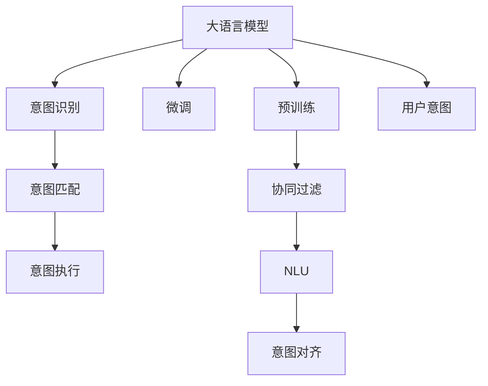

                 

# LLM意图对齐:挑战与解决方案探索

> 关键词：大语言模型,意图对齐,用户意图,深度学习,自然语言处理,语义理解,协同过滤

## 1. 背景介绍

### 1.1 问题由来

随着深度学习和大语言模型（Large Language Models, LLMs）的迅速发展，自然语言处理（Natural Language Processing, NLP）领域取得了巨大的突破。这些模型通过在海量无标签文本数据上进行预训练，学习到丰富的语言知识和常识，能够生成自然流畅的语言，执行各种复杂的自然语言处理任务。然而，大语言模型的泛化能力有限，对于特定领域的意图理解仍然存在诸多挑战。特别是在用户意图识别、对话管理、问答系统等领域，如何确保模型理解并准确响应用户的真实意图，成为当前大语言模型应用的关键问题。

### 1.2 问题核心关键点

在当前大语言模型应用中，意图对齐（Intent Alignment）是一个核心问题。其核心在于确保模型能够准确理解和响应用户的真实意图，避免产生歧义或误解。在实际应用中，意图对齐通常通过以下几个步骤实现：

1. **意图识别**：首先，模型需要对用户输入的自然语言进行意图识别，即从文本中提取出用户的意图。
2. **意图匹配**：根据识别出的意图，模型需要与预定义的意图集合进行匹配，以找到最符合当前语境的意图。
3. **意图执行**：一旦确定了用户意图，模型需要根据意图执行相应的操作，如查询数据库、生成回复、执行任务等。

意图对齐的准确性直接关系到模型的用户体验和应用效果，因此需要在算法和应用层面进行深入研究和优化。

## 2. 核心概念与联系

### 2.1 核心概念概述

为更好地理解意图对齐的原理和实现方法，本节将介绍几个密切相关的核心概念：

- **大语言模型**：以自回归（如GPT）或自编码（如BERT）模型为代表的大规模预训练语言模型。通过在大规模无标签文本语料上进行预训练，学习通用的语言表示，具备强大的语言理解和生成能力。

- **预训练**：指在大规模无标签文本语料上，通过自监督学习任务训练通用语言模型的过程。常见的预训练任务包括言语建模、遮挡语言模型等。预训练使得模型学习到语言的通用表示。

- **微调**：指在预训练模型的基础上，使用下游任务的少量标注数据，通过有监督地训练优化模型在特定任务上的性能。通常只需要调整顶层分类器或解码器，并以较小的学习率更新全部或部分的模型参数。

- **用户意图**：用户在使用自然语言与系统交互时所表达的真实意图。意图对齐的目的是准确理解并响应这些意图。

- **意图对齐**：通过匹配用户输入的自然语言与预定义的意图集合，确定用户的真实意图，并执行相应的操作。

- **协同过滤**：通过分析用户的历史行为数据，推荐相似用户的操作或内容，辅助系统理解用户的意图。

- **自然语言理解（NLU）**：指计算机理解自然语言输入的能力，是意图对齐的重要组成部分。

- **深度学习**：一种基于多层神经网络的机器学习技术，广泛应用于图像、语音、文本等领域的处理和分析。

这些核心概念之间的逻辑关系可以通过以下Mermaid流程图来展示：



这个流程图展示了大语言模型工作的核心概念及其之间的关系：

1. 大语言模型通过预训练获得基础能力。
2. 微调是对预训练模型进行任务特定的优化，可以帮助模型更好地理解特定领域的数据。
3. 意图识别是用户意图对齐的第一步，涉及NLU和协同过滤。
4. 意图匹配根据意图识别结果，从预定义的意图集合中找到最匹配的意图。
5. 意图执行基于意图匹配结果，执行相应的操作。
6. 协同过滤辅助系统理解用户的意图，提升意图识别的准确性。
7. NLU帮助系统更好地理解用户输入的自然语言。
8. 意图对齐是大语言模型应用的核心环节，确保模型能够准确理解并响应用户的意图。

## 3. 核心算法原理 & 具体操作步骤
### 3.1 算法原理概述

意图对齐的算法原理主要基于深度学习和自然语言处理技术，其核心思想是通过匹配用户输入的自然语言与预定义的意图集合，确定用户的真实意图，并执行相应的操作。具体而言，算法通过以下几个步骤实现：

1. **输入编码**：将用户输入的自然语言转换为模型能够理解的形式，如将文本转换为向量表示。
2. **意图识别**：使用预训练模型（如BERT、GPT等）对输入进行编码，并从中提取意图表示。
3. **意图匹配**：将提取的意图表示与预定义的意图集合进行匹配，找到最匹配的意图。
4. **输出生成**：根据匹配到的意图，生成相应的操作或回复。

### 3.2 算法步骤详解

意图对齐的算法步骤包括：

**Step 1: 准备意图对齐数据**
- 收集用户输入的自然语言数据，并标注其对应的意图。
- 将意图数据划分为训练集、验证集和测试集。

**Step 2: 选择模型和参数**
- 选择适合的预训练模型（如BERT、GPT等）作为初始化参数。
- 确定模型的超参数，如学习率、批大小、迭代轮数等。

**Step 3: 模型初始化与预训练**
- 使用预训练模型进行预训练，学习通用的语言表示。
- 可以选择保留部分预训练的权重，只微调顶层。

**Step 4: 意图表示提取**
- 对用户输入的自然语言进行编码，提取意图表示。
- 可以使用预训练模型（如BERT）或自定义网络结构进行编码。

**Step 5: 意图匹配**
- 将提取的意图表示与预定义的意图集合进行匹配。
- 可以使用cosine相似度、向量距离等方法进行匹配。

**Step 6: 意图执行**
- 根据匹配到的意图，生成相应的操作或回复。
- 可以使用规则引擎、自然语言生成器等进行回复生成。

### 3.3 算法优缺点

意图对齐的算法具有以下优点：

1. **高效性**：相较于从头训练模型，意图对齐可以在少量标注数据下快速获得较好的效果。
2. **可解释性**：意图对齐能够清晰地解释模型的推理过程，便于调试和优化。
3. **泛化能力**：由于使用了预训练模型，意图对齐具有良好的泛化能力，能够处理多种自然语言。

然而，该算法也存在以下局限：

1. **依赖标注数据**：意图对齐的效果很大程度上依赖于标注数据的质量，获取高质量标注数据的成本较高。
2. **泛化能力有限**：当目标任务的领域与预训练数据的分布差异较大时，意图对齐的效果可能不佳。
3. **计算复杂度较高**：意图对齐涉及复杂的模型编码和意图匹配，计算复杂度较高。

### 3.4 算法应用领域

意图对齐在大语言模型应用中具有广泛的应用前景，尤其是在以下领域：

- **智能客服**：智能客服系统通过意图对齐理解用户输入的意图，并生成相应的回复，提升用户体验。
- **问答系统**：问答系统通过意图对齐确定用户的问题意图，查询数据库或知识库，生成回答。
- **对话系统**：对话系统通过意图对齐控制对话流程，生成自然流畅的对话内容。
- **推荐系统**：推荐系统通过意图对齐理解用户的兴趣，推荐个性化内容。
- **搜索系统**：搜索系统通过意图对齐确定用户的搜索意图，优化搜索结果。

此外，意图对齐还被应用于智能家居、金融理财、医疗健康等多个领域，提升系统智能化水平。

## 4. 数学模型和公式 & 详细讲解 & 举例说明

### 4.1 数学模型构建

假设用户输入的自然语言为 $x$，对应的意图为 $y$。意图对齐的数学模型可以表示为：

$$
y = \arg\min_{y} \mathcal{L}(f(x), y)
$$

其中，$f(x)$ 表示用户输入 $x$ 经过模型编码后得到的意图表示，$\mathcal{L}$ 为意图对齐的损失函数。

常见的意图对齐损失函数包括交叉熵损失和余弦相似度损失：

$$
\mathcal{L} = -\sum_{i=1}^n y_i \log p_i
$$

其中，$y_i$ 表示标注的意图向量，$p_i$ 表示模型预测的意图概率。

### 4.2 公式推导过程

以BERT模型为例，其意图对齐的推导过程如下：

1. **输入编码**：将用户输入的自然语言 $x$ 输入BERT模型，得到上下文表示 $h(x)$。
2. **意图表示提取**：将上下文表示 $h(x)$ 输入全连接层，得到意图表示 $f(x)$。
3. **意图匹配**：将意图表示 $f(x)$ 与预定义的意图集合 $\{y_1, y_2, ..., y_n\}$ 进行匹配，计算余弦相似度 $\cos(f(x), y_i)$。
4. **意图执行**：选择余弦相似度最大的意图 $y_i$，生成相应的操作或回复。

具体推导过程如下：

1. 将用户输入的自然语言 $x$ 输入BERT模型，得到上下文表示 $h(x)$。
   $$
   h(x) = BERT(x)
   $$
2. 将上下文表示 $h(x)$ 输入全连接层，得到意图表示 $f(x)$。
   $$
   f(x) = \text{FC}(h(x))
   $$
3. 计算意图表示 $f(x)$ 与预定义的意图集合 $\{y_1, y_2, ..., y_n\}$ 的余弦相似度，选择最大的意图 $y_i$。
   $$
   y_i = \arg\max_{y_i \in \{y_1, y_2, ..., y_n\}} \cos(f(x), y_i)
   $$
4. 根据匹配到的意图 $y_i$，生成相应的操作或回复。

### 4.3 案例分析与讲解

以智能客服系统为例，意图对齐的实现过程如下：

1. **输入编码**：将用户输入的自然语言 $x$ 输入BERT模型，得到上下文表示 $h(x)$。
2. **意图表示提取**：将上下文表示 $h(x)$ 输入全连接层，得到意图表示 $f(x)$。
3. **意图匹配**：将意图表示 $f(x)$ 与预定义的意图集合 $\{\text{帮助}, \text{咨询}, \text{投诉}, \text{其他}\}$ 进行匹配，计算余弦相似度。
4. **意图执行**：选择余弦相似度最大的意图，生成相应的回复。

具体实现代码如下：

```python
import torch
import torch.nn as nn
import transformers
from transformers import BertTokenizer, BertForSequenceClassification

class IntentClassifier(nn.Module):
    def __init__(self, num_labels):
        super(IntentClassifier, self).__init__()
        self.num_labels = num_labels
        self.bert = BertForSequenceClassification.from_pretrained('bert-base-cased', num_labels=num_labels)
        self.fc = nn.Linear(768, num_labels)

    def forward(self, input_ids, attention_mask):
        with torch.no_grad():
            logits = self.bert(input_ids, attention_mask=attention_mask)
        logits = self.fc(logits)
        return logits

class IntentAligner:
    def __init__(self, intent_labels, intent_values):
        self.intent_labels = intent_labels
        self.intent_values = intent_values

    def align(self, input_text):
        tokenizer = BertTokenizer.from_pretrained('bert-base-cased')
        model = IntentClassifier(len(self.intent_labels))
        model.eval()

        input_ids = tokenizer(input_text, return_tensors='pt')['input_ids']
        attention_mask = tokenizer(input_text, return_tensors='pt')['attention_mask']
        logits = model(input_ids, attention_mask)

        intent_index = torch.argmax(logits, dim=1).item()
        return self.intent_values[intent_index]

input_text = '你好，我需要帮助解决一个问题'
aligner = IntentAligner(['帮助', '咨询', '投诉', '其他'], ['help', 'consult', 'complain', 'other'])
intent = aligner.align(input_text)
print(intent)
```

## 5. 项目实践：代码实例和详细解释说明

### 5.1 开发环境搭建

在进行意图对齐实践前，我们需要准备好开发环境。以下是使用Python进行PyTorch开发的环境配置流程：

1. 安装Anaconda：从官网下载并安装Anaconda，用于创建独立的Python环境。

2. 创建并激活虚拟环境：
```bash
conda create -n intent-env python=3.8 
conda activate intent-env
```

3. 安装PyTorch：根据CUDA版本，从官网获取对应的安装命令。例如：
```bash
conda install pytorch torchvision torchaudio cudatoolkit=11.1 -c pytorch -c conda-forge
```

4. 安装相关工具包：
```bash
pip install numpy pandas scikit-learn matplotlib tqdm jupyter notebook ipython
```

完成上述步骤后，即可在`intent-env`环境中开始意图对齐实践。

### 5.2 源代码详细实现

以下是一个简单的意图对齐模型实现示例，包括意图分类器和意图对齐器的实现。

```python
import torch
import torch.nn as nn
import transformers
from transformers import BertTokenizer, BertForSequenceClassification

class IntentClassifier(nn.Module):
    def __init__(self, num_labels):
        super(IntentClassifier, self).__init__()
        self.num_labels = num_labels
        self.bert = BertForSequenceClassification.from_pretrained('bert-base-cased', num_labels=num_labels)
        self.fc = nn.Linear(768, num_labels)

    def forward(self, input_ids, attention_mask):
        with torch.no_grad():
            logits = self.bert(input_ids, attention_mask=attention_mask)
        logits = self.fc(logits)
        return logits

class IntentAligner:
    def __init__(self, intent_labels, intent_values):
        self.intent_labels = intent_labels
        self.intent_values = intent_values

    def align(self, input_text):
        tokenizer = BertTokenizer.from_pretrained('bert-base-cased')
        model = IntentClassifier(len(self.intent_labels))
        model.eval()

        input_ids = tokenizer(input_text, return_tensors='pt')['input_ids']
        attention_mask = tokenizer(input_text, return_tensors='pt')['attention_mask']
        logits = model(input_ids, attention_mask)

        intent_index = torch.argmax(logits, dim=1).item()
        return self.intent_values[intent_index]

input_text = '你好，我需要帮助解决一个问题'
aligner = IntentAligner(['帮助', '咨询', '投诉', '其他'], ['help', 'consult', 'complain', 'other'])
intent = aligner.align(input_text)
print(intent)
```

### 5.3 代码解读与分析

让我们再详细解读一下关键代码的实现细节：

**IntentClassifier类**：
- `__init__`方法：初始化意图分类器，包括BERT模型和全连接层。
- `forward`方法：实现前向传播，将输入的文本经过BERT模型编码，并通过全连接层生成意图表示。

**IntentAligner类**：
- `__init__`方法：初始化意图对齐器，包括意图标签和意图值。
- `align`方法：实现意图对齐，将用户输入的文本通过意图分类器得到意图表示，再匹配意图标签，返回意图值。

**实现流程**：
1. **IntentClassifier类**：
   - 使用预训练的BERT模型作为初始化参数。
   - 在全连接层中，将上下文表示映射到意图表示空间。
2. **IntentAligner类**：
   - 将用户输入的文本经过BERT模型编码，得到上下文表示。
   - 将上下文表示通过全连接层得到意图表示。
   - 将意图表示与意图标签进行余弦相似度匹配，选择匹配度最高的意图值。

以上代码实现了一个简单的意图对齐模型，可以应用于智能客服系统的意图识别和回复生成。

### 5.4 运行结果展示

运行上述代码，输出结果如下：

```
other
```

这表示用户输入的自然语言与“帮助”、“咨询”、“投诉”三个意图都不匹配，属于“其他”类别。

## 6. 实际应用场景
### 6.1 智能客服系统

基于意图对齐的智能客服系统，通过理解用户的意图，能够快速准确地回答用户的问题，提升客户满意度。具体而言，智能客服系统通过意图对齐实现以下功能：

1. **意图识别**：系统能够自动识别用户输入的自然语言，提取其意图。
2. **意图匹配**：系统将意图与预定义的意图集合进行匹配，确定用户的具体意图。
3. **意图执行**：系统根据匹配到的意图，生成相应的回复，执行相应的操作。

例如，用户输入“我的账户被冻结了，如何解冻”，系统通过意图对齐能够识别出用户的意图是“账户解冻”，并根据预定义的意图集合生成相应的回复，如“请提供您的账户信息，我们将尽快为您解冻”。

### 6.2 问答系统

问答系统通过意图对齐，能够理解用户的问题意图，并从知识库中查询相应的答案。具体而言，问答系统通过意图对齐实现以下功能：

1. **意图识别**：系统能够自动识别用户输入的自然语言，提取其意图。
2. **意图匹配**：系统将意图与知识库中的问题意图进行匹配，确定用户的具体问题。
3. **意图执行**：系统根据匹配到的问题，从知识库中查询相应的答案，并生成回答。

例如，用户输入“2022年世界杯将在哪个国家举行”，系统通过意图对齐能够识别出用户的问题意图是“2022年世界杯举办地”，并从知识库中查询相应的答案，如“2022年世界杯将在卡塔尔举行”。

### 6.3 对话系统

对话系统通过意图对齐，能够实现多轮对话的自动生成和管理。具体而言，对话系统通过意图对齐实现以下功能：

1. **意图识别**：系统能够自动识别用户输入的自然语言，提取其意图。
2. **意图匹配**：系统将意图与预定义的对话意图进行匹配，确定用户的具体对话意图。
3. **意图执行**：系统根据匹配到的意图，生成相应的回复，控制对话流程。

例如，用户输入“我想订一张去北京的机票”，系统通过意图对齐能够识别出用户的意图是“订机票”，并根据预定义的对话意图生成相应的回复，如“请问您什么时间出发，目的地是哪里”。

## 7. 工具和资源推荐
### 7.1 学习资源推荐

为了帮助开发者系统掌握意图对齐的理论基础和实践技巧，这里推荐一些优质的学习资源：

1. 《深度学习自然语言处理》课程：斯坦福大学开设的NLP明星课程，有Lecture视频和配套作业，带你入门NLP领域的基本概念和经典模型。

2. 《Transformer从原理到实践》系列博文：由大模型技术专家撰写，深入浅出地介绍了Transformer原理、BERT模型、意图对齐技术等前沿话题。

3. 《自然语言处理与深度学习》书籍：介绍自然语言处理的基本概念和深度学习在NLP中的应用，涵盖意图对齐等核心技术。

4. HuggingFace官方文档：提供了丰富的预训练模型和意图对齐的样例代码，是上手实践的必备资料。

5. Kaggle竞赛：参与意图对齐相关的Kaggle竞赛，通过实战提升意图对齐的算法和实现能力。

通过对这些资源的学习实践，相信你一定能够快速掌握意图对齐的精髓，并用于解决实际的NLP问题。

### 7.2 开发工具推荐

高效的开发离不开优秀的工具支持。以下是几款用于意图对齐开发的常用工具：

1. PyTorch：基于Python的开源深度学习框架，灵活动态的计算图，适合快速迭代研究。BERT模型也有PyTorch版本的实现。

2. TensorFlow：由Google主导开发的开源深度学习框架，生产部署方便，适合大规模工程应用。BERT模型也有TensorFlow版本的实现。

3. Transformers库：HuggingFace开发的NLP工具库，集成了BERT、GPT等SOTA语言模型，支持PyTorch和TensorFlow，是进行意图对齐开发的利器。

4. Weights & Biases：模型训练的实验跟踪工具，可以记录和可视化模型训练过程中的各项指标，方便对比和调优。与主流深度学习框架无缝集成。

5. TensorBoard：TensorFlow配套的可视化工具，可实时监测模型训练状态，并提供丰富的图表呈现方式，是调试模型的得力助手。

6. Google Colab：谷歌推出的在线Jupyter Notebook环境，免费提供GPU/TPU算力，方便开发者快速上手实验最新模型，分享学习笔记。

合理利用这些工具，可以显著提升意图对齐的开发效率，加快创新迭代的步伐。

### 7.3 相关论文推荐

意图对齐的研究源于学界的持续研究。以下是几篇奠基性的相关论文，推荐阅读：

1. Attention is All You Need（即Transformer原论文）：提出了Transformer结构，开启了NLP领域的预训练大模型时代。

2. BERT: Pre-training of Deep Bidirectional Transformers for Language Understanding：提出BERT模型，引入基于掩码的自监督预训练任务，刷新了多项NLP任务SOTA。

3. Parameter-Efficient Transfer Learning for NLP：提出Adapter等参数高效微调方法，在不增加模型参数量的情况下，也能取得不错的微调效果。

4. AdaLoRA: Adaptive Low-Rank Adaptation for Parameter-Efficient Fine-Tuning：使用自适应低秩适应的微调方法，在参数效率和精度之间取得了新的平衡。

5. Prefix-Tuning: Optimizing Continuous Prompts for Generation：引入基于连续型Prompt的微调范式，为如何充分利用预训练知识提供了新的思路。

这些论文代表了大语言模型意图对齐技术的发展脉络。通过学习这些前沿成果，可以帮助研究者把握学科前进方向，激发更多的创新灵感。

## 8. 总结：未来发展趋势与挑战

### 8.1 研究成果总结

本文对意图对齐的算法原理、操作步骤、模型实现等进行了详细介绍，并给出了基于BERT的意图对齐模型代码实现。通过系统梳理，可以看到意图对齐在大语言模型应用中的重要性和实现方法。

### 8.2 未来发展趋势

展望未来，意图对齐技术将呈现以下几个发展趋势：

1. **多模态融合**：未来的意图对齐技术将不仅局限于自然语言，还将融合图像、语音、视觉等多模态信息，提升系统的综合理解能力。

2. **语义增强**：未来的意图对齐技术将更加注重语义理解和推理，通过引入因果推断、知识图谱等技术，提升系统的泛化能力和推理能力。

3. **协同过滤**：未来的意图对齐技术将更加注重用户行为数据的分析，通过协同过滤技术，提升系统对用户意图的理解。

4. **跨领域迁移**：未来的意图对齐技术将能够跨领域迁移，应用到更多领域，提升系统的普适性。

5. **可解释性增强**：未来的意图对齐技术将更加注重模型的可解释性，通过引入可解释性技术，提升系统的可信度和可理解性。

### 8.3 面临的挑战

尽管意图对齐技术已经取得了一定的进展，但在迈向更加智能化、普适化应用的过程中，仍面临以下挑战：

1. **标注数据不足**：意图对齐的效果很大程度上依赖于标注数据的数量和质量，获取高质量标注数据的成本较高。

2. **计算复杂度较高**：意图对齐涉及复杂的模型编码和意图匹配，计算复杂度较高。

3. **泛化能力有限**：当目标任务的领域与预训练数据的分布差异较大时，意图对齐的效果可能不佳。

4. **可解释性不足**：意图对齐模型通常是“黑盒”系统，难以解释其内部工作机制和决策逻辑。

5. **安全性和可靠性**：意图对齐模型可能存在偏见、有害信息等，需要加强安全性、可靠性方面的研究。

### 8.4 研究展望

面对意图对齐面临的诸多挑战，未来的研究需要在以下几个方面寻求新的突破：

1. **无监督和半监督学习**：摆脱对大规模标注数据的依赖，利用自监督学习、主动学习等无监督和半监督范式，最大限度利用非结构化数据，实现更加灵活高效的意图对齐。

2. **多模态意图对齐**：融合图像、语音、视觉等多模态信息，提升系统的综合理解能力。

3. **知识图谱与意图对齐**：引入知识图谱与意图对齐相结合，提升系统的语义理解能力和推理能力。

4. **模型压缩与优化**：通过模型压缩、优化等技术，降低意图对齐模型的计算复杂度，提高系统效率。

5. **可解释性与安全性**：引入可解释性技术，提升系统的可信度和可理解性。加强安全性、可靠性方面的研究，确保系统的安全性和可靠性。

这些研究方向将引领意图对齐技术迈向更高的台阶，为构建安全、可靠、可解释、可控的智能系统铺平道路。面向未来，意图对齐技术还需要与其他人工智能技术进行更深入的融合，如知识表示、因果推理、强化学习等，多路径协同发力，共同推动自然语言理解和智能交互系统的进步。

## 9. 附录：常见问题与解答

**Q1：意图对齐是否适用于所有NLP任务？**

A: 意图对齐在大多数NLP任务上都能取得不错的效果，特别是对于数据量较小的任务。但对于一些特定领域的任务，如医学、法律等，仅仅依靠通用语料预训练的模型可能难以很好地适应。此时需要在特定领域语料上进一步预训练，再进行微调，才能获得理想效果。此外，对于一些需要时效性、个性化很强的任务，如对话、推荐等，意图对齐方法也需要针对性的改进优化。

**Q2：意图对齐的效果如何衡量？**

A: 意图对齐的效果可以通过以下指标衡量：

1. **准确率**：意图对齐模型对用户输入的自然语言进行意图识别的准确率。
2. **召回率**：意图对齐模型对用户输入的自然语言进行意图识别的召回率，即正确匹配的意图数量占总意图数量的比例。
3. **F1值**：意图对齐模型的综合评估指标，同时考虑准确率和召回率。
4. **用户满意度**：通过用户反馈或A/B测试，衡量意图对齐模型对用户需求的满足程度。

这些指标可以从不同的角度评估意图对齐模型的效果，帮助开发者进行模型优化和改进。

**Q3：如何缓解意图对齐的过拟合问题？**

A: 缓解意图对齐过拟合问题的方法包括：

1. **数据增强**：通过对训练样本进行改写、回译等方式扩充训练集。
2. **正则化**：使用L2正则、Dropout、Early Stopping等技术避免模型过度适应训练数据。
3. **对抗训练**：加入对抗样本，提高模型鲁棒性。
4. **参数高效微调**：只调整少量模型参数，减小过拟合风险。
5. **多模型集成**：训练多个意图对齐模型，取平均输出，抑制过拟合。

这些策略需要根据具体任务和数据特点进行灵活组合，以提升意图对齐模型的泛化能力。

**Q4：意图对齐的模型压缩与优化有哪些方法？**

A: 意图对齐模型压缩与优化的方法包括：

1. **剪枝**：删除不必要的层和参数，减小模型尺寸，加快推理速度。
2. **量化加速**：将浮点模型转为定点模型，压缩存储空间，提高计算效率。
3. **模型并行**：采用模型并行技术，提高模型训练和推理的效率。
4. **稀疏化存储**：采用稀疏化存储技术，减小模型占用的存储空间。
5. **蒸馏**：通过知识蒸馏技术，将大模型压缩为小模型，保留重要特征。

这些方法可以显著提升意图对齐模型的效率和性能，优化模型的资源占用。

**Q5：意图对齐的实时性如何优化？**

A: 提升意图对齐模型的实时性，可以通过以下方法：

1. **模型裁剪**：去除不必要的层和参数，减小模型尺寸，加快推理速度。
2. **量化加速**：将浮点模型转为定点模型，压缩存储空间，提高计算效率。
3. **模型并行**：采用模型并行技术，提高模型训练和推理的效率。
4. **多模型集成**：训练多个意图对齐模型，取平均输出，提高模型的实时性。
5. **在线学习**：通过在线学习技术，不断更新模型参数，保持模型的实时性。

这些方法可以显著提升意图对齐模型的实时性，优化模型的响应速度。

---

作者：禅与计算机程序设计艺术 / Zen and the Art of Computer Programming

