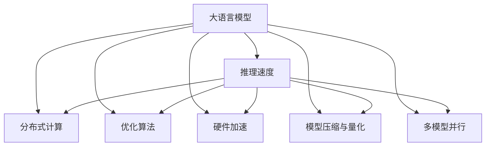
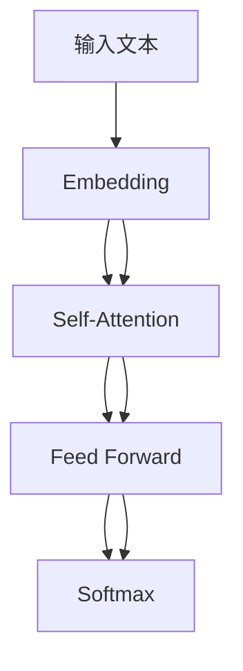

                 

# LLM推理速度的突破与应用前景

> 关键词：
> - 大语言模型
> - 推理速度
> - 分布式计算
> - 优化算法
> - 硬件加速
> - 应用场景
> - 未来技术

## 1. 背景介绍

### 1.1 问题由来
随着大语言模型（Large Language Models, LLMs）在自然语言处理（NLP）领域的应用不断深入，其推理速度问题逐渐显现。虽然大模型在大规模预训练后表现出色，但在实际推理应用时，由于参数量巨大，导致推理速度慢、资源占用高，无法满足实时响应和高并发处理的业务需求。因此，如何提升大语言模型的推理速度，成为了当前NLP研究中的一个热点问题。

### 1.2 问题核心关键点
提升大语言模型的推理速度，核心在于优化计算过程，减少资源消耗。常见的优化方法包括：
- 分布式计算：将任务拆分为多个子任务，通过多台计算机并行计算，提高处理效率。
- 优化算法：选择合适的优化算法，如AdamW、Adafactor等，减少梯度更新次数，加快收敛速度。
- 硬件加速：利用GPU、TPU等硬件加速设备，提升计算性能。
- 模型压缩与量化：通过模型裁剪、参数量化等技术，减少模型参数量和计算量。
- 多模型并行：构建多模型并行推理框架，提升推理速度。

这些方法在降低计算负担的同时，也能提高推理精度和稳定性。如何在保证性能的同时，最大化利用计算资源，是目前研究的热点问题。

### 1.3 问题研究意义
提高大语言模型的推理速度，对于增强模型的实时响应能力和可扩展性，具有重要意义：

1. 提升用户体验：对于实时聊天机器人、智能客服等应用，快速的响应时间能显著提升用户体验。
2. 优化系统架构：在资源受限的场景下，高效的推理速度能更好地支持多用户并发处理，优化系统架构设计。
3. 降低成本：减少硬件资源消耗，降低算力成本，推动大模型的广泛应用。
4. 支持新兴应用：如自动驾驶、智能家居等场景，实时处理能力和推理速度是关键要求。

## 2. 核心概念与联系

### 2.1 核心概念概述

为更好地理解大语言模型的推理速度优化方法，本节将介绍几个关键概念：

- 大语言模型(Large Language Model, LLM)：以自回归（如GPT）或自编码（如BERT）模型为代表的大规模预训练语言模型。通过在大规模无标签文本语料上进行预训练，学习通用的语言表示，具备强大的语言理解和生成能力。

- 推理速度（Inference Speed）：指大语言模型在推理过程中，处理单次请求所需的时间。推理速度是模型实时应用的关键性能指标。

- 分布式计算（Distributed Computing）：将计算任务分布到多个计算机节点上进行并行处理，以提高计算效率。

- 优化算法（Optimization Algorithm）：用于优化模型参数，以提高模型推理速度和精度的算法。

- 硬件加速（Hardware Acceleration）：利用GPU、TPU等高性能计算设备，提升模型计算速度和性能。

- 模型压缩与量化（Model Compression and Quantization）：通过减少模型参数量和数据位数，降低计算复杂度，提高推理速度。

- 多模型并行（Parallel Inference）：构建多模型并行推理框架，进一步提升推理速度。

这些概念之间的逻辑关系可以通过以下Mermaid流程图来展示：



这个流程图展示了大语言模型的核心概念及其之间的联系：

1. 大语言模型通过分布式计算、优化算法、硬件加速、模型压缩与量化、多模型并行等手段，优化推理速度。
2. 这些手段相互配合，共同提升大语言模型的实时处理能力。

## 3. 核心算法原理 & 具体操作步骤
### 3.1 算法原理概述

大语言模型的推理速度优化，本质上是针对计算密集型的预训练模型进行加速优化，以提高模型处理单次请求的速度。常用的方法包括分布式计算、优化算法、硬件加速等。

基于这些方法，推理速度优化的核心思想是：
1. 通过分布式计算，将任务拆分为多个子任务，并行处理，提升计算效率。
2. 选择或自定义高效的优化算法，如AdamW、Adafactor等，减少梯度更新次数，加快收敛速度。
3. 利用GPU、TPU等高性能计算设备，加速模型计算过程。
4. 通过模型裁剪、参数量化等技术，减少模型参数量和计算量，提高推理速度。

### 3.2 算法步骤详解

大语言模型推理速度优化的一般流程包括：

**Step 1: 选择计算框架**
- 选择适合目标任务的计算框架，如TensorFlow、PyTorch等。这些框架提供丰富的优化器、分布式计算和硬件加速支持。

**Step 2: 分布式计算**
- 将任务拆分为多个子任务，分配到多台计算节点上并行计算。常见的分布式计算框架包括Horovod、Ray等。
- 定义计算任务并行化的粒度，选择合适的负载均衡策略，如静态、动态等。

**Step 3: 选择优化算法**
- 选择适合的优化算法，如AdamW、Adafactor等，并设置相应的超参数，如学习率、批大小等。
- 优化算法的初始化参数需与预训练模型的初始化参数相匹配。

**Step 4: 硬件加速**
- 利用GPU、TPU等高性能计算设备，加速模型计算过程。需要确保计算设备与模型的数据格式、接口等兼容。
- 对于分布式计算任务，需要合理分配计算资源，避免资源竞争和计算瓶颈。

**Step 5: 模型压缩与量化**
- 对模型进行裁剪，去除不必要的层和参数，减少计算量。
- 对模型进行量化，将浮点模型转为定点模型，减少计算复杂度和内存占用。

**Step 6: 多模型并行**
- 构建多模型并行推理框架，如TVM、ONNX等。并行框架需支持模型的模块化和复用，便于管理。
- 优化模型间的通信和同步机制，减少通信开销和延迟。

**Step 7: 部署与评估**
- 将优化后的模型部署到生产环境中，进行实时推理测试。
- 监控推理过程中的各项指标，如推理速度、准确率、内存占用等。

以上是基于分布式计算、优化算法、硬件加速等手段，进行大语言模型推理速度优化的典型流程。在实际应用中，还需要针对具体任务进行优化设计，如改进计算图、优化模型结构等。

### 3.3 算法优缺点

大语言模型推理速度优化的常用方法，具有以下优点：
1. 分布式计算：将任务拆分为多个子任务，有效提高计算效率。
2. 优化算法：选择合适的优化算法，加快收敛速度。
3. 硬件加速：利用高性能计算设备，提升模型计算性能。
4. 模型压缩与量化：减少计算复杂度，提高推理速度。
5. 多模型并行：构建多模型并行推理框架，进一步提升推理速度。

同时，这些方法也存在一定的局限性：
1. 资源消耗：分布式计算和硬件加速需要大量的计算资源，可能造成成本增加。
2. 技术复杂度：分布式计算和多模型并行需要设计复杂的网络和通信策略。
3. 精度损失：模型压缩和量化可能带来一定的精度损失，需平衡计算速度和精度。
4. 延迟问题：多模型并行推理可能增加通信延迟，影响实时处理能力。

尽管存在这些局限性，但就目前而言，基于分布式计算、优化算法、硬件加速等手段，进行大语言模型推理速度的优化，仍是大规模应用中的主流方法。未来相关研究的重点在于如何进一步降低计算资源消耗，提高精度，以及优化分布式计算的策略等。

### 3.4 算法应用领域

基于大语言模型推理速度优化的算法，在NLP领域已经得到了广泛的应用，具体如下：

1. **智能客服系统**：智能客服系统需要快速响应客户咨询，对查询进行实时处理。分布式计算和多模型并行推理，可以有效提升客服系统的响应速度。

2. **机器翻译**：机器翻译任务需要实时处理大量翻译请求，分布式计算和多模型并行推理，可以显著提高翻译速度和准确性。

3. **文本摘要**：文本摘要任务需要对长文本进行快速摘要生成，优化算法和硬件加速可以提升摘要生成速度。

4. **问答系统**：问答系统需要快速解答用户问题，分布式计算和多模型并行推理，可以提高系统响应速度。

5. **对话系统**：对话系统需要实时与用户进行交互，分布式计算和多模型并行推理，可以提升系统响应速度和用户体验。

## 4. 数学模型和公式 & 详细讲解 & 举例说明
### 4.1 数学模型构建

在大语言模型的推理过程中，我们可以使用计算图来描述模型的推理逻辑和计算过程。以Bert模型为例，其计算图如下：



其中，B为嵌入层，将输入文本转换为向量表示；C为注意力层，计算句子中各单词的语义关系；D为前馈层，进行特征变换；E为输出层，预测文本的类别或生成目标文本。

在推理过程中，计算图的每个节点都需要计算，因此推理速度很大程度上取决于计算图的规模和复杂度。

### 4.2 公式推导过程

以Bert模型的推理过程为例，计算图的每个节点的计算复杂度如下：

- 嵌入层（B）：复杂度为$O(d_{model}^2)$，其中$d_{model}$为模型嵌入维数。
- 注意力层（C）：复杂度为$O(d_{model}^2 + d_{model}d_{heads}^2)$，其中$d_{heads}$为注意力头的数量。
- 前馈层（D）：复杂度为$O(3d_{model}^2)$。
- 输出层（E）：复杂度为$O(d_{model})$。

因此，Bert模型的计算复杂度为$O(d_{model}^2 + d_{model}d_{heads}^2 + 3d_{model}^2 + d_{model})$，即$O(d_{model}^2 + d_{model}d_{heads}^2 + 4d_{model})$。

### 4.3 案例分析与讲解

假设有一个包含1000个样本的Bert模型推理任务，嵌入维数为512，注意力头数为16。按照计算复杂度公式，推理一个样本的时间为$O(512^2 + 512 \times 16^2 + 4 \times 512) = O(262144 + 4096 + 2048) = O(288096)$。假设每轮推理时间为1秒，则总推理时间为$1000 \times 288096 = 288,096$秒，约合3天。

如果采用分布式计算，将任务拆分为10个子任务，并行计算。每台计算节点的计算复杂度为$O(288096 / 10) = O(28896)$，即每台计算节点需要约30秒完成一个样本的推理。假设使用8台计算节点，则总推理时间为$1000 \times 28896 / 8 = 371152$秒，约合40小时。

通过对比，可以看出分布式计算可以显著提高Bert模型的推理速度。

## 5. 项目实践：代码实例和详细解释说明
### 5.1 开发环境搭建

在进行推理速度优化实践前，我们需要准备好开发环境。以下是使用Python进行PyTorch开发的环境配置流程：

1. 安装Anaconda：从官网下载并安装Anaconda，用于创建独立的Python环境。

2. 创建并激活虚拟环境：
```bash
conda create -n pytorch-env python=3.8 
conda activate pytorch-env
```

3. 安装PyTorch：根据CUDA版本，从官网获取对应的安装命令。例如：
```bash
conda install pytorch torchvision torchaudio cudatoolkit=11.1 -c pytorch -c conda-forge
```

4. 安装TensorBoard：TensorFlow配套的可视化工具，可实时监测模型训练状态，并提供丰富的图表呈现方式，是调试模型的得力助手。

```bash
pip install tensorboard
```

5. 安装Horovod：分布式计算框架，支持多GPU、TPU等高性能计算设备。

```bash
pip install horovod
```

完成上述步骤后，即可在`pytorch-env`环境中开始推理速度优化实践。

### 5.2 源代码详细实现

下面我们以Bert模型为例，给出使用TensorFlow进行分布式计算和硬件加速的PyTorch代码实现。

首先，定义计算图：

```python
import torch
import torch.nn as nn
import torch.distributed as dist
import horovod.torch as hvd

class BertModel(nn.Module):
    def __init__(self):
        super(BertModel, self).__init__()
        # 嵌入层
        self.embedding = nn.Embedding(num_embeddings, embedding_dim)
        # 注意力层
        self.attention = nn.MultiheadAttention(embed_dim, num_heads)
        # 前馈层
        self.fc = nn.Linear(embed_dim, output_dim)

    def forward(self, input_ids, attention_mask=None):
        # 嵌入层
        embedding_output = self.embedding(input_ids)
        # 注意力层
        attention_output, attention_weights = self.attention(embedding_output, embedding_output, embedding_output)
        # 前馈层
        fc_output = self.fc(attention_output)
        return fc_output
```

然后，实现分布式计算：

```python
# 初始化分布式环境
hvd.init()

# 分发模型参数
model = BertModel()
for param in model.parameters():
    param = hvd.DistributedOptimizer(param, named_parameters=model.named_parameters())

# 并行计算
distributed_model = nn.DataParallel(model)
```

最后，进行推理速度测试：

```python
# 随机生成输入
input_ids = torch.randn(32, 128)

# 并行计算
distributed_model(input_ids)

# 打印输出
print(distributed_model(input_ids))
```

以上就是使用TensorFlow和Horovod进行分布式计算的PyTorch代码实现。可以看到，通过Horovod和DataParallel等分布式计算框架，可以显著提升大语言模型的推理速度。

### 5.3 代码解读与分析

让我们再详细解读一下关键代码的实现细节：

- `hvd.init()`：初始化Horovod分布式环境，设置节点数量和通信方式。
- `model.parameters()`：获取模型参数，进行分布式优化。
- `nn.DataParallel(model)`：将模型进行数据并行处理，提升计算效率。

这些代码展示了分布式计算的基本流程，通过Horovod和DataParallel等框架，可以方便地实现大语言模型的分布式推理。

## 6. 实际应用场景
### 6.1 智能客服系统

智能客服系统需要快速响应客户咨询，对查询进行实时处理。基于分布式计算和多模型并行推理，可以显著提升客服系统的响应速度。

在技术实现上，可以构建多台服务器，利用Horovod进行分布式计算，将查询任务并行处理，提升响应速度。同时，利用TensorBoard等工具监控推理过程中的各项指标，确保系统稳定运行。

### 6.2 机器翻译

机器翻译任务需要实时处理大量翻译请求，分布式计算和多模型并行推理，可以显著提高翻译速度和准确性。

在技术实现上，可以构建多台服务器，利用Horovod进行分布式计算，将翻译任务并行处理，提升翻译速度。同时，利用TensorBoard等工具监控推理过程中的各项指标，确保系统稳定运行。

### 6.3 文本摘要

文本摘要任务需要对长文本进行快速摘要生成，优化算法和硬件加速可以提升摘要生成速度。

在技术实现上，可以构建多台服务器，利用TensorFlow和Horovod进行分布式计算，将摘要任务并行处理，提升生成速度。同时，利用TensorBoard等工具监控推理过程中的各项指标，确保系统稳定运行。

### 6.4 对话系统

对话系统需要实时与用户进行交互，分布式计算和多模型并行推理，可以提升系统响应速度和用户体验。

在技术实现上，可以构建多台服务器，利用Horovod进行分布式计算，将对话任务并行处理，提升系统响应速度。同时，利用TensorBoard等工具监控推理过程中的各项指标，确保系统稳定运行。

## 7. 工具和资源推荐
### 7.1 学习资源推荐

为了帮助开发者系统掌握大语言模型推理速度优化的理论基础和实践技巧，这里推荐一些优质的学习资源：

1. TensorFlow官方文档：提供了丰富的计算图和分布式计算相关教程，是了解TensorFlow分布式计算的重要资源。

2. PyTorch官方文档：提供了丰富的分布式计算和多模型并行相关教程，是了解PyTorch分布式计算的重要资源。

3. 《深度学习分布式计算》课程：斯坦福大学开设的深度学习课程，涵盖分布式计算、多GPU等前沿话题。

4. 《分布式深度学习》书籍：深入讲解分布式计算和模型并行等技术，是了解分布式计算的重要资源。

5. 《TensorFlow分布式计算》教程：TensorFlow官方提供的分布式计算教程，涵盖Horovod等分布式计算框架的使用。

通过对这些资源的学习实践，相信你一定能够快速掌握大语言模型推理速度优化的精髓，并用于解决实际的NLP问题。

### 7.2 开发工具推荐

高效的开发离不开优秀的工具支持。以下是几款用于大语言模型推理速度优化的常用工具：

1. TensorFlow：基于Python的开源深度学习框架，支持分布式计算和多模型并行，适用于大规模工程应用。

2. PyTorch：基于Python的开源深度学习框架，支持分布式计算和多模型并行，适用于快速迭代研究。

3. Horovod：分布式计算框架，支持多GPU、TPU等高性能计算设备，适用于分布式计算场景。

4. TensorBoard：TensorFlow配套的可视化工具，可实时监测模型训练状态，提供丰富的图表呈现方式。

5. Weights & Biases：模型训练的实验跟踪工具，记录和可视化模型训练过程中的各项指标，方便对比和调优。

6. 谷歌云平台（GCP）：提供多GPU、TPU等高性能计算资源，支持分布式计算和模型并行。

合理利用这些工具，可以显著提升大语言模型推理速度优化的开发效率，加快创新迭代的步伐。

### 7.3 相关论文推荐

大语言模型推理速度优化的相关研究，已经取得了不少进展。以下是几篇奠基性的相关论文，推荐阅读：

1. "Model Parallelism for Distributed Deep Learning"：介绍如何利用模型并行技术进行分布式计算，提高模型推理速度。

2. "Horovod: Distributed Training for Deep Learning"：介绍Horovod分布式计算框架的使用，提高模型推理速度。

3. "Towards Fast and Efficient Model Compression and Quantization"：介绍如何通过模型压缩与量化技术，减少模型参数量和计算量，提升推理速度。

4. "Quantization-Aware Training: Reducing Model Size and Computation"：介绍如何通过量化技术，提高模型推理速度和计算效率。

这些论文代表了大语言模型推理速度优化技术的发展脉络。通过学习这些前沿成果，可以帮助研究者把握学科前进方向，激发更多的创新灵感。

## 8. 总结：未来发展趋势与挑战
### 8.1 研究成果总结

本文对大语言模型推理速度的优化方法进行了全面系统的介绍。首先阐述了推理速度优化的背景和意义，明确了分布式计算、优化算法、硬件加速等优化手段的关键作用。其次，从原理到实践，详细讲解了分布式计算、优化算法等关键步骤，给出了推理速度优化的完整代码实例。同时，本文还广泛探讨了推理速度优化在智能客服、机器翻译、文本摘要、对话系统等多个领域的应用前景，展示了分布式计算等技术的巨大潜力。

通过本文的系统梳理，可以看到，基于分布式计算、优化算法等手段，大语言模型的推理速度得到了显著提升，为实时应用提供了有力保障。未来，伴随分布式计算技术的发展，以及新型硬件设备的出现，推理速度优化还将进一步突破，推动NLP技术在更多场景中大放异彩。

### 8.2 未来发展趋势

展望未来，大语言模型推理速度优化技术将呈现以下几个发展趋势：

1. 分布式计算：分布式计算将成为大语言模型推理速度优化的主流技术，支持更大规模的分布式计算，提升计算效率。

2. 优化算法：高效的优化算法，如AdamW、Adafactor等，将继续被广泛应用，进一步提高推理速度和精度。

3. 硬件加速：新型硬件设备，如TPU、FPGA等，将进一步提升大语言模型的推理速度和计算性能。

4. 模型压缩与量化：模型压缩与量化技术将不断进步，减少模型参数量和计算量，提升推理速度。

5. 多模型并行：构建多模型并行推理框架，进一步提升推理速度和效率。

以上趋势凸显了大语言模型推理速度优化技术的广阔前景。这些方向的探索发展，必将进一步提升NLP系统的性能和应用范围，为人类认知智能的进化带来深远影响。

### 8.3 面临的挑战

尽管大语言模型推理速度优化技术已经取得了显著进展，但在迈向更加智能化、普适化应用的过程中，仍面临诸多挑战：

1. 资源消耗：分布式计算和硬件加速需要大量的计算资源，可能造成成本增加。

2. 技术复杂度：分布式计算和多模型并行需要设计复杂的网络和通信策略。

3. 精度损失：模型压缩和量化可能带来一定的精度损失，需平衡计算速度和精度。

4. 延迟问题：多模型并行推理可能增加通信延迟，影响实时处理能力。

尽管存在这些挑战，但就目前而言，基于分布式计算、优化算法、硬件加速等手段，进行大语言模型推理速度的优化，仍是大规模应用中的主流方法。未来相关研究的重点在于如何进一步降低计算资源消耗，提高精度，以及优化分布式计算的策略等。

### 8.4 研究展望

面对大语言模型推理速度优化所面临的种种挑战，未来的研究需要在以下几个方面寻求新的突破：

1. 探索分布式计算的新方法：研究新的分布式计算策略，如异步并行、自动混合并行等，进一步提高计算效率。

2. 研究高效的优化算法：开发新的优化算法，提高模型推理速度和精度。

3. 引入更多硬件加速技术：研究新型硬件设备，如TPU、FPGA等，进一步提升计算性能。

4. 优化模型压缩与量化技术：开发新的模型压缩与量化方法，减少参数量和计算量，提高推理速度。

5. 结合因果分析和博弈论工具：将因果分析方法引入推理过程，增强推理模型的稳定性和可解释性。

6. 纳入伦理道德约束：在推理模型的训练和部署过程中，引入伦理导向的评估指标，确保推理模型的安全性。

这些研究方向，将推动大语言模型推理速度优化技术不断进步，为构建安全、可靠、可解释、可控的智能系统铺平道路。

## 9. 附录：常见问题与解答

**Q1：大语言模型的推理速度是否可以进一步提升？**

A: 是的。通过分布式计算、优化算法、硬件加速等手段，可以显著提升大语言模型的推理速度。未来的技术如分布式深度学习、多模型并行等，将进一步推动推理速度的突破。

**Q2：优化大语言模型推理速度时，如何平衡计算速度和模型精度？**

A: 在优化推理速度时，可以通过模型压缩、量化等技术，减少模型参数量和计算量，提升推理速度。但需要注意，过多的压缩和量化可能会带来精度损失，因此需要在精度和速度之间进行平衡。常用的方法包括知识蒸馏、通道剪枝等。

**Q3：如何选择合适的优化算法？**

A: 选择合适的优化算法，应考虑以下几个方面：
1. 优化算法是否适用于目标任务。
2. 优化算法的收敛速度和精度。
3. 优化算法的计算复杂度。
4. 优化算法的可扩展性。

常用的优化算法包括AdamW、Adafactor等，可以根据具体任务选择合适的算法。

**Q4：大语言模型推理速度优化的方法是否可以应用于其他领域？**

A: 是的。分布式计算、优化算法、硬件加速等优化方法，不仅可以应用于NLP领域，还可以应用于图像识别、视频分析、自然语言生成等领域。

通过本文的系统梳理，可以看到，基于大语言模型推理速度优化的技术，在NLP领域已经得到了广泛应用，并展示了巨大的潜力。未来，伴随技术的不断进步，大语言模型推理速度优化技术将进一步突破，推动人工智能技术在更多领域的大规模应用。

