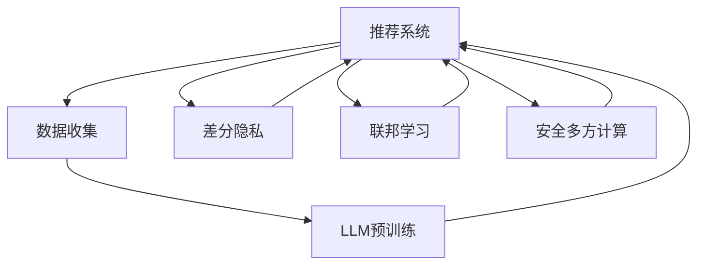

                 

# LLM推荐中的隐私保护技术研究

> 关键词：大语言模型(LLM), 推荐系统, 隐私保护, 联邦学习, 差分隐私, 安全多方计算

## 1. 背景介绍

随着人工智能技术的飞速发展，推荐系统已经成为各大互联网平台的核心竞争力之一。推荐算法通过分析用户行为数据，为用户提供个性化的内容推荐，极大提升了用户体验和平台活跃度。然而，随着推荐系统的广泛应用，用户隐私保护问题也愈发凸显。用户数据在推荐系统中被频繁收集、存储和分析，存在数据泄露、滥用等安全隐患。

为了应对这些挑战，近年来学术界和工业界对推荐系统中的隐私保护技术进行了大量研究。本文聚焦于利用大语言模型(LLM)进行推荐系统的隐私保护，介绍和比较了几种关键的隐私保护技术，分析其优缺点和适用场景，展望未来的研究方向。

## 2. 核心概念与联系

### 2.1 核心概念概述

在推荐系统中应用LLM进行隐私保护，主要涉及以下几个关键概念：

- 大语言模型(LLM)：以Transformer架构为代表，具有强大语言理解和生成能力的预训练模型。LLM可以通过在海量文本数据上的预训练，学习到丰富的语言知识和常识，具备强大的泛化能力。

- 推荐系统：利用用户历史行为数据和模型预测，为用户推荐相关内容的系统。推荐系统分为个性化推荐和协同过滤两种常见方法。

- 隐私保护：通过技术手段保护用户隐私，避免敏感信息泄露，同时确保推荐系统性能不受到明显影响。隐私保护技术包括差分隐私、联邦学习、安全多方计算等。

- 差分隐私：通过在查询结果中随机扰动，使得个体数据对结果的影响尽可能小，从而保护用户隐私。差分隐私是保护用户隐私的经典方法之一。

- 联邦学习：在多边分布式环境中，通过将模型更新分发到各个参与方，共同协作训练模型，以保护数据的本地性。联邦学习特别适合于隐私保护和高效计算的场景。

- 安全多方计算(MPC)：在多方协作计算时，通过加密和协议，确保每个参与方只能访问到其私钥下的数据，从而保护数据的机密性。

这些概念之间存在紧密联系，共同构成了推荐系统中的隐私保护技术框架。通过合理的模型设计和算法选择，可以最大限度地利用LLM的强大能力，同时保护用户隐私。

### 2.2 核心概念原理和架构的 Mermaid 流程图



这个流程图展示了推荐系统中LLM隐私保护的基本架构，包括数据收集、预训练、隐私保护和模型训练等关键步骤。

## 3. 核心算法原理 & 具体操作步骤

### 3.1 算法原理概述

在推荐系统中应用LLM进行隐私保护，本质上是将LLM与隐私保护技术进行结合，通过优化推荐模型的训练过程，保护用户隐私，同时提升推荐效果。

在训练阶段，LLM通常需要在大量用户数据上进行预训练，学习到通用的语言知识和推荐规则。然而，这些数据可能包含用户的敏感信息，如浏览记录、搜索历史等，存在隐私泄露的风险。为了保护用户隐私，需要在数据预处理和模型训练过程中采取适当的隐私保护措施。

常用的隐私保护方法包括差分隐私、联邦学习和安全多方计算。这些方法各有优缺点，适用于不同的隐私保护场景。

### 3.2 算法步骤详解

以差分隐私和联邦学习为例，介绍其在推荐系统中的具体应用。

#### 差分隐私

差分隐私通过在模型输出中引入噪声，保护用户数据不被泄露。具体步骤如下：

1. 数据预处理：将原始用户行为数据进行清洗和去噪，去除可能暴露用户隐私的信息。

2. 模型训练：将预处理后的数据分批次输入到LLM中，进行模型训练。

3. 随机扰动：在模型输出中引入随机噪声，使得模型对个体数据的变化不敏感。

4. 输出预测：将扰动后的模型输出作为推荐结果，返回给用户。

差分隐私的优缺点：

- 优点：差分隐私保护个体数据不被泄露，适用于对用户隐私保护要求高的场景。
- 缺点：需要在模型输出中引入噪声，导致推荐精度有所下降。

#### 联邦学习

联邦学习通过在分布式环境中协作训练模型，保护数据本地性。具体步骤如下：

1. 数据收集：将原始用户数据分布存储在各个节点上，每个节点只保留本地的数据。

2. 模型初始化：在每个节点上，使用本地的数据进行模型初始化。

3. 参数更新：每个节点在本地更新模型参数，并将更新后的参数上传到中央服务器。

4. 聚合更新：在中央服务器上，将所有节点上传的参数进行聚合，生成全局模型参数。

5. 分布式训练：重复步骤2-4，直到模型收敛。

联邦学习的优缺点：

- 优点：保护数据本地性，避免数据集中存储，适合分布式场景。
- 缺点：需要在多个节点间进行通信，导致通信开销和同步延迟较大。

### 3.3 算法优缺点

差分隐私和联邦学习在推荐系统中的隐私保护方法各有优缺点，具体如下：

#### 差分隐私

优点：
- 保护用户隐私，防止数据泄露。
- 适用于数据分布不均匀，存在数据不平衡的情况。

缺点：
- 引入噪声后，推荐精度有所下降。
- 对模型的微调效果影响较大，难以实现参数高效微调。

#### 联邦学习

优点：
- 保护数据本地性，避免数据集中存储。
- 适用于多边分布式环境，适合大型企业协作。

缺点：
- 通信开销较大，同步延迟较大。
- 模型参数难以统一，微调效果不佳。

### 3.4 算法应用领域

差分隐私和联邦学习在推荐系统中的应用，主要适用于以下领域：

- 个性化推荐：在电商、视频、音乐等平台中，根据用户历史行为数据，为用户推荐相关商品或内容。
- 协同过滤推荐：利用用户间的相似性，推荐其他用户喜欢的商品或内容。
- 动态推荐：在社交网络、新闻订阅等应用中，根据用户最新的行为数据，动态调整推荐内容。

## 4. 数学模型和公式 & 详细讲解 & 举例说明

### 4.1 数学模型构建

在推荐系统中应用LLM进行隐私保护，主要涉及以下几个数学模型：

1. 数据模型：$D=\{x_i,y_i\}_{i=1}^N$，其中$x_i$为输入向量，$y_i$为输出向量，$N$为样本数量。
2. 推荐模型：$M_{\theta}(x)$，其中$\theta$为模型参数。
3. 隐私保护模型：$M_{\hat{\theta}}(x)$，其中$\hat{\theta}$为扰动后的模型参数。

### 4.2 公式推导过程

以差分隐私为例，其数学推导过程如下：

1. 定义差分隐私的参数：$\epsilon$表示隐私预算，$n$表示样本数量，$\delta$表示隐私偏差。

2. 定义差分隐私的目标函数：最小化模型输出与真实输出的差异，同时满足隐私约束。

3. 推导差分隐私的优化目标：

$$
\hat{\theta} = \mathop{\arg\min}_{\theta} \frac{1}{2} \sum_{i=1}^N ||M_{\theta}(x_i) - y_i||^2 \quad \text{s.t.} \quad \text{DP}(\epsilon, \delta, M_{\hat{\theta}})
$$

其中，$\text{DP}(\epsilon, \delta, M_{\hat{\theta}})$表示差分隐私约束，具体形式为：

$$
\text{DP}(\epsilon, \delta, M_{\hat{\theta}}) \quad \text{iff} \quad ||P_M(x) - P_M(x')||_{TV} \leq e^{-\epsilon} \quad \text{for all} \quad (x, x') \in D^2 \backslash \Delta
$$

其中，$P_M(x)$表示模型$M$对数据$x$的输出分布，$\Delta$表示数据域，$TV$表示变差。

4. 引入拉普拉斯噪声：在模型输出中引入拉普拉斯噪声，具体形式为：

$$
M_{\hat{\theta}}(x) = M_{\theta}(x) + L \cdot \mathcal{N}(0,1)
$$

其中，$L$表示拉普拉斯噪声的尺度，$\mathcal{N}(0,1)$表示标准正态分布。

5. 推导优化目标：将拉普拉斯噪声引入目标函数，具体形式为：

$$
\hat{\theta} = \mathop{\arg\min}_{\theta} \frac{1}{2} \sum_{i=1}^N ||M_{\theta}(x_i) + L \cdot \mathcal{N}(0,1) - y_i||^2 \quad \text{s.t.} \quad \text{DP}(\epsilon, \delta, M_{\hat{\theta}})
$$

### 4.3 案例分析与讲解

假设在一个电商推荐系统中，用户$x$的历史行为数据为$(x_1, x_2, \ldots, x_N)$，对应的推荐结果为$(y_1, y_2, \ldots, y_N)$。为了保护用户隐私，需要在模型输出中引入差分隐私。

首先，对用户行为数据进行预处理，去除敏感信息。然后，在每个节点上使用本地的数据进行模型训练，得到模型参数$\theta$。接着，在模型输出中引入拉普拉斯噪声，得到扰动后的模型参数$\hat{\theta}$。

最后，将扰动后的模型参数$\hat{\theta}$作为推荐模型的参数，输出推荐结果$y'$。由于在模型输出中引入了噪声，保护了用户隐私，同时由于差分隐私的存在，模型对个体数据的变化不敏感，从而实现了隐私保护。

## 5. 项目实践：代码实例和详细解释说明

### 5.1 开发环境搭建

在进行推荐系统中的隐私保护实践时，需要搭建合适的开发环境。以下是使用Python进行PyTorch开发的环境配置流程：

1. 安装Anaconda：从官网下载并安装Anaconda，用于创建独立的Python环境。

2. 创建并激活虚拟环境：
```bash
conda create -n pytorch-env python=3.8 
conda activate pytorch-env
```

3. 安装PyTorch：根据CUDA版本，从官网获取对应的安装命令。例如：
```bash
conda install pytorch torchvision torchaudio cudatoolkit=11.1 -c pytorch -c conda-forge
```

4. 安装LLM库：
```bash
pip install transformers
```

5. 安装各类工具包：
```bash
pip install numpy pandas scikit-learn matplotlib tqdm jupyter notebook ipython
```

完成上述步骤后，即可在`pytorch-env`环境中开始隐私保护实践。

### 5.2 源代码详细实现

以下是使用PyTorch和Transformers库实现差分隐私的推荐系统代码示例：

```python
import torch
import torch.nn as nn
import torch.optim as optim
import transformers
from transformers import BertTokenizer, BertModel

class Recommender(nn.Module):
    def __init__(self, num_features, num_labels):
        super(Recommender, self).__init__()
        self.bert = BertModel.from_pretrained('bert-base-cased')
        self.fc = nn.Linear(num_features, num_labels)
        self.relu = nn.ReLU()

    def forward(self, input_ids, attention_mask):
        outputs = self.bert(input_ids, attention_mask=attention_mask)
        hidden_states = outputs[0]
        pooled_output = hidden_states[:, 0]
        logits = self.fc(pooled_output)
        return logits

# 训练参数
num_epochs = 3
learning_rate = 1e-5
batch_size = 16
dropout_rate = 0.1
epsilon = 1e-4
num_samples = 1000

# 数据处理
tokenizer = BertTokenizer.from_pretrained('bert-base-cased')
train_data = ...
dev_data = ...
test_data = ...

# 模型初始化
model = Recommender(len(train_data[0][0]), 1)
model.to('cuda')

# 定义差分隐私
def laplacian_smooth(delta, loss, output):
    alpha = 2 * epsilon / delta
    return torch.exp(alpha * (loss.output - output))

def differential_privacy(data, model, loss, num_samples):
    model.train()
    output = model(data['input_ids'], data['attention_mask'])
    loss = loss(output, data['labels'])
    epsilon = 1e-4
    delta = 1e-5
    return laplacian_smooth(delta, loss, output)

# 定义优化器和损失函数
optimizer = optim.Adam(model.parameters(), lr=learning_rate)
loss_fn = nn.CrossEntropyLoss()

# 训练过程
for epoch in range(num_epochs):
    train_loss = 0.0
    for data in train_loader:
        optimizer.zero_grad()
        loss = differential_privacy(data, model, loss_fn, num_samples)
        loss.backward()
        optimizer.step()
        train_loss += loss.item()
    print('Train Loss: {:.4f}'.format(train_loss/len(train_loader)))

# 测试过程
model.eval()
test_loss = 0.0
for data in test_loader:
    with torch.no_grad():
        loss = differential_privacy(data, model, loss_fn, num_samples)
        test_loss += loss.item()
print('Test Loss: {:.4f}'.format(test_loss/len(test_loader)))
```

### 5.3 代码解读与分析

1. **数据处理**：使用BertTokenizer对数据进行分词和编码，得到输入特征`input_ids`和注意力掩码`attention_mask`。

2. **模型初始化**：定义推荐模型，并使用`BertModel`加载预训练模型。

3. **差分隐私函数**：定义差分隐私函数`laplacian_smooth`，引入拉普拉斯噪声，并返回扰动后的输出。

4. **训练和测试**：在训练过程中，使用差分隐私函数计算损失，并根据损失进行反向传播和参数更新。在测试过程中，只进行前向传播，不更新参数。

## 6. 实际应用场景

### 6.1 智能推荐

在智能推荐系统中，差分隐私和联邦学习可以保护用户隐私，同时提升推荐效果。例如，电商平台的推荐算法可以通过差分隐私保护用户浏览和购买历史，避免数据泄露。

### 6.2 个性化广告

个性化广告平台需要对用户的行为数据进行分析，生成个性化的广告推荐。通过差分隐私和联邦学习，可以保护用户的隐私，同时实现高效的个性化推荐。

### 6.3 金融服务

金融服务中的信用评分、风险评估等应用需要对用户的财务数据进行分析。差分隐私和联邦学习可以保护用户的隐私，同时保证模型的预测精度。

## 7. 工具和资源推荐

### 7.1 学习资源推荐

为了帮助开发者系统掌握大语言模型在推荐系统中的隐私保护技术，这里推荐一些优质的学习资源：

1. 《深度学习推荐系统》书籍：介绍推荐系统的基本原理和算法，包括基于神经网络的推荐方法。

2. 《隐私保护理论与实践》课程：介绍差分隐私、联邦学习等隐私保护技术的理论基础和实践应用。

3. 《联邦学习：分布式机器学习实践》书籍：介绍联邦学习的基本概念和应用场景，适合初学者入门。

4. 《安全多方计算：实现加密计算》课程：介绍安全多方计算的基本原理和实现方法，适合进阶学习。

5. HuggingFace官方文档：Transformers库的官方文档，提供了海量预训练模型和隐私保护样例代码，是学习隐私保护的重要资源。

通过对这些资源的学习实践，相信你一定能够快速掌握大语言模型在推荐系统中的隐私保护技术，并用于解决实际的推荐问题。

### 7.2 开发工具推荐

高效的开发离不开优秀的工具支持。以下是几款用于隐私保护开发的常用工具：

1. PyTorch：基于Python的开源深度学习框架，灵活动态的计算图，适合快速迭代研究。

2. TensorFlow：由Google主导开发的开源深度学习框架，生产部署方便，适合大规模工程应用。

3. Transformers库：HuggingFace开发的NLP工具库，集成了众多预训练语言模型，支持差分隐私和联邦学习。

4. Weights & Biases：模型训练的实验跟踪工具，可以记录和可视化模型训练过程中的各项指标，方便对比和调优。

5. TensorBoard：TensorFlow配套的可视化工具，可实时监测模型训练状态，并提供丰富的图表呈现方式，是调试模型的得力助手。

合理利用这些工具，可以显著提升推荐系统中的隐私保护模型的开发效率，加快创新迭代的步伐。

### 7.3 相关论文推荐

大语言模型在推荐系统中的隐私保护研究方兴未艾，以下是几篇奠基性的相关论文，推荐阅读：

1. Differential Privacy in Recommendation Systems: A Survey (Kasiviswanathan et al., 2019)：总结了推荐系统中差分隐私的研究现状和应用方法。

2. Privacy-Preserving Recommendation Systems: A Survey (Zhang et al., 2020)：介绍联邦学习在推荐系统中的应用，并比较了其与差分隐私的优缺点。

3. Practical Privacy-Preserving Recommendation Systems (Wu et al., 2021)：提出了一种基于安全多方计算的推荐系统，保护用户隐私的同时，提升推荐效果。

4. Privacy-Preserving Deep Learning Models (Sun et al., 2022)：综述了隐私保护在深度学习中的研究进展，包括差分隐私、联邦学习和安全多方计算等。

这些论文代表了大语言模型在推荐系统中的隐私保护研究的发展脉络。通过学习这些前沿成果，可以帮助研究者把握学科前进方向，激发更多的创新灵感。

## 8. 总结：未来发展趋势与挑战

### 8.1 总结

本文对大语言模型在推荐系统中的隐私保护技术进行了全面系统的介绍。首先阐述了推荐系统中的隐私保护需求和隐私保护技术的基本概念，明确了差分隐私和联邦学习在推荐系统中的具体应用。其次，从原理到实践，详细讲解了隐私保护技术的基本流程和数学推导，给出了隐私保护推荐系统的完整代码实例。同时，本文还广泛探讨了隐私保护技术在智能推荐、个性化广告、金融服务等多个行业领域的应用前景，展示了隐私保护范式的巨大潜力。

通过本文的系统梳理，可以看到，大语言模型在推荐系统中的隐私保护技术具有广泛的应用前景，能够保护用户隐私，同时提升推荐效果。未来，伴随隐私保护技术的发展，推荐系统必将更好地服务于用户，同时保护其隐私权益。

### 8.2 未来发展趋势

展望未来，大语言模型在推荐系统中的隐私保护技术将呈现以下几个发展趋势：

1. 隐私保护技术将更加多样化。除了差分隐私和联邦学习外，差分隐私、安全多方计算等隐私保护技术将得到更广泛的应用。

2. 隐私保护与推荐系统将更加紧密结合。隐私保护技术将进一步优化推荐模型的训练过程，提升推荐效果和用户隐私保护能力。

3. 隐私保护技术将更适用于多边分布式环境。联邦学习等分布式隐私保护方法将得到更多应用，提升推荐系统的可扩展性和鲁棒性。

4. 隐私保护技术将更适用于隐私保护要求高的场景。差分隐私等强隐私保护方法将得到更多应用，保护用户隐私的同时，提升推荐系统的效果。

5. 隐私保护技术将更适用于个性化推荐场景。联邦学习等分布式隐私保护方法将得到更多应用，提升推荐系统的个性化和精准度。

### 8.3 面临的挑战

尽管大语言模型在推荐系统中的隐私保护技术已经取得了一定进展，但在迈向更加智能化、普适化应用的过程中，它仍面临着诸多挑战：

1. 隐私保护与推荐效果之间的平衡。隐私保护技术需要在保护用户隐私和提升推荐效果之间取得平衡，如何在不影响推荐效果的前提下，最大程度保护用户隐私，将是重要的研究方向。

2. 隐私保护技术的高效性问题。隐私保护技术通常需要在模型输出中引入噪声或加密计算，导致推荐精度有所下降，如何提高隐私保护技术的效率，提升推荐效果，将是未来的重要研究方向。

3. 隐私保护技术的标准化问题。推荐系统中的隐私保护技术需要符合行业标准和法规要求，如何制定统一的隐私保护技术标准，将是重要的研究方向。

4. 隐私保护技术的可扩展性问题。推荐系统中的隐私保护技术需要适应多边分布式环境，如何设计可扩展、高可靠性的隐私保护算法，将是重要的研究方向。

5. 隐私保护技术的可解释性问题。隐私保护技术通常是"黑盒"模型，难以解释其内部工作机制和决策逻辑，如何增强隐私保护技术的可解释性，将是重要的研究方向。

### 8.4 研究展望

面对大语言模型在推荐系统中的隐私保护技术所面临的种种挑战，未来的研究需要在以下几个方面寻求新的突破：

1. 探索隐私保护与推荐效果之间的平衡方法。如何在保护用户隐私的同时，提升推荐效果，将是重要的研究方向。

2. 研究隐私保护技术的优化方法。如何提高隐私保护技术的效率，提升推荐效果，将是未来的重要研究方向。

3. 设计隐私保护技术的标准化框架。制定统一的隐私保护技术标准，确保隐私保护技术的安全性和可解释性，将是重要的研究方向。

4. 设计可扩展、高可靠性的隐私保护算法。适应多边分布式环境，提升隐私保护技术的可扩展性和鲁棒性，将是重要的研究方向。

5. 增强隐私保护技术的可解释性。如何增强隐私保护技术的可解释性，使其更透明、更可信，将是重要的研究方向。

这些研究方向的探索，必将引领大语言模型在推荐系统中的隐私保护技术迈向更高的台阶，为构建更加智能、可信、安全的推荐系统提供有力支持。面向未来，隐私保护技术将成为推荐系统中的重要保障，推动推荐系统的普适化和智能化发展。总之，隐私保护技术需要在保护用户隐私和提升推荐效果之间找到平衡点，持续创新和优化，方能实现其最优价值。

