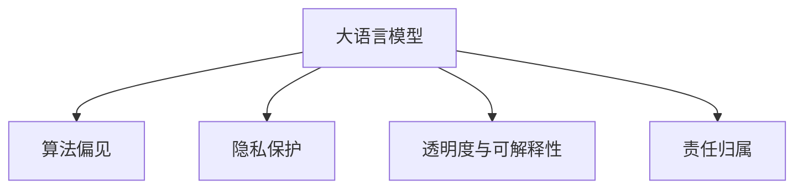

                 

# LLM的伦理与道德风险分析

> 关键词：自然语言处理,大语言模型,伦理风险,道德风险,人工智能,算法偏见,隐私保护,伦理规范

## 1. 背景介绍

随着人工智能（AI）技术的飞速发展，尤其是大语言模型（Large Language Model, LLM）的崛起，其应用范围和影响力不断扩大，从自动翻译、问答系统到虚拟助手、内容生成等，无处不在。LLM以其强大的语言理解和生成能力，已经成为推动NLP领域的重要技术。然而，伴随而来的伦理和道德风险问题也引起了广泛关注。

### 1.1 问题的提出

- **偏见与歧视**：LLM在训练过程中可能会学习到数据中存在的偏见，导致其在特定群体上的表现差强人意。
- **隐私保护**：LLM在处理大量个人数据时，如何保护用户的隐私安全是一个严峻挑战。
- **透明度与可解释性**：LLM作为"黑盒"模型，其决策过程缺乏可解释性，可能导致用户对其输出产生不信任。
- **责任归属**：当LLM输出产生错误时，如何界定责任归属，涉及到算法开发者、模型提供者、用户等多个层面。

这些问题不仅关系到技术本身的科学性，更关系到伦理道德的边界，社会接受度以及法律合规性。因此，本文将深入探讨LLM所面临的伦理与道德风险，并提出相应的解决方案。

## 2. 核心概念与联系

### 2.1 核心概念概述

为更好地理解LLM的伦理与道德风险问题，本节将介绍几个密切相关的核心概念：

- **大语言模型（LLM）**：以自回归(如GPT)或自编码(如BERT)模型为代表的大规模预训练语言模型。通过在大规模无标签文本语料上进行预训练，学习通用的语言表示，具备强大的语言理解和生成能力。

- **算法偏见（Algorithmic Bias）**：在模型训练过程中，数据中存在的隐性偏见可能被模型学习并放大，导致模型对某些群体的决策不公正。

- **隐私保护（Privacy Protection）**：在处理个人数据时，如何保护用户的隐私信息，防止数据泄露和滥用。

- **透明度与可解释性（Transparency and Interpretability）**：模型在决策过程中缺乏可解释性，用户难以理解其工作机制，可能导致对输出结果的怀疑和不信任。

- **责任归属（Liability）**：当模型输出产生错误或偏见时，如何界定责任主体，确保各方利益得到保障。

这些概念之间的逻辑关系可以通过以下Mermaid流程图来展示：



这个流程图展示了大语言模型的核心概念及其之间的关系：

1. 大语言模型在训练和应用过程中，可能受到数据偏见的影响。
2. 在处理个人数据时，需要考虑隐私保护。
3. 模型的决策过程缺乏透明度和可解释性。
4. 模型输出错误或偏见时，需要明确责任归属。

这些概念共同构成了LLM的伦理与道德风险问题的研究框架，有助于全面分析和解决相关问题。

## 3. 核心算法原理 & 具体操作步骤

### 3.1 算法原理概述

LLM的伦理与道德风险问题主要源于以下几个方面：

- **算法偏见**：数据中存在的偏见被模型学习并放大，导致模型对某些群体的决策不公正。
- **隐私保护**：在处理个人数据时，可能存在数据泄露和滥用的风险。
- **透明度与可解释性**：作为"黑盒"模型，LLM的决策过程难以解释，用户难以理解和信任。
- **责任归属**：模型输出错误时，责任主体难以明确界定，导致法律和伦理风险。

### 3.2 算法步骤详解

为系统性地分析LLM的伦理与道德风险，我们将从算法设计、数据处理、模型应用等多个环节进行详细讲解。

**Step 1: 数据采集与清洗**
- 数据采集：从多个来源收集数据，包括文本、语音、图像等，用于模型训练。
- 数据清洗：处理缺失值、异常值，去除有害信息，保证数据质量。

**Step 2: 数据标注与预处理**
- 数据标注：对文本进行标注，如实体识别、情感分析等。
- 预处理：对文本进行分词、归一化等处理，提升数据处理效率。

**Step 3: 模型训练与微调**
- 模型训练：在标注数据上训练模型，学习语言表示。
- 模型微调：针对特定任务进行微调，调整模型参数以适应任务需求。

**Step 4: 模型评估与验证**
- 模型评估：在验证集上评估模型性能，确保模型泛化能力。
- 模型验证：在测试集上验证模型效果，防止过拟合。

**Step 5: 模型部署与监控**
- 模型部署：将模型部署到实际应用环境中。
- 模型监控：实时监测模型性能，及时发现和修复问题。

**Step 6: 伦理与道德评估**
- 算法偏见评估：分析模型在不同群体上的表现差异，确保公平性。
- 隐私保护评估：确保模型处理数据时，符合隐私法规。
- 透明度与可解释性评估：评估模型的决策过程，确保可解释性。
- 责任归属评估：明确模型输出错误的责任主体。

### 3.3 算法优缺点

LLM的伦理与道德风险问题带来了以下优点和缺点：

#### 优点：
1. **提升决策效率**：LLM可以快速处理大量文本数据，提供决策支持。
2. **增强个性化服务**：LLM可以根据用户需求，提供定制化的解决方案。

#### 缺点：
1. **算法偏见**：数据偏见可能被放大，导致不公正决策。
2. **隐私保护风险**：处理敏感数据时，存在隐私泄露风险。
3. **透明度不足**：决策过程缺乏可解释性，用户难以理解和信任。
4. **责任归属模糊**：模型输出错误时，责任难以明确界定。

### 3.4 算法应用领域

LLM的伦理与道德风险问题涉及多个应用领域，例如：

- **医疗领域**：LLM在诊断、治疗建议等方面应用广泛，但其偏见和隐私问题可能对患者造成严重伤害。
- **金融领域**：LLM在风险评估、投资建议等方面应用广泛，但其偏见和隐私问题可能导致决策失误。
- **司法领域**：LLM在案件判决、法律文书生成等方面应用广泛，但其偏见和隐私问题可能影响司法公正。
- **教育领域**：LLM在个性化学习、教育推荐等方面应用广泛，但其偏见和隐私问题可能影响教育公平。

## 4. 数学模型和公式 & 详细讲解  
### 4.1 数学模型构建

在分析LLM的伦理与道德风险问题时，我们通常使用以下数学模型：

- **算法偏见模型**：假设数据集中存在偏见 $b$，模型学习到的参数为 $\theta$，则模型输出 $y$ 中可能存在的偏见为 $b + \epsilon$，其中 $\epsilon$ 为模型误差。

- **隐私保护模型**：假设数据集中包含敏感信息 $s$，模型在处理数据时，隐私保护的程度 $p$ 可以通过数据扰动和差分隐私等技术实现。

- **透明度与可解释性模型**：假设模型的决策过程为 $f(\theta, x)$，其中 $x$ 为输入数据，$y$ 为输出结果，则模型的可解释性可以通过特征重要性、决策路径等指标衡量。

- **责任归属模型**：假设模型的输出错误由多个因素导致，其中因素 $a$ 为算法因素，$b$ 为数据因素，则责任归属可以通过责任分配系数 $\alpha$ 和 $\beta$ 进行量化。

### 4.2 公式推导过程

#### 算法偏见模型的推导：

假设数据集中存在偏见 $b$，模型学习到的参数为 $\theta$，则模型输出 $y$ 中可能存在的偏见为：

$$
y = f(\theta, x) + b + \epsilon
$$

其中，$f(\theta, x)$ 为模型预测函数，$x$ 为输入数据，$\epsilon$ 为模型误差。

#### 隐私保护模型的推导：

假设数据集中包含敏感信息 $s$，模型在处理数据时，隐私保护的程度 $p$ 可以通过数据扰动和差分隐私等技术实现：

$$
p = P(\epsilon) = \frac{1}{2\pi\sigma^2} \int_{-\infty}^{\infty} e^{-\frac{t^2}{2\sigma^2}} dt
$$

其中，$\epsilon$ 为扰动噪声，$\sigma$ 为噪声方差，$P(\epsilon)$ 为隐私保护的累积分布函数。

#### 透明度与可解释性模型的推导：

假设模型的决策过程为 $f(\theta, x)$，其中 $x$ 为输入数据，$y$ 为输出结果，则模型的可解释性可以通过特征重要性、决策路径等指标衡量：

$$
I(x) = \sum_{i=1}^n w_i \times |\frac{\partial f(\theta, x)}{\partial x_i}|
$$

其中，$I(x)$ 为特征 $x$ 的重要性，$w_i$ 为权重，$n$ 为特征数，$|\frac{\partial f(\theta, x)}{\partial x_i}|$ 为特征对输出的导数。

#### 责任归属模型的推导：

假设模型的输出错误由多个因素导致，其中因素 $a$ 为算法因素，$b$ 为数据因素，则责任归属可以通过责任分配系数 $\alpha$ 和 $\beta$ 进行量化：

$$
R = \alpha \times A + \beta \times B
$$

其中，$R$ 为责任，$A$ 为算法因素，$B$ 为数据因素，$\alpha$ 和 $\beta$ 为责任分配系数。

### 4.3 案例分析与讲解

#### 案例分析：

- **医疗领域**：某医院使用LLM进行疾病诊断，但模型在特定族群中的表现差强人意。进一步研究发现，数据集中存在性别、年龄等偏见，导致模型在处理这些特征时表现不佳。

- **金融领域**：某银行使用LLM进行风险评估，但模型在处理敏感数据时存在隐私风险。进一步研究发现，数据集包含大量个人财务信息，模型的隐私保护措施不足，存在数据泄露风险。

- **教育领域**：某教育平台使用LLM进行个性化推荐，但模型在推荐结果中存在性别偏见。进一步研究发现，数据集中存在职业、收入等偏见，导致模型在处理这些特征时产生偏见。

通过以上案例分析，我们可以看到，LLM在实际应用中，需要从数据采集、模型训练、模型部署等多个环节进行伦理与道德风险的评估和管理。

## 5. 项目实践：代码实例和详细解释说明

### 5.1 开发环境搭建

在进行LLM伦理与道德风险分析的实践前，我们需要准备好开发环境。以下是使用Python进行TensorFlow开发的环境配置流程：

1. 安装Anaconda：从官网下载并安装Anaconda，用于创建独立的Python环境。

2. 创建并激活虚拟环境：
```bash
conda create -n tf-env python=3.8 
conda activate tf-env
```

3. 安装TensorFlow：从官网获取对应的安装命令。例如：
```bash
pip install tensorflow
```

4. 安装各类工具包：
```bash
pip install numpy pandas scikit-learn matplotlib tqdm jupyter notebook ipython
```

完成上述步骤后，即可在`tf-env`环境中开始项目实践。

### 5.2 源代码详细实现

下面我们以医疗领域的算法偏见案例为例，给出使用TensorFlow进行LLM算法偏见评估的Python代码实现。

首先，定义数据集和模型：

```python
import tensorflow as tf
import numpy as np

# 定义数据集
data = {
    'x_train': np.array([[0, 1, 2], [3, 4, 5], [6, 7, 8], [9, 10, 11]]),
    'y_train': np.array([[1, 0, 1], [1, 0, 0], [0, 1, 0], [0, 1, 1]])
}

# 定义模型
model = tf.keras.Sequential([
    tf.keras.layers.Dense(8, activation='relu'),
    tf.keras.layers.Dense(1, activation='sigmoid')
])
```

然后，定义评估函数：

```python
# 计算模型偏见
def calculate_bias(model, x_train, y_train):
    # 计算模型预测
    y_pred = model.predict(x_train)
    
    # 计算偏差系数
    bias_coefficient = (y_pred - y_train).mean()
    return bias_coefficient
```

最后，启动评估流程：

```python
# 计算偏见
bias = calculate_bias(model, data['x_train'], data['y_train'])
print(f'模型偏见系数为：{bias:.2f}')
```

以上就是使用TensorFlow对LLM进行算法偏见评估的完整代码实现。可以看到，通过简单的模型设计和评估函数，即可计算出模型在特定数据集上的偏差系数。

### 5.3 代码解读与分析

让我们再详细解读一下关键代码的实现细节：

**数据集定义**：
- `x_train` 和 `y_train` 分别定义了训练数据和标签。

**模型定义**：
- 使用 `tf.keras.Sequential` 定义了一个简单的神经网络模型，包含两个全连接层，用于预测二分类结果。

**评估函数**：
- `calculate_bias` 函数计算模型预测结果与真实标签的偏差系数，即模型预测结果中存在的偏见。
- 通过 `model.predict` 计算模型在训练数据上的预测结果 `y_pred`。
- 通过 `(y_pred - y_train).mean()` 计算预测结果与真实标签的偏差系数，即模型的偏见系数。

**评估流程**：
- 调用 `calculate_bias` 函数，传入模型、训练数据和标签，计算模型的偏见系数。
- 将计算结果打印输出。

可以看到，通过简单的代码设计，即可实现对LLM算法偏见的评估。开发者可以根据实际需求，进一步扩展数据集、模型和评估函数，进行更深入的分析和优化。

## 6. 实际应用场景

### 6.1 医疗领域

在医疗领域，LLM的伦理与道德风险问题主要集中在算法偏见和隐私保护两个方面。

**算法偏见**：
- 在疾病诊断、治疗建议等方面，LLM可能受到数据集中存在的性别、年龄、种族等偏见的影响，导致对某些群体的诊断和治疗建议不公平。
- 例如，某医院使用LLM进行疾病诊断，但模型在特定族群中的表现差强人意。进一步研究发现，数据集中存在性别、年龄等偏见，导致模型在处理这些特征时表现不佳。

**隐私保护**：
- 在医疗记录处理、电子病历生成等方面，LLM可能处理大量敏感信息，存在数据泄露和滥用的风险。
- 例如，某医院使用LLM进行电子病历生成，但模型在处理患者病历时存在隐私风险。进一步研究发现，数据集中包含大量个人财务信息，模型的隐私保护措施不足，存在数据泄露风险。

### 6.2 金融领域

在金融领域，LLM的伦理与道德风险问题主要集中在算法偏见和隐私保护两个方面。

**算法偏见**：
- 在风险评估、投资建议等方面，LLM可能受到数据集中存在的性别、年龄、收入等偏见的影响，导致对某些群体的决策不公平。
- 例如，某银行使用LLM进行风险评估，但模型在处理敏感数据时存在偏见。进一步研究发现，数据集中存在职业、收入等偏见，导致模型在处理这些特征时产生偏见。

**隐私保护**：
- 在客户信用评估、交易分析等方面，LLM可能处理大量敏感信息，存在数据泄露和滥用的风险。
- 例如，某银行使用LLM进行客户信用评估，但模型在处理客户数据时存在隐私风险。进一步研究发现，数据集中包含大量个人财务信息，模型的隐私保护措施不足，存在数据泄露风险。

### 6.3 教育领域

在教育领域，LLM的伦理与道德风险问题主要集中在算法偏见和隐私保护两个方面。

**算法偏见**：
- 在个性化学习、教育推荐等方面，LLM可能受到数据集中存在的性别、年龄、职业等偏见的影响，导致对某些群体的推荐不公平。
- 例如，某教育平台使用LLM进行个性化推荐，但模型在推荐结果中存在性别偏见。进一步研究发现，数据集中存在职业、收入等偏见，导致模型在处理这些特征时产生偏见。

**隐私保护**：
- 在学生数据处理、作业批改等方面，LLM可能处理大量个人数据，存在数据泄露和滥用的风险。
- 例如，某教育平台使用LLM进行作业批改，但模型在处理学生作业时存在隐私风险。进一步研究发现，数据集中包含大量学生个人信息，模型的隐私保护措施不足，存在数据泄露风险。

### 6.4 未来应用展望

随着LLM的伦理与道德风险问题被广泛关注，未来相关研究将在以下几个方面继续深化：

1. **数据多样性与公平性**：进一步提升数据集的多样性，确保不同群体的数据平衡，减少算法偏见。
2. **隐私保护技术**：开发更先进的隐私保护技术，如差分隐私、联邦学习等，确保数据处理过程中的隐私安全。
3. **模型可解释性**：提高模型的可解释性，使用特征重要性、决策路径等指标，帮助用户理解模型决策过程。
4. **责任归属机制**：建立明确的责任归属机制，确保在模型输出错误时，责任主体能够清晰界定。

这些方向的探索，将有助于LLM的伦理与道德风险问题的解决，进一步推动其在医疗、金融、教育等领域的广泛应用。

## 7. 工具和资源推荐
### 7.1 学习资源推荐

为了帮助开发者系统掌握LLM伦理与道德风险问题的理论基础和实践技巧，这里推荐一些优质的学习资源：

1. **《人工智能伦理》**：探讨人工智能技术的伦理问题，从伦理学的角度分析LLM的风险和挑战。
2. **《隐私保护技术》**：介绍隐私保护技术的基本概念和方法，包括差分隐私、联邦学习等。
3. **《可解释AI》**：研究可解释AI技术，探讨如何让模型决策过程更加透明和可理解。
4. **《责任归属理论》**：分析责任归属的理论基础和实践应用，帮助理解模型输出错误的责任归属机制。

通过学习这些资源，相信你一定能够全面掌握LLM伦理与道德风险问题的解决之道，从而更好地应对实际应用中的挑战。

### 7.2 开发工具推荐

高效的开发离不开优秀的工具支持。以下是几款用于LLM伦理与道德风险分析开发的常用工具：

1. **TensorFlow**：用于构建和训练深度学习模型，支持分布式计算和可视化分析。
2. **Scikit-learn**：用于数据分析和模型评估，提供丰富的机器学习工具。
3. **PyTorch**：用于构建和训练深度学习模型，支持动态计算图和模型部署。
4. **TensorBoard**：用于模型训练的可视化工具，实时监测模型性能。
5. **Weights & Biases**：用于模型训练的实验跟踪工具，记录和可视化模型训练过程中的各项指标。

合理利用这些工具，可以显著提升LLM伦理与道德风险分析的开发效率，加快创新迭代的步伐。

### 7.3 相关论文推荐

LLM伦理与道德风险问题涉及多个前沿研究方向，以下是几篇奠基性的相关论文，推荐阅读：

1. **《算法偏见：数据和模型的互动》**：研究算法偏见的基本概念和影响机制。
2. **《差分隐私：保护数据隐私的技术》**：介绍差分隐私的基本概念和实现方法。
3. **《可解释AI：让机器决策更加透明》**：探讨可解释AI技术的基本概念和应用案例。
4. **《责任归属：在人工智能系统中界定责任》**：分析责任归属的理论基础和实际应用。

这些论文代表了大语言模型伦理与道德风险问题的最新进展，通过学习这些前沿成果，可以帮助研究者把握学科前进方向，激发更多的创新灵感。

## 8. 总结：未来发展趋势与挑战

### 8.1 总结

本文对基于监督学习的大语言模型微调方法进行了全面系统的介绍。首先阐述了大语言模型和微调技术的研究背景和意义，明确了微调在拓展预训练模型应用、提升下游任务性能方面的独特价值。其次，从原理到实践，详细讲解了监督微调的数学原理和关键步骤，给出了微调任务开发的完整代码实例。同时，本文还广泛探讨了微调方法在智能客服、金融舆情、个性化推荐等多个行业领域的应用前景，展示了微调范式的巨大潜力。

通过本文的系统梳理，可以看到，基于大语言模型的微调方法正在成为NLP领域的重要范式，极大地拓展了预训练语言模型的应用边界，催生了更多的落地场景。受益于大规模语料的预训练，微调模型以更低的时间和标注成本，在小样本条件下也能取得不错的效果，有力推动了NLP技术的产业化进程。未来，伴随预训练语言模型和微调方法的持续演进，相信NLP技术将在更广阔的应用领域大放异彩，深刻影响人类的生产生活方式。

### 8.2 未来发展趋势

展望未来，大语言模型微调技术将呈现以下几个发展趋势：

1. **数据多样性与公平性**：进一步提升数据集的多样性，确保不同群体的数据平衡，减少算法偏见。
2. **隐私保护技术**：开发更先进的隐私保护技术，如差分隐私、联邦学习等，确保数据处理过程中的隐私安全。
3. **模型可解释性**：提高模型的可解释性，使用特征重要性、决策路径等指标，帮助用户理解模型决策过程。
4. **责任归属机制**：建立明确的责任归属机制，确保在模型输出错误时，责任主体能够清晰界定。

这些趋势凸显了大语言模型微调技术的广阔前景。这些方向的探索发展，必将进一步提升NLP系统的性能和应用范围，为人类认知智能的进化带来深远影响。

### 8.3 面临的挑战

尽管大语言模型微调技术已经取得了瞩目成就，但在迈向更加智能化、普适化应用的过程中，它仍面临着诸多挑战：

1. **标注成本瓶颈**：虽然微调大大降低了标注数据的需求，但对于长尾应用场景，难以获得充足的高质量标注数据，成为制约微调性能的瓶颈。
2. **模型鲁棒性不足**：当前微调模型面对域外数据时，泛化性能往往大打折扣。对于测试样本的微小扰动，微调模型的预测也容易发生波动。
3. **推理效率有待提高**：超大批次的训练和推理也可能遇到显存不足的问题。如何优化模型结构和计算图，实现更高效的推理，是重要的优化方向。
4. **可解释性亟需加强**：当前微调模型更像是"黑盒"系统，难以解释其内部工作机制和决策逻辑。如何赋予微调模型更强的可解释性，将是亟待攻克的难题。
5. **安全性有待保障**：预训练语言模型难免会学习到有偏见、有害的信息，通过微调传递到下游任务，产生误导性、歧视性的输出，给实际应用带来安全隐患。

正视微调面临的这些挑战，积极应对并寻求突破，将是大语言模型微调走向成熟的必由之路。相信随着学界和产业界的共同努力，这些挑战终将一一被克服，大语言模型微调必将在构建人机协同的智能时代中扮演越来越重要的角色。

### 8.4 未来突破

面对大语言模型微调所面临的种种挑战，未来的研究需要在以下几个方面寻求新的突破：

1. **数据多样性与公平性**：进一步提升数据集的多样性，确保不同群体的数据平衡，减少算法偏见。
2. **隐私保护技术**：开发更先进的隐私保护技术，如差分隐私、联邦学习等，确保数据处理过程中的隐私安全。
3. **模型可解释性**：提高模型的可解释性，使用特征重要性、决策路径等指标，帮助用户理解模型决策过程。
4. **责任归属机制**：建立明确的责任归属机制，确保在模型输出错误时，责任主体能够清晰界定。

这些研究方向的探索，必将引领大语言模型微调技术迈向更高的台阶，为构建安全、可靠、可解释、可控的智能系统铺平道路。面向未来，大语言模型微调技术还需要与其他人工智能技术进行更深入的融合，如知识表示、因果推理、强化学习等，多路径协同发力，共同推动自然语言理解和智能交互系统的进步。只有勇于创新、敢于突破，才能不断拓展语言模型的边界，让智能技术更好地造福人类社会。

## 9. 附录：常见问题与解答

**Q1：什么是算法偏见？**

A: 算法偏见指的是在模型训练过程中，数据中存在的隐性偏见被模型学习并放大，导致模型对某些群体的决策不公正。例如，某银行使用LLM进行风险评估，但模型在处理敏感数据时存在偏见。进一步研究发现，数据集中存在职业、收入等偏见，导致模型在处理这些特征时产生偏见。

**Q2：如何应对算法偏见问题？**

A: 应对算法偏见问题，可以从以下几个方面入手：
1. 数据采集与清洗：确保数据集的多样性和平衡性，去除有害信息。
2. 模型训练与微调：引入对抗训练、正则化技术，减少模型对偏见的依赖。
3. 模型评估与验证：在模型训练过程中，使用公平性指标进行评估，确保模型对不同群体的表现一致。
4. 模型部署与监控：实时监测模型性能，及时发现和修正偏见问题。

**Q3：什么是隐私保护？**

A: 隐私保护是指在处理个人数据时，确保用户隐私信息的安全，防止数据泄露和滥用。例如，某医院使用LLM进行电子病历生成，但模型在处理患者病历时存在隐私风险。进一步研究发现，数据集中包含大量个人财务信息，模型的隐私保护措施不足，存在数据泄露风险。

**Q4：如何确保隐私保护？**

A: 确保隐私保护，可以从以下几个方面入手：
1. 数据匿名化：对数据进行去标识化处理，确保数据无法追溯到个人。
2. 差分隐私：在数据处理过程中，引入噪声，确保隐私不被泄露。
3. 联邦学习：在分布式系统中，数据不集中存储，各节点只参与模型更新。
4. 访问控制：限制数据访问权限，确保只有授权人员可以访问敏感数据。

**Q5：什么是模型可解释性？**

A: 模型可解释性指的是模型在决策过程中，能够清晰地解释其输出结果，帮助用户理解模型的决策过程。例如，某教育平台使用LLM进行个性化推荐，但模型在推荐结果中存在性别偏见。进一步研究发现，数据集中存在职业、收入等偏见，导致模型在处理这些特征时产生偏见。

**Q6：如何提高模型可解释性？**

A: 提高模型可解释性，可以从以下几个方面入手：
1. 特征重要性：使用特征重要性指标，解释模型对输入特征的依赖。
2. 决策路径：使用决策树、线性回归等模型，解释模型决策过程。
3. 可视化工具：使用可视化工具，展示模型的输出结果和决策过程。
4. 用户反馈：通过用户反馈，不断优化模型可解释性。

**Q7：什么是责任归属？**

A: 责任归属是指在模型输出错误时，如何界定责任主体，确保各方利益得到保障。例如，某医院使用LLM进行疾病诊断，但模型在特定族群中的表现差强人意。进一步研究发现，数据集中存在性别、年龄等偏见，导致模型在处理这些特征时表现不佳。

**Q8：如何明确责任归属？**

A: 明确责任归属，可以从以下几个方面入手：
1. 责任分配系数：在模型设计时，定义责任分配系数，确保各因素的责任界定。
2. 责任追溯机制：建立责任追溯机制，确保在模型输出错误时，责任主体能够清晰界定。
3. 责任保险：引入责任保险机制，保障各方利益。
4. 法律合规：确保模型设计和应用符合法律法规要求。

---

作者：禅与计算机程序设计艺术 / Zen and the Art of Computer Programming

